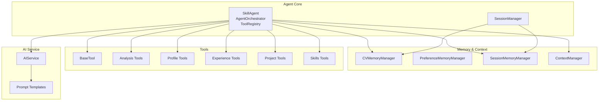
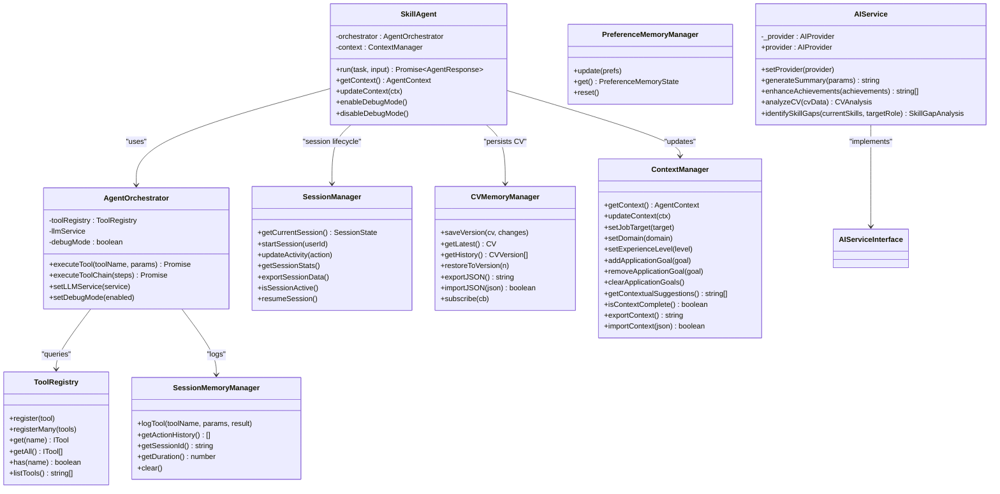
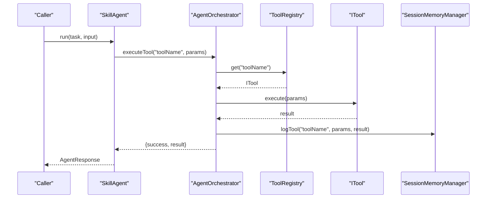
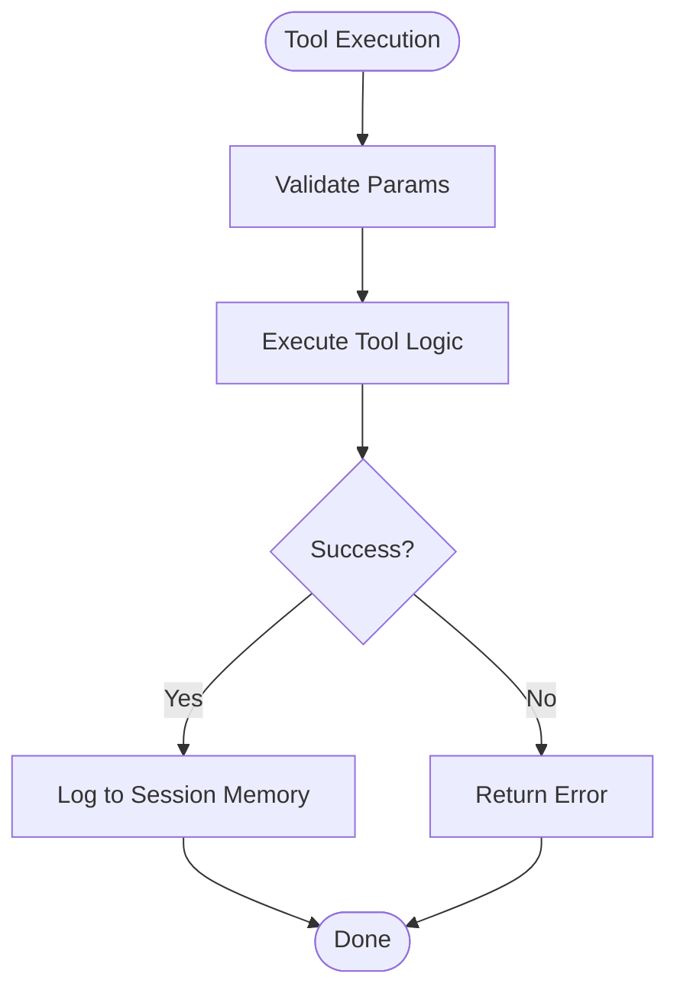
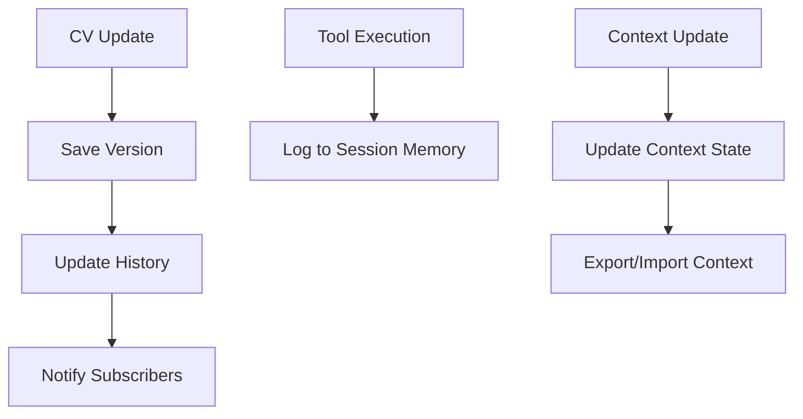
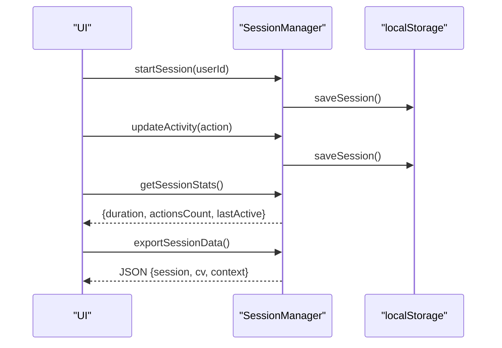
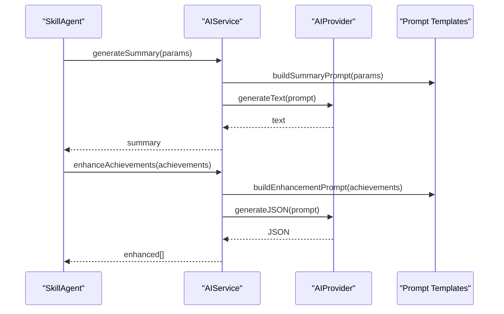
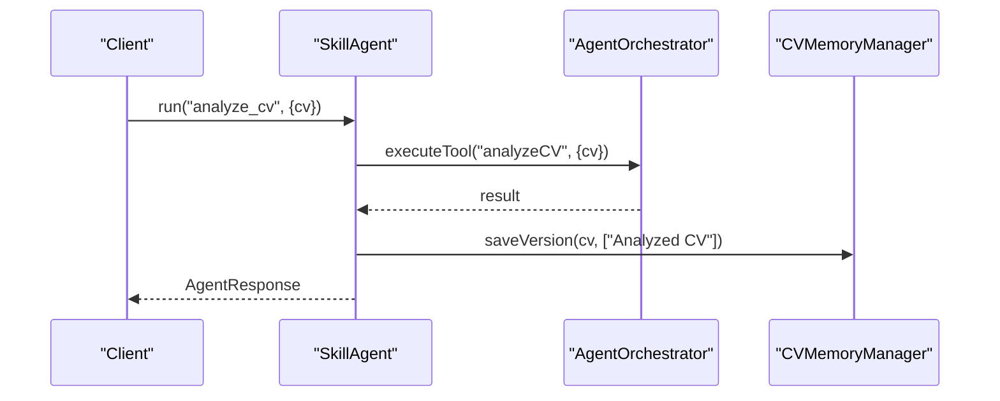
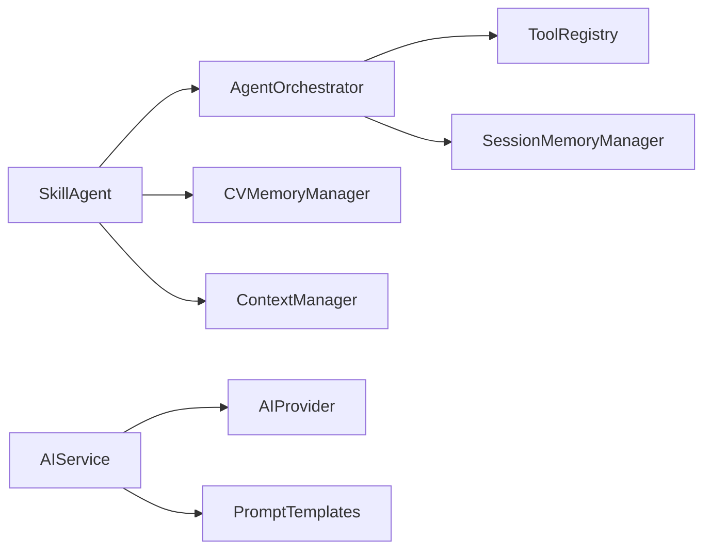

# AI Agent System

<cite>
**Referenced Files in This Document**
- [src/agent/index.ts](file://src/agent/index.ts)
- [src/agent/core/agent.ts](file://src/agent/core/agent.ts)
- [src/agent/core/session.ts](file://src/agent/core/session.ts)
- [src/agent/memory/cv-memory.ts](file://src/agent/memory/cv-memory.ts)
- [src/agent/memory/context-manager.ts](file://src/agent/memory/context-manager.ts)
- [src/agent/tools/base-tool.ts](file://src/agent/tools/base-tool.ts)
- [src/agent/tools/analysis-tools.ts](file://src/agent/tools/analysis-tools.ts)
- [src/agent/tools/profile-tools.ts](file://src/agent/tools/profile-tools.ts)
- [src/agent/tools/experience-tools.ts](file://src/agent/tools/experience-tools.ts)
- [src/agent/tools/project-tools.ts](file://src/agent/tools/project-tools.ts)
- [src/agent/tools/skills-tools.ts](file://src/agent/tools/skills-tools.ts)
- [src/agent/services/ai-service.ts](file://src/agent/services/ai-service.ts)
- [src/agent/services/prompts.ts](file://src/agent/services/prompts.ts)
- [src/agent/schemas/agent.schema.ts](file://src/agent/schemas/agent.schema.ts)
- [src/agent/schemas/cv.schema.ts](file://src/agent/schemas/cv.schema.ts)
</cite>

## Table of Contents
1. [Introduction](#introduction)
2. [Project Structure](#project-structure)
3. [Core Components](#core-components)
4. [Architecture Overview](#architecture-overview)
5. [Detailed Component Analysis](#detailed-component-analysis)
6. [Dependency Analysis](#dependency-analysis)
7. [Performance Considerations](#performance-considerations)
8. [Troubleshooting Guide](#troubleshooting-guide)
9. [Conclusion](#conclusion)
10. [Appendices](#appendices)

## Introduction
This document explains the AI Agent System powering the CV Portfolio Builder. It follows an MCP-inspired architecture with a ToolRegistry, Agent Orchestrator, Memory Management, and Session Tracking. The system integrates an AI Service abstraction to coordinate tool execution and manage AI-driven operations. The documentation covers the tool system (base tool, registration, execution patterns), memory management via CV Store and context management, session tracking for conversation state, practical examples for tool development and AI integration, and performance/error handling considerations.

## Project Structure
The agent subsystem is organized by responsibility:
- Core orchestration and session management
- Memory and context management
- Tool system (base tool and specialized tools)
- AI service abstraction and prompt templates
- Zod-based schemas for CV and agent state

**Diagram sources**
- [src/agent/core/agent.ts:11-55](file://src/agent/core/agent.ts#L11-L55)
- [src/agent/core/agent.ts:60-168](file://src/agent/core/agent.ts#L60-L168)
- [src/agent/core/agent.ts:173-376](file://src/agent/core/agent.ts#L173-L376)
- [src/agent/core/session.ts:7-200](file://src/agent/core/session.ts#L7-L200)
- [src/agent/memory/cv-memory.ts:20-149](file://src/agent/memory/cv-memory.ts#L20-L149)
- [src/agent/memory/cv-memory.ts:165-228](file://src/agent/memory/cv-memory.ts#L165-L228)
- [src/agent/memory/cv-memory.ts:251-285](file://src/agent/memory/cv-memory.ts#L251-L285)
- [src/agent/memory/context-manager.ts:7-137](file://src/agent/memory/context-manager.ts#L7-L137)
- [src/agent/tools/base-tool.ts:6-49](file://src/agent/tools/base-tool.ts#L6-L49)
- [src/agent/tools/analysis-tools.ts:13-141](file://src/agent/tools/analysis-tools.ts#L13-L141)
- [src/agent/tools/profile-tools.ts:14-79](file://src/agent/tools/profile-tools.ts#L14-L79)
- [src/agent/tools/experience-tools.ts:14-138](file://src/agent/tools/experience-tools.ts#L14-L138)
- [src/agent/tools/project-tools.ts:14-103](file://src/agent/tools/project-tools.ts#L14-L103)
- [src/agent/tools/skills-tools.ts:13-202](file://src/agent/tools/skills-tools.ts#L13-L202)
- [src/agent/services/ai-service.ts:77-126](file://src/agent/services/ai-service.ts#L77-L126)
- [src/agent/services/prompts.ts:5-279](file://src/agent/services/prompts.ts#L5-L279)

**Section sources**
- [src/agent/index.ts:1-24](file://src/agent/index.ts#L1-L24)

## Core Components
- ToolRegistry: Central registry for tools with registration, lookup, listing, and existence checks.
- AgentOrchestrator: Executes tools with logging, timing, and session memory updates; supports tool chaining and debug mode.
- SkillAgent: High-level agent exposing tasks (analyze CV, optimize CV, generate summary, improve experience) and context management.
- SessionManager: Manages user sessions, persistence, activity tracking, and statistics.
- CVMemoryManager: Manages CV versions, history, and JSON import/export.
- SessionMemoryManager: Logs tool executions per session with timestamps.
- PreferenceMemoryManager: Stores user preferences for tone, emphasis, and formatting.
- ContextManager: Manages agent context (job target, domain, experience level, goals) and contextual suggestions.
- AIService: Abstracts AI providers and exposes operations like generating summaries, enhancing achievements, analyzing CVs, and identifying skill gaps.
- Prompt Templates: Structured prompt builders for reuse across AI operations.

**Section sources**
- [src/agent/core/agent.ts:11-55](file://src/agent/core/agent.ts#L11-L55)
- [src/agent/core/agent.ts:60-168](file://src/agent/core/agent.ts#L60-L168)
- [src/agent/core/agent.ts:173-376](file://src/agent/core/agent.ts#L173-L376)
- [src/agent/core/session.ts:7-200](file://src/agent/core/session.ts#L7-L200)
- [src/agent/memory/cv-memory.ts:20-149](file://src/agent/memory/cv-memory.ts#L20-L149)
- [src/agent/memory/cv-memory.ts:165-228](file://src/agent/memory/cv-memory.ts#L165-L228)
- [src/agent/memory/cv-memory.ts:251-285](file://src/agent/memory/cv-memory.ts#L251-L285)
- [src/agent/memory/context-manager.ts:7-137](file://src/agent/memory/context-manager.ts#L7-L137)
- [src/agent/services/ai-service.ts:77-126](file://src/agent/services/ai-service.ts#L77-L126)
- [src/agent/services/prompts.ts:5-279](file://src/agent/services/prompts.ts#L5-L279)

## Architecture Overview
The system is layered:
- Orchestration Layer: SkillAgent and AgentOrchestrator coordinate tasks and tool execution.
- Tool Layer: Specialized tools encapsulate domain-specific operations.
- Memory Layer: CV, session, and preference memories persist state and history.
- AI Integration Layer: AIService abstracts provider implementations and composes prompts.
- Schema Layer: Zod schemas define CV and agent state contracts.

**Diagram sources**
- [src/agent/core/agent.ts:11-55](file://src/agent/core/agent.ts#L11-L55)
- [src/agent/core/agent.ts:60-168](file://src/agent/core/agent.ts#L60-L168)
- [src/agent/core/agent.ts:173-376](file://src/agent/core/agent.ts#L173-L376)
- [src/agent/core/session.ts:7-200](file://src/agent/core/session.ts#L7-L200)
- [src/agent/memory/cv-memory.ts:20-149](file://src/agent/memory/cv-memory.ts#L20-L149)
- [src/agent/memory/cv-memory.ts:165-228](file://src/agent/memory/cv-memory.ts#L165-L228)
- [src/agent/memory/cv-memory.ts:251-285](file://src/agent/memory/cv-memory.ts#L251-L285)
- [src/agent/memory/context-manager.ts:7-137](file://src/agent/memory/context-manager.ts#L7-L137)
- [src/agent/services/ai-service.ts:77-126](file://src/agent/services/ai-service.ts#L77-L126)

## Detailed Component Analysis

### Tool System: Base Tool, Registration, and Execution
- BaseTool defines the contract and safe execution wrapper with validation and error handling.
- ToolRegistry centralizes tool discovery and invocation.
- Tool execution logs are recorded in session memory for observability.

**Diagram sources**
- [src/agent/core/agent.ts:78-127](file://src/agent/core/agent.ts#L78-L127)
- [src/agent/core/agent.ts:11-55](file://src/agent/core/agent.ts#L11-L55)
- [src/agent/memory/cv-memory.ts:181-194](file://src/agent/memory/cv-memory.ts#L181-L194)

**Section sources**
- [src/agent/tools/base-tool.ts:6-49](file://src/agent/tools/base-tool.ts#L6-L49)
- [src/agent/core/agent.ts:78-127](file://src/agent/core/agent.ts#L78-L127)
- [src/agent/index.ts:9-16](file://src/agent/index.ts#L9-L16)

### Tool Categories and Examples
- Analysis Tools: CV analysis, keyword optimization, consistency checks.
- Profile Tools: Update profile, generate summary, optimize contact info.
- Experience Tools: Add experience, enhance achievements, suggest tech stack.
- Project Tools: Add project, generate highlights, link to skills.
- Skills Tools: Add skill, categorize skills, identify gaps.

**Diagram sources**
- [src/agent/tools/base-tool.ts:30-48](file://src/agent/tools/base-tool.ts#L30-L48)
- [src/agent/memory/cv-memory.ts:181-194](file://src/agent/memory/cv-memory.ts#L181-L194)

**Section sources**
- [src/agent/tools/analysis-tools.ts:13-141](file://src/agent/tools/analysis-tools.ts#L13-L141)
- [src/agent/tools/profile-tools.ts:14-79](file://src/agent/tools/profile-tools.ts#L14-L79)
- [src/agent/tools/experience-tools.ts:14-138](file://src/agent/tools/experience-tools.ts#L14-L138)
- [src/agent/tools/project-tools.ts:14-103](file://src/agent/tools/project-tools.ts#L14-L103)
- [src/agent/tools/skills-tools.ts:13-202](file://src/agent/tools/skills-tools.ts#L13-L202)

### Memory Management: CV Store and Context Management
- CVMemoryManager persists CV versions, tracks history, and supports import/export.
- SessionMemoryManager logs tool calls with parameters and results.
- PreferenceMemoryManager stores user preferences.
- ContextManager manages agent context and generates contextual suggestions.

**Diagram sources**
- [src/agent/memory/cv-memory.ts:56-117](file://src/agent/memory/cv-memory.ts#L56-L117)
- [src/agent/memory/cv-memory.ts:181-227](file://src/agent/memory/cv-memory.ts#L181-L227)
- [src/agent/memory/context-manager.ts:27-77](file://src/agent/memory/context-manager.ts#L27-L77)

**Section sources**
- [src/agent/memory/cv-memory.ts:20-149](file://src/agent/memory/cv-memory.ts#L20-L149)
- [src/agent/memory/cv-memory.ts:165-228](file://src/agent/memory/cv-memory.ts#L165-L228)
- [src/agent/memory/context-manager.ts:7-137](file://src/agent/memory/context-manager.ts#L7-L137)

### Session Tracking
- SessionManager handles session lifecycle, persistence, activity updates, and statistics.
- Integrates with CV Store and context for export and resume capabilities.

**Diagram sources**
- [src/agent/core/session.ts:33-170](file://src/agent/core/session.ts#L33-L170)

**Section sources**
- [src/agent/core/session.ts:7-200](file://src/agent/core/session.ts#L7-L200)

### AI Service Integration
- AIService abstracts AI providers and exposes domain operations.
- Prompt templates are modular and reusable across tasks.
- Integration points show where real providers can be plugged in.

**Diagram sources**
- [src/agent/services/ai-service.ts:77-126](file://src/agent/services/ai-service.ts#L77-L126)
- [src/agent/services/prompts.ts:14-58](file://src/agent/services/prompts.ts#L14-L58)

**Section sources**
- [src/agent/services/ai-service.ts:77-126](file://src/agent/services/ai-service.ts#L77-L126)
- [src/agent/services/prompts.ts:5-279](file://src/agent/services/prompts.ts#L5-L279)

### Agent Configuration and Task Workflows
- SkillAgent exposes tasks: analyze_cv, optimize_cv, generate_summary, improve_experience.
- Each task coordinates tool execution and updates memory/state accordingly.

**Diagram sources**
- [src/agent/core/agent.ts:188-297](file://src/agent/core/agent.ts#L188-L297)

**Section sources**
- [src/agent/core/agent.ts:173-376](file://src/agent/core/agent.ts#L173-L376)

## Dependency Analysis
- Cohesion: Tools are cohesive per domain (analysis, profile, experience, project, skills).
- Coupling: AgentOrchestrator depends on ToolRegistry and memory managers; SkillAgent depends on orchestrator and context manager.
- External Dependencies: Zod for schemas, TanStack Store for reactive state.

**Diagram sources**
- [src/agent/core/agent.ts:60-168](file://src/agent/core/agent.ts#L60-L168)
- [src/agent/services/ai-service.ts:77-126](file://src/agent/services/ai-service.ts#L77-L126)

**Section sources**
- [src/agent/index.ts:1-24](file://src/agent/index.ts#L1-L24)

## Performance Considerations
- Tool execution timing: Orchestrator measures duration per tool; consider batching or caching where appropriate.
- Memory writes: CV and session memory updates occur on each tool execution; batch updates if needed.
- AI latency: Introduce timeouts and retries; consider streaming or partial results for long prompts.
- Validation overhead: Keep BaseTool.validate lightweight; offload heavy checks to tool-specific preconditions.
- Storage: LocalStorage operations are synchronous; avoid frequent writes during rapid tool chains.

## Troubleshooting Guide
- Tool not found: Verify tool registration and names; check ToolRegistry.listTools().
- Execution errors: Inspect AgentOrchestrator error handling and returned messages; enable debug mode for logs.
- Session persistence failures: Check localStorage availability and quota; fallback behavior is implemented.
- Memory import/export: Validate JSON format; handle parse errors gracefully.
- Context completeness: Use ContextManager.isContextComplete() before running targeted tasks.

**Section sources**
- [src/agent/core/agent.ts:84-127](file://src/agent/core/agent.ts#L84-L127)
- [src/agent/core/session.ts:75-112](file://src/agent/core/session.ts#L75-L112)
- [src/agent/memory/cv-memory.ts:131-139](file://src/agent/memory/cv-memory.ts#L131-L139)
- [src/agent/memory/context-manager.ts:112-115](file://src/agent/memory/context-manager.ts#L112-L115)

## Conclusion
The AI Agent System provides a modular, extensible framework for CV authoring with robust tooling, memory, and session management. Its MCP-inspired design enables clear separation of concerns, easy tool registration, and reliable AI integration through a provider abstraction. By following the patterns documented here, developers can extend the system with new tools, integrate additional AI providers, and tailor the agent’s behavior to diverse user needs.

## Appendices

### Practical Examples

- Developing a New Tool
  - Extend BaseTool and implement metadata and execute.
  - Optionally override validate for input validation.
  - Register the tool instance with ToolRegistry.
  - Reference: [BaseTool:15-49](file://src/agent/tools/base-tool.ts#L15-L49), [ToolRegistry:11-55](file://src/agent/core/agent.ts#L11-L55)

- Integrating an AI Provider
  - Implement AIProvider interface and set it on AIService.
  - Use prompt templates from prompts.ts to compose inputs.
  - Reference: [AIProvider/AIService:5-126](file://src/agent/services/ai-service.ts#L5-L126), [Prompt Templates:5-279](file://src/agent/services/prompts.ts#L5-L279)

- Configuring the Agent
  - Create SkillAgent via factory with optional llmService and debugMode.
  - Update context using ContextManager for personalized suggestions.
  - Reference: [SkillAgent Factory:398-413](file://src/agent/core/agent.ts#L398-L413), [ContextManager:27-77](file://src/agent/memory/context-manager.ts#L27-L77)

- Running Tasks
  - Call SkillAgent.run with a supported task and input payload.
  - Review AgentResponse for success, result, actions, and metadata.
  - Reference: [Agent Tasks:188-281](file://src/agent/core/agent.ts#L188-L281)