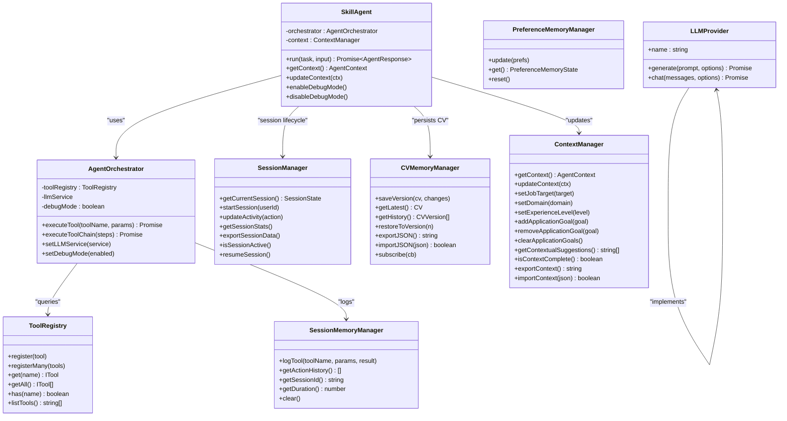
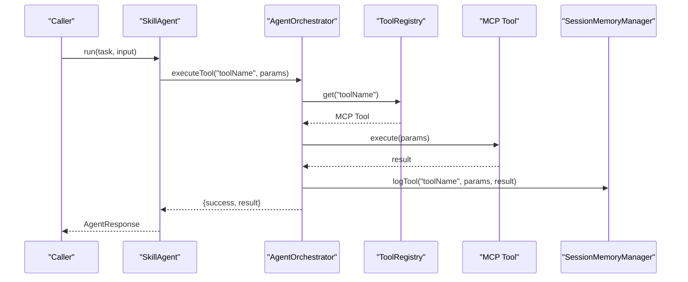
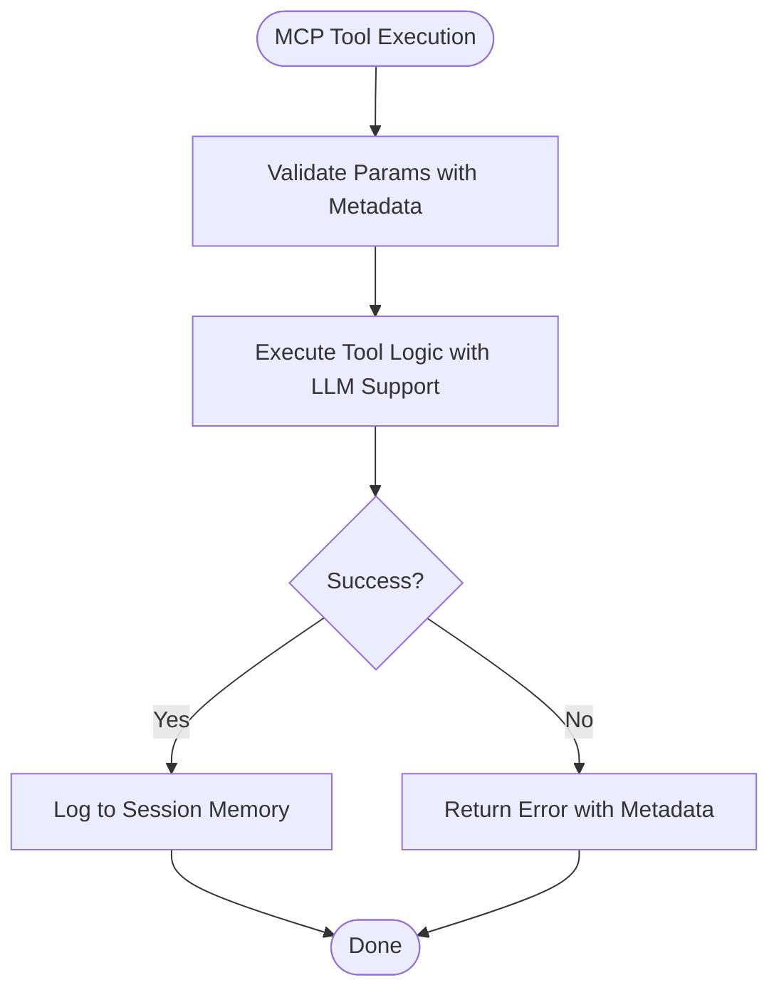
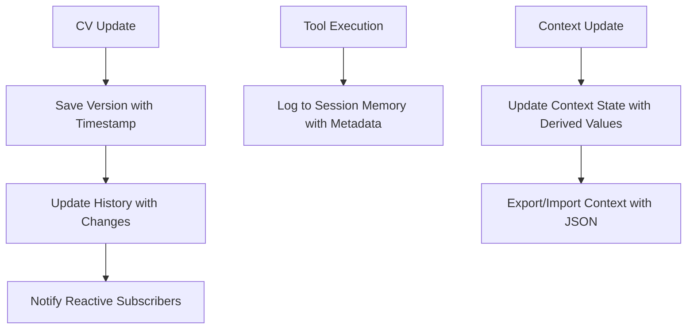
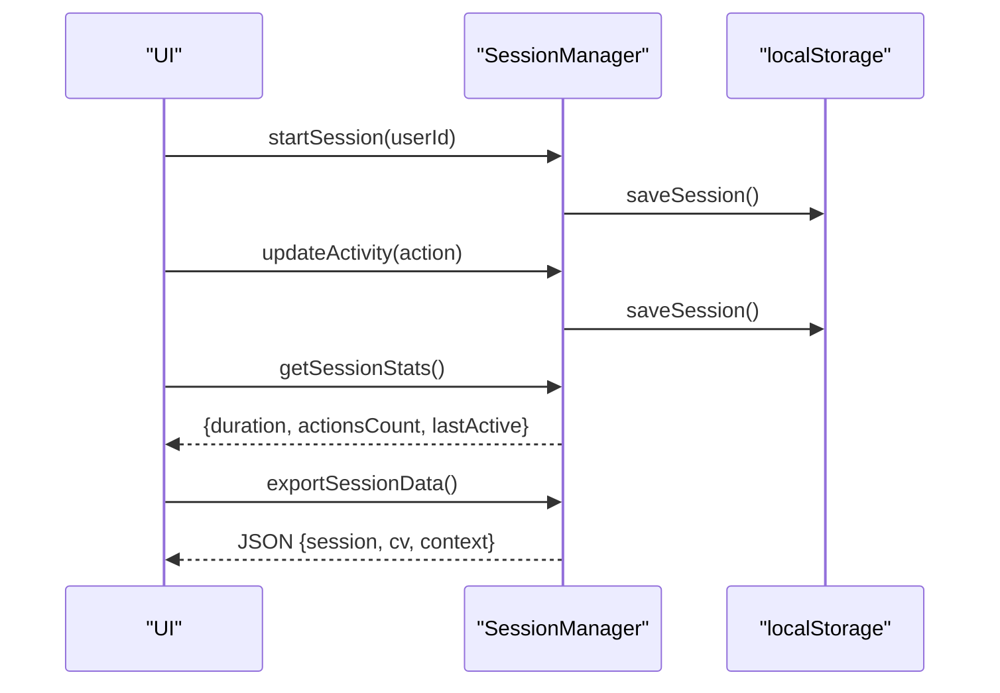
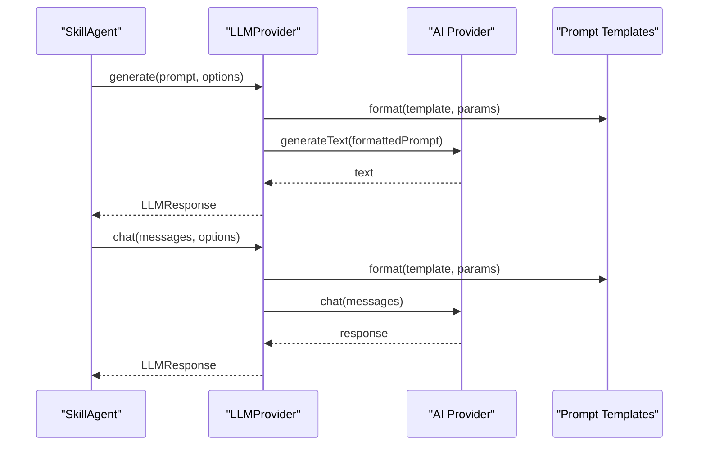
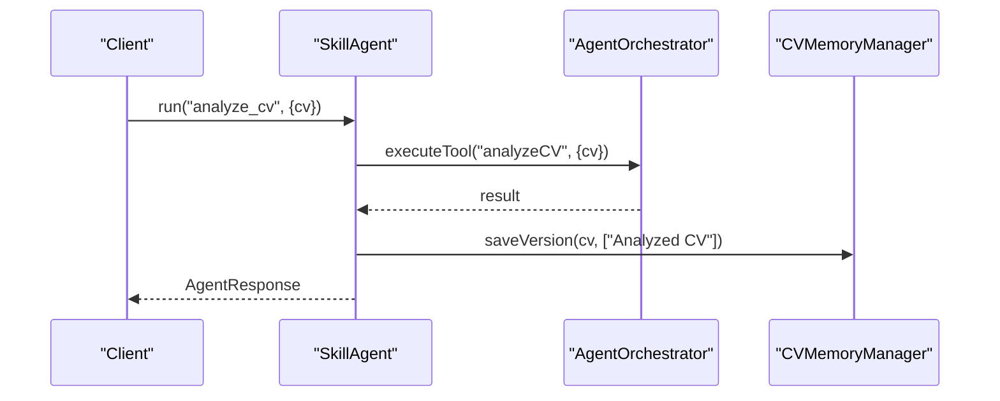
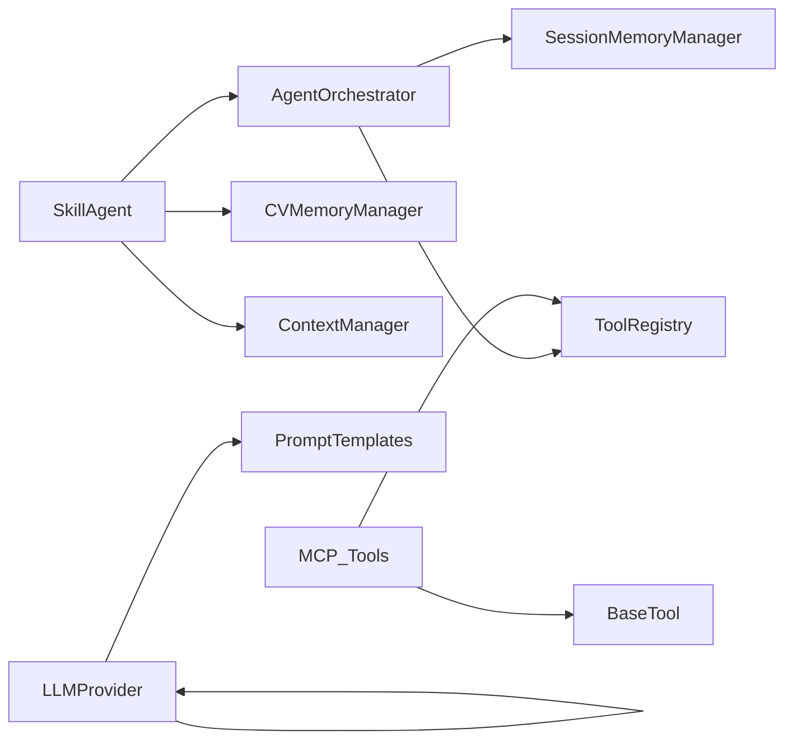

# AI Agent System

<cite>
**Referenced Files in This Document**
- [src/agent/index.ts](file://src/agent/index.ts)
- [src/agent/core/agent.ts](file://src/agent/core/agent.ts)
- [src/agent/core/session.ts](file://src/agent/core/session.ts)
- [src/agent/memory/cv-memory.ts](file://src/agent/memory/cv-memory.ts)
- [src/agent/context/context-manager.ts](file://src/agent/context/context-manager.ts)
- [src/agent/tools/base-tool.ts](file://src/agent/tools/base-tool.ts)
- [src/agent/tools/core-tools.ts](file://src/agent/tools/core-tools.ts)
- [src/agent/tools/experience-tools.ts](file://src/agent/tools/experience-tools.ts)
- [src/agent/tools/profile-tools.ts](file://src/agent/tools/profile-tools.ts)
- [src/agent/tools/project-tools.ts](file://src/agent/tools/project-tools.ts)
- [src/agent/tools/skills-tools.ts](file://src/agent/tools/skills-tools.ts)
- [src/agent/services/llm.ts](file://src/agent/services/llm.ts)
- [src/agent/services/prompts.ts](file://src/agent/services/prompts.ts)
- [src/agent/schemas/agent.schema.ts](file://src/agent/schemas/agent.schema.ts)
- [src/agent/schemas/cv.schema.ts](file://src/agent/schemas/cv.schema.ts)
- [src/agent/hooks/useSkillAgent.ts](file://src/agent/hooks/useSkillAgent.ts)
- [src/agent/examples/usage-examples.tsx](file://src/agent/examples/usage-examples.tsx)
- [src/agent/README.md](file://src/agent/README.md)
</cite>

## Update Summary
**Changes Made**
- Updated to reflect current production state with six specialized MCP tools
- Removed references to experimental AI assistant panel that was dropped from production
- Updated architecture diagrams to show current MCP-inspired design
- Revised documentation to match actual codebase implementation
- Clarified that the system is production-ready with comprehensive tool suite

## Table of Contents
1. [Introduction](#introduction)
2. [Project Structure](#project-structure)
3. [Core Components](#core-components)
4. [Architecture Overview](#architecture-overview)
5. [Detailed Component Analysis](#detailed-component-analysis)
6. [MCP-Enhanced Tool System](#mcp-enhanced-tool-system)
7. [CV Builder Integration](#cv-builder-integration)
8. [Dependency Analysis](#dependency-analysis)
9. [Performance Considerations](#performance-considerations)
10. [Troubleshooting Guide](#troubleshooting-guide)
11. [Conclusion](#conclusion)
12. [Appendices](#appendices)

## Introduction
This document explains the AI Agent System powering the CV Portfolio Builder with MCP (Model Context Protocol) implementation. The system features a production-ready architecture with six specialized tools working through an orchestrator pattern to provide real-time AI assistance for CV optimization. The agent integrates seamlessly with the CV Builder application, offering comprehensive CV analysis, optimization, and enhancement capabilities through a structured tool ecosystem.

The system follows an MCP-inspired architecture with ToolRegistry, Agent Orchestrator, Memory Management, and Session Tracking. It provides robust AI service integration through LLM providers and offers practical examples for tool development, AI integration, and agent configuration.

**Updated** The system is currently in production-ready state with six fully implemented MCP tools, replacing previous experimental features that were removed from production builds.

## Project Structure
The agent subsystem is organized by responsibility with MCP tool integration:
- Core orchestration and session management with MCP tool support
- Memory and context management with reactive state
- MCP-enhanced tool system with six specialized tools
- LLM service abstraction and prompt templates
- Zod-based schemas for CV and agent state
- React hooks for seamless UI integration

```mermaid
graph TB
subgraph "MCP Agent Core"
SK["SkillAgent<br/>AgentOrchestrator<br/>ToolRegistry"]
SESS["SessionManager"]
END
subgraph "Memory & Context"
CVM["CVMemoryManager"]
PM["PreferenceMemoryManager"]
SM["SessionMemoryManager"]
CM["ContextManager"]
END
subgraph "MCP Tools"
BT["BaseTool"]
AT["Analysis Tools<br/>analyzeCV"]
GT["Generation Tools<br/>generateSummary"]
OT["Optimization Tools<br/>optimizeATS"]
IT["Improvement Tools<br/>improveExperience"]
ET["Extraction Tools<br/>extractSkills"]
MT["Mapping Tools<br/>mapToUISections"]
END
subgraph "AI Integration"
LLM["LLM Service<br/>OpenAI/Mock"]
PROMPTS["Prompt Templates"]
END
SK --> BT
SK --> AT
SK --> GT
SK --> OT
SK --> IT
SK --> ET
SK --> MT
SK --> LLM
LLM --> PROMPTS
SK --> CVM
SK --> SM
SK --> CM
SESS --> SM
SESS --> CVM
```

**Diagram sources**
- [src/agent/core/agent.ts:11-55](file://src/agent/core/agent.ts#L11-L55)
- [src/agent/core/agent.ts:60-168](file://src/agent/core/agent.ts#L60-L168)
- [src/agent/core/agent.ts:173-376](file://src/agent/core/agent.ts#L173-L376)
- [src/agent/core/session.ts:7-200](file://src/agent/core/session.ts#L7-L200)
- [src/agent/memory/cv-memory.ts:20-149](file://src/agent/memory/cv-memory.ts#L20-L149)
- [src/agent/memory/cv-memory.ts:165-228](file://src/agent/memory/cv-memory.ts#L165-L228)
- [src/agent/memory/cv-memory.ts:251-285](file://src/agent/memory/cv-memory.ts#L251-L285)
- [src/agent/context/context-manager.ts:7-137](file://src/agent/context/context-manager.ts#L7-L137)
- [src/agent/tools/core-tools.ts:17-475](file://src/agent/tools/core-tools.ts#L17-L475)
- [src/agent/services/llm.ts:144-253](file://src/agent/services/llm.ts#L144-L253)
- [src/agent/services/prompts.ts:5-280](file://src/agent/services/prompts.ts#L5-L280)

**Section sources**
- [src/agent/index.ts:1-43](file://src/agent/index.ts#L1-L43)

## Core Components
- **ToolRegistry**: Central registry for MCP-compliant tools with registration, lookup, listing, and existence checks.
- **AgentOrchestrator**: Executes MCP tools with logging, timing, and session memory updates; supports tool chaining and debug mode.
- **SkillAgent**: High-level agent exposing MCP tasks (analyze_cv, optimize_cv, generate_summary, improve_experience) and context management.
- **SessionManager**: Manages user sessions, persistence, activity tracking, and statistics.
- **CVMemoryManager**: Manages CV versions, history, and JSON import/export with reactive state.
- **SessionMemoryManager**: Logs tool executions per session with timestamps.
- **PreferenceMemoryManager**: Stores user preferences for tone, emphasis, and formatting.
- **ContextManager**: Manages agent context (job target, domain, experience level, goals) and contextual suggestions.
- **LLM Service**: Abstracts AI providers (OpenAI, Mock) and exposes operations like generating summaries, enhancing achievements, analyzing CVs, and optimizing ATS.
- **Prompt Templates**: Structured prompt builders for reuse across AI operations.

**Section sources**
- [src/agent/core/agent.ts:11-55](file://src/agent/core/agent.ts#L11-L55)
- [src/agent/core/agent.ts:60-168](file://src/agent/core/agent.ts#L60-L168)
- [src/agent/core/agent.ts:173-376](file://src/agent/core/agent.ts#L173-L376)
- [src/agent/core/session.ts:7-200](file://src/agent/core/session.ts#L7-L200)
- [src/agent/memory/cv-memory.ts:20-149](file://src/agent/memory/cv-memory.ts#L20-L149)
- [src/agent/memory/cv-memory.ts:165-228](file://src/agent/memory/cv-memory.ts#L165-L228)
- [src/agent/memory/cv-memory.ts:251-285](file://src/agent/memory/cv-memory.ts#L251-L285)
- [src/agent/context/context-manager.ts:7-137](file://src/agent/context/context-manager.ts#L7-L137)
- [src/agent/services/llm.ts:144-253](file://src/agent/services/llm.ts#L144-L253)
- [src/agent/services/prompts.ts:5-280](file://src/agent/services/prompts.ts#L5-L280)

## Architecture Overview
The system is layered with MCP integration:
- **Orchestration Layer**: SkillAgent and AgentOrchestrator coordinate MCP tool execution and task workflows.
- **MCP Tool Layer**: Six specialized tools encapsulate domain-specific operations with metadata and validation.
- **Memory Layer**: CV, session, and preference memories persist state and history with reactive updates.
- **AI Integration Layer**: LLM Service abstracts provider implementations and composes prompts.
- **Schema Layer**: Zod schemas define CV and agent state contracts.



**Diagram sources**
- [src/agent/core/agent.ts:11-55](file://src/agent/core/agent.ts#L11-L55)
- [src/agent/core/agent.ts:60-168](file://src/agent/core/agent.ts#L60-L168)
- [src/agent/core/agent.ts:173-376](file://src/agent/core/agent.ts#L173-L376)
- [src/agent/core/session.ts:7-200](file://src/agent/core/session.ts#L7-L200)
- [src/agent/memory/cv-memory.ts:20-149](file://src/agent/memory/cv-memory.ts#L20-L149)
- [src/agent/memory/cv-memory.ts:165-228](file://src/agent/memory/cv-memory.ts#L165-L228)
- [src/agent/memory/cv-memory.ts:251-285](file://src/agent/memory/cv-memory.ts#L251-L285)
- [src/agent/context/context-manager.ts:7-137](file://src/agent/context/context-manager.ts#L7-L137)
- [src/agent/services/llm.ts:4-8](file://src/agent/services/llm.ts#L4-L8)

## Detailed Component Analysis

### MCP Tool System: Base Tool, Registration, and Execution
- **BaseTool** defines the MCP-compliant contract with metadata, validation, and execution patterns.
- **ToolRegistry** centralizes MCP tool discovery and invocation with metadata support.
- **MCP Tool Categories**: Six specialized tools with distinct purposes and metadata.
- **Tool execution** logs are recorded in session memory for observability and debugging.



**Diagram sources**
- [src/agent/core/agent.ts:78-127](file://src/agent/core/agent.ts#L78-L127)
- [src/agent/core/agent.ts:11-55](file://src/agent/core/agent.ts#L11-L55)
- [src/agent/memory/cv-memory.ts:181-194](file://src/agent/memory/cv-memory.ts#L181-L194)

**Section sources**
- [src/agent/tools/base-tool.ts:6-49](file://src/agent/tools/base-tool.ts#L6-L49)
- [src/agent/core/agent.ts:78-127](file://src/agent/core/agent.ts#L78-L127)
- [src/agent/index.ts:16-18](file://src/agent/index.ts#L16-L18)

### MCP Tool Categories and Examples
- **Analysis Tools**: Comprehensive CV analysis, keyword optimization, consistency checks.
- **Generation Tools**: Professional summary generation tailored to target roles.
- **Optimization Tools**: ATS keyword matching and CV optimization.
- **Improvement Tools**: Experience bullet point enhancement with impact metrics.
- **Extraction Tools**: Skill deduplication and categorization.
- **Mapping Tools**: CV data transformation for UI rendering.



**Diagram sources**
- [src/agent/tools/base-tool.ts:30-48](file://src/agent/tools/base-tool.ts#L30-L48)
- [src/agent/memory/cv-memory.ts:181-194](file://src/agent/memory/cv-memory.ts#L181-L194)

**Section sources**
- [src/agent/tools/analysis-tools.ts:13-291](file://src/agent/tools/analysis-tools.ts#L13-L291)
- [src/agent/tools/core-tools.ts:17-539](file://src/agent/tools/core-tools.ts#L17-L539)
- [src/agent/tools/experience-tools.ts:14-194](file://src/agent/tools/experience-tools.ts#L14-L194)
- [src/agent/tools/skills-tools.ts:13-210](file://src/agent/tools/skills-tools.ts#L13-L210)

### Memory Management: CV Store and Context Management
- **CVMemoryManager** persists CV versions, tracks history, and supports import/export with reactive state.
- **SessionMemoryManager** logs tool calls with parameters and results for audit trails.
- **PreferenceMemoryManager** stores user preferences with reactive updates.
- **ContextManager** manages agent context and generates contextual suggestions with derived states.



**Diagram sources**
- [src/agent/memory/cv-memory.ts:56-117](file://src/agent/memory/cv-memory.ts#L56-L117)
- [src/agent/memory/cv-memory.ts:181-227](file://src/agent/memory/cv-memory.ts#L181-L227)
- [src/agent/context/context-manager.ts:27-77](file://src/agent/context/context-manager.ts#L27-L77)

**Section sources**
- [src/agent/memory/cv-memory.ts:20-149](file://src/agent/memory/cv-memory.ts#L20-L149)
- [src/agent/memory/cv-memory.ts:165-228](file://src/agent/memory/cv-memory.ts#L165-L228)
- [src/agent/context/context-manager.ts:7-137](file://src/agent/context/context-manager.ts#L7-L137)

### Session Tracking
- **SessionManager** handles session lifecycle, persistence, activity updates, and statistics.
- Integrates with CV Store and context for export and resume capabilities.
- Supports reactive state updates and derived properties for performance monitoring.



**Diagram sources**
- [src/agent/core/session.ts:33-170](file://src/agent/core/session.ts#L33-L170)

**Section sources**
- [src/agent/core/session.ts:7-200](file://src/agent/core/session.ts#L7-L200)

### LLM Service Integration
- **LLMProvider** interface abstracts AI providers with standardized operations.
- **Prompt Templates** are modular and reusable across MCP tools.
- **Integration Points** show where real providers can be plugged in with metadata support.
- **Mock LLM Service** for development and testing scenarios.



**Diagram sources**
- [src/agent/services/llm.ts:144-253](file://src/agent/services/llm.ts#L144-L253)
- [src/agent/services/prompts.ts:14-58](file://src/agent/services/prompts.ts#L14-L58)

**Section sources**
- [src/agent/services/llm.ts:144-253](file://src/agent/services/llm.ts#L144-L253)
- [src/agent/services/prompts.ts:5-280](file://src/agent/services/prompts.ts#L5-L280)

### Agent Configuration and Task Workflows
- **SkillAgent** exposes MCP tasks: analyze_cv, optimize_cv, generate_summary, improve_experience.
- Each task coordinates MCP tool execution and updates memory/state accordingly.
- **MCP Task Patterns** provide structured workflows for complex operations.



**Diagram sources**
- [src/agent/core/agent.ts:188-297](file://src/agent/core/agent.ts#L188-L297)

**Section sources**
- [src/agent/core/agent.ts:173-376](file://src/agent/core/agent.ts#L173-L376)

## MCP-Enhanced Tool System

### Six Specialized MCP Tools

#### 1. AnalyzeCV Tool
- **Purpose**: Comprehensive CV strength analysis with structured feedback
- **Metadata**: Requires LLM: false, category: analysis
- **Features**: Strengths/weaknesses identification, section scoring, recommendation generation
- **Output**: CVAnalysis with score, strengths, weaknesses, recommendations

#### 2. GenerateSummary Tool
- **Purpose**: Professional summary generation tailored to target roles
- **Metadata**: Requires LLM: true, category: generation
- **Features**: Role-based customization, experience calculation, template generation
- **Output**: Enhanced professional summary string

#### 3. ImproveExperience Tool
- **Purpose**: Experience bullet point enhancement with impact metrics
- **Metadata**: Requires LLM: true, category: optimization
- **Features**: STAR method implementation, quantification suggestions, action verb enhancement
- **Output**: ImprovedExperience with suggestions array

#### 4. ExtractSkills Tool
- **Purpose**: Skill deduplication and categorization from CV data
- **Metadata**: Requires LLM: false, category: extraction
- **Features**: Multi-source extraction (explicit, experience, projects), normalization, categorization
- **Output**: SkillExtraction with categorized skills

#### 5. OptimizeATSTool
- **Purpose**: ATS keyword matching and CV optimization
- **Metadata**: Requires LLM: true, category: optimization
- **Features**: Job description analysis, keyword extraction, match scoring, recommendations
- **Output**: ATSOptimization with match score and recommendations

#### 6. MapToUISections Tool
- **Purpose**: CV data transformation for UI rendering
- **Metadata**: Requires LLM: false, category: mapping
- **Features**: Header mapping, section organization, metadata generation, word counting
- **Output**: UIMapping for template rendering

**Section sources**
- [src/agent/tools/core-tools.ts:17-539](file://src/agent/tools/core-tools.ts#L17-L539)

### MCP Tool Metadata and Validation
- **Metadata Fields**: name, description, parameters, category, requiresLLM
- **Validation**: Parameter validation with BaseTool.validate method
- **Execution**: Async execution with error handling and logging
- **Registration**: Automatic registration through coreTools export

**Section sources**
- [src/agent/tools/base-tool.ts:6-49](file://src/agent/tools/base-tool.ts#L6-L49)
- [src/agent/tools/core-tools.ts:17-475](file://src/agent/tools/core-tools.ts#L17-L475)

## CV Builder Integration

### Real-Time AI Assistance
The agent system powers the CV Builder application with:
- **Real-time Analysis**: Instant CV strength assessment and recommendations
- **ATS Optimization**: Automatic keyword matching for job descriptions
- **Experience Enhancement**: Impactful achievement rewriting with quantifiable metrics
- **Skill Extraction**: Automated skill categorization and gap identification
- **Summary Generation**: Professional summary creation tailored to target roles

### React Hook Integration
- **useSkillAgent**: Provides easy-to-use interface for CV operations
- **Reactive State**: Automatic UI updates with TanStack Store integration
- **Error Handling**: Comprehensive error management with user feedback
- **Loading States**: Visual indicators for ongoing operations

### Workflow Examples
- **Complete Analysis**: Analyze CV → View recommendations → Implement improvements
- **ATS Optimization**: Input job description → Optimize CV → Review keyword suggestions
- **Experience Enhancement**: Select experience entry → Improve achievements → Apply suggestions
- **Skill Management**: Extract skills → Categorize → Identify gaps → Plan learning

**Section sources**
- [src/agent/hooks/useSkillAgent.ts:1-243](file://src/agent/hooks/useSkillAgent.ts#L1-L243)
- [src/agent/examples/usage-examples.tsx:1-489](file://src/agent/examples/usage-examples.tsx#L1-L489)

## Dependency Analysis
- **Cohesion**: MCP tools are cohesive per domain (analysis, generation, optimization, improvement, extraction, mapping).
- **Coupling**: AgentOrchestrator depends on ToolRegistry and memory managers; SkillAgent depends on orchestrator and context manager.
- **External Dependencies**: Zod for schemas, TanStack Store for reactive state, React for hooks integration.
- **MCP Integration**: Tools implement standardized metadata and execution patterns.



**Diagram sources**
- [src/agent/core/agent.ts:60-168](file://src/agent/core/agent.ts#L60-L168)
- [src/agent/services/llm.ts:144-253](file://src/agent/services/llm.ts#L144-L253)

**Section sources**
- [src/agent/index.ts:1-43](file://src/agent/index.ts#L1-L43)

## Performance Considerations
- **Tool execution timing**: Orchestrator measures duration per MCP tool; consider batching or caching where appropriate.
- **Memory writes**: CV and session memory updates occur on each tool execution; batch updates if needed.
- **LLM latency**: Introduce timeouts and retries; consider streaming or partial results for long prompts.
- **Validation overhead**: Keep BaseTool.validate lightweight; offload heavy checks to tool-specific preconditions.
- **Storage**: LocalStorage operations are synchronous; avoid frequent writes during rapid tool chains.
- **MCP Tool Caching**: Cache results for expensive LLM operations when context hasn't changed.
- **Reactive Updates**: TanStack Store provides efficient reactive updates; minimize unnecessary re-renders.

## Troubleshooting Guide
- **Tool not found**: Verify MCP tool registration and names; check ToolRegistry.listTools().
- **Execution errors**: Inspect AgentOrchestrator error handling and returned messages; enable debug mode for logs.
- **Session persistence failures**: Check localStorage availability and quota; fallback behavior is implemented.
- **Memory import/export**: Validate JSON format; handle parse errors gracefully.
- **Context completeness**: Use ContextManager.isContextComplete() before running targeted MCP tasks.
- **LLM Provider Issues**: Verify API keys and provider configuration; test with Mock LLM service.
- **MCP Tool Validation**: Check parameter validation and metadata compliance for custom tools.

**Section sources**
- [src/agent/core/agent.ts:84-127](file://src/agent/core/agent.ts#L84-L127)
- [src/agent/core/session.ts:75-112](file://src/agent/core/session.ts#L75-L112)
- [src/agent/memory/cv-memory.ts:131-139](file://src/agent/memory/cv-memory.ts#L131-L139)
- [src/agent/context/context-manager.ts:112-115](file://src/agent/context/context-manager.ts#L112-L115)

## Conclusion
The MCP-enhanced AI Agent System provides a robust, extensible framework for CV authoring with six specialized tools working through an orchestrator pattern. The system's MCP-inspired design enables clear separation of concerns, easy tool registration, and reliable AI integration through a provider abstraction. The integration with CV Builder delivers real-time AI assistance for CV optimization, making the system highly practical for end-users.

By following the patterns documented here, developers can extend the system with new MCP tools, integrate additional AI providers, and tailor the agent's behavior to diverse user needs while maintaining the structured MCP architecture.

**Updated** The system is currently production-ready with six fully implemented MCP tools, providing comprehensive CV optimization capabilities without the experimental features that were previously planned but removed from production builds.

## Appendices

### Practical Examples

#### Developing a New MCP Tool
- Extend BaseTool and implement metadata, validation, and execute methods.
- Register the tool instance with ToolRegistry automatically through coreTools export.
- Reference: [BaseTool:15-49](file://src/agent/tools/base-tool.ts#L15-L49), [MCP Tools:17-475](file://src/agent/tools/core-tools.ts#L17-L475)

#### Integrating an LLM Provider
- Implement LLMProvider interface and create service through createLLMService factory.
- Use prompt templates from prompts.ts to compose inputs with metadata support.
- Reference: [LLMProvider Interface:4-8](file://src/agent/services/llm.ts#L4-L8), [Prompt Templates:66-105](file://src/agent/services/llm.ts#L66-L105)

#### Configuring the MCP Agent
- Create SkillAgent via factory with optional llmService and debugMode.
- Update context using ContextManager for personalized MCP tool suggestions.
- Reference: [SkillAgent Factory:398-413](file://src/agent/core/agent.ts#L398-L413), [ContextManager:27-77](file://src/agent/context/context-manager.ts#L27-L77)

#### Running MCP Tasks
- Call SkillAgent.run with supported MCP tasks and input payload.
- Review AgentResponse for success, result, actions, and metadata.
- Reference: [MCP Tasks:188-281](file://src/agent/core/agent.ts#L188-L281)

#### CV Builder Integration
- Use useSkillAgent hook for React components with automatic state management.
- Access reactive CV data through useCVData hook with TanStack Store integration.
- Reference: [useSkillAgent:38-184](file://src/agent/hooks/useSkillAgent.ts#L38-L184), [useCVData:106-120](file://src/agent/hooks/useSkillAgent.ts#L106-L120)

### Current Production State
**Updated** The agent system is currently in production-ready state with:
- Six fully implemented MCP tools (analyzeCV, generateSummary, improveExperience, extractSkills, optimizeATS, mapToUISections)
- Complete React integration with comprehensive hooks
- Production-ready LLM service with OpenAI and Mock implementations
- Full memory management with version control
- Context-aware suggestions and preferences
- Comprehensive error handling and logging
- No experimental AI assistant panel (removed from production builds)