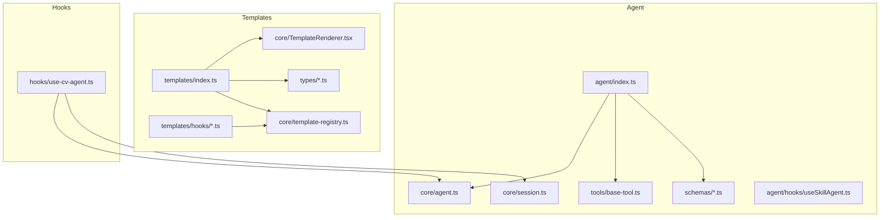
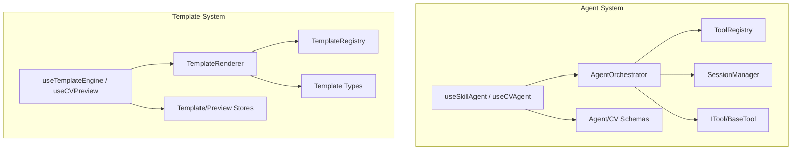
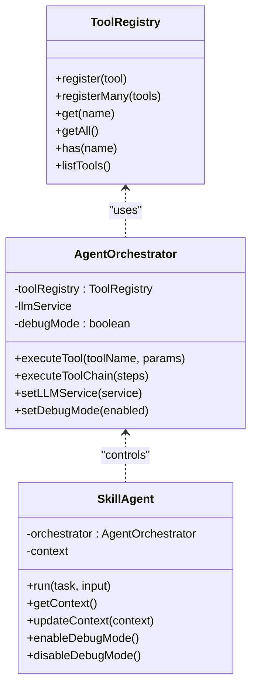
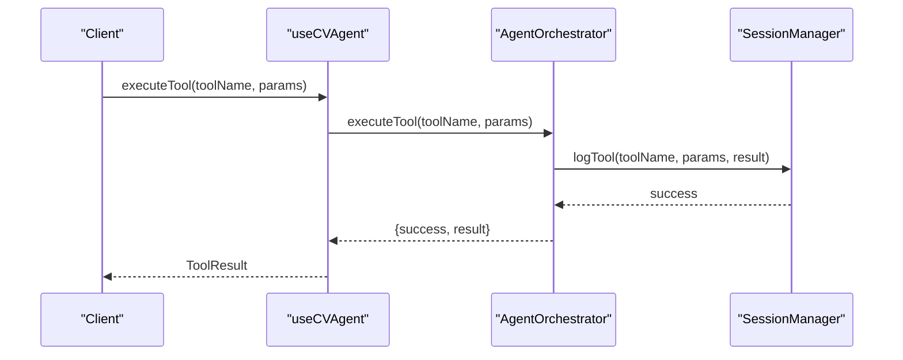
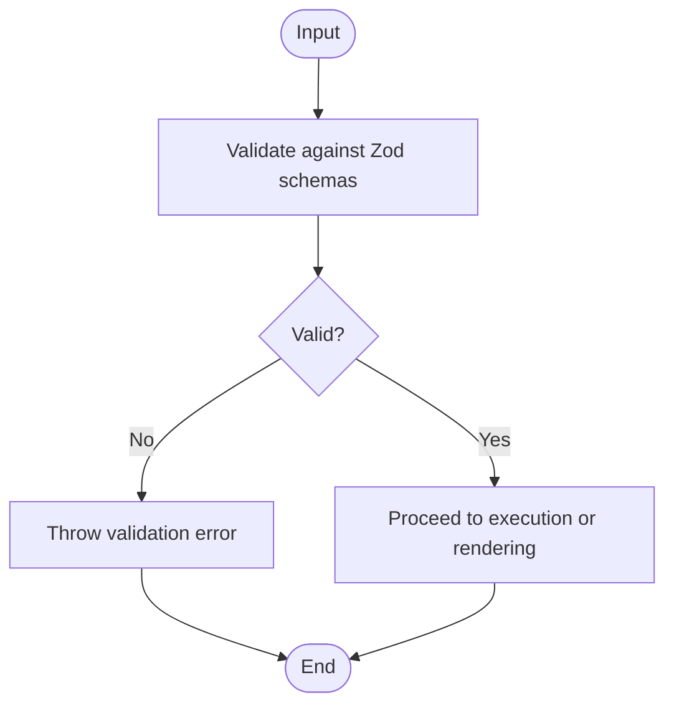
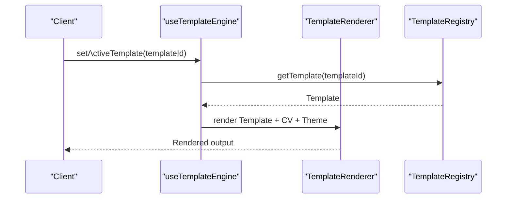
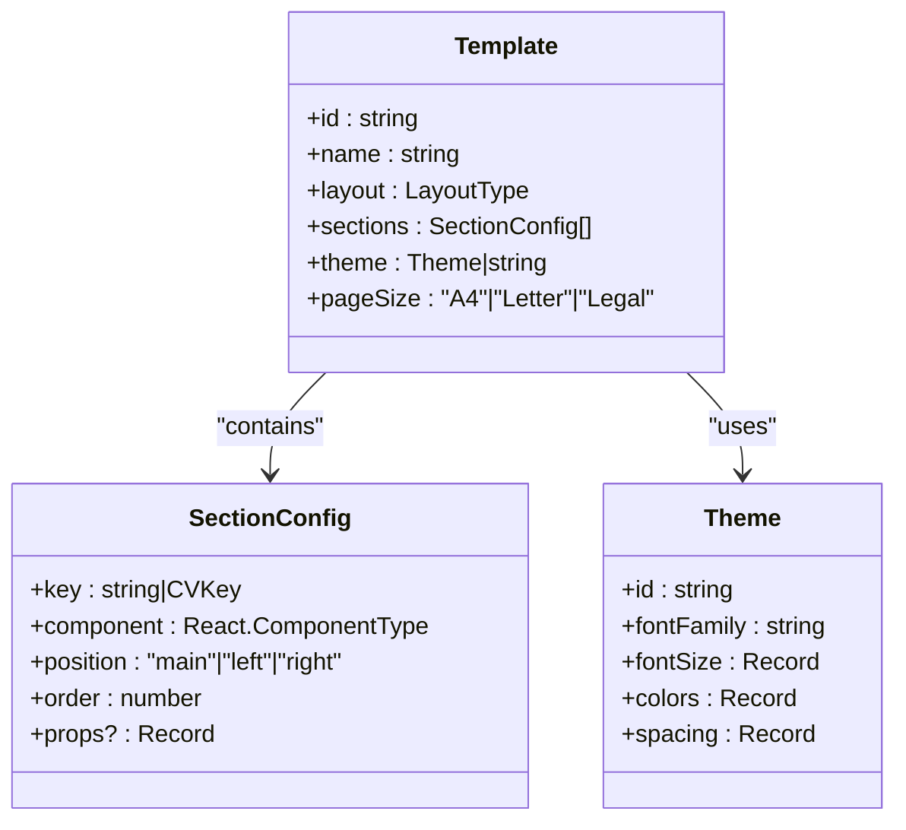
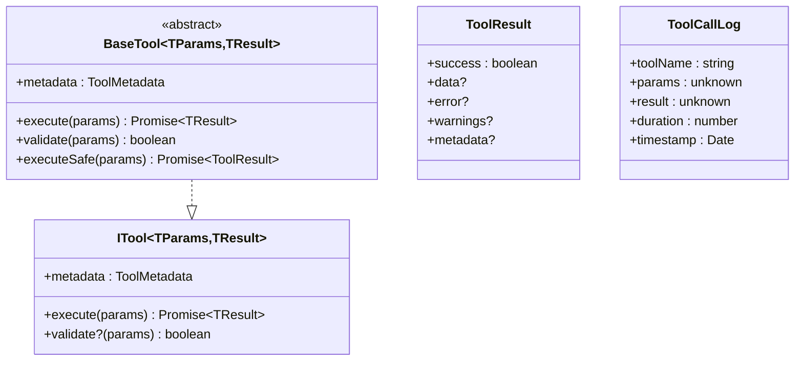
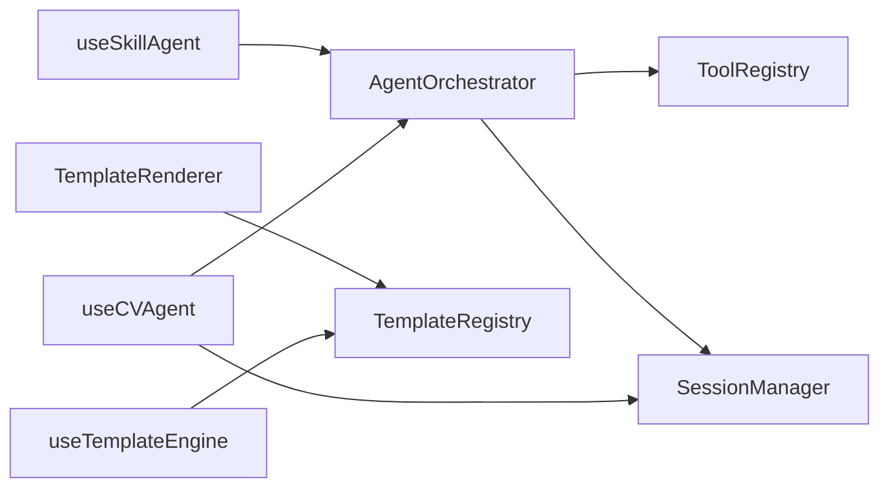

# API Reference

<cite>
**Referenced Files in This Document**
- [src/agent/index.ts](file://src/agent/index.ts)
- [src/agent/core/agent.ts](file://src/agent/core/agent.ts)
- [src/agent/core/session.ts](file://src/agent/core/session.ts)
- [src/agent/tools/base-tool.ts](file://src/agent/tools/base-tool.ts)
- [src/agent/schemas/agent.schema.ts](file://src/agent/schemas/agent.schema.ts)
- [src/agent/schemas/cv.schema.ts](file://src/agent/schemas/cv.schema.ts)
- [src/agent/hooks/useSkillAgent.ts](file://src/agent/hooks/useSkillAgent.ts)
- [src/hooks/use-cv-agent.ts](file://src/hooks/use-cv-agent.ts)
- [src/templates/index.ts](file://src/templates/index.ts)
- [src/templates/types/template.types.ts](file://src/templates/types/template.types.ts)
- [src/templates/types/cv.types.ts](file://src/templates/types/cv.types.ts)
- [src/templates/core/TemplateRenderer.tsx](file://src/templates/core/TemplateRenderer.tsx)
- [src/templates/core/template-registry.ts](file://src/templates/core/template-registry.ts)
- [src/templates/hooks/useTemplateEngine.ts](file://src/templates/hooks/useTemplateEngine.ts)
- [src/templates/hooks/useCVPreview.ts](file://src/templates/hooks/useCVPreview.ts)
</cite>

## Table of Contents
1. [Introduction](#introduction)
2. [Project Structure](#project-structure)
3. [Core Components](#core-components)
4. [Architecture Overview](#architecture-overview)
5. [Detailed Component Analysis](#detailed-component-analysis)
6. [Dependency Analysis](#dependency-analysis)
7. [Performance Considerations](#performance-considerations)
8. [Troubleshooting Guide](#troubleshooting-guide)
9. [Conclusion](#conclusion)
10. [Appendices](#appendices)

## Introduction
This API Reference documents the public interfaces of the CV Portfolio Builder, focusing on:
- Agent API: Tool registration, execution patterns, and session management
- Template API: Template rendering, layout configuration, and section management
- Tool API: Base tool interfaces, parameter schemas, and execution contracts
- Hook API: React hooks for agent, session, and template engine integration

It also covers schema definitions, type interfaces, validation rules, request/response patterns, error handling, API versioning, backward compatibility, and migration guidance.

## Project Structure
The project is organized into modular packages:
- Agent subsystem: orchestration, tooling, memory, and schemas
- Templates subsystem: rendering engine, registry, layouts, sections, and stores
- Hooks: React integration for agent, session, and template engine
- Public exports: centralized re-exports for external consumption

**Diagram sources**
- [src/agent/index.ts:1-43](file://src/agent/index.ts#L1-L43)
- [src/agent/core/agent.ts:1-414](file://src/agent/core/agent.ts#L1-L414)
- [src/agent/core/session.ts:1-204](file://src/agent/core/session.ts#L1-L204)
- [src/agent/tools/base-tool.ts:1-72](file://src/agent/tools/base-tool.ts#L1-L72)
- [src/agent/schemas/agent.schema.ts:1-62](file://src/agent/schemas/agent.schema.ts#L1-L62)
- [src/agent/schemas/cv.schema.ts:1-79](file://src/agent/schemas/cv.schema.ts#L1-L79)
- [src/agent/hooks/useSkillAgent.ts:1-243](file://src/agent/hooks/useSkillAgent.ts#L1-L243)
- [src/hooks/use-cv-agent.ts:1-185](file://src/hooks/use-cv-agent.ts#L1-L185)
- [src/templates/index.ts:1-44](file://src/templates/index.ts#L1-L44)
- [src/templates/types/template.types.ts:1-77](file://src/templates/types/template.types.ts#L1-L77)
- [src/templates/types/cv.types.ts:1-16](file://src/templates/types/cv.types.ts#L1-L16)
- [src/templates/core/TemplateRenderer.tsx:1-74](file://src/templates/core/TemplateRenderer.tsx#L1-L74)
- [src/templates/core/template-registry.ts:1-92](file://src/templates/core/template-registry.ts#L1-L92)
- [src/templates/hooks/useTemplateEngine.ts:1-57](file://src/templates/hooks/useTemplateEngine.ts#L1-L57)
- [src/templates/hooks/useCVPreview.ts:1-60](file://src/templates/hooks/useCVPreview.ts#L1-L60)

**Section sources**
- [src/agent/index.ts:1-43](file://src/agent/index.ts#L1-L43)
- [src/templates/index.ts:1-44](file://src/templates/index.ts#L1-L44)

## Core Components
- Agent API
  - ToolRegistry: registers and retrieves tools by name
  - AgentOrchestrator: executes tools, logs actions, manages debug mode
  - SkillAgent: high-level agent with predefined tasks (analyze, optimize, generate summary, improve experience)
  - SessionManager: manages session lifecycle, persistence, and statistics
  - Schemas: typed contexts, tool metadata, agent actions, and session state
  - Hooks: useSkillAgent and useCVAgent for React integration
- Template API
  - TemplateRenderer: renders CV using selected template and layout
  - TemplateRegistry: global registry for templates with category/tag filtering
  - Stores: template and preview stores for reactive state
  - Hooks: useTemplateEngine and useCVPreview for template selection and preview controls
- Tool API
  - ITool and BaseTool: base interfaces and safe execution contract
  - ToolResult and ToolCallLog: standardized result and logging structures
- Hook API
  - useSkillAgent: high-level agent actions and state
  - useCVAgent: low-level tool execution, suggestions, analysis, context updates, and session access
  - useCVMemory and useAgentContext: memory and context utilities
  - useTemplateEngine and useCVPreview: template engine and preview controls

**Section sources**
- [src/agent/core/agent.ts:11-168](file://src/agent/core/agent.ts#L11-L168)
- [src/agent/core/agent.ts:173-376](file://src/agent/core/agent.ts#L173-L376)
- [src/agent/core/session.ts:7-200](file://src/agent/core/session.ts#L7-L200)
- [src/agent/schemas/agent.schema.ts:1-62](file://src/agent/schemas/agent.schema.ts#L1-L62)
- [src/agent/schemas/cv.schema.ts:1-79](file://src/agent/schemas/cv.schema.ts#L1-L79)
- [src/agent/tools/base-tool.ts:1-72](file://src/agent/tools/base-tool.ts#L1-L72)
- [src/agent/hooks/useSkillAgent.ts:1-243](file://src/agent/hooks/useSkillAgent.ts#L1-L243)
- [src/hooks/use-cv-agent.ts:1-185](file://src/hooks/use-cv-agent.ts#L1-L185)
- [src/templates/core/TemplateRenderer.tsx:1-74](file://src/templates/core/TemplateRenderer.tsx#L1-L74)
- [src/templates/core/template-registry.ts:1-92](file://src/templates/core/template-registry.ts#L1-L92)
- [src/templates/hooks/useTemplateEngine.ts:1-57](file://src/templates/hooks/useTemplateEngine.ts#L1-L57)
- [src/templates/hooks/useCVPreview.ts:1-60](file://src/templates/hooks/useCVPreview.ts#L1-L60)

## Architecture Overview
High-level architecture of the Agent and Template systems, including data flows and interactions.

**Diagram sources**
- [src/agent/core/agent.ts:60-168](file://src/agent/core/agent.ts#L60-L168)
- [src/agent/core/session.ts:7-200](file://src/agent/core/session.ts#L7-L200)
- [src/agent/tools/base-tool.ts:6-49](file://src/agent/tools/base-tool.ts#L6-L49)
- [src/agent/schemas/agent.schema.ts:1-62](file://src/agent/schemas/agent.schema.ts#L1-L62)
- [src/agent/schemas/cv.schema.ts:1-79](file://src/agent/schemas/cv.schema.ts#L1-L79)
- [src/agent/hooks/useSkillAgent.ts:1-243](file://src/agent/hooks/useSkillAgent.ts#L1-L243)
- [src/hooks/use-cv-agent.ts:1-185](file://src/hooks/use-cv-agent.ts#L1-L185)
- [src/templates/core/TemplateRenderer.tsx:1-74](file://src/templates/core/TemplateRenderer.tsx#L1-L74)
- [src/templates/core/template-registry.ts:1-92](file://src/templates/core/template-registry.ts#L1-L92)
- [src/templates/hooks/useTemplateEngine.ts:1-57](file://src/templates/hooks/useTemplateEngine.ts#L1-L57)
- [src/templates/hooks/useCVPreview.ts:1-60](file://src/templates/hooks/useCVPreview.ts#L1-L60)

## Detailed Component Analysis

### Agent API

#### Tool Registration and Execution
- ToolRegistry
  - Registers tools by name, supports bulk registration, retrieval, listing, and existence checks
- AgentOrchestrator
  - Executes tools with timing and logging, maintains session logs, supports tool chain execution
  - Exposes LLM service setter and debug mode toggler
- SkillAgent
  - Provides task-driven workflows: analyze_cv, optimize_cv, generate_summary, improve_experience
  - Persists results to memory and returns structured AgentResponse with actions and metadata

**Diagram sources**
- [src/agent/core/agent.ts:11-55](file://src/agent/core/agent.ts#L11-L55)
- [src/agent/core/agent.ts:60-168](file://src/agent/core/agent.ts#L60-L168)
- [src/agent/core/agent.ts:173-376](file://src/agent/core/agent.ts#L173-L376)

**Section sources**
- [src/agent/core/agent.ts:11-168](file://src/agent/core/agent.ts#L11-L168)
- [src/agent/core/agent.ts:173-376](file://src/agent/core/agent.ts#L173-L376)

#### Session Management Endpoints
- SessionManager
  - Singleton managing session lifecycle: start, update activity, clear, export, and activity checks
  - Persists to localStorage with robust error handling
  - Computes session stats and determines activity status

**Diagram sources**
- [src/hooks/use-cv-agent.ts:20-49](file://src/hooks/use-cv-agent.ts#L20-L49)
- [src/agent/core/agent.ts:78-127](file://src/agent/core/agent.ts#L78-L127)
- [src/agent/core/session.ts:57-70](file://src/agent/core/session.ts#L57-L70)

**Section sources**
- [src/agent/core/session.ts:7-200](file://src/agent/core/session.ts#L7-L200)
- [src/hooks/use-cv-agent.ts:157-184](file://src/hooks/use-cv-agent.ts#L157-L184)

#### Schema Definitions and Validation Rules
- AgentContext, ToolMetadata, AgentAction, SessionState
  - Strongly typed with Zod schemas for validation and runtime safety
- CV schema
  - Validates contact info, profile, experience, projects, education, and metadata
- Enums and constrained types
  - Seniority, tone, emphasis, layout types, action statuses

**Diagram sources**
- [src/agent/schemas/agent.schema.ts:1-62](file://src/agent/schemas/agent.schema.ts#L1-L62)
- [src/agent/schemas/cv.schema.ts:1-79](file://src/agent/schemas/cv.schema.ts#L1-L79)

**Section sources**
- [src/agent/schemas/agent.schema.ts:1-62](file://src/agent/schemas/agent.schema.ts#L1-L62)
- [src/agent/schemas/cv.schema.ts:1-79](file://src/agent/schemas/cv.schema.ts#L1-L79)

#### Request/Response Patterns and Error Codes
- Tool execution
  - Success: { success: true, result }
  - Failure: { success: false, error }
- Agent task execution
  - Success: { success: true, result, actions[], metadata }
  - Failure: { success: false, error, metadata }
- Session operations
  - Export: JSON string of session, CV, and context
  - Stats: duration (minutes), actionsCount, lastActive

**Section sources**
- [src/agent/core/agent.ts:78-127](file://src/agent/core/agent.ts#L78-L127)
- [src/agent/core/agent.ts:188-281](file://src/agent/core/agent.ts#L188-L281)
- [src/agent/core/session.ts:156-170](file://src/agent/core/session.ts#L156-L170)

### Template API

#### Template Rendering and Layout Configuration
- TemplateRenderer
  - Converts theme to CSS variables and renders layouts based on template configuration
  - Supports single-column and two-column layouts with left/right/main positions
- Layouts and Sections
  - Built-in layouts and section components integrated via renderer

**Diagram sources**
- [src/templates/hooks/useTemplateEngine.ts:27-29](file://src/templates/hooks/useTemplateEngine.ts#L27-L29)
- [src/templates/core/TemplateRenderer.tsx:13-53](file://src/templates/core/TemplateRenderer.tsx#L13-L53)
- [src/templates/core/template-registry.ts:27-30](file://src/templates/core/template-registry.ts#L27-L30)

**Section sources**
- [src/templates/core/TemplateRenderer.tsx:1-74](file://src/templates/core/TemplateRenderer.tsx#L1-L74)
- [src/templates/core/template-registry.ts:1-92](file://src/templates/core/template-registry.ts#L1-L92)

#### Section Management and Types
- SectionConfig
  - Associates CV keys or custom keys to components, positions, orders, and props
- Template
  - Defines layout, sections, theme, page size, and timestamps
- Theme
  - Font families, sizes, color palette, spacing

**Diagram sources**
- [src/templates/types/template.types.ts:43-53](file://src/templates/types/template.types.ts#L43-L53)
- [src/templates/types/template.types.ts:34-40](file://src/templates/types/template.types.ts#L34-L40)
- [src/templates/types/template.types.ts:9-31](file://src/templates/types/template.types.ts#L9-L31)

**Section sources**
- [src/templates/types/template.types.ts:1-77](file://src/templates/types/template.types.ts#L1-L77)

#### Preview Controls and Store Integration
- useCVPreview
  - Updates zoom, page size, guides, mode, fullscreen, and print preview
  - Resets settings to defaults

**Section sources**
- [src/templates/hooks/useCVPreview.ts:1-60](file://src/templates/hooks/useCVPreview.ts#L1-L60)

### Tool API

#### Base Tool Interfaces and Contracts
- ITool
  - metadata: ToolMetadata
  - execute(params): Promise<TResult>
  - validate?(params): boolean
- BaseTool
  - Implements safe execution with validation and standardized ToolResult
  - Provides ToolCallLog structure for audit trails

**Diagram sources**
- [src/agent/tools/base-tool.ts:6-49](file://src/agent/tools/base-tool.ts#L6-L49)
- [src/agent/tools/base-tool.ts:54-71](file://src/agent/tools/base-tool.ts#L54-L71)

**Section sources**
- [src/agent/tools/base-tool.ts:1-72](file://src/agent/tools/base-tool.ts#L1-L72)

### Hook API

#### useSkillAgent
- High-level actions: analyzeCV, optimizeCV, generateSummary, improveExperience, extractSkills
- State: isLoading, error, lastResult
- Utilities: reset, clearError
- Debug mode support and LLM provider configuration

**Section sources**
- [src/agent/hooks/useSkillAgent.ts:1-243](file://src/agent/hooks/useSkillAgent.ts#L1-L243)

#### useCVAgent
- Low-level tool execution with error handling and loading state
- Suggestions, automated analysis, context updates, state export
- Session activity updates and stats access

**Section sources**
- [src/hooks/use-cv-agent.ts:1-185](file://src/hooks/use-cv-agent.ts#L1-L185)

#### useCVMemory and useAgentContext
- useCVMemory: save, history, restore, and reactive CV state
- useAgentContext: update context and fetch contextual suggestions

**Section sources**
- [src/agent/hooks/useSkillAgent.ts:189-242](file://src/agent/hooks/useSkillAgent.ts#L189-L242)

#### useTemplateEngine and useCVPreview
- Template engine: set active template, manage custom templates, filter by category
- Preview: zoom, page size, guides, mode, fullscreen, print preview, reset

**Section sources**
- [src/templates/hooks/useTemplateEngine.ts:1-57](file://src/templates/hooks/useTemplateEngine.ts#L1-L57)
- [src/templates/hooks/useCVPreview.ts:1-60](file://src/templates/hooks/useCVPreview.ts#L1-L60)

## Dependency Analysis
- Cohesion and Coupling
  - AgentOrchestrator depends on ToolRegistry and SessionManager; SkillAgent composes orchestrator and context manager
  - TemplateRenderer depends on registry and types; hooks depend on stores and registries
- External Dependencies
  - Zod for schema validation
  - TanStack React Store for reactive state management
- Potential Circular Dependencies
  - None observed among core modules; hooks lazily require context managers to avoid cycles

**Diagram sources**
- [src/agent/core/agent.ts:60-168](file://src/agent/core/agent.ts#L60-L168)
- [src/agent/core/session.ts:7-200](file://src/agent/core/session.ts#L7-L200)
- [src/templates/core/TemplateRenderer.tsx:1-74](file://src/templates/core/TemplateRenderer.tsx#L1-L74)
- [src/templates/core/template-registry.ts:1-92](file://src/templates/core/template-registry.ts#L1-L92)
- [src/agent/hooks/useSkillAgent.ts:1-243](file://src/agent/hooks/useSkillAgent.ts#L1-L243)
- [src/hooks/use-cv-agent.ts:1-185](file://src/hooks/use-cv-agent.ts#L1-L185)
- [src/templates/hooks/useTemplateEngine.ts:1-57](file://src/templates/hooks/useTemplateEngine.ts#L1-L57)

**Section sources**
- [src/agent/core/agent.ts:60-168](file://src/agent/core/agent.ts#L60-L168)
- [src/agent/core/session.ts:7-200](file://src/agent/core/session.ts#L7-L200)
- [src/templates/core/TemplateRenderer.tsx:1-74](file://src/templates/core/TemplateRenderer.tsx#L1-L74)
- [src/templates/core/template-registry.ts:1-92](file://src/templates/core/template-registry.ts#L1-L92)
- [src/agent/hooks/useSkillAgent.ts:1-243](file://src/agent/hooks/useSkillAgent.ts#L1-L243)
- [src/hooks/use-cv-agent.ts:1-185](file://src/hooks/use-cv-agent.ts#L1-L185)
- [src/templates/hooks/useTemplateEngine.ts:1-57](file://src/templates/hooks/useTemplateEngine.ts#L1-L57)

## Performance Considerations
- Tool execution timing and logging are captured centrally to enable profiling
- Template rendering uses memoization to minimize re-renders
- Preview settings are stored reactively to avoid unnecessary computations
- Session persistence uses localStorage; consider throttling frequent writes for heavy workloads

[No sources needed since this section provides general guidance]

## Troubleshooting Guide
- Tool not found
  - Symptom: AgentOrchestrator returns tool not found error
  - Resolution: Ensure tool is registered via ToolRegistry.register or registerMany
- Validation failures
  - Symptom: ToolResult indicates validation failed or schema errors
  - Resolution: Verify inputs conform to Zod schemas; check Tool.validate override if present
- Session persistence errors
  - Symptom: Session save/load failures logged
  - Resolution: Clear browser storage or handle quota exceeded scenarios gracefully
- Preview settings anomalies
  - Symptom: Zoom or page size not applying
  - Resolution: Use provided setters and reset settings if corrupted

**Section sources**
- [src/agent/core/agent.ts:84-89](file://src/agent/core/agent.ts#L84-L89)
- [src/agent/tools/base-tool.ts:30-48](file://src/agent/tools/base-tool.ts#L30-L48)
- [src/agent/core/session.ts:75-90](file://src/agent/core/session.ts#L75-L90)
- [src/templates/hooks/useCVPreview.ts:14-44](file://src/templates/hooks/useCVPreview.ts#L14-L44)

## Conclusion
The CV Portfolio Builder exposes a cohesive set of APIs for building AI-powered CV experiences:
- Agent API enables robust tool orchestration, session-aware execution, and structured responses
- Template API provides flexible rendering, layout configuration, and preview controls
- Tool API defines a safe, validated execution contract
- Hook API integrates these capabilities into React applications with minimal boilerplate

Adhering to the documented schemas and contracts ensures reliable behavior and simplifies future enhancements.

[No sources needed since this section summarizes without analyzing specific files]

## Appendices

### API Versioning and Backward Compatibility
- Current CV metadata includes a version field; maintain semantic versioning for breaking changes
- ToolMetadata includes category and requiresLLM flags; evolve enums and parameters carefully
- Template types define layout and section positions; introduce new layouts with fallbacks

**Section sources**
- [src/agent/schemas/cv.schema.ts:56-61](file://src/agent/schemas/cv.schema.ts#L56-L61)
- [src/agent/schemas/agent.schema.ts:22-29](file://src/agent/schemas/agent.schema.ts#L22-L29)
- [src/templates/types/template.types.ts:4-53](file://src/templates/types/template.types.ts#L4-L53)

### Migration Guide
- From older CV versions
  - Normalize metadata fields and ensure presence of createdAt/lastUpdated
  - Validate against cvSchema and update missing arrays to defaults
- From legacy tool registries
  - Migrate to ToolRegistry.register and ensure metadata compliance
  - Replace ad-hoc execution with AgentOrchestrator.executeTool
- From manual session management
  - Adopt SessionManager singleton and use updateActivity for audit trails

**Section sources**
- [src/agent/schemas/cv.schema.ts:56-61](file://src/agent/schemas/cv.schema.ts#L56-L61)
- [src/agent/core/agent.ts:17-26](file://src/agent/core/agent.ts#L17-L26)
- [src/agent/core/session.ts:57-70](file://src/agent/core/session.ts#L57-L70)