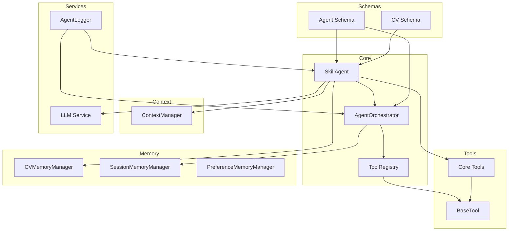
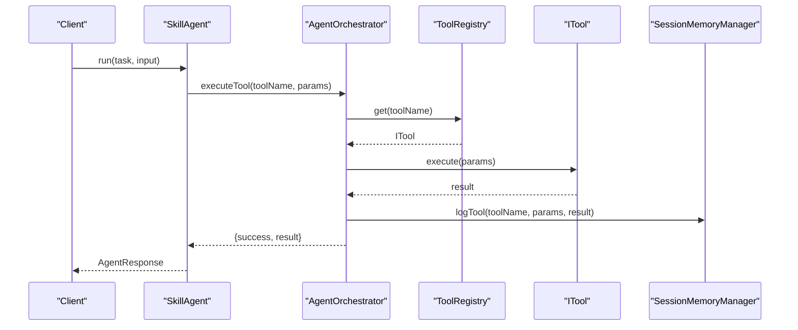
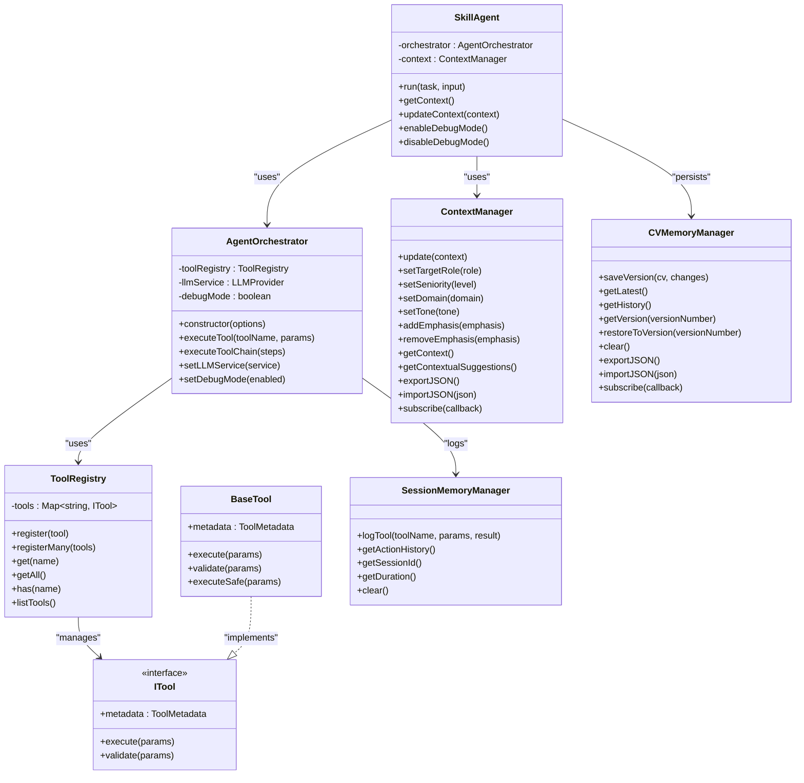
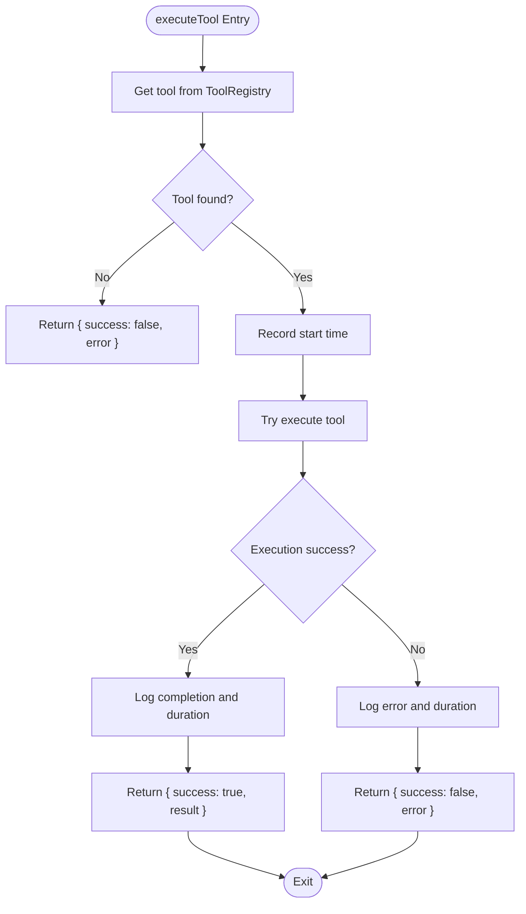
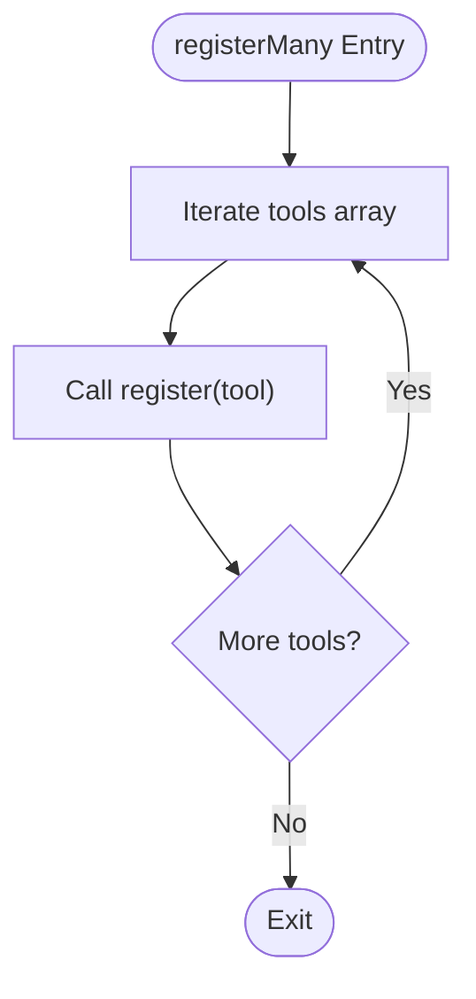
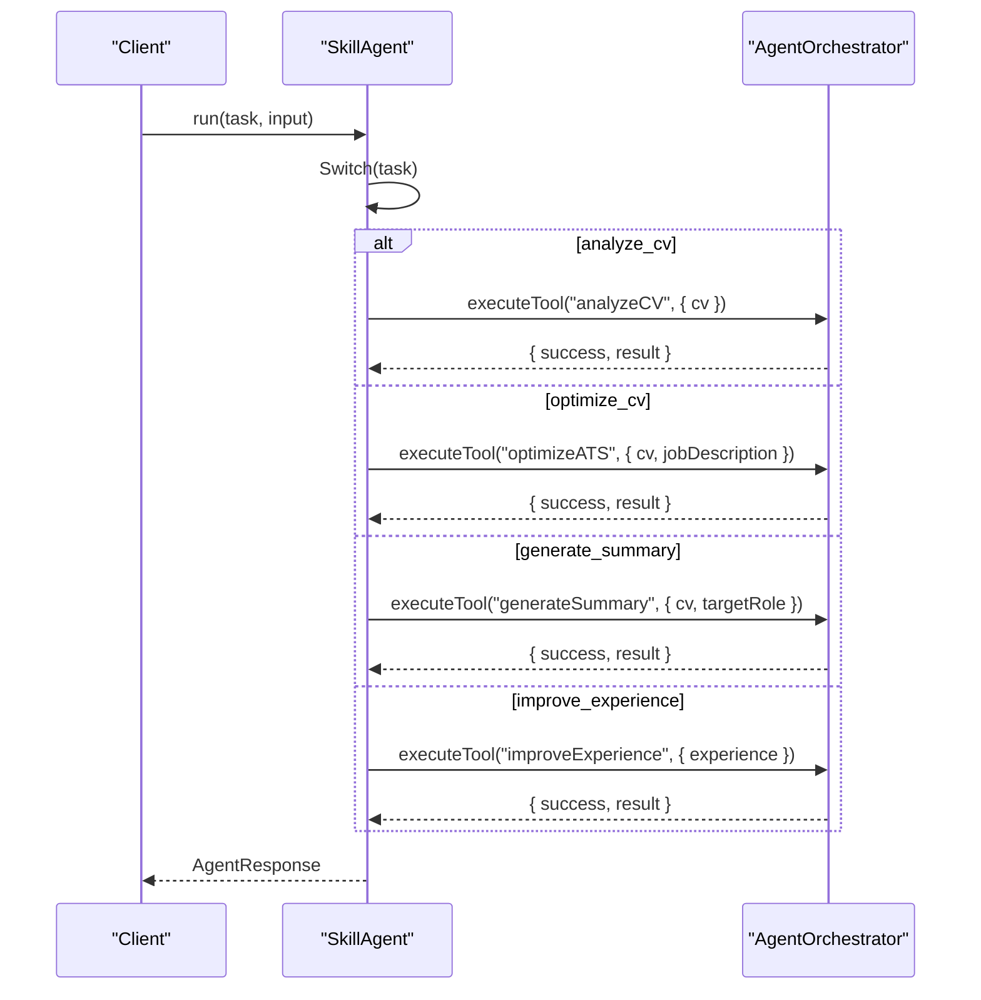
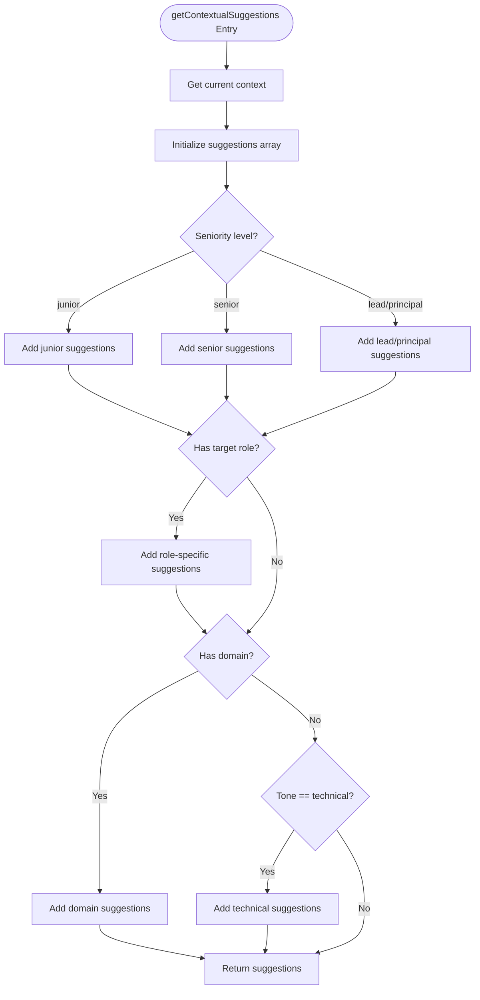
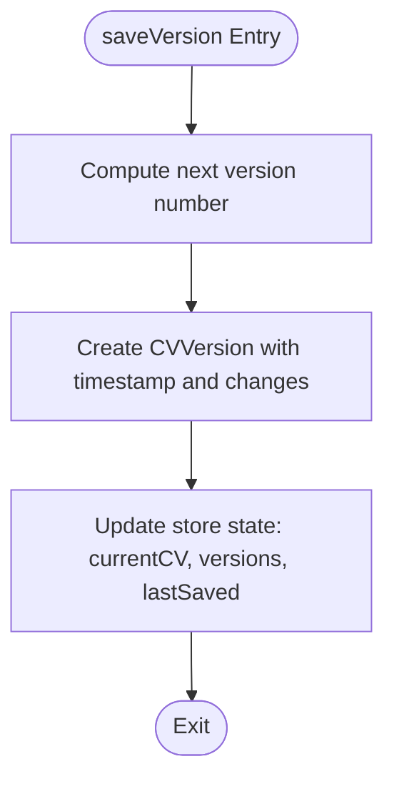
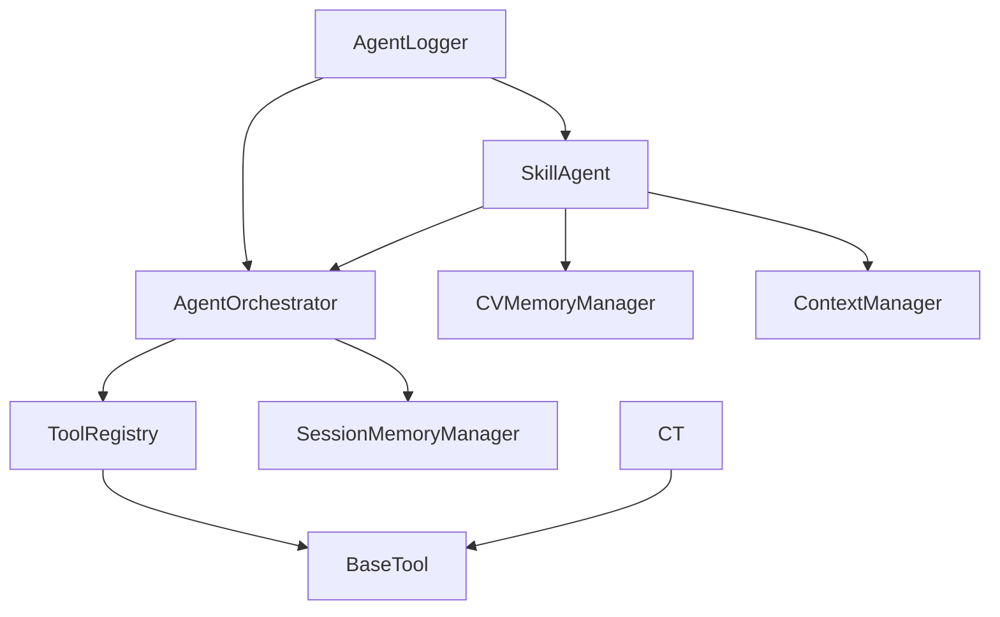

# Agent API

<cite>
**Referenced Files in This Document**
- [agent.ts](file://src/agent/core/agent.ts)
- [session.ts](file://src/agent/core/session.ts)
- [context-manager.ts](file://src/agent/context/context-manager.ts)
- [cv-memory.ts](file://src/agent/memory/cv-memory.ts)
- [base-tool.ts](file://src/agent/tools/base-tool.ts)
- [core-tools.ts](file://src/agent/tools/core-tools.ts)
- [agent.schema.ts](file://src/agent/schemas/agent.schema.ts)
- [cv.schema.ts](file://src/agent/schemas/cv.schema.ts)
- [logger.ts](file://src/agent/services/logger.ts)
- [useSkillAgent.ts](file://src/agent/hooks/useSkillAgent.ts)
- [index.ts](file://src/agent/index.ts)
</cite>

## Table of Contents
1. [Introduction](#introduction)
2. [Project Structure](#project-structure)
3. [Core Components](#core-components)
4. [Architecture Overview](#architecture-overview)
5. [Detailed Component Analysis](#detailed-component-analysis)
6. [Dependency Analysis](#dependency-analysis)
7. [Performance Considerations](#performance-considerations)
8. [Troubleshooting Guide](#troubleshooting-guide)
9. [Conclusion](#conclusion)
10. [Appendices](#appendices)

## Introduction
This document provides comprehensive API documentation for the Agent API, focusing on the AgentOrchestrator class and ToolRegistry, along with supporting components for context management, memory, and tool execution. It covers method signatures, parameter schemas, return types, error handling patterns, asynchronous operation semantics, and practical usage examples for tool execution, state management, and session handling.

## Project Structure
The Agent API is organized around a core orchestrator, a registry for tools, typed schemas for actions and contexts, memory managers for CV and session state, and a set of specialized tools. The system exposes a clean public API via the main index file.

**Diagram sources**
- [agent.ts:60-168](file://src/agent/core/agent.ts#L60-L168)
- [base-tool.ts:6-49](file://src/agent/tools/base-tool.ts#L6-L49)
- [core-tools.ts:17-475](file://src/agent/tools/core-tools.ts#L17-L475)
- [cv-memory.ts:20-291](file://src/agent/memory/cv-memory.ts#L20-L291)
- [context-manager.ts:7-225](file://src/agent/context/context-manager.ts#L7-L225)
- [agent.schema.ts:3-62](file://src/agent/schemas/agent.schema.ts#L3-L62)
- [cv.schema.ts:3-79](file://src/agent/schemas/cv.schema.ts#L3-L79)
- [logger.ts:33-351](file://src/agent/services/logger.ts#L33-L351)

**Section sources**
- [index.ts:7-43](file://src/agent/index.ts#L7-L43)

## Core Components
This section documents the primary classes and interfaces used by the Agent API.

- AgentOrchestrator: Central coordinator for tool execution, logging, and orchestration.
- ToolRegistry: Manages registration and retrieval of tools.
- SkillAgent: High-level agent wrapper exposing task-based operations.
- BaseTool and ITool: Abstractions for tool definition and execution.
- ContextManager: Manages agent context and preferences.
- CVMemoryManager and SessionMemoryManager: Persist CV versions and tool execution logs.
- AgentLogger and DebugManager: Structured logging and debugging utilities.
- Schemas: Typed definitions for AgentAction, ToolMetadata, AgentContext, and CV.

**Section sources**
- [agent.ts:60-168](file://src/agent/core/agent.ts#L60-L168)
- [base-tool.ts:6-49](file://src/agent/tools/base-tool.ts#L6-L49)
- [context-manager.ts:7-225](file://src/agent/context/context-manager.ts#L7-L225)
- [cv-memory.ts:20-291](file://src/agent/memory/cv-memory.ts#L20-L291)
- [agent.schema.ts:3-62](file://src/agent/schemas/agent.schema.ts#L3-L62)
- [cv.schema.ts:3-79](file://src/agent/schemas/cv.schema.ts#L3-L79)
- [logger.ts:33-351](file://src/agent/services/logger.ts#L33-L351)

## Architecture Overview
The Agent API follows a layered architecture:
- Orchestration layer: AgentOrchestrator coordinates tool execution and logs.
- Tool layer: Tools implement ITool and BaseTool, providing metadata and execution logic.
- Memory layer: Managers persist CV versions and session logs.
- Context layer: ContextManager maintains agent preferences and generates contextual suggestions.
- Service layer: LLM provider integration and structured logging.

**Diagram sources**
- [agent.ts:78-127](file://src/agent/core/agent.ts#L78-L127)
- [cv-memory.ts:181-194](file://src/agent/memory/cv-memory.ts#L181-L194)

## Detailed Component Analysis

### AgentOrchestrator
The AgentOrchestrator manages tool execution, debug logging, and LLM service integration.

- Constructor options:
  - toolRegistry?: ToolRegistry
  - llmService?: LLMProvider
  - debugMode?: boolean

- Methods:
  - executeTool<TParams, TResult>(toolName: string, params: TParams): Promise<{ success: boolean; result?: TResult; error?: string }>
    - Retrieves tool by name from ToolRegistry.
    - Executes tool asynchronously and logs duration.
    - On success: returns { success: true, result }.
    - On failure: returns { success: false, error }.
    - Logs to session memory on completion.
  - executeToolChain(steps: Array<{ tool: string; params: unknown }>): Promise<Array<{ tool: string; result: unknown; error?: string }>>
    - Executes a sequence of tools; stops on first failure.
    - Returns ordered results with tool name, result, and optional error.
  - setLLMService(service: LLMProvider): void
  - setDebugMode(enabled: boolean): void

- Error handling:
  - Throws descriptive errors when tool is not found.
  - Catches exceptions during tool execution and returns standardized error object.
  - Debug mode enables console logging for execution start/end and failures.

- Asynchronous operations:
  - All tool execution is asynchronous.
  - Chain execution proceeds sequentially with early termination on failure.

- Performance considerations:
  - Execution timing is measured and logged.
  - Debug logging adds overhead; disable in production.

**Section sources**
- [agent.ts:60-168](file://src/agent/core/agent.ts#L60-L168)

### ToolRegistry
Manages tool registration and retrieval.

- Methods:
  - register(tool: ITool): void
  - registerMany(tools: Array<ITool>): void
  - get(name: string): ITool | undefined
  - getAll(): Array<ITool>
  - has(name: string): boolean
  - listTools(): Array<string>

- Error handling:
  - get returns undefined if tool not found; callers should handle this case.

- Performance considerations:
  - Uses Map for O(1) lookup by tool name.

**Section sources**
- [agent.ts:11-55](file://src/agent/core/agent.ts#L11-L55)

### SkillAgent
High-level agent wrapper that exposes task-based operations.

- Methods:
  - run(task: AgentTask, input: Record<string, unknown>): Promise<AgentResponse>
    - Supports tasks: 'analyze_cv', 'optimize_cv', 'generate_summary', 'improve_experience'.
    - Returns AgentResponse with success flag, result, actions, and metadata.
    - On error: returns { success: false, error, metadata }.
  - Private helpers:
    - analyzeCV(cv: CV): Promise<unknown>
    - optimizeCV(cv: CV, jobDescription?: string): Promise<unknown>
    - generateSummary(cv: CV, targetRole: string): Promise<string>
    - improveExperience(experience: any): Promise<unknown>
  - Context management:
    - getContext(): AgentContext
    - updateContext(context: Partial<AgentContext>): void
    - enableDebugMode(): void
    - disableDebugMode(): void

- Error handling:
  - Throws on tool execution failures inside private helpers.
  - run catches and returns standardized error response.

- Asynchronous operations:
  - All operations are asynchronous.

**Section sources**
- [agent.ts:173-376](file://src/agent/core/agent.ts#L173-L376)

### BaseTool and ITool
Defines the tool contract and safe execution wrapper.

- ITool<TParams, TResult>:
  - metadata: ToolMetadata
  - execute(params: TParams): Promise<TResult>
  - validate?(params: TParams): boolean
- BaseTool<TParams, TResult>:
  - Implements ITool.
  - validate defaults to true; override for custom validation.
  - executeSafe(params: TParams): Promise<ToolResult<TResult>>

- ToolResult<T>:
  - success: boolean
  - data?: T
  - error?: string
  - warnings?: Array<string>
  - metadata?: Record<string, unknown>

- ToolCallLog:
  - toolName: string
  - params: unknown
  - result: unknown
  - duration: number
  - timestamp: Date

**Section sources**
- [base-tool.ts:6-72](file://src/agent/tools/base-tool.ts#L6-L72)

### Core Tools
The system includes several core tools implementing BaseTool:

- AnalyzeCVTool: Analyzes CV completeness and sections.
- GenerateSummaryTool: Creates a tailored summary using LLM integration.
- ImproveExperienceTool: Enhances experience bullet points with metrics and action verbs.
- ExtractSkillsTool: Deduplicates and categorizes skills.
- OptimizeATSTool: Optimizes CV for ATS keyword matching.
- MapToUISectionsTool: Maps CV data to UI-ready sections.

Each tool defines metadata with name, description, parameters, category, and requiresLLM flag.

**Section sources**
- [core-tools.ts:17-475](file://src/agent/tools/core-tools.ts#L17-L475)

### ContextManager
Manages agent context and preferences.

- Methods:
  - update(context: Partial<AgentContext>): void
  - setTargetRole(role: string): void
  - setSeniority(level: SeniorityLevel): void
  - setDomain(domain: string): void
  - setTone(tone: Tone): void
  - addEmphasis(emphasis: Emphasis): void
  - removeEmphasis(emphasis: Emphasis): void
  - getContext(): AgentContext
  - getContextualSuggestions(): Array<string>
  - exportJSON(): string
  - importJSON(json: string): boolean
  - subscribe(callback: (context: AgentContext) => void): () => void

- Derived states:
  - isComplete: boolean
  - targetRole: string | undefined
  - seniority: SeniorityLevel | undefined

**Section sources**
- [context-manager.ts:7-225](file://src/agent/context/context-manager.ts#L7-L225)

### CVMemoryManager and SessionMemoryManager
Persist CV versions and tool execution logs.

- CVMemoryManager:
  - saveVersion(cv: CV, changes?: Array<string>): void
  - getLatest(): CV | null
  - getHistory(): Array<CVVersion>
  - getVersion(versionNumber: number): CVVersion | null
  - restoreToVersion(versionNumber: number): boolean
  - clear(): void
  - exportJSON(): string
  - importJSON(json: string): boolean
  - subscribe(callback: (cv: CV | null) => void): () => void
- SessionMemoryManager:
  - logTool(toolName: string, params: unknown, result: unknown): void
  - getActionHistory(): Array<{ tool: string; params: unknown; result: unknown; timestamp: Date }>
  - getSessionId(): string
  - getDuration(): number
  - clear(): void

**Section sources**
- [cv-memory.ts:20-291](file://src/agent/memory/cv-memory.ts#L20-L291)

### AgentLogger and DebugManager
Structured logging and debugging utilities.

- AgentLogger:
  - Levels: debug, info, warn, error
  - Methods: debug, info, warn, error, logToolExecution, logToolFailure, subscribe, getRecentLogs, clear, exportJSON, setMinLevel, enableConsoleOutput, disableConsoleOutput
- DebugManager:
  - enable, disable, toggleToolCalls, toggleStateChanges
  - getStatus, getRecentToolCalls, getStatistics

**Section sources**
- [logger.ts:33-351](file://src/agent/services/logger.ts#L33-L351)

### Schemas
Typed definitions for actions, metadata, context, and CV.

- AgentAction: type AgentAction = z.infer<typeof agentActionSchema>
- ToolMetadata: type ToolMetadata = z.infer<typeof toolMetadataSchema>
- AgentContext: type AgentContext = z.infer<typeof agentContextSchema>
- CV: type CV = z.infer<typeof cvSchema>

- Validation schemas:
  - agentActionSchema, toolMetadataSchema, agentContextSchema, cvSchema

**Section sources**
- [agent.schema.ts:3-62](file://src/agent/schemas/agent.schema.ts#L3-L62)
- [cv.schema.ts:3-79](file://src/agent/schemas/cv.schema.ts#L3-L79)

## Architecture Overview

**Diagram sources**
- [agent.ts:60-168](file://src/agent/core/agent.ts#L60-L168)
- [base-tool.ts:6-49](file://src/agent/tools/base-tool.ts#L6-L49)
- [context-manager.ts:7-225](file://src/agent/context/context-manager.ts#L7-L225)
- [cv-memory.ts:20-291](file://src/agent/memory/cv-memory.ts#L20-L291)

## Detailed Component Analysis

### AgentOrchestrator.executeTool
Executes a single tool with robust error handling and logging.

**Diagram sources**
- [agent.ts:78-127](file://src/agent/core/agent.ts#L78-L127)

**Section sources**
- [agent.ts:78-127](file://src/agent/core/agent.ts#L78-L127)

### ToolRegistry.registerMany
Registers multiple tools efficiently.

**Diagram sources**
- [agent.ts:24-26](file://src/agent/core/agent.ts#L24-L26)

**Section sources**
- [agent.ts:24-26](file://src/agent/core/agent.ts#L24-L26)

### SkillAgent.run
Coordinates task execution and aggregates results.

**Diagram sources**
- [agent.ts:188-281](file://src/agent/core/agent.ts#L188-L281)

**Section sources**
- [agent.ts:188-281](file://src/agent/core/agent.ts#L188-L281)

### ContextManager.getContextualSuggestions
Generates contextual suggestions based on current context.

**Diagram sources**
- [context-manager.ts:139-179](file://src/agent/context/context-manager.ts#L139-L179)

**Section sources**
- [context-manager.ts:139-179](file://src/agent/context/context-manager.ts#L139-L179)

### CVMemoryManager.saveVersion
Persists CV versions with timestamps and change logs.

**Diagram sources**
- [cv-memory.ts:56-73](file://src/agent/memory/cv-memory.ts#L56-L73)

**Section sources**
- [cv-memory.ts:56-73](file://src/agent/memory/cv-memory.ts#L56-L73)

## Dependency Analysis

**Diagram sources**
- [agent.ts:60-168](file://src/agent/core/agent.ts#L60-L168)
- [cv-memory.ts:20-291](file://src/agent/memory/cv-memory.ts#L20-L291)
- [context-manager.ts:7-225](file://src/agent/context/context-manager.ts#L7-L225)
- [logger.ts:33-351](file://src/agent/services/logger.ts#L33-L351)

**Section sources**
- [agent.ts:60-168](file://src/agent/core/agent.ts#L60-L168)
- [cv-memory.ts:20-291](file://src/agent/memory/cv-memory.ts#L20-L291)
- [context-manager.ts:7-225](file://src/agent/context/context-manager.ts#L7-L225)
- [logger.ts:33-351](file://src/agent/services/logger.ts#L33-L351)

## Performance Considerations
- Debug mode adds console logging overhead; disable in production.
- Tool execution timing is measured and logged; consider disabling logging for high-throughput scenarios.
- ToolRegistry uses Map for O(1) lookups; ensure tool names are unique and consistent.
- CVMemoryManager and SessionMemoryManager maintain in-memory state; consider persistence strategies for long-running sessions.
- LLM integration can be a bottleneck; batch operations and cache results where appropriate.

[No sources needed since this section provides general guidance]

## Troubleshooting Guide
- Tool not found:
  - Symptom: executeTool returns { success: false, error } with tool name.
  - Resolution: Verify tool registration and name spelling.
- Tool execution failure:
  - Symptom: Exception caught and returned as error string.
  - Resolution: Inspect tool validate logic and input parameters; enable debug mode for detailed logs.
- Context import/export:
  - Symptom: importJSON returns false.
  - Resolution: Validate JSON structure against AgentContext schema.
- Session persistence:
  - Symptom: Session not restored or cleared unexpectedly.
  - Resolution: Check localStorage availability and permissions; review clearSession behavior.

**Section sources**
- [agent.ts:84-89](file://src/agent/core/agent.ts#L84-L89)
- [base-tool.ts:30-48](file://src/agent/tools/base-tool.ts#L30-L48)
- [context-manager.ts:203-211](file://src/agent/context/context-manager.ts#L203-L211)
- [cv-memory.ts:131-139](file://src/agent/memory/cv-memory.ts#L131-L139)
- [session.ts:117-125](file://src/agent/core/session.ts#L117-L125)

## Conclusion
The Agent API provides a robust, extensible framework for orchestrating tool-based operations, managing context and state, and delivering structured logging and debugging capabilities. Its modular design allows for easy integration of new tools and services while maintaining consistent error handling and performance characteristics.

[No sources needed since this section summarizes without analyzing specific files]

## Appendices

### API Reference: AgentOrchestrator
- executeTool(toolName, params): Promise<{ success: boolean; result?: TResult; error?: string }>
- executeToolChain(steps): Promise<Array<{ tool: string; result: unknown; error?: string }>>
- setLLMService(service): void
- setDebugMode(enabled): void

**Section sources**
- [agent.ts:78-168](file://src/agent/core/agent.ts#L78-L168)

### API Reference: ToolRegistry
- register(tool): void
- registerMany(tools): void
- get(name): ITool | undefined
- getAll(): ITool[]
- has(name): boolean
- listTools(): string[]

**Section sources**
- [agent.ts:11-55](file://src/agent/core/agent.ts#L11-L55)

### API Reference: SkillAgent
- run(task, input): Promise<AgentResponse>
- getContext(): AgentContext
- updateContext(context): void
- enableDebugMode(): void
- disableDebugMode(): void

**Section sources**
- [agent.ts:173-376](file://src/agent/core/agent.ts#L173-L376)

### API Reference: BaseTool and ITool
- ITool.metadata: ToolMetadata
- ITool.execute(params): Promise<TResult>
- ITool.validate?(params): boolean
- BaseTool.executeSafe(params): Promise<ToolResult<TResult>>

**Section sources**
- [base-tool.ts:6-49](file://src/agent/tools/base-tool.ts#L6-L49)

### API Reference: ContextManager
- update(context): void
- setTargetRole(role): void
- setSeniority(level): void
- setDomain(domain): void
- setTone(tone): void
- addEmphasis(emphasis): void
- removeEmphasis(emphasis): void
- getContext(): AgentContext
- getContextualSuggestions(): string[]
- exportJSON(): string
- importJSON(json): boolean
- subscribe(callback): () => void

**Section sources**
- [context-manager.ts:57-225](file://src/agent/context/context-manager.ts#L57-L225)

### API Reference: Memory Managers
- CVMemoryManager.saveVersion(cv, changes): void
- CVMemoryManager.getLatest(): CV | null
- CVMemoryManager.getHistory(): CVVersion[]
- CVMemoryManager.getVersion(versionNumber): CVVersion | null
- CVMemoryManager.restoreToVersion(versionNumber): boolean
- CVMemoryManager.clear(): void
- CVMemoryManager.exportJSON(): string
- CVMemoryManager.importJSON(json): boolean
- CVMemoryManager.subscribe(callback): () => void

- SessionMemoryManager.logTool(toolName, params, result): void
- SessionMemoryManager.getActionHistory(): ToolCallLog[]
- SessionMemoryManager.getSessionId(): string
- SessionMemoryManager.getDuration(): number
- SessionMemoryManager.clear(): void

**Section sources**
- [cv-memory.ts:56-227](file://src/agent/memory/cv-memory.ts#L56-L227)

### Usage Examples
- Tool execution patterns:
  - Use AgentOrchestrator.executeTool to run a single tool.
  - Use AgentOrchestrator.executeToolChain to run multiple tools sequentially.
- State management:
  - Use CVMemoryManager.saveVersion to persist CV versions.
  - Use SessionMemoryManager.logTool to track tool executions.
- Session handling:
  - Use SessionManager to manage session lifecycle and persistence.
  - Use SessionManager.exportSessionData to serialize session state.

**Section sources**
- [agent.ts:78-153](file://src/agent/core/agent.ts#L78-L153)
- [cv-memory.ts:56-194](file://src/agent/memory/cv-memory.ts#L56-L194)
- [session.ts:33-200](file://src/agent/core/session.ts#L33-L200)