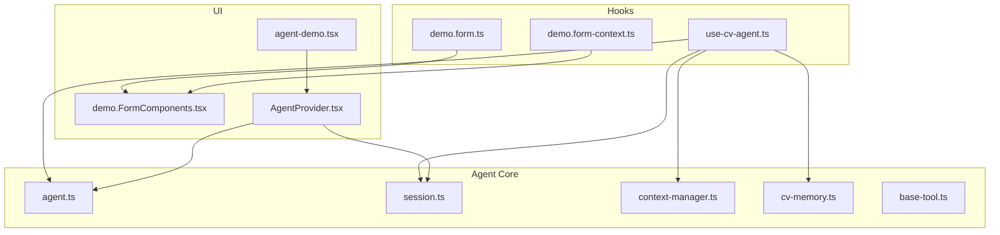
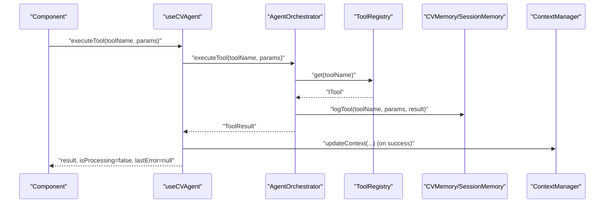
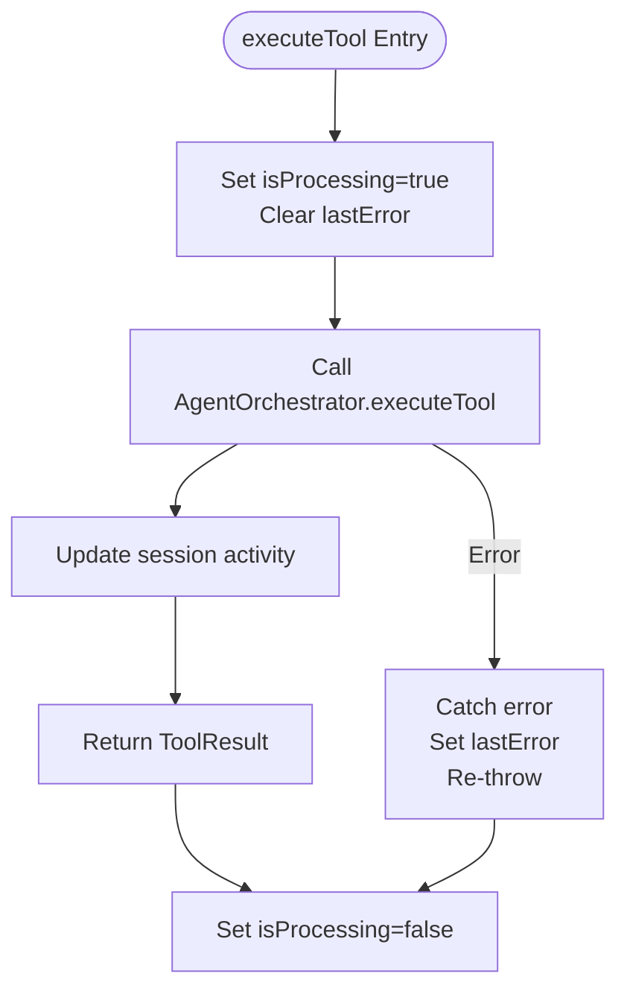
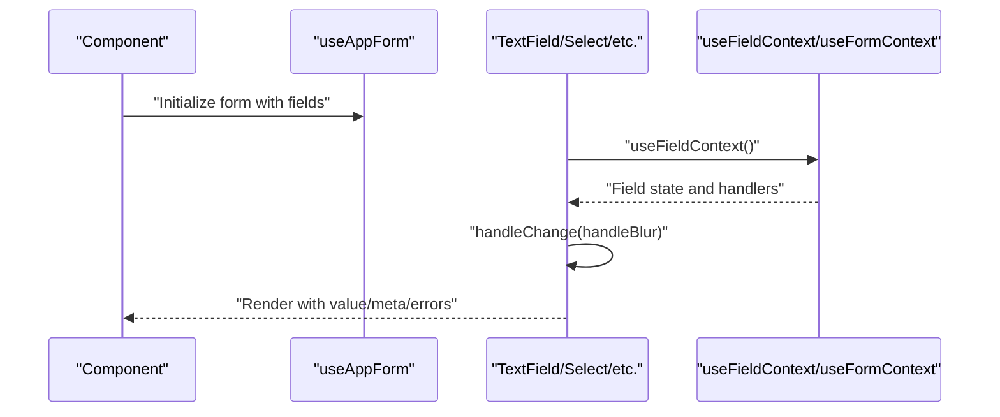
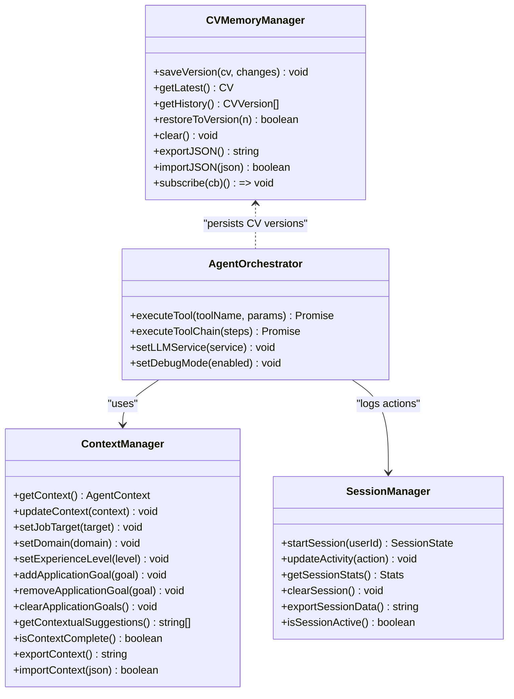
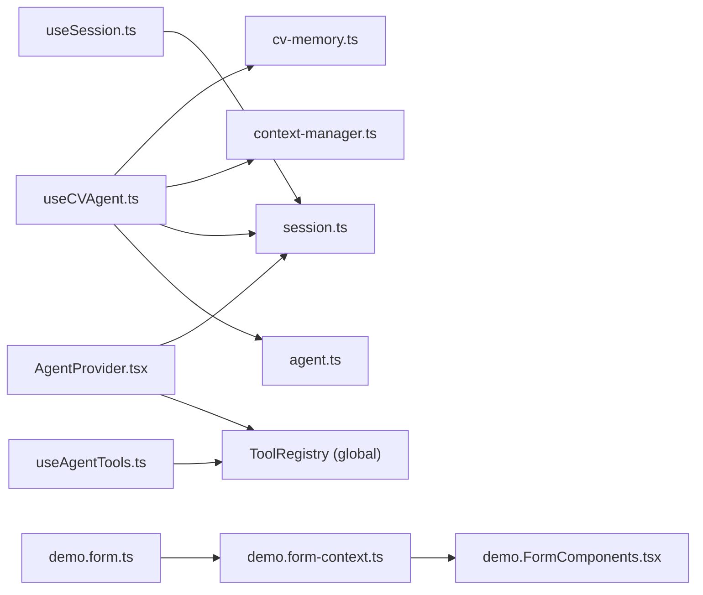

# Hook API

<cite>
**Referenced Files in This Document**
- [use-cv-agent.ts](file://src/hooks/use-cv-agent.ts)
- [demo.form.ts](file://src/hooks/demo.form.ts)
- [demo.form-context.ts](file://src/hooks/demo.form-context.ts)
- [demo.FormComponents.tsx](file://src/components/demo.FormComponents.tsx)
- [AgentProvider.tsx](file://src/components/AgentProvider.tsx)
- [agent.ts](file://src/agent/core/agent.ts)
- [session.ts](file://src/agent/core/session.ts)
- [context-manager.ts](file://src/agent/memory/context-manager.ts)
- [cv-memory.ts](file://src/agent/memory/cv-memory.ts)
- [base-tool.ts](file://src/agent/tools/base-tool.ts)
- [agent.schema.ts](file://src/agent/schemas/agent.schema.ts)
- [cv.schema.ts](file://src/agent/schemas/cv.schema.ts)
- [agent-demo.tsx](file://src/routes/agent-demo.tsx)
</cite>

## Table of Contents
1. [Introduction](#introduction)
2. [Project Structure](#project-structure)
3. [Core Components](#core-components)
4. [Architecture Overview](#architecture-overview)
5. [Detailed Component Analysis](#detailed-component-analysis)
6. [Dependency Analysis](#dependency-analysis)
7. [Performance Considerations](#performance-considerations)
8. [Troubleshooting Guide](#troubleshooting-guide)
9. [Conclusion](#conclusion)

## Introduction
This document provides comprehensive API documentation for the Hook API in the CV Portfolio Builder project. It focuses on:
- The use-cv-agent hooks for agent initialization, tool execution, suggestion retrieval, and state management
- Demo form hooks including useForm and useFormContext, and form state management utilities
- Hook parameters, return values, usage patterns, React hook dependencies, state updates, and side effects
- Examples of hook usage in components, error handling, and performance optimization
- Hook composition patterns, custom hook development, and integration with the agent system

## Project Structure
The Hook API spans several modules:
- Hooks for agent integration and reactive CV data
- Form hooks built on TanStack React Form
- Agent orchestration and memory systems
- UI components that consume hooks and render forms

**Diagram sources**
- [use-cv-agent.ts:1-182](file://src/hooks/use-cv-agent.ts#L1-L182)
- [demo.form.ts:1-18](file://src/hooks/demo.form.ts#L1-L18)
- [demo.form-context.ts:1-5](file://src/hooks/demo.form-context.ts#L1-L5)
- [demo.FormComponents.tsx:1-159](file://src/components/demo.FormComponents.tsx#L1-L159)
- [AgentProvider.tsx:1-30](file://src/components/AgentProvider.tsx#L1-L30)
- [agent.ts:1-414](file://src/agent/core/agent.ts#L1-L414)
- [session.ts:1-204](file://src/agent/core/session.ts#L1-L204)
- [context-manager.ts:1-141](file://src/agent/memory/context-manager.ts#L1-L141)
- [cv-memory.ts:1-290](file://src/agent/memory/cv-memory.ts#L1-L290)
- [base-tool.ts:1-72](file://src/agent/tools/base-tool.ts#L1-L72)
- [agent-demo.tsx:1-138](file://src/routes/agent-demo.tsx#L1-L138)

**Section sources**
- [use-cv-agent.ts:1-182](file://src/hooks/use-cv-agent.ts#L1-L182)
- [demo.form.ts:1-18](file://src/hooks/demo.form.ts#L1-L18)
- [demo.form-context.ts:1-5](file://src/hooks/demo.form-context.ts#L1-L5)
- [demo.FormComponents.tsx:1-159](file://src/components/demo.FormComponents.tsx#L1-L159)
- [AgentProvider.tsx:1-30](file://src/components/AgentProvider.tsx#L1-L30)
- [agent.ts:1-414](file://src/agent/core/agent.ts#L1-L414)
- [session.ts:1-204](file://src/agent/core/session.ts#L1-L204)
- [context-manager.ts:1-141](file://src/agent/memory/context-manager.ts#L1-L141)
- [cv-memory.ts:1-290](file://src/agent/memory/cv-memory.ts#L1-L290)
- [base-tool.ts:1-72](file://src/agent/tools/base-tool.ts#L1-L72)
- [agent-demo.tsx:1-138](file://src/routes/agent-demo.tsx#L1-L138)

## Core Components
This section documents the primary hook APIs and their responsibilities.

- useCVAgent
  - Purpose: Provides agent orchestration and state management for CV-related tasks
  - Exposed methods and properties:
    - executeTool(toolName, params?): Promise<ToolResult<TResult>>
    - getSuggestions(): Promise<string[]>
    - runAnalysis(): Promise<AnalysisResult>
    - updateContext(context): void
    - exportState(): AgentState
    - isProcessing: boolean
    - lastError: string | null
  - Dependencies and side effects:
    - Uses internal agent orchestrator and session manager
    - Updates loading and error state during async operations
    - Logs session activity on tool execution
  - Typical usage pattern:
    - Wrap components with AgentProvider to initialize global tool registry and session
    - Call executeTool with tool name and parameters; handle isProcessing and lastError
    - Use getSuggestions and runAnalysis for agent-driven insights

- useCVData
  - Purpose: Reactive access to CV data, context, completeness, skills, and last modified timestamp
  - Returns:
    - cv: CV
    - context: AgentContext
    - completeness: number
    - skills: any[]
    - lastModified: Date | null

- useAgentTools
  - Purpose: Access available agent tools and group them by category
  - Returns:
    - availableTools: ToolMetadata[]
    - toolsByCategory: Record<string, ToolMetadata[]>

- useSession
  - Purpose: Manage session lifecycle and statistics
  - Returns:
    - stats: { duration, actionsCount, lastActive }
    - clearSession(): void
    - exportData(): string
    - isActive: boolean
  - Side effect:
    - Periodically updates stats via interval

- useForm and useFormContext (Demo Form)
  - Purpose: Create and consume typed form hooks with field and form contexts
  - Exposed:
    - useAppForm: typed form hook factory configured with field/form components and contexts
    - fieldContext and formContext: TanStack React Form contexts
  - Field components:
    - TextField, TextArea, Select, Slider, Switch
    - SubscribeButton renders submit button bound to form submission state

**Section sources**
- [use-cv-agent.ts:10-182](file://src/hooks/use-cv-agent.ts#L10-L182)
- [demo.form.ts:6-17](file://src/hooks/demo.form.ts#L6-L17)
- [demo.form-context.ts:3-4](file://src/hooks/demo.form-context.ts#L3-L4)
- [demo.FormComponents.tsx:13-159](file://src/components/demo.FormComponents.tsx#L13-L159)

## Architecture Overview
The Hook API integrates with the agent system and reactive stores to provide a cohesive developer experience.

**Diagram sources**
- [use-cv-agent.ts:17-46](file://src/hooks/use-cv-agent.ts#L17-L46)
- [agent.ts:78-127](file://src/agent/core/agent.ts#L78-L127)
- [cv-memory.ts:180-193](file://src/agent/memory/cv-memory.ts#L180-L193)
- [context-manager.ts:27-29](file://src/agent/memory/context-manager.ts#L27-L29)

**Section sources**
- [use-cv-agent.ts:10-101](file://src/hooks/use-cv-agent.ts#L10-L101)
- [agent.ts:60-168](file://src/agent/core/agent.ts#L60-L168)
- [cv-memory.ts:149-227](file://src/agent/memory/cv-memory.ts#L149-L227)
- [context-manager.ts:7-29](file://src/agent/memory/context-manager.ts#L7-L29)

## Detailed Component Analysis

### useCVAgent Hook
- Initialization and setup
  - Initializes internal state for processing and error tracking
  - Exposes methods for tool execution, suggestions, analysis, context updates, and state export
- Execution flow
  - executeTool wraps tool invocation with loading/error state and session activity logging
  - getSuggestions and runAnalysis provide agent-driven insights with controlled error handling
  - updateContext delegates to ContextManager
  - exportState delegates to AgentOrchestrator
- Dependencies and memoization
  - Methods are memoized to prevent unnecessary re-renders
  - Dependencies arrays are empty where appropriate to stabilize callbacks
- Error handling
  - Catches exceptions, sets lastError, and re-throws for upstream handling
  - Provides fallbacks for suggestions and analysis to avoid blocking UI

**Diagram sources**
- [use-cv-agent.ts:17-46](file://src/hooks/use-cv-agent.ts#L17-L46)
- [session.ts:57-70](file://src/agent/core/session.ts#L57-L70)

**Section sources**
- [use-cv-agent.ts:10-101](file://src/hooks/use-cv-agent.ts#L10-L101)
- [session.ts:57-70](file://src/agent/core/session.ts#L57-L70)

### useCVData Hook
- Purpose: Provide reactive access to CV state and derived values
- Data sources:
  - CV data from cvStore
  - Context from cvStore
  - Completeness score from cvCompletenessScore
  - Categorized skills from categorizedSkills
  - Last modified timestamp from cvStore

**Section sources**
- [use-cv-agent.ts:106-120](file://src/hooks/use-cv-agent.ts#L106-L120)

### useAgentTools Hook
- Purpose: Expose available tools and organize them by category
- Behavior:
  - Reads from a global tool registry exposed by AgentProvider
  - Groups tools by metadata.category into a dictionary
- Return:
  - availableTools: array of tool metadata
  - toolsByCategory: mapping from category to tools

**Section sources**
- [use-cv-agent.ts:125-149](file://src/hooks/use-cv-agent.ts#L125-L149)
- [AgentProvider.tsx:14-16](file://src/components/AgentProvider.tsx#L14-L16)

### useSession Hook
- Purpose: Manage session lifecycle and expose stats
- Behavior:
  - Initializes stats from session manager
  - Sets up periodic updates every minute
  - Provides clearSession and exportData helpers
- Return:
  - stats: session metrics
  - clearSession: clears and resets session
  - exportData: exports combined session and CV/context data
  - isActive: checks recent activity threshold

**Section sources**
- [use-cv-agent.ts:154-181](file://src/hooks/use-cv-agent.ts#L154-L181)
- [session.ts:130-170](file://src/agent/core/session.ts#L130-L170)

### Demo Form Hooks and Components
- useForm and useFormContext
  - useForm is created via createFormHook with configured field and form components
  - useFormContext and useFieldContext provide typed access to form and field state
- Field components
  - TextField, TextArea, Select, Slider, Switch bind to field state and validation
  - SubscribeButton disables itself while the form is submitting
- Usage pattern
  - Define form components and field components in a hook factory
  - Render components inside a form container that consumes the form context

**Diagram sources**
- [demo.form.ts:6-17](file://src/hooks/demo.form.ts#L6-L17)
- [demo.form-context.ts:3-4](file://src/hooks/demo.form-context.ts#L3-L4)
- [demo.FormComponents.tsx:41-159](file://src/components/demo.FormComponents.tsx#L41-L159)

**Section sources**
- [demo.form.ts:6-17](file://src/hooks/demo.form.ts#L6-L17)
- [demo.form-context.ts:3-4](file://src/hooks/demo.form-context.ts#L3-L4)
- [demo.FormComponents.tsx:13-159](file://src/components/demo.FormComponents.tsx#L13-L159)

### AgentProvider Integration
- Purpose: Initialize global tool registry and session on mount
- Behavior:
  - Exposes ToolRegistry instance on window for hooks to access
  - Starts a session via sessionManager
- Impact:
  - Enables useAgentTools to enumerate tools
  - Ensures session activity logging and persistence

**Section sources**
- [AgentProvider.tsx:12-26](file://src/components/AgentProvider.tsx#L12-L26)
- [session.ts:33-52](file://src/agent/core/session.ts#L33-L52)

### Agent Orchestration and Memory
- AgentOrchestrator
  - Executes tools, logs actions, and manages debug mode
  - Supports tool chain execution and LLM service integration
- SessionManager
  - Manages session lifecycle, persistence, and statistics
- ContextManager
  - Maintains and updates agent context for personalization
- CVMemoryManager
  - Tracks CV versions and exposes derived states

**Diagram sources**
- [agent.ts:60-168](file://src/agent/core/agent.ts#L60-L168)
- [session.ts:7-200](file://src/agent/core/session.ts#L7-L200)
- [context-manager.ts:7-141](file://src/agent/memory/context-manager.ts#L7-L141)
- [cv-memory.ts:19-148](file://src/agent/memory/cv-memory.ts#L19-L148)

**Section sources**
- [agent.ts:60-168](file://src/agent/core/agent.ts#L60-L168)
- [session.ts:7-200](file://src/agent/core/session.ts#L7-L200)
- [context-manager.ts:7-141](file://src/agent/memory/context-manager.ts#L7-L141)
- [cv-memory.ts:19-148](file://src/agent/memory/cv-memory.ts#L19-L148)

## Dependency Analysis
- Hook-to-module dependencies
  - useCVAgent depends on AgentOrchestrator, SessionManager, ContextManager, and TanStack Store
  - useAgentTools depends on a global ToolRegistry exposed by AgentProvider
  - useSession depends on SessionManager
  - useForm and useFormContext depend on TanStack React Form contexts and components
- Coupling and cohesion
  - Hooks encapsulate orchestration logic, minimizing coupling in components
  - Context and memory managers provide focused responsibilities
- External dependencies
  - TanStack Store for reactive state
  - TanStack React Form for form state and validation
  - Zod schemas for type safety

**Diagram sources**
- [use-cv-agent.ts:1-182](file://src/hooks/use-cv-agent.ts#L1-L182)
- [agent.ts:1-414](file://src/agent/core/agent.ts#L1-L414)
- [session.ts:1-204](file://src/agent/core/session.ts#L1-L204)
- [context-manager.ts:1-141](file://src/agent/memory/context-manager.ts#L1-L141)
- [cv-memory.ts:1-290](file://src/agent/memory/cv-memory.ts#L1-L290)
- [demo.form.ts:1-18](file://src/hooks/demo.form.ts#L1-L18)
- [demo.form-context.ts:1-5](file://src/hooks/demo.form-context.ts#L1-L5)
- [demo.FormComponents.tsx:1-159](file://src/components/demo.FormComponents.tsx#L1-L159)
- [AgentProvider.tsx:1-30](file://src/components/AgentProvider.tsx#L1-L30)

**Section sources**
- [use-cv-agent.ts:1-182](file://src/hooks/use-cv-agent.ts#L1-L182)
- [demo.form.ts:1-18](file://src/hooks/demo.form.ts#L1-L18)
- [demo.form-context.ts:1-5](file://src/hooks/demo.form-context.ts#L1-L5)
- [demo.FormComponents.tsx:1-159](file://src/components/demo.FormComponents.tsx#L1-L159)
- [AgentProvider.tsx:1-30](file://src/components/AgentProvider.tsx#L1-L30)

## Performance Considerations
- Memoization
  - Use useCallback for hook methods to prevent unnecessary re-renders
  - Keep dependencies minimal; empty arrays where appropriate
- Asynchronous operations
  - Use isProcessing to gate UI interactions and avoid concurrent operations
  - Debounce or throttle frequent updates (e.g., session stats interval)
- Derived state
  - Prefer derived values from TanStack Store to avoid recomputation
- Tool execution
  - Batch tool calls when possible and handle partial failures gracefully
- Form rendering
  - Use field-level subscriptions to minimize re-renders in large forms

## Troubleshooting Guide
- Common errors and handling
  - Tool not found: executeTool returns a structured error; check toolName and registration
  - Validation failures: BaseTool.executeSafe wraps validation errors; inspect warnings and error messages
  - Session persistence: SessionManager handles load/save errors; verify localStorage availability
  - Context completeness: ContextManager.isContextComplete indicates missing required fields
- Debugging tips
  - Enable debug mode in AgentOrchestrator to log tool execution timing
  - Inspect exported state via exportState and exportData for diagnostics
  - Monitor lastError from useCVAgent for transient failures
- Recovery patterns
  - Clear session with clearSession and restart to reset state
  - Reinitialize ToolRegistry via AgentProvider if tools are missing
  - Validate form state with field meta and error collections

**Section sources**
- [use-cv-agent.ts:17-46](file://src/hooks/use-cv-agent.ts#L17-L46)
- [base-tool.ts:30-48](file://src/agent/tools/base-tool.ts#L30-L48)
- [session.ts:75-90](file://src/agent/core/session.ts#L75-L90)
- [context-manager.ts:112-115](file://src/agent/memory/context-manager.ts#L112-L115)

## Conclusion
The Hook API provides a robust, composable foundation for integrating agent-driven capabilities and form management into the CV Portfolio Builder. By leveraging memoized hooks, reactive stores, and structured orchestration, developers can build responsive, maintainable features. Proper error handling, performance optimizations, and clear separation of concerns ensure scalability and reliability across components.