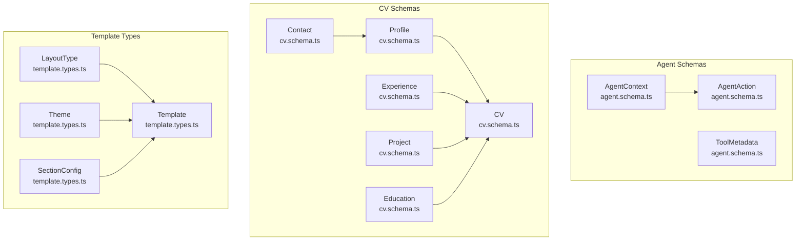
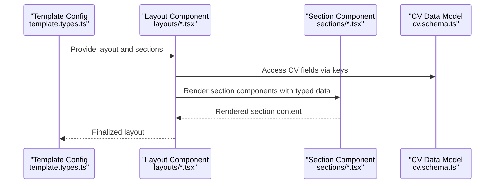
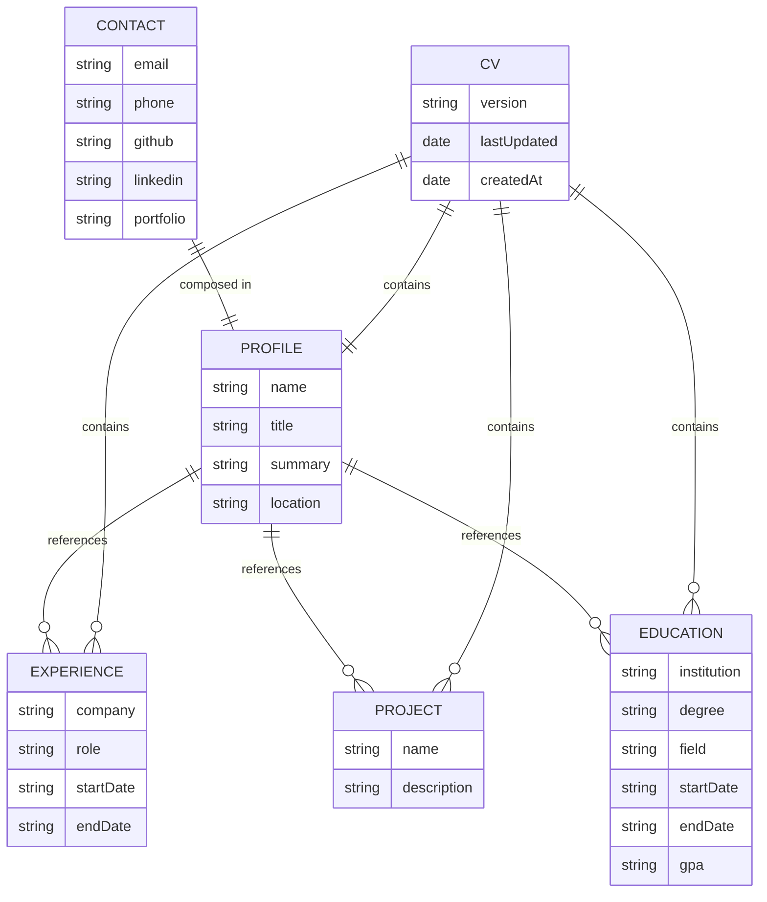
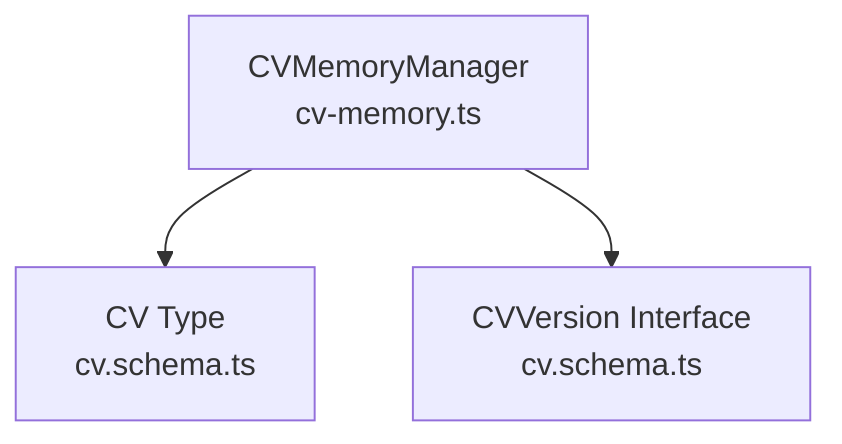

# Schema API

<cite>
**Referenced Files in This Document**
- [agent.schema.ts](file://src/agent/schemas/agent.schema.ts)
- [cv.schema.ts](file://src/agent/schemas/cv.schema.ts)
- [cv.types.ts](file://src/templates/types/cv.types.ts)
- [template.types.ts](file://src/templates/types/template.types.ts)
- [cv-memory.ts](file://src/agent/memory/cv-memory.ts)
- [SingleColumnLayout.tsx](file://src/templates/layouts/SingleColumnLayout.tsx)
- [TwoColumnLayout.tsx](file://src/templates/layouts/TwoColumnLayout.tsx)
- [harvard.template.ts](file://src/templates/examples/harvard.template.ts)
- [sidebar.template.ts](file://src/templates/examples/sidebar.template.ts)
- [ProfileSection.tsx](file://src/templates/sections/ProfileSection.tsx)
- [ExperienceSection.tsx](file://src/templates/sections/ExperienceSection.tsx)
- [EducationSection.tsx](file://src/templates/sections/EducationSection.tsx)
- [SkillsSection.tsx](file://src/templates/sections/SkillsSection.tsx)
- [ProjectSection.tsx](file://src/templates/sections/ProjectSection.tsx)
</cite>

## Table of Contents
1. [Introduction](#introduction)
2. [Project Structure](#project-structure)
3. [Core Components](#core-components)
4. [Architecture Overview](#architecture-overview)
5. [Detailed Component Analysis](#detailed-component-analysis)
6. [Dependency Analysis](#dependency-analysis)
7. [Performance Considerations](#performance-considerations)
8. [Troubleshooting Guide](#troubleshooting-guide)
9. [Conclusion](#conclusion)
10. [Appendices](#appendices)

## Introduction
This document provides comprehensive schema documentation for the data models used across the CV portfolio builder. It covers:
- Agent context and actions
- Tool metadata
- CV schema and related structures (Profile, Experience, Project, Skills, Education)
- Template configuration, layout types, and section components
- Zod validation schemas, TypeScript interfaces, and data transformation patterns
- Examples of schema usage, validation errors, and serialization
- Guidance on schema evolution, backward compatibility, and migration strategies

## Project Structure
The schema system is organized around three primary areas:
- Agent schemas: Agent context, actions, and tool metadata
- CV schemas: Contact, Profile, Experience, Project, Education, and top-level CV
- Template types: Layouts, sections, themes, and template configuration



**Diagram sources**
- [agent.schema.ts:1-62](file://src/agent/schemas/agent.schema.ts#L1-L62)
- [cv.schema.ts:1-79](file://src/agent/schemas/cv.schema.ts#L1-L79)
- [template.types.ts:1-77](file://src/templates/types/template.types.ts#L1-L77)

**Section sources**
- [agent.schema.ts:1-62](file://src/agent/schemas/agent.schema.ts#L1-L62)
- [cv.schema.ts:1-79](file://src/agent/schemas/cv.schema.ts#L1-L79)
- [template.types.ts:1-77](file://src/templates/types/template.types.ts#L1-L77)

## Core Components
This section documents the core schemas and their TypeScript types, focusing on validation rules, defaults, and relationships.

- AgentContext
  - Purpose: Captures agent’s target role, seniority, domain, and preferences (tone, emphasis).
  - Validation rules:
    - Optional targetRole and domain as strings.
    - Optional seniority restricted to predefined levels.
    - Preferences include tone (defaulted) and emphasis array.
  - Related types: SeniorityLevel, Tone, Emphasis.

- AgentAction
  - Purpose: Represents a single agent action with type, tool, payload, status, result, error, and timestamp.
  - Validation rules:
    - type is an enum of action categories.
    - tool is a string identifier.
    - payload is a record of unknown values.
    - status defaults to pending.
    - timestamp defaults to current date.

- ToolMetadata
  - Purpose: Describes tool capabilities and parameters.
  - Validation rules:
    - name and description are required strings.
    - parameters is an array of toolParameterSchema with defaults.
    - category is an enum of tool categories.
    - requiresLLM defaults to false.

- ToolParameter
  - Purpose: Describes a single parameter for a tool.
  - Validation rules:
    - name, type, description are required strings.
    - required defaults to false.

- SessionState
  - Purpose: Tracks session identifiers, user context, activity timestamps, action history, and debug mode.
  - Validation rules:
    - sessionId and startTime are required.
    - actionHistory defaults to empty array.
    - context is required and includes AgentContext.

- CV Schema
  - Contact
    - email is required and validated as an email.
    - phone, github, linkedin, portfolio are optional.
  - Profile
    - name, title, summary, location are required.
    - summary minimum length enforced.
    - contact is required and composed of Contact.
  - Experience
    - company, role, startDate, achievements are required.
    - endDate and techStack are optional/defaulted.
    - achievements must be a non-empty array.
  - Project
    - name, description, highlights are required.
    - description minimum length enforced.
    - techStack defaulted to empty array.
    - highlights must be a non-empty array.
  - Education
    - institution, degree, startDate are required.
    - field, endDate, gpa are optional.
  - CV
    - profile is required.
    - skills defaulted to empty array.
    - experience, projects, education defaulted to empty arrays.
    - metadata includes version, lastUpdated, createdAt.

- CV Versioning
  - CVVersion interface captures version string, timestamp, change list, and embedded CV snapshot.

**Section sources**
- [agent.schema.ts:3-62](file://src/agent/schemas/agent.schema.ts#L3-L62)
- [cv.schema.ts:3-79](file://src/agent/schemas/cv.schema.ts#L3-L79)

## Architecture Overview
The CV rendering pipeline connects templates, layouts, and sections to the underlying CV data model.



**Diagram sources**
- [template.types.ts:43-53](file://src/templates/types/template.types.ts#L43-L53)
- [SingleColumnLayout.tsx:11-36](file://src/templates/layouts/SingleColumnLayout.tsx#L11-L36)
- [TwoColumnLayout.tsx:13-55](file://src/templates/layouts/TwoColumnLayout.tsx#L13-L55)
- [ProfileSection.tsx:8-89](file://src/templates/sections/ProfileSection.tsx#L8-L89)
- [ExperienceSection.tsx:8-61](file://src/templates/sections/ExperienceSection.tsx#L8-L61)
- [EducationSection.tsx:8-44](file://src/templates/sections/EducationSection.tsx#L8-L44)
- [SkillsSection.tsx:7-26](file://src/templates/sections/SkillsSection.tsx#L7-L26)
- [ProjectSection.tsx:8-49](file://src/templates/sections/ProjectSection.tsx#L8-L49)
- [cv.schema.ts:50-61](file://src/agent/schemas/cv.schema.ts#L50-L61)

## Detailed Component Analysis

### Agent Context and Actions
- AgentContext
  - Fields: targetRole (optional), seniority (optional enum), domain (optional), preferences (optional object with tone and emphasis).
  - Defaults: tone defaults to a specific value; emphasis defaults to an empty array.
  - Usage: Provides contextual hints for agent behavior and content generation.

- AgentAction
  - Fields: type (enum), tool (string), payload (record), status (enum with default), result (unknown), error (optional), timestamp (date default).
  - Usage: Captures tool execution lifecycle and outcomes.

- ToolMetadata
  - Fields: name, description, parameters (array), category (enum), requiresLLM (boolean default).
  - Usage: Describes tool capabilities and parameter requirements.

- ToolParameter
  - Fields: name, type, description, required (boolean default).
  - Usage: Defines parameter schema for tools.

- SessionState
  - Fields: sessionId, userId (optional), startTime, lastActivity, actionHistory (array default), context (AgentContext), debugMode (boolean default).
  - Usage: Maintains agent session state and history.

```mermaid
classDiagram
class AgentContext {
+string? targetRole
+SeniorityLevel? seniority
+string? domain
+Preferences? preferences
}
class Preferences {
+Tone tone
+Emphasis[] emphasis
}
class AgentAction {
+ActionType type
+string tool
+Record~unknown~ payload
+Status status
+unknown? result
+string? error
+Date timestamp
}
class ToolMetadata {
+string name
+string description
+ToolParameter[] parameters
+Category category
+boolean requiresLLM
}
class ToolParameter {
+string name
+string type
+string description
+boolean required
}
class SessionState {
+string sessionId
+string? userId
+Date startTime
+Date lastActivity
+AgentAction[] actionHistory
+AgentContext context
+boolean debugMode
}
AgentContext --> Preferences : "has"
SessionState --> AgentContext : "contains"
SessionState --> AgentAction[] : "history"
ToolMetadata --> ToolParameter[] : "parameters"
```

**Diagram sources**
- [agent.schema.ts:4-51](file://src/agent/schemas/agent.schema.ts#L4-L51)
- [agent.schema.ts:54-62](file://src/agent/schemas/agent.schema.ts#L54-L62)

**Section sources**
- [agent.schema.ts:3-62](file://src/agent/schemas/agent.schema.ts#L3-L62)

### CV Schema and Data Structures
- Contact
  - email: Required, validated as an email.
  - phone, github, linkedin, portfolio: Optional.

- Profile
  - name, title, location: Required.
  - summary: Required with minimum length.
  - contact: Required Contact.

- Experience
  - company, role, startDate, achievements: Required.
  - endDate: Optional.
  - techStack: Optional array default.

- Project
  - name, description, highlights: Required.
  - description: Minimum length enforced.
  - techStack: Optional array default.
  - highlights: Non-empty array required.

- Education
  - institution, degree, startDate: Required.
  - field, endDate, gpa: Optional.

- CV
  - profile: Required Profile.
  - skills: Optional array default.
  - experience, projects, education: Optional arrays default.
  - metadata: Optional object with version, lastUpdated, createdAt.

- CVVersion
  - version, timestamp, changes (array), cv (embedded CV snapshot).



**Diagram sources**
- [cv.schema.ts:4-61](file://src/agent/schemas/cv.schema.ts#L4-L61)

**Section sources**
- [cv.schema.ts:3-79](file://src/agent/schemas/cv.schema.ts#L3-L79)

### Template Configuration and Rendering
- LayoutType
  - Values: single-column, two-column-left, two-column-right.

- SectionPosition
  - Values: main, left, right.

- Theme
  - Properties: id, name, fontFamily, fontSize (base, heading, small), colors (primary, secondary, accent, text, background, border), spacing (section, item).

- SectionConfig
  - Properties: key (CV property or string), component (React component), position, order, props (optional).

- Template
  - Properties: id, name, description, layout, sections, theme, pageSize, timestamps.

- Template Registry Entry
  - Properties: template, thumbnail, tags, category.

- Preview Settings and Export Options
  - PreviewSettings: zoom, pageSize, showGuides, mode.
  - ExportOptions: format, quality, includeMetadata.

- Layout Components
  - SingleColumnLayout: Renders sections in a single column, sorted by order.
  - TwoColumnLayout: Renders left/right sections with configurable sidebar width.

- Section Components
  - ProfileSection: Renders name, title, summary, and contact links.
  - ExperienceSection: Renders job history with dates and achievements.
  - EducationSection: Renders degrees, institutions, and GPA.
  - SkillsSection: Renders a flat list of skills.
  - ProjectSection: Renders project details and highlights.

```mermaid
classDiagram
class Template {
+string id
+string name
+string? description
+LayoutType layout
+SectionConfig[] sections
+Theme|string theme
+PageSize pageSize
+Date? createdAt
+Date? updatedAt
}
class SectionConfig {
+keyof CV|string key
+ComponentType component
+SectionPosition position
+number order
+Record~string,any~? props
}
class Theme {
+string id
+string name
+string fontFamily
+FontSize fontSize
+Colors colors
+Spacing spacing
}
class SingleColumnLayout {
+SectionConfig[] sections
+CV cvData
+Record~string,string~? theme
}
class TwoColumnLayout {
+SectionConfig[] leftSections
+SectionConfig[] rightSections
+CV cvData
+Record~string,string~? theme
+string sidebarWidth
}
Template --> SectionConfig[] : "defines"
Template --> Theme : "uses"
SingleColumnLayout --> Template : "renders"
TwoColumnLayout --> Template : "renders"
```

**Diagram sources**
- [template.types.ts:3-77](file://src/templates/types/template.types.ts#L3-L77)
- [SingleColumnLayout.tsx:5-36](file://src/templates/layouts/SingleColumnLayout.tsx#L5-L36)
- [TwoColumnLayout.tsx:5-55](file://src/templates/layouts/TwoColumnLayout.tsx#L5-L55)

**Section sources**
- [template.types.ts:1-77](file://src/templates/types/template.types.ts#L1-L77)
- [SingleColumnLayout.tsx:1-36](file://src/templates/layouts/SingleColumnLayout.tsx#L1-L36)
- [TwoColumnLayout.tsx:1-55](file://src/templates/layouts/TwoColumnLayout.tsx#L1-L55)

### Example Templates
- Harvard Template
  - Single-column layout emphasizing education.
  - Sections: profile, education, experience, skills, projects.

- Sidebar Template
  - Two-column layout with a compact left sidebar for profile, skills, and education, and a main area for experience and projects.

**Section sources**
- [harvard.template.ts:11-52](file://src/templates/examples/harvard.template.ts#L11-L52)
- [sidebar.template.ts:11-55](file://src/templates/examples/sidebar.template.ts#L11-L55)

## Dependency Analysis
The CV memory manager orchestrates versioning and persistence, while template types define rendering contracts.



**Diagram sources**
- [cv-memory.ts:19-148](file://src/agent/memory/cv-memory.ts#L19-L148)
- [cv.schema.ts:72-79](file://src/agent/schemas/cv.schema.ts#L72-L79)

**Section sources**
- [cv-memory.ts:1-290](file://src/agent/memory/cv-memory.ts#L1-L290)
- [cv.schema.ts:72-79](file://src/agent/schemas/cv.schema.ts#L72-L79)

## Performance Considerations
- Prefer default arrays and optional fields to minimize validation overhead.
- Use derived state for frequently accessed computed values (e.g., version count, last updated).
- Memoize layout and section components to avoid unnecessary re-renders.
- Keep serialized CV sizes reasonable by limiting metadata and array lengths.

## Troubleshooting Guide
Common validation errors and remedies:
- CV Profile
  - Name, title, location missing: Provide required strings.
  - Summary too short: Ensure at least the minimum length.
- Experience
  - Missing achievements: Provide a non-empty array.
  - Company, role, startDate missing: Supply required fields.
- Project
  - Description too short: Enforce minimum length.
  - Missing highlights: Provide a non-empty array.
- Contact
  - Invalid email: Correct email format.
- Agent Action
  - Unexpected status: Align with allowed enum values.
  - Missing tool: Provide a valid tool identifier.

Serialization and deserialization:
- CV JSON export/import is supported by the memory manager.
- Import failures indicate malformed JSON or incompatible schema versions.

**Section sources**
- [cv.schema.ts:12-61](file://src/agent/schemas/cv.schema.ts#L12-L61)
- [agent.schema.ts:31-40](file://src/agent/schemas/agent.schema.ts#L31-L40)
- [cv-memory.ts:120-138](file://src/agent/memory/cv-memory.ts#L120-L138)

## Conclusion
The schema system provides a robust foundation for agent-driven CV creation and templated rendering. Zod schemas enforce strong validation, while TypeScript interfaces ensure type safety across components. The template engine decouples layout and presentation from data, enabling flexible customization and consistent rendering.

## Appendices

### Data Transformation Patterns
- Zod inference
  - Use inferred types to align runtime values with compile-time interfaces.
- Record transformations
  - Convert between tool payloads and internal structures using schema parsing.
- Array defaults
  - Ensure arrays have sensible defaults to simplify downstream logic.

**Section sources**
- [agent.schema.ts:54-62](file://src/agent/schemas/agent.schema.ts#L54-L62)
- [cv.schema.ts:63-71](file://src/agent/schemas/cv.schema.ts#L63-L71)

### Schema Evolution and Migration Strategies
- Version metadata
  - Maintain a version field in CV metadata to track changes.
- Backward compatibility
  - Add optional fields and provide defaults to avoid breaking existing data.
- Migration steps
  - Introduce a migration function that reads older versions and writes upgraded CV snapshots.
  - Preserve change logs for auditability.
- Template compatibility
  - Validate template section keys against current CV schema to prevent runtime errors.

**Section sources**
- [cv.schema.ts:56-61](file://src/agent/schemas/cv.schema.ts#L56-L61)
- [cv-memory.ts:55-109](file://src/agent/memory/cv-memory.ts#L55-L109)