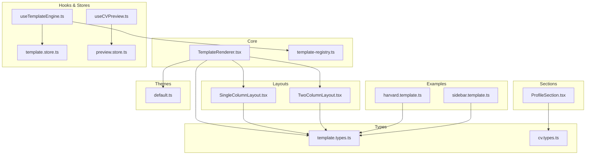
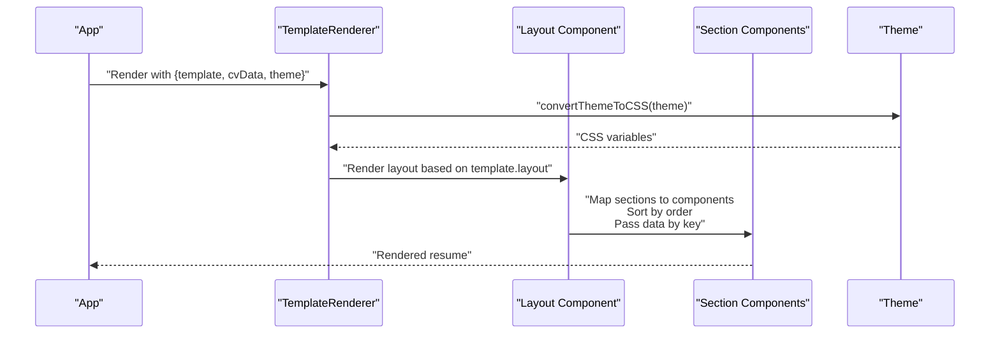
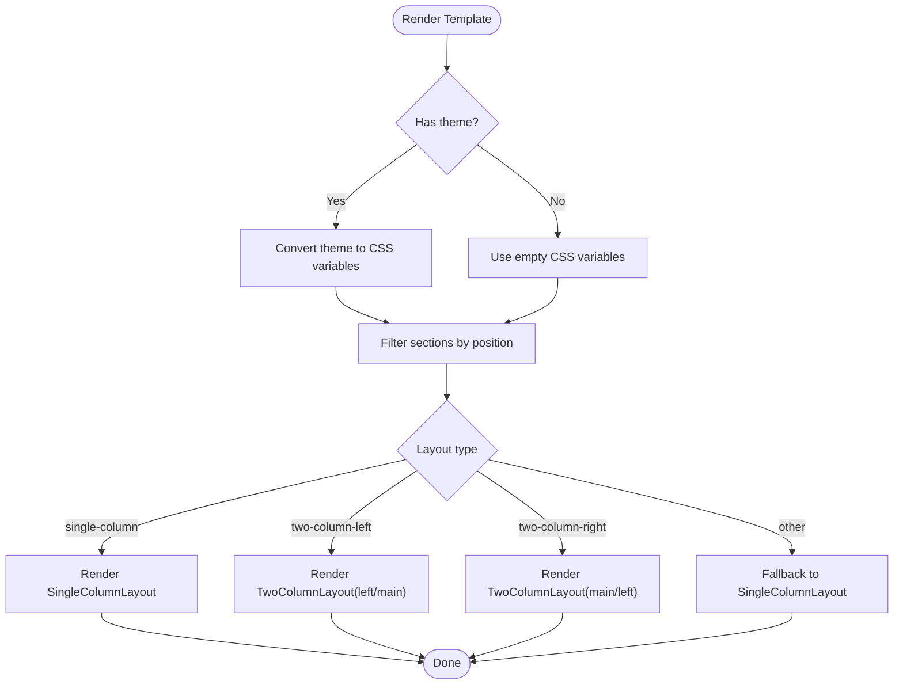
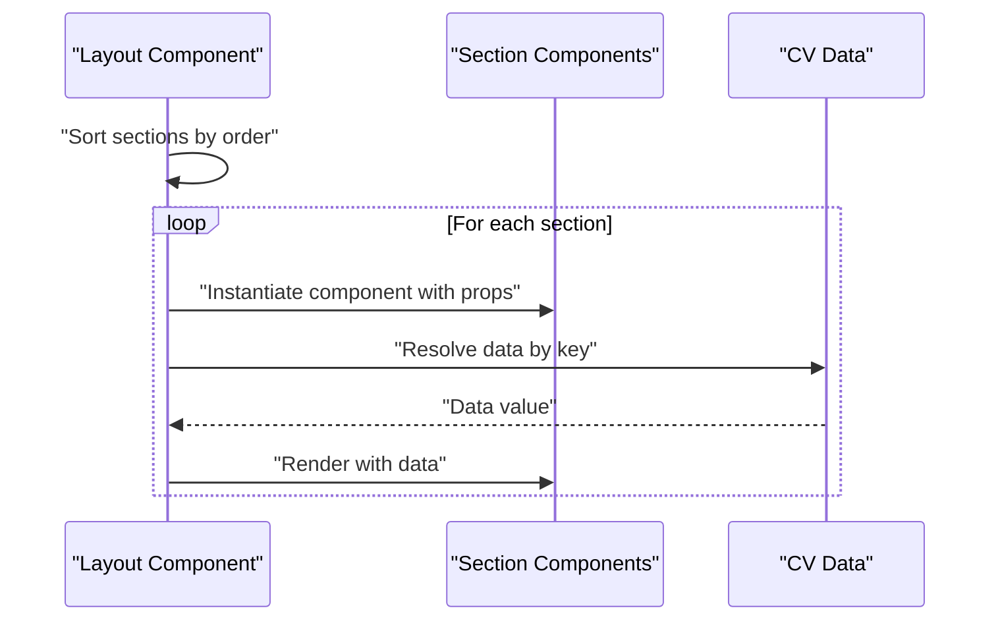
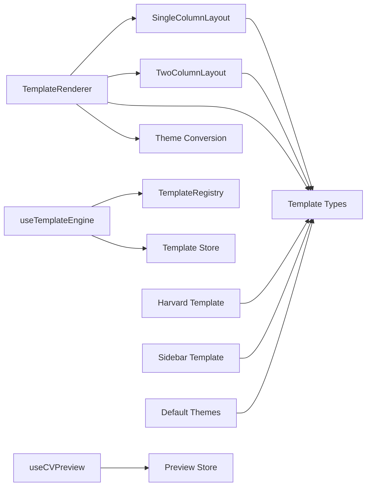

# Template API

<cite>
**Referenced Files in This Document**
- [TemplateRenderer.tsx](file://src/templates/core/TemplateRenderer.tsx)
- [template-registry.ts](file://src/templates/core/template-registry.ts)
- [template.types.ts](file://src/templates/types/template.types.ts)
- [SingleColumnLayout.tsx](file://src/templates/layouts/SingleColumnLayout.tsx)
- [TwoColumnLayout.tsx](file://src/templates/layouts/TwoColumnLayout.tsx)
- [useCVPreview.ts](file://src/templates/hooks/useCVPreview.ts)
- [useTemplateEngine.ts](file://src/templates/hooks/useTemplateEngine.ts)
- [harvard.template.ts](file://src/templates/examples/harvard.template.ts)
- [sidebar.template.ts](file://src/templates/examples/sidebar.template.ts)
- [ProfileSection.tsx](file://src/templates/sections/ProfileSection.tsx)
- [default.ts](file://src/templates/themes/default.ts)
- [preview.store.ts](file://src/templates/store/preview.store.ts)
- [template.store.ts](file://src/templates/store/template.store.ts)
- [cv.types.ts](file://src/templates/types/cv.types.ts)
</cite>

## Table of Contents
1. [Introduction](#introduction)
2. [Project Structure](#project-structure)
3. [Core Components](#core-components)
4. [Architecture Overview](#architecture-overview)
5. [Detailed Component Analysis](#detailed-component-analysis)
6. [Dependency Analysis](#dependency-analysis)
7. [Performance Considerations](#performance-considerations)
8. [Troubleshooting Guide](#troubleshooting-guide)
9. [Conclusion](#conclusion)
10. [Appendices](#appendices)

## Introduction
This document provides comprehensive API documentation for the Template API. It covers the TemplateRenderer class methods for template rendering, layout management, and section processing; the template registry functionality for registration, retrieval, and configuration; the TemplateConfig interface, LayoutType enumeration, and SectionComponent interfaces; template rendering parameters, theme application methods, and preview generation; practical examples of template creation, layout switching, and custom section implementation; and guidance on template validation, error handling, and performance optimization techniques.

## Project Structure
The Template API is organized around a renderer, layout components, a registry, typed configurations, themes, and supporting stores and hooks for preview and template engine operations.

**Diagram sources**
- [TemplateRenderer.tsx:1-74](file://src/templates/core/TemplateRenderer.tsx#L1-L74)
- [template-registry.ts:1-92](file://src/templates/core/template-registry.ts#L1-L92)
- [template.types.ts:1-77](file://src/templates/types/template.types.ts#L1-L77)
- [SingleColumnLayout.tsx:1-36](file://src/templates/layouts/SingleColumnLayout.tsx#L1-L36)
- [TwoColumnLayout.tsx:1-55](file://src/templates/layouts/TwoColumnLayout.tsx#L1-L55)
- [ProfileSection.tsx:1-89](file://src/templates/sections/ProfileSection.tsx#L1-L89)
- [harvard.template.ts:1-52](file://src/templates/examples/harvard.template.ts#L1-L52)
- [sidebar.template.ts:1-55](file://src/templates/examples/sidebar.template.ts#L1-L55)
- [default.ts:1-103](file://src/templates/themes/default.ts#L1-L103)
- [useTemplateEngine.ts:1-57](file://src/templates/hooks/useTemplateEngine.ts#L1-L57)
- [useCVPreview.ts:1-60](file://src/templates/hooks/useCVPreview.ts#L1-L60)
- [template.store.ts:1-103](file://src/templates/store/template.store.ts#L1-L103)
- [preview.store.ts:1-100](file://src/templates/store/preview.store.ts#L1-L100)

**Section sources**
- [TemplateRenderer.tsx:1-74](file://src/templates/core/TemplateRenderer.tsx#L1-L74)
- [template-registry.ts:1-92](file://src/templates/core/template-registry.ts#L1-L92)
- [template.types.ts:1-77](file://src/templates/types/template.types.ts#L1-L77)

## Core Components
- TemplateRenderer: Renders a template by applying a theme and delegating to a layout component based on the template’s layout type. It separates sections by position and converts a theme into CSS variables for styling.
- Layout components: SingleColumnLayout and TwoColumnLayout render sections in a single column or two-column layout respectively, sorting sections by order and passing data via keys mapped from CV.
- Template registry: A singleton registry managing template entries with metadata, categories, and tags, enabling registration, retrieval, filtering, and removal.
- Hooks and stores: useTemplateEngine provides access to active templates, custom templates, and registry queries; useCVPreview manages preview settings and modes.

**Section sources**
- [TemplateRenderer.tsx:13-53](file://src/templates/core/TemplateRenderer.tsx#L13-L53)
- [SingleColumnLayout.tsx:11-33](file://src/templates/layouts/SingleColumnLayout.tsx#L11-L33)
- [TwoColumnLayout.tsx:13-52](file://src/templates/layouts/TwoColumnLayout.tsx#L13-L52)
- [template-registry.ts:4-88](file://src/templates/core/template-registry.ts#L4-L88)
- [useTemplateEngine.ts:10-56](file://src/templates/hooks/useTemplateEngine.ts#L10-L56)
- [useCVPreview.ts:9-59](file://src/templates/hooks/useCVPreview.ts#L9-L59)

## Architecture Overview
The Template API follows a declarative rendering architecture:
- Templates declare sections, layout, and theme.
- The renderer applies a theme by converting it to CSS variables and selects a layout.
- Layouts sort and render sections using React components configured per section.
- Registry and stores manage template lifecycle and preview state.

**Diagram sources**
- [TemplateRenderer.tsx:13-53](file://src/templates/core/TemplateRenderer.tsx#L13-L53)
- [SingleColumnLayout.tsx:11-33](file://src/templates/layouts/SingleColumnLayout.tsx#L11-L33)
- [TwoColumnLayout.tsx:13-52](file://src/templates/layouts/TwoColumnLayout.tsx#L13-L52)
- [default.ts:3-25](file://src/templates/themes/default.ts#L3-L25)

## Detailed Component Analysis

### TemplateRenderer
Responsibilities:
- Accepts a template, CV data, and optional theme.
- Converts a theme to CSS variables for scoped styling.
- Filters template sections by position (main/left/right).
- Switches to a layout component based on the template’s layout type.
- Falls back to single-column layout if layout type is unrecognized.

Rendering parameters:
- Props: template, cvData, theme.
- Internal behavior: theme-to-CSS conversion, section filtering, layout selection.

Performance considerations:
- Uses React.memo to prevent unnecessary re-renders.
- Sorting sections by order is O(n log n) per layout pass.

Error handling:
- Returns null for missing data in section components (e.g., ProfileSection guards against missing data).
- Fallback to single-column layout for unknown layout types.

**Section sources**
- [TemplateRenderer.tsx:13-53](file://src/templates/core/TemplateRenderer.tsx#L13-L53)
- [TemplateRenderer.tsx:58-73](file://src/templates/core/TemplateRenderer.tsx#L58-L73)

#### Rendering Flow

**Diagram sources**
- [TemplateRenderer.tsx:13-53](file://src/templates/core/TemplateRenderer.tsx#L13-L53)

### Layout Components
SingleColumnLayout:
- Sorts sections by order and renders each section component with data resolved from CV by key.
- Applies theme CSS variables via inline styles.

TwoColumnLayout:
- Sorts left and right sections independently by order.
- Renders a sidebar and main area; supports configurable sidebar width.
- Applies theme CSS variables via inline styles.

Performance considerations:
- Sorting is O(n log n) per side; memoization prevents redundant renders.

**Section sources**
- [SingleColumnLayout.tsx:11-33](file://src/templates/layouts/SingleColumnLayout.tsx#L11-L33)
- [TwoColumnLayout.tsx:13-52](file://src/templates/layouts/TwoColumnLayout.tsx#L13-L52)

#### Layout Rendering Sequence

**Diagram sources**
- [SingleColumnLayout.tsx:11-33](file://src/templates/layouts/SingleColumnLayout.tsx#L11-L33)
- [TwoColumnLayout.tsx:13-52](file://src/templates/layouts/TwoColumnLayout.tsx#L13-L52)

### Template Registry
Singleton registry managing templates with metadata:
- register(entry): Adds a template entry.
- getTemplate(id): Retrieves a template by ID.
- getAllTemplates(): Lists all registered templates.
- getByCategory(category): Filters templates by category.
- searchByTags(tags): Filters templates by tag intersection.
- hasTemplate(id): Checks existence.
- removeTemplate(id): Removes a template.
- getTemplateMetadata(id): Returns metadata excluding the template body.
- listTemplateIds(): Lists registered template IDs.

Thread-safety and immutability:
- Uses a Map internally; returns copies of arrays to avoid external mutation.

**Section sources**
- [template-registry.ts:4-88](file://src/templates/core/template-registry.ts#L4-L88)

### Template Engine Hook
useTemplateEngine:
- Provides access to active template (custom or registry), all templates, and actions to manage templates.
- setActiveTemplate(templateId): Sets the active template ID.
- addCustomTemplate(template): Adds a custom template.
- updateCustomTemplate(templateId, updates): Updates a custom template.
- removeCustomTemplate(templateId): Removes a custom template.
- getTemplatesByCategory(category): Queries registry by category.

Integration:
- Reads from template store and registry; custom templates take precedence over registry templates.

**Section sources**
- [useTemplateEngine.ts:10-56](file://src/templates/hooks/useTemplateEngine.ts#L10-L56)
- [template.store.ts:22-98](file://src/templates/store/template.store.ts#L22-L98)

### Preview Hook and Store
useCVPreview:
- Exposes preview settings and actions to update them.
- Actions include updating settings, setting zoom, page size, toggling guides, setting mode, toggling fullscreen, toggling print preview, and resetting settings.

Preview store:
- Holds settings (zoom, page size, guides, mode), fullscreen flag, and print preview flag.
- Includes derived states for computed values (e.g., current zoom, edit mode).
- Actions clamp zoom between 0.5 and 2.

**Section sources**
- [useCVPreview.ts:9-59](file://src/templates/hooks/useCVPreview.ts#L9-L59)
- [preview.store.ts:12-95](file://src/templates/store/preview.store.ts#L12-L95)

### Types and Interfaces
TemplateConfig and related types:
- LayoutType: 'single-column' | 'two-column-left' | 'two-column-right'
- SectionPosition: 'main' | 'left' | 'right'
- Theme: includes id, name, font family, font sizes, color palette, and spacing.
- SectionConfig: defines key (CV property), component, position, order, and optional props.
- Template: includes id, name, description, layout, sections, theme (by ID or object), page size, timestamps.
- TemplateRegistryEntry: template plus thumbnail, tags, and category.
- PreviewSettings: zoom, page size, guides visibility, mode.
- ExportOptions: export format, quality, and metadata inclusion.

CV types:
- Re-exports CV-related types from agent schemas and adds optional metadata.

**Section sources**
- [template.types.ts:3-77](file://src/templates/types/template.types.ts#L3-L77)
- [cv.types.ts:1-16](file://src/templates/types/cv.types.ts#L1-L16)

### Example Templates and Themes
Harvard template:
- Single-column layout with a classic academic theme.
- Sections include profile, education, experience, skills, and projects.

Sidebar template:
- Two-column-left layout with a modern theme.
- Left sidebar includes compact profile, skills, and education; right main includes experience and projects.

Themes:
- Modern, professional, creative, and minimal themes with consistent structure.

**Section sources**
- [harvard.template.ts:12-51](file://src/templates/examples/harvard.template.ts#L12-L51)
- [sidebar.template.ts:12-54](file://src/templates/examples/sidebar.template.ts#L12-L54)
- [default.ts:3-102](file://src/templates/themes/default.ts#L3-L102)

### Custom Section Implementation
ProfileSection demonstrates:
- Guarding against missing data.
- Rendering structured profile information with contact links.
- Using memoization for performance.

**Section sources**
- [ProfileSection.tsx:8-88](file://src/templates/sections/ProfileSection.tsx#L8-L88)

## Dependency Analysis
The Template API exhibits clear separation of concerns:
- Renderer depends on layout components and theme conversion.
- Layouts depend on section components and typed configuration.
- Registry provides decoupled template discovery and filtering.
- Hooks integrate with stores for reactive state management.

**Diagram sources**
- [TemplateRenderer.tsx:1-74](file://src/templates/core/TemplateRenderer.tsx#L1-L74)
- [SingleColumnLayout.tsx:1-36](file://src/templates/layouts/SingleColumnLayout.tsx#L1-L36)
- [TwoColumnLayout.tsx:1-55](file://src/templates/layouts/TwoColumnLayout.tsx#L1-L55)
- [template.types.ts:1-77](file://src/templates/types/template.types.ts#L1-L77)
- [template-registry.ts:1-92](file://src/templates/core/template-registry.ts#L1-L92)
- [useTemplateEngine.ts:1-57](file://src/templates/hooks/useTemplateEngine.ts#L1-L57)
- [template.store.ts:1-103](file://src/templates/store/template.store.ts#L1-L103)
- [useCVPreview.ts:1-60](file://src/templates/hooks/useCVPreview.ts#L1-L60)
- [preview.store.ts:1-100](file://src/templates/store/preview.store.ts#L1-L100)
- [harvard.template.ts:1-52](file://src/templates/examples/harvard.template.ts#L1-L52)
- [sidebar.template.ts:1-55](file://src/templates/examples/sidebar.template.ts#L1-L55)
- [default.ts:1-103](file://src/templates/themes/default.ts#L1-L103)

**Section sources**
- [template-registry.ts:4-88](file://src/templates/core/template-registry.ts#L4-L88)
- [useTemplateEngine.ts:10-56](file://src/templates/hooks/useTemplateEngine.ts#L10-L56)
- [preview.store.ts:12-95](file://src/templates/store/preview.store.ts#L12-L95)

## Performance Considerations
- Memoization: TemplateRenderer and layout components use React.memo to avoid unnecessary re-renders.
- Sorting cost: Sorting sections by order is O(n log n); keep section counts reasonable.
- CSS variable application: Converting theme to CSS variables is O(1) and applied via inline styles.
- Derived stores: TanStack Store derived states compute values efficiently without recomputation unless dependencies change.
- Zoom clamping: Preview zoom is clamped to a safe range to maintain performance and usability.

[No sources needed since this section provides general guidance]

## Troubleshooting Guide
Common issues and resolutions:
- Unknown layout type: TemplateRenderer falls back to single-column; verify template.layout is one of the supported types.
- Missing section data: Section components should guard against missing data; ensure CV keys match section keys.
- Theme not applied: Confirm theme object is provided and convertThemeToCSS is invoked; verify CSS variable names align with theme keys.
- Preview settings not updating: Use useCVPreview actions; ensure preview store is initialized and mounted.
- Template not found: Use templateRegistry.getTemplate or useTemplateEngine to retrieve templates; confirm registration and IDs.

**Section sources**
- [TemplateRenderer.tsx:48-51](file://src/templates/core/TemplateRenderer.tsx#L48-L51)
- [ProfileSection.tsx:8-10](file://src/templates/sections/ProfileSection.tsx#L8-L10)
- [useCVPreview.ts:14-44](file://src/templates/hooks/useCVPreview.ts#L14-L44)
- [preview.store.ts:51-55](file://src/templates/store/preview.store.ts#L51-L55)

## Conclusion
The Template API offers a flexible, declarative system for rendering CVs with customizable templates, layouts, and themes. Its registry enables scalable template management, while hooks and stores provide reactive controls for preview and customization. By following the documented patterns for template creation, layout switching, and section implementation, developers can build performant and maintainable resume experiences.

[No sources needed since this section summarizes without analyzing specific files]

## Appendices

### API Reference Summary

- TemplateRenderer
  - Props: template, cvData, theme?
  - Behavior: Converts theme to CSS variables, filters sections by position, selects layout, and renders.
  - Complexity: O(n log n) for sorting per layout; memoized rendering.

- Layout Components
  - SingleColumnLayout: Renders sections in a single column; sorts by order.
  - TwoColumnLayout: Renders left and right sections separately; supports sidebar width.

- Template Registry
  - Methods: register, getTemplate, getAllTemplates, getByCategory, searchByTags, hasTemplate, removeTemplate, getTemplateMetadata, listTemplateIds.

- useTemplateEngine
  - Accessors: activeTemplate, allTemplates.
  - Actions: setActiveTemplate, addCustomTemplate, updateCustomTemplate, removeCustomTemplate, getTemplatesByCategory.

- useCVPreview
  - Accessors: settings, isFullscreen, showPrintPreview.
  - Actions: updateSettings, setZoom, setPageSize, toggleGuides, setMode, toggleFullscreen, togglePrintPreview, resetSettings.

- Types
  - LayoutType, SectionPosition, Theme, SectionConfig, Template, TemplateRegistryEntry, PreviewSettings, ExportOptions.

**Section sources**
- [TemplateRenderer.tsx:7-53](file://src/templates/core/TemplateRenderer.tsx#L7-L53)
- [SingleColumnLayout.tsx:5-33](file://src/templates/layouts/SingleColumnLayout.tsx#L5-L33)
- [TwoColumnLayout.tsx:5-52](file://src/templates/layouts/TwoColumnLayout.tsx#L5-L52)
- [template-registry.ts:20-88](file://src/templates/core/template-registry.ts#L20-L88)
- [useTemplateEngine.ts:27-55](file://src/templates/hooks/useTemplateEngine.ts#L27-L55)
- [useCVPreview.ts:14-58](file://src/templates/hooks/useCVPreview.ts#L14-L58)
- [template.types.ts:3-77](file://src/templates/types/template.types.ts#L3-L77)