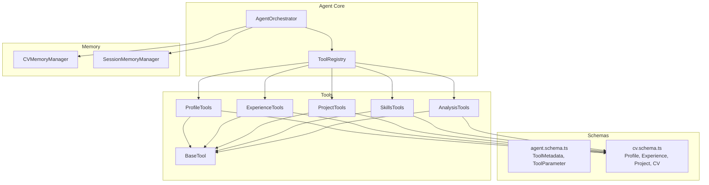
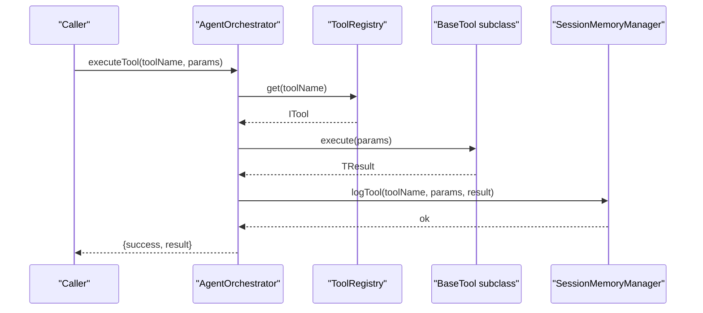
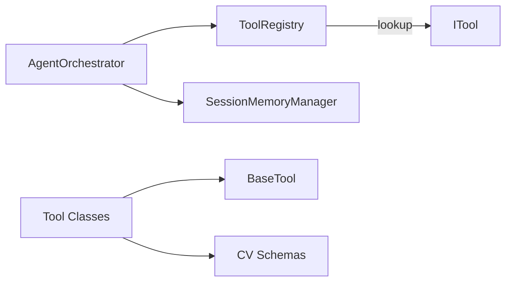

# Tool API

<cite>
**Referenced Files in This Document**
- [base-tool.ts](file://src/agent/tools/base-tool.ts)
- [profile-tools.ts](file://src/agent/tools/profile-tools.ts)
- [experience-tools.ts](file://src/agent/tools/experience-tools.ts)
- [project-tools.ts](file://src/agent/tools/project-tools.ts)
- [skills-tools.ts](file://src/agent/tools/skills-tools.ts)
- [analysis-tools.ts](file://src/agent/tools/analysis-tools.ts)
- [agent.schema.ts](file://src/agent/schemas/agent.schema.ts)
- [cv.schema.ts](file://src/agent/schemas/cv.schema.ts)
- [agent.ts](file://src/agent/core/agent.ts)
- [cv-memory.ts](file://src/agent/memory/cv-memory.ts)
- [index.ts](file://src/agent/index.ts)
</cite>

## Table of Contents
1. [Introduction](#introduction)
2. [Project Structure](#project-structure)
3. [Core Components](#core-components)
4. [Architecture Overview](#architecture-overview)
5. [Detailed Component Analysis](#detailed-component-analysis)
6. [Dependency Analysis](#dependency-analysis)
7. [Performance Considerations](#performance-considerations)
8. [Troubleshooting Guide](#troubleshooting-guide)
9. [Conclusion](#conclusion)

## Introduction
This document provides comprehensive API documentation for the Tool API used by the CV & Portfolio Builder. It covers the BaseTool abstract class, the ToolResult interface, and the full set of tool categories: ProfileTools, ExperienceTools, ProjectTools, SkillsTools, and AnalysisTools. It explains parameter schemas, execution patterns, validation, error handling, and performance considerations. It also includes examples of tool implementation, registration, and invocation.

## Project Structure
The Tool API is organized under the agent/tools directory, with each tool category implemented as a separate module. Supporting schemas define metadata and parameter structures. The agent orchestrator manages tool registration and execution, while memory managers handle state persistence and session logs.

**Diagram sources**
- [agent.ts:11-55](file://src/agent/core/agent.ts#L11-L55)
- [base-tool.ts:15-49](file://src/agent/tools/base-tool.ts#L15-L49)
- [profile-tools.ts:14-141](file://src/agent/tools/profile-tools.ts#L14-L141)
- [experience-tools.ts:14-193](file://src/agent/tools/experience-tools.ts#L14-L193)
- [project-tools.ts:14-167](file://src/agent/tools/project-tools.ts#L14-L167)
- [skills-tools.ts:13-209](file://src/agent/tools/skills-tools.ts#L13-L209)
- [analysis-tools.ts:13-290](file://src/agent/tools/analysis-tools.ts#L13-L290)
- [agent.schema.ts:23-29](file://src/agent/schemas/agent.schema.ts#L23-L29)
- [cv.schema.ts:50-61](file://src/agent/schemas/cv.schema.ts#L50-L61)
- [cv-memory.ts:19-289](file://src/agent/memory/cv-memory.ts#L19-L289)

**Section sources**
- [index.ts:16-18](file://src/agent/index.ts#L16-L18)
- [agent.ts:11-55](file://src/agent/core/agent.ts#L11-L55)

## Core Components
- BaseTool<TParams, TResult>: An abstract class that defines the contract for all tools. It exposes metadata, execute(params), and an optional validate(params). It also provides executeSafe(params) for robust execution with standardized ToolResult envelopes.
- ToolResult<TResult>: A uniform result envelope with success flag, optional data, optional error message, optional warnings, and optional metadata.
- ToolCallLog: A log entry capturing toolName, params, result, duration, and timestamp.

Key behaviors:
- Validation: Optional validate method allows pre-execution checks. BaseTool.validate defaults to always passing.
- Execution: executeSafe wraps execute with validation and error handling, returning a ToolResult envelope.
- Metadata: Each tool exposes a metadata object containing name, description, parameters, category, and requiresLLM.

**Section sources**
- [base-tool.ts:6-10](file://src/agent/tools/base-tool.ts#L6-L10)
- [base-tool.ts:15-49](file://src/agent/tools/base-tool.ts#L15-L49)
- [base-tool.ts:54-71](file://src/agent/tools/base-tool.ts#L54-L71)

## Architecture Overview
The Tool API integrates with the Agent Orchestrator and Tool Registry to manage tool lifecycle and execution. Tools depend on CV schemas for typed parameters and results. Memory managers persist CV state and log tool executions.

**Diagram sources**
- [agent.ts:78-127](file://src/agent/core/agent.ts#L78-L127)
- [agent.ts:11-55](file://src/agent/core/agent.ts#L11-L55)
- [cv-memory.ts:180-193](file://src/agent/memory/cv-memory.ts#L180-L193)

## Detailed Component Analysis

### BaseTool and ToolResult
- BaseTool<TParams, TResult> enforces metadata and execute signatures, with optional validate and a safe wrapper executeSafe that returns ToolResult<TResult>.
- ToolResult includes success, data, error, warnings, and metadata fields for consistent responses.

Implementation pattern:
- Subclasses override metadata and execute.
- Optional validate can enforce parameter constraints.
- executeSafe ensures errors are captured and returned in a standardized envelope.

**Section sources**
- [base-tool.ts:15-49](file://src/agent/tools/base-tool.ts#L15-L49)
- [base-tool.ts:54-71](file://src/agent/tools/base-tool.ts#L54-L71)

### Tool Categories and Tools

#### ProfileTools
- updateProfile: Updates profile fields and returns the updated Profile.
- generateSummary: Generates a professional summary based on role, experience, and skills.
- optimizeContact: Validates and suggests improvements for contact information.

Parameters and schemas:
- UpdateProfileParams: Partial(Profile) with optional fields.
- GenerateSummaryParams: role (string), experience (number), skills (string array).
- OptimizeContactParams: email (string), optional github and linkedin.

Validation:
- optimizeContact validates email format.

Execution patterns:
- updateProfile mutates CV state via cvActions and returns ToolResult<Profile>.
- generateSummary returns a generated string summary with suggestions.
- optimizeContact returns suggestions for improvement.

**Section sources**
- [profile-tools.ts:14-45](file://src/agent/tools/profile-tools.ts#L14-L45)
- [profile-tools.ts:47-79](file://src/agent/tools/profile-tools.ts#L47-L79)
- [profile-tools.ts:81-134](file://src/agent/tools/profile-tools.ts#L81-L134)

#### ExperienceTools
- addExperience: Adds a new experience entry with achievements and optional techStack.
- enhanceAchievements: Improves achievement descriptions with stronger language and metrics.
- suggestTechStack: Suggests technologies based on role and industry.

Parameters and schemas:
- AddExperienceParams: Omit Experience achievements plus achievements array.
- EnhanceAchievementsParams: experienceIndex (number) and achievements array.
- SuggestTechStackParams: role (string), optional industry.

Validation:
- addExperience validates required fields and non-empty achievements.

Execution patterns:
- addExperience persists a new experience and returns it with suggestions.
- enhanceAchievements returns enhanced achievement strings with suggestions.
- suggestTechStack returns unique technology suggestions.

**Section sources**
- [experience-tools.ts:14-68](file://src/agent/tools/experience-tools.ts#L14-L68)
- [experience-tools.ts:70-138](file://src/agent/tools/experience-tools.ts#L70-L138)
- [experience-tools.ts:140-186](file://src/agent/tools/experience-tools.ts#L140-L186)

#### ProjectTools
- addProject: Adds a new project with highlights and optional techStack.
- generateHighlights: Generates compelling project highlights.
- linkToSkills: Links project technologies to CV skills and identifies gaps.

Parameters and schemas:
- AddProjectParams: Omit Project highlights plus highlights array.
- GenerateHighlightsParams: projectName (string), description (string), techStack (string array).
- LinkToSkillsParams: projectIndex (number).

Validation:
- addProject validates required fields and non-empty highlights.

Execution patterns:
- addProject persists a new project and returns it with suggestions.
- generateHighlights returns generated highlight strings with suggestions.
- linkToSkills returns matched and new skills linked to the project.

**Section sources**
- [project-tools.ts:14-64](file://src/agent/tools/project-tools.ts#L14-L64)
- [project-tools.ts:66-103](file://src/agent/tools/project-tools.ts#L66-L103)
- [project-tools.ts:106-160](file://src/agent/tools/project-tools.ts#L106-L160)

#### SkillsTools
- addSkill: Adds a skill to the CV after deduplication.
- categorizeSkills: Groups skills into logical categories.
- identifyGaps: Identifies skill gaps for a target role and provides recommendations.

Parameters and schemas:
- AddSkillParams: skill (string), optional category.
- CategorizeSkillsParams: none.
- IdentifyGapsParams: targetRole (string), currentSkills (string array).

Validation:
- addSkill validates non-empty skill.

Execution patterns:
- addSkill returns success or duplicate error.
- categorizeSkills returns categorized groups.
- identifyGaps returns gaps and recommendations.

**Section sources**
- [skills-tools.ts:13-63](file://src/agent/tools/skills-tools.ts#L13-L63)
- [skills-tools.ts:65-92](file://src/agent/tools/skills-tools.ts#L65-L92)
- [skills-tools.ts:94-202](file://src/agent/tools/skills-tools.ts#L94-L202)

#### AnalysisTools
- analyzeCV: Comprehensive CV analysis including completeness, section scores, strengths, and weaknesses.
- keywordOptimization: Analyzes CV against a job description for keyword coverage.
- consistencyCheck: Checks consistency between CV sections and portfolio.

Parameters and schemas:
- AnalyzeCVParams: none.
- KeywordOptimizationParams: optional jobDescription.
- ConsistencyCheckParams: none.

Execution patterns:
- analyzeCV returns a structured analysis with overall score and suggestions.
- keywordOptimization returns current keywords and missing keywords.
- consistencyCheck returns issues and suggestions for alignment.

**Section sources**
- [analysis-tools.ts:13-141](file://src/agent/tools/analysis-tools.ts#L13-L141)
- [analysis-tools.ts:143-218](file://src/agent/tools/analysis-tools.ts#L143-L218)
- [analysis-tools.ts:220-283](file://src/agent/tools/analysis-tools.ts#L220-L283)

### Tool Metadata and Parameter Schemas
- ToolMetadata includes name, description, parameters (array of ToolParameter), category, and requiresLLM.
- ToolParameter includes name, type, description, and required flag.
- CV-related tools reference CV, Profile, Experience, Project, and Contact schemas for typing.

**Section sources**
- [agent.schema.ts:23-29](file://src/agent/schemas/agent.schema.ts#L23-L29)
- [agent.schema.ts:15-20](file://src/agent/schemas/agent.schema.ts#L15-L20)
- [cv.schema.ts:50-61](file://src/agent/schemas/cv.schema.ts#L50-L61)

### Execution Patterns and Orchestration
- ToolRegistry registers and retrieves tools by name.
- AgentOrchestrator executes tools, logs durations, and records session actions.
- Tools may mutate CV state via cvActions and cvStore, and return ToolResult envelopes.

```mermaid
classDiagram
class BaseTool {
+metadata
+execute(params) Promise~TResult~
+validate(params) boolean
+executeSafe(params) Promise~ToolResult~
}
class UpdateProfileTool
class GenerateSummaryTool
class OptimizeContactTool
class AddExperienceTool
class EnhanceAchievementsTool
class SuggestTechStackTool
class AddProjectTool
class GenerateHighlightsTool
class LinkToSkillsTool
class AddSkillTool
class CategorizeSkillsTool
class IdentifyGapsTool
class AnalyzeCVTool
class KeywordOptimizationTool
class ConsistencyCheckTool
UpdateProfileTool --|> BaseTool
GenerateSummaryTool --|> BaseTool
OptimizeContactTool --|> BaseTool
AddExperienceTool --|> BaseTool
EnhanceAchievementsTool --|> BaseTool
SuggestTechStackTool --|> BaseTool
AddProjectTool --|> BaseTool
GenerateHighlightsTool --|> BaseTool
LinkToSkillsTool --|> BaseTool
AddSkillTool --|> BaseTool
CategorizeSkillsTool --|> BaseTool
IdentifyGapsTool --|> BaseTool
AnalyzeCVTool --|> BaseTool
KeywordOptimizationTool --|> BaseTool
ConsistencyCheckTool --|> BaseTool
```

**Diagram sources**
- [base-tool.ts:15-49](file://src/agent/tools/base-tool.ts#L15-L49)
- [profile-tools.ts:14-141](file://src/agent/tools/profile-tools.ts#L14-L141)
- [experience-tools.ts:14-193](file://src/agent/tools/experience-tools.ts#L14-L193)
- [project-tools.ts:14-167](file://src/agent/tools/project-tools.ts#L14-L167)
- [skills-tools.ts:13-209](file://src/agent/tools/skills-tools.ts#L13-L209)
- [analysis-tools.ts:13-290](file://src/agent/tools/analysis-tools.ts#L13-L290)

## Dependency Analysis
- ToolRegistry maintains a map of toolName to ITool, enabling dynamic lookup and execution.
- AgentOrchestrator depends on ToolRegistry and optionally on an LLM service; it logs tool executions via SessionMemoryManager.
- Tools depend on CV schemas and memory managers for state mutations and queries.
- ToolResult and ToolCallLog provide consistent return and logging contracts.

**Diagram sources**
- [agent.ts:11-55](file://src/agent/core/agent.ts#L11-L55)
- [cv-memory.ts:180-193](file://src/agent/memory/cv-memory.ts#L180-L193)
- [base-tool.ts:15-49](file://src/agent/tools/base-tool.ts#L15-L49)

**Section sources**
- [agent.ts:11-55](file://src/agent/core/agent.ts#L11-L55)
- [cv-memory.ts:180-193](file://src/agent/memory/cv-memory.ts#L180-L193)

## Performance Considerations
- Prefer executeSafe for robust error handling and consistent result envelopes.
- Keep tool validations lightweight to avoid blocking execution.
- Batch tool invocations using executeToolChain when appropriate to reduce overhead.
- Use derived state patterns (as seen in memory managers) to minimize recomputation.
- Avoid heavy synchronous computations inside tools; defer to asynchronous processing when possible.

## Troubleshooting Guide
Common issues and resolutions:
- Tool not found: Verify tool registration via ToolRegistry.register or ensure the tool is exported and registered.
- Validation failures: Implement or adjust validate(params) to match required constraints.
- Execution errors: Use executeSafe to capture errors in ToolResult.error; inspect ToolCallLog for timing and outcomes.
- State inconsistencies: Confirm CV mutations occur via cvActions and cvStore; verify cvMemory saves versions appropriately.

**Section sources**
- [agent.ts:78-127](file://src/agent/core/agent.ts#L78-L127)
- [cv-memory.ts:55-72](file://src/agent/memory/cv-memory.ts#L55-L72)

## Conclusion
The Tool API provides a strongly typed, extensible framework for building CV and portfolio enhancement tools. With BaseTool’s standardized contract, ToolResult envelopes, and orchestration via AgentOrchestrator and ToolRegistry, developers can implement, register, and invoke tools consistently. The included tool categories demonstrate practical patterns for validation, execution, and result handling, while memory managers support state persistence and session logging.