# AI Service Abstraction

<cite>
**Referenced Files in This Document**
- [ai-service.ts](file://src/agent/services/ai-service.ts)
- [prompts.ts](file://src/agent/services/prompts.ts)
- [llm.ts](file://src/agent/services/llm.ts)
- [base-tool.ts](file://src/agent/tools/base-tool.ts)
- [agent.ts](file://src/agent/core/agent.ts)
- [experience-tools.ts](file://src/agent/tools/experience-tools.ts)
- [profile-tools.ts](file://src/agent/tools/profile-tools.ts)
- [project-tools.ts](file://src/agent/tools/project-tools.ts)
- [skills-tools.ts](file://src/agent/tools/skills-tools.ts)
- [cv-memory.ts](file://src/agent/memory/cv-memory.ts)
- [agent.schema.ts](file://src/agent/schemas/agent.schema.ts)
- [cv.schema.ts](file://src/agent/schemas/cv.schema.ts)
- [index.ts](file://src/agent/index.ts)
- [env.ts](file://src/env.ts)
</cite>

## Table of Contents
1. [Introduction](#introduction)
2. [Project Structure](#project-structure)
3. [Core Components](#core-components)
4. [Architecture Overview](#architecture-overview)
5. [Detailed Component Analysis](#detailed-component-analysis)
6. [Dependency Analysis](#dependency-analysis)
7. [Performance Considerations](#performance-considerations)
8. [Troubleshooting Guide](#troubleshooting-guide)
9. [Conclusion](#conclusion)
10. [Appendices](#appendices)

## Introduction
This document describes the AI Service abstraction layer in the CV Portfolio Builder. It explains the pluggable AI provider interface, prompt engineering patterns and template management, tool integration and execution orchestration, error handling and fallback strategies, configuration and environment management, cost and rate-limiting considerations, and the skill system architecture. It also provides practical guidance for extending the system with new AI providers and developing custom tools.

## Project Structure
The AI Service abstraction spans several modules:
- Service interfaces and implementations for AI providers and LLMs
- Prompt templates and builders for different tasks
- Tool system with a registry and base tool abstraction
- Agent orchestrator coordinating tool execution and state
- Memory managers for CV versions, sessions, and preferences
- Schema definitions for CV data and agent context
- Environment configuration for runtime variables

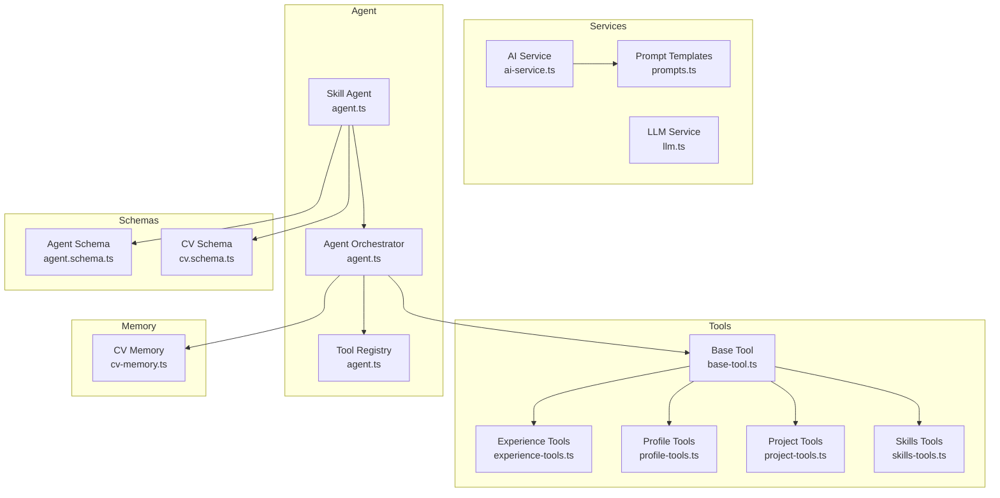

**Diagram sources**
- [ai-service.ts:1-174](file://src/agent/services/ai-service.ts#L1-L174)
- [prompts.ts:1-280](file://src/agent/services/prompts.ts#L1-L280)
- [llm.ts:1-253](file://src/agent/services/llm.ts#L1-L253)
- [base-tool.ts:1-72](file://src/agent/tools/base-tool.ts#L1-L72)
- [agent.ts:1-414](file://src/agent/core/agent.ts#L1-L414)
- [experience-tools.ts:1-194](file://src/agent/tools/experience-tools.ts#L1-L194)
- [profile-tools.ts:1-142](file://src/agent/tools/profile-tools.ts#L1-L142)
- [project-tools.ts:1-168](file://src/agent/tools/project-tools.ts#L1-L168)
- [skills-tools.ts:1-210](file://src/agent/tools/skills-tools.ts#L1-L210)
- [cv-memory.ts:1-290](file://src/agent/memory/cv-memory.ts#L1-L290)
- [agent.schema.ts:1-62](file://src/agent/schemas/agent.schema.ts#L1-L62)
- [cv.schema.ts:1-79](file://src/agent/schemas/cv.schema.ts#L1-L79)

**Section sources**
- [index.ts:1-43](file://src/agent/index.ts#L1-L43)

## Core Components
- AI Service abstraction defines provider contracts and high-level CV-centric operations (summarization, enhancement, analysis, gap identification).
- LLM Service abstraction defines a provider-agnostic interface for generating text and chatting, with built-in prompt templating and response validation.
- Prompt templates and builders encapsulate reusable prompt patterns for different tasks.
- Tool system provides a base class and standardized result/error handling, enabling modular AI-driven capabilities.
- Agent orchestrator coordinates tool execution, maintains session logs, and integrates with memory systems.
- Memory managers persist CV versions, session logs, and user preferences.

**Section sources**
- [ai-service.ts:5-126](file://src/agent/services/ai-service.ts#L5-L126)
- [llm.ts:4-139](file://src/agent/services/llm.ts#L4-L139)
- [prompts.ts:5-280](file://src/agent/services/prompts.ts#L5-L280)
- [base-tool.ts:6-72](file://src/agent/tools/base-tool.ts#L6-L72)
- [agent.ts:11-168](file://src/agent/core/agent.ts#L11-L168)
- [cv-memory.ts:19-227](file://src/agent/memory/cv-memory.ts#L19-L227)

## Architecture Overview
The AI Service abstraction supports a layered architecture:
- Provider interface decouples clients from specific AI backends.
- LLM service adds messaging, templating, and response validation.
- Tools encapsulate domain-specific operations and integrate with AI services.
- Agent orchestrator manages tool registration, execution, and session state.
- Memory systems persist state and logs for auditability and reproducibility.

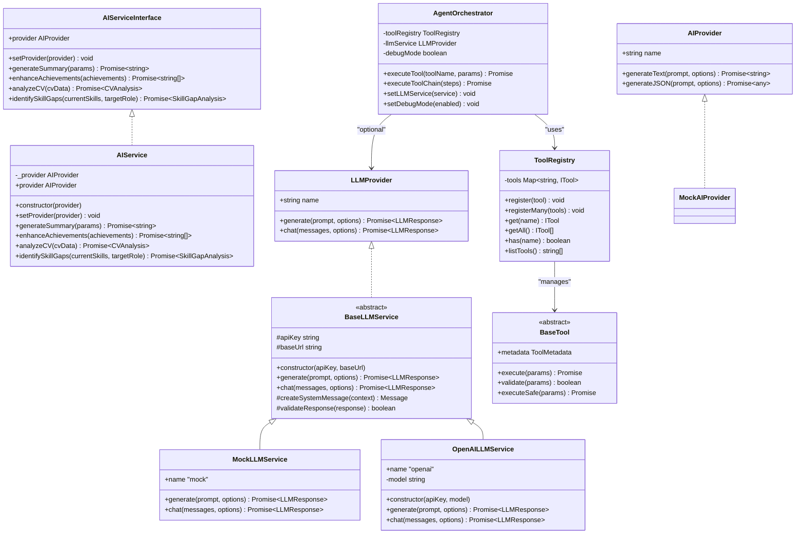

**Diagram sources**
- [ai-service.ts:5-126](file://src/agent/services/ai-service.ts#L5-L126)
- [llm.ts:4-233](file://src/agent/services/llm.ts#L4-L233)
- [base-tool.ts:15-49](file://src/agent/tools/base-tool.ts#L15-L49)
- [agent.ts:11-168](file://src/agent/core/agent.ts#L11-L168)

## Detailed Component Analysis

### AI Service Abstraction
The AI Service abstraction defines:
- Provider contract with text and JSON generation methods.
- High-level operations for CV-centric tasks with prompt builders.
- A mock provider for development and testing.
- Singleton instance for easy consumption.

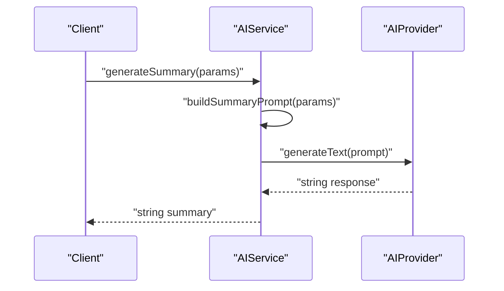

**Diagram sources**
- [ai-service.ts:95-98](file://src/agent/services/ai-service.ts#L95-L98)
- [ai-service.ts:129-134](file://src/agent/services/ai-service.ts#L129-L134)

**Section sources**
- [ai-service.ts:5-126](file://src/agent/services/ai-service.ts#L5-L126)

### LLM Service Abstraction
The LLM Service abstraction provides:
- Provider interface for generating text and chatting with messages.
- Prompt template engine with variable substitution and validation.
- Base class with helper methods for system messages and response validation.
- Concrete implementations for mock and OpenAI.
- Factory function to create services with provider selection and API key handling.

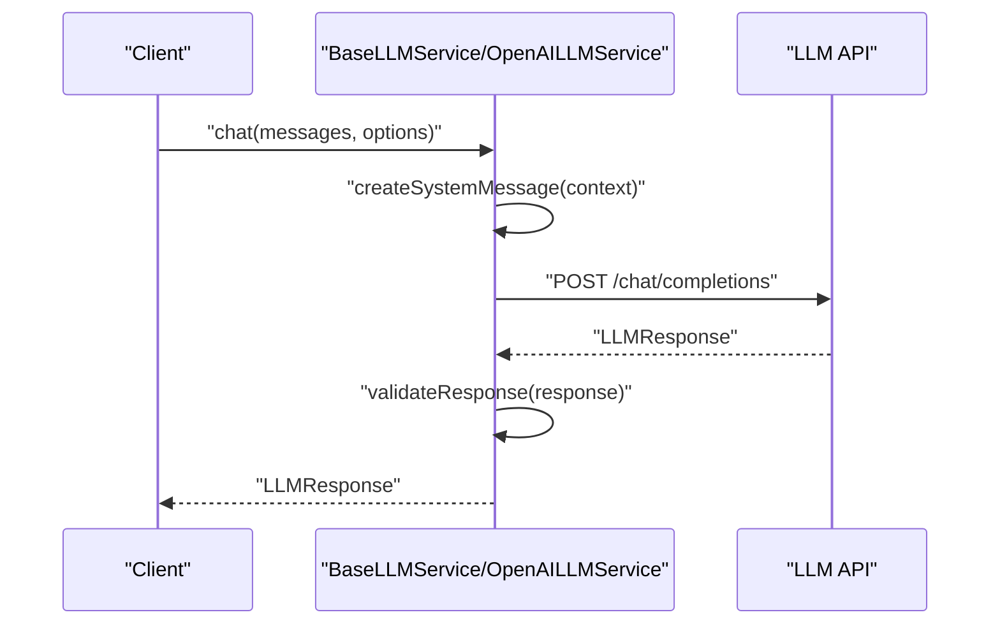

**Diagram sources**
- [llm.ts:191-232](file://src/agent/services/llm.ts#L191-L232)
- [llm.ts:126-138](file://src/agent/services/llm.ts#L126-L138)

**Section sources**
- [llm.ts:4-253](file://src/agent/services/llm.ts#L4-L253)

### Prompt Engineering Patterns and Template Management
Prompt templates and builders support:
- Structured, reusable prompt libraries for summaries, achievements, skill gaps, analysis, and projects.
- Parameterized templates with clear instructions and constraints.
- JSON-oriented prompts for structured outputs.

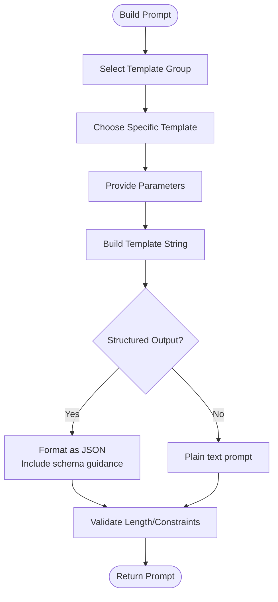

**Diagram sources**
- [prompts.ts:14-58](file://src/agent/services/prompts.ts#L14-L58)
- [prompts.ts:63-107](file://src/agent/services/prompts.ts#L63-L107)
- [prompts.ts:112-161](file://src/agent/services/prompts.ts#L112-L161)
- [prompts.ts:166-215](file://src/agent/services/prompts.ts#L166-L215)
- [prompts.ts:220-270](file://src/agent/services/prompts.ts#L220-L270)

**Section sources**
- [prompts.ts:1-280](file://src/agent/services/prompts.ts#L1-L280)

### Tool Integration Patterns and Execution Orchestration
The tool system enables:
- Standardized tool metadata and execution with safe wrappers.
- Tool registry for dynamic registration and discovery.
- Agent orchestrator for sequential execution, logging, and error propagation.
- Integration points with memory and context managers.

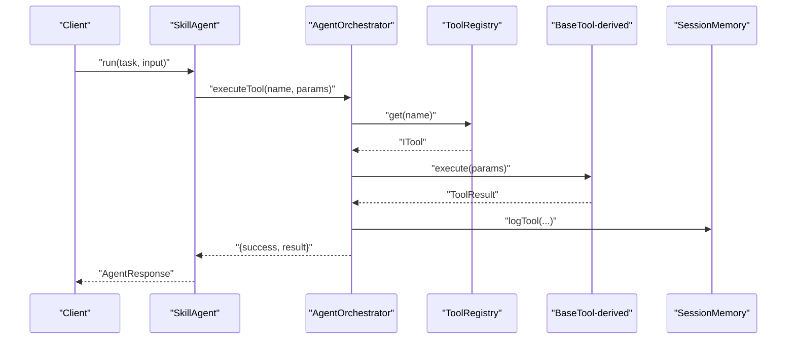

**Diagram sources**
- [agent.ts:78-127](file://src/agent/core/agent.ts#L78-L127)
- [agent.ts:286-347](file://src/agent/core/agent.ts#L286-L347)
- [base-tool.ts:30-48](file://src/agent/tools/base-tool.ts#L30-L48)
- [cv-memory.ts:180-193](file://src/agent/memory/cv-memory.ts#L180-L193)

**Section sources**
- [base-tool.ts:1-72](file://src/agent/tools/base-tool.ts#L1-L72)
- [agent.ts:11-168](file://src/agent/core/agent.ts#L11-L168)
- [cv-memory.ts:164-227](file://src/agent/memory/cv-memory.ts#L164-L227)

### Response Processing Strategies
- AI Service returns raw text or parsed JSON depending on the operation.
- LLM Service validates responses and exposes token usage and finish reasons.
- Tools standardize results with success flags, optional data, and warnings.

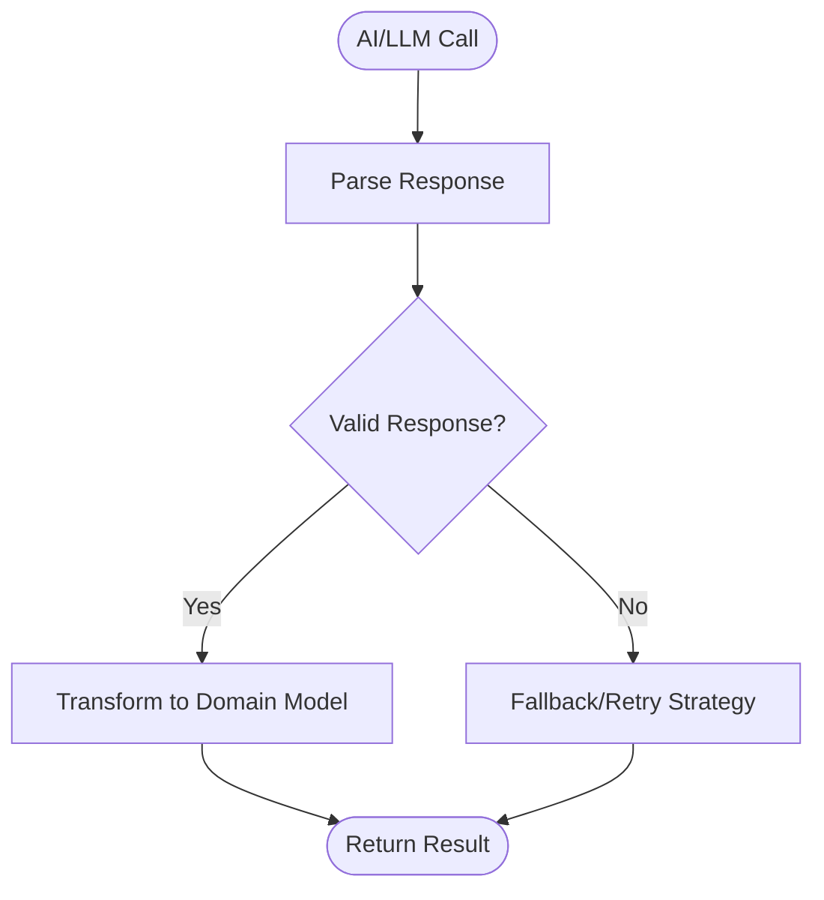

**Diagram sources**
- [ai-service.ts:103-125](file://src/agent/services/ai-service.ts#L103-L125)
- [llm.ts:136-138](file://src/agent/services/llm.ts#L136-L138)
- [base-tool.ts:54-71](file://src/agent/tools/base-tool.ts#L54-L71)

**Section sources**
- [ai-service.ts:103-125](file://src/agent/services/ai-service.ts#L103-L125)
- [llm.ts:24-32](file://src/agent/services/llm.ts#L24-L32)
- [base-tool.ts:54-71](file://src/agent/tools/base-tool.ts#L54-L71)

### Error Handling, Retry Mechanisms, and Fallback Strategies
- Tools wrap execution in safe wrappers with explicit error reporting.
- Agent orchestrator stops tool chains on first failure and logs errors.
- LLM service throws on HTTP errors and validates response content.
- AI Service returns structured defaults when parsing fails.
- Fallbacks can be implemented via mock providers or local heuristics.

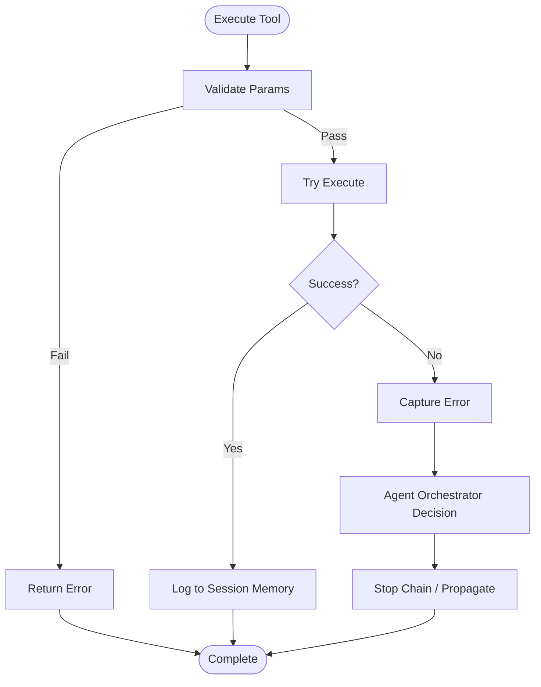

**Diagram sources**
- [base-tool.ts:30-48](file://src/agent/tools/base-tool.ts#L30-L48)
- [agent.ts:115-126](file://src/agent/core/agent.ts#L115-L126)
- [llm.ts:207-209](file://src/agent/services/llm.ts#L207-L209)
- [ai-service.ts:105-106](file://src/agent/services/ai-service.ts#L105-L106)

**Section sources**
- [base-tool.ts:30-48](file://src/agent/tools/base-tool.ts#L30-L48)
- [agent.ts:115-126](file://src/agent/core/agent.ts#L115-L126)
- [llm.ts:207-209](file://src/agent/services/llm.ts#L207-L209)
- [ai-service.ts:105-106](file://src/agent/services/ai-service.ts#L105-L106)

### Configuration Management for Providers and API Keys
- Environment configuration uses typed runtime variables.
- LLM service factory selects provider and enforces API key requirements.
- AI Service uses provider contracts; mock provider is default for development.

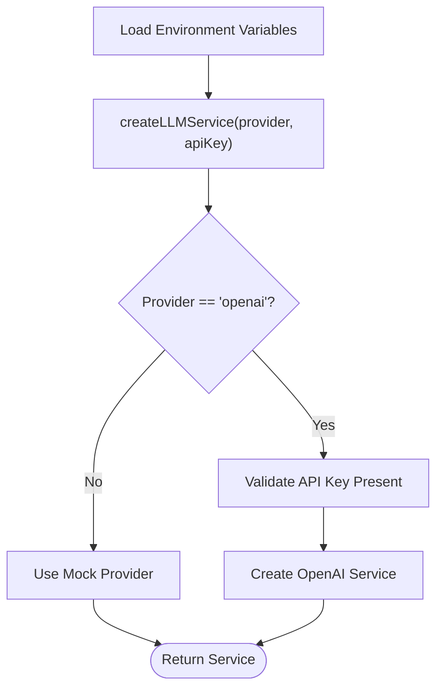

**Diagram sources**
- [env.ts:4-39](file://src/env.ts#L4-L39)
- [llm.ts:238-249](file://src/agent/services/llm.ts#L238-L249)
- [ai-service.ts:80-82](file://src/agent/services/ai-service.ts#L80-L82)

**Section sources**
- [env.ts:1-40](file://src/env.ts#L1-L40)
- [llm.ts:238-249](file://src/agent/services/llm.ts#L238-L249)
- [ai-service.ts:80-82](file://src/agent/services/ai-service.ts#L80-L82)

### Cost Optimization and Rate Limiting Considerations
- Track token usage from LLM responses to estimate costs.
- Use lower-cost models for less critical tasks; reserve higher-capability models for complex reasoning.
- Implement retries with exponential backoff and circuit breaker patterns at the provider layer.
- Apply prompt compression and structured outputs to reduce token consumption.
- Enforce rate limits by batching requests and respecting provider quotas.

[No sources needed since this section provides general guidance]

### Skill System Architecture and Tool Registration
- Tools are registered in a central registry and executed by the orchestrator.
- Each tool defines metadata (name, description, parameters, category).
- Memory managers record tool executions for auditing and reproducibility.
- CV schema defines the structure for skills and other sections.

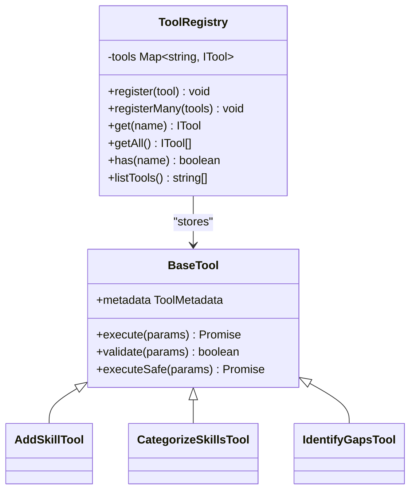

**Diagram sources**
- [agent.ts:11-55](file://src/agent/core/agent.ts#L11-L55)
- [base-tool.ts:15-49](file://src/agent/tools/base-tool.ts#L15-L49)
- [skills-tools.ts:13-210](file://src/agent/tools/skills-tools.ts#L13-L210)

**Section sources**
- [agent.ts:11-55](file://src/agent/core/agent.ts#L11-L55)
- [skills-tools.ts:1-210](file://src/agent/tools/skills-tools.ts#L1-L210)
- [cv.schema.ts:50-79](file://src/agent/schemas/cv.schema.ts#L50-L79)

### Examples: Extending with New AI Providers and Custom Tools
- Adding a new LLM provider:
  - Implement the provider interface or extend the base class.
  - Add provider selection in the factory and handle API key requirements.
  - Integrate with prompt templates and response validation.
- Creating a custom tool:
  - Extend the base tool class and define metadata.
  - Implement execute with validation and return a standardized result.
  - Register the tool in the registry and invoke via the orchestrator.

**Section sources**
- [llm.ts:110-139](file://src/agent/services/llm.ts#L110-L139)
- [llm.ts:238-249](file://src/agent/services/llm.ts#L238-L249)
- [base-tool.ts:15-49](file://src/agent/tools/base-tool.ts#L15-L49)
- [agent.ts:17-26](file://src/agent/core/agent.ts#L17-L26)

## Dependency Analysis
The AI Service abstraction exhibits low coupling and high cohesion:
- AI Service depends on provider contracts and prompt builders.
- LLM Service depends on provider contracts and prompt templates.
- Tools depend on base abstractions and memory managers.
- Agent orchestrator depends on registry and optional LLM service.

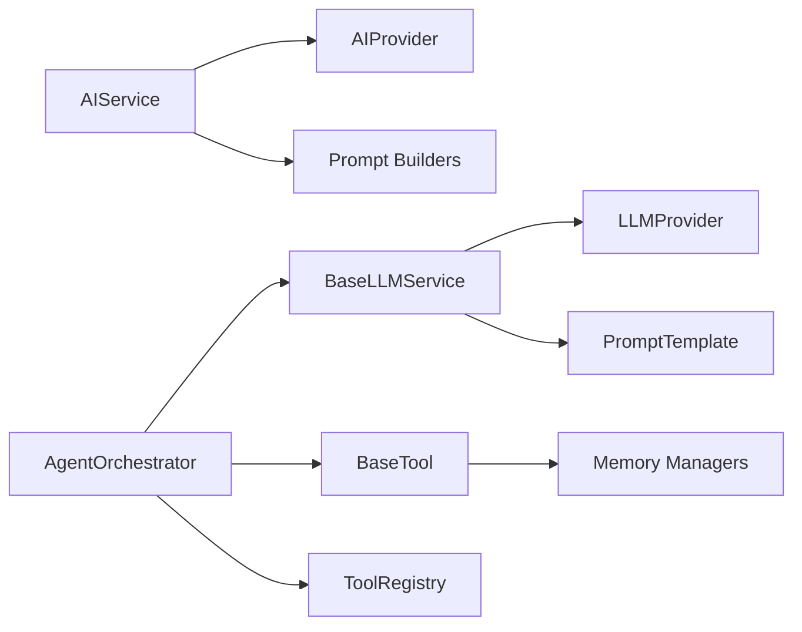

**Diagram sources**
- [ai-service.ts:77-126](file://src/agent/services/ai-service.ts#L77-L126)
- [llm.ts:110-139](file://src/agent/services/llm.ts#L110-L139)
- [base-tool.ts:15-49](file://src/agent/tools/base-tool.ts#L15-L49)
- [agent.ts:60-168](file://src/agent/core/agent.ts#L60-L168)

**Section sources**
- [ai-service.ts:77-126](file://src/agent/services/ai-service.ts#L77-L126)
- [llm.ts:110-139](file://src/agent/services/llm.ts#L110-L139)
- [base-tool.ts:15-49](file://src/agent/tools/base-tool.ts#L15-L49)
- [agent.ts:60-168](file://src/agent/core/agent.ts#L60-L168)

## Performance Considerations
- Prefer structured JSON prompts to reduce post-processing overhead.
- Cache repeated prompts and leverage provider streaming where supported.
- Batch tool executions and minimize round-trips to LLM APIs.
- Monitor token usage and adjust model parameters (temperature, max tokens) to balance quality and cost.
- Use local heuristics for non-critical tasks to reduce latency.

[No sources needed since this section provides general guidance]

## Troubleshooting Guide
- Validation failures: Ensure tool parameters meet metadata requirements.
- Execution errors: Inspect tool result error fields and session logs.
- Provider errors: Verify API keys, network connectivity, and provider quotas.
- Response validation: Confirm non-empty content and expected structure.

**Section sources**
- [base-tool.ts:30-48](file://src/agent/tools/base-tool.ts#L30-L48)
- [agent.ts:115-126](file://src/agent/core/agent.ts#L115-L126)
- [llm.ts:207-209](file://src/agent/services/llm.ts#L207-L209)
- [llm.ts:136-138](file://src/agent/services/llm.ts#L136-L138)

## Conclusion
The AI Service abstraction layer provides a clean separation of concerns, enabling pluggable providers, reusable prompts, and modular tooling. With robust error handling, memory-backed auditing, and structured schemas, the system supports extensibility and operational reliability. By following the patterns documented here, teams can safely introduce new providers and tools while maintaining performance and cost efficiency.

## Appendices
- Prompt template categories: summaries, achievements, skill gaps, analysis, and projects.
- Tool categories: analysis, generation, optimization, extraction, mapping.
- CV schema covers profile, skills, experience, projects, education, and metadata.

**Section sources**
- [prompts.ts:273-280](file://src/agent/services/prompts.ts#L273-L280)
- [agent.schema.ts:23-29](file://src/agent/schemas/agent.schema.ts#L23-L29)
- [cv.schema.ts:50-79](file://src/agent/schemas/cv.schema.ts#L50-L79)