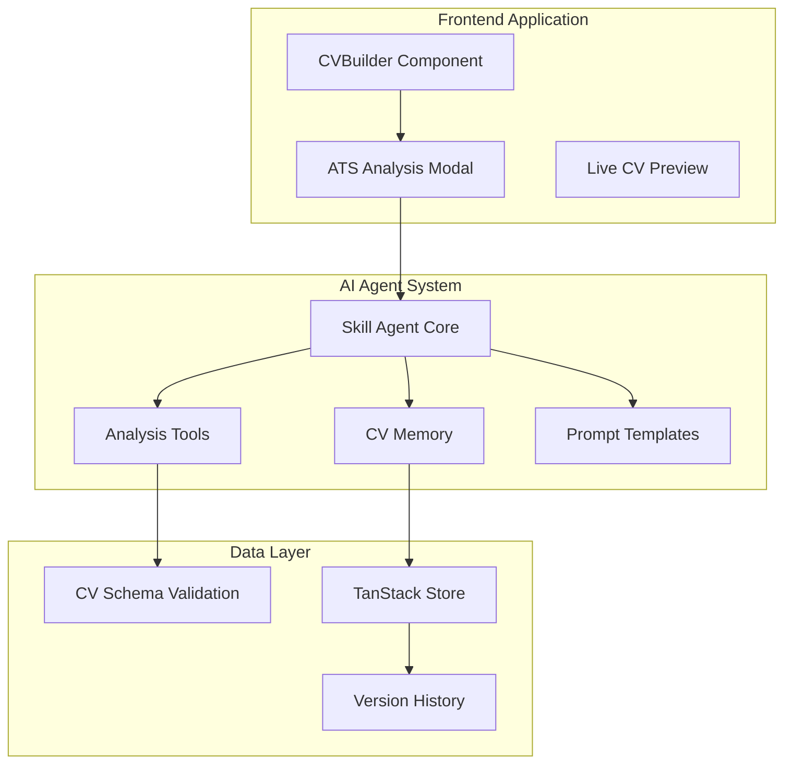
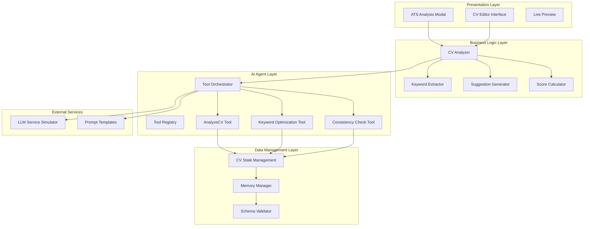
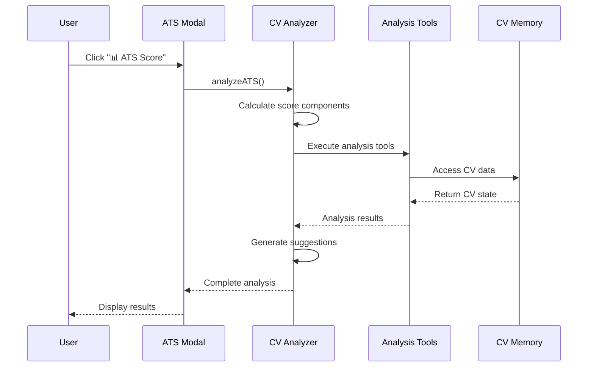
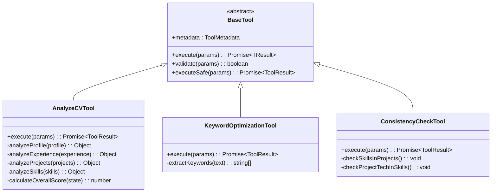
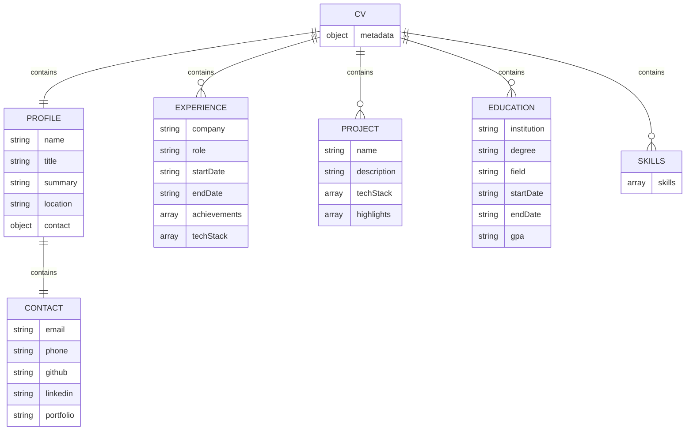
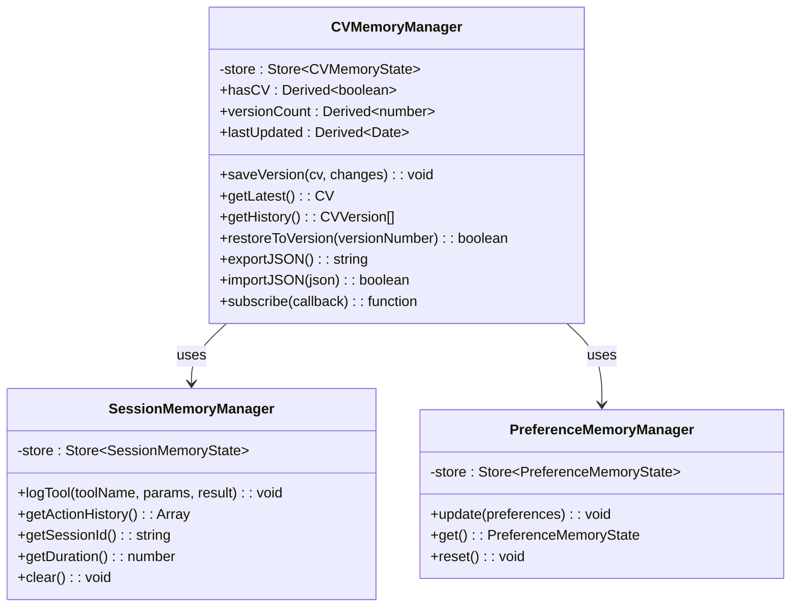
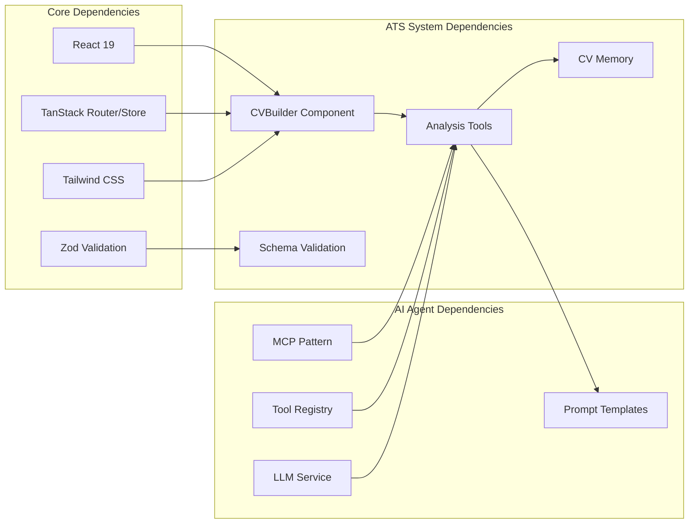

# ATS Optimization Guide

<cite>
**Referenced Files in This Document**
- [ATS_OPTIMIZATION_GUIDE.md](file://ATS_OPTIMIZATION_GUIDE.md)
- [README.md](file://README.md)
- [CVBuilder.tsx](file://src/components/CVBuilder.tsx)
- [prompts.ts](file://src/agent/services/prompts.ts)
- [analysis-tools.ts](file://src/agent/tools/analysis-tools.ts)
- [experience-tools.ts](file://src/agent/tools/experience-tools.ts)
- [skills-tools.ts](file://src/agent/tools/skills-tools.ts)
- [profile-tools.ts](file://src/agent/tools/profile-tools.ts)
- [project-tools.ts](file://src/agent/tools/project-tools.ts)
- [base-tool.ts](file://src/agent/tools/base-tool.ts)
- [cv.schema.ts](file://src/agent/schemas/cv.schema.ts)
- [cv-memory.ts](file://src/agent/memory/cv-memory.ts)
</cite>

## Table of Contents
1. [Introduction](#introduction)
2. [Project Structure](#project-structure)
3. [Core Components](#core-components)
4. [Architecture Overview](#architecture-overview)
5. [Detailed Component Analysis](#detailed-component-analysis)
6. [Dependency Analysis](#dependency-analysis)
7. [Performance Considerations](#performance-considerations)
8. [Troubleshooting Guide](#troubleshooting-guide)
9. [Conclusion](#conclusion)

## Introduction
This guide provides comprehensive documentation for the ATS (Applicant Tracking System) optimization features integrated into the CV Portfolio Builder application. ATS systems are widely used by employers to filter and rank resumes, and optimizing your CV for these systems is crucial to passing automated screening and reaching human recruiters. The application offers a complete ATS optimization suite including compatibility scoring, keyword detection, smart suggestions, formatting checklists, and job description matching.

The ATS features are built using a modular AI Skill Agent architecture that leverages the Model Context Protocol (MCP) pattern, providing both frontend-based analysis and backend tool integration for comprehensive CV optimization.

## Project Structure
The ATS optimization system is integrated into the CV Portfolio Builder application with a clear separation of concerns:

**Diagram sources**
- [CVBuilder.tsx:66-1092](file://src/components/CVBuilder.tsx#L66-L1092)
- [analysis-tools.ts:13-291](file://src/agent/tools/analysis-tools.ts#L13-L291)
- [cv-memory.ts:19-290](file://src/agent/memory/cv-memory.ts#L19-L290)

The system architecture follows a layered approach with clear boundaries between presentation, business logic, and data management components.

**Section sources**
- [README.md:83-111](file://README.md#L83-L111)
- [ATS_OPTIMIZATION_GUIDE.md:1-530](file://ATS_OPTIMIZATION_GUIDE.md#L1-L530)

## Core Components
The ATS optimization system consists of several interconnected components working together to provide comprehensive CV analysis and improvement suggestions:

### ATS Analysis Engine
The core ATS analysis engine performs comprehensive scoring across six key areas:
- **Contact Information**: Email, phone, LinkedIn profiles
- **Professional Summary**: Character length and keyword presence
- **Skills Section**: Quantity and relevance assessment
- **Work Experience**: Project count and achievement depth
- **Education**: Completeness verification
- **Readability**: Section completeness and formatting

### Keyword Detection System
The system automatically extracts and analyzes keywords from multiple sources:
- Professional summaries
- Skills categories
- Work experience descriptions
- Job descriptions (when provided)

### Smart Suggestions Engine
Provides actionable feedback categorized by priority:
- **Critical Issues**: Must-fix problems blocking ATS compatibility
- **Enhancement Tips**: Should-fix improvements for better rankings
- **Positive Feedback**: Already optimized sections

### Job Description Matcher
Matches CV content against target job descriptions to identify keyword gaps and provide targeted improvement suggestions.

**Section sources**
- [ATS_OPTIMIZATION_GUIDE.md:9-121](file://ATS_OPTIMIZATION_GUIDE.md#L9-L121)
- [analysis-tools.ts:13-141](file://src/agent/tools/analysis-tools.ts#L13-L141)

## Architecture Overview
The ATS optimization system follows a sophisticated multi-layered architecture designed for scalability and maintainability:

**Diagram sources**
- [CVBuilder.tsx:243-388](file://src/components/CVBuilder.tsx#L243-L388)
- [analysis-tools.ts:13-291](file://src/agent/tools/analysis-tools.ts#L13-L291)
- [base-tool.ts:15-49](file://src/agent/tools/base-tool.ts#L15-L49)

The architecture implements the Model Context Protocol (MCP) pattern, providing a robust foundation for AI-powered CV optimization services.

**Section sources**
- [README.md:219-246](file://README.md#L219-L246)
- [cv-memory.ts:19-148](file://src/agent/memory/cv-memory.ts#L19-L148)

## Detailed Component Analysis

### ATS Analysis Modal Component
The ATS Analysis Modal serves as the primary user interface for accessing optimization features:

**Diagram sources**
- [CVBuilder.tsx:243-388](file://src/components/CVBuilder.tsx#L243-L388)
- [analysis-tools.ts:21-72](file://src/agent/tools/analysis-tools.ts#L21-L72)

The modal provides four main sections: compatibility scoring, keyword detection, improvement suggestions, and formatting checklist.

### Analysis Tools Implementation
The analysis tools system provides specialized functionality for different aspects of CV optimization:

**Diagram sources**
- [base-tool.ts:15-72](file://src/agent/tools/base-tool.ts#L15-L72)
- [analysis-tools.ts:13-291](file://src/agent/tools/analysis-tools.ts#L13-L291)

Each tool implements the BaseTool interface, providing consistent error handling and validation mechanisms.

### CV Data Schema and Validation
The system enforces strict data validation through comprehensive schema definitions:

**Diagram sources**
- [cv.schema.ts:4-79](file://src/agent/schemas/cv.schema.ts#L4-L79)

The schema ensures data integrity and provides validation for all CV components.

**Section sources**
- [cv.schema.ts:4-79](file://src/agent/schemas/cv.schema.ts#L4-L79)
- [analysis-tools.ts:13-141](file://src/agent/tools/analysis-tools.ts#L13-L141)

### Memory Management System
The memory management system provides persistent storage and version control for CV data:

**Diagram sources**
- [cv-memory.ts:19-290](file://src/agent/memory/cv-memory.ts#L19-L290)

The system maintains three distinct memory layers: CV data, session actions, and user preferences.

**Section sources**
- [cv-memory.ts:19-290](file://src/agent/memory/cv-memory.ts#L19-L290)

## Dependency Analysis
The ATS optimization system exhibits excellent modularity with clear dependency relationships:

**Diagram sources**
- [README.md:31-44](file://README.md#L31-L44)
- [CVBuilder.tsx:66-1092](file://src/components/CVBuilder.tsx#L66-L1092)

The dependency graph shows a clean separation between UI presentation, business logic, and AI agent services.

**Section sources**
- [README.md:31-44](file://README.md#L31-L44)
- [CVBuilder.tsx:66-1092](file://src/components/CVBuilder.tsx#L66-L1092)

## Performance Considerations
The ATS optimization system is designed for optimal performance and user experience:

### Frontend Performance
- **Lightweight Modal**: The ATS analysis modal is rendered conditionally and only when needed
- **Efficient Scoring Algorithm**: Mathematical calculations performed client-side for immediate feedback
- **Minimal Dependencies**: Uses only essential libraries to maintain fast load times
- **Responsive Design**: Mobile-first approach ensures optimal performance across devices

### AI Agent Performance
- **Lazy Loading**: AI tools are loaded on-demand when analysis is requested
- **Caching Mechanisms**: Results cached to avoid redundant computations
- **Asynchronous Processing**: Non-blocking operations prevent UI freezing
- **Resource Optimization**: Tools designed to minimize computational overhead

### Data Management Performance
- **State Management**: Efficient TanStack Store implementation for reactive updates
- **Memory Optimization**: Automatic cleanup of unused data and references
- **Schema Validation**: Pre-processing validation prevents expensive error handling later

## Troubleshooting Guide
Common issues and their solutions when using the ATS optimization features:

### ATS Score Calculation Issues
**Problem**: Score appears incorrect or inconsistent
**Solution**: 
1. Verify all required sections are completed in the CV editor
2. Check that contact information includes valid email, phone, and LinkedIn
3. Ensure professional summary exceeds 100 characters
4. Confirm skills section contains 5+ relevant technologies

### Keyword Detection Problems
**Problem**: Expected keywords not appearing in detection results
**Solution**:
1. Verify keywords are spelled correctly in CV content
2. Check that job description contains common technical terms
3. Ensure keywords are not embedded within larger phrases incorrectly
4. Confirm case-insensitive matching is working properly

### Modal Display Issues
**Problem**: ATS analysis modal fails to appear or displays incorrectly
**Solution**:
1. Check browser console for JavaScript errors
2. Verify React and TanStack Router are functioning correctly
3. Ensure proper state management for modal visibility
4. Confirm Tailwind CSS is loading correctly for styling

### Performance Issues
**Problem**: Slow response times during analysis
**Solution**:
1. Reduce CV complexity by removing unnecessary sections
2. Clear browser cache and reload the application
3. Check network connectivity for external services
4. Monitor browser performance using developer tools

**Section sources**
- [ATS_OPTIMIZATION_GUIDE.md:267-318](file://ATS_OPTIMIZATION_GUIDE.md#L267-L318)
- [CVBuilder.tsx:243-388](file://src/components/CVBuilder.tsx#L243-L388)

## Conclusion
The ATS optimization system in the CV Portfolio Builder provides a comprehensive solution for creating ATS-friendly resumes. Through its multi-layered architecture, the system delivers accurate scoring, intelligent keyword detection, actionable suggestions, and real-time feedback to help job seekers succeed in automated screening processes.

The implementation demonstrates excellent software engineering practices with clear separation of concerns, robust error handling, and scalable architecture. The combination of frontend-based analysis and AI agent integration provides both immediate feedback and potential for future enhancements with advanced machine learning capabilities.

Key benefits of the system include:
- **Comprehensive Analysis**: Multi-dimensional scoring across all critical CV aspects
- **Actionable Insights**: Specific, prioritized recommendations for improvement
- **Real-time Feedback**: Immediate results with visual scoring and suggestions
- **Job-Specific Optimization**: Tailoring CVs to match specific job requirements
- **Professional Presentation**: Clean, intuitive interface with visual scoring

The ATS optimization features represent a significant advancement in CV creation tools, providing job seekers with the competitive advantage needed to succeed in today's automated hiring landscape.