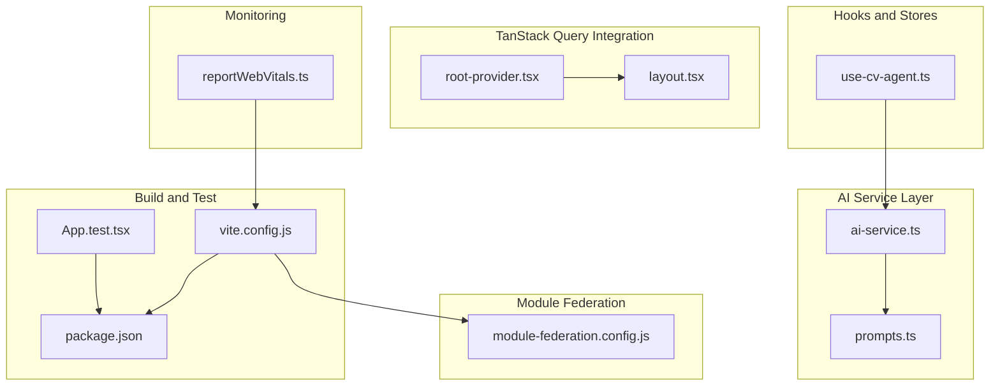
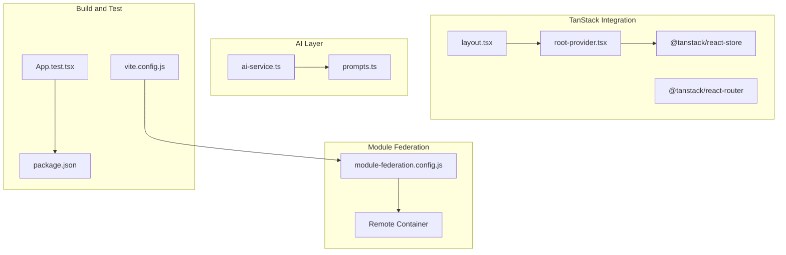
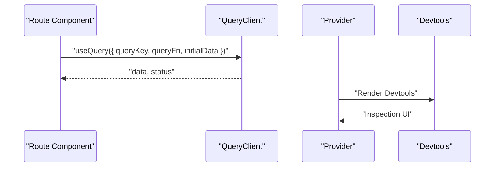
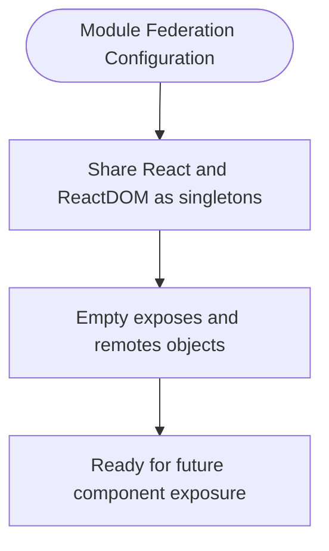
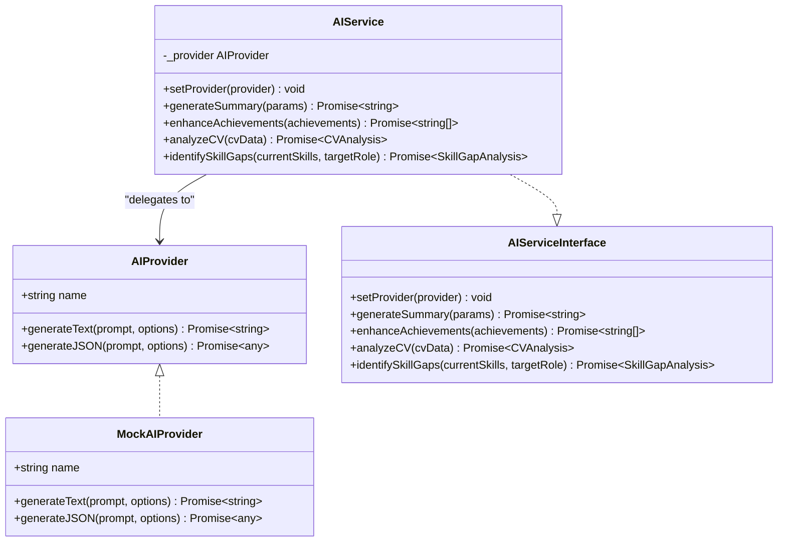
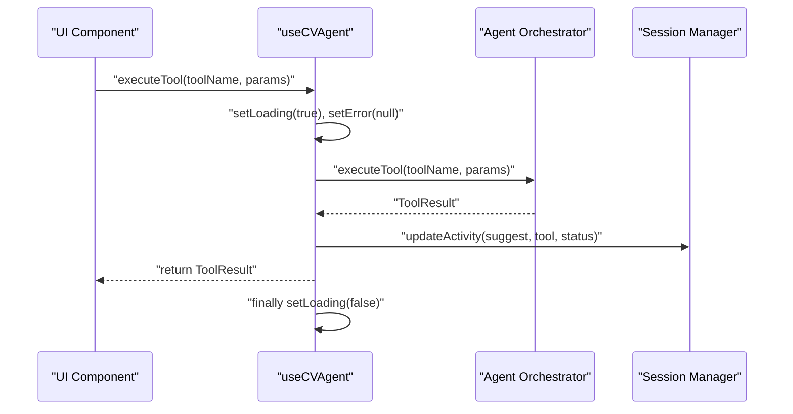
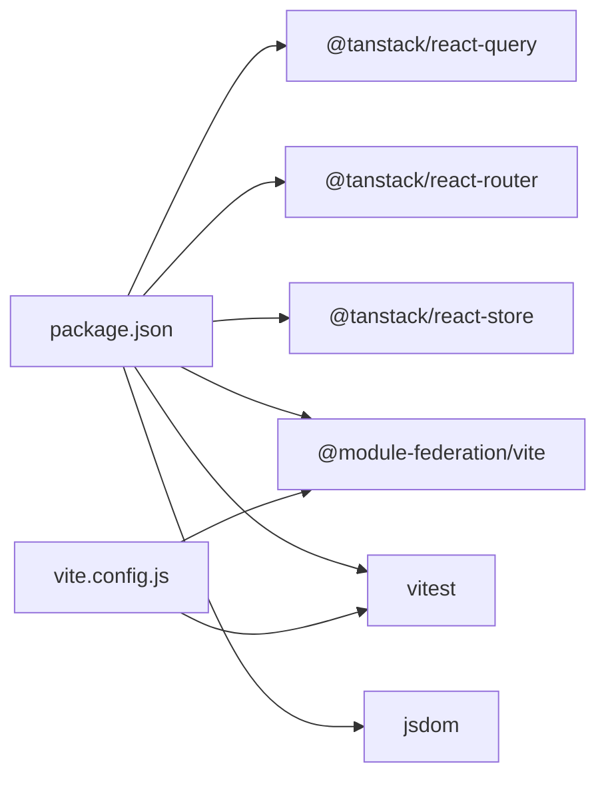

# Advanced Features

<cite>
**Referenced Files in This Document**
- [root-provider.tsx](file://src/integrations/tanstack-query/root-provider.tsx)
- [layout.tsx](file://src/integrations/tanstack-query/layout.tsx)
- [module-federation.config.js](file://module-federation.config.js)
- [ai-service.ts](file://src/agent/services/ai-service.ts)
- [prompts.ts](file://src/agent/services/prompts.ts)
- [use-cv-agent.ts](file://src/hooks/use-cv-agent.ts)
- [vite.config.js](file://vite.config.js)
- [package.json](file://package.json)
- [App.test.tsx](file://src/App.test.tsx)
- [reportWebVitals.ts](file://src/reportWebVitals.ts)
</cite>

## Update Summary
**Changes Made**
- Updated Module Federation section to reflect current implementation state without demo components
- Removed references to non-existent demo files and routes
- Updated architecture diagrams to show actual current state
- Clarified that module federation is currently configured but no components are exposed

## Table of Contents
1. [Introduction](#introduction)
2. [Project Structure](#project-structure)
3. [Core Components](#core-components)
4. [Architecture Overview](#architecture-overview)
5. [Detailed Component Analysis](#detailed-component-analysis)
6. [Dependency Analysis](#dependency-analysis)
7. [Performance Considerations](#performance-considerations)
8. [Testing Strategies](#testing-strategies)
9. [Deployment and Build Optimizations](#deployment-and-build-optimizations)
10. [Monitoring and Debugging](#monitoring-and-debugging)
11. [Troubleshooting Guide](#troubleshooting-guide)
12. [Conclusion](#conclusion)

## Introduction
This document details the advanced features of the CV Portfolio Builder, focusing on:
- TanStack Query integration for data fetching and caching
- Module Federation setup for micro-frontend architecture and component sharing
- Performance optimization techniques including lazy loading, code splitting, and memory management
- Testing strategies using Vitest and Testing Library
- AI service abstraction layer for integrating multiple AI providers
- Deployment configurations, build optimizations, and production considerations
- Monitoring, debugging tools, and troubleshooting advanced scenarios

## Project Structure
The advanced features span several areas:
- TanStack Query integration under src/integrations/tanstack-query
- Module Federation configuration and shared dependencies
- AI service abstraction and prompt templates under src/agent/services
- Hooks leveraging TanStack Query Store and React Query for agent state and data
- Vite configuration enabling Module Federation and test environment
- Web Vitals reporting for performance monitoring

**Diagram sources**
- [root-provider.tsx:1-14](file://src/integrations/tanstack-query/root-provider.tsx#L1-L14)
- [layout.tsx:1-6](file://src/integrations/tanstack-query/layout.tsx#L1-L6)
- [module-federation.config.js:1-29](file://module-federation.config.js#L1-L29)
- [ai-service.ts:1-174](file://src/agent/services/ai-service.ts#L1-L174)
- [prompts.ts:1-280](file://src/agent/services/prompts.ts#L1-L280)
- [use-cv-agent.ts:1-185](file://src/hooks/use-cv-agent.ts#L1-L185)
- [vite.config.js:1-51](file://vite.config.js#L1-L51)
- [package.json:1-80](file://package.json#L1-L80)
- [App.test.tsx:1-11](file://src/App.test.tsx#L1-L11)
- [reportWebVitals.ts:1-14](file://src/reportWebVitals.ts#L1-L14)

**Section sources**
- [vite.config.js:1-51](file://vite.config.js#L1-L51)
- [package.json:1-80](file://package.json#L1-L80)

## Core Components
- TanStack Query Provider: Centralizes caching and data fetching via a QueryClient and exposes it through a provider and context getter.
- TanStack Query Devtools: Integrated devtools for inspection and debugging of queries.
- Module Federation Config: Defines shared dependencies, remote configuration, and current empty exposure settings.
- AI Service Abstraction: Provides a pluggable AI provider interface and a default mock provider, plus a service wrapper for generating summaries, enhancing achievements, analyzing CVs, and identifying skill gaps.
- Prompt Templates: Modular prompt builders for summaries, achievements, skill gaps, analysis, and projects.
- CV Agent Hooks: Reactive hooks for executing tools, getting suggestions, running analysis, managing context, and session statistics.
- Vite Configuration: Enables Module Federation plugin, sets up test environment, aliases, and build targets.
- Testing Setup: Vitest configuration and a basic test using Testing Library.
- Web Vitals Reporting: Optional performance metrics collection.

**Section sources**
- [root-provider.tsx:1-14](file://src/integrations/tanstack-query/root-provider.tsx#L1-L14)
- [layout.tsx:1-6](file://src/integrations/tanstack-query/layout.tsx#L1-L6)
- [module-federation.config.js:1-29](file://module-federation.config.js#L1-L29)
- [ai-service.ts:1-174](file://src/agent/services/ai-service.ts#L1-L174)
- [prompts.ts:1-280](file://src/agent/services/prompts.ts#L1-L280)
- [use-cv-agent.ts:1-185](file://src/hooks/use-cv-agent.ts#L1-L185)
- [vite.config.js:1-51](file://vite.config.js#L1-L51)
- [App.test.tsx:1-11](file://src/App.test.tsx#L1-L11)
- [reportWebVitals.ts:1-14](file://src/reportWebVitals.ts#L1-L14)

## Architecture Overview
The advanced features integrate as follows:
- TanStack Query powers data fetching and caching for agent state via @tanstack/react-store.
- Module Federation is configured with shared dependencies for future component exposure.
- The AI service layer abstracts provider implementations behind a unified interface, allowing easy swapping of providers.
- Vite orchestrates build-time features including Module Federation and test runtime configuration.
- Web Vitals provides optional performance monitoring hooks.

**Diagram sources**
- [root-provider.tsx:1-14](file://src/integrations/tanstack-query/root-provider.tsx#L1-L14)
- [layout.tsx:1-6](file://src/integrations/tanstack-query/layout.tsx#L1-L6)
- [module-federation.config.js:1-29](file://module-federation.config.js#L1-L29)
- [ai-service.ts:1-174](file://src/agent/services/ai-service.ts#L1-L174)
- [prompts.ts:1-280](file://src/agent/services/prompts.ts#L1-L280)
- [vite.config.js:1-51](file://vite.config.js#L1-L51)
- [package.json:1-80](file://package.json#L1-L80)
- [App.test.tsx:1-11](file://src/App.test.tsx#L1-L11)

## Detailed Component Analysis

### TanStack Query Integration
- Provider and Context: A QueryClient is created and exposed via a provider and a context getter for downstream consumers.
- Devtools: React Query Devtools are included with a visible control positioned at the bottom right.
- Store Integration: Hooks leverage @tanstack/react-store for reactive state management alongside TanStack Query.

**Diagram sources**
- [root-provider.tsx:11-13](file://src/integrations/tanstack-query/root-provider.tsx#L11-L13)
- [layout.tsx:3-5](file://src/integrations/tanstack-query/layout.tsx#L3-L5)

**Section sources**
- [root-provider.tsx:1-14](file://src/integrations/tanstack-query/root-provider.tsx#L1-L14)
- [layout.tsx:1-6](file://src/integrations/tanstack-query/layout.tsx#L1-L6)

### Module Federation Setup
**Updated** The module federation configuration is currently set up but no components are exposed. The configuration defines shared dependencies for React and ReactDOM that can be used by remote consumers.

- Shared Dependencies: React and ReactDOM are marked as singletons with required versions aligned to package dependencies.
- Current State: The `exposes` and `remotes` objects are empty, indicating no components are currently exposed for remote consumption.
- Remote Configuration: The config defines a filename for the remote entry and sets the module name and shared scopes.

**Diagram sources**
- [module-federation.config.js:18-27](file://module-federation.config.js#L18-L27)
- [module-federation.config.js:16](file://module-federation.config.js#L16)

**Section sources**
- [module-federation.config.js:1-29](file://module-federation.config.js#L1-L29)

### AI Service Abstraction Layer
- Provider Interface: Defines provider identity and generation methods for text and JSON with optional generation options.
- Service Interface: Provides methods for generating summaries, enhancing achievements, analyzing CVs, and identifying skill gaps.
- Mock Provider: Implements a mock provider suitable for development and testing with simulated latency.
- Service Implementation: Delegates to the configured provider and formats results according to expected shapes.
- Prompt Templates: Offers reusable prompt builders for summaries, achievements, skill gaps, analysis, and projects.

**Diagram sources**
- [ai-service.ts:5-126](file://src/agent/services/ai-service.ts#L5-L126)

**Section sources**
- [ai-service.ts:1-174](file://src/agent/services/ai-service.ts#L1-L174)
- [prompts.ts:1-280](file://src/agent/services/prompts.ts#L1-L280)

### CV Agent Hooks and State Management
- useCVAgent: Encapsulates tool execution with error handling and loading states, suggestion retrieval, automated analysis, context updates, and state export. It integrates with agent orchestrator and session manager.
- useCVData: Subscribes to reactive CV data, context, completeness score, categorized skills, and last modified timestamps via @tanstack/react-store.
- useAgentTools: Reads available tools from a global registry and groups them by category.
- useSession: Manages session statistics, periodic refresh, clearing, and exporting session data.

**Diagram sources**
- [use-cv-agent.ts:20-49](file://src/hooks/use-cv-agent.ts#L20-L49)

**Section sources**
- [use-cv-agent.ts:1-185](file://src/hooks/use-cv-agent.ts#L1-L185)

## Dependency Analysis
- TanStack Ecosystem: The project depends on @tanstack/react-query, @tanstack/react-query-devtools, @tanstack/react-router, @tanstack/react-store, and @tanstack/react-table, indicating a comprehensive data fetching and UI integration stack.
- Module Federation: The @module-federation/vite plugin is enabled in Vite, aligning with the module-federation.config.js.
- Testing: Vitest and jsdom are configured for unit tests, with Testing Library packages available for component testing.
- Build Targets: Vite is configured to target esnext for modern JavaScript features.

**Diagram sources**
- [package.json:21-49](file://package.json#L21-L49)
- [vite.config.js:5-10](file://vite.config.js#L5-L10)

**Section sources**
- [package.json:1-80](file://package.json#L1-L80)
- [vite.config.js:1-51](file://vite.config.js#L1-L51)

## Performance Considerations
- Lazy Loading and Code Splitting: Leverage dynamic imports for routes and components to reduce initial bundle size. Combine with route-level data fetching to defer heavy work until navigation occurs.
- Memory Management: Avoid retaining large datasets in component state; prefer server-side pagination or virtualization for long lists. Clean up intervals and subscriptions in hooks.
- Build Targets: Using esnext ensures modern features are supported; consider balancing with browser support needs if targeting older environments.
- Devtools: Enable React Query Devtools during development to inspect cache behavior and optimize stale times and cache times.

## Testing Strategies
- Unit Tests: Use Vitest with jsdom environment for DOM APIs. Render components with Testing Library and assert behavior.
- Example: A simple test verifies that the app renders with expected text.
- Coverage: Expand tests to cover hooks, services, and route components with mocked providers where appropriate.

**Section sources**
- [App.test.tsx:1-11](file://src/App.test.tsx#L1-L11)
- [vite.config.js:11-37](file://vite.config.js#L11-L37)
- [package.json:51-68](file://package.json#L51-L68)

## Deployment and Build Optimizations
- Build Command: The build script runs Vite build followed by TypeScript compilation.
- Modern JS Target: Vite is configured to target esnext, enabling top-level await and modern features.
- Aliases: Path aliases simplify imports and improve maintainability.
- Module Federation: The configuration is ready for component exposure with proper shared dependency management.

**Section sources**
- [package.json:5-8](file://package.json#L5-L8)
- [vite.config.js:38-49](file://vite.config.js#L38-L49)
- [module-federation.config.js:18-27](file://module-federation.config.js#L18-L27)

## Monitoring and Debugging
- Web Vitals: Optional reporting hook integrates web-vitals to measure CLS, INP, FCP, LCP, and TTFB. Useful for production performance monitoring.
- TanStack Devtools: React Query Devtools aid in debugging cache state and query lifecycles during development.

**Section sources**
- [reportWebVitals.ts:1-14](file://src/reportWebVitals.ts#L1-L14)
- [layout.tsx:3-5](file://src/integrations/tanstack-query/layout.tsx#L3-L5)

## Troubleshooting Guide
- TanStack Query Issues:
  - Verify provider wrapping around the app.
  - Confirm query keys are stable and unique per endpoint.
  - Adjust staleTime/cacheTime for optimal performance vs freshness.
- Module Federation Problems:
  - Ensure shared dependencies match across host and remotes.
  - The current configuration has empty exposes/remotes objects - add components when ready to expose.
  - Check remoteEntry availability and CORS if consuming remotely.
- AI Service Provider Switching:
  - Implement a real provider conforming to AIProvider interface.
  - Ensure prompt templates are adapted to the provider's capabilities.
- Testing Failures:
  - Confirm jsdom environment is active for DOM-related tests.
  - Mock external services and providers in unit tests.

**Section sources**
- [root-provider.tsx:11-13](file://src/integrations/tanstack-query/root-provider.tsx#L11-L13)
- [module-federation.config.js:16](file://module-federation.config.js#L16)
- [ai-service.ts:5-126](file://src/agent/services/ai-service.ts#L5-L126)
- [vite.config.js:11-14](file://vite.config.js#L11-L14)

## Conclusion
The CV Portfolio Builder incorporates robust advanced features:
- TanStack Query provides efficient data fetching and caching with integrated devtools.
- Module Federation is configured with shared dependencies ready for future component exposure.
- The AI service abstraction allows flexible provider integration and scalable prompt engineering.
- Vite configuration supports modern builds, testing, and micro-frontend workflows.
- Performance and monitoring hooks help maintain quality in production.