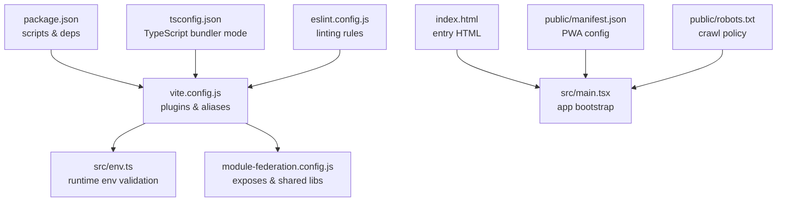
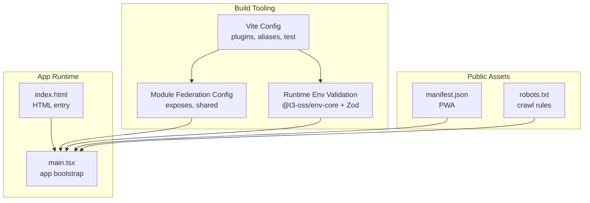
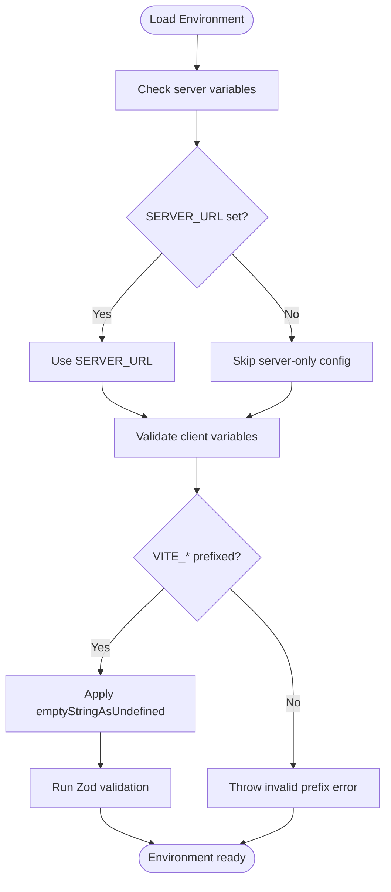
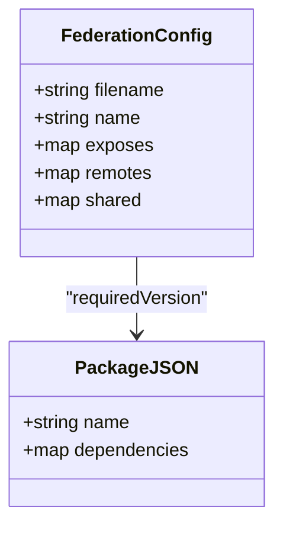
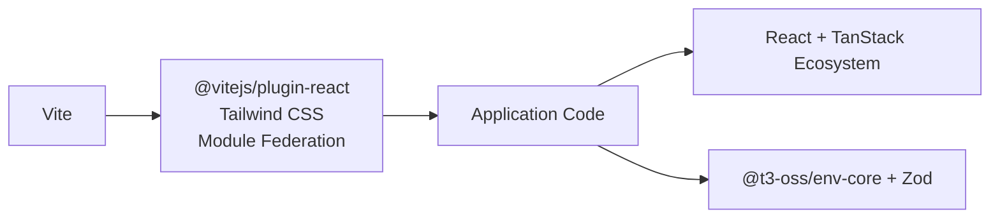

# Deployment & Configuration

<cite>
**Referenced Files in This Document**
- [package.json](file://package.json)
- [vite.config.js](file://vite.config.js)
- [src/env.ts](file://src/env.ts)
- [index.html](file://index.html)
- [module-federation.config.js](file://module-federation.config.js)
- [public/manifest.json](file://public/manifest.json)
- [public/robots.txt](file://public/robots.txt)
- [eslint.config.js](file://eslint.config.js)
- [tsconfig.json](file://tsconfig.json)
</cite>

## Table of Contents
1. [Introduction](#introduction)
2. [Project Structure](#project-structure)
3. [Core Components](#core-components)
4. [Architecture Overview](#architecture-overview)
5. [Detailed Component Analysis](#detailed-component-analysis)
6. [Dependency Analysis](#dependency-analysis)
7. [Performance Considerations](#performance-considerations)
8. [Security Configuration](#security-configuration)
9. [Monitoring Setup](#monitoring-setup)
10. [Scaling & Load Balancing](#scaling--load-balancing)
11. [CI/CD Pipeline & Automated Deployment](#cicd-pipeline--automated-deployment)
12. [Troubleshooting Guide](#troubleshooting-guide)
13. [Conclusion](#conclusion)

## Introduction
This document provides comprehensive guidance for deploying and configuring the CV Portfolio Builder application. It covers build configuration across development, staging, and production environments; environment variable management and validation; deployment options (static hosting, server-side rendering, and edge computing); CI/CD pipeline setup; security hardening (HTTPS, CSP, XSS); monitoring and observability; scaling and load balancing; and troubleshooting common deployment issues.

## Project Structure
The project is a Vite-based React application configured with TypeScript, Tailwind CSS, Module Federation, and TanStack Router. Build and test tooling are defined via Vite and Vitest, while environment variables are validated at runtime using @t3-oss/env-core with Zod.

**Diagram sources**
- [package.json:1-60](file://package.json#L1-L60)
- [vite.config.js:1-28](file://vite.config.js#L1-L28)
- [src/env.ts:1-40](file://src/env.ts#L1-L40)
- [module-federation.config.js:1-32](file://module-federation.config.js#L1-L32)
- [index.html:1-18](file://index.html#L1-L18)
- [public/manifest.json:1-26](file://public/manifest.json#L1-L26)
- [public/robots.txt:1-4](file://public/robots.txt#L1-L4)
- [tsconfig.json:1-29](file://tsconfig.json#L1-L29)
- [eslint.config.js:1-6](file://eslint.config.js#L1-L6)

**Section sources**
- [package.json:1-60](file://package.json#L1-L60)
- [vite.config.js:1-28](file://vite.config.js#L1-L28)
- [tsconfig.json:1-29](file://tsconfig.json#L1-L29)
- [eslint.config.js:1-6](file://eslint.config.js#L1-L6)

## Core Components
- Build and dev server: Vite with React plugin, Tailwind CSS plugin, and Module Federation plugin.
- Environment validation: Runtime environment variables validated via @t3-oss/env-core and Zod.
- PWA assets: Manifest and robots configuration under public/.
- Routing and state: TanStack Router and TanStack Query stack present in dependencies; routing configuration is externalized via module federation.
- Testing: Vitest with jsdom environment configured in Vite.

Key build scripts:
- Development: runs Vite dev server on port 3000.
- Production build: Vite build plus TypeScript emit.
- Preview: Vite preview server for local testing of production builds.
- Tests: Vitest runner.

**Section sources**
- [package.json:5-14](file://package.json#L5-L14)
- [vite.config.js:9-27](file://vite.config.js#L9-L27)
- [src/env.ts:4-39](file://src/env.ts#L4-L39)
- [public/manifest.json:1-26](file://public/manifest.json#L1-L26)
- [public/robots.txt:1-4](file://public/robots.txt#L1-L4)

## Architecture Overview
The application uses a client-side rendered React SPA with Module Federation enabling remote exposure of components. Environment variables are validated at runtime and injected via Vite’s import.meta.env.

**Diagram sources**
- [vite.config.js:9-27](file://vite.config.js#L9-L27)
- [module-federation.config.js:13-31](file://module-federation.config.js#L13-L31)
- [src/env.ts:4-39](file://src/env.ts#L4-L39)
- [index.html:1-18](file://index.html#L1-L18)
- [public/manifest.json:1-26](file://public/manifest.json#L1-L26)
- [public/robots.txt:1-4](file://public/robots.txt#L1-L4)

## Detailed Component Analysis

### Build Configuration and Environments
- Development: use the dev/start script to launch Vite on port 3000. Aliases for @ and @components simplify imports.
- Staging/Production: use the build script to produce optimized bundles. esbuild target is set to ESNext to enable modern features.
- Test environment: Vitest configured with jsdom and global test setup.

Recommended environment-specific overrides:
- Set VITE_APP_TITLE per environment for branding.
- Configure SERVER_URL for backend integration in server environments.

**Section sources**
- [package.json:5-14](file://package.json#L5-L14)
- [vite.config.js:15-26](file://vite.config.js#L15-L26)

### Environment Variable Management and Loading Strategy
- Server-side variables: optional URL for server base.
- Client-side variables: prefixed with VITE_ and validated at runtime.
- Validation behavior: emptyStringAsUndefined ensures defaults are applied when variables are unset.
- Runtime binding: import.meta.env supplies values during client-side execution.

**Diagram sources**
- [src/env.ts:4-39](file://src/env.ts#L4-L39)

**Section sources**
- [src/env.ts:4-39](file://src/env.ts#L4-L39)

### Module Federation Configuration
- Exposes components for remote consumption.
- Shares React and ReactDOM as singletons with required versions aligned to package.json.
- Remote entries are configured via remoteConfig helper.

**Diagram sources**
- [module-federation.config.js:13-31](file://module-federation.config.js#L13-L31)
- [package.json:15-44](file://package.json#L15-L44)

**Section sources**
- [module-federation.config.js:1-32](file://module-federation.config.js#L1-L32)
- [package.json:15-44](file://package.json#L15-L44)

### Static Hosting Deployment
- Build artifacts: Vite produces static assets suitable for CDN or static host providers.
- PWA readiness: manifest and icons are included; robots.txt allows crawling.
- Recommendations:
  - Host under a subpath if needed; adjust base path accordingly.
  - Enable gzip/brotli compression on the CDN.
  - Set long cache headers for immutable assets; use cache-busting filenames.

**Section sources**
- [package.json:8](file://package.json#L8)
- [public/manifest.json:1-26](file://public/manifest.json#L1-L26)
- [public/robots.txt:1-4](file://public/robots.txt#L1-L4)

### Server-Side Rendering (SSR) Option
- Current stack: client-side SPA with Module Federation.
- To enable SSR:
  - Add an SSR adapter compatible with Vite and React (e.g., Vite SSR plugins).
  - Externalize server-side environment variables and pass them to the client via window.__ENV__ or similar.
  - Reuse TanStack Router server-side capabilities if migrating to a router that supports SSR.

[No sources needed since this section provides general guidance]

### Edge Computing Deployment
- Module Federation enables dynamic loading of remote components, beneficial for edge networks.
- Strategies:
  - Host remotes on edge locations with low latency to users.
  - Use CDN caching for stable remoteEntry.js and component chunks.
  - Implement progressive fallbacks if remotes are unavailable.

[No sources needed since this section provides general guidance]

## Dependency Analysis
- Build-time dependencies: Vite, @vitejs/plugin-react, @tailwindcss/vite, @module-federation/vite.
- Runtime dependencies: React, React DOM, TanStack Router/Query ecosystem, Zod, @t3-oss/env-core.
- TypeScript configuration uses bundler resolution and bundler-compatible paths.

**Diagram sources**
- [vite.config.js:3-10](file://vite.config.js#L3-L10)
- [package.json:15-44](file://package.json#L15-L44)
- [src/env.ts:1-2](file://src/env.ts#L1-L2)

**Section sources**
- [vite.config.js:1-28](file://vite.config.js#L1-L28)
- [package.json:15-44](file://package.json#L15-L44)
- [tsconfig.json:10-26](file://tsconfig.json#L10-L26)

## Performance Considerations
- Target modern browsers (ESNext) to leverage top-level await and native features.
- Enable compression (gzip/brotli) on static assets.
- Split code using Module Federation to reduce initial bundle size.
- Use lazy loading for non-critical routes and components.
- Optimize images and fonts; preload critical resources via the HTML head.

[No sources needed since this section provides general guidance]

## Security Configuration
- HTTPS: Serve over TLS with a valid certificate; configure HSTS and secure cookies if backend is involved.
- Content Security Policy (CSP):
  - Restrict script-src to trusted CDNs and self.
  - Use strict-dynamic if hashes/nonces are not feasible.
  - Whitelist connect-src for required APIs.
- XSS Protection:
  - Sanitize any user-generated content.
  - Avoid innerHTML; use React’s built-in escaping.
  - Validate and sanitize inputs with Zod schemas.
- Environment Variables:
  - Never expose secrets in client bundles; keep server credentials server-only.
  - Use VITE_ prefix for client-visible variables only.

[No sources needed since this section provides general guidance]

## Monitoring Setup
- Performance Metrics:
  - Use web-vitals or a dedicated SDK to track Largest Contentful Paint, Cumulative Layout Shift, and First Input Delay.
- Error Tracking:
  - Integrate a lightweight error reporting service; avoid capturing sensitive data.
- Analytics:
  - Respect privacy; disable analytics in development or behind opt-in toggles.
- Observability:
  - Log structured errors with context; correlate with user sessions.

[No sources needed since this section provides general guidance]

## Scaling & Load Balancing
- Horizontal scaling: Stateless frontend; scale replicas behind a load balancer.
- Health checks: Implement a simple /health endpoint if serving backend.
- Session affinity: Not required for static SPA; enable sticky sessions only if required by backend.
- CDN tier: Offload static assets to a CDN; cache aggressively.
- Auto-scaling: Scale based on CPU/memory or requests per second.

[No sources needed since this section provides general guidance]

## CI/CD Pipeline & Automated Deployment
- Build and Test:
  - Run linting and tests in CI before building.
  - Use matrix builds for multiple Node/Browser versions if desired.
- Artifact Promotion:
  - Store build artifacts per branch/tag.
- Deployments:
  - Static hosting: deploy build output to S3/GCS/Netlify/Vercel with redirects for SPA routing.
  - Edge: publish remotes to edge locations; update remote URLs per environment.
- Secrets Management:
  - Inject environment variables via CI provider secrets; never commit to repo.
- Rollback:
  - Keep previous artifact versions for quick rollback.

[No sources needed since this section provides general guidance]

## Troubleshooting Guide
- Build fails with missing dependencies:
  - Ensure all dependencies are installed and versions match package.json.
- Vite dev server not starting:
  - Verify port 3000 is free; check firewall and proxy settings.
- Environment variables not applied:
  - Confirm VITE_ prefix for client variables; ensure emptyStringAsUndefined behavior aligns with expectations.
- Module Federation errors:
  - Verify remote URLs are reachable; ensure shared libraries versions match.
- PWA not installing:
  - Confirm manifest.json is served from the root and fingerprints are correct.
- Robots blocking indexing:
  - Adjust robots.txt for staging environments.

**Section sources**
- [src/env.ts:38](file://src/env.ts#L38)
- [module-federation.config.js:13-31](file://module-federation.config.js#L13-L31)
- [public/manifest.json:1-26](file://public/manifest.json#L1-L26)
- [public/robots.txt:1-4](file://public/robots.txt#L1-L4)

## Conclusion
The CV Portfolio Builder is a modern, client-side React application built with Vite and Module Federation. Its configuration supports clean separation of concerns for environment variables, static hosting, and extensibility via federated components. By following the deployment and security recommendations herein, teams can reliably deliver the application across environments while maintaining performance, observability, and scalability.