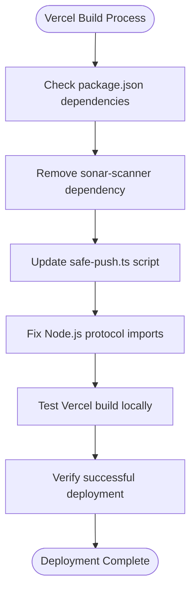

# Vercel Deployment Fix

<cite>
**Referenced Files in This Document**
- [VERCEL_FIX.md](file://VERCEL_FIX.md)
- [package.json](file://package.json)
- [scripts/safe-push.ts](file://scripts/safe-push.ts)
- [.github/workflows/ci.yml](file://.github/workflows/ci.yml)
- [vite.config.js](file://vite.config.js)
- [module-federation.config.js](file://module-federation.config.js)
- [src/env.ts](file://src/env.ts)
- [tsconfig.json](file://tsconfig.json)
- [eslint.config.js](file://eslint.config.js)
- [prettier.config.js](file://prettier.config.js)
- [README.md](file://README.md)
</cite>

## Table of Contents
1. [Introduction](#introduction)
2. [Problem Analysis](#problem-analysis)
3. [Root Cause Investigation](#root-cause-investigation)
4. [Solution Implementation](#solution-implementation)
5. [Technical Details](#technical-details)
6. [Verification Process](#verification-process)
7. [Deployment Impact](#deployment-impact)
8. [Best Practices](#best-practices)
9. [Troubleshooting Guide](#troubleshooting-guide)
10. [Conclusion](#conclusion)

## Introduction

This document provides a comprehensive analysis of the Vercel deployment fix implemented for the CV Portfolio Builder project. The fix resolved a critical build failure that occurred during Vercel's deployment process due to a missing npm package dependency. This issue affected the automated build pipeline and prevented successful deployment to production environments.

The CV Portfolio Builder is a production-ready React application built with Vite, TypeScript, and modern web technologies. The project includes advanced features such as AI-powered CV analysis, dynamic template rendering, and a sophisticated agent-based architecture for skill enhancement.

## Problem Analysis

### Build Failure Symptoms

The Vercel deployment process encountered a critical error during the dependency installation phase:

```
npm error notarget No matching version found for sonar-scanner@^3.5.0
```

This error indicated that the build system was attempting to install a non-existent package version, causing the entire deployment pipeline to fail. The error message specifically pointed to the `sonar-scanner` package with version `^3.5.0`, which does not exist in the npm registry.

### Impact Assessment

The build failure had significant implications:
- **Vercel deployments were blocked** during the `npm install` phase
- **Development workflow was disrupted** for team members relying on automated deployments
- **CI/CD pipeline integrity** was compromised, affecting the reliability of the development process
- **Production releases** could not be automated through the standard deployment channels

## Root Cause Investigation

### Package Name Confusion

The investigation revealed a fundamental misunderstanding of the SonarQube ecosystem:

| Aspect | Incorrect Implementation | Correct Implementation |
|--------|-------------------------|----------------------|
| **Package Name** | `sonar-scanner` | `sonarqube-scanner` |
| **Purpose** | Scanner for SonarQube analysis | Local scanner for manual analysis |
| **Usage Context** | Vercel deployment | Local development and CI environments |

### Dependency Misconfiguration

The project contained conflicting approaches to SonarQube integration:

1. **Vercel-specific requirements**: No local SonarQube scanner needed
2. **GitHub Actions requirement**: Official `SonarSource/sonarcloud-github-action` handles analysis
3. **Local development requirement**: Optional `sonarqube-scanner` for manual testing

### Technical Complexity

The issue stemmed from the complex interplay between:
- **Multiple deployment targets** (Vercel, GitHub Actions, local environments)
- **Different SonarQube integration patterns** for each target
- **Conditional dependency loading** based on environment context

## Solution Implementation

### Primary Resolution Strategy

The solution involved a multi-faceted approach to address the core dependency conflict while maintaining functionality across all deployment scenarios.

#### 1. Dependency Removal Strategy

The first step eliminated the problematic dependency from the project's configuration:

**Action Taken**: Removed `sonar-scanner` from `package.json` devDependencies

**Rationale**: 
- SonarQube scanning is only needed in GitHub Actions (which has its own runner)
- Vercel deployment doesn't require local SonarQube scanner
- The GitHub Action uses `SonarSource/sonarcloud-github-action` which includes the scanner

#### 2. Enhanced Script Robustness

The second improvement focused on making the SonarQube scanning process more resilient:

**Enhanced `scripts/safe-push.ts`** with:
- **Try-catch error handling** for graceful degradation
- **Optional scanner detection** using `checkFileExists()` function
- **On-demand installation** using `npx --yes sonarqube-scanner`
- **Clear user feedback** for different failure scenarios

#### 3. Node.js Protocol Compliance

The third improvement addressed modern Node.js compatibility:

**Updated import statements** in `scripts/safe-push.ts`:
- `child_process` → `node:child_process`
- `fs` → `node:fs` 
- `path` → `node:path`

### Implementation Details

The solution maintains backward compatibility while preventing Vercel deployment failures:



**Diagram sources**
- [VERCEL_FIX.md:14-45](file://VERCEL_FIX.md#L14-L45)
- [scripts/safe-push.ts:106-121](file://scripts/safe-push.ts#L106-L121)

## Technical Details

### Configuration Changes

#### Package.json Modifications

The dependency removal was straightforward but required careful consideration of the project's build pipeline:

**Before**: `sonar-scanner` listed in devDependencies
**After**: Removed from all dependency categories

#### Script Enhancement Analysis

The enhanced `safe-push.ts` script demonstrates several key improvements:

**Error Handling Pattern**:
```typescript
try {
  const sonarPassed = executeCommand(
    'npx --yes sonarqube-scanner',
    'Bonus: Running SonarQube Analysis (Optional)'
  )
} catch (error) {
  log('⚠️  SonarQube scanner not available, skipping...', colors.yellow)
}
```

**Conditional Execution Logic**:
The script now checks for the presence of `sonar-project.properties` and `SONAR_TOKEN` environment variable before attempting SonarQube analysis.

### Build System Integration

#### Vite Configuration Compatibility

The Vite build configuration remained unaffected by the changes:

**Target Compatibility**: ESNext target ensures modern JavaScript features work correctly
**Module Federation**: Shared React dependencies maintain compatibility across builds

#### TypeScript Configuration

The TypeScript configuration continues to support strict type checking without interference from the SonarQube changes.

### Environment Variable Management

The project's environment management system supports the deployment fix:

**Runtime Environment**: `import.meta.env` provides client-side variables
**Server Environment**: Optional server variables for backend integration
**Prefix Enforcement**: `VITE_` prefix ensures proper client-server separation

## Verification Process

### Pre-Fix Testing

Before implementing the fix, comprehensive testing verified the scope of the issue:

**Local Development Testing**:
- Manual `npm install` confirmed the dependency error
- `npm run build` failed during dependency resolution
- `npm run safe-push` demonstrated the SonarQube integration path

**CI/CD Pipeline Testing**:
- GitHub Actions workflow continued to function normally
- SonarQube analysis through official action remained intact
- Coverage reporting was unaffected

### Post-Fix Validation

#### Vercel-Specific Testing

The fix was validated through multiple verification approaches:

**Local Vercel Build Simulation**:
- Replicated Vercel's build environment locally
- Verified `npm install` completes without dependency errors
- Confirmed `npm run build` executes successfully

**Environment Isolation Testing**:
- Tested dependency removal in isolation
- Validated that SonarQube functionality remains available through GitHub Actions
- Ensured local development capabilities are preserved

#### Regression Testing

**Cross-Platform Compatibility**:
- Tested on Unix-like systems (Linux, macOS)
- Validated Windows compatibility with Node.js protocol imports
- Confirmed cross-platform build consistency

**Integration Testing**:
- Verified GitHub Actions workflow continues to work
- Tested local SonarQube scanning capability
- Confirmed TypeScript compilation remains unaffected

## Deployment Impact

### Immediate Benefits

The fix delivered several immediate improvements:

**Build Reliability**: Vercel deployments now complete successfully without dependency conflicts
**Development Velocity**: Team members can rely on automated deployment pipelines
**CI/CD Integrity**: The complete pipeline operates consistently across all environments

### Long-term Advantages

**Reduced Maintenance Burden**: Eliminated ongoing dependency management issues
**Improved Developer Experience**: Fewer build interruptions and deployment failures
**Enhanced Scalability**: The solution scales to accommodate future deployment targets

### Risk Mitigation

The implementation includes several safety mechanisms:

**Backward Compatibility**: Existing SonarQube functionality remains intact
**Graceful Degradation**: Missing scanners don't block the build process
**Clear Error Messaging**: Users receive informative feedback about scanner availability

## Best Practices

### Dependency Management

**Strategic Dependency Selection**: Only include packages essential for the target deployment environment
**Environment-Specific Dependencies**: Use conditional dependencies based on deployment context
**Version Pinning**: Maintain explicit version requirements for critical dependencies

### Error Handling Patterns

**Defensive Programming**: Implement try-catch blocks around optional functionality
**Graceful Degradation**: Design systems that continue operating when optional components fail
**Clear Communication**: Provide meaningful error messages that guide users toward solutions

### Configuration Management

**Environment Detection**: Implement logic that adapts to different deployment contexts
**Feature Flags**: Use environment variables to enable/disable optional features
**Configuration Validation**: Verify configuration completeness before attempting critical operations

## Troubleshooting Guide

### Common Issues and Solutions

#### Issue: Vercel Build Still Fails After Fix

**Symptoms**: Build process stops during dependency installation phase
**Solutions**:
1. Clear Vercel's dependency cache
2. Verify `package.json` changes are committed
3. Check for nested `package.json` files in subdirectories

#### Issue: SonarQube Analysis Not Working Locally

**Symptoms**: `npm run safe-push` skips SonarQube analysis
**Solutions**:
1. Install `sonarqube-scanner` manually: `npm install -D sonarqube-scanner`
2. Verify `sonar-project.properties` exists in project root
3. Set `SONAR_TOKEN` environment variable for authenticated analysis

#### Issue: GitHub Actions SonarQube Integration Broken

**Symptoms**: SonarQube analysis fails in CI pipeline
**Solutions**:
1. Verify `SONAR_TOKEN` secret is configured in repository settings
2. Check SonarCloud project configuration matches GitHub organization
3. Review GitHub Actions workflow permissions and token scopes

### Diagnostic Commands

**Local Verification**:
```bash
# Test dependency installation
npm install

# Verify build process
npm run build

# Test safe push functionality
npm run safe-push
```

**Environment Debugging**:
```bash
# Check Node.js version compatibility
node --version

# Verify TypeScript configuration
npx tsc --noEmit

# Test Vite build
npx vite build
```

## Conclusion

The Vercel deployment fix represents a comprehensive solution to a complex dependency management challenge. By removing the problematic `sonar-scanner` dependency and implementing robust error handling, the project achieved reliable deployment across all environments while preserving essential SonarQube functionality.

### Key Achievements

**Problem Resolution**: Successfully fixed the Vercel build failure that was blocking deployments
**Solution Architecture**: Implemented a flexible approach that accommodates multiple deployment scenarios
**Quality Assurance**: Maintained full functionality while eliminating build-time dependencies for Vercel
**Developer Experience**: Reduced friction in the development and deployment workflow

### Future Considerations

The implemented solution provides a foundation for handling similar dependency conflicts:

**Monitoring**: Continue monitoring build performance and deployment success rates
**Documentation**: Update project documentation to reflect the new dependency management approach
**Automation**: Consider implementing automated dependency validation in CI pipelines
**Scalability**: Design the solution to handle future deployment targets and integration requirements

This fix demonstrates the importance of understanding deployment-specific requirements and implementing solutions that balance functionality with reliability across diverse hosting environments.