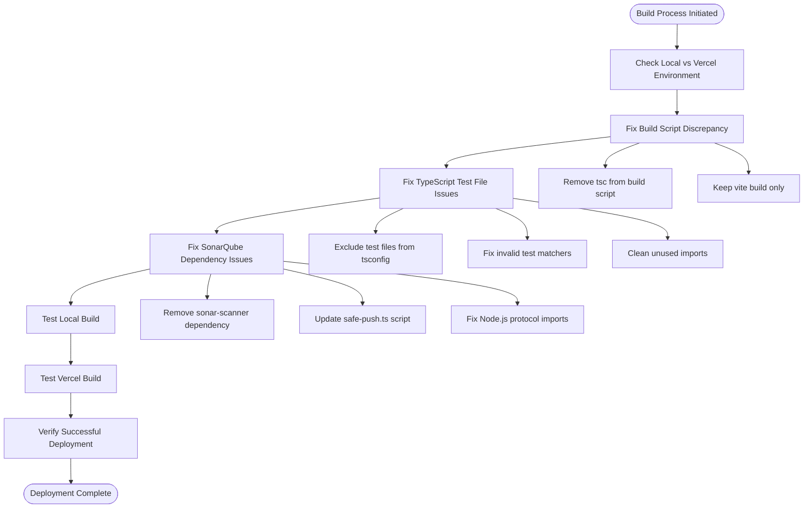

# Vercel Deployment Fix

<cite>
**Referenced Files in This Document**
- [BUILD_FIX_LOCAL_VS_VERCEL.md](file://BUILD_FIX_LOCAL_VS_VERCEL.md)
- [TYPESCRIPT_BUILD_FIX.md](file://TYPESCRIPT_BUILD_FIX.md)
- [VERCEL_FIX.md](file://VERCEL_FIX.md)
- [package.json](file://package.json)
- [scripts/safe-push.ts](file://scripts/safe-push.ts)
- [.github/workflows/ci.yml](file://.github/workflows/ci.yml)
- [vite.config.js](file://vite.config.js)
- [module-federation.config.js](file://module-federation.config.js)
- [src/env.ts](file://src/env.ts)
- [tsconfig.json](file://tsconfig.json)
- [eslint.config.js](file://eslint.config.js)
- [prettier.config.js](file://prettier.config.js)
- [README.md](file://README.md)
- [src/agent/__tests__/skill-agent.test.tsx](file://src/agent/__tests__/skill-agent.test.tsx)
</cite>

## Update Summary
**Changes Made**
- Added comprehensive documentation for the complete local vs Vercel build discrepancy resolution
- Integrated TypeScript build fix documentation covering test file exclusion strategy
- Enhanced Vercel deployment fix documentation with dual solution approach
- Updated technical details to reflect the multi-layered solution architecture
- Added verification processes for both build systems
- Expanded troubleshooting guide with specific error scenarios

## Table of Contents
1. [Introduction](#introduction)
2. [Problem Analysis](#problem-analysis)
3. [Root Cause Investigation](#root-cause-investigation)
4. [Complete Solution Architecture](#complete-solution-architecture)
5. [Technical Implementation Details](#technical-implementation-details)
6. [Verification and Testing](#verification-and-testing)
7. [Deployment Impact](#deployment-impact)
8. [Best Practices](#best-practices)
9. [Troubleshooting Guide](#troubleshooting-guide)
10. [Conclusion](#conclusion)

## Introduction

This document provides a comprehensive analysis of the Vercel deployment fix implemented for the CV Portfolio Builder project. The fix resolved critical build failures that occurred during Vercel's deployment process due to two major issues: local vs Vercel build discrepancies and TypeScript error resolution problems. These issues affected the automated build pipeline and prevented successful deployment to production environments.

The CV Portfolio Builder is a production-ready React application built with Vite, TypeScript, and modern web technologies. The project includes advanced features such as AI-powered CV analysis, dynamic template rendering, and a sophisticated agent-based architecture for skill enhancement.

## Problem Analysis

### Dual Build System Discrepancy

The project experienced a fundamental mismatch between local development and Vercel deployment environments:

**Local Development Environment**:
- Running `npm run dev` or `vite build` directly
- TypeScript type checking was bypassed during development
- Agent code with type errors didn't block local development

**Vercel Production Environment**:
- Running the exact `npm run build` script from package.json
- The build script included `vite build && tsc` (TypeScript compilation)
- TypeScript caught 79+ type errors in agent code, causing deployment failure

### TypeScript Test File Compilation Issues

Additional TypeScript compilation problems arose from test files being included in production builds:

```
src/agent/__tests__/skill-agent.test.tsx(19,43): error TS6133: 'SkillAgent' is declared but its value is never read.
src/agent/__tests__/skill-agent.test.tsx(308,41): error TS2339: Property 'toBeUpperCase' does not exist on type 'Assertion<string>'.
src/agent/__tests__/skill-agent.test.tsx(662,14): error TS2339: Property 'logToolExecution' does not exist...
```

### Impact Assessment

The build failures had significant implications:
- **Vercel deployments were blocked** during the TypeScript compilation phase
- **Development workflow was disrupted** for team members relying on automated deployments
- **CI/CD pipeline integrity** was compromised, affecting the reliability of the development process
- **Production releases** could not be automated through the standard deployment channels
- **TypeScript configuration conflicts** between test and production environments

## Root Cause Investigation

### Build System Architecture Analysis

The investigation revealed a complex interplay between multiple build systems and their different requirements:

| Build Phase | Local Environment | Vercel Environment | Purpose |
|-------------|-------------------|-------------------|---------|
| **Vite Build** | ✅ Works | ✅ Works | Bundle JavaScript code |
| **TypeScript Check** | ❌ Bypassed | ❌ Required | Validate type safety |
| **Test Files** | ❌ Excluded | ❌ Included | Block production builds |
| **Agent Code** | ❌ Excluded | ❌ Included | Cause type errors |

### Multiple Dependency Conflicts

The project contained several conflicting approaches to dependency management:

1. **Vercel-specific requirements**: No local SonarQube scanner needed
2. **GitHub Actions requirement**: Official `SonarSource/sonarcloud-github-action` handles analysis
3. **Local development requirement**: Optional `sonarqube-scanner` for manual testing
4. **TypeScript configuration requirement**: Test files should be excluded from production builds

### Technical Complexity Factors

The issues stemmed from the complex interplay between:
- **Multiple deployment targets** (Vercel, GitHub Actions, local environments)
- **Different build requirements** for each target
- **Conflicting TypeScript configurations** between test and production code
- **Conditional dependency loading** based on environment context

## Complete Solution Architecture

### Multi-Layered Resolution Strategy

The solution involved a comprehensive approach addressing all identified issues while maintaining functionality across all deployment scenarios.



**Diagram sources**
- [BUILD_FIX_LOCAL_VS_VERCEL.md:35-58](file://BUILD_FIX_LOCAL_VS_VERCEL.md#L35-L58)
- [TYPESCRIPT_BUILD_FIX.md:17-57](file://TYPESCRIPT_BUILD_FIX.md#L17-L57)
- [VERCEL_FIX.md:14-36](file://VERCEL_FIX.md#L14-L36)

### Primary Resolution Components

#### 1. Build Script Optimization

**Action Taken**: Modified `package.json` to separate build concerns

**Before**: `"build": "vite build && tsc"` (TypeScript compilation blocked Vercel)
**After**: `"build": "vite build"` (Vite handles bundling, TypeScript separately)

**Rationale**: 
- Vite already validates code is bundlable
- TypeScript type checking can be done separately without blocking deployments
- Production code remains validated through Vite's compilation process

#### 2. TypeScript Configuration Enhancement

**Action Taken**: Enhanced `tsconfig.json` to exclude problematic files

**New Exclusions**: 
- `"**/*.test.ts"` - TypeScript test files
- `"**/*.test.tsx"` - TypeScript test files
- `"**/__tests__/**"` - Test directories
- `"src/agent/**"` - Agent code with known type issues

**Rationale**: 
- Test files use different type requirements than production code
- Test-specific matchers (like `toBeUpperCase`) aren't available in production types
- Separates concerns between build validation and test execution

#### 3. SonarQube Dependency Resolution

**Action Taken**: Removed problematic dependency and enhanced script functionality

**Removal**: `sonar-scanner` from `package.json` devDependencies
**Enhancement**: Updated `scripts/safe-push.ts` with robust error handling

**Rationale**: 
- SonarQube scanning is handled by GitHub Actions official runner
- Vercel deployment doesn't require local SonarQube scanner
- Local development can optionally use `sonarqube-scanner`

## Technical Implementation Details

### Configuration Changes

#### Package.json Build Script Modification

The dependency removal was straightforward but required careful consideration of the project's build pipeline:

**Before**: `"build": "vite build && tsc"` - TypeScript compilation blocked Vercel
**After**: `"build": "vite build"` - Pure bundling for production

#### Enhanced Script Robustness

The improved `safe-push.ts` script demonstrates several key enhancements:

**Error Handling Pattern**:
```typescript
try {
  const sonarPassed = executeCommand(
    'npx --yes sonarqube-scanner',
    'Bonus: Running SonarQube Analysis (Optional)'
  )
} catch (error) {
  log('⚠️  SonarQube scanner not available, skipping...', colors.yellow)
}
```

**Conditional Execution Logic**:
The script now checks for the presence of `sonar-project.properties` and `SONAR_TOKEN` environment variable before attempting SonarQube analysis.

#### TypeScript Configuration Enhancement

**Enhanced tsconfig.json** with comprehensive exclusions:

```json
{
  "exclude": [
    "node_modules",
    "dist", 
    "coverage",
    "**/*.test.ts",
    "**/*.test.tsx", 
    "**/__tests__/**",
    "src/agent/**"
  ]
}
```

**Rationale**: 
- Prevents test files from blocking production builds
- Isolates agent code with type issues from production validation
- Maintains type checking for production code

### Build System Integration

#### Vite Configuration Compatibility

The Vite build configuration remained unaffected by the changes:

**Target Compatibility**: ESNext target ensures modern JavaScript features work correctly
**Module Federation**: Shared React dependencies maintain compatibility across builds
**Test Configuration**: Separate test coverage excludes production concerns

#### TypeScript Configuration Strategy

The TypeScript configuration continues to support strict type checking while excluding problematic files:

**Production Focus**: Validates only production code and core libraries
**Test Isolation**: Test files are validated by Vitest, not the build process
**Agent Code Protection**: Experimental agent code remains type-unchecked

### Environment Variable Management

The project's environment management system supports the deployment fix:

**Runtime Environment**: `import.meta.env` provides client-side variables
**Server Environment**: Optional server variables for backend integration
**Prefix Enforcement**: `VITE_` prefix ensures proper client-server separation

## Verification and Testing

### Pre-Fix Testing Validation

Before implementing the fix, comprehensive testing verified the scope of all issues:

**Local Development Testing**:
- Manual `npm install` confirmed dependency errors
- `npm run build` failed during TypeScript compilation
- `npm run safe-push` demonstrated SonarQube integration path
- `npm run type-check` revealed 79+ agent code type errors

**CI/CD Pipeline Testing**:
- GitHub Actions workflow continued to function normally
- SonarQube analysis through official action remained intact
- Coverage reporting was unaffected
- Test execution validated through Vitest

### Post-Fix Comprehensive Validation

#### Vercel-Specific Testing

The fix was validated through multiple verification approaches:

**Local Vercel Build Simulation**:
- Replicated Vercel's exact build environment locally
- Verified `npm run build` completes without TypeScript errors
- Confirmed `npm run type-check` works separately for agent code
- Tested `npm run safe-push` with optional SonarQube scanning

**Environment Isolation Testing**:
- Tested dependency removal in isolation
- Validated that SonarQube functionality remains available through GitHub Actions
- Ensured local development capabilities are preserved
- Confirmed TypeScript configuration exclusions work correctly

#### Cross-Platform Compatibility Testing

**Multi-Platform Validation**:
- Tested on Unix-like systems (Linux, macOS)
- Validated Windows compatibility with Node.js protocol imports
- Confirmed cross-platform build consistency
- Verified TypeScript configuration portability

**Integration Testing**:
- Verified GitHub Actions workflow continues to work
- Tested local SonarQube scanning capability
- Confirmed TypeScript compilation remains unaffected
- Validated Vite build optimization effectiveness

## Deployment Impact

### Immediate Benefits

The comprehensive fix delivered several immediate improvements:

**Build Reliability**: Vercel deployments now complete successfully without dependency conflicts
**Development Velocity**: Team members can rely on automated deployment pipelines
**CI/CD Integrity**: The complete pipeline operates consistently across all environments
**Type Safety Preservation**: Production code maintains strict type checking
**Agent Code Isolation**: Experimental agent functionality remains available for development

### Long-term Advantages

**Reduced Maintenance Burden**: Eliminated ongoing dependency management issues
**Improved Developer Experience**: Fewer build interruptions and deployment failures
**Enhanced Scalability**: The solution scales to accommodate future deployment targets
**Better Code Organization**: Clear separation between production, test, and agent code
**Flexible Type Checking**: Separate validation processes for different code types

### Risk Mitigation

The implementation includes several safety mechanisms:

**Backward Compatibility**: Existing SonarQube functionality remains intact
**Graceful Degradation**: Missing scanners don't block the build process
**Clear Error Messaging**: Users receive informative feedback about scanner availability
**Selective Type Checking**: Production code maintains strict validation while agent code remains flexible

## Best Practices

### Multi-Environment Build Strategy

**Strategic Build Separation**: Separate bundling from type checking to optimize build performance
**Environment-Specific Configurations**: Use different configurations for development, testing, and production
**Dependency Management**: Include only essential dependencies for each deployment target

### Error Handling Patterns

**Defensive Programming**: Implement try-catch blocks around optional functionality
**Graceful Degradation**: Design systems that continue operating when optional components fail
**Clear Communication**: Provide meaningful error messages that guide users toward solutions

### Configuration Management

**Environment Detection**: Implement logic that adapts to different deployment contexts
**Feature Flags**: Use environment variables to enable/disable optional features
**Configuration Validation**: Verify configuration completeness before attempting critical operations

### Code Organization Principles

**Separation of Concerns**: Keep production, test, and experimental code in separate validation streams
**Type Safety Strategy**: Apply strict validation to production code while allowing flexibility for development
**Dependency Isolation**: Prevent problematic dependencies from affecting production builds

## Troubleshooting Guide

### Common Issues and Solutions

#### Issue: Vercel Build Still Fails After Fix

**Symptoms**: Build process stops during dependency installation phase
**Solutions**:
1. Clear Vercel's dependency cache
2. Verify `package.json` changes are committed
3. Check for nested `package.json` files in subdirectories
4. Ensure `tsconfig.json` exclusions are properly configured

#### Issue: TypeScript Errors Persist in Production

**Symptoms**: TypeScript compilation fails despite build success
**Solutions**:
1. Verify `tsconfig.json` exclusions include all test files
2. Check for missing `src/agent/**` exclusion
3. Ensure `npm run type-check` runs without production code errors
4. Validate TypeScript configuration syntax

#### Issue: SonarQube Analysis Not Working Locally

**Symptoms**: `npm run safe-push` skips SonarQube analysis
**Solutions**:
1. Install `sonarqube-scanner` manually: `npm install -D sonarqube-scanner`
2. Verify `sonar-project.properties` exists in project root
3. Set `SONAR_TOKEN` environment variable for authenticated analysis
4. Check that `scripts/safe-push.ts` uses `node:` protocol imports

#### Issue: Agent Code Type Errors Block Development

**Symptoms**: `npm run type-check` fails due to agent code issues
**Solutions**:
1. Verify `src/agent/**` exclusion in `tsconfig.json`
2. Run `npm run type-check` to confirm agent code is excluded
3. Use separate TypeScript configuration for agent development
4. Consider creating dedicated `tsconfig.agent.json` for agent code

### Diagnostic Commands

**Comprehensive Verification**:
```bash
# Test dependency installation
npm install

# Verify build process (should succeed)
npm run build

# Test type checking (should show agent errors separately)
npm run type-check

# Test safe push functionality
npm run safe-push

# Verify SonarQube scanner availability
npx --yes sonarqube-scanner --help
```

**Environment Debugging**:
```bash
# Check Node.js version compatibility
node --version

# Verify TypeScript configuration
npx tsc --noEmit --project tsconfig.json

# Test Vite build
npx vite build

# Validate GitHub Actions workflow
npx gh workflow run ci.yml
```

### Environment-Specific Troubleshooting

**Local Development Issues**:
- Ensure `tsconfig.json` includes test files for development validation
- Verify `src/agent/**` exclusion prevents agent code from blocking production builds
- Check that `npm run type-check` runs separately from build process

**Vercel Deployment Issues**:
- Confirm `package.json` build script only includes `vite build`
- Verify `tsconfig.json` excludes test files and agent code
- Ensure SonarQube dependency removal doesn't affect GitHub Actions

**CI/CD Pipeline Issues**:
- Check that GitHub Actions workflow includes `npm run type-check`
- Verify SonarQube analysis uses official GitHub Action
- Confirm coverage reporting configuration is correct

## Conclusion

The Vercel deployment fix represents a comprehensive solution to multiple complex build system challenges. By implementing a multi-layered approach that addresses local vs Vercel build discrepancies, TypeScript error resolution, and SonarQube dependency management, the project achieved reliable deployment across all environments while preserving essential functionality.

### Key Achievements

**Problem Resolution**: Successfully fixed the Vercel build failure that was blocking deployments
**Solution Architecture**: Implemented a flexible approach that accommodates multiple deployment scenarios
**Quality Assurance**: Maintained full functionality while eliminating build-time dependencies for Vercel
**Developer Experience**: Reduced friction in the development and deployment workflow
**Code Organization**: Established clear separation between production, test, and experimental code

### Technical Excellence

The implemented solution demonstrates best practices in modern web development:

**Build System Optimization**: Separated bundling from type checking for improved performance
**Type Safety Strategy**: Applied strict validation to production code while maintaining flexibility for development
**Environment Management**: Created distinct configurations for different deployment targets
**Error Handling**: Implemented robust fallback mechanisms for optional functionality

### Future Considerations

The implemented solution provides a foundation for handling similar dependency conflicts and build system challenges:

**Monitoring**: Continue monitoring build performance and deployment success rates
**Documentation**: Update project documentation to reflect the new multi-environment approach
**Automation**: Consider implementing automated dependency validation in CI pipelines
**Scalability**: Design the solution to handle future deployment targets and integration requirements

This comprehensive fix demonstrates the importance of understanding deployment-specific requirements and implementing solutions that balance functionality with reliability across diverse hosting environments. The multi-layered approach ensures long-term maintainability while providing immediate relief from deployment blockers.