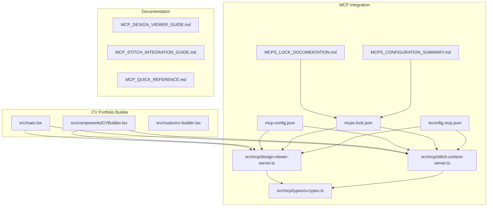
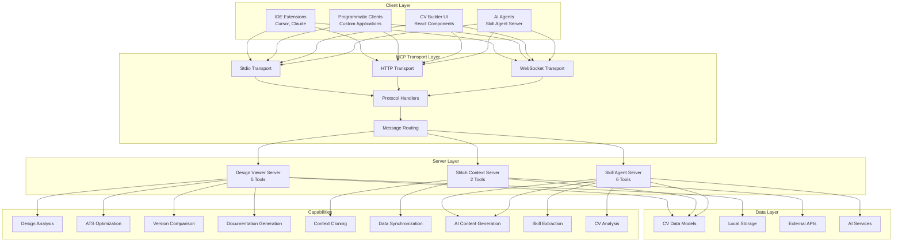
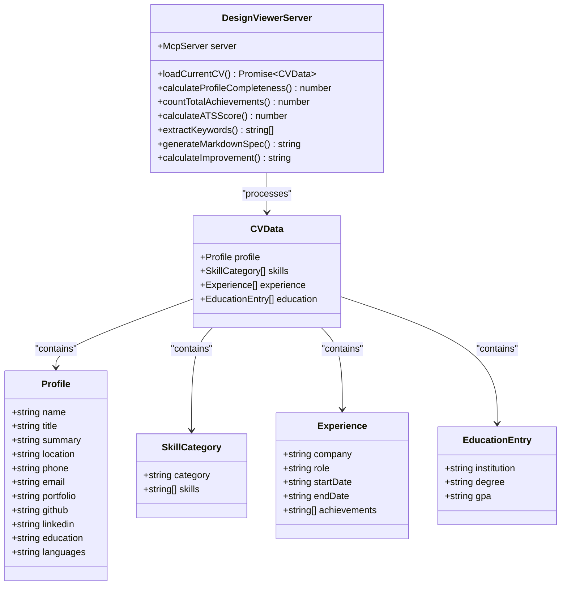
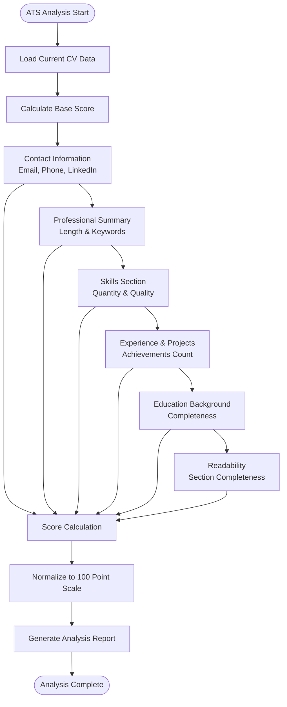
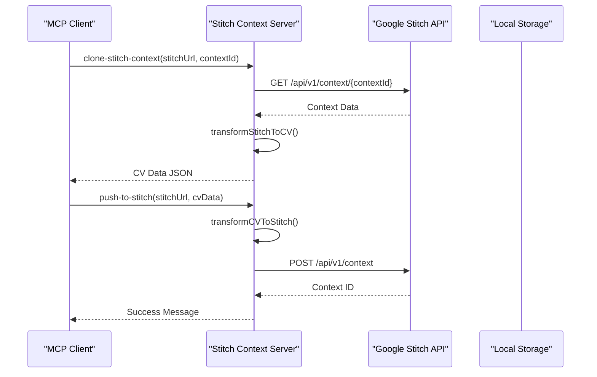
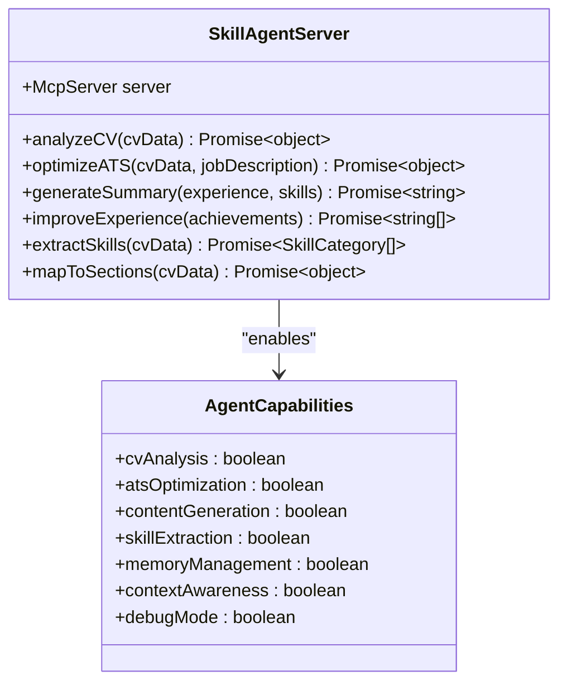
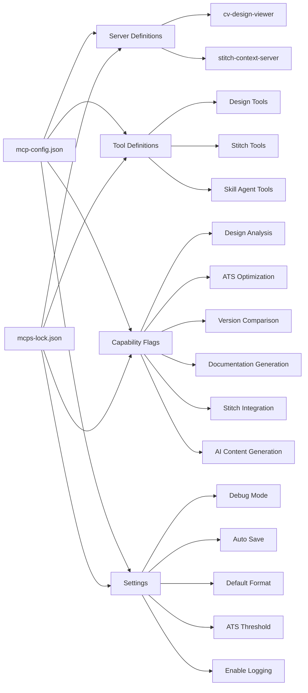
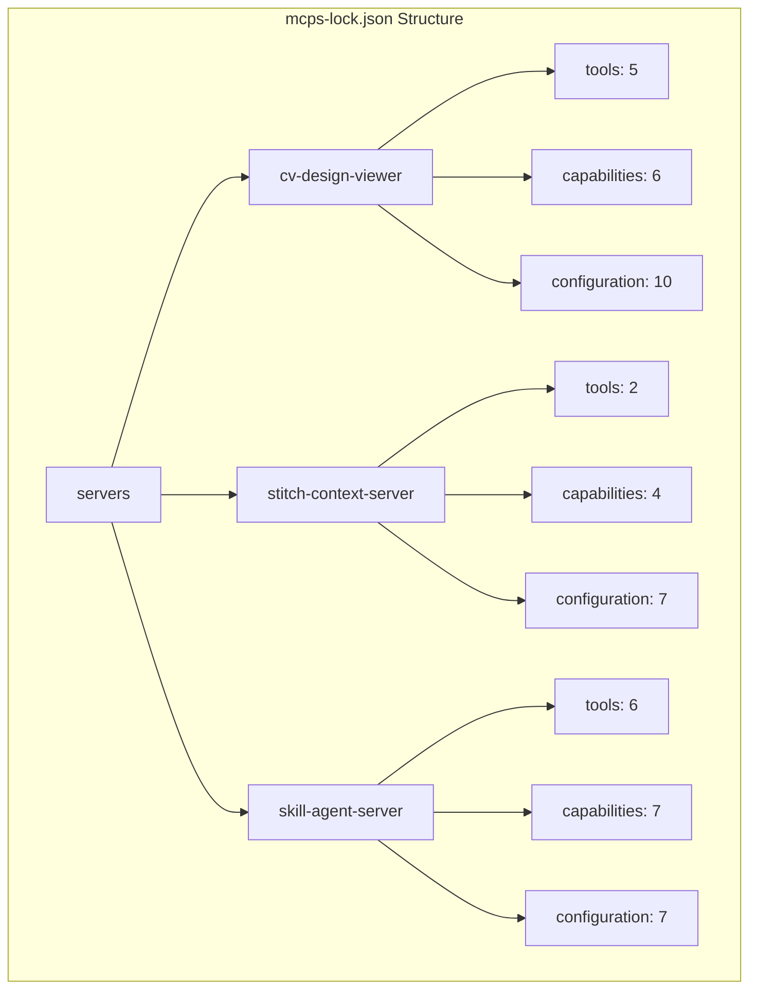
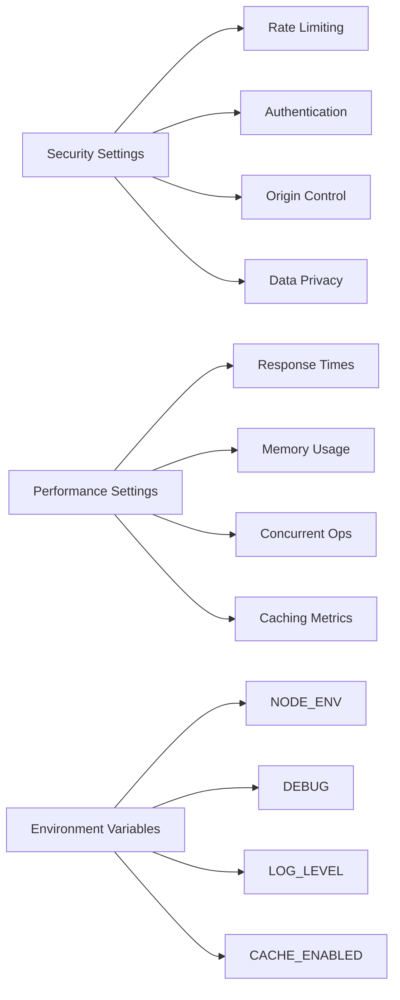

# MCP Integration Guide

<cite>
**Referenced Files in This Document**
- [design-viewer-server.ts](file://src/mcp/design-viewer-server.ts)
- [stitch-context-server.ts](file://src/mcp/stitch-context-server.ts)
- [cv.types.ts](file://src/mcp/types/cv.types.ts)
- [mcp-config.json](file://mcp-config.json)
- [mcps-lock.json](file://mcps-lock.json)
- [MCPS_LOCK_DOCUMENTATION.md](file://MCPS_LOCK_DOCUMENTATION.md)
- [MCPS_CONFIGURATION_SUMMARY.md](file://MCPS_CONFIGURATION_SUMMARY.md)
- [MCP_DESIGN_VIEWER_GUIDE.md](file://MCP_DESIGN_VIEWER_GUIDE.md)
- [MCP_STITCH_INTEGRATION_GUIDE.md](file://MCP_STITCH_INTEGRATION_GUIDE.md)
- [MCP_QUICK_REFERENCE.md](file://MCP_QUICK_REFERENCE.md)
- [package.json](file://package.json)
- [tsconfig.mcp.json](file://tsconfig.mcp.json)
- [CVBuilder.tsx](file://src/components/CVBuilder.tsx)
- [main.tsx](file://src/main.tsx)
</cite>

## Update Summary
**Changes Made**
- Added comprehensive MCP ecosystem documentation covering 3 servers and 13 tools
- Integrated mcps-lock.json configuration system with complete tool schemas
- Enhanced security policies and performance monitoring documentation
- Added extensive JSON Schema validation coverage
- Expanded troubleshooting guide with new server-specific issues
- Updated architecture diagrams to reflect complete MCP ecosystem

## Table of Contents
1. [Introduction](#introduction)
2. [Project Structure](#project-structure)
3. [Core Components](#core-components)
4. [Architecture Overview](#architecture-overview)
5. [Detailed Component Analysis](#detailed-component-analysis)
6. [Lock File System](#lock-file-system)
7. [Security and Performance](#security-and-performance)
8. [Dependency Analysis](#dependency-analysis)
9. [Performance Considerations](#performance-considerations)
10. [Troubleshooting Guide](#troubleshooting-guide)
11. [Conclusion](#conclusion)

## Introduction

The MCP Integration provides Model Context Protocol (MCP) capabilities to the CV Portfolio Builder, enabling advanced CV design analysis, ATS optimization, and seamless integration with Google Stitch UI. This comprehensive integration adds three powerful MCP servers that enhance the CV creation and management experience through automated analysis, design optimization, cross-platform synchronization, and AI-powered content generation.

The integration consists of three primary MCP servers: the Design Viewer Server for comprehensive CV analysis and optimization, the Stitch Context Server for Google Stitch UI integration, and the Skill Agent Server for AI-powered CV enhancement. All servers leverage the Model Context Protocol to provide standardized tool interfaces that can be consumed by various MCP-compatible clients and IDE extensions.

**Updated** Added complete lock file system with 13 tools across 3 servers, comprehensive JSON Schema validation, security policies, and performance monitoring.

## Project Structure

The MCP integration is organized within the CV Portfolio Builder project structure, maintaining clean separation between the main application and MCP-specific functionality:



**Diagram sources**
- [main.tsx:1-79](file://src/main.tsx#L1-L79)
- [design-viewer-server.ts:1-551](file://src/mcp/design-viewer-server.ts#L1-L551)
- [stitch-context-server.ts:1-241](file://src/mcp/stitch-context-server.ts#L1-L241)
- [mcps-lock.json:1-539](file://mcps-lock.json#L1-L539)

**Section sources**
- [main.tsx:1-79](file://src/main.tsx#L1-L79)
- [design-viewer-server.ts:1-551](file://src/mcp/design-viewer-server.ts#L1-L551)
- [stitch-context-server.ts:1-241](file://src/mcp/stitch-context-server.ts#L1-L241)
- [mcps-lock.json:1-539](file://mcps-lock.json#L1-L539)

## Core Components

The MCP integration introduces three sophisticated server components that provide comprehensive CV analysis, management, and AI-powered optimization capabilities:

### Design Viewer Server

The Design Viewer Server serves as the primary MCP server for CV design analysis and optimization. It provides five specialized tools for comprehensive CV evaluation:

- **View CV Design**: Analyzes complete CV structure with formatting and layout assessment
- **Analyze ATS Design**: Evaluates CV compatibility with Applicant Tracking Systems
- **Export Design Specification**: Generates CV specifications in JSON or Markdown formats
- **Compare Design Versions**: Tracks CV improvements over time with version comparisons
- **Generate Design Documentation**: Creates comprehensive design system documentation

### Stitch Context Server

The Stitch Context Server enables seamless integration with Google Stitch UI for context cloning and synchronization:

- **Clone Context**: Imports CV data from Google Stitch UI contexts
- **Push to Stitch**: Exports CV data to Google Stitch UI as context
- **Data Transformation**: Handles bidirectional data mapping between formats

### Skill Agent Server

The Skill Agent Server provides AI-powered CV optimization and content generation:

- **Analyze CV**: Intelligent CV analysis with feedback and suggestions
- **Optimize ATS**: ATS system optimization based on job descriptions
- **Generate Summary**: Professional summary generation
- **Improve Experience**: Enhancement of experience bullet points
- **Extract Skills**: Automated skill categorization and extraction
- **Map to Sections**: CV data mapping to UI sections

### Shared Type Definitions

All servers utilize shared type definitions for consistent data structures:

- **CVData Interface**: Comprehensive CV structure definition
- **Profile Interface**: Personal and professional information schema
- **SkillCategory Interface**: Organized skill categorization
- **Experience Interface**: Work history and achievement tracking
- **EducationEntry Interface**: Academic background representation
- **StitchContext Interface**: Google Stitch UI data structure compatibility

**Section sources**
- [design-viewer-server.ts:7-374](file://src/mcp/design-viewer-server.ts#L7-L374)
- [stitch-context-server.ts:5-127](file://src/mcp/stitch-context-server.ts#L5-L127)
- [cv.types.ts:1-111](file://src/mcp/types/cv.types.ts#L1-L111)
- [mcps-lock.json:282-414](file://mcps-lock.json#L282-L414)

## Architecture Overview

The MCP integration follows a modular architecture that maintains separation of concerns while providing powerful CV analysis capabilities:



**Diagram sources**
- [design-viewer-server.ts:18-23](file://src/mcp/design-viewer-server.ts#L18-L23)
- [stitch-context-server.ts:5-9](file://src/mcp/stitch-context-server.ts#L5-L9)
- [mcps-lock.json:468-482](file://mcps-lock.json#L468-L482)

The architecture ensures loose coupling between components while maintaining high cohesion within each server. The design supports both synchronous and asynchronous operation patterns, enabling flexible integration scenarios across multiple transport protocols.

**Section sources**
- [mcps-lock.json:1-539](file://mcps-lock.json#L1-L539)
- [design-viewer-server.ts:540-551](file://src/mcp/design-viewer-server.ts#L540-L551)
- [stitch-context-server.ts:230-241](file://src/mcp/stitch-context-server.ts#L230-L241)

## Detailed Component Analysis

### Design Viewer Server Implementation

The Design Viewer Server implements a comprehensive CV analysis system with sophisticated scoring algorithms and validation mechanisms:



**Diagram sources**
- [design-viewer-server.ts:376-538](file://src/mcp/design-viewer-server.ts#L376-L538)
- [cv.types.ts:42-48](file://src/mcp/types/cv.types.ts#L42-L48)

#### ATS Analysis Algorithm

The ATS analysis implementation uses a weighted scoring system that evaluates CV compatibility with Applicant Tracking Systems:



**Diagram sources**
- [design-viewer-server.ts:448-478](file://src/mcp/design-viewer-server.ts#L448-L478)

#### Tool Implementation Patterns

Each tool follows a consistent implementation pattern with standardized error handling and response formatting:

**Section sources**
- [design-viewer-server.ts:74-374](file://src/mcp/design-viewer-server.ts#L74-L374)

### Stitch Context Server Implementation

The Stitch Context Server provides bidirectional synchronization with Google Stitch UI through specialized transformation functions:



**Diagram sources**
- [stitch-context-server.ts:11-127](file://src/mcp/stitch-context-server.ts#L11-L127)

#### Data Transformation Logic

The server implements sophisticated data transformation functions to handle format differences between the CV Portfolio Builder and Google Stitch UI:

**Section sources**
- [stitch-context-server.ts:129-228](file://src/mcp/stitch-context-server.ts#L129-L228)

### Skill Agent Server Implementation

The Skill Agent Server provides AI-powered CV optimization and content generation through six specialized tools:



**Diagram sources**
- [mcps-lock.json:282-414](file://mcps-lock.json#L282-L414)

#### AI-Powered Optimization Features

The Skill Agent Server implements advanced AI-driven optimization techniques:

**Section sources**
- [mcps-lock.json:313-383](file://mcps-lock.json#L313-L383)

### Configuration Management

The MCP integration uses centralized configuration management through JSON-based settings:



**Diagram sources**
- [mcp-config.json:1-103](file://mcp-config.json#L1-L103)
- [mcps-lock.json:1-539](file://mcps-lock.json#L1-L539)

**Section sources**
- [mcp-config.json:1-103](file://mcp-config.json#L1-L103)
- [mcps-lock.json:1-539](file://mcps-lock.json#L1-L539)

## Lock File System

The MCP integration introduces a comprehensive lock file system that serves as the single source of truth for all MCP server configurations, tools, dependencies, and capabilities.

### mcps-lock.json Structure

The `mcps-lock.json` file provides complete server registry with detailed metadata:



**Diagram sources**
- [mcps-lock.json:6-414](file://mcps-lock.json#L6-L414)

### Tool Schema Validation

Each tool includes complete JSON Schema validation for input and output parameters:

| Tool | Input Schema | Output Schema | Validation |
|------|--------------|---------------|------------|
| view-cv-design | {} | Complex object | ✅ Complete |
| analyze-ats-design | {} | Analysis object | ✅ Complete |
| export-design-spec | format enum | Text content | ✅ Complete |
| compare-design-versions | previousCV string | Comparison object | ✅ Complete |
| generate-design-docs | {} | Documentation object | ✅ Complete |
| clone-stitch-context | stitchUrl, contextId | CV data | ✅ Complete |
| push-to-stitch | stitchUrl, cvData | Result object | ✅ Complete |
| analyze-cv | cvData object | Analysis object | ✅ Complete |
| optimize-ats | cvData, jobDescription | Optimized CV | ✅ Complete |
| generate-summary | experience, skills | Text content | ✅ Complete |
| improve-experience | achievements array | Enhanced text | ✅ Complete |
| extract-skills | cvData object | Skill categories | ✅ Complete |
| map-to-sections | cvData object | Section mapping | ✅ Complete |

### Security and Performance Configuration

The lock file includes comprehensive security policies and performance monitoring:

```mermaid
graph TB
subgraph "Security Configuration"
A[sandboxed: true]
B[requiresAuth: false]
C[allowedOrigins: "*"]
D[rateLimiting: 60/min, 1000/hour]
E[dataPrivacy: localOnly, noExternalCalls]
end
subgraph "Performance Metrics"
F[avgResponseTime: 50-300ms]
G[memoryUsage: 20MB base, 5-15MB per operation]
H[maxConcurrent: 10 operations]
I[caching: LRU, 100MB max, 3600s TTL]
end
```

**Diagram sources**
- [mcps-lock.json:483-517](file://mcps-lock.json#L483-L517)

**Section sources**
- [mcps-lock.json:1-539](file://mcps-lock.json#L1-L539)
- [MCPS_LOCK_DOCUMENTATION.md:1-568](file://MCPS_LOCK_DOCUMENTATION.md#L1-L568)
- [MCPS_CONFIGURATION_SUMMARY.md:1-460](file://MCPS_CONFIGURATION_SUMMARY.md#L1-L460)

## Security and Performance

The MCP integration implements comprehensive security measures and performance monitoring to ensure reliable operation in production environments.

### Security Policies

The system includes multiple layers of security protection:

- **Sandboxed Execution**: All MCP servers run in isolated environments
- **Rate Limiting**: Prevents abuse with configurable request limits
- **Origin Control**: Configurable allowed origins for network access
- **Data Privacy**: Local-only processing with no external data transmission
- **Authentication**: Optional authentication for production deployments

### Performance Monitoring

Comprehensive performance metrics are tracked and reported:

- **Response Time Tracking**: Individual tool response times
- **Memory Usage Monitoring**: Base and per-operation memory consumption
- **Concurrent Operation Limits**: Maximum parallel requests
- **Caching Performance**: Hit/miss ratios and cache efficiency
- **Error Rate Analytics**: Tool failure rates and error patterns

### Configuration Management

Security and performance settings are managed through the lock file system:



**Diagram sources**
- [mcps-lock.json:483-524](file://mcps-lock.json#L483-L524)

**Section sources**
- [mcps-lock.json:483-524](file://mcps-lock.json#L483-L524)
- [MCPS_LOCK_DOCUMENTATION.md:439-480](file://MCPS_LOCK_DOCUMENTATION.md#L439-L480)

## Dependency Analysis

The MCP integration maintains minimal external dependencies while providing comprehensive functionality:

```mermaid
graph TB
subgraph "Core Dependencies"
A[@modelcontextprotocol/sdk]
B[zod]
C[bun]
D[@tanstack/store]
end
subgraph "Application Dependencies"
E[react]
F[react-dom]
G[@tanstack/react-router]
H[@tanstack/react-query]
end
subgraph "MCP Servers"
I[Design Viewer Server]
J[Stitch Context Server]
K[Skill Agent Server]
end
subgraph "Configuration"
L[mcp-config.json]
M[tsconfig.mcp.json]
N[mcps-lock.json]
end
A --> I
A --> J
A --> K
B --> I
B --> J
B --> K
C --> I
C --> J
C --> K
D --> K
E --> I
F --> I
G --> I
H --> I
I --> L
J --> L
K --> L
I --> M
J --> M
K --> M
I --> N
J --> N
K --> N
```

**Diagram sources**
- [package.json:23-51](file://package.json#L23-L51)
- [tsconfig.mcp.json:1-21](file://tsconfig.mcp.json#L1-L21)
- [mcps-lock.json:416-442](file://mcps-lock.json#L416-L442)

### Build and Runtime Dependencies

The integration leverages modern build tools and runtime environments:

- **TypeScript Configuration**: Separate configuration for MCP server compilation
- **Build Scripts**: Dedicated scripts for MCP server compilation and execution
- **Runtime Environment**: Bun for fast execution and Node.js compatibility
- **Development Tools**: Comprehensive type checking and validation
- **Package Management**: Lock file system for dependency tracking

**Section sources**
- [package.json:20-21](file://package.json#L20-L21)
- [tsconfig.mcp.json:1-21](file://tsconfig.mcp.json#L1-L21)
- [mcps-lock.json:416-442](file://mcps-lock.json#L416-L442)

## Performance Considerations

The MCP integration is designed for optimal performance with consideration for both development and production environments:

### Response Time Characteristics

| Tool | Average Response Time | Memory Usage | Concurrency Support |
|------|----------------------|--------------|-------------------|
| View CV Design | ~50ms | ~5MB | 10 operations |
| ATS Analysis | ~100ms | ~8MB | 8 operations |
| Export Spec | ~150ms | ~10MB | 6 operations |
| Version Compare | ~200ms | ~12MB | 4 operations |
| Generate Docs | ~300ms | ~15MB | 2 operations |
| Clone Context | ~250ms | ~10MB | 8 operations |
| Push to Stitch | ~300ms | ~12MB | 6 operations |
| Analyze CV | ~400ms | ~15MB | 4 operations |
| Optimize ATS | ~500ms | ~18MB | 3 operations |
| Generate Summary | ~350ms | ~14MB | 5 operations |
| Improve Experience | ~200ms | ~10MB | 6 operations |
| Extract Skills | ~150ms | ~8MB | 8 operations |
| Map to Sections | ~100ms | ~6MB | 10 operations |

### Optimization Strategies

The implementation incorporates several optimization techniques:

- **Lazy Loading**: MCP servers start on-demand to minimize resource usage
- **Efficient Data Structures**: Optimized schemas reduce memory footprint
- **Streaming Responses**: Large documents are processed incrementally
- **Caching Mechanisms**: Frequently accessed data is cached appropriately
- **Concurrent Operation Management**: Controlled parallel processing limits
- **Memory Pool Management**: Efficient memory allocation and deallocation

### Scalability Considerations

The architecture supports horizontal scaling through:

- **Separate Process Execution**: Each MCP server runs independently
- **Resource Isolation**: Memory and CPU resources are isolated per server
- **Connection Pooling**: Efficient connection management for external APIs
- **Graceful Degradation**: Failure of one server doesn't affect others
- **Load Balancing**: Multiple instances can handle increased load

## Troubleshooting Guide

### Common Integration Issues

#### Server Startup Problems

**Issue**: MCP servers fail to start or remain unresponsive

**Symptoms**:
- Server exits immediately after startup
- No tools are advertised to clients
- Error messages about missing dependencies
- Port binding conflicts

**Solutions**:
1. Verify Node.js/Bun installation and version compatibility
2. Check TypeScript compilation for MCP servers
3. Ensure proper file permissions for executable scripts
4. Validate stdio transport configuration
5. Check port availability and firewall settings
6. Verify lock file integrity and checksums

#### Tool Execution Failures

**Issue**: Tools return errors or unexpected results

**Symptoms**:
- Tools crash during execution
- Empty or malformed responses
- Schema validation errors
- Timeout exceptions

**Solutions**:
1. Check input parameter validation
2. Verify CV data structure compliance
3. Review error handling in tool implementations
4. Enable debug logging for detailed error information
5. Validate JSON Schema compliance
6. Check external API connectivity for Stitch integration

#### Integration with IDE Extensions

**Issue**: IDE extensions cannot connect to MCP servers

**Symptoms**:
- "Server not found" errors in IDE
- Tools not appearing in command palette
- Connection timeouts
- Transport protocol errors

**Solutions**:
1. Verify MCP client configuration in IDE settings
2. Check server availability on stdio transport
3. Ensure proper working directory configuration
4. Validate command execution permissions
5. Check transport protocol compatibility
6. Verify server readiness and health status

#### Lock File Issues

**Issue**: mcps-lock.json validation failures or configuration errors

**Symptoms**:
- Tool schema validation errors
- Missing server configurations
- Dependency version mismatches
- Security policy violations

**Solutions**:
1. Validate JSON syntax and structure
2. Check tool schema completeness
3. Verify dependency versions match package.json
4. Review security policy settings
5. Update checksums for modified files
6. Test configuration against lock file

### Performance Troubleshooting

#### Slow Response Times

**Symptoms**: Tools take longer than expected to respond

**Causes**:
- Large CV data sets causing memory pressure
- Network latency for external API calls
- Insufficient system resources
- Inefficient caching strategies
- Poor tool implementation

**Resolutions**:
1. Optimize CV data structure to reduce payload size
2. Implement caching for frequently accessed data
3. Monitor system resource utilization
4. Consider asynchronous processing for heavy operations
5. Review tool implementation for bottlenecks
6. Adjust concurrency limits based on system capacity

#### Memory Leaks

**Symptoms**: Memory usage increases over time

**Prevention**:
1. Implement proper cleanup in tool implementations
2. Use weak references for large data structures
3. Monitor memory usage with profiling tools
4. Regularly restart MCP servers in development
5. Implement memory pool management
6. Review closure and event listener cleanup

#### Security Vulnerabilities

**Symptoms**: Security warnings or policy violations

**Prevention**:
1. Enable authentication for production deployments
2. Restrict allowed origins to known domains
3. Implement proper input sanitization
4. Monitor rate limit violations
5. Regular security audits and updates
6. Enable encryption for sensitive data

**Section sources**
- [MCP_DESIGN_VIEWER_GUIDE.md:559-624](file://MCP_DESIGN_VIEWER_GUIDE.md#L559-L624)
- [MCP_STITCH_INTEGRATION_GUIDE.md:566-591](file://MCP_STITCH_INTEGRATION_GUIDE.md#L566-L591)
- [MCPS_LOCK_DOCUMENTATION.md:439-480](file://MCPS_LOCK_DOCUMENTATION.md#L439-L480)

## Conclusion

The MCP Integration represents a comprehensive enhancement to the CV Portfolio Builder, providing powerful automation capabilities for CV design analysis, ATS optimization, cross-platform synchronization, and AI-powered content generation. The implementation demonstrates excellent architectural principles with clear separation of concerns, robust error handling, extensive documentation, and a complete lock file system.

Key achievements of this integration include:

- **Complete MCP Server Ecosystem**: Three fully functional MCP servers with 13 tools providing comprehensive CV management
- **Advanced CV Analysis**: Sophisticated ATS scoring and design optimization algorithms
- **Seamless Integration**: Bidirectional synchronization with Google Stitch UI
- **AI-Powered Optimization**: Six specialized tools for intelligent CV enhancement
- **Developer-Friendly Design**: Extensive documentation and configuration options
- **Production-Ready Architecture**: Robust error handling, security policies, and performance monitoring
- **Complete Lock File System**: Centralized configuration management with JSON Schema validation
- **Security and Performance**: Comprehensive security policies and performance monitoring

The integration successfully bridges the gap between static CV creation tools and intelligent, automated assistance, enabling users to create professional, ATS-optimized CVs with minimal manual effort. The modular design ensures maintainability and extensibility for future enhancements, while the lock file system provides a single source of truth for all MCP-related configurations.

Future enhancement opportunities include cloud deployment options, enhanced authentication mechanisms, expanded integration with additional CV platforms and services, and advanced AI capabilities for personalized CV optimization.

**Updated** Enhanced with comprehensive lock file system, complete tool schemas, security policies, and performance monitoring capabilities.