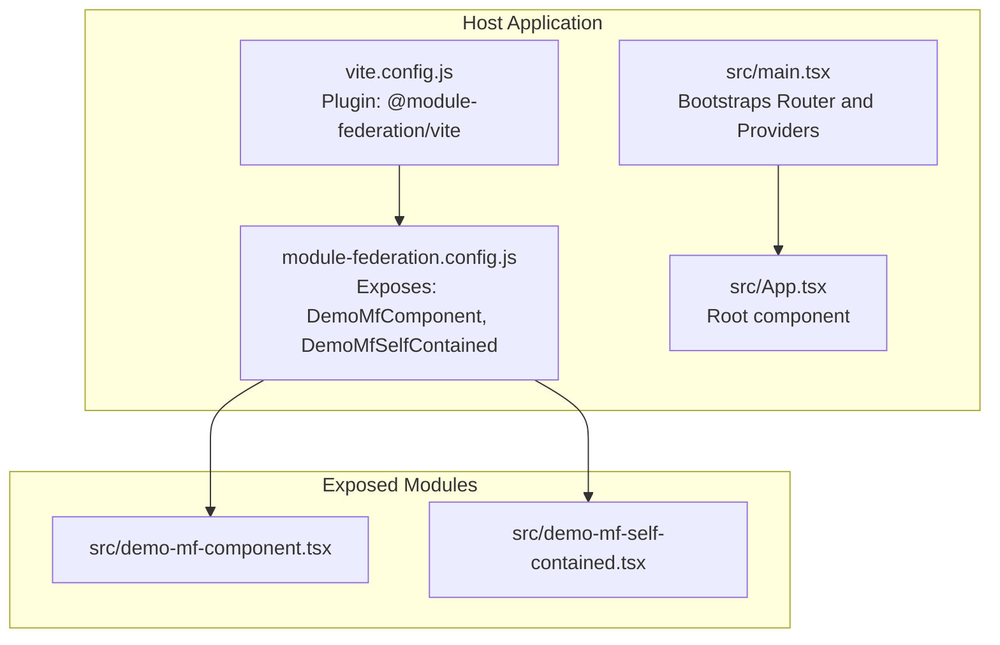
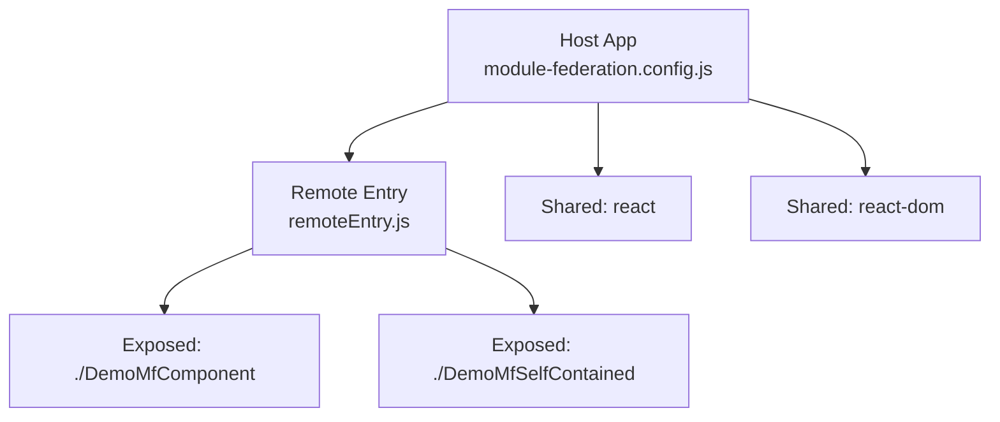
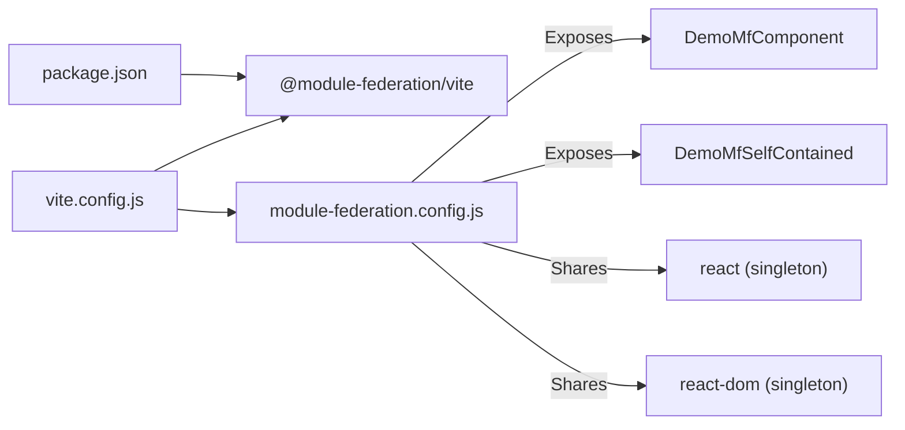
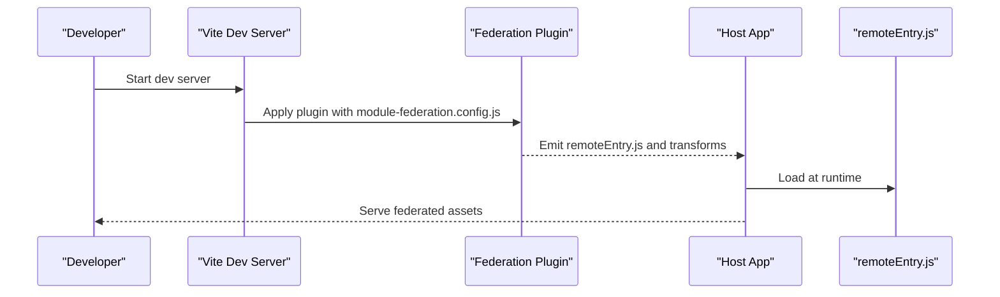

# Module Federation

<cite>
**Referenced Files in This Document**
- [module-federation.config.js](file://module-federation.config.js)
- [vite.config.js](file://vite.config.js)
- [package.json](file://package.json)
- [src/demo-mf-component.tsx](file://src/demo-mf-component.tsx)
- [src/demo-mf-self-contained.tsx](file://src/demo-mf-self-contained.tsx)
- [src/main.tsx](file://src/main.tsx)
- [src/App.tsx](file://src/App.tsx)
- [README.md](file://README.md)
</cite>

## Table of Contents
1. [Introduction](#introduction)
2. [Project Structure](#project-structure)
3. [Core Components](#core-components)
4. [Architecture Overview](#architecture-overview)
5. [Detailed Component Analysis](#detailed-component-analysis)
6. [Dependency Analysis](#dependency-analysis)
7. [Performance Considerations](#performance-considerations)
8. [Security Considerations](#security-considerations)
9. [Build and Runtime Process](#build-and-runtime-process)
10. [Practical Examples Across Federated Boundaries](#practical-examples-across-federated-boundaries)
11. [Troubleshooting Guide](#troubleshooting-guide)
12. [Conclusion](#conclusion)

## Introduction
This document explains the Module Federation setup in the CV Portfolio Builder monorepo-style project. It covers how the host application exposes internal components for potential reuse, how the build pipeline integrates with the federation plugin, and how to reason about runtime behavior. It also provides guidance on security, performance, and troubleshooting.

The project currently configures a host-like exposure of demo components and does not declare any remote federated dependencies. This makes it a good candidate to evolve into a real micro-frontend architecture by adding remote configurations and consuming external federated modules.

## Project Structure
The federation-related configuration and integration live in a small set of files:
- Host exposure configuration
- Vite plugin integration
- Demo federated components
- Application bootstrap and routing

**Diagram sources**
- [vite.config.js:1-27](file://vite.config.js#L1-L27)
- [module-federation.config.js:13-31](file://module-federation.config.js#L13-L31)
- [src/main.tsx:1-89](file://src/main.tsx#L1-L89)
- [src/App.tsx:1-8](file://src/App.tsx#L1-L8)

**Section sources**
- [vite.config.js:1-27](file://vite.config.js#L1-L27)
- [module-federation.config.js:13-31](file://module-federation.config.js#L13-L31)
- [src/main.tsx:1-89](file://src/main.tsx#L1-L89)
- [src/App.tsx:1-8](file://src/App.tsx#L1-L8)

## Core Components
- Host configuration: Defines the module name, output filename, exposed modules, and shared dependencies.
- Vite plugin integration: Applies the federation plugin with the host configuration during development and build.
- Demo federated components: Example components exported for federation consumption.

Key responsibilities:
- Expose reusable UI components from the host for potential consumption by other hosts or remotes.
- Ensure shared libraries (React and ReactDOM) are properly deduplicated at runtime.
- Provide a minimal, self-contained rendering pattern for isolated federated chunks.

**Section sources**
- [module-federation.config.js:13-31](file://module-federation.config.js#L13-L31)
- [vite.config.js:5-10](file://vite.config.js#L5-L10)
- [src/demo-mf-component.tsx:1-4](file://src/demo-mf-component.tsx#L1-L4)
- [src/demo-mf-self-contained.tsx:1-11](file://src/demo-mf-self-contained.tsx#L1-L11)

## Architecture Overview
The host application builds a remote entry with exposed modules and sets up shared dependencies. Consumers (other hosts or remotes) can consume these modules at runtime. The current configuration does not declare any remotes, so the host is effectively exposing modules for future use.

**Diagram sources**
- [module-federation.config.js:14-31](file://module-federation.config.js#L14-L31)

## Detailed Component Analysis

### Host Configuration
- Filename: remoteEntry.js
- Name: cv-portfolio-builder
- Exposed modules:
  - ./DemoMfComponent -> src/demo-mf-component.tsx
  - ./DemoMfSelfContained -> src/demo-mf-self-contained.tsx
- Remotes: none
- Shared:
  - react: singleton with requiredVersion pinned from dependencies
  - react-dom: singleton with requiredVersion pinned from dependencies

Implications:
- Consumers can import the exposed modules under the host’s module name.
- Singleton sharing ensures only one copy of React is loaded across the app graph.

**Section sources**
- [module-federation.config.js:14-31](file://module-federation.config.js#L14-L31)
- [package.json:38-39](file://package.json#L38-L39)

### Vite Plugin Integration
- Uses @module-federation/vite with the host configuration.
- Ensures modern JS target for compatibility with top-level await and modern features.

Effects:
- Injects federation runtime and code transformations during dev/build.
- Enables dynamic remote loading and shared library resolution.

**Section sources**
- [vite.config.js:5-10](file://vite.config.js#L5-L10)
- [vite.config.js:21-26](file://vite.config.js#L21-L26)

### Demo Federated Components
- DemoMfComponent: A simple functional component suitable for composition.
- DemoMfSelfContained: A self-contained renderer that expects a root element and mounts its own React root.

Usage patterns:
- Composition: Import the exposed component and render it inside a host layout.
- Self-contained: Call the exposed function with a DOM element to mount a root.

**Section sources**
- [src/demo-mf-component.tsx:1-4](file://src/demo-mf-component.tsx#L1-L4)
- [src/demo-mf-self-contained.tsx:1-11](file://src/demo-mf-self-contained.tsx#L1-L11)

### Application Bootstrap
- Routes are defined with TanStack Router.
- Providers (TanStack Query, Devtools) are attached at the root.
- The root component renders the main outlet and devtools.

This establishes a foundation for composing federated components alongside existing routes and providers.

**Section sources**
- [src/main.tsx:29-65](file://src/main.tsx#L29-L65)
- [src/App.tsx:1-8](file://src/App.tsx#L1-L8)

## Dependency Analysis
- Host depends on @module-federation/vite for build-time federation support.
- Shared dependencies react and react-dom are marked singleton and pinned to package versions.
- No declared remotes in the current configuration imply no cross-host module consumption at runtime.

**Diagram sources**
- [package.json:17-17](file://package.json#L17-L17)
- [vite.config.js:5-10](file://vite.config.js#L5-L10)
- [module-federation.config.js:16-30](file://module-federation.config.js#L16-L30)

**Section sources**
- [package.json:17-17](file://package.json#L17-L17)
- [module-federation.config.js:16-30](file://module-federation.config.js#L16-L30)

## Performance Considerations
- Singleton shared libraries reduce duplication and memory footprint.
- Keep exposed modules granular and focused to minimize payload for consumers.
- Prefer lazy loading of heavy features and avoid eager imports of exposed components unless necessary.
- Monitor chunk sizes and consider code splitting strategies in the consumer host.

[No sources needed since this section provides general guidance]

## Security Considerations
- Content Security Policy: Ensure the host’s CSP allows loading remoteEntry.js and subsequent federated chunks from trusted origins.
- Integrity checks: Consider Subresource Integrity for remote assets if distributing across networks.
- Origin verification: Validate that remote modules originate from approved sources before mounting self-contained federated roots.
- Sandboxing: When mounting self-contained federated roots, ensure isolation and controlled props to prevent unintended side effects.

[No sources needed since this section provides general guidance]

## Build and Runtime Process
- Build-time:
  - Vite applies the federation plugin with the host configuration.
  - The plugin generates the remote entry and injects runtime wiring.
- Runtime:
  - At startup, the host loads the remote entry and resolves shared dependencies.
  - Consumers can import exposed modules dynamically and render them.

**Diagram sources**
- [vite.config.js:5-10](file://vite.config.js#L5-L10)
- [module-federation.config.js:14-14](file://module-federation.config.js#L14-L14)

**Section sources**
- [vite.config.js:5-10](file://vite.config.js#L5-L10)
- [module-federation.config.js:14-14](file://module-federation.config.js#L14-L14)

## Practical Examples Across Federated Boundaries
Below are conceptual examples of how to compose federated components. Replace placeholders with actual module names and paths after building and hosting the remote entry.

- Compose a federated component inside a host route:
  - Dynamically import the exposed component and render it conditionally.
  - Pass props through the host boundary carefully to maintain type safety.

- Mount a self-contained federated root:
  - Acquire a DOM container from the host.
  - Call the exposed self-contained function with the container element.
  - Unmount gracefully when the route or component unmounts.

- Lazy loading:
  - Use dynamic imports for exposed components to defer loading until needed.
  - Combine with Suspense or loading states to improve UX.

[No sources needed since this section provides general guidance]

## Troubleshooting Guide
Common issues and remedies:
- Version mismatch for shared libraries:
  - Ensure the host and consumers align on react and react-dom versions.
  - Verify requiredVersion in the host configuration matches installed versions.

- Missing remote entry or network errors:
  - Confirm the remote entry URL is reachable and served with correct MIME type.
  - Check that the host serves the remote entry and chunks from the expected origin.

- Runtime errors about duplicate React:
  - Re-check singleton sharing and ensure only one version of React is loaded.
  - Clear caches and restart the dev server after changing shared configs.

- Self-contained federated root not rendering:
  - Verify the DOM element exists and is appended to the document.
  - Ensure the root element is empty or managed exclusively by the federated root.

- Build failures with federation plugin:
  - Confirm the plugin version is compatible with the Vite version.
  - Review Vite’s modern JS target settings for compatibility.

**Section sources**
- [module-federation.config.js:22-29](file://module-federation.config.js#L22-L29)
- [package.json:38-39](file://package.json#L38-L39)
- [vite.config.js:21-26](file://vite.config.js#L21-L26)

## Conclusion
The CV Portfolio Builder includes a ready-to-evolve Module Federation setup. The host configuration exposes demo components and shares React as a singleton. The Vite plugin integrates federation seamlessly into the build. By extending the configuration to declare remotes and consuming the host’s exposed modules, teams can adopt a micro-frontend architecture incrementally. Focus on security, performance, and robust error handling to ensure reliable federation across environments.

[No sources needed since this section summarizes without analyzing specific files]