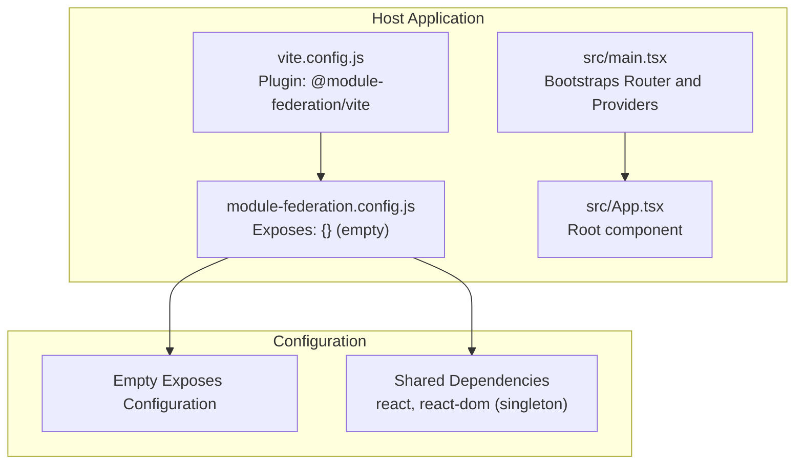
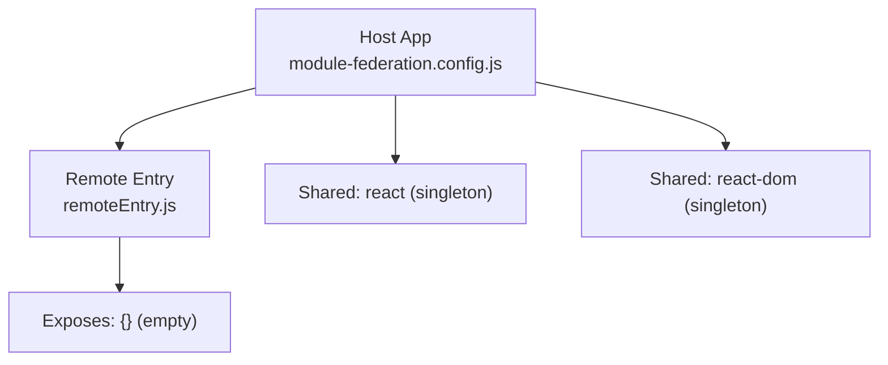
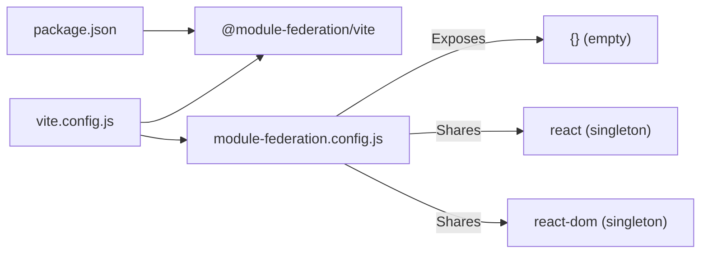
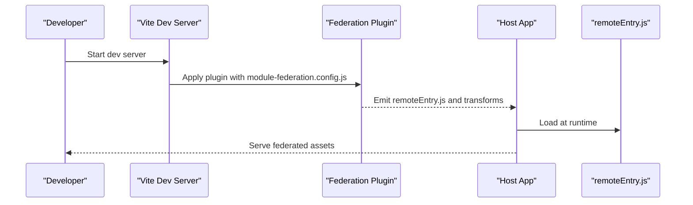

# Module Federation

<cite>
**Referenced Files in This Document**
- [module-federation.config.js](file://module-federation.config.js)
- [vite.config.js](file://vite.config.js)
- [package.json](file://package.json)
- [src/main.tsx](file://src/main.tsx)
- [src/App.tsx](file://src/App.tsx)
- [README.md](file://README.md)
</cite>

## Update Summary
**Changes Made**
- Updated host configuration section to reflect empty exposes configuration
- Removed references to demo components (DemoMfComponent, DemoMfSelfContained)
- Updated architecture overview to show current empty state
- Revised practical examples to reflect the current configuration state
- Updated troubleshooting guide to address empty exposes scenario

## Table of Contents
1. [Introduction](#introduction)
2. [Project Structure](#project-structure)
3. [Core Components](#core-components)
4. [Architecture Overview](#architecture-overview)
5. [Detailed Component Analysis](#detailed-component-analysis)
6. [Dependency Analysis](#dependency-analysis)
7. [Performance Considerations](#performance-considerations)
8. [Security Considerations](#security-considerations)
9. [Build and Runtime Process](#build-and-runtime-process)
10. [Practical Examples Across Federated Boundaries](#practical-examples-across-federated-boundaries)
11. [Troubleshooting Guide](#troubleshooting-guide)
12. [Conclusion](#conclusion)

## Introduction
This document explains the Module Federation setup in the CV Portfolio Builder monorepo-style project. The project currently configures a host application with an empty exposes configuration, preparing it for potential future micro-frontend architecture expansion. The setup includes proper shared dependency management for React and React DOM, and the Vite plugin integration for seamless development and build processes.

**Updated** The project no longer exposes demo components as they have been removed from the codebase. The current configuration serves as a foundation for future micro-frontend implementations.

## Project Structure
The federation-related configuration and integration live in a small set of files:
- Host exposure configuration (currently empty)
- Vite plugin integration
- Application bootstrap and routing

**Diagram sources**
- [vite.config.js:1-51](file://vite.config.js#L1-L51)
- [module-federation.config.js:13-28](file://module-federation.config.js#L13-L28)
- [src/main.tsx:1-79](file://src/main.tsx#L1-L79)
- [src/App.tsx:1-8](file://src/App.tsx#L1-L8)

**Section sources**
- [vite.config.js:1-51](file://vite.config.js#L1-L51)
- [module-federation.config.js:13-28](file://module-federation.config.js#L13-L28)
- [src/main.tsx:1-79](file://src/main.tsx#L1-L79)
- [src/App.tsx:1-8](file://src/App.tsx#L1-L8)

## Core Components
- Host configuration: Defines the module name, output filename, empty exposes configuration, and shared dependencies.
- Vite plugin integration: Applies the federation plugin with the host configuration during development and build.
- Empty exposes: Currently no components are exposed, serving as a foundation for future micro-frontend expansion.

Key responsibilities:
- Prepare the host application for potential micro-frontend architecture by defining shared dependencies.
- Ensure React and ReactDOM are properly deduplicated at runtime.
- Provide a clean foundation for future component exposure.

**Updated** The exposes configuration is currently empty, indicating this is a preparation phase for future micro-frontend implementation.

**Section sources**
- [module-federation.config.js:13-28](file://module-federation.config.js#L13-L28)
- [vite.config.js:5-10](file://vite.config.js#L5-L10)

## Architecture Overview
The host application is configured with an empty exposes list, preparing it for future micro-frontend expansion. The current configuration focuses on shared dependency management and basic federation setup. When ready, additional components can be exposed through the `exposes` configuration.

**Diagram sources**
- [module-federation.config.js:13-28](file://module-federation.config.js#L13-L28)

## Detailed Component Analysis

### Host Configuration
- Filename: remoteEntry.js
- Name: cv-portfolio-builder
- Exposes: {} (empty - no components currently exposed)
- Remotes: none
- Shared:
  - react: singleton with requiredVersion pinned from dependencies
  - react-dom: singleton with requiredVersion pinned from dependencies

**Updated** The exposes configuration is now empty, indicating this is a preparation state for future micro-frontend implementation.

Implications:
- No components are currently available for consumption by other hosts or remotes.
- The configuration serves as a foundation for future micro-frontend expansion.
- Singleton sharing ensures only one copy of React is loaded across the app graph when components are eventually exposed.

**Section sources**
- [module-federation.config.js:13-28](file://module-federation.config.js#L13-L28)
- [package.json:44-45](file://package.json#L44-L45)

### Vite Plugin Integration
- Uses @module-federation/vite with the host configuration.
- Ensures modern JS target for compatibility with top-level await and modern features.

Effects:
- Injects federation runtime and code transformations during dev/build.
- Enables future dynamic remote loading and shared library resolution when components are exposed.

**Section sources**
- [vite.config.js:5-10](file://vite.config.js#L5-L10)
- [vite.config.js:44-50](file://vite.config.js#L44-L50)

### Application Bootstrap
- Routes are defined with TanStack Router.
- Providers (TanStack Query, Devtools) are attached at the root.
- The root component renders the main outlet and devtools.

This establishes a foundation for composing federated components alongside existing routes and providers when micro-frontend capabilities are added.

**Section sources**
- [src/main.tsx:24-79](file://src/main.tsx#L24-L79)
- [src/App.tsx:1-8](file://src/App.tsx#L1-L8)

## Dependency Analysis
- Host depends on @module-federation/vite for build-time federation support.
- Shared dependencies react and react-dom are marked singleton and pinned to package versions.
- Empty exposes configuration indicates no cross-host module consumption at runtime.

**Diagram sources**
- [package.json:23](file://package.json#L23)
- [vite.config.js:5-10](file://vite.config.js#L5-L10)
- [module-federation.config.js:13-28](file://module-federation.config.js#L13-L28)

**Section sources**
- [package.json:23](file://package.json#L23)
- [module-federation.config.js:13-28](file://module-federation.config.js#L13-L28)

## Performance Considerations
- Singleton shared libraries reduce duplication and memory footprint when components are eventually exposed.
- Empty exposes configuration keeps the current bundle size minimal.
- Keep the exposes configuration focused and selective when adding components in the future.
- Monitor chunk sizes and consider code splitting strategies for future federated components.

## Security Considerations
- Content Security Policy: Ensure the host's CSP allows loading remoteEntry.js and subsequent federated chunks from trusted origins when components are exposed.
- Integrity checks: Consider Subresource Integrity for remote assets if distributing across networks.
- Origin verification: Validate that remote modules originate from approved sources before mounting federated components.
- Sandboxing: When mounting federated components, ensure isolation and controlled props to prevent unintended side effects.

## Build and Runtime Process
- Build-time:
  - Vite applies the federation plugin with the current host configuration.
  - The plugin generates the remote entry and injects runtime wiring.
- Runtime:
  - At startup, the host loads the remote entry and resolves shared dependencies.
  - Future components can be imported dynamically and rendered when exposed.

**Diagram sources**
- [vite.config.js:5-10](file://vite.config.js#L5-L10)
- [module-federation.config.js:13](file://module-federation.config.js#L13)

**Section sources**
- [vite.config.js:5-10](file://vite.config.js#L5-L10)
- [module-federation.config.js:13](file://module-federation.config.js#L13)

## Practical Examples Across Federated Boundaries
**Updated** With the current empty exposes configuration, these examples serve as preparation for future implementation:

- Adding exposed components:
  - Configure the `exposes` property in module-federation.config.js with component paths.
  - Define component aliases for easy consumption by other hosts.
  - Ensure proper TypeScript definitions for exposed components.

- Future composition patterns:
  - Dynamically import exposed components and render them conditionally.
  - Pass props through the host boundary carefully to maintain type safety.
  - Implement proper error boundaries for federated component loading.

- Future self-contained mounting:
  - Acquire DOM containers from the host when mounting federated components.
  - Call exposed functions with DOM elements to mount federated roots.
  - Implement graceful unmounting when routes or components change.

## Troubleshooting Guide
**Updated** Current and future troubleshooting scenarios:

- Version mismatch for shared libraries:
  - Ensure the host and consumers align on react and react-dom versions.
  - Verify requiredVersion in the host configuration matches installed versions.

- Missing remote entry or network errors:
  - Confirm the remote entry URL is reachable and served with correct MIME type.
  - Check that the host serves the remote entry and chunks from the expected origin.

- Runtime errors about duplicate React:
  - Re-check singleton sharing and ensure only one version of React is loaded.
  - Clear caches and restart the dev server after changing shared configs.

- Empty exposes configuration issues:
  - Verify that the `exposes` property is properly configured when adding components.
  - Ensure component paths in the exposes configuration match actual file locations.
  - Check that component exports are properly defined and accessible.

- Build failures with federation plugin:
  - Confirm the plugin version is compatible with the Vite version.
  - Review Vite's modern JS target settings for compatibility.

**Section sources**
- [module-federation.config.js:18-27](file://module-federation.config.js#L18-L27)
- [package.json:44-45](file://package.json#L44-L45)
- [vite.config.js:44-50](file://vite.config.js#L44-L50)

## Conclusion
The CV Portfolio Builder currently maintains a clean Module Federation foundation with an empty exposes configuration. This preparation state enables future micro-frontend architecture adoption without impacting the current production functionality. The host configuration properly manages shared dependencies, and the Vite plugin integration supports seamless development and build processes.

**Updated** The removal of demo components has simplified the codebase while preserving the federation infrastructure. When ready, teams can incrementally add exposed components to the `exposes` configuration, transforming this preparation state into a fully functional micro-frontend architecture. Focus on security, performance, and robust error handling to ensure reliable federation across environments when components are eventually exposed.