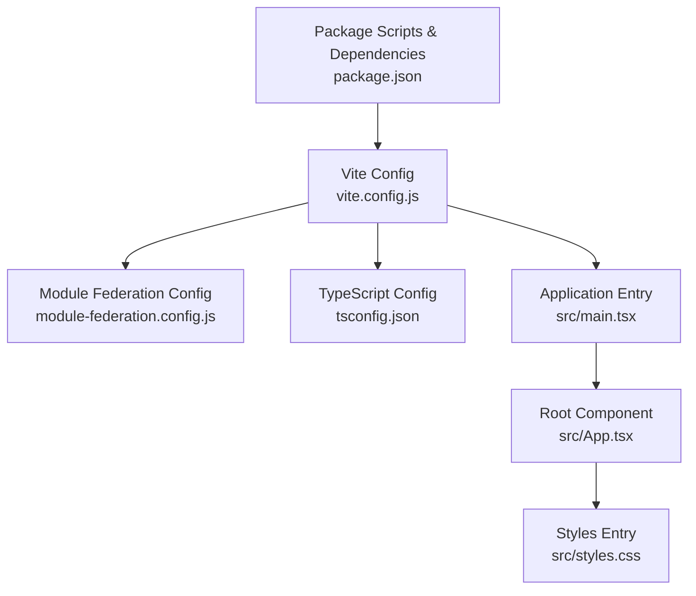
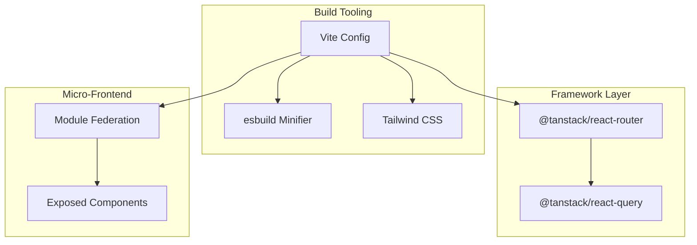
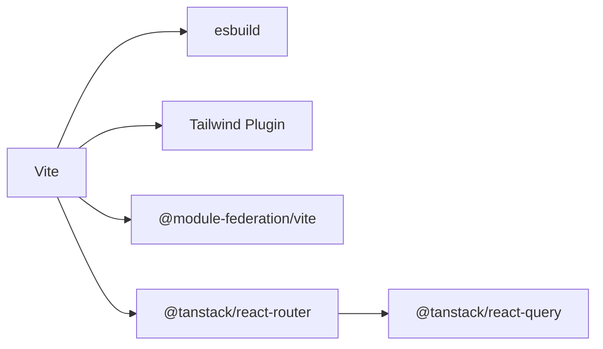

# Build Optimization

<cite>
**Referenced Files in This Document**
- [vite.config.js](file://vite.config.js)
- [module-federation.config.js](file://module-federation.config.js)
- [package.json](file://package.json)
- [tsconfig.json](file://tsconfig.json)
- [src/main.tsx](file://src/main.tsx)
- [src/App.tsx](file://src/App.tsx)
- [src/styles.css](file://src/styles.css)
- [src/demo-mf-component.tsx](file://src/demo-mf-component.tsx)
- [src/demo-mf-self-contained.tsx](file://src/demo-mf-self-contained.tsx)
- [eslint.config.js](file://eslint.config.js)
- [prettier.config.js](file://prettier.config.js)
</cite>

## Table of Contents
1. [Introduction](#introduction)
2. [Project Structure](#project-structure)
3. [Core Components](#core-components)
4. [Architecture Overview](#architecture-overview)
5. [Detailed Component Analysis](#detailed-component-analysis)
6. [Dependency Analysis](#dependency-analysis)
7. [Performance Considerations](#performance-considerations)
8. [Troubleshooting Guide](#troubleshooting-guide)
9. [Conclusion](#conclusion)
10. [Appendices](#appendices)

## Introduction
This document focuses on build optimization techniques for the CV Portfolio Builder, covering Vite configuration, Module Federation, minification strategies, dynamic imports, and production performance. It synthesizes the current repository configuration and highlights practical improvements to reduce bundle sizes, improve load times, and enhance developer experience.

## Project Structure
The project uses Vite as the build toolchain with React and Tailwind CSS. Module Federation is integrated via a dedicated configuration file. TypeScript is configured for bundler mode with strictness and modern targets. The routing setup leverages TanStack Router, enabling preload and structural sharing for smoother navigation.

**Diagram sources**
- [vite.config.js:1-28](file://vite.config.js#L1-L28)
- [module-federation.config.js:1-32](file://module-federation.config.js#L1-L32)
- [package.json:1-60](file://package.json#L1-L60)
- [tsconfig.json:1-29](file://tsconfig.json#L1-L29)
- [src/main.tsx:1-89](file://src/main.tsx#L1-L89)
- [src/App.tsx:1-8](file://src/App.tsx#L1-L8)
- [src/styles.css:1-138](file://src/styles.css#L1-L138)

**Section sources**
- [vite.config.js:1-28](file://vite.config.js#L1-L28)
- [module-federation.config.js:1-32](file://module-federation.config.js#L1-L32)
- [package.json:1-60](file://package.json#L1-L60)
- [tsconfig.json:1-29](file://tsconfig.json#L1-L29)
- [src/main.tsx:1-89](file://src/main.tsx#L1-L89)
- [src/App.tsx:1-8](file://src/App.tsx#L1-L8)
- [src/styles.css:1-138](file://src/styles.css#L1-L138)

## Core Components
- Vite configuration enables React plugin, Tailwind integration, and Module Federation. It sets modern targets for both Vite and esbuild to leverage top-level await and modern JS features.
- Module Federation configuration exposes demo components and shares React and ReactDOM as singletons to avoid duplication.
- TypeScript configuration uses bundler mode with strict checks and verbatim module syntax for accurate tree-shaking and minimal emission.
- Routing setup integrates TanStack Router with preload and structural sharing to optimize navigation performance.

**Section sources**
- [vite.config.js:9-27](file://vite.config.js#L9-L27)
- [module-federation.config.js:13-31](file://module-federation.config.js#L13-L31)
- [tsconfig.json:3-26](file://tsconfig.json#L3-L26)
- [src/main.tsx:56-65](file://src/main.tsx#L56-L65)

## Architecture Overview
The build pipeline integrates Vite, esbuild, and Tailwind CSS. Module Federation is layered on top to enable micro-frontend capabilities. The routing layer uses TanStack Router to manage navigation and preloading.

**Diagram sources**
- [vite.config.js:3-10](file://vite.config.js#L3-L10)
- [module-federation.config.js:13-20](file://module-federation.config.js#L13-L20)
- [src/main.tsx:1-27](file://src/main.tsx#L1-L27)

## Detailed Component Analysis

### Vite Configuration Optimizations
- Modern targets: Both Vite and esbuild targets are set to ESNext to support top-level await and modern features, enabling better tree-shaking and dead-code elimination.
- Plugins: React plugin and Tailwind integration are enabled. Module Federation plugin is included via the external configuration file.
- Aliases: Path aliases simplify imports and improve DX; ensure they align with bundler resolution for optimal module graph.

Recommended additions for further optimization:
- esbuild options: Enable minify and target adjustments per environment.
- Build.rollupOptions: Configure manualChunks for strategic code splitting by vendor/library boundaries.
- Build.assetsDir/build.rollupOptions.output.assetFileNames: Normalize asset filenames for cacheability.
- Define: Inject environment flags to remove dead branches during compile-time.

**Section sources**
- [vite.config.js:9-27](file://vite.config.js#L9-L27)

### Module Federation Benefits and Bundle Size Reduction
- Singleton sharing: React and ReactDOM are marked as singletons to prevent duplication across remotes and hosts, reducing runtime overhead and bundle size.
- Exposes: Demo components are exposed for potential reuse across applications, enabling a distributed UI architecture without duplicating code.
- Filename and entry configuration: Centralized remote entry generation simplifies integration and caching.

Practical tips:
- Keep shared libraries aligned across federated apps to maximize deduplication.
- Prefer lazy-loading remotes to defer network cost until needed.
- Use explicit remotes mapping to avoid unnecessary downloads.

**Section sources**
- [module-federation.config.js:13-31](file://module-federation.config.js#L13-L31)
- [src/demo-mf-component.tsx:1-4](file://src/demo-mf-component.tsx#L1-L4)
- [src/demo-mf-self-contained.tsx:1-11](file://src/demo-mf-self-contained.tsx#L1-L11)

### Minification Strategies for TypeScript and CSS Assets
- TypeScript: The project compiles to JS via Vite and TypeScript; ensure esbuild minification is enabled in production for JS/TS. Consider adding minify options in Vite build settings.
- CSS: Tailwind CSS is integrated via a Vite plugin. Ensure purge/content configuration is optimized to remove unused styles. With Tailwind v4, the plugin handles purging automatically, but confirm that content paths match the actual source locations.

Recommendations:
- For CSS: Verify that Tailwind’s content globs include all relevant source directories to eliminate unused utilities.
- For JS/TS: Confirm minify settings in Vite build for production. Consider enabling tree-shaking-friendly module syntax and avoiding side-effectful imports.

**Section sources**
- [vite.config.js:3-10](file://vite.config.js#L3-L10)
- [src/styles.css:1-138](file://src/styles.css#L1-L138)

### Dynamic Import Implementation for Route-Based Code Splitting and Lazy Loading
Current routing setup uses TanStack Router with explicit route imports. While this centralizes route registration, it does not yet leverage dynamic imports for code splitting.

Recommended approach:
- Replace static imports with dynamic imports for route components to split bundles by route.
- Combine with TanStack Router’s lazy route creation to achieve route-based code splitting.
- Use defaultPreload to balance responsiveness and bandwidth usage.

Example pattern (conceptual):
- Wrap route component imports with dynamic import and configure router to treat them as lazy routes.
- Ensure chunk naming is stable for cacheability.

Impact:
- Reduces initial bundle size by deferring non-critical route code.
- Improves perceived performance by prioritizing critical shell rendering.

**Section sources**
- [src/main.tsx:46-54](file://src/main.tsx#L46-L54)

### Production Builds and Development Server Performance
Production:
- Ensure minification is enabled for JS/TS and CSS.
- Leverage esbuild for fast minification and tree-shaking.
- Use Rollup options to split vendor chunks and name assets deterministically.

Development:
- Keep plugins minimal to reduce transform overhead.
- Use precise content globs for Tailwind to avoid unnecessary rebuilds.
- Consider enabling esbuild for faster dev builds.

Environment-specific toggles:
- Use Vite defines to gate development-only features and devtools.

**Section sources**
- [vite.config.js:9-27](file://vite.config.js#L9-L27)
- [package.json:5-14](file://package.json#L5-L14)

### Bundle Analysis Tools and Initial Load Optimization
Bundle analysis:
- Integrate a Vite plugin for bundle visualization to inspect sizes and dependencies.
- Use the built-in preview server to validate production builds.

Initial load optimization:
- Apply route-based code splitting with dynamic imports.
- Defer non-critical features and heavy dependencies.
- Optimize images and fonts; consider responsive images and font-display strategies.
- Enable HTTP/2 push selectively and ensure proper caching headers.

[No sources needed since this section provides general guidance]

## Dependency Analysis
The project’s build stack composes Vite, esbuild, Tailwind, and Module Federation. TanStack Router and TanStack Query are part of the runtime; their inclusion affects bundle size and hydration behavior.

**Diagram sources**
- [vite.config.js:3-10](file://vite.config.js#L3-L10)
- [src/main.tsx:1-27](file://src/main.tsx#L1-L27)

**Section sources**
- [vite.config.js:3-10](file://vite.config.js#L3-L10)
- [src/main.tsx:1-27](file://src/main.tsx#L1-L27)

## Performance Considerations
- Tree shaking: Use bundler module resolution and verbatim module syntax to maximize dead-code elimination.
- Code splitting: Employ dynamic imports for routes and heavy features to reduce initial payload.
- Asset optimization: Ensure Tailwind purges unused CSS and that images/fonts are optimized.
- Dev vs prod: Keep dev builds lean; enable aggressive minification and sourcemaps only when needed.

[No sources needed since this section provides general guidance]

## Troubleshooting Guide
Common issues and remedies:
- Missing route files: Ensure route files referenced in the router exist; otherwise, dynamic imports will fail at runtime.
- Tailwind purging: Verify content globs include all source directories to prevent removing necessary styles.
- Module Federation mismatches: Align React and ReactDOM versions across host and remotes to avoid runtime errors.
- TypeScript strictness: Maintain strict compiler options to catch issues early; adjust only when necessary.

**Section sources**
- [src/main.tsx:46-54](file://src/main.tsx#L46-L54)
- [src/styles.css:1-138](file://src/styles.css#L1-L138)
- [module-federation.config.js:22-30](file://module-federation.config.js#L22-L30)
- [tsconfig.json:17-22](file://tsconfig.json#L17-L22)

## Conclusion
The CV Portfolio Builder leverages modern tooling with Vite, Tailwind, and Module Federation. By adopting route-based dynamic imports, optimizing CSS purging, enforcing strict TypeScript settings, and configuring esbuild minification, the project can significantly reduce initial load times and improve maintainability. Integrating bundle analysis and monitoring production metrics will help sustain performance gains over time.

[No sources needed since this section summarizes without analyzing specific files]

## Appendices
- Formatting and linting: Prettier and ESLint configurations are present and should be applied consistently to keep the codebase clean and predictable for bundlers.

**Section sources**
- [prettier.config.js:1-11](file://prettier.config.js#L1-L11)
- [eslint.config.js:1-6](file://eslint.config.js#L1-L6)