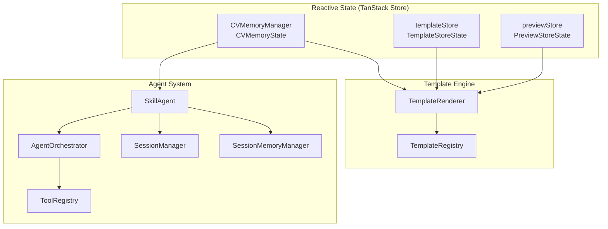
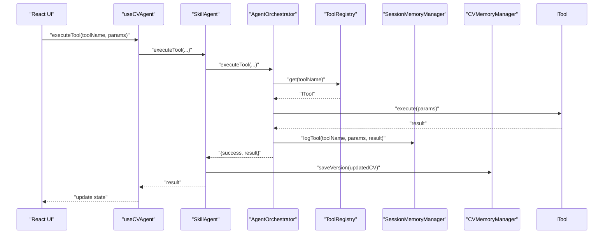
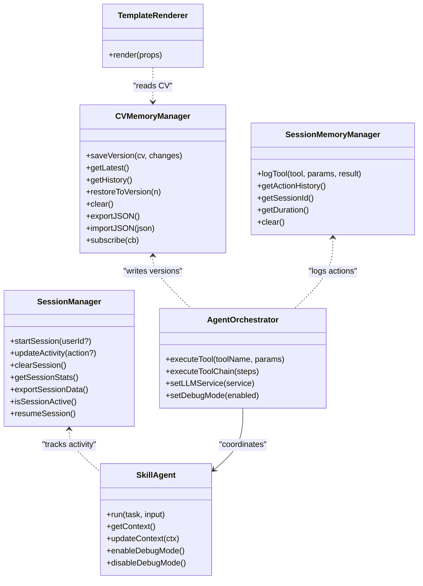

# Memory Management

<cite>
**Referenced Files in This Document**
- [cv-memory.ts](file://src/agent/memory/cv-memory.ts)
- [context-manager.ts](file://src/agent/memory/context-manager.ts)
- [agent.ts](file://src/agent/core/agent.ts)
- [session.ts](file://src/agent/core/session.ts)
- [use-cv-agent.ts](file://src/hooks/use-cv-agent.ts)
- [TemplateRenderer.tsx](file://src/templates/core/TemplateRenderer.tsx)
- [template.store.ts](file://src/templates/store/template.store.ts)
- [preview.store.ts](file://src/templates/store/preview.store.ts)
- [template-registry.ts](file://src/templates/core/template-registry.ts)
- [base-tool.ts](file://src/agent/tools/base-tool.ts)
- [agent.schema.ts](file://src/agent/schemas/agent.schema.ts)
- [cv.schema.ts](file://src/agent/schemas/cv.schema.ts)
- [cv.types.ts](file://src/templates/types/cv.types.ts)
- [template.types.ts](file://src/templates/types/template.types.ts)
</cite>

## Table of Contents
1. [Introduction](#introduction)
2. [Project Structure](#project-structure)
3. [Core Components](#core-components)
4. [Architecture Overview](#architecture-overview)
5. [Detailed Component Analysis](#detailed-component-analysis)
6. [Dependency Analysis](#dependency-analysis)
7. [Performance Considerations](#performance-considerations)
8. [Troubleshooting Guide](#troubleshooting-guide)
9. [Conclusion](#conclusion)
10. [Appendices](#appendices)

## Introduction
This document focuses on memory management optimization in the CV Portfolio Builder. It explains how reactive state is managed using TanStack Store, how memory leaks are prevented in the agent system and template engine, and how to optimize garbage collection for large CV datasets and rendering contexts. It also covers memory profiling techniques via browser dev tools and React DevTools, and outlines strategies for optimizing memory usage during AI tool execution and context switching, including long-running sessions.

## Project Structure
The memory-related systems are organized around three pillars:
- Reactive state stores for CV data, templates, and preview settings
- Agent orchestration and session management for tool execution and persistence
- Template engine for rendering CVs with minimal DOM churn and efficient re-renders

**Diagram sources**
- [cv-memory.ts:19-148](file://src/agent/memory/cv-memory.ts#L19-L148)
- [template.store.ts:19-103](file://src/templates/store/template.store.ts#L19-L103)
- [preview.store.ts:24-100](file://src/templates/store/preview.store.ts#L24-L100)
- [agent.ts:60-168](file://src/agent/core/agent.ts#L60-L168)
- [session.ts:7-200](file://src/agent/core/session.ts#L7-L200)
- [TemplateRenderer.tsx:13-55](file://src/templates/core/TemplateRenderer.tsx#L13-L55)
- [template-registry.ts:4-91](file://src/templates/core/template-registry.ts#L4-L91)

**Section sources**
- [cv-memory.ts:19-148](file://src/agent/memory/cv-memory.ts#L19-L148)
- [template.store.ts:19-103](file://src/templates/store/template.store.ts#L19-L103)
- [preview.store.ts:24-100](file://src/templates/store/preview.store.ts#L24-L100)
- [agent.ts:60-168](file://src/agent/core/agent.ts#L60-L168)
- [session.ts:7-200](file://src/agent/core/session.ts#L7-L200)
- [TemplateRenderer.tsx:13-55](file://src/templates/core/TemplateRenderer.tsx#L13-L55)
- [template-registry.ts:4-91](file://src/templates/core/template-registry.ts#L4-L91)

## Core Components
- CV memory manager: maintains current CV, version history, and derived observables for reactive UI updates.
- Session memory manager: logs tool executions and manages session metadata.
- Session manager: persists session state to localStorage and tracks activity.
- Template stores: manage active template, custom templates, section ordering, and preview settings with derived computed values.
- Agent orchestrator: executes tools, logs to session memory, and coordinates state transitions.
- Template renderer: renders CVs efficiently using React.memo and layout-specific components.

Key memory optimization patterns:
- Derived observables avoid recomputing derived values unnecessarily.
- Immutable state updates prevent accidental shared mutable state.
- React.memo prevents unnecessary re-renders of the renderer.
- LocalStorage-backed session persistence avoids in-memory bloat for long sessions.

**Section sources**
- [cv-memory.ts:19-148](file://src/agent/memory/cv-memory.ts#L19-L148)
- [session.ts:7-200](file://src/agent/core/session.ts#L7-L200)
- [template.store.ts:19-103](file://src/templates/store/template.store.ts#L19-L103)
- [preview.store.ts:24-100](file://src/templates/store/preview.store.ts#L24-L100)
- [agent.ts:60-168](file://src/agent/core/agent.ts#L60-L168)
- [TemplateRenderer.tsx:13-55](file://src/templates/core/TemplateRenderer.tsx#L13-L55)

## Architecture Overview
The system uses TanStack Store for centralized reactive state and React hooks for subscriptions. The agent orchestrator coordinates tool execution and writes to session memory. The template engine reads from stores and renders CVs with minimal DOM churn.

**Diagram sources**
- [use-cv-agent.ts:17-46](file://src/hooks/use-cv-agent.ts#L17-L46)
- [agent.ts:78-127](file://src/agent/core/agent.ts#L78-L127)
- [agent.ts:109](file://src/agent/core/agent.ts#L109)
- [cv-memory.ts:55-72](file://src/agent/memory/cv-memory.ts#L55-L72)
- [session.ts:75-90](file://src/agent/core/session.ts#L75-L90)

## Detailed Component Analysis

### Reactive State Stores and Derived Observables
- CV memory manager exposes derived observables for hasCV, versionCount, and lastUpdated, mounted to reactively update dependent components.
- Template store defines activeTemplate and hasActiveTemplate derived values, enabling efficient conditional rendering.
- Preview store exposes currentZoom and isEditMode derived values for responsive UI updates.

Memory implications:
- Derived observables compute lazily and only when dependencies change, reducing unnecessary work.
- Mounting derived observables ensures they remain reactive without manual subscription management.

**Section sources**
- [cv-memory.ts:23-50](file://src/agent/memory/cv-memory.ts#L23-L50)
- [template.store.ts:22-44](file://src/templates/store/template.store.ts#L22-L44)
- [preview.store.ts:27-38](file://src/templates/store/preview.store.ts#L27-L38)

### Agent Orchestration and Memory Leak Prevention
- The orchestrator executes tools and logs to session memory. It captures timing and errors, returning structured results.
- Tool execution uses safe wrappers to centralize error handling and avoid unhandled promise rejections that could lead to lingering references.
- Debug mode toggles can be used to reduce allocations during profiling.

Memory leak prevention strategies:
- Avoid retaining closures over long-lived tool instances; rely on ephemeral execution context per call.
- Ensure tool execution completes or is cancellable to prevent dangling timers or listeners.
- Use structured logging to track tool lifetimes and detect anomalies.

**Section sources**
- [agent.ts:78-127](file://src/agent/core/agent.ts#L78-L127)
- [base-tool.ts:30-48](file://src/agent/tools/base-tool.ts#L30-L48)

### Session Management and Persistence
- Session manager persists session state to localStorage and tracks activity. It provides session statistics and export capabilities.
- Session memory manager logs tool executions with timestamps and parameters, supporting auditability and debugging.

Memory considerations:
- Persisting large histories to localStorage can increase memory pressure. Consider trimming or paginating logs for long sessions.
- Use lazy parsing and ISO date serialization to minimize overhead.

**Section sources**
- [session.ts:75-125](file://src/agent/core/session.ts#L75-L125)
- [session.ts:155-170](file://src/agent/core/session.ts#L155-L170)
- [cv-memory.ts:164-227](file://src/agent/memory/cv-memory.ts#L164-L227)

### Template Engine and Rendering Optimization
- Template renderer uses React.memo to prevent re-renders when props are shallowly equal.
- It separates sections by position and delegates to layout-specific components, minimizing DOM tree churn.
- Theme conversion to CSS variables avoids repeated style computations.

Memory optimization strategies:
- Keep template and theme objects immutable; derive CSS variables once per render.
- Avoid passing large anonymous objects as props; prefer stable references.
- Use layout-specific memoization to prevent unnecessary section re-renders.

**Section sources**
- [TemplateRenderer.tsx:13-55](file://src/templates/core/TemplateRenderer.tsx#L13-L55)
- [TemplateRenderer.tsx:58-73](file://src/templates/core/TemplateRenderer.tsx#L58-L73)

### Context Management and Schema Validation
- Context manager provides a singleton interface to update and query agent context, exporting/importing context safely.
- Zod schemas define strict shapes for CV data, ensuring predictable memory usage and preventing oversized or malformed structures.

Memory benefits:
- Strict schemas help catch invalid data early, avoiding expensive runtime corrections.
- Centralized context updates via actions ensure consistent state transitions.

**Section sources**
- [context-manager.ts:20-136](file://src/agent/memory/context-manager.ts#L20-L136)
- [cv.schema.ts:50-79](file://src/agent/schemas/cv.schema.ts#L50-L79)
- [agent.schema.ts:42-51](file://src/agent/schemas/agent.schema.ts#L42-L51)

### Hooks for Reactive Access
- useCVAgent encapsulates tool execution, loading states, and error handling, integrating with session manager for activity tracking.
- useCVData subscribes to reactive CV stores for real-time updates without manual subscriptions.
- useSession periodically refreshes session statistics and provides cleanup for intervals.

Memory hygiene:
- Hooks return memoized callbacks to avoid recreating functions on every render.
- Interval cleanup prevents memory leaks from periodic updates.

**Section sources**
- [use-cv-agent.ts:17-101](file://src/hooks/use-cv-agent.ts#L17-L101)
- [use-cv-agent.ts:106-120](file://src/hooks/use-cv-agent.ts#L106-L120)
- [use-cv-agent.ts:158-181](file://src/hooks/use-cv-agent.ts#L158-L181)

### Template Registry and Custom Templates
- Template registry stores templates by ID and supports search, filtering, and removal.
- Template store manages active template selection, custom templates, and section ordering.

Memory considerations:
- Avoid storing large binary assets in templates; keep references or URLs.
- Prefer compact identifiers and metadata to reduce memory footprint.

**Section sources**
- [template-registry.ts:20-87](file://src/templates/core/template-registry.ts#L20-L87)
- [template.store.ts:46-98](file://src/templates/store/template.store.ts#L46-L98)

## Dependency Analysis

**Diagram sources**
- [cv-memory.ts:19-148](file://src/agent/memory/cv-memory.ts#L19-L148)
- [session.ts:7-200](file://src/agent/core/session.ts#L7-L200)
- [agent.ts:60-168](file://src/agent/core/agent.ts#L60-L168)
- [TemplateRenderer.tsx:13-55](file://src/templates/core/TemplateRenderer.tsx#L13-L55)

**Section sources**
- [cv-memory.ts:19-148](file://src/agent/memory/cv-memory.ts#L19-L148)
- [session.ts:7-200](file://src/agent/core/session.ts#L7-L200)
- [agent.ts:60-168](file://src/agent/core/agent.ts#L60-L168)
- [TemplateRenderer.tsx:13-55](file://src/templates/core/TemplateRenderer.tsx#L13-L55)

## Performance Considerations
- Prefer immutable updates to state stores to enable efficient change detection and avoid accidental shared state.
- Use derived observables to compute expensive values only when inputs change.
- Memoize components (React.memo) and keep props stable to reduce re-render costs.
- Limit localStorage growth by trimming session logs and avoiding large payloads.
- For large CV datasets, consider pagination or virtualization of lists and defer heavy computations to Web Workers when applicable.
- Monitor memory with browser dev tools and React DevTools Profiler to identify hotspots and leaks.

[No sources needed since this section provides general guidance]

## Troubleshooting Guide
Common memory issues and remedies:
- Unbounded session logs: Trim or cap action history in session memory to prevent excessive memory growth.
- Frequent re-renders: Ensure props are stable and use React.memo; verify derived observables are mounted correctly.
- Tool execution leaks: Wrap tool execution in safe wrappers and ensure timeouts/cancellations; avoid capturing large closures.
- Large CV objects: Validate schemas to prevent oversized structures; avoid deep cloning; pass references where possible.
- Long sessions: Periodically persist snapshots and clear temporary caches; use session statistics to detect anomalies.

**Section sources**
- [session.ts:182-191](file://src/agent/core/session.ts#L182-L191)
- [cv-memory.ts:164-227](file://src/agent/memory/cv-memory.ts#L164-L227)
- [base-tool.ts:30-48](file://src/agent/tools/base-tool.ts#L30-L48)

## Conclusion
The CV Portfolio Builder employs TanStack Store for efficient reactive state management, React.memo for rendering optimization, and structured agent orchestration with session logging. By leveraging derived observables, immutable updates, and careful lifecycle management, the system minimizes memory pressure while maintaining responsiveness. Use the provided profiling techniques and hooks to monitor and sustain performance over long-running sessions.

[No sources needed since this section summarizes without analyzing specific files]

## Appendices

### Memory Profiling Techniques
- Browser DevTools:
  - Take heap snapshots before and after major operations (e.g., importing a large CV, rendering a complex template).
  - Use the “Comparison” view to identify retained objects and potential leaks.
  - Track allocation timelines to spot spikes during tool execution or rendering.
- React DevTools:
  - Use the Profiler to identify components re-rendering excessively.
  - Verify that memoized components (e.g., TemplateRenderer) are not receiving unstable props.

[No sources needed since this section provides general guidance]

### Strategies for AI Tool Execution and Context Switching
- Execution:
  - Use timeouts and cancellation to prevent hanging promises.
  - Batch tool calls and debounce rapid context switches to reduce redundant work.
- Context switching:
  - Normalize context updates to avoid partial updates that cause extra renders.
  - Persist only essential context to localStorage to limit memory overhead.

[No sources needed since this section provides general guidance]