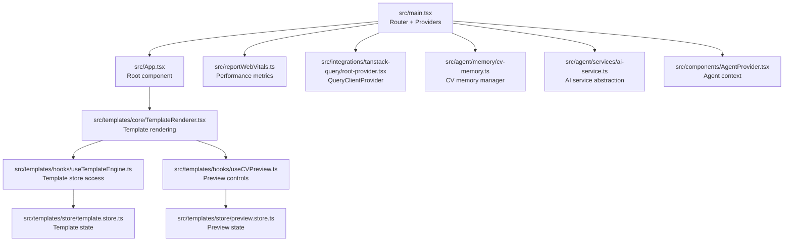
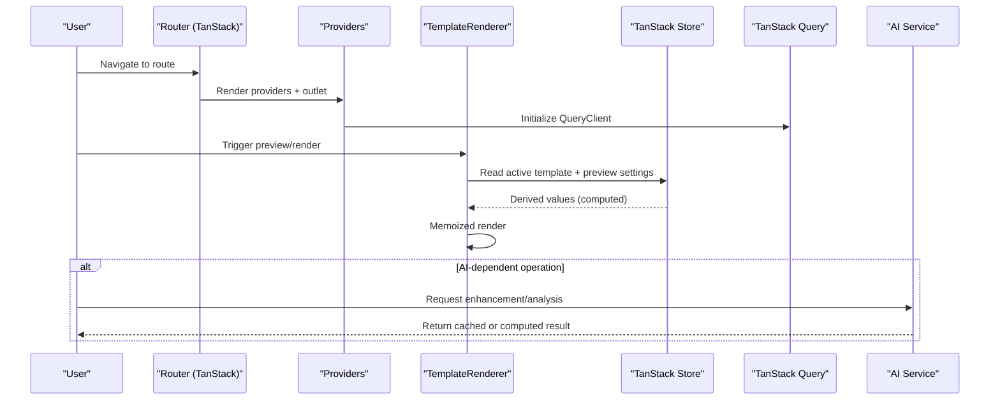
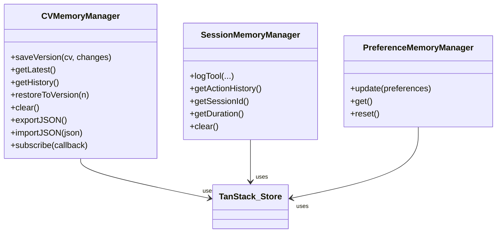
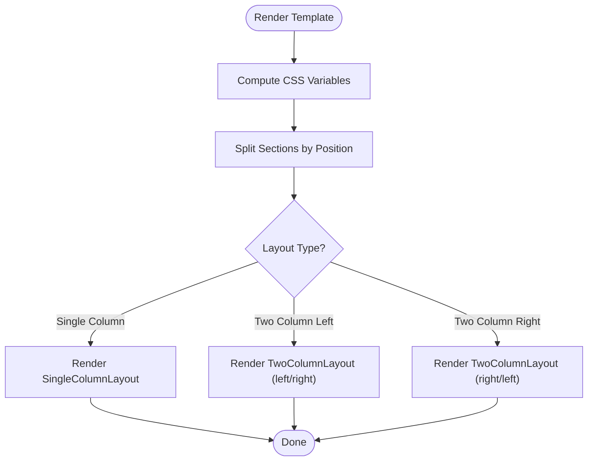
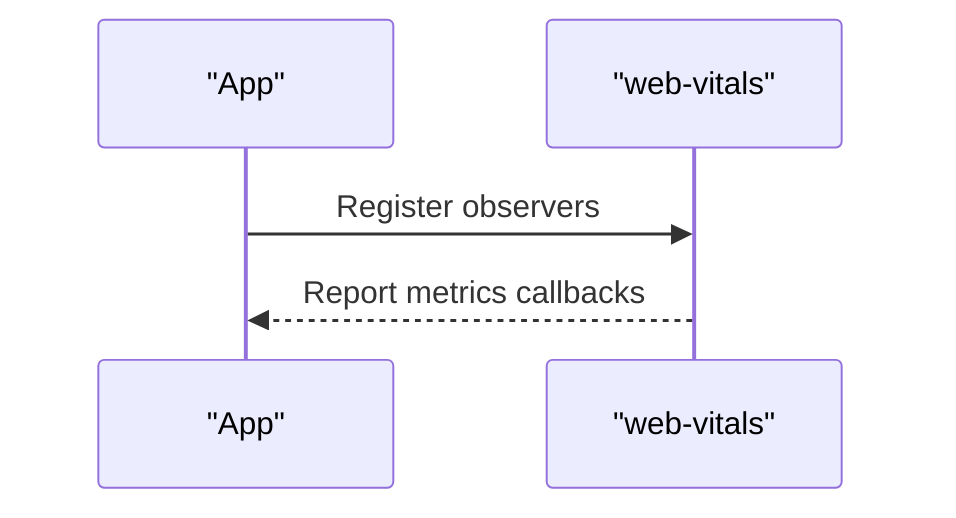
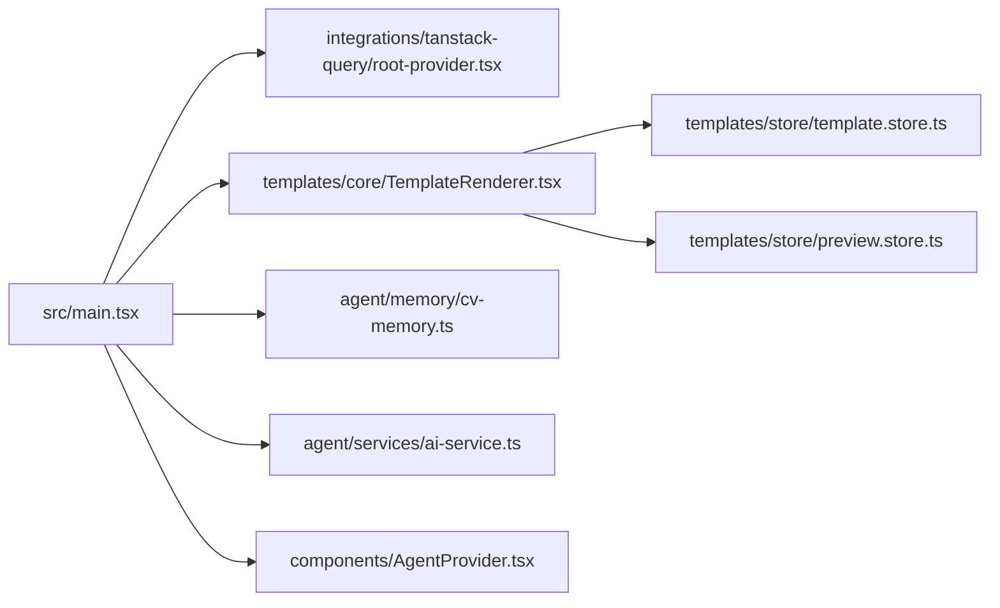

# Performance Optimization

<cite>
**Referenced Files in This Document**
- [package.json](file://package.json)
- [vite.config.js](file://vite.config.js)
- [src/main.tsx](file://src/main.tsx)
- [src/App.tsx](file://src/App.tsx)
- [src/reportWebVitals.ts](file://src/reportWebVitals.ts)
- [src/templates/core/TemplateRenderer.tsx](file://src/templates/core/TemplateRenderer.tsx)
- [src/templates/hooks/useTemplateEngine.ts](file://src/templates/hooks/useTemplateEngine.ts)
- [src/templates/hooks/useCVPreview.ts](file://src/templates/hooks/useCVPreview.ts)
- [src/templates/store/template.store.ts](file://src/templates/store/template.store.ts)
- [src/templates/store/preview.store.ts](file://src/templates/store/preview.store.ts)
- [src/agent/memory/cv-memory.ts](file://src/agent/memory/cv-memory.ts)
- [src/agent/services/ai-service.ts](file://src/agent/services/ai-service.ts)
- [src/agent/tools/base-tool.ts](file://src/agent/tools/base-tool.ts)
- [src/components/AgentProvider.tsx](file://src/components/AgentProvider.tsx)
- [src/integrations/tanstack-query/root-provider.tsx](file://src/integrations/tanstack-query/root-provider.tsx)
</cite>

## Table of Contents
1. [Introduction](#introduction)
2. [Project Structure](#project-structure)
3. [Core Components](#core-components)
4. [Architecture Overview](#architecture-overview)
5. [Detailed Component Analysis](#detailed-component-analysis)
6. [Dependency Analysis](#dependency-analysis)
7. [Performance Considerations](#performance-considerations)
8. [Troubleshooting Guide](#troubleshooting-guide)
9. [Conclusion](#conclusion)
10. [Appendices](#appendices)

## Introduction
This document provides a comprehensive guide to performance optimization in the CV Portfolio Builder. It focuses on leveraging React 19 concurrent features, optimizing memory usage for large CV datasets, enhancing template rendering performance, implementing code splitting via dynamic imports and route-based splitting, applying build-time optimizations, profiling with React DevTools and browser tools, lazy loading AI tools and template components, establishing benchmarking and monitoring practices, and designing caching strategies for AI responses and template rendering.

## Project Structure
The application is a React 19 + Vite project integrated with TanStack Router, TanStack Store, and TanStack Query. The structure emphasizes modular routing, reactive stores for state, and a template engine for rendering CVs. Key areas for performance optimization include:
- Routing and preloading behavior
- Reactive stores and derived computations
- Template rendering pipeline
- AI service abstraction and potential caching
- Build configuration targeting modern JavaScript features

**Diagram sources**
- [src/main.tsx:1-89](file://src/main.tsx#L1-L89)
- [src/App.tsx:1-8](file://src/App.tsx#L1-L8)
- [src/reportWebVitals.ts:1-14](file://src/reportWebVitals.ts#L1-L14)
- [src/integrations/tanstack-query/root-provider.tsx:1-14](file://src/integrations/tanstack-query/root-provider.tsx#L1-L14)
- [src/templates/core/TemplateRenderer.tsx:1-74](file://src/templates/core/TemplateRenderer.tsx#L1-L74)
- [src/templates/hooks/useTemplateEngine.ts:1-57](file://src/templates/hooks/useTemplateEngine.ts#L1-L57)
- [src/templates/hooks/useCVPreview.ts:1-60](file://src/templates/hooks/useCVPreview.ts#L1-L60)
- [src/templates/store/template.store.ts:1-103](file://src/templates/store/template.store.ts#L1-L103)
- [src/templates/store/preview.store.ts:1-100](file://src/templates/store/preview.store.ts#L1-L100)
- [src/agent/memory/cv-memory.ts:1-290](file://src/agent/memory/cv-memory.ts#L1-L290)
- [src/agent/services/ai-service.ts:1-174](file://src/agent/services/ai-service.ts#L1-L174)
- [src/components/AgentProvider.tsx:1-30](file://src/components/AgentProvider.tsx#L1-L30)

**Section sources**
- [src/main.tsx:1-89](file://src/main.tsx#L1-L89)
- [vite.config.js:1-28](file://vite.config.js#L1-L28)

## Core Components
- Router and preloading: The router is configured with intent-based preloading, structural sharing, and explicit stale timing to improve perceived performance and reduce redundant work.
- TanStack Query: Provides caching, background refetching, and devtools integration for data-heavy features.
- TanStack Store: Centralized reactive stores for templates and preview settings with derived states for computed values.
- Template Renderer: Renders CVs using layout-specific components and memoization to avoid unnecessary re-renders.
- AI Service: Abstracts provider implementations and exposes typed generation APIs suitable for caching and lazy initialization.

**Section sources**
- [src/main.tsx:56-65](file://src/main.tsx#L56-L65)
- [src/integrations/tanstack-query/root-provider.tsx:1-14](file://src/integrations/tanstack-query/root-provider.tsx#L1-L14)
- [src/templates/store/template.store.ts:1-103](file://src/templates/store/template.store.ts#L1-L103)
- [src/templates/store/preview.store.ts:1-100](file://src/templates/store/preview.store.ts#L1-L100)
- [src/templates/core/TemplateRenderer.tsx:13-53](file://src/templates/core/TemplateRenderer.tsx#L13-L53)
- [src/agent/services/ai-service.ts:1-174](file://src/agent/services/ai-service.ts#L1-L174)

## Architecture Overview
The performance-critical path involves routing, state derivation, template rendering, and optional AI interactions. The diagram below maps the primary flows and optimization touchpoints.

**Diagram sources**
- [src/main.tsx:56-82](file://src/main.tsx#L56-L82)
- [src/integrations/tanstack-query/root-provider.tsx:1-14](file://src/integrations/tanstack-query/root-provider.tsx#L1-L14)
- [src/templates/core/TemplateRenderer.tsx:13-53](file://src/templates/core/TemplateRenderer.tsx#L13-L53)
- [src/templates/store/template.store.ts:22-43](file://src/templates/store/template.store.ts#L22-L43)
- [src/templates/store/preview.store.ts:27-37](file://src/templates/store/preview.store.ts#L27-L37)
- [src/agent/services/ai-service.ts:77-126](file://src/agent/services/ai-service.ts#L77-L126)

## Detailed Component Analysis

### React 19 Concurrent Features and Automatic Batching
- Automatic batching: React 19 improves batching of state updates. In this codebase, state updates occur through TanStack Store actions and React Router’s state transitions. Ensure updates remain granular and avoid unnecessary re-renders by relying on derived states and selective subscriptions.
- Suspense boundaries: While no explicit Suspense boundaries are present, the code leverages TanStack Query for data fetching and TanStack Router for navigation. To adopt Suspense:
  - Wrap data-fetching components with a Suspense boundary and configure a fallback.
  - Use TanStack Query’s resource-like semantics to align with Suspense-ready data sources.
  - Combine with route-based code splitting to defer heavy components until after data resolves.

Practical steps:
- Introduce a Suspense boundary around data-dependent sections.
- Configure route loaders to fetch data prior to rendering.
- Use default preloads judiciously to balance responsiveness and bandwidth.

**Section sources**
- [src/main.tsx:56-65](file://src/main.tsx#L56-L65)
- [src/integrations/tanstack-query/root-provider.tsx:1-14](file://src/integrations/tanstack-query/root-provider.tsx#L1-L14)

### Memory Management Strategies for Large CV Data Structures
- Immutable updates: TanStack Store updates are immutable. Keep CV payloads normalized and avoid deep mutations to maximize derived-state cache hits.
- Derived computations: Derived states compute derived values (e.g., hasCV, versionCount) to prevent recomputation across unrelated updates.
- Versioning and history: The CV memory manager supports saving versions and restoring previous states. For very large CVs, consider:
  - Lazy serialization/deserialization
  - Incremental diffs for versions
  - Periodic pruning of older versions

**Diagram sources**
- [src/agent/memory/cv-memory.ts:19-148](file://src/agent/memory/cv-memory.ts#L19-L148)

**Section sources**
- [src/agent/memory/cv-memory.ts:1-290](file://src/agent/memory/cv-memory.ts#L1-L290)

### Template Rendering Optimization
- Memoization: TemplateRenderer is memoized to avoid re-rendering when props are shallow-equal.
- Layout segregation: Sections are separated by position to minimize cross-layout reflows.
- CSS variables: Theme conversion to CSS variables reduces inline style churn and enables efficient style updates.

Recommendations:
- Use windowing for very long lists of items within sections.
- Defer heavy computations to Web Workers if needed.
- Consider splitting large templates into smaller, composable components.

**Diagram sources**
- [src/templates/core/TemplateRenderer.tsx:13-53](file://src/templates/core/TemplateRenderer.tsx#L13-L53)

**Section sources**
- [src/templates/core/TemplateRenderer.tsx:1-74](file://src/templates/core/TemplateRenderer.tsx#L1-L74)

### Code Splitting and Route-Based Splitting
- Current state: Routes are statically imported and composed into the route tree.
- Recommended approach:
  - Replace static imports with dynamic imports for heavy routes.
  - Use route loaders to preload critical data before rendering.
  - Split templates and AI-heavy views into separate chunks.

Benefits:
- Reduced initial bundle size
- Faster time-to-first-paint
- On-demand loading of expensive features

**Section sources**
- [src/main.tsx:46-54](file://src/main.tsx#L46-L54)

### Build Optimizations
- Modern target: The build targets ESNext, enabling top-level await and modern JS features.
- Minification and tree shaking: Vite with esbuild performs minification; ensure libraries are ESM-friendly and side-effect-free where possible.
- Asset optimization: Tailwind CSS is integrated; ensure unused CSS is purged in production builds.

Recommendations:
- Enable esbuild minify for production builds
- Audit dependencies for dead code and replace CJS-only packages with ESM equivalents
- Use asset hashing and compression (gzip/brotli) in deployment

**Section sources**
- [vite.config.js:21-26](file://vite.config.js#L21-L26)
- [package.json:1-60](file://package.json#L1-L60)

### Profiling Techniques
- Web Vitals: The app wires web-vitals reporting to capture CLS, INP, FCP, LCP, and TTFB.
- React DevTools: Use Profiler to identify expensive renders and long tasks.
- Browser tools: Use Performance panel to capture CPU traces and Memory panel to detect leaks.

**Diagram sources**
- [src/reportWebVitals.ts:1-14](file://src/reportWebVitals.ts#L1-L14)

**Section sources**
- [src/reportWebVitals.ts:1-14](file://src/reportWebVitals.ts#L1-L14)

### Lazy Loading Strategies for AI Tools and Templates
- AI tools: Initialize AI providers lazily and cache results for identical prompts. The AI service exposes typed methods suitable for memoization and caching.
- Template components: Split large template components and load them on demand when a template is selected.

Implementation tips:
- Use dynamic imports for AI tool modules and template components
- Cache AI responses keyed by prompt signature and provider settings
- Invalidate cache on provider or settings changes

**Section sources**
- [src/agent/services/ai-service.ts:77-126](file://src/agent/services/ai-service.ts#L77-L126)
- [src/agent/tools/base-tool.ts:1-72](file://src/agent/tools/base-tool.ts#L1-L72)
- [src/templates/hooks/useTemplateEngine.ts:1-57](file://src/templates/hooks/useTemplateEngine.ts#L1-L57)

### Benchmarking Methodologies and Monitoring Approaches
- Metrics: Track LCP, FID/INP, CLS, TTFB, and custom KPIs (e.g., time to render a CV preview).
- Instrumentation: Add timestamps around heavy operations (e.g., template rendering, AI calls).
- Monitoring: Integrate analytics to capture performance in production and alert on regressions.

**Section sources**
- [src/reportWebVitals.ts:1-14](file://src/reportWebVitals.ts#L1-L14)

### Caching Strategies for AI Responses and Template Rendering
- AI responses: Cache by prompt signature and generation options; invalidate on provider/model changes.
- Template rendering: Cache computed CSS variables and derived section orders; avoid recomputing theme conversions unless theme changes.

**Section sources**
- [src/agent/services/ai-service.ts:77-126](file://src/agent/services/ai-service.ts#L77-L126)
- [src/templates/core/TemplateRenderer.tsx:58-73](file://src/templates/core/TemplateRenderer.tsx#L58-L73)

## Dependency Analysis
The following diagram highlights key dependencies among performance-sensitive modules.

**Diagram sources**
- [src/main.tsx:1-89](file://src/main.tsx#L1-L89)
- [src/integrations/tanstack-query/root-provider.tsx:1-14](file://src/integrations/tanstack-query/root-provider.tsx#L1-L14)
- [src/templates/core/TemplateRenderer.tsx:1-74](file://src/templates/core/TemplateRenderer.tsx#L1-L74)
- [src/templates/store/template.store.ts:1-103](file://src/templates/store/template.store.ts#L1-L103)
- [src/templates/store/preview.store.ts:1-100](file://src/templates/store/preview.store.ts#L1-L100)
- [src/agent/memory/cv-memory.ts:1-290](file://src/agent/memory/cv-memory.ts#L1-L290)
- [src/agent/services/ai-service.ts:1-174](file://src/agent/services/ai-service.ts#L1-L174)
- [src/components/AgentProvider.tsx:1-30](file://src/components/AgentProvider.tsx#L1-L30)

**Section sources**
- [src/main.tsx:1-89](file://src/main.tsx#L1-L89)

## Performance Considerations
- Prefer derived states for computed values to reduce re-renders.
- Use memoization for expensive renders (already applied to TemplateRenderer).
- Apply route-based code splitting for heavy features.
- Lazy-load AI tools and templates.
- Monitor and cache AI responses and theme computations.
- Keep state updates immutable and granular to maximize store-derived cache effectiveness.

[No sources needed since this section provides general guidance]

## Troubleshooting Guide
- Memory growth during tests: Investigate with heap snapshots and classify growth as module graph retention vs. runtime leaks. Adjust test isolation and cleanup logic accordingly.
- Slow template rendering: Profile with React DevTools and browser tools; consider splitting components and deferring heavy computations.
- Excessive network requests: Use TanStack Query caching and background refetching; implement request deduplication and cache keys aligned to inputs.

**Section sources**
- [.agents/skills/openclaw-test-heap-leaks/SKILL.md:1-39](file://.agents/skills/openclaw-test-heap-leaks/SKILL.md#L1-L39)

## Conclusion
By combining React 19 concurrent features, reactive stores, route-based code splitting, build optimizations, and strategic caching, the CV Portfolio Builder can achieve responsive, scalable performance. Adopt Suspense-aligned patterns, monitor with Web Vitals and React DevTools, and continuously refine caching and rendering strategies for large CV datasets and AI-driven features.

[No sources needed since this section summarizes without analyzing specific files]

## Appendices
- Quick checklist:
  - Enable route loaders and Suspense boundaries for data-heavy routes
  - Implement dynamic imports for AI tools and templates
  - Add caching for AI responses and theme conversions
  - Use TanStack Query for caching and background refetching
  - Monitor LCP, INP, CLS, and TTFB in production

[No sources needed since this section provides general guidance]