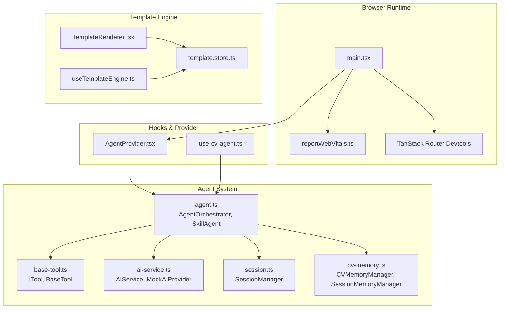
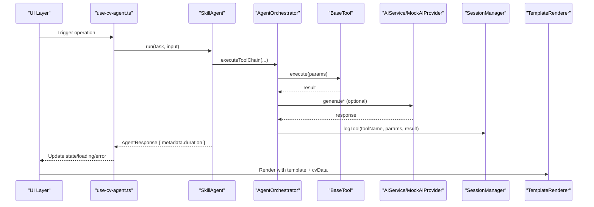
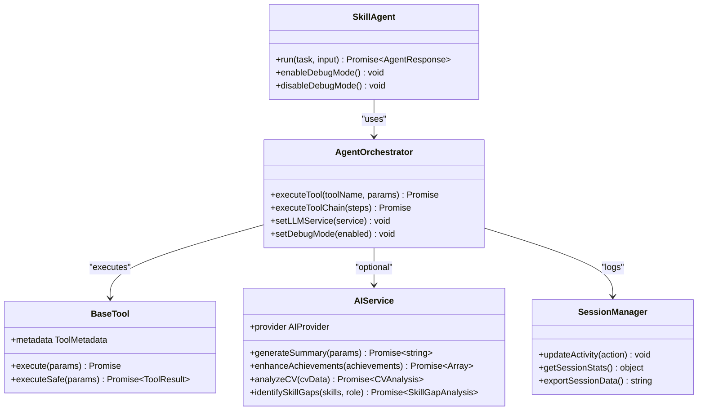
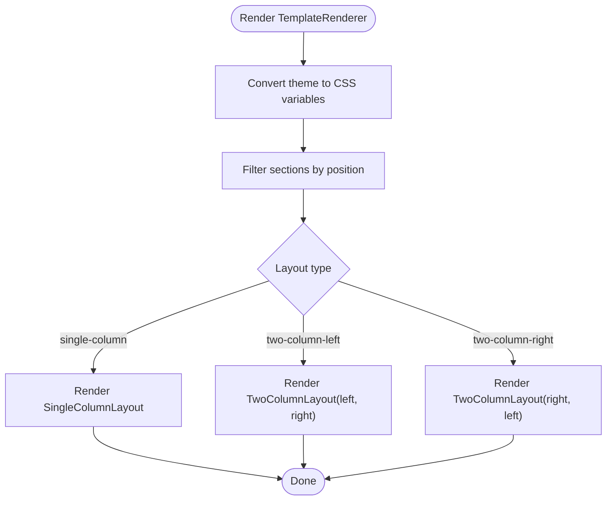
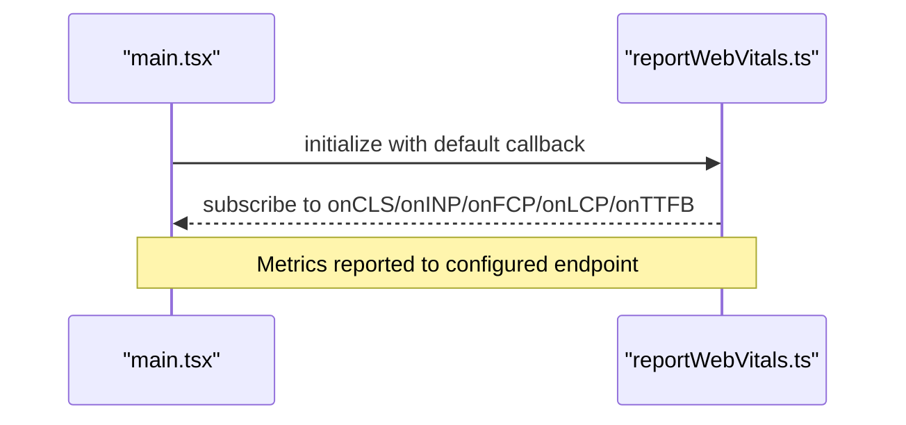
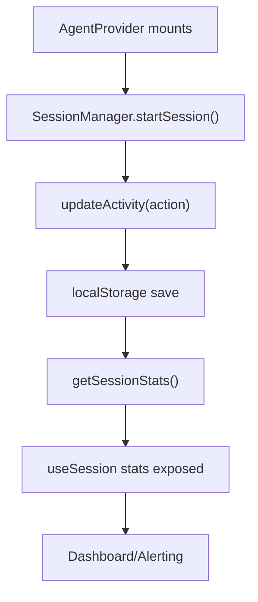
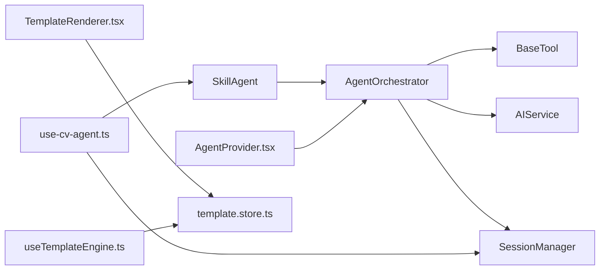

# Profiling and Monitoring

<cite>
**Referenced Files in This Document**
- [src/main.tsx](file://src/main.tsx)
- [src/reportWebVitals.ts](file://src/reportWebVitals.ts)
- [src/agent/core/agent.ts](file://src/agent/core/agent.ts)
- [src/agent/core/session.ts](file://src/agent/core/session.ts)
- [src/agent/memory/cv-memory.ts](file://src/agent/memory/cv-memory.ts)
- [src/agent/services/ai-service.ts](file://src/agent/services/ai-service.ts)
- [src/agent/tools/base-tool.ts](file://src/agent/tools/base-tool.ts)
- [src/hooks/use-cv-agent.ts](file://src/hooks/use-cv-agent.ts)
- [src/components/AgentProvider.tsx](file://src/components/AgentProvider.tsx)
- [src/templates/core/TemplateRenderer.tsx](file://src/templates/core/TemplateRenderer.tsx)
- [src/templates/hooks/useTemplateEngine.ts](file://src/templates/hooks/useTemplateEngine.ts)
- [src/templates/store/template.store.ts](file://src/templates/store/template.store.ts)
- [package.json](file://package.json)
</cite>

## Table of Contents
1. [Introduction](#introduction)
2. [Project Structure](#project-structure)
3. [Core Components](#core-components)
4. [Architecture Overview](#architecture-overview)
5. [Detailed Component Analysis](#detailed-component-analysis)
6. [Dependency Analysis](#dependency-analysis)
7. [Performance Considerations](#performance-considerations)
8. [Troubleshooting Guide](#troubleshooting-guide)
9. [Conclusion](#conclusion)
10. [Appendices](#appendices)

## Introduction
This document provides a comprehensive guide to performance profiling and monitoring strategies for the CV Portfolio Builder. It focuses on:
- Using React DevTools Profiler to identify performance bottlenecks in the agent system and template engine.
- Integrating browser performance tools to measure rendering performance and memory usage.
- Implementing custom performance metrics for AI tool execution times and template rendering durations.
- Establishing monitoring strategies for production environments and performance alerting.
- Benchmarking methodologies to compare optimization improvements and establish performance baselines.

## Project Structure
The application is a React 19 application with modularized agent orchestration, a template engine, and performance instrumentation hooks. Key areas relevant to performance:
- Agent system: Orchestration, tool execution, and session/memory management.
- Template engine: Rendering pipeline and store-driven customization.
- Browser performance integration: Web Vitals reporting and DevTools integration.
- Hooks and providers: Reactive state and global tool registry initialization.

**Diagram sources**
- [src/main.tsx:1-89](file://src/main.tsx#L1-L89)
- [src/reportWebVitals.ts:1-14](file://src/reportWebVitals.ts#L1-L14)
- [src/agent/core/agent.ts:1-414](file://src/agent/core/agent.ts#L1-L414)
- [src/agent/tools/base-tool.ts:1-72](file://src/agent/tools/base-tool.ts#L1-L72)
- [src/agent/services/ai-service.ts:1-174](file://src/agent/services/ai-service.ts#L1-L174)
- [src/agent/core/session.ts:1-204](file://src/agent/core/session.ts#L1-L204)
- [src/agent/memory/cv-memory.ts:1-290](file://src/agent/memory/cv-memory.ts#L1-L290)
- [src/hooks/use-cv-agent.ts:1-182](file://src/hooks/use-cv-agent.ts#L1-L182)
- [src/components/AgentProvider.tsx:1-30](file://src/components/AgentProvider.tsx#L1-L30)
- [src/templates/core/TemplateRenderer.tsx:1-74](file://src/templates/core/TemplateRenderer.tsx#L1-L74)
- [src/templates/store/template.store.ts:1-103](file://src/templates/store/template.store.ts#L1-L103)
- [src/templates/hooks/useTemplateEngine.ts:1-57](file://src/templates/hooks/useTemplateEngine.ts#L1-L57)

**Section sources**
- [src/main.tsx:1-89](file://src/main.tsx#L1-L89)
- [src/reportWebVitals.ts:1-14](file://src/reportWebVitals.ts#L1-L14)
- [package.json:1-60](file://package.json#L1-L60)

## Core Components
- AgentOrchestrator and SkillAgent: Centralized orchestration with built-in timing and logging for tool execution and agent tasks.
- ToolRegistry and BaseTool: Standardized tool execution with safe wrappers and logs.
- AIService and MockAIProvider: Abstraction for AI generation with mock provider suitable for local performance testing.
- SessionManager and memory managers: Persistent session tracking and action logging for performance auditing.
- TemplateRenderer and template store: Efficient rendering pipeline with memoization and reactive store integration.
- Hooks and AgentProvider: Global tool registry exposure and reactive session/state access.

**Section sources**
- [src/agent/core/agent.ts:60-168](file://src/agent/core/agent.ts#L60-L168)
- [src/agent/tools/base-tool.ts:6-49](file://src/agent/tools/base-tool.ts#L6-L49)
- [src/agent/services/ai-service.ts:77-126](file://src/agent/services/ai-service.ts#L77-L126)
- [src/agent/core/session.ts:7-200](file://src/agent/core/session.ts#L7-L200)
- [src/agent/memory/cv-memory.ts:19-227](file://src/agent/memory/cv-memory.ts#L19-L227)
- [src/templates/core/TemplateRenderer.tsx:13-53](file://src/templates/core/TemplateRenderer.tsx#L13-L53)
- [src/templates/store/template.store.ts:19-98](file://src/templates/store/template.store.ts#L19-L98)
- [src/hooks/use-cv-agent.ts:10-101](file://src/hooks/use-cv-agent.ts#L10-L101)
- [src/components/AgentProvider.tsx:12-26](file://src/components/AgentProvider.tsx#L12-L26)

## Architecture Overview
The performance-critical path involves the agent orchestrator invoking tools and AI services, recording session/action logs, and rendering templates via the template engine. Browser performance metrics are wired through Web Vitals.

**Diagram sources**
- [src/hooks/use-cv-agent.ts:17-46](file://src/hooks/use-cv-agent.ts#L17-L46)
- [src/agent/core/agent.ts:188-281](file://src/agent/core/agent.ts#L188-L281)
- [src/agent/core/agent.ts:78-127](file://src/agent/core/agent.ts#L78-L127)
- [src/agent/tools/base-tool.ts:30-48](file://src/agent/tools/base-tool.ts#L30-L48)
- [src/agent/services/ai-service.ts:95-125](file://src/agent/services/ai-service.ts#L95-L125)
- [src/agent/core/session.ts:177-193](file://src/agent/core/session.ts#L177-L193)
- [src/templates/core/TemplateRenderer.tsx:13-53](file://src/templates/core/TemplateRenderer.tsx#L13-L53)

## Detailed Component Analysis

### Agent System Profiling
- Built-in timing: AgentOrchestrator measures per-tool execution and SkillAgent measures end-to-end task duration.
- Logging: sessionMemory logs tool invocations with parameters and results for post-hoc analysis.
- Debug mode: Toggle verbose logging for diagnosing slow tools or unexpected failures.
- AI provider abstraction: AIService enables swapping providers; MockAIProvider simulates latency for local profiling.

**Diagram sources**
- [src/agent/core/agent.ts:60-168](file://src/agent/core/agent.ts#L60-L168)
- [src/agent/tools/base-tool.ts:6-49](file://src/agent/tools/base-tool.ts#L6-L49)
- [src/agent/services/ai-service.ts:77-126](file://src/agent/services/ai-service.ts#L77-L126)
- [src/agent/core/session.ts:7-200](file://src/agent/core/session.ts#L7-L200)

**Section sources**
- [src/agent/core/agent.ts:78-127](file://src/agent/core/agent.ts#L78-L127)
- [src/agent/core/agent.ts:188-281](file://src/agent/core/agent.ts#L188-L281)
- [src/agent/tools/base-tool.ts:30-48](file://src/agent/tools/base-tool.ts#L30-L48)
- [src/agent/services/ai-service.ts:54-72](file://src/agent/services/ai-service.ts#L54-L72)
- [src/agent/core/session.ts:177-193](file://src/agent/core/session.ts#L177-L193)

### Template Engine Profiling
- Memoized renderer: TemplateRenderer is wrapped with React.memo to avoid unnecessary re-renders.
- Layout selection: Switching layouts and section filtering occur off-DOM; heavy work is minimal.
- Store-driven customization: useTemplateEngine reads from template.store and registry; batching updates reduces render churn.

**Diagram sources**
- [src/templates/core/TemplateRenderer.tsx:13-53](file://src/templates/core/TemplateRenderer.tsx#L13-L53)

**Section sources**
- [src/templates/core/TemplateRenderer.tsx:13-53](file://src/templates/core/TemplateRenderer.tsx#L13-L53)
- [src/templates/hooks/useTemplateEngine.ts:10-56](file://src/templates/hooks/useTemplateEngine.ts#L10-L56)
- [src/templates/store/template.store.ts:22-98](file://src/templates/store/template.store.ts#L22-L98)

### Browser Performance Tools Integration
- Web Vitals: reportWebVitals integrates CLS, INP, FCP, LCP, and TTFB to capture core UX metrics.
- Devtools: TanStack Router Devtools are included in the root layout for runtime inspection.

**Diagram sources**
- [src/main.tsx:85-88](file://src/main.tsx#L85-L88)
- [src/reportWebVitals.ts:1-14](file://src/reportWebVitals.ts#L1-L14)

**Section sources**
- [src/main.tsx:85-88](file://src/main.tsx#L85-L88)
- [src/reportWebVitals.ts:1-14](file://src/reportWebVitals.ts#L1-L14)

### Custom Performance Metrics
- Agent-level: AgentResponse.metadata.duration captures total task time; per-tool durations are logged via sessionMemory.
- Tool-level: BaseTool.executeSafe provides structured results; combine with sessionMemory logs for granular analysis.
- AI-level: AIService wraps provider calls; instrument provider.generateText/generateJSON for latency breakdowns.
- Template-level: Measure TemplateRenderer render time around mount/unmount or via wrapper component around the renderer.

Implementation anchors:
- Agent task duration: [src/agent/core/agent.ts:257-268](file://src/agent/core/agent.ts#L257-L268)
- Per-tool timing and logging: [src/agent/core/agent.ts:91-127](file://src/agent/core/agent.ts#L91-L127), [src/agent/core/agent.ts:108-110](file://src/agent/core/agent.ts#L108-L110)
- Session logs: [src/agent/core/session.ts:177-193](file://src/agent/core/session.ts#L177-L193), [src/agent/memory/cv-memory.ts:177-193](file://src/agent/memory/cv-memory.ts#L177-L193)
- Tool result type: [src/agent/tools/base-tool.ts:54-71](file://src/agent/tools/base-tool.ts#L54-L71)
- AI provider interface: [src/agent/services/ai-service.ts:5-24](file://src/agent/services/ai-service.ts#L5-L24)

**Section sources**
- [src/agent/core/agent.ts:91-127](file://src/agent/core/agent.ts#L91-L127)
- [src/agent/core/agent.ts:257-268](file://src/agent/core/agent.ts#L257-L268)
- [src/agent/core/session.ts:177-193](file://src/agent/core/session.ts#L177-L193)
- [src/agent/memory/cv-memory.ts:177-193](file://src/agent/memory/cv-memory.ts#L177-L193)
- [src/agent/tools/base-tool.ts:54-71](file://src/agent/tools/base-tool.ts#L54-L71)
- [src/agent/services/ai-service.ts:5-24](file://src/agent/services/ai-service.ts#L5-L24)

### Production Monitoring and Alerting
- Session statistics: Use sessionManager.getSessionStats() to expose duration and action counts for dashboards.
- Exportable session data: Use sessionManager.exportSessionData() for diagnostics and trend analysis.
- Local storage persistence: SessionManager persists sessions; monitor for anomalies in session frequency/duration.
- Hooks for UI: useSession exposes stats and lifecycle controls for real-time monitoring.

**Diagram sources**
- [src/components/AgentProvider.tsx:13-26](file://src/components/AgentProvider.tsx#L13-L26)
- [src/agent/core/session.ts:33-70](file://src/agent/core/session.ts#L33-L70)
- [src/agent/core/session.ts:129-151](file://src/agent/core/session.ts#L129-L151)
- [src/hooks/use-cv-agent.ts:154-181](file://src/hooks/use-cv-agent.ts#L154-L181)

**Section sources**
- [src/agent/core/session.ts:129-151](file://src/agent/core/session.ts#L129-L151)
- [src/agent/core/session.ts:154-170](file://src/agent/core/session.ts#L154-L170)
- [src/hooks/use-cv-agent.ts:154-181](file://src/hooks/use-cv-agent.ts#L154-L181)

### Benchmarking Methodologies
- Baseline establishment: Run representative workloads (e.g., analyze_cv, optimize_cv) with Web Vitals and agent metadata.duration.
- Variability control: Use deterministic MockAIProvider to eliminate external variability during controlled tests.
- Comparative runs: Re-run with and without optimizations (e.g., memoization, store derivations, provider caching) and compare distributions of durations and memory deltas.
- Regression detection: Track p95/p99 of agent task durations and template render times; alert on sustained increases.

[No sources needed since this section provides general guidance]

## Dependency Analysis
- Agent depends on ToolRegistry, BaseTool, AIService, and SessionManager.
- Hooks depend on AgentProvider for global registry and on SessionManager for stats.
- Template engine depends on template.store and registry for templates.

**Diagram sources**
- [src/agent/core/agent.ts:173-376](file://src/agent/core/agent.ts#L173-L376)
- [src/agent/tools/base-tool.ts:15-49](file://src/agent/tools/base-tool.ts#L15-L49)
- [src/agent/services/ai-service.ts:77-126](file://src/agent/services/ai-service.ts#L77-L126)
- [src/agent/core/session.ts:7-200](file://src/agent/core/session.ts#L7-L200)
- [src/hooks/use-cv-agent.ts:10-101](file://src/hooks/use-cv-agent.ts#L10-L101)
- [src/components/AgentProvider.tsx:12-26](file://src/components/AgentProvider.tsx#L12-L26)
- [src/templates/core/TemplateRenderer.tsx:13-53](file://src/templates/core/TemplateRenderer.tsx#L13-L53)
- [src/templates/hooks/useTemplateEngine.ts:10-56](file://src/templates/hooks/useTemplateEngine.ts#L10-L56)
- [src/templates/store/template.store.ts:19-98](file://src/templates/store/template.store.ts#L19-L98)

**Section sources**
- [src/agent/core/agent.ts:173-376](file://src/agent/core/agent.ts#L173-L376)
- [src/agent/tools/base-tool.ts:15-49](file://src/agent/tools/base-tool.ts#L15-L49)
- [src/agent/services/ai-service.ts:77-126](file://src/agent/services/ai-service.ts#L77-L126)
- [src/agent/core/session.ts:7-200](file://src/agent/core/session.ts#L7-L200)
- [src/hooks/use-cv-agent.ts:10-101](file://src/hooks/use-cv-agent.ts#L10-L101)
- [src/components/AgentProvider.tsx:12-26](file://src/components/AgentProvider.tsx#L12-L26)
- [src/templates/core/TemplateRenderer.tsx:13-53](file://src/templates/core/TemplateRenderer.tsx#L13-L53)
- [src/templates/hooks/useTemplateEngine.ts:10-56](file://src/templates/hooks/useTemplateEngine.ts#L10-L56)
- [src/templates/store/template.store.ts:19-98](file://src/templates/store/template.store.ts#L19-L98)

## Performance Considerations
- Prefer memoization: TemplateRenderer is already memoized; ensure downstream components leverage stable props.
- Minimize re-renders: Use template.store derivations and selective updates to reduce render cycles.
- Instrument AI calls: Wrap provider.generateText/generateJSON with timing and cache results where appropriate.
- Monitor memory: Use browser devtools Heap snapshots and the provided heap delta script to detect leaks or growth.
- Use DevTools Profiler: Profile long tasks and identify expensive renders in the agent and template stacks.

[No sources needed since this section provides general guidance]

## Troubleshooting Guide
- Slow agent tasks: Inspect AgentResponse.metadata.duration and sessionMemory logs for the longest-running tools.
- UI jank: Use React DevTools Profiler to locate components with long commit phases; verify TemplateRenderer props stability.
- Memory growth: Take baseline and after snapshots; use the heap delta script to compare deltas and focus on top contributors.
- Session anomalies: Export session data and review action frequency and durations; clear session if stale state is suspected.

**Section sources**
- [src/agent/core/agent.ts:257-268](file://src/agent/core/agent.ts#L257-L268)
- [src/agent/core/session.ts:154-170](file://src/agent/core/session.ts#L154-L170)
- [src/agent/core/session.ts:129-151](file://src/agent/core/session.ts#L129-L151)

## Conclusion
By combining built-in agent timing, session logging, Web Vitals instrumentation, and targeted React DevTools Profiler usage, the CV Portfolio Builder can systematically identify and address performance bottlenecks. The template engine’s memoization and store-driven design support efficient rendering, while hooks and providers enable reactive monitoring and alerting. Adopting the benchmarking and troubleshooting practices outlined here will help maintain consistent performance across development and production.

## Appendices

### Appendix A: React DevTools Profiler Usage
- Agent stack: Profile user-triggered operations (e.g., run analysis, optimize CV) to identify slow tools or layout switches.
- Template engine: Focus on TemplateRenderer and its consumers; ensure stable props to maximize memoization benefits.

[No sources needed since this section provides general guidance]

### Appendix B: Browser Performance Tools
- Web Vitals: Integrate reporting to observe CLS, INP, FCP, LCP, TTFB; correlate with agent task durations.
- Memory: Use Performance panel snapshots and the heap delta script to quantify memory deltas across operations.

**Section sources**
- [src/reportWebVitals.ts:1-14](file://src/reportWebVitals.ts#L1-L14)
- [.agents/skills/openclaw-test-heap-leaks/scripts/heapsnapshot-delta.mjs:1-244](file://.agents/skills/openclaw-test-heap-leaks/scripts/heapsnapshot-delta.mjs#L1-L244)

### Appendix C: Production Monitoring Checklist
- Expose session stats via useSession and dashboard widgets.
- Persist and export session data for periodic audits.
- Set up alerts for sustained increases in agent task durations or template render times.
- Periodically review tool logs and AI provider latencies.

**Section sources**
- [src/hooks/use-cv-agent.ts:154-181](file://src/hooks/use-cv-agent.ts#L154-L181)
- [src/agent/core/session.ts:129-151](file://src/agent/core/session.ts#L129-L151)
- [src/agent/core/session.ts:154-170](file://src/agent/core/session.ts#L154-L170)