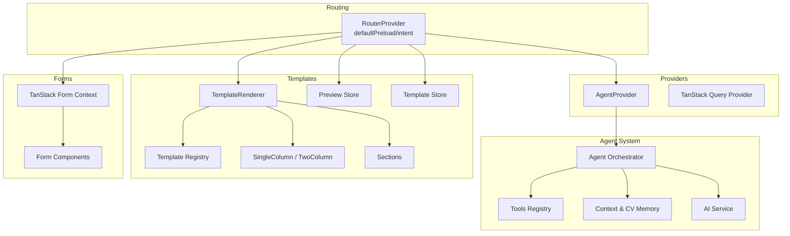
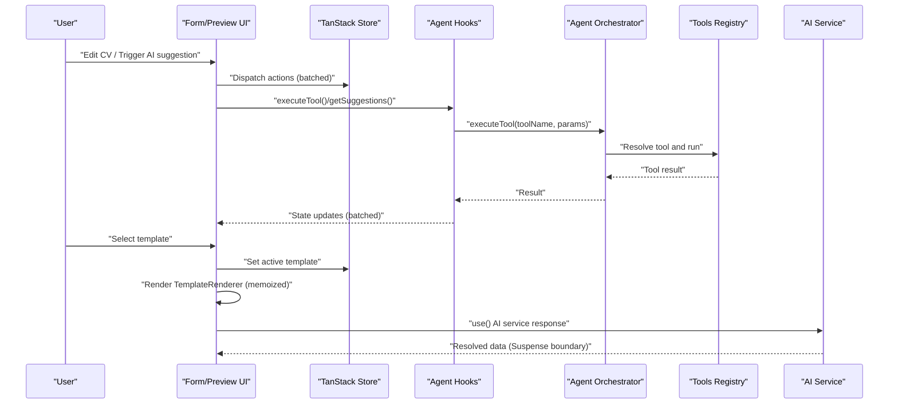
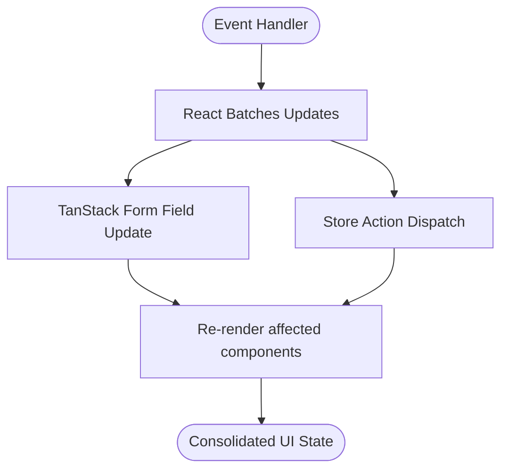
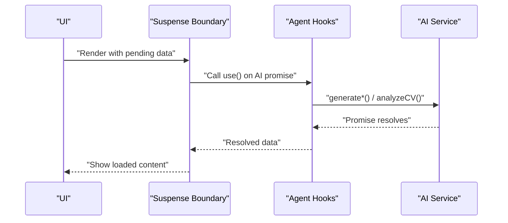
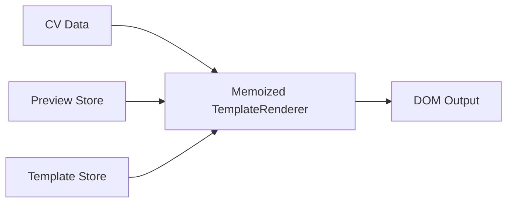
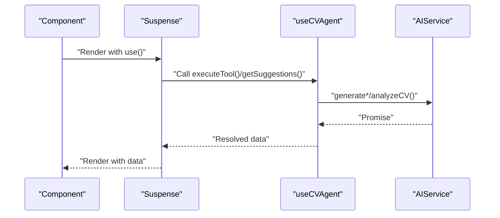
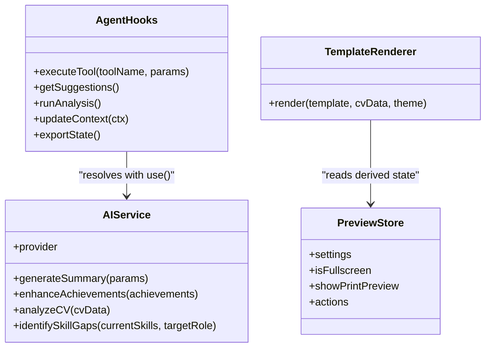
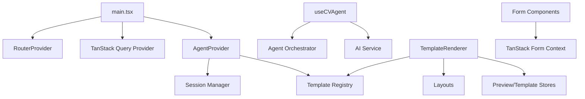

# React 19 Concurrent Features

<cite>
**Referenced Files in This Document**
- [src/main.tsx](file://src/main.tsx)
- [src/App.tsx](file://src/App.tsx)
- [src/agent/services/ai-service.ts](file://src/agent/services/ai-service.ts)
- [src/agent/core/agent.ts](file://src/agent/core/agent.ts)
- [src/agent/core/session.ts](file://src/agent/core/session.ts)
- [src/agent/memory/context-manager.ts](file://src/agent/memory/context-manager.ts)
- [src/agent/memory/cv-memory.ts](file://src/agent/memory/cv-memory.ts)
- [src/agent/tools/base-tool.ts](file://src/agent/tools/base-tool.ts)
- [src/agent/tools/experience-tools.ts](file://src/agent/tools/experience-tools.ts)
- [src/agent/tools/profile-tools.ts](file://src/agent/tools/profile-tools.ts)
- [src/agent/tools/project-tools.ts](file://src/agent/tools/project-tools.ts)
- [src/agent/tools/skills-tools.ts](file://src/agent/tools/skills-tools.ts)
- [src/agent/tools/analysis-tools.ts](file://src/agent/tools/analysis-tools.ts)
- [src/components/AgentProvider.tsx](file://src/components/AgentProvider.tsx)
- [src/hooks/use-cv-agent.ts](file://src/hooks/use-cv-agent.ts)
- [src/templates/core/TemplateRenderer.tsx](file://src/templates/core/TemplateRenderer.tsx)
- [src/templates/core/template-registry.ts](file://src/templates/core/template-registry.ts)
- [src/templates/hooks/useCVPreview.ts](file://src/templates/hooks/useCVPreview.ts)
- [src/templates/hooks/useTemplateEngine.ts](file://src/templates/hooks/useTemplateEngine.ts)
- [src/templates/store/preview.store.ts](file://src/templates/store/preview.store.ts)
- [src/templates/store/template.store.ts](file://src/templates/store/template.store.ts)
- [src/templates/layouts/SingleColumnLayout.tsx](file://src/templates/layouts/SingleColumnLayout.tsx)
- [src/templates/layouts/TwoColumnLayout.tsx](file://src/templates/layouts/TwoColumnLayout.tsx)
- [src/templates/sections/index.ts](file://src/templates/sections/index.ts)
- [src/components/demo.FormComponents.tsx](file://src/components/demo.FormComponents.tsx)
- [src/lib/demo-store.ts](file://src/lib/demo-store.ts)
- [package.json](file://package.json)
</cite>

## Table of Contents
1. [Introduction](#introduction)
2. [Project Structure](#project-structure)
3. [Core Components](#core-components)
4. [Architecture Overview](#architecture-overview)
5. [Detailed Component Analysis](#detailed-component-analysis)
6. [Dependency Analysis](#dependency-analysis)
7. [Performance Considerations](#performance-considerations)
8. [Troubleshooting Guide](#troubleshooting-guide)
9. [Conclusion](#conclusion)
10. [Appendices](#appendices)

## Introduction
This document explains how React 19 concurrent features are implemented and leveraged in the CV Portfolio Builder. It focuses on automatic batching for state updates and form submissions, suspense boundaries for AI tool and template rendering, concurrent rendering benefits for real-time CV updates and preview, and the use of the use() hook pattern for AI service responses and template data fetching. Practical examples demonstrate applying these features in the agent system and template engine, along with performance implications for memory and CPU.

## Project Structure
The application is organized around:
- Agent system: orchestration, tools, memory, and AI service integration
- Templates: renderer, registry, layouts, sections, and stores for preview and customization
- Forms: TanStack Form integration with reactive updates
- Routing and providers: TanStack Router with TanStack Query and AgentProvider

**Diagram sources**
- [src/main.tsx:29-65](file://src/main.tsx#L29-L65)
- [src/components/AgentProvider.tsx:12-26](file://src/components/AgentProvider.tsx#L12-L26)
- [src/agent/core/agent.ts](file://src/agent/core/agent.ts)
- [src/agent/tools/base-tool.ts](file://src/agent/tools/base-tool.ts)
- [src/agent/memory/context-manager.ts](file://src/agent/memory/context-manager.ts)
- [src/agent/services/ai-service.ts:77-126](file://src/agent/services/ai-service.ts#L77-L126)
- [src/templates/core/TemplateRenderer.tsx:13-53](file://src/templates/core/TemplateRenderer.tsx#L13-L53)
- [src/templates/core/template-registry.ts](file://src/templates/core/template-registry.ts)
- [src/templates/layouts/SingleColumnLayout.tsx](file://src/templates/layouts/SingleColumnLayout.tsx)
- [src/templates/layouts/TwoColumnLayout.tsx](file://src/templates/layouts/TwoColumnLayout.tsx)
- [src/templates/hooks/useCVPreview.ts:9-59](file://src/templates/hooks/useCVPreview.ts#L9-L59)
- [src/templates/hooks/useTemplateEngine.ts:10-56](file://src/templates/hooks/useTemplateEngine.ts#L10-L56)
- [src/components/demo.FormComponents.tsx:13-159](file://src/components/demo.FormComponents.tsx#L13-L159)

**Section sources**
- [src/main.tsx:29-83](file://src/main.tsx#L29-L83)
- [src/App.tsx:1-8](file://src/App.tsx#L1-L8)

## Core Components
- Router and Providers: The root config enables concurrent features via default preload strategies and structural sharing, and wraps the app with providers for TanStack Query and Agent state.
- Agent System: Central orchestrator coordinates tools, manages session and context, and integrates with the AI service abstraction.
- Templates: Renderer composes layouts and sections, driven by stores for preview and template selection.
- Forms: TanStack Form components subscribe to state and render with minimal re-renders.

Key implementation references:
- Router defaults and provider composition: [src/main.tsx:56-82](file://src/main.tsx#L56-L82)
- AgentProvider initialization: [src/components/AgentProvider.tsx:12-26](file://src/components/AgentProvider.tsx#L12-L26)
- AI service interface and implementation: [src/agent/services/ai-service.ts:17-126](file://src/agent/services/ai-service.ts#L17-L126)
- Template renderer and layout switching: [src/templates/core/TemplateRenderer.tsx:13-53](file://src/templates/core/TemplateRenderer.tsx#L13-L53)
- Preview and template stores: [src/templates/store/preview.store.ts:25-95](file://src/templates/store/preview.store.ts#L25-L95), [src/templates/store/template.store.ts:20-98](file://src/templates/store/template.store.ts#L20-L98)
- Form components subscribing to state: [src/components/demo.FormComponents.tsx:13-159](file://src/components/demo.FormComponents.tsx#L13-L159)

**Section sources**
- [src/main.tsx:56-82](file://src/main.tsx#L56-L82)
- [src/components/AgentProvider.tsx:12-26](file://src/components/AgentProvider.tsx#L12-L26)
- [src/agent/services/ai-service.ts:17-126](file://src/agent/services/ai-service.ts#L17-L126)
- [src/templates/core/TemplateRenderer.tsx:13-53](file://src/templates/core/TemplateRenderer.tsx#L13-L53)
- [src/templates/store/preview.store.ts:25-95](file://src/templates/store/preview.store.ts#L25-L95)
- [src/templates/store/template.store.ts:20-98](file://src/templates/store/template.store.ts#L20-L98)
- [src/components/demo.FormComponents.tsx:13-159](file://src/components/demo.FormComponents.tsx#L13-L159)

## Architecture Overview
The system uses React 19’s concurrent capabilities:
- Automatic batching: Updates from forms and stores are batched by React, reducing unnecessary renders.
- Preloading: Router preloads routes based on user intent, improving perceived performance.
- Structural sharing: Default structural sharing avoids deep comparisons and improves memoization.
- Suspense boundaries: Pending AI responses and template data can be wrapped in Suspense boundaries to show loading states.
- use() hook pattern: Resolve promises returned by AI service and template registry in render phase for declarative data fetching.

**Diagram sources**
- [src/main.tsx:56-82](file://src/main.tsx#L56-L82)
- [src/hooks/use-cv-agent.ts:17-100](file://src/hooks/use-cv-agent.ts#L17-L100)
- [src/agent/core/agent.ts](file://src/agent/core/agent.ts)
- [src/agent/tools/base-tool.ts](file://src/agent/tools/base-tool.ts)
- [src/agent/services/ai-service.ts:77-126](file://src/agent/services/ai-service.ts#L77-L126)
- [src/templates/core/TemplateRenderer.tsx:13-53](file://src/templates/core/TemplateRenderer.tsx#L13-L53)

## Detailed Component Analysis

### Automatic Batching Strategies for State Updates and Form Submissions
- Batching occurs automatically during event handlers and microtasks. In this codebase, TanStack Form components subscribe to state and trigger updates that React batches. See field components subscribing to store state and updating values.
- Stores (preview and template) expose action functions that update state immutably; these updates are batched by React and consumed by hooks that derive state.

Practical references:
- Field components subscribing to form state: [src/components/demo.FormComponents.tsx:13-159](file://src/components/demo.FormComponents.tsx#L13-L159)
- Preview store actions: [src/templates/store/preview.store.ts:40-95](file://src/templates/store/preview.store.ts#L40-L95)
- Template store actions: [src/templates/store/template.store.ts:46-98](file://src/templates/store/template.store.ts#L46-L98)

**Diagram sources**
- [src/components/demo.FormComponents.tsx:13-159](file://src/components/demo.FormComponents.tsx#L13-L159)
- [src/templates/store/preview.store.ts:40-95](file://src/templates/store/preview.store.ts#L40-L95)
- [src/templates/store/template.store.ts:46-98](file://src/templates/store/template.store.ts#L46-L98)

**Section sources**
- [src/components/demo.FormComponents.tsx:13-159](file://src/components/demo.FormComponents.tsx#L13-L159)
- [src/templates/store/preview.store.ts:40-95](file://src/templates/store/preview.store.ts#L40-L95)
- [src/templates/store/template.store.ts:46-98](file://src/templates/store/template.store.ts#L46-L98)

### Suspense Boundaries for AI Tool Loading States and Template Rendering
- Pending AI responses: Wrap AI service calls in Suspense boundaries. The agent hooks orchestrate tool execution and return promises; wrap these in Suspense to avoid blocking the UI.
- Template data fetching: The template engine resolves active templates from a registry. If templates are fetched asynchronously, wrap the renderer in Suspense to show loading states while templates are being resolved.

Recommended implementation pattern:
- Create a Suspense boundary around the area where AI service responses or template registry data are used.
- Use the use() hook pattern to resolve promises directly in render phase for declarative data fetching.

References:
- AI service interface and methods returning promises: [src/agent/services/ai-service.ts:77-126](file://src/agent/services/ai-service.ts#L77-L126)
- Template renderer consuming template and CV data: [src/templates/core/TemplateRenderer.tsx:13-53](file://src/templates/core/TemplateRenderer.tsx#L13-L53)
- Template registry resolution: [src/templates/core/template-registry.ts](file://src/templates/core/template-registry.ts)

**Diagram sources**
- [src/agent/services/ai-service.ts:77-126](file://src/agent/services/ai-service.ts#L77-L126)
- [src/hooks/use-cv-agent.ts:17-100](file://src/hooks/use-cv-agent.ts#L17-L100)

**Section sources**
- [src/agent/services/ai-service.ts:77-126](file://src/agent/services/ai-service.ts#L77-L126)
- [src/templates/core/TemplateRenderer.tsx:13-53](file://src/templates/core/TemplateRenderer.tsx#L13-L53)
- [src/templates/core/template-registry.ts](file://src/templates/core/template-registry.ts)

### Concurrent Rendering Benefits for Real-Time CV Updates and Preview System
- Memoized renderer: TemplateRenderer is memoized and switches layouts based on template metadata, minimizing re-renders when data is unchanged.
- Reactive stores: Preview and template stores use derived state to compute zoom, mode, and active template, enabling efficient re-renders only when relevant state changes.
- Router preload: Routes are preloaded based on user intent, improving navigation responsiveness.

References:
- Memoized renderer: [src/templates/core/TemplateRenderer.tsx:13-53](file://src/templates/core/TemplateRenderer.tsx#L13-L53)
- Preview derived state: [src/templates/store/preview.store.ts:27-37](file://src/templates/store/preview.store.ts#L27-L37)
- Template derived state: [src/templates/store/template.store.ts:22-43](file://src/templates/store/template.store.ts#L22-L43)
- Router defaults: [src/main.tsx:56-65](file://src/main.tsx#L56-L65)

**Diagram sources**
- [src/templates/core/TemplateRenderer.tsx:13-53](file://src/templates/core/TemplateRenderer.tsx#L13-L53)
- [src/templates/store/preview.store.ts:25-95](file://src/templates/store/preview.store.ts#L25-L95)
- [src/templates/store/template.store.ts:20-98](file://src/templates/store/template.store.ts#L20-L98)

**Section sources**
- [src/templates/core/TemplateRenderer.tsx:13-53](file://src/templates/core/TemplateRenderer.tsx#L13-L53)
- [src/templates/store/preview.store.ts:25-95](file://src/templates/store/preview.store.ts#L25-L95)
- [src/templates/store/template.store.ts:20-98](file://src/templates/store/template.store.ts#L20-L98)
- [src/main.tsx:56-65](file://src/main.tsx#L56-L65)

### Use of use() Hook for AI Service Responses and Template Data Fetching
- Pattern: In render phase, call use() on a promise returned by an AI service method or template registry lookup. This enables declarative data fetching and integrates with Suspense boundaries.
- Agent hooks orchestrate tool execution and return results; wrap these in Suspense and use use() to resolve promises.

References:
- AI service methods returning promises: [src/agent/services/ai-service.ts:95-125](file://src/agent/services/ai-service.ts#L95-L125)
- Agent hooks returning promises: [src/hooks/use-cv-agent.ts:17-100](file://src/hooks/use-cv-agent.ts#L17-L100)
- Template registry resolution: [src/templates/core/template-registry.ts](file://src/templates/core/template-registry.ts)

**Diagram sources**
- [src/hooks/use-cv-agent.ts:17-100](file://src/hooks/use-cv-agent.ts#L17-L100)
- [src/agent/services/ai-service.ts:95-125](file://src/agent/services/ai-service.ts#L95-L125)

**Section sources**
- [src/agent/services/ai-service.ts:95-125](file://src/agent/services/ai-service.ts#L95-L125)
- [src/hooks/use-cv-agent.ts:17-100](file://src/hooks/use-cv-agent.ts#L17-L100)
- [src/templates/core/template-registry.ts](file://src/templates/core/template-registry.ts)

### Practical Examples: Implementing Concurrent Features in the Agent System and Template Engine
- Agent system:
  - Use Suspense around AI tool execution. The agent hooks manage loading and error states; wrap the consumer component in Suspense to prevent fallbacks from blocking the UI.
  - Apply use() in render phase to resolve tool results and suggestions.
  - References: [src/hooks/use-cv-agent.ts:17-100](file://src/hooks/use-cv-agent.ts#L17-L100), [src/agent/tools/base-tool.ts](file://src/agent/tools/base-tool.ts), [src/agent/core/agent.ts](file://src/agent/core/agent.ts)
- Template engine:
  - Wrap TemplateRenderer in Suspense when templates are fetched asynchronously.
  - Use use() to resolve active template from registry; update preview store to reflect changes without extra renders.
  - References: [src/templates/core/TemplateRenderer.tsx:13-53](file://src/templates/core/TemplateRenderer.tsx#L13-L53), [src/templates/hooks/useTemplateEngine.ts:10-56](file://src/templates/hooks/useTemplateEngine.ts#L10-L56), [src/templates/store/template.store.ts:46-98](file://src/templates/store/template.store.ts#L46-L98)

**Diagram sources**
- [src/agent/services/ai-service.ts:77-126](file://src/agent/services/ai-service.ts#L77-L126)
- [src/hooks/use-cv-agent.ts:17-100](file://src/hooks/use-cv-agent.ts#L17-L100)
- [src/templates/core/TemplateRenderer.tsx:13-53](file://src/templates/core/TemplateRenderer.tsx#L13-L53)
- [src/templates/store/preview.store.ts:25-95](file://src/templates/store/preview.store.ts#L25-L95)

**Section sources**
- [src/hooks/use-cv-agent.ts:17-100](file://src/hooks/use-cv-agent.ts#L17-L100)
- [src/agent/tools/base-tool.ts](file://src/agent/tools/base-tool.ts)
- [src/agent/core/agent.ts](file://src/agent/core/agent.ts)
- [src/agent/services/ai-service.ts:77-126](file://src/agent/services/ai-service.ts#L77-L126)
- [src/templates/core/TemplateRenderer.tsx:13-53](file://src/templates/core/TemplateRenderer.tsx#L13-L53)
- [src/templates/hooks/useTemplateEngine.ts:10-56](file://src/templates/hooks/useTemplateEngine.ts#L10-L56)
- [src/templates/store/template.store.ts:46-98](file://src/templates/store/template.store.ts#L46-L98)

## Dependency Analysis
- Router and providers: Router is configured with default preload and structural sharing; providers wrap the app with TanStack Query and AgentProvider.
- Agent system: AgentProvider initializes the tool registry and session manager; agent hooks depend on orchestrator and memory managers.
- Templates: TemplateRenderer depends on registry and layout components; stores drive reactive updates.
- Forms: Form components depend on TanStack Form context and subscribe to store state.

**Diagram sources**
- [src/main.tsx:56-82](file://src/main.tsx#L56-L82)
- [src/components/AgentProvider.tsx:12-26](file://src/components/AgentProvider.tsx#L12-L26)
- [src/hooks/use-cv-agent.ts:17-100](file://src/hooks/use-cv-agent.ts#L17-L100)
- [src/agent/services/ai-service.ts:77-126](file://src/agent/services/ai-service.ts#L77-L126)
- [src/templates/core/TemplateRenderer.tsx:13-53](file://src/templates/core/TemplateRenderer.tsx#L13-L53)

**Section sources**
- [src/main.tsx:56-82](file://src/main.tsx#L56-L82)
- [src/components/AgentProvider.tsx:12-26](file://src/components/AgentProvider.tsx#L12-L26)
- [src/hooks/use-cv-agent.ts:17-100](file://src/hooks/use-cv-agent.ts#L17-L100)
- [src/agent/services/ai-service.ts:77-126](file://src/agent/services/ai-service.ts#L77-L126)
- [src/templates/core/TemplateRenderer.tsx:13-53](file://src/templates/core/TemplateRenderer.tsx#L13-L53)

## Performance Considerations
- Batching: Automatic batching reduces redundant renders during form edits and store updates. Keep updates granular to minimize work.
- Preloading: Router default preload improves navigation responsiveness; tune preload stale time for optimal cache behavior.
- Memoization: TemplateRenderer is memoized; ensure props change only when necessary to avoid re-renders.
- Suspense boundaries: Use Suspense to avoid blocking the UI during AI and template fetches; combine with use() for declarative data fetching.
- Stores: Use derived state to compute values; mount derived states to avoid recomputing unnecessarily.
- Memory: Avoid retaining large intermediate objects in closures; prefer passing data as props and using stores for global state.
- CPU: Keep heavy computations off the render thread; use web workers if needed for intensive AI tasks.

[No sources needed since this section provides general guidance]

## Troubleshooting Guide
- AI service latency: Wrap AI calls in Suspense and use loading states from agent hooks to avoid blocking UI.
- Template rendering delays: If templates are fetched asynchronously, ensure Suspense boundary is present around TemplateRenderer.
- Store updates: Verify actions update state immutably and that derived state is mounted to avoid stale values.
- Form submission: Ensure form components subscribe to state and that submit buttons disable during isSubmitting.

**Section sources**
- [src/agent/services/ai-service.ts:77-126](file://src/agent/services/ai-service.ts#L77-L126)
- [src/hooks/use-cv-agent.ts:17-100](file://src/hooks/use-cv-agent.ts#L17-L100)
- [src/templates/core/TemplateRenderer.tsx:13-53](file://src/templates/core/TemplateRenderer.tsx#L13-L53)
- [src/templates/store/preview.store.ts:25-95](file://src/templates/store/preview.store.ts#L25-L95)
- [src/templates/store/template.store.ts:20-98](file://src/templates/store/template.store.ts#L20-L98)
- [src/components/demo.FormComponents.tsx:13-159](file://src/components/demo.FormComponents.tsx#L13-L159)

## Conclusion
React 19 concurrent features are integrated throughout the CV Portfolio Builder via automatic batching, preloading, structural sharing, and Suspense boundaries. The agent system and template engine leverage these capabilities to deliver responsive, real-time experiences. By adopting the use() hook pattern for declarative data fetching and ensuring proper Suspense boundaries, the application achieves smooth interactions for AI-assisted CV editing and dynamic template rendering.

[No sources needed since this section summarizes without analyzing specific files]

## Appendices
- React version: The project uses React 19.2.4, enabling concurrent features such as automatic batching and use() hook integration.
- Router configuration: Router defaults include preload and structural sharing to optimize performance.

**Section sources**
- [package.json](file://package.json)
- [src/main.tsx:56-65](file://src/main.tsx#L56-L65)