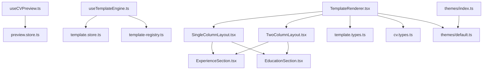
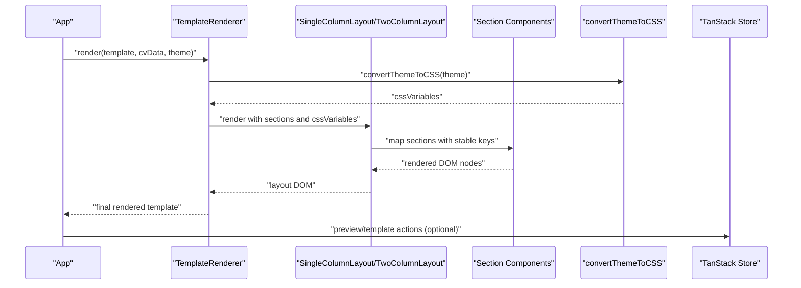
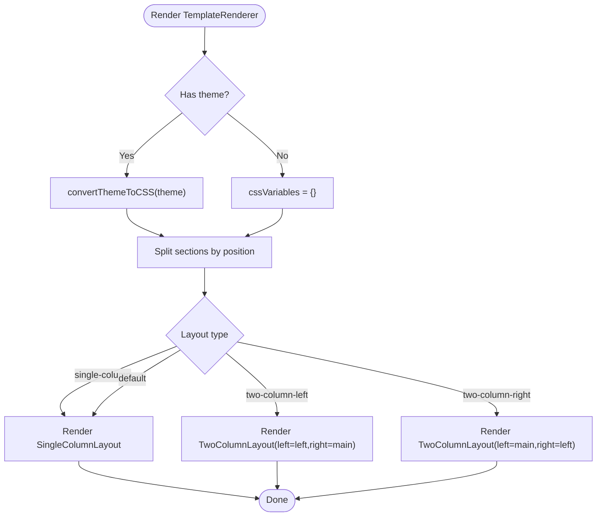
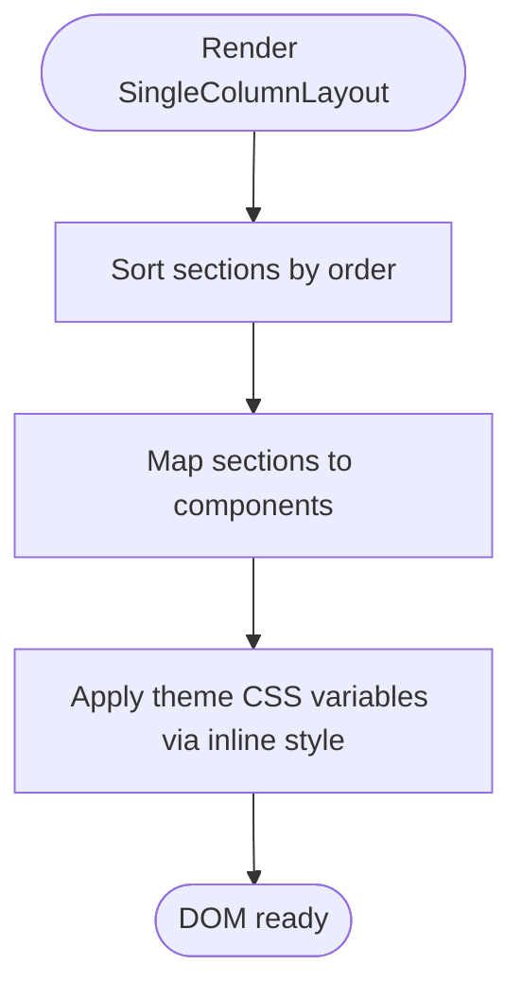
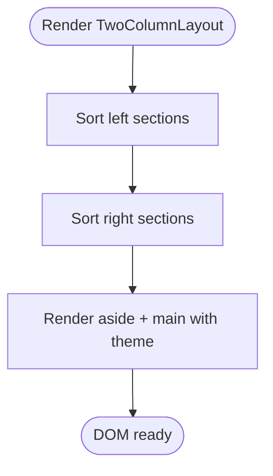
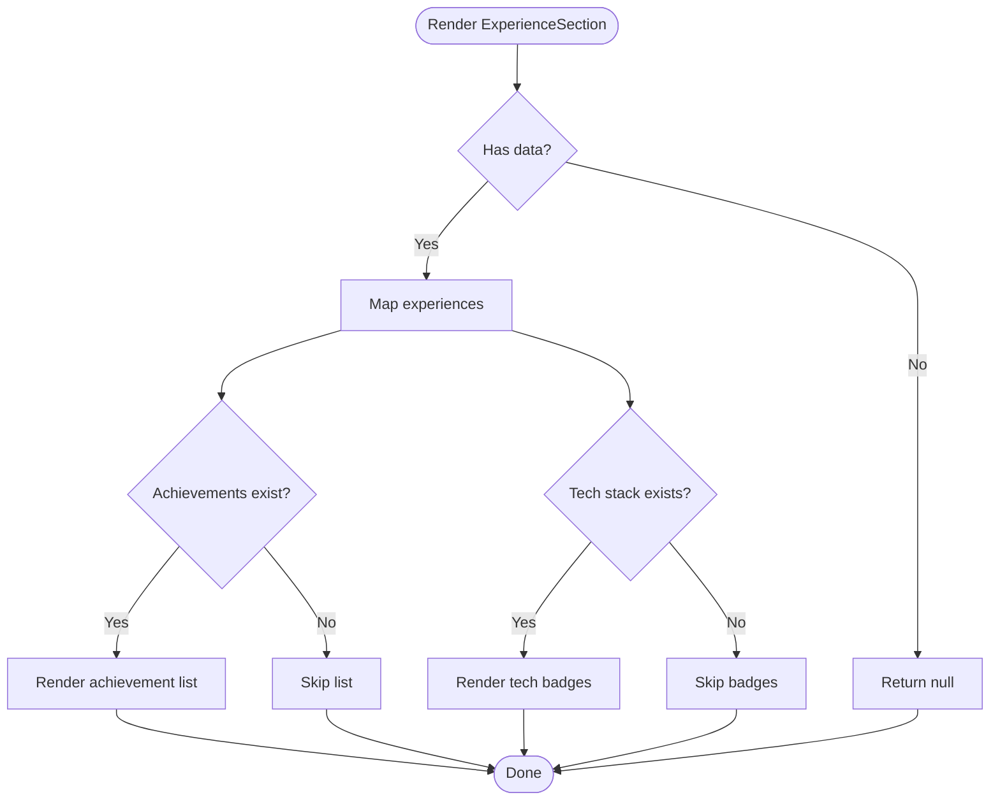
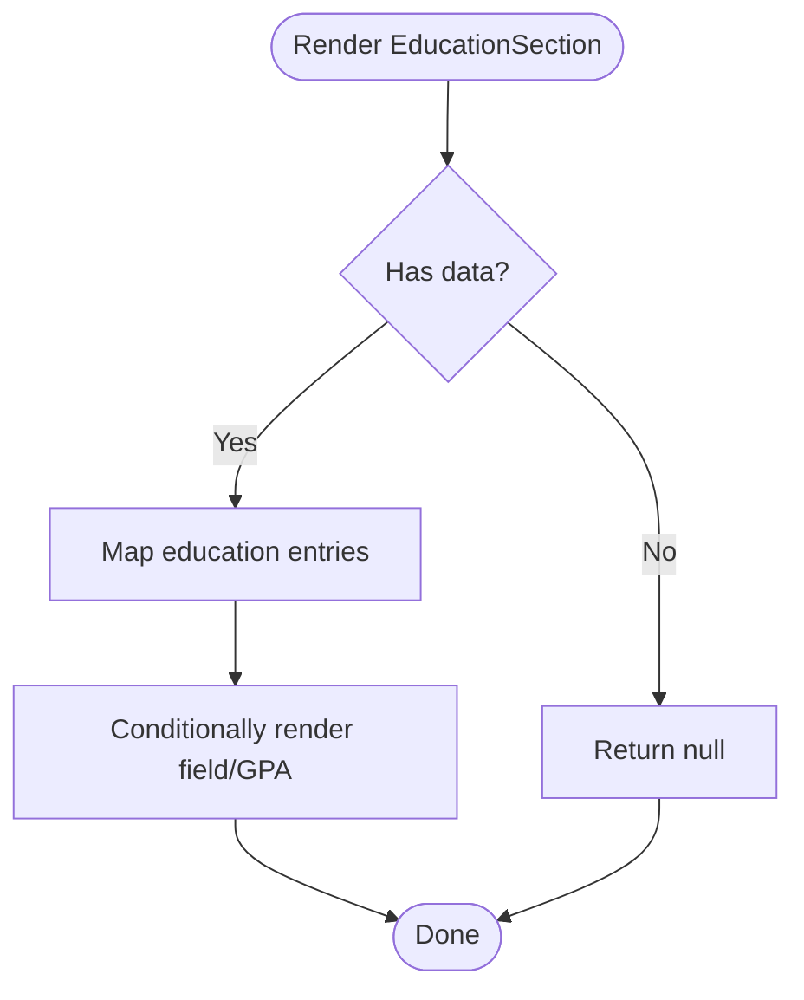
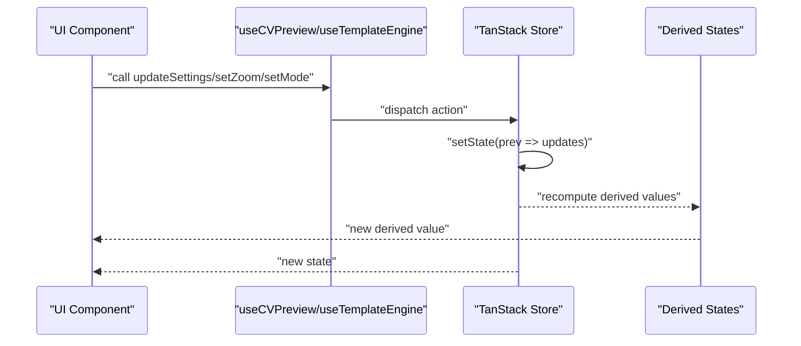
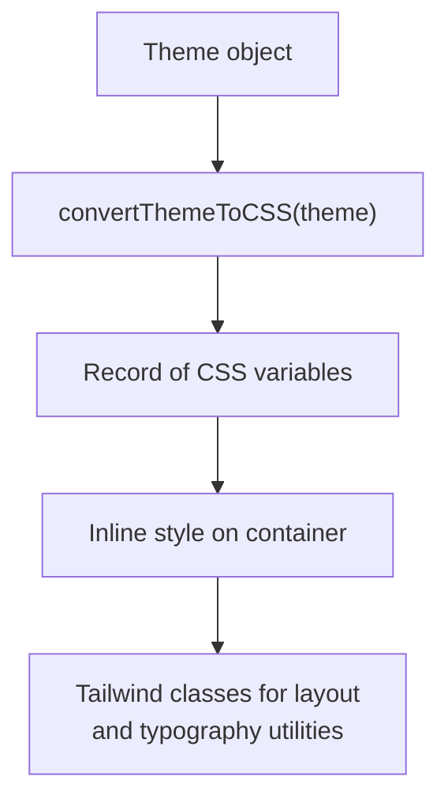
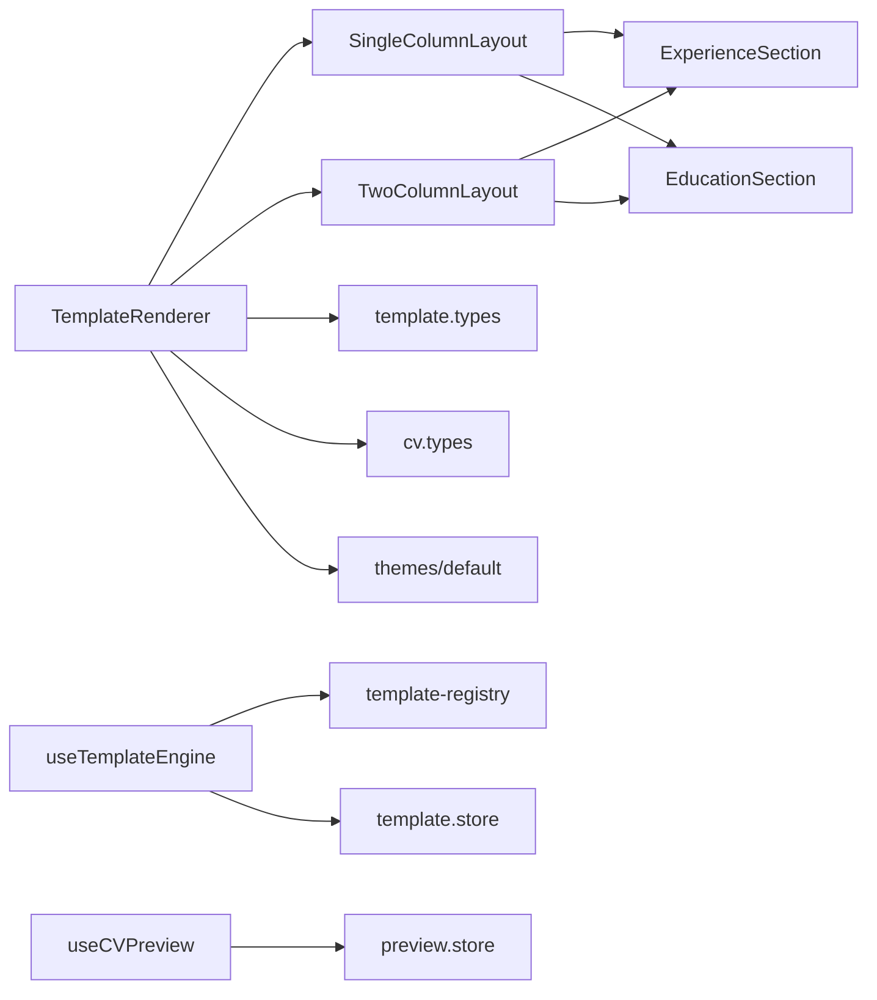

# Template Rendering Performance

<cite>
**Referenced Files in This Document**
- [TemplateRenderer.tsx](file://src/templates/core/TemplateRenderer.tsx)
- [SingleColumnLayout.tsx](file://src/templates/layouts/SingleColumnLayout.tsx)
- [TwoColumnLayout.tsx](file://src/templates/layouts/TwoColumnLayout.tsx)
- [ExperienceSection.tsx](file://src/templates/sections/ExperienceSection.tsx)
- [EducationSection.tsx](file://src/templates/sections/EducationSection.tsx)
- [useCVPreview.ts](file://src/templates/hooks/useCVPreview.ts)
- [useTemplateEngine.ts](file://src/templates/hooks/useTemplateEngine.ts)
- [preview.store.ts](file://src/templates/store/preview.store.ts)
- [template.store.ts](file://src/templates/store/template.store.ts)
- [template-registry.ts](file://src/templates/core/template-registry.ts)
- [template.types.ts](file://src/templates/types/template.types.ts)
- [cv.types.ts](file://src/templates/types/cv.types.ts)
- [default.ts](file://src/templates/themes/default.ts)
- [index.ts](file://src/templates/themes/index.ts)
</cite>

## Table of Contents
1. [Introduction](#introduction)
2. [Project Structure](#project-structure)
3. [Core Components](#core-components)
4. [Architecture Overview](#architecture-overview)
5. [Detailed Component Analysis](#detailed-component-analysis)
6. [Dependency Analysis](#dependency-analysis)
7. [Performance Considerations](#performance-considerations)
8. [Troubleshooting Guide](#troubleshooting-guide)
9. [Conclusion](#conclusion)
10. [Appendices](#appendices)

## Introduction
This document focuses on template rendering performance optimization within the CV portfolio builder. It explains how React.memo is applied to template components and section rendering, outlines virtualization strategies for large CV data lists and experience sections, documents CSS optimization via Tailwind and CSS-in-JS patterns, and covers dynamic layout rendering and theme switching performance. It also provides guidance on performance monitoring for template rendering and optimization techniques for real-time preview updates, along with lazy-loading strategies for template assets and conditional rendering best practices.

## Project Structure
The template rendering system is organized around a renderer, layout components, section components, a theme system, and stores for preview and template state. Hooks integrate with TanStack Store to manage reactive updates efficiently.

**Diagram sources**
- [TemplateRenderer.tsx:1-74](file://src/templates/core/TemplateRenderer.tsx#L1-L74)
- [SingleColumnLayout.tsx:1-36](file://src/templates/layouts/SingleColumnLayout.tsx#L1-L36)
- [TwoColumnLayout.tsx:1-55](file://src/templates/layouts/TwoColumnLayout.tsx#L1-L55)
- [ExperienceSection.tsx:1-61](file://src/templates/sections/ExperienceSection.tsx#L1-L61)
- [EducationSection.tsx:1-44](file://src/templates/sections/EducationSection.tsx#L1-L44)
- [useCVPreview.ts:1-60](file://src/templates/hooks/useCVPreview.ts#L1-L60)
- [useTemplateEngine.ts:1-57](file://src/templates/hooks/useTemplateEngine.ts#L1-L57)
- [preview.store.ts:1-100](file://src/templates/store/preview.store.ts#L1-L100)
- [template.store.ts:1-103](file://src/templates/store/template.store.ts#L1-L103)
- [template-registry.ts:1-92](file://src/templates/core/template-registry.ts#L1-L92)
- [template.types.ts:1-77](file://src/templates/types/template.types.ts#L1-L77)
- [cv.types.ts:1-16](file://src/templates/types/cv.types.ts#L1-L16)
- [default.ts:1-103](file://src/templates/themes/default.ts#L1-L103)
- [index.ts:1-2](file://src/templates/themes/index.ts#L1-L2)

**Section sources**
- [TemplateRenderer.tsx:1-74](file://src/templates/core/TemplateRenderer.tsx#L1-L74)
- [SingleColumnLayout.tsx:1-36](file://src/templates/layouts/SingleColumnLayout.tsx#L1-L36)
- [TwoColumnLayout.tsx:1-55](file://src/templates/layouts/TwoColumnLayout.tsx#L1-L55)
- [ExperienceSection.tsx:1-61](file://src/templates/sections/ExperienceSection.tsx#L1-L61)
- [EducationSection.tsx:1-44](file://src/templates/sections/EducationSection.tsx#L1-L44)
- [useCVPreview.ts:1-60](file://src/templates/hooks/useCVPreview.ts#L1-L60)
- [useTemplateEngine.ts:1-57](file://src/templates/hooks/useTemplateEngine.ts#L1-L57)
- [preview.store.ts:1-100](file://src/templates/store/preview.store.ts#L1-L100)
- [template.store.ts:1-103](file://src/templates/store/template.store.ts#L1-L103)
- [template-registry.ts:1-92](file://src/templates/core/template-registry.ts#L1-L92)
- [template.types.ts:1-77](file://src/templates/types/template.types.ts#L1-L77)
- [cv.types.ts:1-16](file://src/templates/types/cv.types.ts#L1-L16)
- [default.ts:1-103](file://src/templates/themes/default.ts#L1-L103)
- [index.ts:1-2](file://src/templates/themes/index.ts#L1-L2)

## Core Components
- TemplateRenderer: Central renderer that selects a layout, converts theme to CSS variables, and renders sections. It uses React.memo to prevent unnecessary re-renders when props are shallowly equal.
- Layouts: SingleColumnLayout and TwoColumnLayout render sections in sorted order and apply theme CSS variables. Both are wrapped with React.memo.
- Sections: ExperienceSection and EducationSection render lists of items. They use React.memo and conditionally render subsections only when data exists.
- Preview and Template Stores: TanStack Store-backed stores manage preview settings and template state. Hooks expose memoized callbacks for efficient updates.
- Registry and Types: TemplateRegistry provides a global registry for templates; types define layout, theme, and section configurations.

Key performance enablers:
- React.memo on renderer and layout components.
- Sorting sections once per render and passing stable keys.
- CSS-in-JS via inline style CSS variables for theme application.
- TanStack Store for fine-grained, selective re-renders.

**Section sources**
- [TemplateRenderer.tsx:13-53](file://src/templates/core/TemplateRenderer.tsx#L13-L53)
- [SingleColumnLayout.tsx:11-33](file://src/templates/layouts/SingleColumnLayout.tsx#L11-L33)
- [TwoColumnLayout.tsx:13-51](file://src/templates/layouts/TwoColumnLayout.tsx#L13-L51)
- [ExperienceSection.tsx:8-58](file://src/templates/sections/ExperienceSection.tsx#L8-L58)
- [EducationSection.tsx:8-41](file://src/templates/sections/EducationSection.tsx#L8-L41)
- [preview.store.ts:24-95](file://src/templates/store/preview.store.ts#L24-L95)
- [template.store.ts:19-98](file://src/templates/store/template.store.ts#L19-L98)
- [template-registry.ts:4-88](file://src/templates/core/template-registry.ts#L4-L88)
- [template.types.ts:3-53](file://src/templates/types/template.types.ts#L3-L53)
- [cv.types.ts:1-16](file://src/templates/types/cv.types.ts#L1-L16)

## Architecture Overview
The rendering pipeline transforms a template definition and CV data into a styled layout with optimized section rendering.

**Diagram sources**
- [TemplateRenderer.tsx:13-53](file://src/templates/core/TemplateRenderer.tsx#L13-L53)
- [SingleColumnLayout.tsx:11-33](file://src/templates/layouts/SingleColumnLayout.tsx#L11-L33)
- [TwoColumnLayout.tsx:13-51](file://src/templates/layouts/TwoColumnLayout.tsx#L13-L51)
- [ExperienceSection.tsx:8-58](file://src/templates/sections/ExperienceSection.tsx#L8-L58)
- [EducationSection.tsx:8-41](file://src/templates/sections/EducationSection.tsx#L8-L41)
- [preview.store.ts:40-95](file://src/templates/store/preview.store.ts#L40-L95)
- [template.store.ts:46-98](file://src/templates/store/template.store.ts#L46-L98)

## Detailed Component Analysis

### TemplateRenderer
- Purpose: Selects layout, separates sections by position, converts theme to CSS variables, and renders the chosen layout.
- Performance: Uses React.memo to avoid re-rendering when props are unchanged. Converts theme once per render and passes CSS variables via inline styles.
- Rendering flow: Switch on layout type; fallback to single-column if unknown.

**Diagram sources**
- [TemplateRenderer.tsx:13-53](file://src/templates/core/TemplateRenderer.tsx#L13-L53)

**Section sources**
- [TemplateRenderer.tsx:13-53](file://src/templates/core/TemplateRenderer.tsx#L13-L53)

### SingleColumnLayout
- Purpose: Renders a single-column layout by sorting sections by order and mapping each to its component.
- Performance: Wrapped with React.memo; sorts sections once per render; uses stable keys derived from section keys.

**Diagram sources**
- [SingleColumnLayout.tsx:11-33](file://src/templates/layouts/SingleColumnLayout.tsx#L11-L33)

**Section sources**
- [SingleColumnLayout.tsx:11-33](file://src/templates/layouts/SingleColumnLayout.tsx#L11-L33)

### TwoColumnLayout
- Purpose: Renders a two-column layout with configurable sidebar width and separate left/right section sets.
- Performance: Wrapped with React.memo; sorts left and right sections independently; applies theme CSS variables.

**Diagram sources**
- [TwoColumnLayout.tsx:13-51](file://src/templates/layouts/TwoColumnLayout.tsx#L13-L51)

**Section sources**
- [TwoColumnLayout.tsx:13-51](file://src/templates/layouts/TwoColumnLayout.tsx#L13-L51)

### ExperienceSection
- Purpose: Renders a list of experiences with role, company, dates, achievements, and tech stack.
- Performance: Wrapped with React.memo; conditionally renders achievements and tech stack only when present; uses index-based keys for simplicity.

**Diagram sources**
- [ExperienceSection.tsx:8-58](file://src/templates/sections/ExperienceSection.tsx#L8-L58)

**Section sources**
- [ExperienceSection.tsx:8-58](file://src/templates/sections/ExperienceSection.tsx#L8-L58)

### EducationSection
- Purpose: Renders a list of education entries with degree, field, institution, and GPA.
- Performance: Wrapped with React.memo; conditionally renders optional field and GPA; uses index-based keys.

**Diagram sources**
- [EducationSection.tsx:8-41](file://src/templates/sections/EducationSection.tsx#L8-L41)

**Section sources**
- [EducationSection.tsx:8-41](file://src/templates/sections/EducationSection.tsx#L8-L41)

### Preview and Template Stores
- Preview Store: Manages zoom, page size, guides, mode, fullscreen, and print preview. Includes derived states for computed values and clamps zoom within a safe range.
- Template Store: Manages active template, custom templates, section ordering, customization mode, and exposes actions to mutate state.
- Hooks: Memoized callbacks for updating preview and template state, minimizing re-renders.

**Diagram sources**
- [preview.store.ts:40-95](file://src/templates/store/preview.store.ts#L40-L95)
- [template.store.ts:46-98](file://src/templates/store/template.store.ts#L46-L98)
- [useCVPreview.ts:9-59](file://src/templates/hooks/useCVPreview.ts#L9-L59)
- [useTemplateEngine.ts:10-56](file://src/templates/hooks/useTemplateEngine.ts#L10-L56)

**Section sources**
- [preview.store.ts:1-100](file://src/templates/store/preview.store.ts#L1-L100)
- [template.store.ts:1-103](file://src/templates/store/template.store.ts#L1-L103)
- [useCVPreview.ts:1-60](file://src/templates/hooks/useCVPreview.ts#L1-L60)
- [useTemplateEngine.ts:1-57](file://src/templates/hooks/useTemplateEngine.ts#L1-L57)

### Theme System and CSS-in-JS
- Theme conversion: TemplateRenderer converts a Theme object into CSS variables for font family, sizes, colors, and spacing.
- Application: CSS variables are passed as inline styles to container elements, enabling fast theme switching without remounting.
- Themes: Predefined themes are exported and can be referenced by ID or used directly.

**Diagram sources**
- [TemplateRenderer.tsx:58-73](file://src/templates/core/TemplateRenderer.tsx#L58-L73)
- [default.ts:3-25](file://src/templates/themes/default.ts#L3-L25)
- [index.ts:1-2](file://src/templates/themes/index.ts#L1-L2)

**Section sources**
- [TemplateRenderer.tsx:58-73](file://src/templates/core/TemplateRenderer.tsx#L58-L73)
- [default.ts:1-103](file://src/templates/themes/default.ts#L1-L103)
- [index.ts:1-2](file://src/templates/themes/index.ts#L1-L2)

## Dependency Analysis
- TemplateRenderer depends on layout components and theme conversion.
- Layouts depend on section components and receive theme CSS variables.
- Sections depend on CV data types and render lists.
- Hooks depend on stores and registry for template lookup.
- Types define contracts for templates, themes, and CV data.

**Diagram sources**
- [TemplateRenderer.tsx:1-74](file://src/templates/core/TemplateRenderer.tsx#L1-L74)
- [SingleColumnLayout.tsx:1-36](file://src/templates/layouts/SingleColumnLayout.tsx#L1-L36)
- [TwoColumnLayout.tsx:1-55](file://src/templates/layouts/TwoColumnLayout.tsx#L1-L55)
- [ExperienceSection.tsx:1-61](file://src/templates/sections/ExperienceSection.tsx#L1-L61)
- [EducationSection.tsx:1-44](file://src/templates/sections/EducationSection.tsx#L1-L44)
- [useCVPreview.ts:1-60](file://src/templates/hooks/useCVPreview.ts#L1-L60)
- [useTemplateEngine.ts:1-57](file://src/templates/hooks/useTemplateEngine.ts#L1-L57)
- [preview.store.ts:1-100](file://src/templates/store/preview.store.ts#L1-L100)
- [template.store.ts:1-103](file://src/templates/store/template.store.ts#L1-L103)
- [template-registry.ts:1-92](file://src/templates/core/template-registry.ts#L1-L92)
- [template.types.ts:1-77](file://src/templates/types/template.types.ts#L1-L77)
- [cv.types.ts:1-16](file://src/templates/types/cv.types.ts#L1-L16)
- [default.ts:1-103](file://src/templates/themes/default.ts#L1-L103)

**Section sources**
- [template-registry.ts:1-92](file://src/templates/core/template-registry.ts#L1-L92)
- [template.types.ts:1-77](file://src/templates/types/template.types.ts#L1-L77)
- [cv.types.ts:1-16](file://src/templates/types/cv.types.ts#L1-L16)

## Performance Considerations
- React.memo usage:
  - TemplateRenderer, SingleColumnLayout, TwoColumnLayout, ExperienceSection, and EducationSection are wrapped with React.memo to prevent unnecessary re-renders when props are unchanged.
  - Benefits: Reduced reconciliation cost for static or infrequently changing content.
- Conditional rendering:
  - Sections return early when data is empty, avoiding DOM creation for empty lists.
  - Conditional blocks for achievements and tech stacks reduce DOM size when not needed.
- Sorting and keys:
  - Sorting sections by order happens once per render; stable keys are used to minimize diff churn.
- CSS-in-JS and Tailwind:
  - CSS variables applied via inline styles enable instant theme switching without remounting.
  - Tailwind utility classes keep styles declarative and scoped to components.
- Virtualization strategies for large lists:
  - Current sections render all items. For very large experience or education lists, consider:
    - Windowed/virtualized lists (e.g., react-window or react-virtuoso) to render only visible items.
    - Dynamic chunking with pagination or “Show more” buttons.
    - Memoizing individual item components and using stable keys.
- Lazy loading for template assets:
  - Load template thumbnails and heavy assets on demand.
  - Defer non-critical assets until after initial render.
- Real-time preview updates:
  - Use throttled or debounced updates for zoom and layout changes.
  - Prefer derived states for computed values (already implemented) to avoid redundant computations.
- Monitoring:
  - Track render durations using performance.mark/performance.measure around TemplateRenderer and layout renders.
  - Monitor store update frequency to detect excessive re-renders.

[No sources needed since this section provides general guidance]

## Troubleshooting Guide
- Excessive re-renders:
  - Verify props passed to TemplateRenderer and layouts are stable and memoized where appropriate.
  - Ensure keys are unique and stable for lists (prefer stable identifiers over indices).
- Theme not applying:
  - Confirm convertThemeToCSS produces expected CSS variables and that containers receive the style prop.
- Empty sections appearing:
  - Check that sections return null when data is missing and that data keys match CV shape.
- Preview controls not working:
  - Validate that useCVPreview callbacks dispatch actions and that derived states are mounted.

**Section sources**
- [TemplateRenderer.tsx:58-73](file://src/templates/core/TemplateRenderer.tsx#L58-L73)
- [SingleColumnLayout.tsx:11-33](file://src/templates/layouts/SingleColumnLayout.tsx#L11-L33)
- [TwoColumnLayout.tsx:13-51](file://src/templates/layouts/TwoColumnLayout.tsx#L13-L51)
- [ExperienceSection.tsx:8-58](file://src/templates/sections/ExperienceSection.tsx#L8-L58)
- [EducationSection.tsx:8-41](file://src/templates/sections/EducationSection.tsx#L8-L41)
- [preview.store.ts:40-95](file://src/templates/store/preview.store.ts#L40-L95)
- [useCVPreview.ts:9-59](file://src/templates/hooks/useCVPreview.ts#L9-L59)

## Conclusion
The template rendering system leverages React.memo, memoized hooks, and CSS-in-JS to deliver responsive previews. Layouts and sections are structured for predictable re-renders, while TanStack Store enables precise updates for preview and template state. For further optimization, consider virtualization for large lists, lazy loading for assets, and performance monitoring to guide future improvements.

[No sources needed since this section summarizes without analyzing specific files]

## Appendices
- Types and contracts:
  - Template, Theme, SectionConfig, PreviewSettings, and ExportOptions define the rendering contract.
- CV data types:
  - CV and related entities are re-exported for consistent typing across the system.

**Section sources**
- [template.types.ts:3-77](file://src/templates/types/template.types.ts#L3-L77)
- [cv.types.ts:1-16](file://src/templates/types/cv.types.ts#L1-L16)