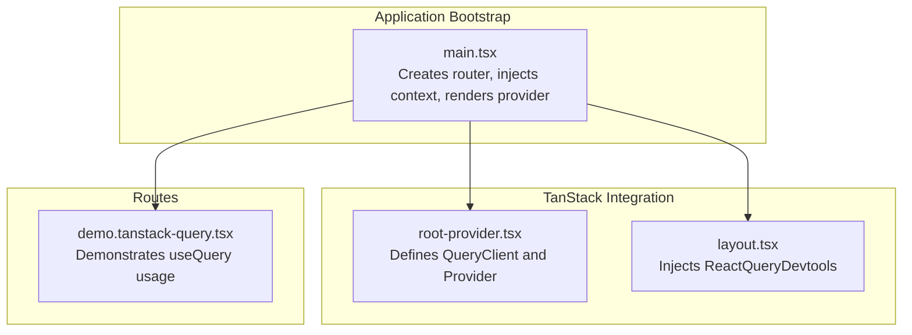
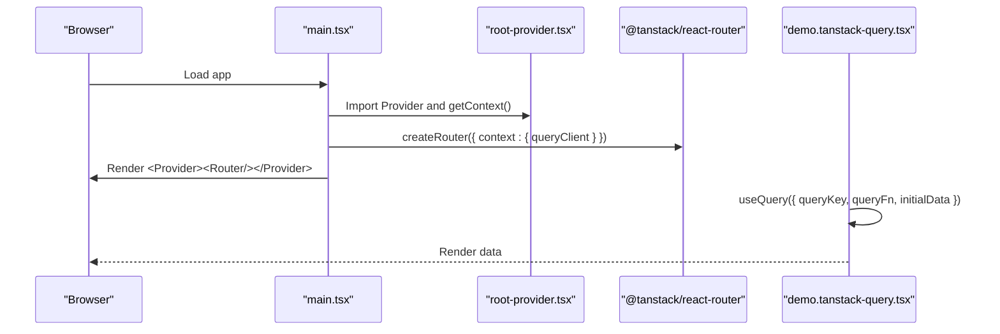
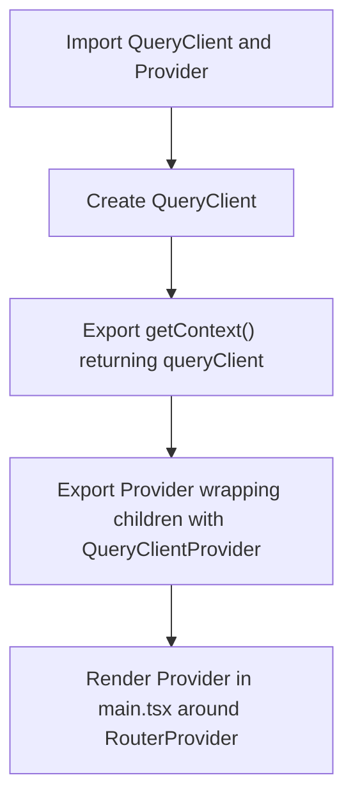
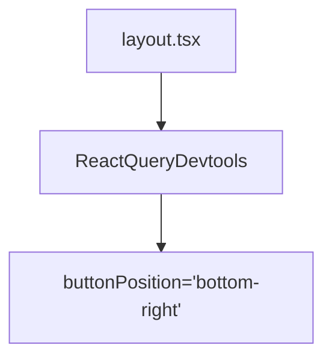
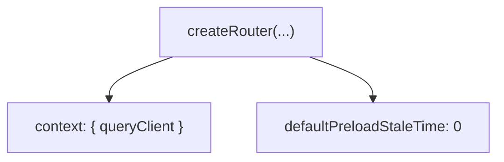
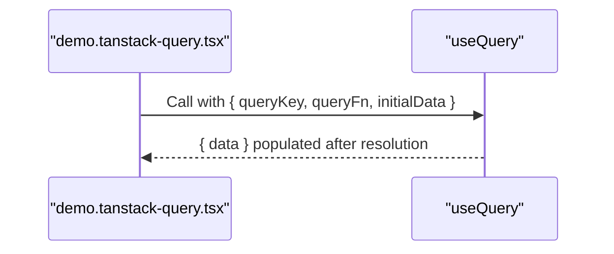
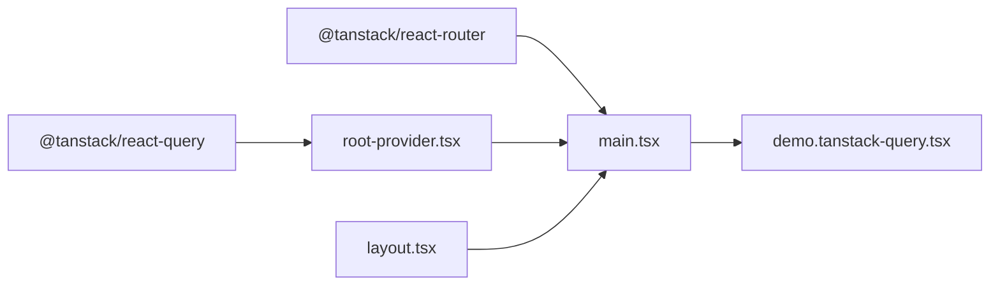

# React Query Setup & Configuration

<cite>
**Referenced Files in This Document**
- [root-provider.tsx](file://src/integrations/tanstack-query/root-provider.tsx)
- [layout.tsx](file://src/integrations/tanstack-query/layout.tsx)
- [main.tsx](file://src/main.tsx)
- [demo.tanstack-query.tsx](file://src/routes/demo.tanstack-query.tsx)
- [cv-memory.ts](file://src/agent/memory/cv-memory.ts)
- [use-cv-agent.ts](file://src/hooks/use-cv-agent.ts)
</cite>

## Table of Contents
1. [Introduction](#introduction)
2. [Project Structure](#project-structure)
3. [Core Components](#core-components)
4. [Architecture Overview](#architecture-overview)
5. [Detailed Component Analysis](#detailed-component-analysis)
6. [Dependency Analysis](#dependency-analysis)
7. [Performance Considerations](#performance-considerations)
8. [Troubleshooting Guide](#troubleshooting-guide)
9. [Conclusion](#conclusion)

## Introduction
This document explains the React Query setup and configuration used in the CV Portfolio Builder. It covers QueryClient initialization, provider implementation, and Devtools integration. It also documents caching strategies, stale time configurations, and background refetch behavior as configured in the application. Examples of query and mutation patterns are provided, along with guidance on error handling, retry mechanisms, and optimistic updates. Configuration recommendations are included for typical CV data fetching and AI service response scenarios.

## Project Structure
The React Query integration is encapsulated under a dedicated integration module and wired into the application’s routing and rendering pipeline.

**Diagram sources**
- [main.tsx:29-83](file://src/main.tsx#L29-L83)
- [root-provider.tsx:1-14](file://src/integrations/tanstack-query/root-provider.tsx#L1-L14)
- [layout.tsx:1-6](file://src/integrations/tanstack-query/layout.tsx#L1-L6)
- [demo.tanstack-query.tsx:1-31](file://src/routes/demo.tanstack-query.tsx#L1-L31)

**Section sources**
- [main.tsx:29-83](file://src/main.tsx#L29-L83)
- [root-provider.tsx:1-14](file://src/integrations/tanstack-query/root-provider.tsx#L1-L14)
- [layout.tsx:1-6](file://src/integrations/tanstack-query/layout.tsx#L1-L6)
- [demo.tanstack-query.tsx:1-31](file://src/routes/demo.tanstack-query.tsx#L1-L31)

## Core Components
- QueryClient initialization and provider
  - A single QueryClient instance is created and exposed via a context getter and a Provider wrapper.
  - The Provider wraps the RouterProvider so all routes and components have access to React Query APIs.
- Devtools integration
  - ReactQueryDevtools is rendered as a layout addition with a fixed button position.
- Router context injection
  - The router is created with injected context containing the QueryClient, enabling per-route access to query utilities.

Key behaviors visible in the code:
- QueryClient is initialized without custom defaults, meaning default cache behavior applies.
- Devtools are enabled and positioned at the bottom-right of the screen.
- The router sets default preload stale time to zero, affecting preloading behavior.

**Section sources**
- [root-provider.tsx:1-14](file://src/integrations/tanstack-query/root-provider.tsx#L1-L14)
- [layout.tsx:1-6](file://src/integrations/tanstack-query/layout.tsx#L1-L6)
- [main.tsx:56-83](file://src/main.tsx#L56-L83)

## Architecture Overview
The application initializes React Query at the root and exposes it to all routes. The demo route illustrates a basic query pattern. The CV agent and memory subsystems rely on separate state management abstractions but can coexist with React Query for server-state needs.

**Diagram sources**
- [main.tsx:56-83](file://src/main.tsx#L56-L83)
- [root-provider.tsx:1-14](file://src/integrations/tanstack-query/root-provider.tsx#L1-L14)
- [demo.tanstack-query.tsx:6-11](file://src/routes/demo.tanstack-query.tsx#L6-L11)

## Detailed Component Analysis

### QueryClient Initialization and Provider
- Initialization
  - A default QueryClient is instantiated and exported with a context getter and a Provider wrapper.
- Provider usage
  - The Provider is applied around the RouterProvider so all routes inherit the QueryClient context.
- Devtools integration
  - A layout addition component renders ReactQueryDevtools with a fixed button position.

**Diagram sources**
- [root-provider.tsx:1-14](file://src/integrations/tanstack-query/root-provider.tsx#L1-L14)
- [main.tsx:73-82](file://src/main.tsx#L73-L82)

**Section sources**
- [root-provider.tsx:1-14](file://src/integrations/tanstack-query/root-provider.tsx#L1-L14)
- [main.tsx:73-82](file://src/main.tsx#L73-L82)

### Devtools Integration
- Devtools are included as a layout addition and configured with a fixed button position.
- This enables inspection of queries, mutations, cache state, and performance metrics during development.

**Diagram sources**
- [layout.tsx:1-6](file://src/integrations/tanstack-query/layout.tsx#L1-L6)

**Section sources**
- [layout.tsx:1-6](file://src/integrations/tanstack-query/layout.tsx#L1-L6)

### Router Context and Preload Stale Time
- The router is created with injected context containing the QueryClient.
- Default preload stale time is set to zero, influencing how preloaded queries are considered fresh.

**Diagram sources**
- [main.tsx:56-65](file://src/main.tsx#L56-L65)

**Section sources**
- [main.tsx:56-65](file://src/main.tsx#L56-L65)

### Query Pattern Example
- The demo route demonstrates a minimal query pattern:
  - A queryKey identifies the resource.
  - A queryFn fetches data.
  - initialData provides a placeholder until the query resolves.
- This pattern is suitable for lightweight demos and can be extended with caching, retries, and error handling.

**Diagram sources**
- [demo.tanstack-query.tsx:6-11](file://src/routes/demo.tanstack-query.tsx#L6-L11)

**Section sources**
- [demo.tanstack-query.tsx:6-11](file://src/routes/demo.tanstack-query.tsx#L6-L11)

### Mutation Patterns and Optimistic Updates
- While the demo route focuses on queries, mutations are commonly used for write operations (e.g., saving CV data, updating agent context).
- Recommended approach:
  - Use an optimistic update by temporarily writing local state before the server responds.
  - On failure, rollback to the previous state; on success, reconcile with server data.
  - Invalidate related queries to refresh cached data consistently.
- This pattern ensures responsive UI while maintaining data consistency.

[No sources needed since this section provides general guidance]

### Caching Strategies and Stale Time Configurations
- Default cache behavior
  - The application uses the default QueryClient, which implies default cache timeouts and garbage collection behavior.
- Stale time
  - The router sets default preload stale time to zero, affecting preloading freshness.
  - For long-lived CV data, consider setting a higher staleTime to reduce network requests.
- Background refetch
  - Default background refetch behavior applies; adjust polling or refetch intervals based on data volatility.
- Recommendations
  - For static CV sections, set a longer staleTime and disable background refetch if appropriate.
  - For dynamic AI-generated suggestions, keep staleTime low and enable background refetch to stay current.

[No sources needed since this section provides general guidance]

### Error Handling and Retry Mechanisms
- Query errors
  - Wrap queries in error boundaries or handle errors within components using query state flags.
  - Consider enabling automatic retries with exponential backoff for transient failures.
- Mutation errors
  - Implement rollback logic and user feedback on failures.
  - Use mutation cache invalidation to recover from partial updates.
- Recommendations
  - Centralize retry policies via QueryClient defaults for consistent behavior.
  - Provide user-friendly messages and retry actions.

[No sources needed since this section provides general guidance]

### Configuration Examples for CV Data and AI Services
- CV data fetching
  - Use a stable queryKey derived from the CV ID or active filters.
  - Set a moderate staleTime (e.g., minutes) and disable background refetch for manual refresh controls.
  - Invalidate queries on save to ensure subsequent reads reflect the latest data.
- AI service responses
  - Use shorter staleTime for suggestions and dynamic insights.
  - Enable background refetch to keep suggestions fresh as new inputs arrive.
  - Apply optimistic updates for immediate UI feedback during generation.

[No sources needed since this section provides general guidance]

## Dependency Analysis
The integration depends on the TanStack Router and React Query packages. The main application bootstraps the router, injects the QueryClient into the router context, and wraps the RouterProvider with the QueryClientProvider. The demo route consumes React Query hooks.

**Diagram sources**
- [main.tsx:1-25](file://src/main.tsx#L1-L25)
- [root-provider.tsx:1-14](file://src/integrations/tanstack-query/root-provider.tsx#L1-L14)
- [layout.tsx:1-6](file://src/integrations/tanstack-query/layout.tsx#L1-L6)
- [demo.tanstack-query.tsx:1-5](file://src/routes/demo.tanstack-query.tsx#L1-L5)

**Section sources**
- [main.tsx:1-25](file://src/main.tsx#L1-L25)
- [root-provider.tsx:1-14](file://src/integrations/tanstack-query/root-provider.tsx#L1-L14)
- [layout.tsx:1-6](file://src/integrations/tanstack-query/layout.tsx#L1-L6)
- [demo.tanstack-query.tsx:1-5](file://src/routes/demo.tanstack-query.tsx#L1-L5)

## Performance Considerations
- Prefer structural sharing for efficient re-renders.
- Tune staleTime and gcTime to balance freshness and memory usage.
- Use background refetch judiciously to avoid unnecessary network load.
- Leverage Devtools to monitor cache hit rates and identify redundant requests.

[No sources needed since this section provides general guidance]

## Troubleshooting Guide
- Queries not updating
  - Verify queryKey uniqueness and stability.
  - Confirm staleTime and background refetch settings align with expected behavior.
- Devtools not visible
  - Ensure the layout addition is rendered and the button position is accessible.
- Mutations not reflected
  - Invalidate related queries after successful mutations.
  - Implement optimistic updates with rollback on failure.
- Long load times
  - Adjust staleTime and consider prefetching for critical routes.

[No sources needed since this section provides general guidance]

## Conclusion
The CV Portfolio Builder integrates React Query through a clean, minimal setup: a default QueryClient, a Provider wrapper, and Devtools integration. The router context injects the QueryClient globally, and the demo route showcases a straightforward query pattern. For production-grade usage, configure caching, stale times, retries, and optimistic updates tailored to CV data and AI service dynamics. Use Devtools to monitor and refine performance and correctness.