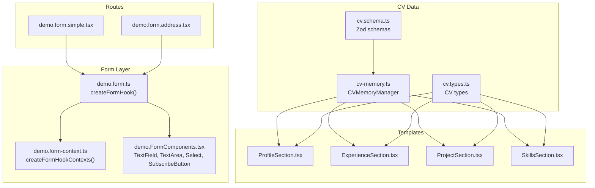
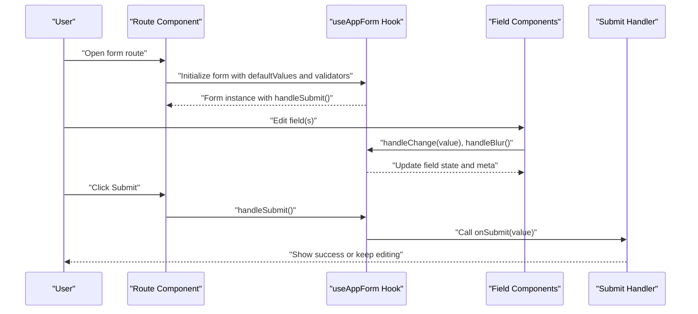
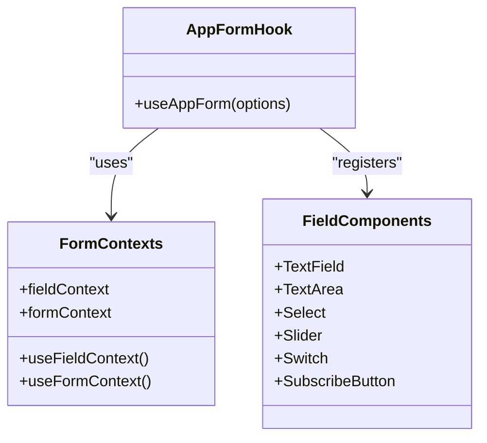
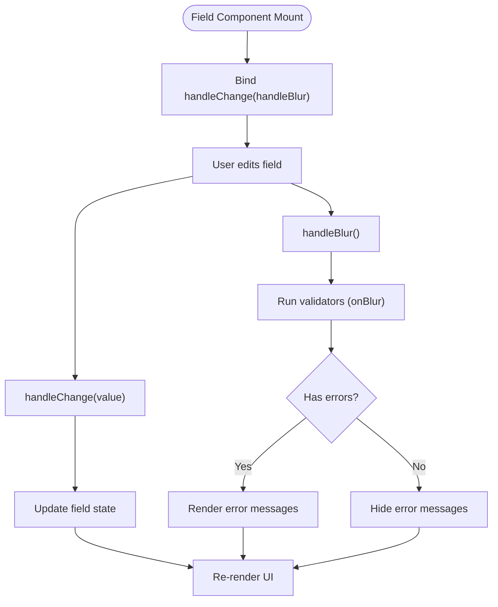
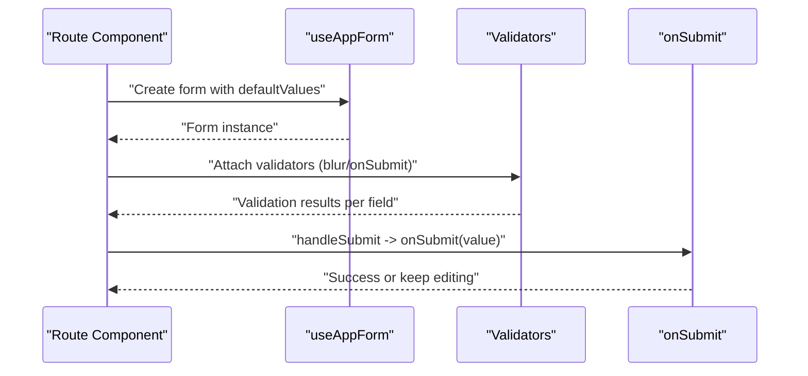
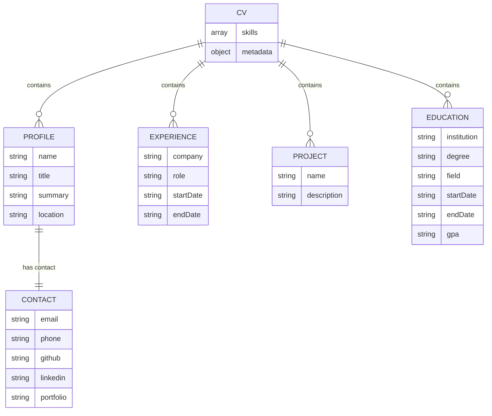
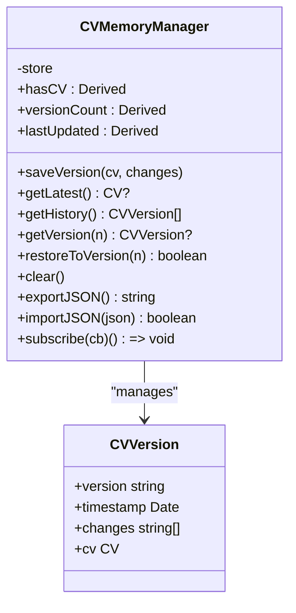
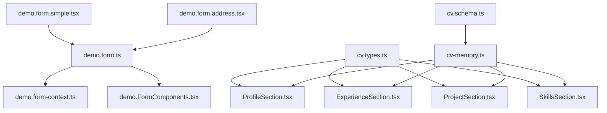

# TanStack Form Integration

<cite>
**Referenced Files in This Document**
- [demo.form.ts](file://src/hooks/demo.form.ts)
- [demo.form-context.ts](file://src/hooks/demo.form-context.ts)
- [demo.FormComponents.tsx](file://src/components/demo.FormComponents.tsx)
- [demo.form.simple.tsx](file://src/routes/demo.form.simple.tsx)
- [demo.form.address.tsx](file://src/routes/demo.form.address.tsx)
- [cv.schema.ts](file://src/agent/schemas/cv.schema.ts)
- [cv-memory.ts](file://src/agent/memory/cv-memory.ts)
- [cv.types.ts](file://src/templates/types/cv.types.ts)
- [ProfileSection.tsx](file://src/templates/sections/ProfileSection.tsx)
- [ExperienceSection.tsx](file://src/templates/sections/ExperienceSection.tsx)
- [ProjectSection.tsx](file://src/templates/sections/ProjectSection.tsx)
- [SkillsSection.tsx](file://src/templates/sections/SkillsSection.tsx)
- [Home.tsx](file://src/components/Home.tsx)
- [demo.store.tsx](file://src/routes/demo.store.tsx)
- [demo-store.ts](file://src/lib/demo-store.ts)
- [App.tsx](file://src/App.tsx)
</cite>

## Table of Contents
1. [Introduction](#introduction)
2. [Project Structure](#project-structure)
3. [Core Components](#core-components)
4. [Architecture Overview](#architecture-overview)
5. [Detailed Component Analysis](#detailed-component-analysis)
6. [Dependency Analysis](#dependency-analysis)
7. [Performance Considerations](#performance-considerations)
8. [Troubleshooting Guide](#troubleshooting-guide)
9. [Conclusion](#conclusion)
10. [Appendices](#appendices)

## Introduction
This document explains how TanStack Form is integrated into the CV Portfolio Builder. It covers form context management, validation schemas, reactive form handling patterns, state management, error display, submission workflows, and how these patterns apply to CV sections such as profile, experience, projects, and skills. It also documents form persistence, reset functionality, and integration with the CV data store.

## Project Structure
The form integration spans several areas:
- Hooks define a reusable form hook and contexts for TanStack Form.
- UI components encapsulate field rendering and error display.
- Routes demonstrate practical forms with inline and Zod-based validation.
- CV schemas define typed validation for CV data.
- CV memory manages persistence and versioning.
- Templates render CV data into sections.



**Diagram sources**
- [demo.form-context.ts:1-5](file://src/hooks/demo.form-context.ts#L1-L5)
- [demo.form.ts:1-18](file://src/hooks/demo.form.ts#L1-L18)
- [demo.FormComponents.tsx:1-138](file://src/components/demo.FormComponents.tsx#L1-L138)
- [demo.form.simple.tsx:1-68](file://src/routes/demo.form.simple.tsx#L1-L68)
- [demo.form.address.tsx:1-199](file://src/routes/demo.form.address.tsx#L1-L199)
- [cv.schema.ts:1-79](file://src/agent/schemas/cv.schema.ts#L1-L79)
- [cv.types.ts:1-16](file://src/templates/types/cv.types.ts#L1-L16)
- [cv-memory.ts:1-290](file://src/agent/memory/cv-memory.ts#L1-L290)
- [ProfileSection.tsx:1-89](file://src/templates/sections/ProfileSection.tsx#L1-L89)
- [ExperienceSection.tsx:1-61](file://src/templates/sections/ExperienceSection.tsx#L1-L61)
- [ProjectSection.tsx:1-49](file://src/templates/sections/ProjectSection.tsx#L1-L49)
- [SkillsSection.tsx:1-26](file://src/templates/sections/SkillsSection.tsx#L1-L26)

**Section sources**
- [demo.form-context.ts:1-5](file://src/hooks/demo.form-context.ts#L1-L5)
- [demo.form.ts:1-18](file://src/hooks/demo.form.ts#L1-L18)
- [demo.FormComponents.tsx:1-138](file://src/components/demo.FormComponents.tsx#L1-L138)
- [demo.form.simple.tsx:1-68](file://src/routes/demo.form.simple.tsx#L1-L68)
- [demo.form.address.tsx:1-199](file://src/routes/demo.form.address.tsx#L1-L199)
- [cv.schema.ts:1-79](file://src/agent/schemas/cv.schema.ts#L1-L79)
- [cv.types.ts:1-16](file://src/templates/types/cv.types.ts#L1-L16)
- [cv-memory.ts:1-290](file://src/agent/memory/cv-memory.ts#L1-L290)
- [ProfileSection.tsx:1-89](file://src/templates/sections/ProfileSection.tsx#L1-L89)
- [ExperienceSection.tsx:1-61](file://src/templates/sections/ExperienceSection.tsx#L1-L61)
- [ProjectSection.tsx:1-49](file://src/templates/sections/ProjectSection.tsx#L1-L49)
- [SkillsSection.tsx:1-26](file://src/templates/sections/SkillsSection.tsx#L1-L26)

## Core Components
- Form hook and contexts: Centralized creation of form and field contexts and a reusable hook that wires field and form components.
- Field components: Encapsulate input rendering, blur/change handlers, and error display.
- Route-level forms: Demonstrate inline validation and Zod-based validation.
- CV schemas and types: Define typed validation for CV data and expose CV types to templates.
- CV memory manager: Persist, version, and restore CV data; integrates with templates.

**Section sources**
- [demo.form.ts:1-18](file://src/hooks/demo.form.ts#L1-L18)
- [demo.form-context.ts:1-5](file://src/hooks/demo.form-context.ts#L1-L5)
- [demo.FormComponents.tsx:1-138](file://src/components/demo.FormComponents.tsx#L1-L138)
- [demo.form.simple.tsx:8-27](file://src/routes/demo.form.simple.tsx#L8-L27)
- [demo.form.address.tsx:7-39](file://src/routes/demo.form.address.tsx#L7-L39)
- [cv.schema.ts:1-79](file://src/agent/schemas/cv.schema.ts#L1-L79)
- [cv.types.ts:1-16](file://src/templates/types/cv.types.ts#L1-L16)
- [cv-memory.ts:19-148](file://src/agent/memory/cv-memory.ts#L19-L148)

## Architecture Overview
The form architecture follows a layered pattern:
- Context layer: Provides form and field contexts.
- Hook layer: Exposes a single form hook that registers field and form components.
- UI layer: Field components handle state updates and error rendering.
- Route layer: Forms define default values, validators, and submit handlers.
- Data layer: CV schemas and memory manage typed data and persistence.



**Diagram sources**
- [demo.form.ts:6-17](file://src/hooks/demo.form.ts#L6-L17)
- [demo.form.simple.tsx:14-27](file://src/routes/demo.form.simple.tsx#L14-L27)
- [demo.form.address.tsx:50-56](file://src/routes/demo.form.address.tsx#L50-L56)
- [demo.FormComponents.tsx:41-59](file://src/components/demo.FormComponents.tsx#L41-L59)

## Detailed Component Analysis

### Form Hook and Contexts
- Contexts: Field and form contexts are created via TanStack Form’s factory and exported for use in components.
- Hook: A custom form hook registers field components (TextField, TextArea, Select) and form components (SubscribeButton), and binds them to the contexts.



**Diagram sources**
- [demo.form-context.ts:1-5](file://src/hooks/demo.form-context.ts#L1-L5)
- [demo.form.ts:6-17](file://src/hooks/demo.form.ts#L6-L17)
- [demo.FormComponents.tsx:13-138](file://src/components/demo.FormComponents.tsx#L13-L138)

**Section sources**
- [demo.form-context.ts:1-5](file://src/hooks/demo.form-context.ts#L1-L5)
- [demo.form.ts:1-18](file://src/hooks/demo.form.ts#L1-L18)

### Field Components and Reactive Handling
- TextField, TextArea, Select, Slider, Switch: Each captures user input, delegates change and blur events to the field context, and renders errors when fields are touched.
- SubscribeButton: Reads submission state from the form store to disable itself while submitting.



**Diagram sources**
- [demo.FormComponents.tsx:41-59](file://src/components/demo.FormComponents.tsx#L41-L59)
- [demo.FormComponents.tsx:61-79](file://src/components/demo.FormComponents.tsx#L61-L79)
- [demo.FormComponents.tsx:82-118](file://src/components/demo.FormComponents.tsx#L82-L118)
- [demo.FormComponents.tsx:120-138](file://src/components/demo.FormComponents.tsx#L120-L138)
- [demo.FormComponents.tsx:140-158](file://src/components/demo.FormComponents.tsx#L140-L158)

**Section sources**
- [demo.FormComponents.tsx:13-138](file://src/components/demo.FormComponents.tsx#L13-L138)

### Route-Level Forms: Simple and Address
- Simple form: Uses Zod schema for blur-time validation and minimal fields.
- Address form: Demonstrates nested fields, inline validators, and a dropdown selection.



**Diagram sources**
- [demo.form.simple.tsx:8-27](file://src/routes/demo.form.simple.tsx#L8-L27)
- [demo.form.address.tsx:7-39](file://src/routes/demo.form.address.tsx#L7-L39)

**Section sources**
- [demo.form.simple.tsx:8-27](file://src/routes/demo.form.simple.tsx#L8-L27)
- [demo.form.address.tsx:7-39](file://src/routes/demo.form.address.tsx#L7-L39)

### Validation Schemas and Typed CV Data
- Zod schemas define strong typing and validation for CV sections:
  - Contact, Profile, Experience, Project, Education, and top-level CV.
- Types are exported for use across templates and components.



**Diagram sources**
- [cv.schema.ts:4-61](file://src/agent/schemas/cv.schema.ts#L4-L61)

**Section sources**
- [cv.schema.ts:1-79](file://src/agent/schemas/cv.schema.ts#L1-L79)
- [cv.types.ts:1-16](file://src/templates/types/cv.types.ts#L1-L16)

### CV Persistence and Versioning
- CVMemoryManager persists the current CV, maintains version history, supports restoration, and provides export/import capabilities.
- Derived stores expose derived state such as presence and counts.



**Diagram sources**
- [cv-memory.ts:19-148](file://src/agent/memory/cv-memory.ts#L19-L148)

**Section sources**
- [cv-memory.ts:19-148](file://src/agent/memory/cv-memory.ts#L19-L148)

### CV Sections Rendering
- Templates consume typed CV data and render sections for Profile, Experience, Projects, and Skills.
- These components act as consumers of the CV data managed by CVMemoryManager and typed by cv.schema.ts.

```mermaid
graph LR
CM["CVMemoryManager"] --> |currentCV| PS["ProfileSection"]
CM --> |experience[]| ES["ExperienceSection"]
CM --> |projects[]| ProjS["ProjectSection"]
CM --> |skills[]| SkS["SkillsSection"]
PS --> |renders| UI["Profile UI"]
ES --> |renders| UI
ProjS --> |renders| UI
SkS --> |renders| UI
```

**Diagram sources**
- [cv-memory.ts:77-86](file://src/agent/memory/cv-memory.ts#L77-L86)
- [ProfileSection.tsx:1-89](file://src/templates/sections/ProfileSection.tsx#L1-L89)
- [ExperienceSection.tsx:1-61](file://src/templates/sections/ExperienceSection.tsx#L1-L61)
- [ProjectSection.tsx:1-49](file://src/templates/sections/ProjectSection.tsx#L1-L49)
- [SkillsSection.tsx:1-26](file://src/templates/sections/SkillsSection.tsx#L1-L26)

**Section sources**
- [ProfileSection.tsx:1-89](file://src/templates/sections/ProfileSection.tsx#L1-L89)
- [ExperienceSection.tsx:1-61](file://src/templates/sections/ExperienceSection.tsx#L1-L61)
- [ProjectSection.tsx:1-49](file://src/templates/sections/ProjectSection.tsx#L1-L49)
- [SkillsSection.tsx:1-26](file://src/templates/sections/SkillsSection.tsx#L1-L26)

### Form Patterns for CV Sections
- Profile form: Use Zod schema for blur-time validation on name, title, summary, location, and nested contact fields.
- Experience form: Validate company, role, dates, achievements, and optional tech stack.
- Project form: Validate name, description, highlights, and optional tech stack.
- Education form: Validate institution, degree, dates, and optional GPA.
- Skills form: Treat as a list of strings with optional normalization/validation.

Patterns:
- Nested fields: Use dot notation (e.g., address.street) for nested objects.
- Conditional fields: Enable/disable or show/hide based on field values using form state.
- Dynamic lists: Manage arrays of experiences, projects, and skills with add/remove controls.

[No sources needed since this section synthesizes patterns without analyzing specific files]

### Complex Validation, Conditional Fields, and Dynamic Generation
- Complex validation: Combine Zod schema validation with field-level validators for cross-field checks.
- Conditional fields: Derive visibility or requirement based on other field values using form state subscriptions.
- Dynamic generation: Render lists of items and attach validators per item; support adding/removing entries.

[No sources needed since this section provides conceptual guidance]

### Submission Workflows and Error Display
- Submission: On submit, the form validates all fields and invokes the onSubmit handler with the normalized value.
- Error display: Errors are shown immediately after blur for field-level validators and upon submission for schema-level validators.

**Section sources**
- [demo.form.simple.tsx:14-27](file://src/routes/demo.form.simple.tsx#L14-L27)
- [demo.form.address.tsx:50-56](file://src/routes/demo.form.address.tsx#L50-L56)
- [demo.FormComponents.tsx:26-39](file://src/components/demo.FormComponents.tsx#L26-L39)

### Persistence, Reset, and Integration with CV Data Store
- Persistence: After successful submission, persist the CV via CVMemoryManager.saveVersion and integrate with templates for rendering.
- Reset: Provide a reset method to revert to defaultValues or clear the form state.
- Integration: Use CV types to ensure form data matches template expectations; subscribe to CV changes to keep UI in sync.

**Section sources**
- [cv-memory.ts:55-72](file://src/agent/memory/cv-memory.ts#L55-L72)
- [cv.types.ts:1-16](file://src/templates/types/cv.types.ts#L1-L16)

## Dependency Analysis
- Form hook depends on contexts and field components.
- Route components depend on the form hook and pass in default values and validators.
- CV schemas and types are consumed by templates and memory manager.
- Templates depend on typed CV data from memory manager.



**Diagram sources**
- [demo.form.ts:1-18](file://src/hooks/demo.form.ts#L1-L18)
- [demo.form-context.ts:1-5](file://src/hooks/demo.form-context.ts#L1-L5)
- [demo.FormComponents.tsx:1-138](file://src/components/demo.FormComponents.tsx#L1-L138)
- [demo.form.simple.tsx:1-68](file://src/routes/demo.form.simple.tsx#L1-L68)
- [demo.form.address.tsx:1-199](file://src/routes/demo.form.address.tsx#L1-L199)
- [cv.schema.ts:1-79](file://src/agent/schemas/cv.schema.ts#L1-L79)
- [cv.types.ts:1-16](file://src/templates/types/cv.types.ts#L1-L16)
- [cv-memory.ts:1-290](file://src/agent/memory/cv-memory.ts#L1-L290)
- [ProfileSection.tsx:1-89](file://src/templates/sections/ProfileSection.tsx#L1-L89)
- [ExperienceSection.tsx:1-61](file://src/templates/sections/ExperienceSection.tsx#L1-L61)
- [ProjectSection.tsx:1-49](file://src/templates/sections/ProjectSection.tsx#L1-L49)
- [SkillsSection.tsx:1-26](file://src/templates/sections/SkillsSection.tsx#L1-L26)

**Section sources**
- [demo.form.ts:1-18](file://src/hooks/demo.form.ts#L1-L18)
- [demo.form-context.ts:1-5](file://src/hooks/demo.form-context.ts#L1-L5)
- [demo.FormComponents.tsx:1-138](file://src/components/demo.FormComponents.tsx#L1-L138)
- [demo.form.simple.tsx:1-68](file://src/routes/demo.form.simple.tsx#L1-L68)
- [demo.form.address.tsx:1-199](file://src/routes/demo.form.address.tsx#L1-L199)
- [cv.schema.ts:1-79](file://src/agent/schemas/cv.schema.ts#L1-L79)
- [cv.types.ts:1-16](file://src/templates/types/cv.types.ts#L1-L16)
- [cv-memory.ts:1-290](file://src/agent/memory/cv-memory.ts#L1-L290)
- [ProfileSection.tsx:1-89](file://src/templates/sections/ProfileSection.tsx#L1-L89)
- [ExperienceSection.tsx:1-61](file://src/templates/sections/ExperienceSection.tsx#L1-L61)
- [ProjectSection.tsx:1-49](file://src/templates/sections/ProjectSection.tsx#L1-L49)
- [SkillsSection.tsx:1-26](file://src/templates/sections/SkillsSection.tsx#L1-L26)

## Performance Considerations
- Keep validators efficient; avoid heavy computations on blur.
- Memoize field components to prevent unnecessary re-renders.
- Use derived stores judiciously to avoid excessive recomputation.
- Batch updates when resetting or loading persisted forms.

[No sources needed since this section provides general guidance]

## Troubleshooting Guide
- Validation not triggering: Ensure validators are attached to the correct field names and use the appropriate event (blur vs submit).
- Errors not visible: Confirm that the field component reads meta.errors and renders them conditionally on isTouched.
- Submit button disabled: Verify that the SubscribeButton subscribes to isSubmitting and that the form is not already submitting.
- Data mismatch: Align form defaultValues with CV types and ensure the CVMemoryManager receives the correct shape.

**Section sources**
- [demo.FormComponents.tsx:13-24](file://src/components/demo.FormComponents.tsx#L13-L24)
- [demo.FormComponents.tsx:26-39](file://src/components/demo.FormComponents.tsx#L26-L39)
- [demo.form.simple.tsx:14-27](file://src/routes/demo.form.simple.tsx#L14-L27)
- [demo.form.address.tsx:50-56](file://src/routes/demo.form.address.tsx#L50-L56)

## Conclusion
The CV Portfolio Builder integrates TanStack Form through a clean, reusable hook and context system. Field components encapsulate reactive updates and error display, while route-level forms demonstrate both Zod and inline validation. CV schemas and types ensure strong typing across the application, and CVMemoryManager provides robust persistence and versioning. Templates render typed CV data, completing the loop from form input to rendered output.

[No sources needed since this section summarizes without analyzing specific files]

## Appendices
- Example routes and components for reference:
  - [Simple form route:1-68](file://src/routes/demo.form.simple.tsx#L1-L68)
  - [Address form route:1-199](file://src/routes/demo.form.address.tsx#L1-L199)
  - [Home navigation:1-49](file://src/components/Home.tsx#L1-L49)
  - [Demo store example:1-62](file://src/routes/demo.store.tsx#L1-L62)
  - [Demo store definition:1-14](file://src/lib/demo-store.ts#L1-L14)
  - [App entry:1-8](file://src/App.tsx#L1-L8)

**Section sources**
- [demo.form.simple.tsx:1-68](file://src/routes/demo.form.simple.tsx#L1-L68)
- [demo.form.address.tsx:1-199](file://src/routes/demo.form.address.tsx#L1-L199)
- [Home.tsx:1-49](file://src/components/Home.tsx#L1-L49)
- [demo.store.tsx:1-62](file://src/routes/demo.store.tsx#L1-L62)
- [demo-store.ts:1-14](file://src/lib/demo-store.ts#L1-L14)
- [App.tsx:1-8](file://src/App.tsx#L1-L8)