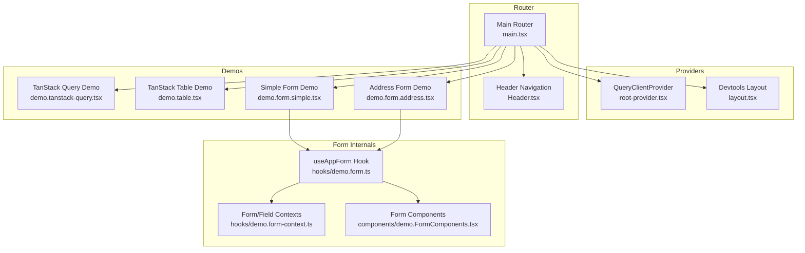
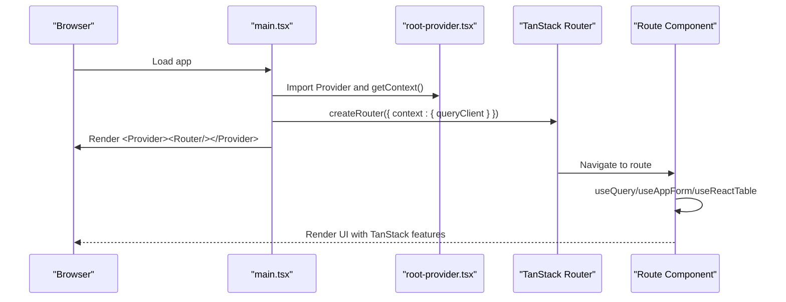
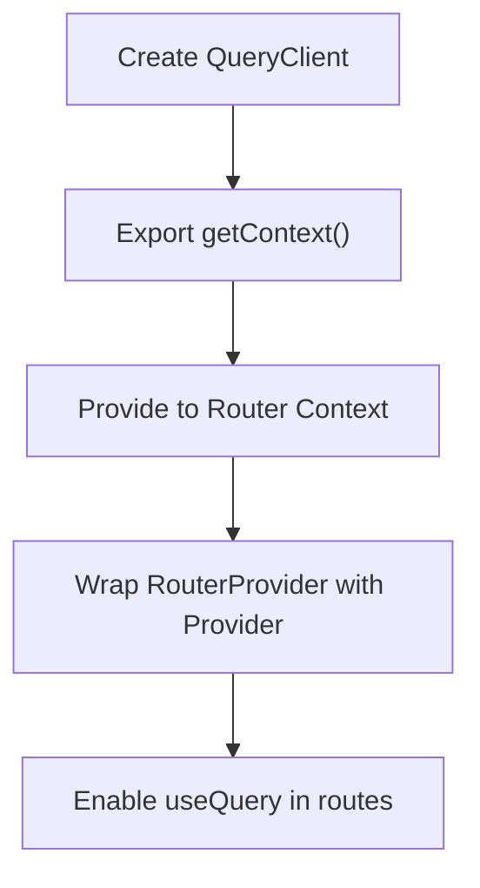
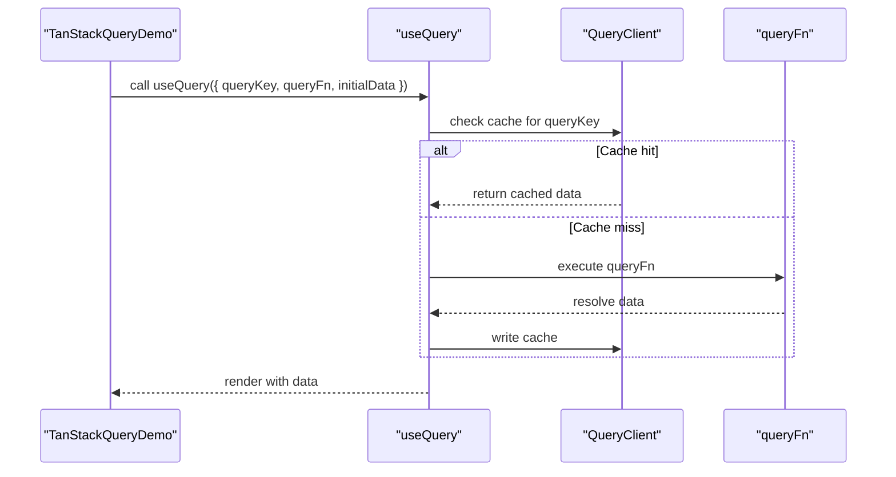
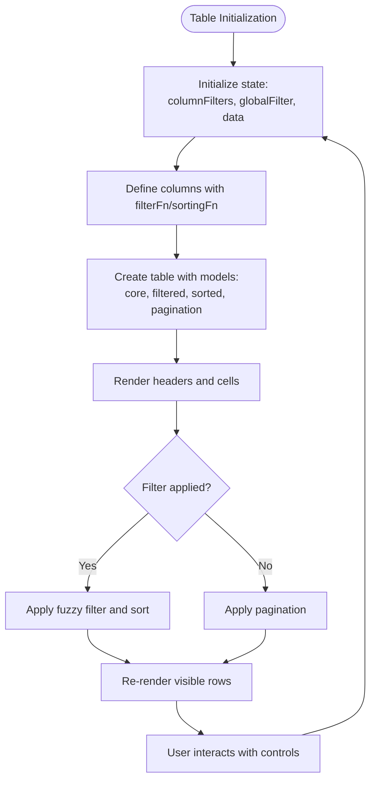
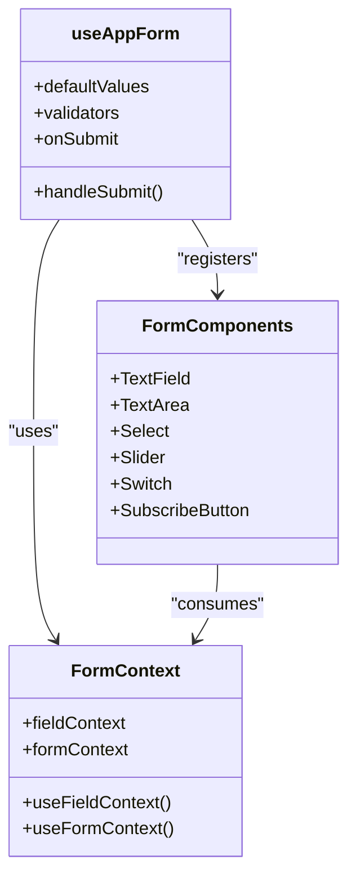
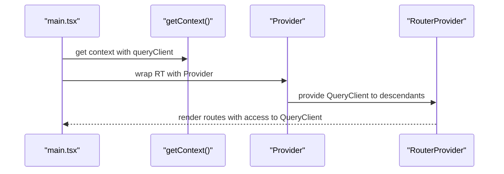
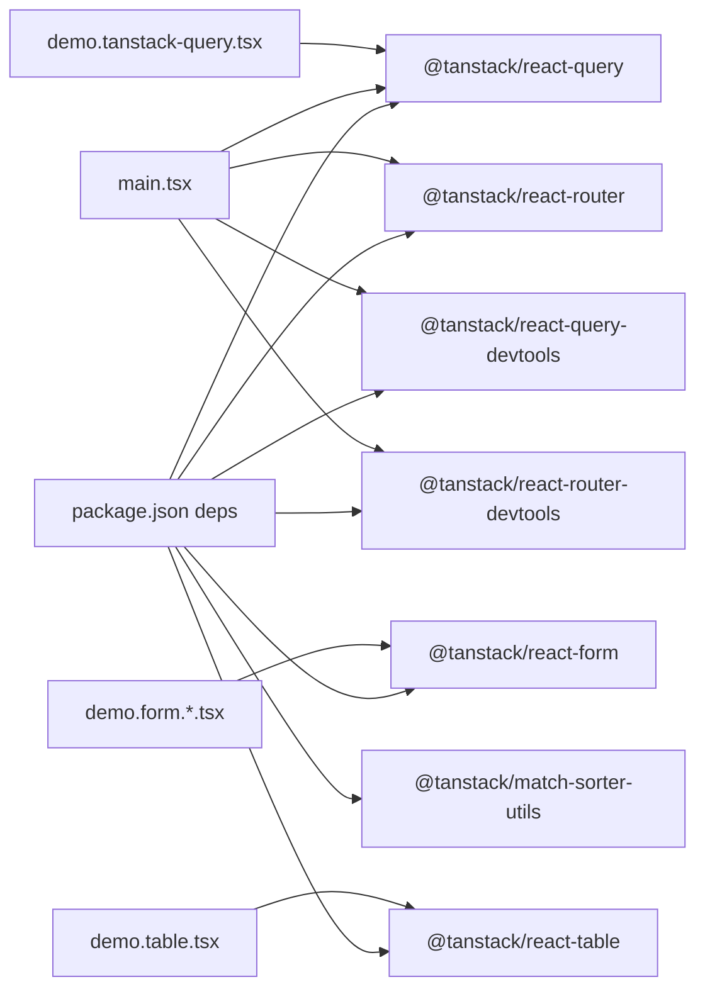

# TanStack Integration

<cite>
**Referenced Files in This Document**
- [root-provider.tsx](file://src/integrations/tanstack-query/root-provider.tsx)
- [layout.tsx](file://src/integrations/tanstack-query/layout.tsx)
- [main.tsx](file://src/main.tsx)
- [Header.tsx](file://src/components/Header.tsx)
- [demo.tanstack-query.tsx](file://src/routes/demo.tanstack-query.tsx)
- [demo.table.tsx](file://src/routes/demo.table.tsx)
- [demo.form.simple.tsx](file://src/routes/demo.form.simple.tsx)
- [demo.form.address.tsx](file://src/routes/demo.form.address.tsx)
- [demo.form.ts](file://src/hooks/demo.form.ts)
- [demo.form-context.ts](file://src/hooks/demo.form-context.ts)
- [demo.FormComponents.tsx](file://src/components/demo.FormComponents.tsx)
- [demo-table-data.ts](file://src/data/demo-table-data.ts)
- [package.json](file://package.json)
</cite>

## Table of Contents
1. [Introduction](#introduction)
2. [Project Structure](#project-structure)
3. [Core Components](#core-components)
4. [Architecture Overview](#architecture-overview)
5. [Detailed Component Analysis](#detailed-component-analysis)
6. [Dependency Analysis](#dependency-analysis)
7. [Performance Considerations](#performance-considerations)
8. [Troubleshooting Guide](#troubleshooting-guide)
9. [Conclusion](#conclusion)

## Introduction
This document explains the TanStack integration in the CV Portfolio Builder, focusing on:
- QueryClient setup and configuration for data fetching and caching
- Provider pattern and context management for React Query
- Form integration patterns using TanStack Form for reactive form handling
- Table integration for displaying structured data with sorting, filtering, and pagination
- Practical examples of data fetching patterns, error handling, and optimistic updates
- Performance considerations for large datasets and caching strategies
- Troubleshooting guides for common integration issues and debugging techniques

## Project Structure
The TanStack integration spans three primary areas:
- Query provider setup and devtools injection
- Route-based demos for Query, Table, and Form
- Shared form components and contexts

**Diagram sources**
- [root-provider.tsx:1-14](file://src/integrations/tanstack-query/root-provider.tsx#L1-L14)
- [layout.tsx:1-6](file://src/integrations/tanstack-query/layout.tsx#L1-L6)
- [main.tsx:29-83](file://src/main.tsx#L29-L83)
- [Header.tsx:1-34](file://src/components/Header.tsx#L1-L34)
- [demo.tanstack-query.tsx:1-31](file://src/routes/demo.tanstack-query.tsx#L1-L31)
- [demo.table.tsx:1-341](file://src/routes/demo.table.tsx#L1-L341)
- [demo.form.simple.tsx:1-69](file://src/routes/demo.form.simple.tsx#L1-L69)
- [demo.form.address.tsx:1-200](file://src/routes/demo.form.address.tsx#L1-L200)
- [demo.form.ts:1-18](file://src/hooks/demo.form.ts#L1-L18)
- [demo.form-context.ts:1-5](file://src/hooks/demo.form-context.ts#L1-L5)
- [demo.FormComponents.tsx:1-159](file://src/components/demo.FormComponents.tsx#L1-L159)

**Section sources**
- [main.tsx:29-83](file://src/main.tsx#L29-L83)
- [root-provider.tsx:1-14](file://src/integrations/tanstack-query/root-provider.tsx#L1-L14)
- [layout.tsx:1-6](file://src/integrations/tanstack-query/layout.tsx#L1-L6)
- [Header.tsx:1-34](file://src/components/Header.tsx#L1-L34)

## Core Components
- QueryClientProvider and context
  - A single QueryClient is created and exposed via a context getter. It is injected into the router’s context and wrapped around the RouterProvider.
  - Devtools are included via a layout component positioned at the bottom right.

- Router and routing
  - The main router composes the Header, Outlet, TanStack Router Devtools, and TanStack Query Devtools.
  - Routes for Query, Table, and Forms are registered under the root route.

- Form integration
  - A custom hook wraps TanStack Form with reusable field and form components and shared contexts.

**Section sources**
- [root-provider.tsx:1-14](file://src/integrations/tanstack-query/root-provider.tsx#L1-L14)
- [layout.tsx:1-6](file://src/integrations/tanstack-query/layout.tsx#L1-L6)
- [main.tsx:29-83](file://src/main.tsx#L29-L83)
- [demo.form.ts:1-18](file://src/hooks/demo.form.ts#L1-L18)

## Architecture Overview
The integration follows a layered approach:
- Providers: QueryClientProvider and devtools are provided at the root.
- Router: Centralizes routing and exposes the QueryClient via context.
- Demos: Feature-specific demos consume the provided context and libraries.

**Diagram sources**
- [main.tsx:56-83](file://src/main.tsx#L56-L83)
- [root-provider.tsx:5-13](file://src/integrations/tanstack-query/root-provider.tsx#L5-L13)

## Detailed Component Analysis

### QueryClient Setup and Provider Pattern
- QueryClient creation
  - A default QueryClient is instantiated and exported with a context getter and a Provider wrapper.
- Provider usage
  - The Provider wraps the RouterProvider so all route components can access the QueryClient via the router context.
- Devtools
  - React Query Devtools are included via a dedicated layout component.

**Diagram sources**
- [root-provider.tsx:3-13](file://src/integrations/tanstack-query/root-provider.tsx#L3-L13)
- [main.tsx:58-81](file://src/main.tsx#L58-L81)

**Section sources**
- [root-provider.tsx:1-14](file://src/integrations/tanstack-query/root-provider.tsx#L1-L14)
- [main.tsx:56-83](file://src/main.tsx#L56-L83)

### Data Fetching Demo (TanStack Query)
- Purpose
  - Demonstrates basic useQuery with a static mock query function and initial data.
- Key patterns
  - queryKey and queryFn define cache identity and fetch logic.
  - initialData provides hydration for immediate rendering.
- Error handling
  - Not shown in this demo; would typically be handled via query error states and retry/backoff policies configured on the QueryClient.
- Optimistic updates
  - Not shown in this demo; would involve mutation APIs and cache updates.

**Diagram sources**
- [demo.tanstack-query.tsx:6-11](file://src/routes/demo.tanstack-query.tsx#L6-L11)

**Section sources**
- [demo.tanstack-query.tsx:1-31](file://src/routes/demo.tanstack-query.tsx#L1-L31)

### Table Integration (TanStack Table)
- Features demonstrated
  - Sorting, filtering, pagination, and fuzzy search.
  - Custom filter and sort functions for fuzzy matching.
  - Debounced global filtering and per-column filters.
- Large dataset handling
  - The demo generates synthetic data with configurable sizes and includes a refresh action to stress-test performance.
- Pagination controls
  - First/last and previous/next buttons, page size selection, and direct page jump input.

**Diagram sources**
- [demo.table.tsx:66-126](file://src/routes/demo.table.tsx#L66-L126)
- [demo.table.tsx:137-291](file://src/routes/demo.table.tsx#L137-L291)

**Section sources**
- [demo.table.tsx:1-341](file://src/routes/demo.table.tsx#L1-L341)
- [demo-table-data.ts:1-47](file://src/data/demo-table-data.ts#L1-L47)

### Form Integration (TanStack Form)
- Hook composition
  - A custom useAppForm hook integrates TanStack Form with reusable field components and shared contexts.
- Field components
  - TextField, TextArea, Select, Slider, Switch are wired to field stores and subscribe to validation states.
- Validation patterns
  - Schema-based validation on blur and inline validator functions for complex rules.
- Submission handling
  - Form submit triggers validation and logs the submitted value; success feedback is shown via alerts.

**Diagram sources**
- [demo.form.ts:6-17](file://src/hooks/demo.form.ts#L6-L17)
- [demo.form-context.ts:3-4](file://src/hooks/demo.form-context.ts#L3-L4)
- [demo.FormComponents.tsx:13-159](file://src/components/demo.FormComponents.tsx#L13-L159)

**Section sources**
- [demo.form.ts:1-18](file://src/hooks/demo.form.ts#L1-L18)
- [demo.form-context.ts:1-5](file://src/hooks/demo.form-context.ts#L1-L5)
- [demo.FormComponents.tsx:1-159](file://src/components/demo.FormComponents.tsx#L1-L159)
- [demo.form.simple.tsx:1-69](file://src/routes/demo.form.simple.tsx#L1-L69)
- [demo.form.address.tsx:1-200](file://src/routes/demo.form.address.tsx#L1-L200)

### Provider Pattern and Context Management
- Context exposure
  - getContext returns the QueryClient instance for router context injection.
- Provider wrapping
  - Provider wraps RouterProvider so route components can access the QueryClient implicitly via the router’s context.
- Devtools lifecycle
  - Devtools are rendered alongside the outlet via the layout component.

**Diagram sources**
- [root-provider.tsx:5-13](file://src/integrations/tanstack-query/root-provider.tsx#L5-L13)
- [main.tsx:58-81](file://src/main.tsx#L58-L81)

**Section sources**
- [root-provider.tsx:1-14](file://src/integrations/tanstack-query/root-provider.tsx#L1-L14)
- [main.tsx:56-83](file://src/main.tsx#L56-L83)

## Dependency Analysis
- Core TanStack packages used
  - @tanstack/react-query, @tanstack/react-query-devtools
  - @tanstack/react-table
  - @tanstack/react-form
  - @tanstack/react-router and devtools
- Internal wiring
  - main.tsx imports and composes providers, devtools, and routes.
  - demos depend on their respective TanStack packages and internal hooks/components.

**Diagram sources**
- [package.json:15-44](file://package.json#L15-L44)
- [main.tsx:10-22](file://src/main.tsx#L10-L22)
- [demo.tanstack-query.tsx:1-31](file://src/routes/demo.tanstack-query.tsx#L1-L31)
- [demo.table.tsx:1-341](file://src/routes/demo.table.tsx#L1-L341)
- [demo.form.simple.tsx:1-69](file://src/routes/demo.form.simple.tsx#L1-L69)
- [demo.form.address.tsx:1-200](file://src/routes/demo.form.address.tsx#L1-L200)

**Section sources**
- [package.json:15-44](file://package.json#L15-L44)
- [main.tsx:10-22](file://src/main.tsx#L10-L22)

## Performance Considerations
- QueryClient defaults
  - The router sets default structural sharing and preload stale time; consider tuning these for your data characteristics.
- Table rendering
  - For very large datasets, consider virtualization or server-side pagination/filtering to avoid rendering thousands of DOM nodes.
  - Debounced filtering reduces re-computation frequency.
- Form rendering
  - Subscribe only to necessary parts of the form state to minimize re-renders.
- Devtools overhead
  - Keep devtools enabled only during development; they add runtime overhead.

[No sources needed since this section provides general guidance]

## Troubleshooting Guide
- QueryClient not available in a route
  - Ensure the router context includes the QueryClient via getContext and that Provider wraps RouterProvider.
- Devtools not visible
  - Confirm the layout component is rendered in the root route and positioned appropriately.
- Form validation not triggering
  - Verify field components are wrapped in AppField and validators are attached to the correct field names.
- Table performance issues
  - Reduce dataset size for local demos or implement server-side pagination/sorting.
- Navigation links missing
  - Check the Header component for correct route paths.

**Section sources**
- [main.tsx:56-83](file://src/main.tsx#L56-L83)
- [layout.tsx:1-6](file://src/integrations/tanstack-query/layout.tsx#L1-L6)
- [Header.tsx:1-34](file://src/components/Header.tsx#L1-L34)
- [demo.FormComponents.tsx:41-118](file://src/components/demo.FormComponents.tsx#L41-L118)
- [demo.table.tsx:106-126](file://src/routes/demo.table.tsx#L106-L126)

## Conclusion
The CV Portfolio Builder integrates TanStack across Query, Table, and Form domains with a clean provider pattern and modular demos. The setup enables scalable data fetching, efficient table rendering, and robust form handling. For production workloads, tune QueryClient defaults, implement pagination/virtualization, and keep devtools scoped to development.