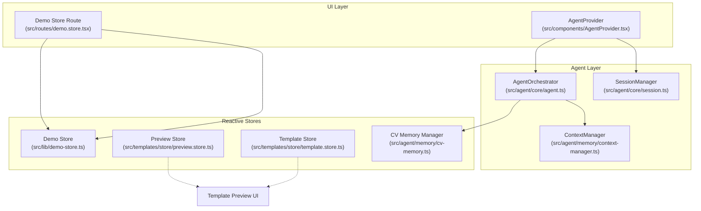
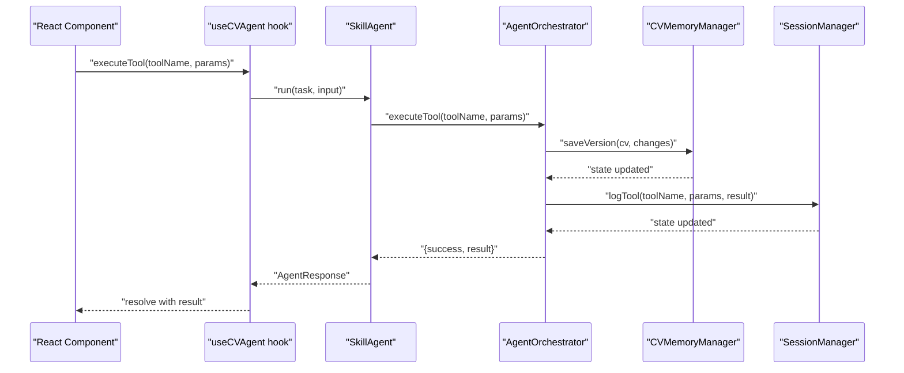
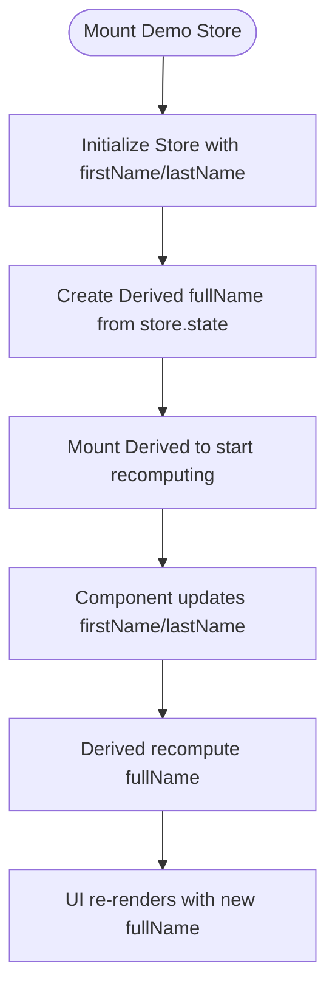
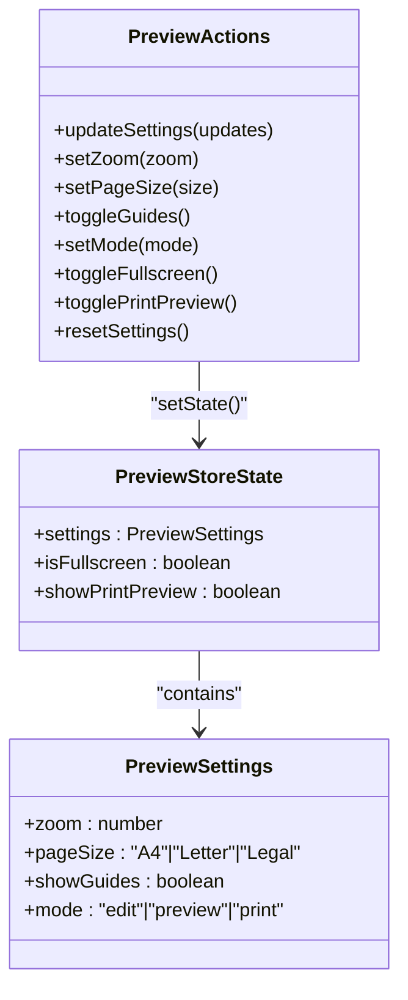
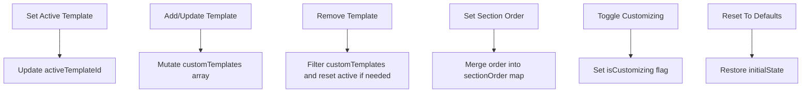
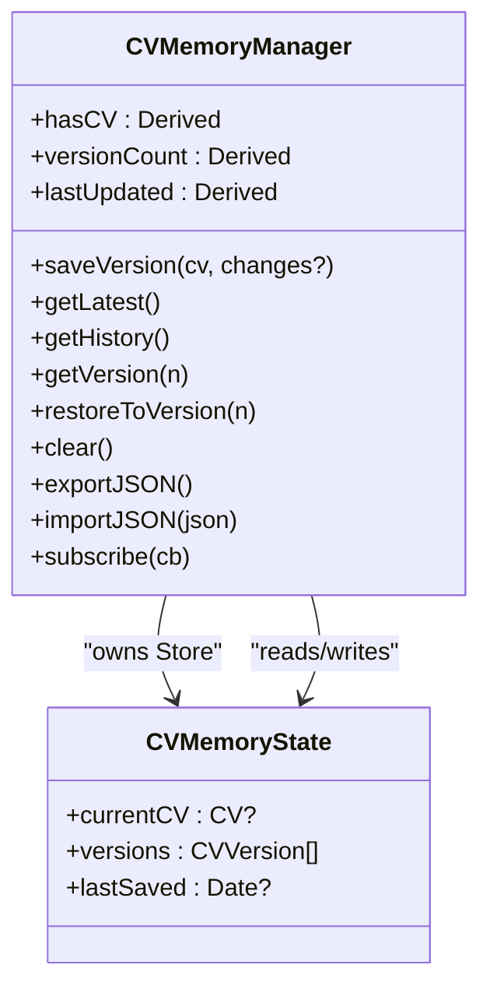
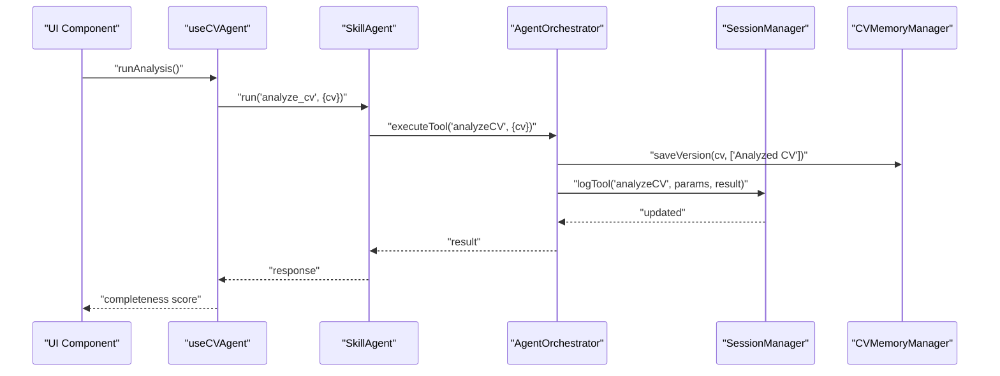
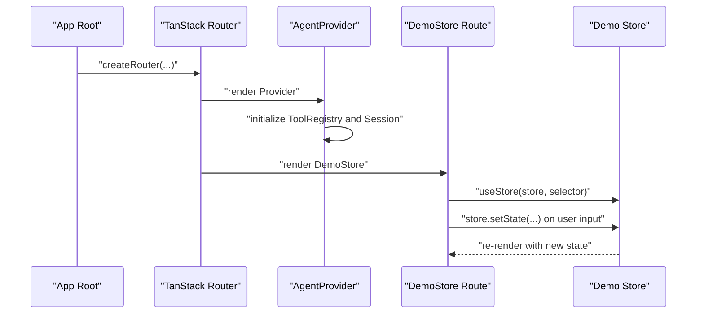
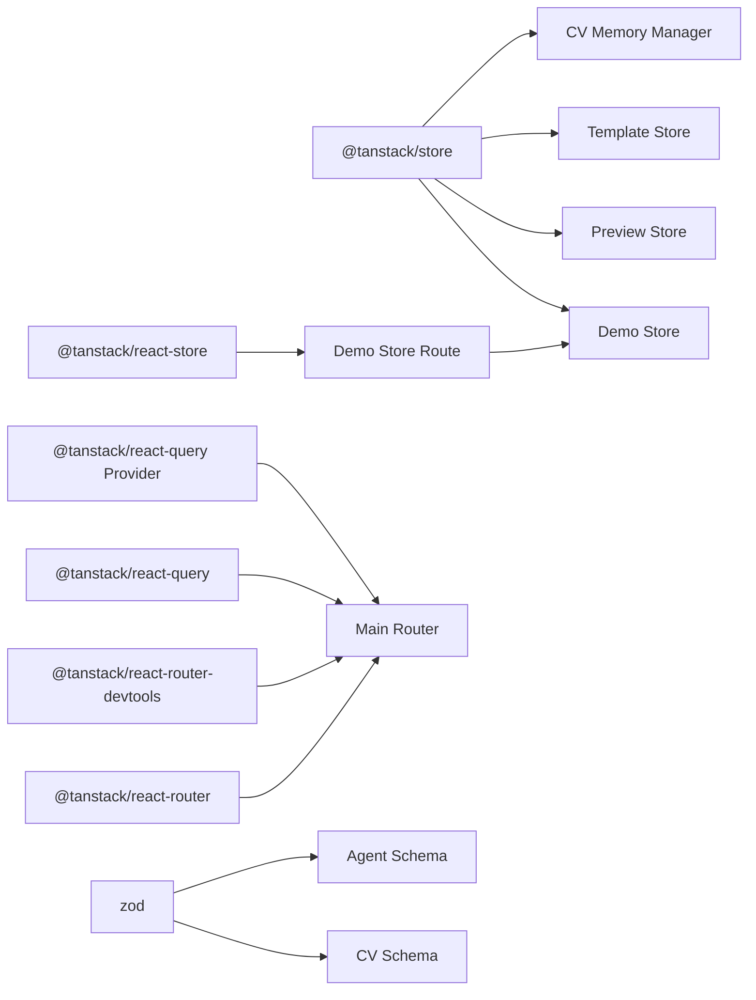

# TanStack Store Integration

<cite>
**Referenced Files in This Document**
- [src/lib/demo-store.ts](file://src/lib/demo-store.ts)
- [src/routes/demo.store.tsx](file://src/routes/demo.store.tsx)
- [src/templates/store/preview.store.ts](file://src/templates/store/preview.store.ts)
- [src/templates/store/template.store.ts](file://src/templates/store/template.store.ts)
- [src/agent/memory/cv-memory.ts](file://src/agent/memory/cv-memory.ts)
- [src/agent/memory/context-manager.ts](file://src/agent/memory/context-manager.ts)
- [src/agent/core/agent.ts](file://src/agent/core/agent.ts)
- [src/agent/core/session.ts](file://src/agent/core/session.ts)
- [src/hooks/use-cv-agent.ts](file://src/hooks/use-cv-agent.ts)
- [src/components/AgentProvider.tsx](file://src/components/AgentProvider.tsx)
- [src/main.tsx](file://src/main.tsx)
- [src/templates/types/template.types.ts](file://src/templates/types/template.types.ts)
- [src/agent/schemas/agent.schema.ts](file://src/agent/schemas/agent.schema.ts)
- [package.json](file://package.json)
</cite>

## Table of Contents
1. [Introduction](#introduction)
2. [Project Structure](#project-structure)
3. [Core Components](#core-components)
4. [Architecture Overview](#architecture-overview)
5. [Detailed Component Analysis](#detailed-component-analysis)
6. [Dependency Analysis](#dependency-analysis)
7. [Performance Considerations](#performance-considerations)
8. [Troubleshooting Guide](#troubleshooting-guide)
9. [Conclusion](#conclusion)

## Introduction
This document explains how TanStack Store is integrated into the CV Portfolio Builder to manage reactive state across CV data, agent orchestration, and UI components. It covers store initialization, derived state computation, subscriptions, actions, selectors, and state derivation patterns. It also documents integration with CV data structures, agent state management, and UI synchronization, along with examples of complex updates, batch operations, persistence, performance strategies, and debugging approaches.

## Project Structure
TanStack Store is used alongside TanStack Router and React components to provide fine-grained reactive state. Key areas:
- Demo store for learning reactive state and derived values
- Template stores for preview and template customization
- Agent memory stores for CV versions, session logs, and preferences
- Hooks to consume reactive state in components
- Agent provider to initialize tool registries and sessions

**Diagram sources**
- [src/routes/demo.store.tsx:1-62](file://src/routes/demo.store.tsx#L1-L62)
- [src/lib/demo-store.ts:1-14](file://src/lib/demo-store.ts#L1-L14)
- [src/templates/store/preview.store.ts:1-100](file://src/templates/store/preview.store.ts#L1-L100)
- [src/templates/store/template.store.ts:1-103](file://src/templates/store/template.store.ts#L1-L103)
- [src/agent/memory/cv-memory.ts:19-148](file://src/agent/memory/cv-memory.ts#L19-L148)
- [src/agent/core/agent.ts:60-168](file://src/agent/core/agent.ts#L60-L168)
- [src/agent/core/session.ts:7-200](file://src/agent/core/session.ts#L7-L200)
- [src/agent/memory/context-manager.ts:1-141](file://src/agent/memory/context-manager.ts#L1-L141)
- [src/components/AgentProvider.tsx:1-30](file://src/components/AgentProvider.tsx#L1-L30)

**Section sources**
- [src/main.tsx:1-89](file://src/main.tsx#L1-L89)
- [package.json:15-43](file://package.json#L15-L43)

## Core Components
- Demo store demonstrates basic store creation, derived state, and subscription mounting.
- Preview store encapsulates preview settings with derived computed values and actions to update state.
- Template store manages active template, custom templates, section ordering, and derived selections.
- CV memory manager exposes a class-based store with derived booleans and counters, plus persistence helpers.
- Hooks integrate TanStack Store with React via useStore and expose reactive slices of agent state.

**Section sources**
- [src/lib/demo-store.ts:1-14](file://src/lib/demo-store.ts#L1-L14)
- [src/templates/store/preview.store.ts:1-100](file://src/templates/store/preview.store.ts#L1-L100)
- [src/templates/store/template.store.ts:1-103](file://src/templates/store/template.store.ts#L1-L103)
- [src/agent/memory/cv-memory.ts:19-148](file://src/agent/memory/cv-memory.ts#L19-L148)
- [src/hooks/use-cv-agent.ts:106-120](file://src/hooks/use-cv-agent.ts#L106-L120)

## Architecture Overview
The system composes TanStack Store with TanStack Router and React components. Stores are initialized at module boundaries and exposed as singletons. Components subscribe to specific slices via useStore. Agent orchestration coordinates tool execution and persists results to memory stores. Session and context managers maintain runtime state and persistence.

**Diagram sources**
- [src/hooks/use-cv-agent.ts:17-46](file://src/hooks/use-cv-agent.ts#L17-L46)
- [src/agent/core/agent.ts:188-281](file://src/agent/core/agent.ts#L188-L281)
- [src/agent/core/agent.ts:78-127](file://src/agent/core/agent.ts#L78-L127)
- [src/agent/memory/cv-memory.ts:55-72](file://src/agent/memory/cv-memory.ts#L55-L72)
- [src/agent/core/session.ts:57-70](file://src/agent/core/session.ts#L57-L70)

## Detailed Component Analysis

### Demo Store: Reactive Basics
- Initializes a simple store with first and last name.
- Derives full name from state and mounts it for reactive updates.
- Demonstrates subscribing to store slices and updating state immutably.

**Diagram sources**
- [src/lib/demo-store.ts:3-13](file://src/lib/demo-store.ts#L3-L13)
- [src/routes/demo.store.tsx:8-35](file://src/routes/demo.store.tsx#L8-L35)

**Section sources**
- [src/lib/demo-store.ts:1-14](file://src/lib/demo-store.ts#L1-L14)
- [src/routes/demo.store.tsx:1-62](file://src/routes/demo.store.tsx#L1-L62)

### Preview Store: Preview Settings and Derived State
- Encapsulates preview settings (zoom, page size, guides, mode) and flags (fullscreen, print preview).
- Exposes derived selectors for current zoom and edit mode.
- Provides actions to update settings, clamp zoom, toggle guides, change mode, and reset to defaults.

**Diagram sources**
- [src/templates/store/preview.store.ts:12-25](file://src/templates/store/preview.store.ts#L12-L25)
- [src/templates/store/preview.store.ts:40-95](file://src/templates/store/preview.store.ts#L40-L95)
- [src/templates/types/template.types.ts:64-69](file://src/templates/types/template.types.ts#L64-L69)

**Section sources**
- [src/templates/store/preview.store.ts:1-100](file://src/templates/store/preview.store.ts#L1-L100)
- [src/templates/types/template.types.ts:1-77](file://src/templates/types/template.types.ts#L1-L77)

### Template Store: Active Template and Customization
- Manages active template ID, custom templates, per-template section order, and customization flag.
- Exposes derived selectors for active template and whether a template is selected.
- Provides actions to set active template, add/update/remove custom templates, reorder sections, toggle customization, and reset to defaults.

**Diagram sources**
- [src/templates/store/template.store.ts:46-98](file://src/templates/store/template.store.ts#L46-L98)
- [src/templates/store/template.store.ts:22-43](file://src/templates/store/template.store.ts#L22-L43)

**Section sources**
- [src/templates/store/template.store.ts:1-103](file://src/templates/store/template.store.ts#L1-L103)

### CV Memory Manager: Versioning and History
- Encapsulates current CV, version history, and last saved timestamp.
- Exposes derived booleans and counters for presence and count of versions.
- Provides actions to save versions, retrieve latest/history/version, restore to a version, clear data, and import/export JSON.
- Subscriptions supported via store.subscribe for external observers.

**Diagram sources**
- [src/agent/memory/cv-memory.ts:7-17](file://src/agent/memory/cv-memory.ts#L7-L17)
- [src/agent/memory/cv-memory.ts:19-148](file://src/agent/memory/cv-memory.ts#L19-L148)

**Section sources**
- [src/agent/memory/cv-memory.ts:1-290](file://src/agent/memory/cv-memory.ts#L1-L290)

### Agent Orchestration and Session Management
- AgentOrchestrator coordinates tool execution, logs to session memory, and optionally integrates an LLM service.
- SessionManager persists session state to localStorage, tracks activity, and exports session data.
- ContextManager updates and queries agent context used by tools and suggestions.

**Diagram sources**
- [src/hooks/use-cv-agent.ts:66-76](file://src/hooks/use-cv-agent.ts#L66-L76)
- [src/agent/core/agent.ts:286-297](file://src/agent/core/agent.ts#L286-L297)
- [src/agent/core/agent.ts:109-114](file://src/agent/core/agent.ts#L109-L114)
- [src/agent/core/session.ts:57-70](file://src/agent/core/session.ts#L57-L70)
- [src/agent/memory/cv-memory.ts:55-72](file://src/agent/memory/cv-memory.ts#L55-L72)

**Section sources**
- [src/agent/core/agent.ts:60-168](file://src/agent/core/agent.ts#L60-L168)
- [src/agent/core/session.ts:1-204](file://src/agent/core/session.ts#L1-L204)
- [src/agent/memory/context-manager.ts:1-141](file://src/agent/memory/context-manager.ts#L1-L141)

### UI Integration and Subscription Handling
- Components use useStore to subscribe to store slices and trigger setState updates.
- AgentProvider initializes tool registry and starts a session on mount.
- Router wiring ensures context providers are available to routes.

**Diagram sources**
- [src/main.tsx:29-83](file://src/main.tsx#L29-L83)
- [src/components/AgentProvider.tsx:12-26](file://src/components/AgentProvider.tsx#L12-L26)
- [src/routes/demo.store.tsx:8-35](file://src/routes/demo.store.tsx#L8-L35)
- [src/lib/demo-store.ts:3-13](file://src/lib/demo-store.ts#L3-L13)

**Section sources**
- [src/main.tsx:1-89](file://src/main.tsx#L1-L89)
- [src/components/AgentProvider.tsx:1-30](file://src/components/AgentProvider.tsx#L1-L30)
- [src/routes/demo.store.tsx:1-62](file://src/routes/demo.store.tsx#L1-L62)

## Dependency Analysis
- TanStack Store and TanStack React Store are core dependencies for reactive state.
- TanStack Router provides routing and devtools integration.
- TanStack Query is integrated for caching and server state (separate from local stores).
- Zod schemas define CV and agent context structures.

**Diagram sources**
- [package.json:31-33](file://package.json#L31-L33)
- [src/main.tsx:29-83](file://src/main.tsx#L29-L83)
- [src/agent/schemas/cv.schema.ts:1-79](file://src/agent/schemas/cv.schema.ts#L1-L79)
- [src/agent/schemas/agent.schema.ts:1-62](file://src/agent/schemas/agent.schema.ts#L1-L62)

**Section sources**
- [package.json:15-43](file://package.json#L15-L43)
- [src/main.tsx:1-89](file://src/main.tsx#L1-L89)

## Performance Considerations
- Prefer derived state for computed values to avoid redundant recomputation and keep components pure.
- Use immutable updates via setState with spread operators to ensure efficient re-renders.
- Batch updates when possible by grouping multiple setState calls within the same event loop.
- Memoize expensive computations outside of render using useMemo or derived selectors.
- Avoid subscribing to overly broad slices; subscribe to narrow selectors to minimize re-renders.
- Use structural sharing and shallow equality checks to prevent unnecessary renders.
- Persist only essential state to localStorage or IndexedDB to reduce storage overhead.

## Troubleshooting Guide
- Debugging state changes:
  - Use mounted derived selectors to observe recomputation triggers.
  - Subscribe to store.subscribe for external observers to log state transitions.
  - Enable agent debug mode in the orchestrator to log tool execution timing and outcomes.
- Common issues:
  - Not mounting derived selectors leads to stale values; ensure mount() is called after creation.
  - Mutating state directly instead of using setState causes missed updates; always return a new state object.
  - Over-subscription to large slices increases render frequency; narrow selectors to specific fields.
  - Session persistence failures: verify localStorage availability and handle exceptions during save/load.
- Validation:
  - Use Zod schemas to validate CV and context structures before saving or exporting.

**Section sources**
- [src/agent/core/agent.ts:104-106](file://src/agent/core/agent.ts#L104-L106)
- [src/agent/memory/cv-memory.ts:143-147](file://src/agent/memory/cv-memory.ts#L143-L147)
- [src/agent/core/session.ts:75-90](file://src/agent/core/session.ts#L75-L90)

## Conclusion
TanStack Store underpins the CV Portfolio Builder’s reactive state management across CV data, preview controls, templates, and agent orchestration. By combining derived state, targeted selectors, and immutable updates, the system achieves predictable UI synchronization and maintainable state logic. Hooks bridge stores to components, while agent managers persist and contextualize state for intelligent automation. Following the patterns documented here enables robust, scalable state management with strong developer ergonomics.