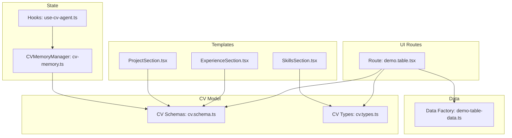
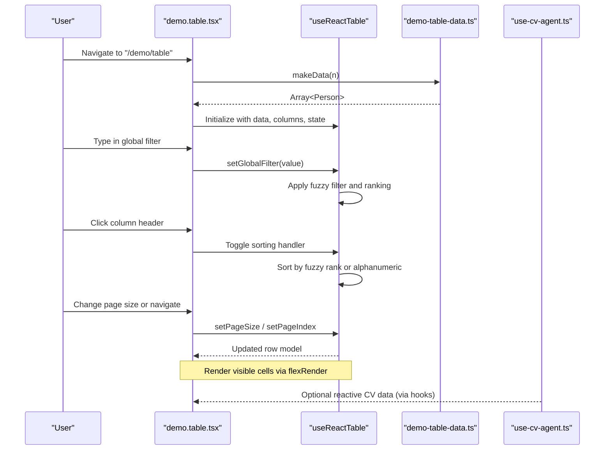
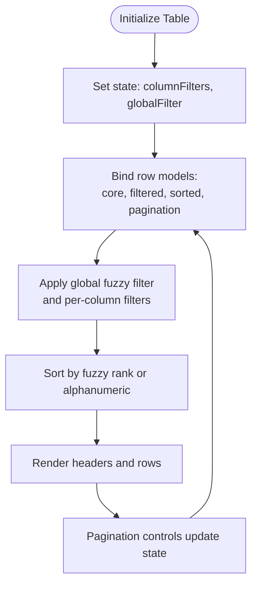
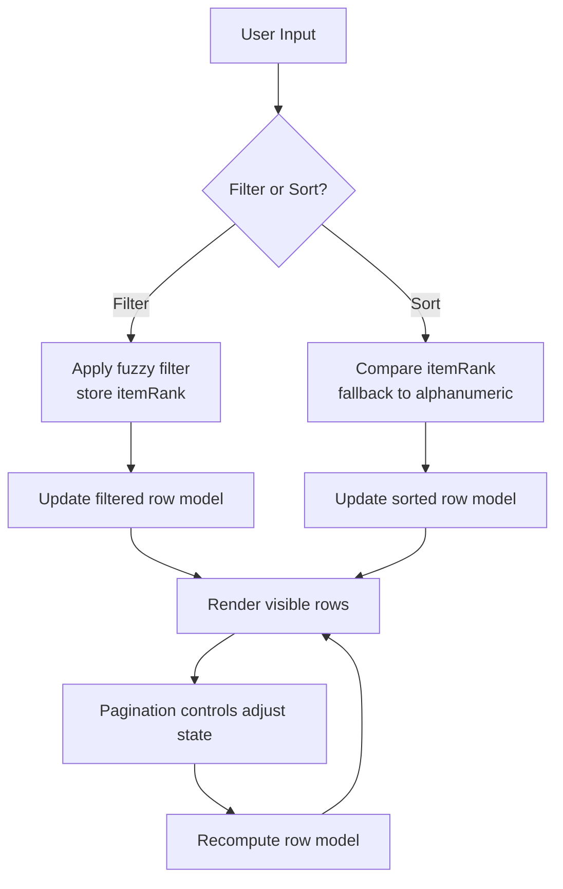
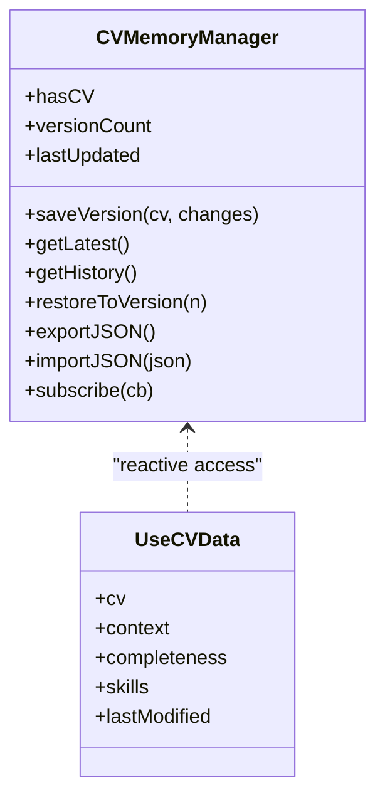
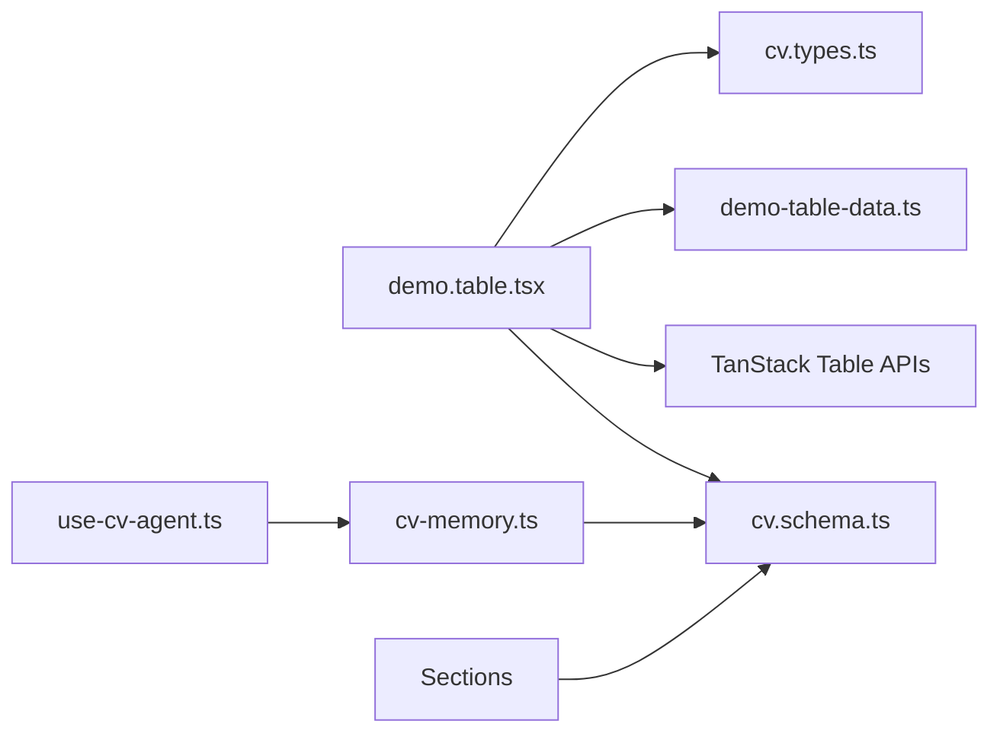

# TanStack Table Integration

<cite>
**Referenced Files in This Document**
- [demo.table.tsx](file://src/routes/demo.table.tsx)
- [demo-table-data.ts](file://src/data/demo-table-data.ts)
- [cv.schema.ts](file://src/agent/schemas/cv.schema.ts)
- [cv.types.ts](file://src/templates/types/cv.types.ts)
- [ExperienceSection.tsx](file://src/templates/sections/ExperienceSection.tsx)
- [ProjectSection.tsx](file://src/templates/sections/ProjectSection.tsx)
- [SkillsSection.tsx](file://src/templates/sections/SkillsSection.tsx)
- [cv-memory.ts](file://src/agent/memory/cv-memory.ts)
- [use-cv-agent.ts](file://src/hooks/use-cv-agent.ts)
- [SKILL_AGENT_README.md](file://SKILL_AGENT_README.md)
- [SKILL_AGENT_QUICKSTART.md](file://SKILL_AGENT_QUICKSTART.md)
</cite>

## Table of Contents
1. [Introduction](#introduction)
2. [Project Structure](#project-structure)
3. [Core Components](#core-components)
4. [Architecture Overview](#architecture-overview)
5. [Detailed Component Analysis](#detailed-component-analysis)
6. [Dependency Analysis](#dependency-analysis)
7. [Performance Considerations](#performance-considerations)
8. [Troubleshooting Guide](#troubleshooting-guide)
9. [Conclusion](#conclusion)
10. [Appendices](#appendices)

## Introduction
This document explains how to integrate TanStack Table to display structured CV data, focusing on configuration, column definitions, and data binding patterns. It covers sorting, filtering, and pagination for experience lists, project portfolios, and skills matrices. It also documents custom cell renderers, row actions, interactive features, performance optimization for large datasets, virtualization patterns, responsive design, and integration with CV state management.

## Project Structure
The TanStack Table integration is demonstrated in a dedicated route that renders a large dataset with fuzzy search, pagination, and sorting. CV data is modeled via Zod schemas and exposed through reactive hooks backed by a store. Sections for experience, projects, and skills are provided as template components for rendering CV content.

**Diagram sources**
- [demo.table.tsx:1-341](file://src/routes/demo.table.tsx#L1-L341)
- [demo-table-data.ts:1-47](file://src/data/demo-table-data.ts#L1-L47)
- [cv.schema.ts:1-79](file://src/agent/schemas/cv.schema.ts#L1-L79)
- [cv.types.ts:1-16](file://src/templates/types/cv.types.ts#L1-L16)
- [ExperienceSection.tsx:1-61](file://src/templates/sections/ExperienceSection.tsx#L1-L61)
- [ProjectSection.tsx:1-49](file://src/templates/sections/ProjectSection.tsx#L1-L49)
- [SkillsSection.tsx:1-26](file://src/templates/sections/SkillsSection.tsx#L1-L26)
- [cv-memory.ts:1-290](file://src/agent/memory/cv-memory.ts#L1-L290)
- [use-cv-agent.ts:1-182](file://src/hooks/use-cv-agent.ts#L1-L182)

**Section sources**
- [demo.table.tsx:1-341](file://src/routes/demo.table.tsx#L1-L341)
- [demo-table-data.ts:1-47](file://src/data/demo-table-data.ts#L1-L47)
- [cv.schema.ts:1-79](file://src/agent/schemas/cv.schema.ts#L1-L79)
- [cv.types.ts:1-16](file://src/templates/types/cv.types.ts#L1-L16)
- [ExperienceSection.tsx:1-61](file://src/templates/sections/ExperienceSection.tsx#L1-L61)
- [ProjectSection.tsx:1-49](file://src/templates/sections/ProjectSection.tsx#L1-L49)
- [SkillsSection.tsx:1-26](file://src/templates/sections/SkillsSection.tsx#L1-L26)
- [cv-memory.ts:1-290](file://src/agent/memory/cv-memory.ts#L1-L290)
- [use-cv-agent.ts:1-182](file://src/hooks/use-cv-agent.ts#L1-L182)

## Core Components
- TanStack Table route with fuzzy filtering and sorting, pagination controls, and debounced inputs.
- CV data model with Zod schemas for experience, projects, education, and skills.
- Template sections for rendering experience, projects, and skills.
- Reactive CV state via a store-backed memory manager and hooks.

Key capabilities:
- Filtering: global fuzzy filter and per-column filters (including a custom fuzzy filter).
- Sorting: default alphanumeric fallback with fuzzy ranking-aware sorting.
- Pagination: configurable page sizes and navigation controls.
- Rendering: flexible cell renderers and responsive layout.

**Section sources**
- [demo.table.tsx:66-291](file://src/routes/demo.table.tsx#L66-L291)
- [demo-table-data.ts:34-46](file://src/data/demo-table-data.ts#L34-L46)
- [cv.schema.ts:21-61](file://src/agent/schemas/cv.schema.ts#L21-L61)
- [ExperienceSection.tsx:8-61](file://src/templates/sections/ExperienceSection.tsx#L8-L61)
- [ProjectSection.tsx:8-49](file://src/templates/sections/ProjectSection.tsx#L8-L49)
- [SkillsSection.tsx:7-26](file://src/templates/sections/SkillsSection.tsx#L7-L26)
- [cv-memory.ts:19-148](file://src/agent/memory/cv-memory.ts#L19-L148)
- [use-cv-agent.ts:106-120](file://src/hooks/use-cv-agent.ts#L106-L120)

## Architecture Overview
The integration pattern centers on a route component that initializes TanStack Table with:
- Core, filtered, sorted, and paginated row models.
- A custom fuzzy filter and fuzzy-aware sorting function.
- Debounced global and column filters.
- Pagination controls bound to table state.

CV data is consumed via reactive hooks and stored in a memory manager. Template sections render CV content outside the table context.

**Diagram sources**
- [demo.table.tsx:66-291](file://src/routes/demo.table.tsx#L66-L291)
- [demo-table-data.ts:34-46](file://src/data/demo-table-data.ts#L34-L46)
- [use-cv-agent.ts:106-120](file://src/hooks/use-cv-agent.ts#L106-L120)

## Detailed Component Analysis

### TanStack Table Route and Configuration
- Initializes table with core, filtered, sorted, and paginated row models.
- Defines a custom fuzzy filter and fuzzy-aware sorting function.
- Uses a debounced global filter and per-column filters.
- Provides pagination controls and page size selection.
- Demonstrates sorting behavior when fuzzy filtering is applied.

Implementation highlights:
- Custom fuzzy filter stores ranking metadata and filters rows accordingly.
- Fuzzy sort compares ranking info; falls back to alphanumeric when equal.
- Debounced input components prevent excessive re-renders during typing.
- Pagination state updates trigger efficient re-rendering of visible rows.

**Diagram sources**
- [demo.table.tsx:106-126](file://src/routes/demo.table.tsx#L106-L126)
- [demo.table.tsx:39-64](file://src/routes/demo.table.tsx#L39-L64)
- [demo.table.tsx:293-333](file://src/routes/demo.table.tsx#L293-L333)

**Section sources**
- [demo.table.tsx:66-291](file://src/routes/demo.table.tsx#L66-L291)
- [demo.table.tsx:39-64](file://src/routes/demo.table.tsx#L39-L64)
- [demo.table.tsx:293-333](file://src/routes/demo.table.tsx#L293-L333)

### Column Definitions and Data Binding Patterns
- Columns use accessorKey, accessorFn, and custom cell/header renderers.
- Per-column filter functions demonstrate exact, case-sensitive, case-insensitive, and fuzzy filtering.
- Data binding uses a factory that generates large datasets for performance testing.

Patterns:
- Use accessorKey for simple fields.
- Use accessorFn for computed or composite fields (e.g., full name).
- Bind cell/header renderers for custom UI.
- Apply filterFns per column to control matching behavior.

**Section sources**
- [demo.table.tsx:72-101](file://src/routes/demo.table.tsx#L72-L101)
- [demo-table-data.ts:34-46](file://src/data/demo-table-data.ts#L34-L46)

### Sorting, Filtering, and Pagination
- Sorting: alphanumeric fallback ensures deterministic ordering when fuzzy ranks are equal.
- Filtering: fuzzy filter integrates with match-sorter ranking; global filter applies fuzzy by default.
- Pagination: page index and page size are reactive and drive row model updates.

**Diagram sources**
- [demo.table.tsx:52-64](file://src/routes/demo.table.tsx#L52-L64)
- [demo.table.tsx:106-126](file://src/routes/demo.table.tsx#L106-L126)

**Section sources**
- [demo.table.tsx:52-64](file://src/routes/demo.table.tsx#L52-L64)
- [demo.table.tsx:106-126](file://src/routes/demo.table.tsx#L106-L126)

### Custom Cell Renderers and Interactive Features
- Custom cell renderer for a column demonstrates value rendering.
- Column headers support toggling sorting and optional per-column filter UI.
- Debounced input components encapsulate filtering behavior.

Guidance:
- Encapsulate filter UI in reusable components.
- Use flexRender for dynamic cell/header rendering.
- Bind interactive controls to table state setters.

**Section sources**
- [demo.table.tsx:80-81](file://src/routes/demo.table.tsx#L80-L81)
- [demo.table.tsx:158-171](file://src/routes/demo.table.tsx#L158-L171)
- [demo.table.tsx:293-305](file://src/routes/demo.table.tsx#L293-L305)
- [demo.table.tsx:308-333](file://src/routes/demo.table.tsx#L308-L333)

### CV Data Models and Template Sections
- CV schemas define experience, project, education, and skills structures.
- Template sections render experience, projects, and skills for presentation.
- Types re-export CV interfaces for consistent usage across templates.

Integration:
- Use CV data from hooks/state to populate table data or render sections.
- Align table columns with CV schema fields for consistent UX.

**Section sources**
- [cv.schema.ts:21-61](file://src/agent/schemas/cv.schema.ts#L21-L61)
- [ExperienceSection.tsx:8-61](file://src/templates/sections/ExperienceSection.tsx#L8-L61)
- [ProjectSection.tsx:8-49](file://src/templates/sections/ProjectSection.tsx#L8-L49)
- [SkillsSection.tsx:7-26](file://src/templates/sections/SkillsSection.tsx#L7-L26)
- [cv.types.ts:11-16](file://src/templates/types/cv.types.ts#L11-L16)

### Integrating Table Data with CV State Management
- Reactive CV data is accessed via hooks backed by a store.
- CV memory manager persists versions and exposes derived states.
- Hooks expose completeness, categorized skills, and last modified timestamps.

Patterns:
- Use hooks to derive table data from CV state.
- Persist CV changes through the memory manager.
- Observe derived states for UI updates.

**Diagram sources**
- [cv-memory.ts:19-148](file://src/agent/memory/cv-memory.ts#L19-L148)
- [use-cv-agent.ts:106-120](file://src/hooks/use-cv-agent.ts#L106-L120)

**Section sources**
- [cv-memory.ts:19-148](file://src/agent/memory/cv-memory.ts#L19-L148)
- [use-cv-agent.ts:106-120](file://src/hooks/use-cv-agent.ts#L106-L120)

## Dependency Analysis
- The table route depends on TanStack Table APIs and a local data factory.
- CV schemas and types underpin data structures used in templates and state.
- Hooks depend on the memory manager for reactive state.

**Diagram sources**
- [demo.table.tsx:1-341](file://src/routes/demo.table.tsx#L1-L341)
- [demo-table-data.ts:1-47](file://src/data/demo-table-data.ts#L1-L47)
- [cv.schema.ts:1-79](file://src/agent/schemas/cv.schema.ts#L1-L79)
- [cv.types.ts:1-16](file://src/templates/types/cv.types.ts#L1-L16)
- [cv-memory.ts:1-290](file://src/agent/memory/cv-memory.ts#L1-L290)
- [use-cv-agent.ts:1-182](file://src/hooks/use-cv-agent.ts#L1-L182)

**Section sources**
- [demo.table.tsx:1-341](file://src/routes/demo.table.tsx#L1-L341)
- [demo-table-data.ts:1-47](file://src/data/demo-table-data.ts#L1-L47)
- [cv.schema.ts:1-79](file://src/agent/schemas/cv.schema.ts#L1-L79)
- [cv.types.ts:1-16](file://src/templates/types/cv.types.ts#L1-L16)
- [cv-memory.ts:1-290](file://src/agent/memory/cv-memory.ts#L1-L290)
- [use-cv-agent.ts:1-182](file://src/hooks/use-cv-agent.ts#L1-L182)

## Performance Considerations
- Large dataset generation: Use the data factory to stress-test rendering and measure performance.
- Debounced filtering: Reduces re-filtering frequency during typing.
- Minimal re-renders: Keep filter UI and table state updates scoped.
- Pagination: Limits DOM nodes rendered at once.
- Virtualization: For very large datasets, consider virtualized tables to render only visible rows.

[No sources needed since this section provides general guidance]

## Troubleshooting Guide
Common issues and remedies:
- Unexpected sorting behavior: Ensure fuzzy sort is only applied when fuzzy filtering is active.
- Slow filtering: Confirm debounced inputs are configured and avoid unnecessary state updates.
- Pagination glitches: Verify page index and page size bindings to table state.
- Stale data: Refresh data via the provided mechanism and confirm table state updates.

**Section sources**
- [demo.table.tsx:129-135](file://src/routes/demo.table.tsx#L129-L135)
- [demo.table.tsx:273-278](file://src/routes/demo.table.tsx#L273-L278)

## Conclusion
The TanStack Table integration demonstrates robust filtering, sorting, and pagination patterns suitable for CV data. By combining custom fuzzy filters, debounced inputs, and reactive state, the solution scales to large datasets while maintaining responsiveness. CV schemas and template sections provide a clear model for rendering structured content, and hooks enable seamless integration with state management.

[No sources needed since this section summarizes without analyzing specific files]

## Appendices

### Practical Usage References
- Agent demos and quick start guide show how to interact with CV data and tools.
- These references illustrate how CV state is manipulated and how the agent orchestrates operations.

**Section sources**
- [SKILL_AGENT_README.md:298-354](file://SKILL_AGENT_README.md#L298-L354)
- [SKILL_AGENT_QUICKSTART.md:57-81](file://SKILL_AGENT_QUICKSTART.md#L57-L81)