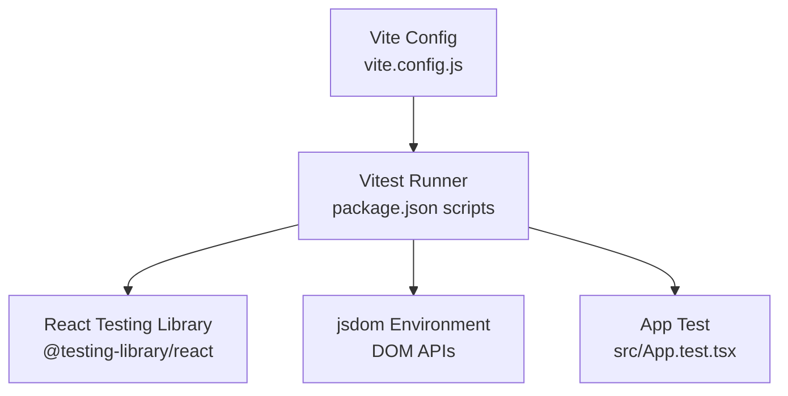
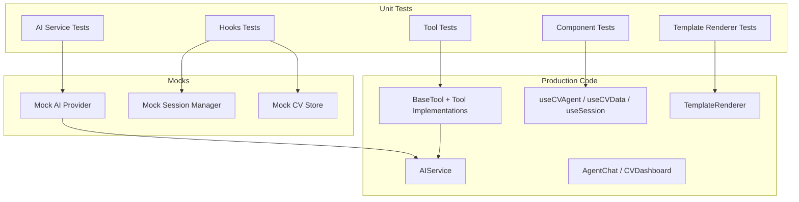
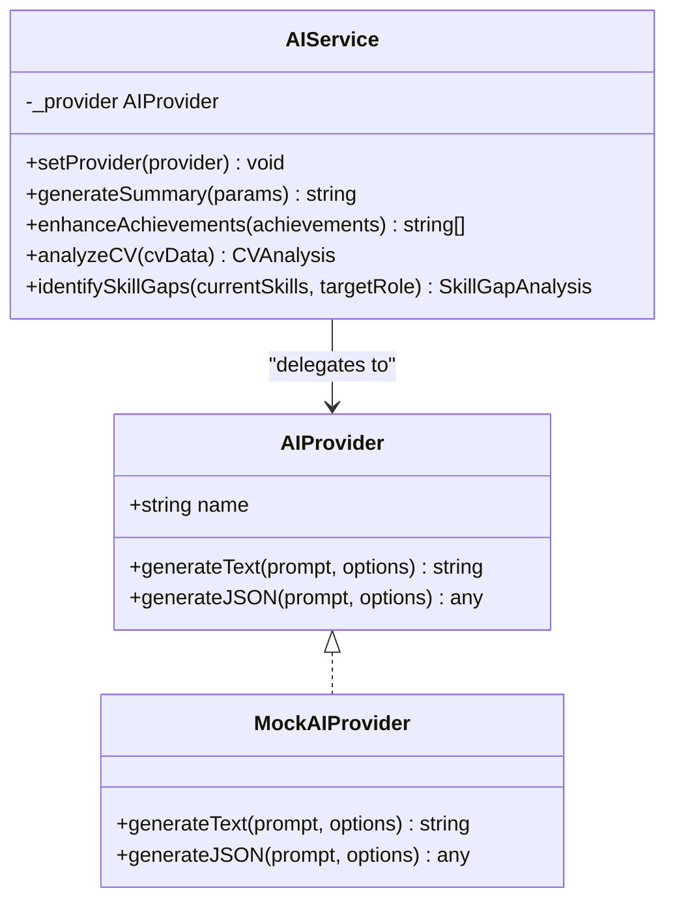
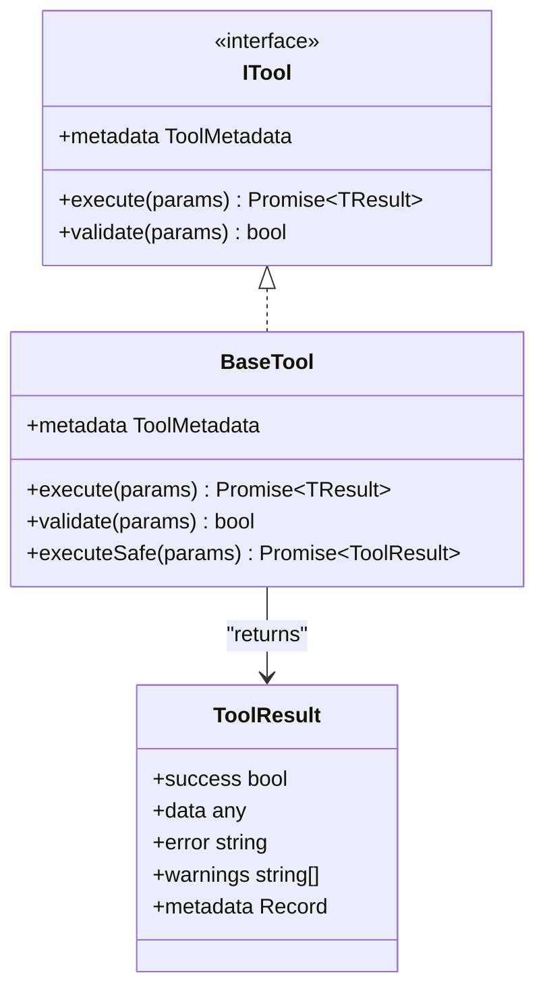
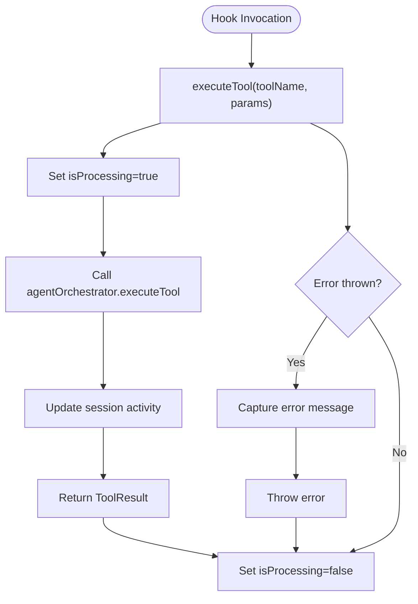
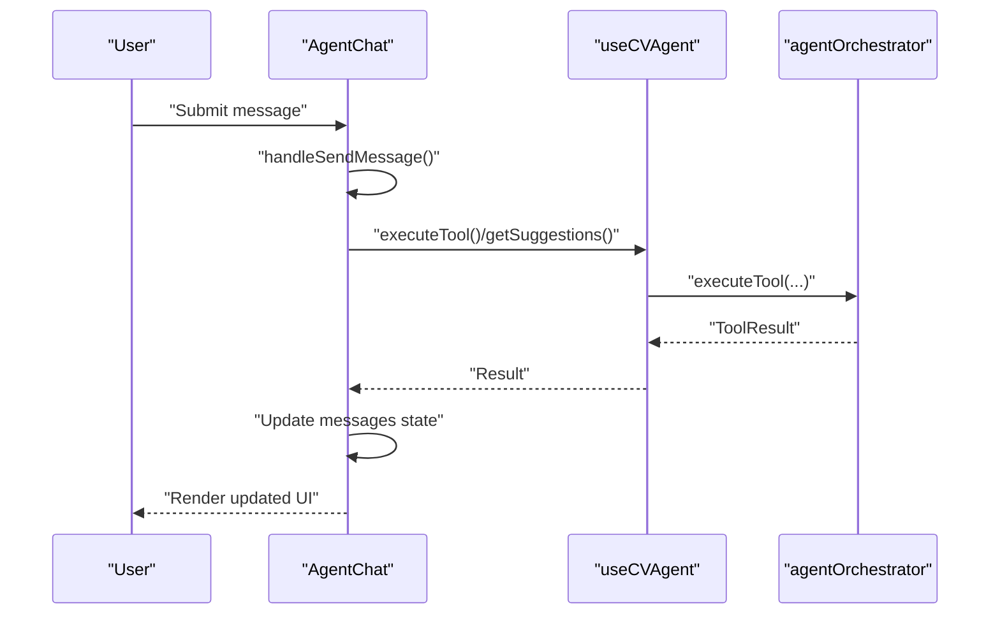
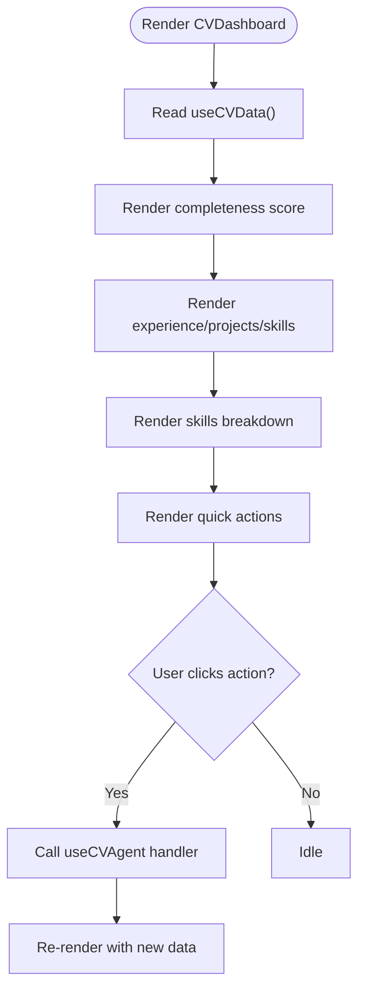
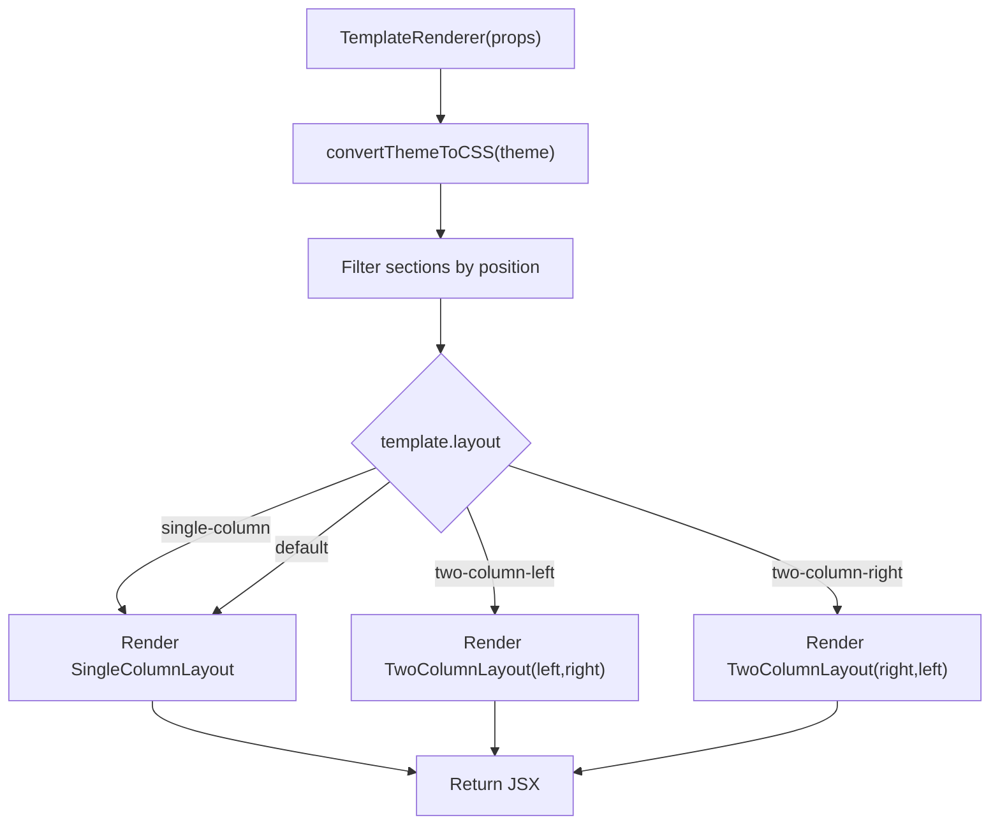
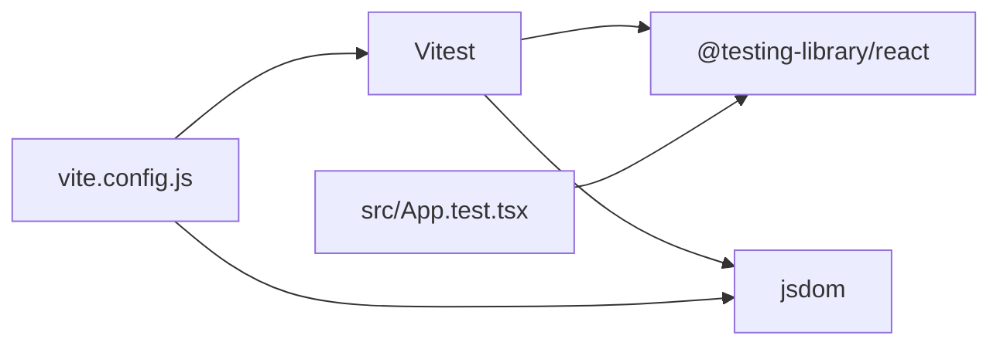

# Testing Strategy

<cite>
**Referenced Files in This Document**
- [package.json](file://package.json)
- [vite.config.js](file://vite.config.js)
- [src/App.test.tsx](file://src/App.test.tsx)
- [src/App.tsx](file://src/App.tsx)
- [src/components/agent/AgentChat.tsx](file://src/components/agent/AgentChat.tsx)
- [src/components/agent/CVDashboard.tsx](file://src/components/agent/CVDashboard.tsx)
- [src/hooks/use-cv-agent.ts](file://src/hooks/use-cv-agent.ts)
- [src/agent/services/ai-service.ts](file://src/agent/services/ai-service.ts)
- [src/agent/tools/base-tool.ts](file://src/agent/tools/base-tool.ts)
- [src/templates/core/TemplateRenderer.tsx](file://src/templates/core/TemplateRenderer.tsx)
</cite>

## Table of Contents
1. [Introduction](#introduction)
2. [Project Structure](#project-structure)
3. [Core Components](#core-components)
4. [Architecture Overview](#architecture-overview)
5. [Detailed Component Analysis](#detailed-component-analysis)
6. [Dependency Analysis](#dependency-analysis)
7. [Performance Considerations](#performance-considerations)
8. [Troubleshooting Guide](#troubleshooting-guide)
9. [Conclusion](#conclusion)
10. [Appendices](#appendices)

## Introduction
This document outlines the testing strategy for the CV Portfolio Builder, focusing on unit testing with Vitest and React Testing Library, component testing patterns, AI service mocking, template rendering tests, state management verification, integration testing for agent workflows, and best practices for asynchronous operations and React hooks. It also covers testing utilities, accessibility, snapshot testing, and performance testing approaches tailored to the project’s architecture.

## Project Structure
The project uses Vite with Vitest configured for unit testing. The testing stack includes jsdom for DOM simulation, React Testing Library for component testing, and Vitest for assertions and test runner capabilities. The configuration enables global test APIs and sets the jsdom environment for React components.

**Diagram sources**
- [vite.config.js:11-14](file://vite.config.js#L11-L14)
- [package.json:10](file://package.json#L10)

**Section sources**
- [vite.config.js:1-28](file://vite.config.js#L1-28)
- [package.json:1-60](file://package.json#L1-L60)

## Core Components
This section identifies the primary areas to test and the recommended patterns for each:

- AI service and providers: Test generation functions, JSON parsing, and provider switching with mocks.
- Tools and orchestrator: Validate tool execution, safe execution wrappers, and error handling.
- Agent hooks: Verify state updates, loading flags, error propagation, and session/context interactions.
- Agent chat and dashboard: Validate user interactions, suggestion rendering, quick actions, and async flows.
- Template renderer: Validate layout selection, section distribution, theme application, and memoization behavior.

**Section sources**
- [src/agent/services/ai-service.ts:1-174](file://src/agent/services/ai-service.ts#L1-L174)
- [src/agent/tools/base-tool.ts:1-72](file://src/agent/tools/base-tool.ts#L1-L72)
- [src/hooks/use-cv-agent.ts:1-182](file://src/hooks/use-cv-agent.ts#L1-L182)
- [src/components/agent/AgentChat.tsx:1-238](file://src/components/agent/AgentChat.tsx#L1-L238)
- [src/components/agent/CVDashboard.tsx:1-175](file://src/components/agent/CVDashboard.tsx#L1-L175)
- [src/templates/core/TemplateRenderer.tsx:1-74](file://src/templates/core/TemplateRenderer.tsx#L1-L74)

## Architecture Overview
The testing architecture centers around isolated unit tests for components, hooks, and services, with controlled mocking of AI providers and external dependencies. Integration tests validate agent workflows and tool execution sequences.

**Diagram sources**
- [src/agent/services/ai-service.ts:54-72](file://src/agent/services/ai-service.ts#L54-L72)
- [src/agent/tools/base-tool.ts:15-49](file://src/agent/tools/base-tool.ts#L15-L49)
- [src/hooks/use-cv-agent.ts:10-101](file://src/hooks/use-cv-agent.ts#L10-L101)
- [src/components/agent/AgentChat.tsx:15-125](file://src/components/agent/AgentChat.tsx#L15-L125)
- [src/components/agent/CVDashboard.tsx:7-23](file://src/components/agent/CVDashboard.tsx#L7-L23)
- [src/templates/core/TemplateRenderer.tsx:13-53](file://src/templates/core/TemplateRenderer.tsx#L13-L53)

## Detailed Component Analysis

### AI Service and Providers
Testing approach:
- Validate provider switching and fallback behavior.
- Mock provider delays to simulate network latency and verify loading states.
- Verify JSON parsing robustness and default values when provider returns unexpected shapes.
- Confirm prompt building correctness and parameter shaping.

Recommended patterns:
- Use a mock provider with deterministic responses and fixed delays.
- Snapshot test prompt construction outputs for regression detection.
- Test error propagation from provider to service consumers.

**Diagram sources**
- [src/agent/services/ai-service.ts:5-72](file://src/agent/services/ai-service.ts#L5-L72)
- [src/agent/services/ai-service.ts:77-126](file://src/agent/services/ai-service.ts#L77-L126)

**Section sources**
- [src/agent/services/ai-service.ts:1-174](file://src/agent/services/ai-service.ts#L1-L174)

### Tools and Safe Execution
Testing approach:
- Validate default and overridden validation logic.
- Test successful execution and error-wrapped results via the safe wrapper.
- Verify tool metadata exposure and categorization.

Recommended patterns:
- Use minimal stub implementations for tool execution to isolate logic.
- Snapshot test tool metadata for consistency.
- Assert ToolResult shape and error propagation.

**Diagram sources**
- [src/agent/tools/base-tool.ts:6-49](file://src/agent/tools/base-tool.ts#L6-L49)
- [src/agent/tools/base-tool.ts:54-71](file://src/agent/tools/base-tool.ts#L54-L71)

**Section sources**
- [src/agent/tools/base-tool.ts:1-72](file://src/agent/tools/base-tool.ts#L1-L72)

### Hooks: useCVAgent, useCVData, useSession
Testing approach:
- Verify state transitions for processing/loading flags and errors.
- Test callback invocations and returned values for async operations.
- Validate session statistics updates and context updates.
- Ensure store subscriptions return expected data slices.

Recommended patterns:
- Wrap components using hooks with render utilities and assert state changes.
- Mock orchestrator and managers to control side effects.
- Use act-like patterns to flush microtasks and re-renders.

**Diagram sources**
- [src/hooks/use-cv-agent.ts:17-46](file://src/hooks/use-cv-agent.ts#L17-L46)

**Section sources**
- [src/hooks/use-cv-agent.ts:1-182](file://src/hooks/use-cv-agent.ts#L1-L182)

### Agent Chat Component
Testing approach:
- Validate message composition and rendering for user, agent, and system messages.
- Test quick actions and suggestion rendering with click handlers.
- Verify form submission, input handling, and disabled states during processing.
- Snapshot test message bubbles and suggestion chips.

Recommended patterns:
- Mock useCVAgent callbacks to simulate tool execution outcomes.
- Assert DOM queries for message content and suggestion elements.
- Test intent recognition logic by simulating user messages.

**Diagram sources**
- [src/components/agent/AgentChat.tsx:31-121](file://src/components/agent/AgentChat.tsx#L31-L121)
- [src/hooks/use-cv-agent.ts:17-61](file://src/hooks/use-cv-agent.ts#L17-L61)

**Section sources**
- [src/components/agent/AgentChat.tsx:1-238](file://src/components/agent/AgentChat.tsx#L1-L238)

### CV Dashboard Component
Testing approach:
- Validate completeness score rendering and color thresholds.
- Test quick action buttons and their async flows.
- Verify skills breakdown charts and context info rendering.
- Snapshot test numeric counts and categorical distributions.

Recommended patterns:
- Mock useCVAgent to return predefined analysis results.
- Assert SVG arc rendering and percentage calculations.
- Verify button enable/disable states based on processing flags.

**Diagram sources**
- [src/components/agent/CVDashboard.tsx:7-172](file://src/components/agent/CVDashboard.tsx#L7-L172)
- [src/hooks/use-cv-agent.ts:66-76](file://src/hooks/use-cv-agent.ts#L66-L76)

**Section sources**
- [src/components/agent/CVDashboard.tsx:1-175](file://src/components/agent/CVDashboard.tsx#L1-L175)

### Template Renderer
Testing approach:
- Validate layout selection logic for single-column and two-column variants.
- Test section filtering by position and rendering delegation.
- Verify theme conversion to CSS variables and prop forwarding.
- Snapshot test rendered output for different templates and themes.

Recommended patterns:
- Provide minimal template and CV fixtures.
- Mock layout components to assert props and invocation order.
- Test memoization by ensuring stable references across renders.

**Diagram sources**
- [src/templates/core/TemplateRenderer.tsx:13-53](file://src/templates/core/TemplateRenderer.tsx#L13-L53)
- [src/templates/core/TemplateRenderer.tsx:58-73](file://src/templates/core/TemplateRenderer.tsx#L58-L73)

**Section sources**
- [src/templates/core/TemplateRenderer.tsx:1-74](file://src/templates/core/TemplateRenderer.tsx#L1-L74)

## Dependency Analysis
Key testing dependencies and their roles:
- Vitest: Test runner and assertion library.
- React Testing Library: Component testing utilities and queries.
- jsdom: DOM environment for React components.
- Aliases: @ and @components for cleaner imports in tests.

**Diagram sources**
- [vite.config.js:11-14](file://vite.config.js#L11-L14)
- [src/App.test.tsx:1-11](file://src/App.test.tsx#L1-L11)

**Section sources**
- [package.json:45-58](file://package.json#L45-L58)
- [vite.config.js:1-28](file://vite.config.js#L1-L28)
- [src/App.test.tsx:1-11](file://src/App.test.tsx#L1-L11)

## Performance Considerations
- Prefer lightweight fixtures and deterministic mocks to reduce flakiness.
- Use React Testing Library’s waitFor utilities judiciously; avoid long timeouts.
- Snapshot tests can act as performance regressions by detecting excessive DOM churn.
- For async hooks, flush microtasks after interactions to stabilize assertions.

## Troubleshooting Guide
Common issues and resolutions:
- Missing DOM APIs: Ensure jsdom environment is enabled in Vitest config.
- Stale state in hooks: Mock orchestrator and managers; reset state between tests.
- Flaky async tests: Use deterministic delays or fake timers; avoid real timers.
- Memory leaks in long sessions: Clear intervals and subscriptions in teardown.

**Section sources**
- [vite.config.js:11-14](file://vite.config.js#L11-L14)
- [src/hooks/use-cv-agent.ts:154-181](file://src/hooks/use-cv-agent.ts#L154-L181)

## Conclusion
The CV Portfolio Builder’s testing strategy leverages Vitest and React Testing Library to validate AI-driven agent workflows, component interactions, and template rendering. By mocking AI providers and external dependencies, isolating hooks and tools, and applying snapshot and accessibility checks, the suite ensures reliability and maintainability across features like CV analysis, suggestions, and dynamic template previews.

## Appendices

### Example Test Scenarios and Patterns
- Unit tests for AI service:
  - Provider switching and fallback behavior.
  - Prompt building and JSON parsing robustness.
  - Snapshot tests for prompt outputs.
- Component tests for AgentChat:
  - Message rendering and suggestion chips.
  - Form submission and disabled states.
  - Intent recognition and tool execution outcomes.
- Component tests for CVDashboard:
  - Completeness score rendering and thresholds.
  - Quick action button interactions.
  - Skills breakdown chart rendering.
- Template renderer tests:
  - Layout selection and section distribution.
  - Theme variable conversion and prop forwarding.
  - Memoization stability across renders.
- Accessibility tests:
  - Use screen queries to assert labels and roles.
  - Verify keyboard navigation and focus states.
- Snapshot tests:
  - Capture component outputs for regression detection.
  - Update snapshots after intentional UI changes.
- Performance tests:
  - Measure render times with synthetic loads.
  - Track re-renders with React Profiler in test builds.

[No sources needed since this section provides general guidance]