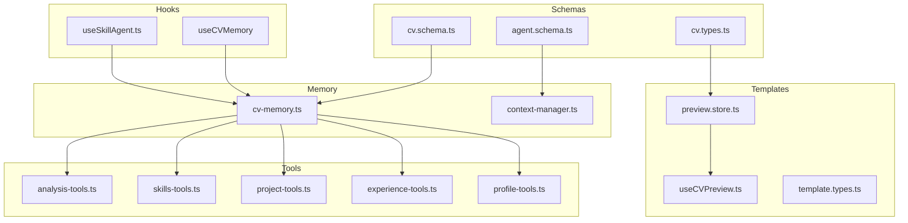
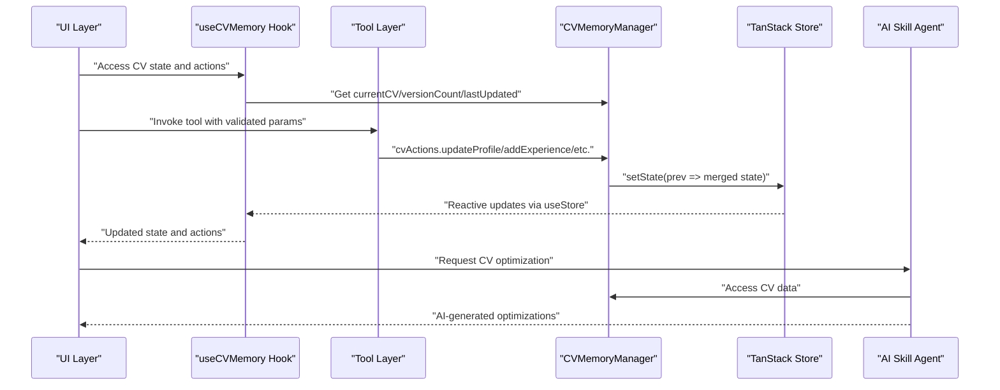
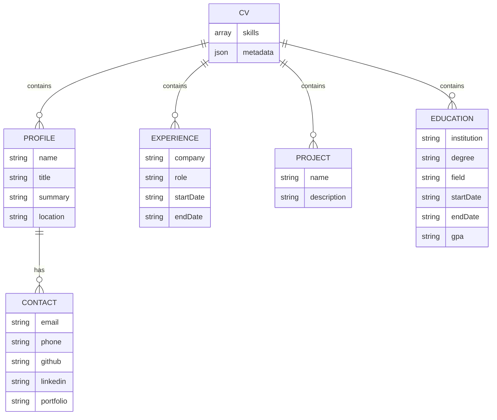
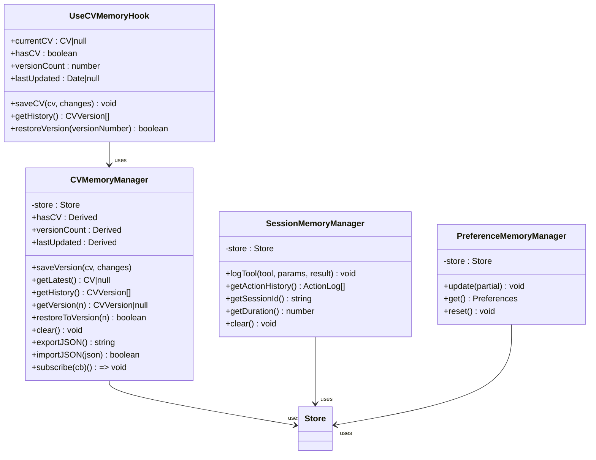
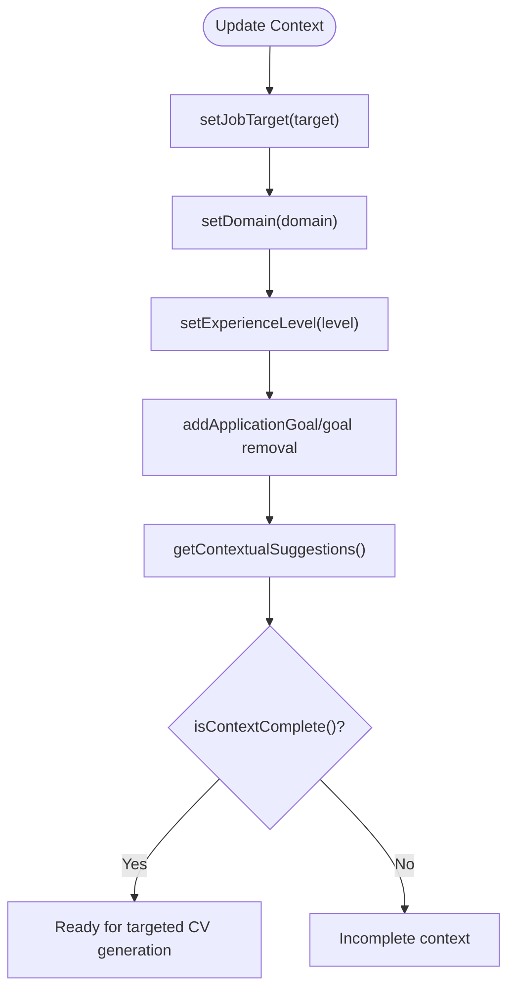
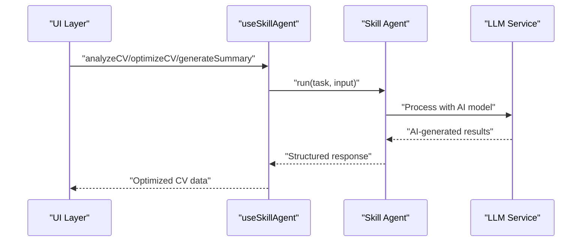
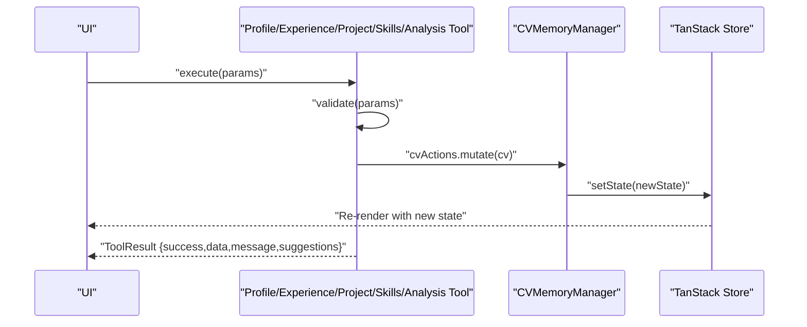
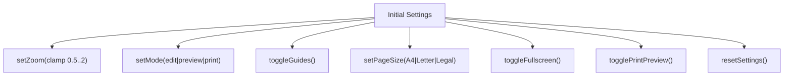
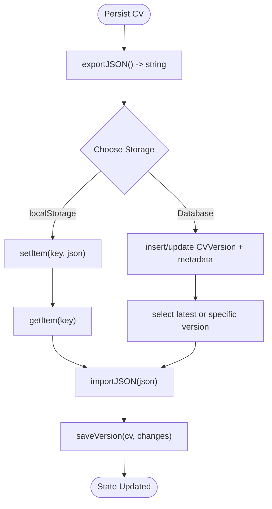
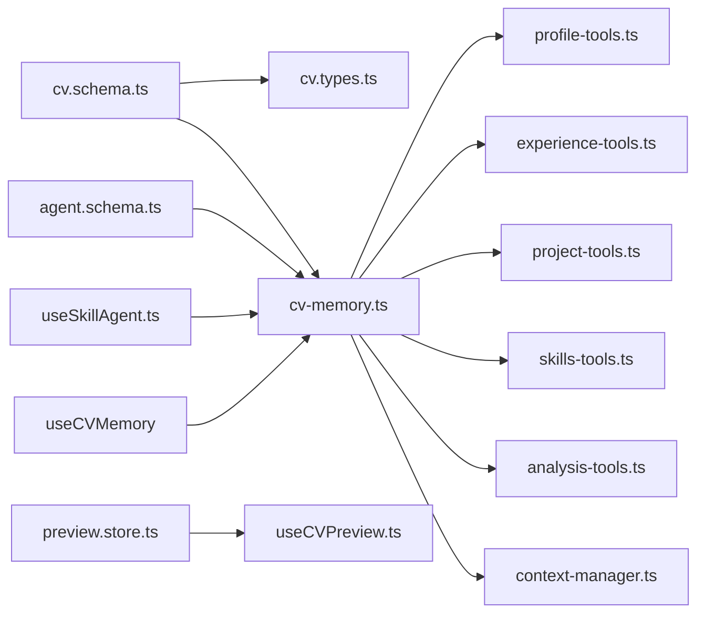

# CV Data Management

<cite>
**Referenced Files in This Document**
- [cv.schema.ts](file://src/agent/schemas/cv.schema.ts)
- [cv.types.ts](file://src/templates/types/cv.types.ts)
- [agent.schema.ts](file://src/agent/schemas/agent.schema.ts)
- [cv-memory.ts](file://src/agent/memory/cv-memory.ts)
- [context-manager.ts](file://src/agent/memory/context-manager.ts)
- [useSkillAgent.ts](file://src/agent/hooks/useSkillAgent.ts)
- [preview.store.ts](file://src/templates/store/preview.store.ts)
- [useCVPreview.ts](file://src/templates/hooks/useCVPreview.ts)
- [profile-tools.ts](file://src/agent/tools/profile-tools.ts)
- [experience-tools.ts](file://src/agent/tools/experience-tools.ts)
- [project-tools.ts](file://src/agent/tools/project-tools.ts)
- [skills-tools.ts](file://src/agent/tools/skills-tools.ts)
- [analysis-tools.ts](file://src/agent/tools/analysis-tools.ts)
- [prompts.ts](file://src/agent/services/prompts.ts)
</cite>

## Update Summary
**Changes Made**
- Added comprehensive documentation for the useCVMemory hook integration with CV Builder application
- Enhanced state management documentation with TanStack Store and reactive updates
- Expanded AI Skill Agent integration coverage for CV optimization workflows
- Updated version control capabilities documentation with CVMemoryManager
- Added JSON import/export functionality documentation
- Enhanced context management system documentation for job targets and professional context

## Table of Contents
1. [Introduction](#introduction)
2. [Project Structure](#project-structure)
3. [Core Components](#core-components)
4. [Architecture Overview](#architecture-overview)
5. [Detailed Component Analysis](#detailed-component-analysis)
6. [Dependency Analysis](#dependency-analysis)
7. [Performance Considerations](#performance-considerations)
8. [Troubleshooting Guide](#troubleshooting-guide)
9. [Conclusion](#conclusion)
10. [Appendices](#appendices)

## Introduction
This document provides comprehensive data model documentation for CV data management in the CV Portfolio Builder. It covers the CV schema design for Profile, Experience, Projects, Skills, and Education entities, validation rules using Zod schemas and TypeScript interfaces, state management via TanStack Store and derived values, persistence strategies (localStorage and JSON import/export), context management for job targeting and professional context, and data transformation patterns. It also documents validation workflows, error handling, examples of data manipulation, schema evolution, and migration strategies.

**Updated** Enhanced with integration through useCVMemory hook for seamless CV Builder application connectivity and comprehensive AI Skill Agent system integration for CV optimization workflows.

## Project Structure
The CV data management system spans several modules:
- Schema definitions for CV and agent context
- Memory managers for CV versions, sessions, and preferences
- Tools for manipulating CV data and generating insights
- Preview store and hooks for rendering and editing
- Template types and CV-related type extensions
- AI Skill Agent integration for optimization workflows

**Diagram sources**
- [cv.schema.ts:1-79](file://src/agent/schemas/cv.schema.ts#L1-L79)
- [agent.schema.ts:1-62](file://src/agent/schemas/agent.schema.ts#L1-L62)
- [cv.types.ts:1-16](file://src/templates/types/cv.types.ts#L1-L16)
- [cv-memory.ts:1-290](file://src/agent/memory/cv-memory.ts#L1-L290)
- [context-manager.ts:1-141](file://src/agent/memory/context-manager.ts#L1-L141)
- [useSkillAgent.ts:189-215](file://src/agent/hooks/useSkillAgent.ts#L189-L215)
- [profile-tools.ts:1-142](file://src/agent/tools/profile-tools.ts#L1-L142)
- [experience-tools.ts:1-194](file://src/agent/tools/experience-tools.ts#L1-L194)
- [project-tools.ts:1-168](file://src/agent/tools/project-tools.ts#L1-L168)
- [skills-tools.ts:1-210](file://src/agent/tools/skills-tools.ts#L1-L210)
- [analysis-tools.ts:1-291](file://src/agent/tools/analysis-tools.ts#L1-L291)
- [preview.store.ts:1-100](file://src/templates/store/preview.store.ts#L1-L100)
- [useCVPreview.ts:1-60](file://src/templates/hooks/useCVPreview.ts#L1-L60)

**Section sources**
- [cv.schema.ts:1-79](file://src/agent/schemas/cv.schema.ts#L1-L79)
- [agent.schema.ts:1-62](file://src/agent/schemas/agent.schema.ts#L1-L62)
- [cv.types.ts:1-16](file://src/templates/types/cv.types.ts#L1-L16)
- [cv-memory.ts:1-290](file://src/agent/memory/cv-memory.ts#L1-L290)
- [context-manager.ts:1-141](file://src/agent/memory/context-manager.ts#L1-L141)
- [useSkillAgent.ts:189-215](file://src/agent/hooks/useSkillAgent.ts#L189-L215)
- [preview.store.ts:1-100](file://src/templates/store/preview.store.ts#L1-L100)
- [useCVPreview.ts:1-60](file://src/templates/hooks/useCVPreview.ts#L1-L60)

## Core Components
- CV Schema and Types: Defines the canonical CV shape, including nested Contact, Profile, Experience, Project, Education, and metadata. Uses Zod for runtime validation and exports TypeScript types for compile-time safety.
- Memory Managers: Provide reactive state for CV versions/history, session logs, and user preferences using TanStack Store and Derived.
- Context Manager: Centralizes job target, domain, experience level, and application goals; exposes import/export and contextual suggestions.
- Tools: Feature-specific tools for updating profile, enhancing experiences, generating project highlights, linking skills, and analyzing CV completeness and keyword alignment.
- Preview Store: Manages rendering settings and modes for CV preview/edit/print workflows.
- AI Skill Agent Integration: Seamless integration with AI-powered CV optimization workflows through useSkillAgent hook.

**Updated** Enhanced with useCVMemory hook for state management integration and comprehensive AI Skill Agent system for CV optimization.

**Section sources**
- [cv.schema.ts:1-79](file://src/agent/schemas/cv.schema.ts#L1-L79)
- [cv.types.ts:1-16](file://src/templates/types/cv.types.ts#L1-L16)
- [cv-memory.ts:20-149](file://src/agent/memory/cv-memory.ts#L20-L149)
- [context-manager.ts:7-137](file://src/agent/memory/context-manager.ts#L7-L137)
- [preview.store.ts:24-95](file://src/templates/store/preview.store.ts#L24-L95)
- [useSkillAgent.ts:189-215](file://src/agent/hooks/useSkillAgent.ts#L189-L215)

## Architecture Overview
The CV data lifecycle integrates schema validation, reactive state, tool-driven mutations, and context-aware transformations with AI-powered optimization workflows.

**Diagram sources**
- [cv-memory.ts:20-149](file://src/agent/memory/cv-memory.ts#L20-L149)
- [useSkillAgent.ts:189-215](file://src/agent/hooks/useSkillAgent.ts#L189-L215)
- [profile-tools.ts:29-44](file://src/agent/tools/profile-tools.ts#L29-L44)
- [experience-tools.ts:38-67](file://src/agent/tools/experience-tools.ts#L38-L67)
- [project-tools.ts:36-63](file://src/agent/tools/project-tools.ts#L36-L63)
- [skills-tools.ts:33-62](file://src/agent/tools/skills-tools.ts#L33-L62)
- [analysis-tools.ts:21-72](file://src/agent/tools/analysis-tools.ts#L21-L72)

## Detailed Component Analysis

### CV Schema and Validation
- Contact: Validates email format and optional social/professional URLs.
- Profile: Requires name, title, minimum-length summary, location, and nested contact.
- Experience: Requires company, role, start date, at least one achievement, optional end date, and optional tech stack.
- Project: Requires name, minimum-length description, at least one highlight, optional tech stack.
- Education: Requires institution, degree, start/end dates, optional field and GPA.
- CV: Aggregates Profile, Skills array, Experience, Projects, Education arrays, and optional metadata (version, timestamps).

Validation characteristics:
- Zod enforces required fields, array constraints, and defaults.
- TypeScript types mirror Zod schemas for compile-time checks.
- Metadata supports versioning and timestamps for change tracking.

**Diagram sources**
- [cv.schema.ts:4-61](file://src/agent/schemas/cv.schema.ts#L4-L61)

**Section sources**
- [cv.schema.ts:4-61](file://src/agent/schemas/cv.schema.ts#L4-L61)
- [cv.types.ts:11-16](file://src/templates/types/cv.types.ts#L11-L16)

### State Management with TanStack Store and Derived
- CVMemoryManager encapsulates current CV, version history, and last saved timestamp. Exposes Derived booleans for hasCV, versionCount, and lastUpdated.
- Methods include saving versions, retrieving latest/current, restoring specific versions, clearing state, and JSON import/export.
- SessionMemoryManager tracks sessionId, action logs, and session duration.
- PreferenceMemoryManager stores tone, emphasis, and formatting preferences with update/reset capabilities.

**Updated** Enhanced with useCVMemory hook that provides reactive access to CV state through TanStack Store integration.

**Diagram sources**
- [cv-memory.ts:20-149](file://src/agent/memory/cv-memory.ts#L20-L149)
- [cv-memory.ts:165-227](file://src/agent/memory/cv-memory.ts#L165-L227)
- [cv-memory.ts:251-284](file://src/agent/memory/cv-memory.ts#L251-L284)
- [useSkillAgent.ts:189-215](file://src/agent/hooks/useSkillAgent.ts#L189-L215)

**Section sources**
- [cv-memory.ts:20-149](file://src/agent/memory/cv-memory.ts#L20-L149)
- [cv-memory.ts:165-227](file://src/agent/memory/cv-memory.ts#L165-L227)
- [cv-memory.ts:251-284](file://src/agent/memory/cv-memory.ts#L251-L284)
- [useSkillAgent.ts:189-215](file://src/agent/hooks/useSkillAgent.ts#L189-L215)

### Context Management for Job Targets and Professional Context
- ContextManager centralizes jobTarget, domain, experienceLevel, and applicationGoals.
- Provides setters for each context property, import/export, contextual suggestions, completeness checks, and singleton access.
- Suggestions leverage experience level, job target, and domain to guide CV improvements.

**Diagram sources**
- [context-manager.ts:27-107](file://src/agent/memory/context-manager.ts#L27-L107)

**Section sources**
- [context-manager.ts:7-137](file://src/agent/memory/context-manager.ts#L7-L137)
- [agent.schema.ts:4-12](file://src/agent/schemas/agent.schema.ts#L4-L12)

### AI Skill Agent Integration for CV Optimization
- useSkillAgent hook provides comprehensive AI-powered CV optimization capabilities.
- Supports CV analysis, ATS optimization, summary generation, experience improvement, and skill extraction.
- Integrates with LLM services for advanced AI-powered features.
- Includes loading states, error handling, and utility functions for managing AI interactions.

**Updated** New comprehensive AI Skill Agent integration for CV optimization workflows.

**Diagram sources**
- [useSkillAgent.ts:38-184](file://src/agent/hooks/useSkillAgent.ts#L38-L184)

**Section sources**
- [useSkillAgent.ts:38-184](file://src/agent/hooks/useSkillAgent.ts#L38-L184)

### Tools: Data Manipulation and Validation Workflows
- Profile Tools: Update profile fields, generate AI-like summaries, and optimize contact info with suggestions.
- Experience Tools: Add experience entries, enhance achievements with impact language, and suggest tech stacks.
- Project Tools: Add projects, generate highlights, and link project technologies to skills.
- Skills Tools: Add skills, categorize skills, and identify gaps against target roles.
- Analysis Tools: Comprehensive CV analysis, keyword optimization for ATS, and consistency checks.

Validation patterns:
- Zod-based schemas define required fields and constraints.
- Tool-level validate methods enforce preconditions (e.g., non-empty arrays).
- Execution wraps mutations in cvActions and returns structured ToolResult with success, data, message, and suggestions.

**Diagram sources**
- [profile-tools.ts:29-44](file://src/agent/tools/profile-tools.ts#L29-L44)
- [experience-tools.ts:38-67](file://src/agent/tools/experience-tools.ts#L38-L67)
- [project-tools.ts:36-63](file://src/agent/tools/project-tools.ts#L36-L63)
- [skills-tools.ts:33-62](file://src/agent/tools/skills-tools.ts#L33-L62)
- [analysis-tools.ts:21-72](file://src/agent/tools/analysis-tools.ts#L21-L72)

**Section sources**
- [profile-tools.ts:14-141](file://src/agent/tools/profile-tools.ts#L14-L141)
- [experience-tools.ts:14-193](file://src/agent/tools/experience-tools.ts#L14-L193)
- [project-tools.ts:14-167](file://src/agent/tools/project-tools.ts#L14-L167)
- [skills-tools.ts:13-209](file://src/agent/tools/skills-tools.ts#L13-L209)
- [analysis-tools.ts:13-290](file://src/agent/tools/analysis-tools.ts#L13-L290)

### Preview Store and Rendering State
- Preview store manages zoom, page size, guides visibility, mode (edit/preview/print), fullscreen, and print preview toggles.
- Actions clamp zoom, update settings, and reset to initial settings.
- Hook useCVPreview exposes getters and setters for preview settings.

**Diagram sources**
- [preview.store.ts:24-95](file://src/templates/store/preview.store.ts#L24-L95)
- [useCVPreview.ts:9-59](file://src/templates/hooks/useCVPreview.ts#L9-L59)

**Section sources**
- [preview.store.ts:1-100](file://src/templates/store/preview.store.ts#L1-L100)
- [useCVPreview.ts:1-60](file://src/templates/hooks/useCVPreview.ts#L1-L60)

### Data Persistence Strategies
- JSON Import/Export: CVMemoryManager supports exporting the latest CV to JSON and importing from JSON with basic parsing error handling.
- LocalStorage: While not explicitly implemented in the referenced files, the JSON export/import pattern enables straightforward integration with localStorage by persisting the exported string and restoring on load.
- Database Integration: The CVVersion structure and metadata support versioning and timestamping, enabling future database-backed persistence with migrations and rollbacks.

**Updated** Enhanced with comprehensive version control capabilities through CVMemoryManager for seamless persistence.

**Diagram sources**
- [cv-memory.ts:122-139](file://src/agent/memory/cv-memory.ts#L122-L139)

**Section sources**
- [cv-memory.ts:122-139](file://src/agent/memory/cv-memory.ts#L122-L139)

### Data Transformation Patterns and Error Handling
- Validation Workflow: Zod schemas validate incoming data; tools implement additional precondition checks; actions mutate state; derived values reactively update UI.
- Error Handling: Tools return ToolResult with success flag and messages; importJSON catches parse errors and returns false; context import logs errors and returns false.
- Transformation Examples:
  - Enhancing achievements by adding metrics and action verbs.
  - Linking project tech to skills and identifying gaps.
  - Generating highlights from project details.
  - Keyword extraction for ATS optimization.

**Section sources**
- [experience-tools.ts:94-137](file://src/agent/tools/experience-tools.ts#L94-L137)
- [project-tools.ts:124-159](file://src/agent/tools/project-tools.ts#L124-L159)
- [analysis-tools.ts:161-217](file://src/agent/tools/analysis-tools.ts#L161-L217)
- [cv-memory.ts:131-139](file://src/agent/memory/cv-memory.ts#L131-L139)
- [context-manager.ts:127-136](file://src/agent/memory/context-manager.ts#L127-L136)

### Schema Evolution and Migration Strategies
- Versioning: CV metadata includes version and timestamps; CVMemoryManager assigns semantic versioning for saved versions.
- Migration Strategy:
  - Detect version changes during import.
  - Apply transformation functions per major/minor version increments.
  - Preserve backward compatibility by setting defaults for new fields.
  - Maintain a changelog in CVVersion.changes for auditability.

**Section sources**
- [cv.schema.ts:56-61](file://src/agent/schemas/cv.schema.ts#L56-L61)
- [cv.schema.ts:73-79](file://src/agent/schemas/cv.schema.ts#L73-L79)
- [cv-memory.ts:56-73](file://src/agent/memory/cv-memory.ts#L56-L73)

## Dependency Analysis
- CV schema types are re-exported for template usage.
- Tools depend on cv-actions and cv-store to mutate and read state.
- Context manager depends on cv-store for context and cv-actions for updates.
- Preview store is independent but consumed by UI hooks.
- useCVMemory hook integrates CVMemoryManager with React components.

**Updated** Enhanced dependency graph with useCVMemory hook integration and AI Skill Agent dependencies.

**Diagram sources**
- [cv.schema.ts:1-79](file://src/agent/schemas/cv.schema.ts#L1-L79)
- [cv.types.ts:1-16](file://src/templates/types/cv.types.ts#L1-L16)
- [cv-memory.ts:1-290](file://src/agent/memory/cv-memory.ts#L1-L290)
- [agent.schema.ts:1-62](file://src/agent/schemas/agent.schema.ts#L1-L62)
- [profile-tools.ts:1-142](file://src/agent/tools/profile-tools.ts#L1-L142)
- [experience-tools.ts:1-194](file://src/agent/tools/experience-tools.ts#L1-L194)
- [project-tools.ts:1-168](file://src/agent/tools/project-tools.ts#L1-L168)
- [skills-tools.ts:1-210](file://src/agent/tools/skills-tools.ts#L1-L210)
- [analysis-tools.ts:1-291](file://src/agent/tools/analysis-tools.ts#L1-L291)
- [context-manager.ts:1-141](file://src/agent/memory/context-manager.ts#L1-L141)
- [preview.store.ts:1-100](file://src/templates/store/preview.store.ts#L1-L100)
- [useCVPreview.ts:1-60](file://src/templates/hooks/useCVPreview.ts#L1-L60)
- [useSkillAgent.ts:189-215](file://src/agent/hooks/useSkillAgent.ts#L189-L215)

**Section sources**
- [cv.schema.ts:1-79](file://src/agent/schemas/cv.schema.ts#L1-L79)
- [cv.types.ts:1-16](file://src/templates/types/cv.types.ts#L1-L16)
- [cv-memory.ts:1-290](file://src/agent/memory/cv-memory.ts#L1-L290)
- [agent.schema.ts:1-62](file://src/agent/schemas/agent.schema.ts#L1-L62)
- [profile-tools.ts:1-142](file://src/agent/tools/profile-tools.ts#L1-L142)
- [experience-tools.ts:1-194](file://src/agent/tools/experience-tools.ts#L1-L194)
- [project-tools.ts:1-168](file://src/agent/tools/project-tools.ts#L1-L168)
- [skills-tools.ts:1-210](file://src/agent/tools/skills-tools.ts#L1-L210)
- [analysis-tools.ts:1-291](file://src/agent/tools/analysis-tools.ts#L1-L291)
- [context-manager.ts:1-141](file://src/agent/memory/context-manager.ts#L1-L141)
- [preview.store.ts:1-100](file://src/templates/store/preview.store.ts#L1-L100)
- [useCVPreview.ts:1-60](file://src/templates/hooks/useCVPreview.ts#L1-L60)
- [useSkillAgent.ts:189-215](file://src/agent/hooks/useSkillAgent.ts#L189-L215)

## Performance Considerations
- Derived recomputation: Minimize expensive computations inside Derived; cache intermediate results when possible.
- Batch updates: Group related cvActions to reduce re-renders.
- Tool validation: Perform lightweight client-side checks before invoking heavy operations.
- Preview store: Keep derived values minimal; avoid unnecessary deep equality checks.
- AI Agent caching: Implement caching strategies for repeated AI operations to improve performance.

**Updated** Added performance considerations for AI Skill Agent integration and caching strategies.

## Troubleshooting Guide
- Validation Failures: Ensure required fields meet Zod constraints; review ToolResult messages for guidance.
- Import Errors: Verify JSON validity; importJSON returns false on parse failure.
- Context Issues: Confirm jobTarget, domain, and experienceLevel are set; use isContextComplete to validate readiness.
- State Drift: Use getLatest/getHistory to inspect current state and version timeline.
- AI Agent Errors: Check useSkillAgent hook for proper initialization and error handling.
- Hook Integration: Ensure useCVMemory hook is properly integrated with React components.

**Updated** Enhanced troubleshooting guide with AI Agent and hook integration issues.

**Section sources**
- [cv-memory.ts:131-139](file://src/agent/memory/cv-memory.ts#L131-L139)
- [context-manager.ts:112-115](file://src/agent/memory/context-manager.ts#L112-L115)
- [analysis-tools.ts:21-72](file://src/agent/tools/analysis-tools.ts#L21-L72)
- [useSkillAgent.ts:189-215](file://src/agent/hooks/useSkillAgent.ts#L189-L215)

## Conclusion
The CV Portfolio Builder employs a robust, schema-driven architecture with reactive state management, comprehensive validation, and modular tools for data manipulation. The design supports versioning, context-aware transformations, and extensible persistence strategies, enabling efficient CV authoring and optimization workflows. The integration with AI Skill Agent system provides advanced optimization capabilities, while the useCVMemory hook ensures seamless connectivity with the CV Builder application.

**Updated** Enhanced conclusion reflecting the comprehensive AI integration and improved state management capabilities.

## Appendices
- Prompt Templates: Reusable prompt builders for summary generation, achievement enhancement, skill gap analysis, CV analysis, and project highlights.

**Section sources**
- [prompts.ts:14-280](file://src/agent/services/prompts.ts#L14-L280)