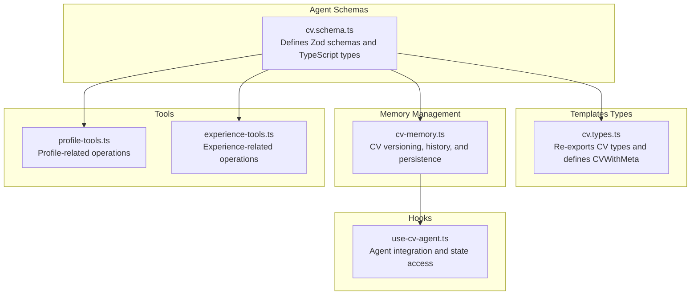
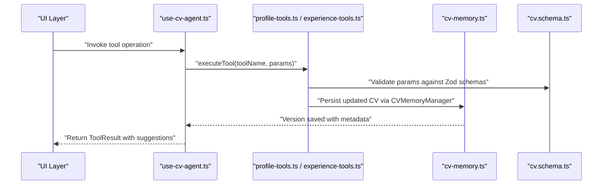
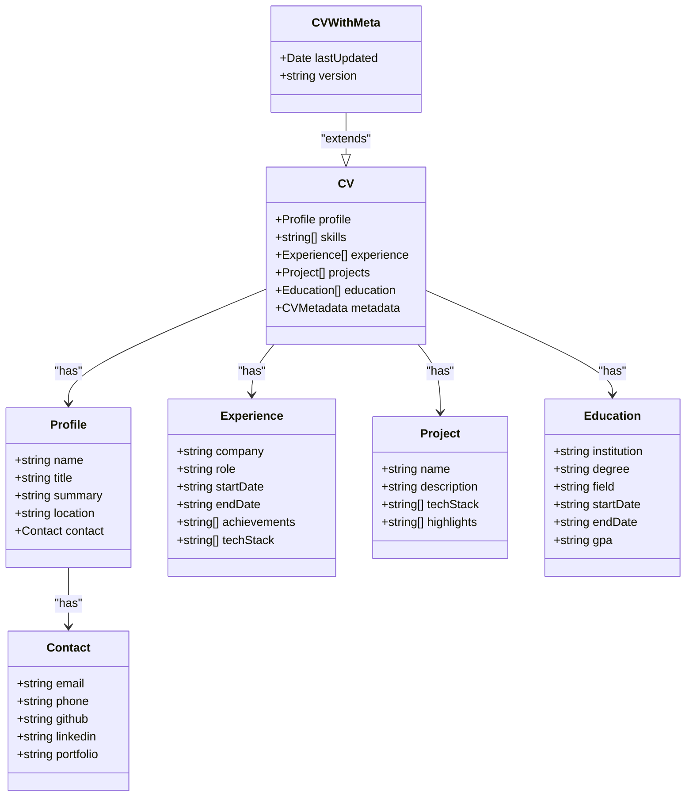
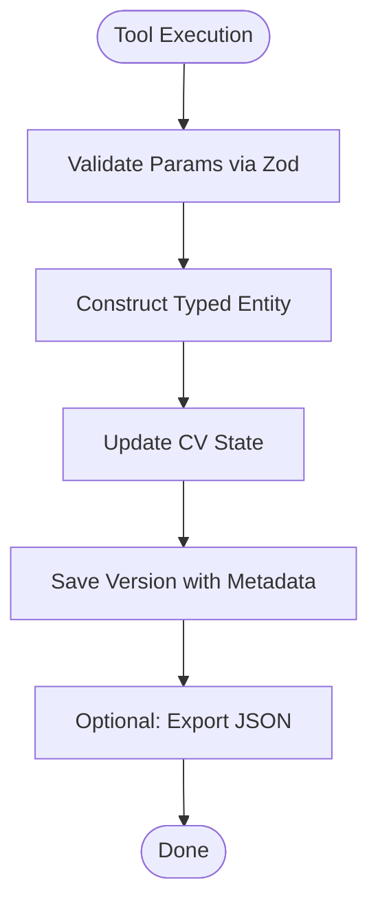
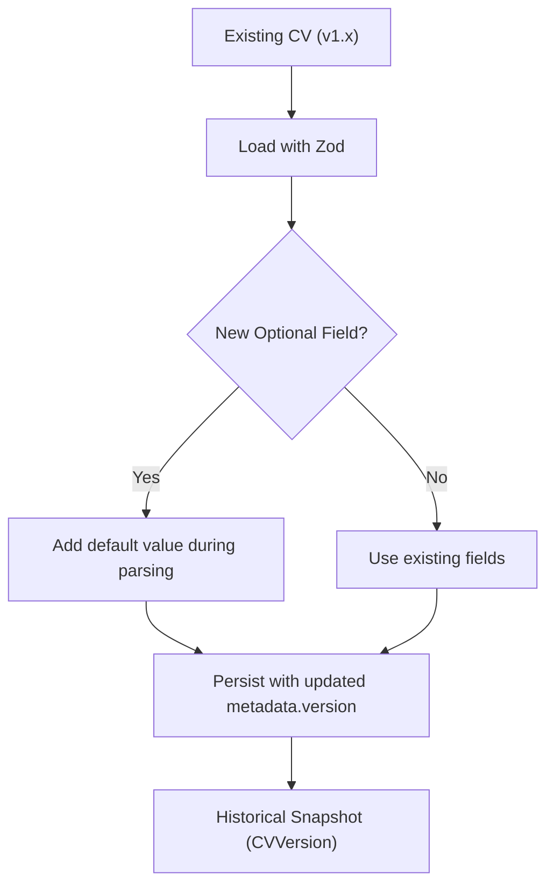
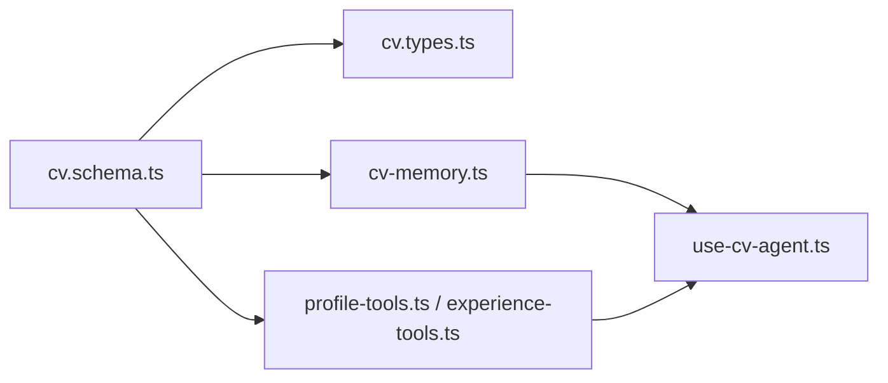

# CV Schema Design

<cite>
**Referenced Files in This Document**
- [cv.schema.ts](file://src/agent/schemas/cv.schema.ts)
- [cv.types.ts](file://src/templates/types/cv.types.ts)
- [cv-memory.ts](file://src/agent/memory/cv-memory.ts)
- [profile-tools.ts](file://src/agent/tools/profile-tools.ts)
- [experience-tools.ts](file://src/agent/tools/experience-tools.ts)
- [use-cv-agent.ts](file://src/hooks/use-cv-agent.ts)
</cite>

## Table of Contents
1. [Introduction](#introduction)
2. [Project Structure](#project-structure)
3. [Core Components](#core-components)
4. [Architecture Overview](#architecture-overview)
5. [Detailed Component Analysis](#detailed-component-analysis)
6. [Dependency Analysis](#dependency-analysis)
7. [Performance Considerations](#performance-considerations)
8. [Troubleshooting Guide](#troubleshooting-guide)
9. [Conclusion](#conclusion)

## Introduction
This document describes the CV schema design used by the CV Portfolio Builder. It defines the data model for CV entities, including Profile, Experience, Project, Education, and Contact, along with Zod validation patterns and TypeScript interfaces. It also explains the relationship between the base CV type and the extended CVWithMeta type, and documents versioning and transformation patterns for schema evolution and backward compatibility.

## Project Structure
The CV schema design is centered around Zod schemas and TypeScript types located under the agent schemas, with type re-exports and extensions under templates. Versioning and persistence are handled by a dedicated memory manager.

**Diagram sources**
- [cv.schema.ts](file://src/agent/schemas/cv.schema.ts)
- [cv.types.ts](file://src/templates/types/cv.types.ts)
- [cv-memory.ts](file://src/agent/memory/cv-memory.ts)
- [profile-tools.ts](file://src/agent/tools/profile-tools.ts)
- [experience-tools.ts](file://src/agent/tools/experience-tools.ts)
- [use-cv-agent.ts](file://src/hooks/use-cv-agent.ts)

**Section sources**
- [cv.schema.ts](file://src/agent/schemas/cv.schema.ts)
- [cv.types.ts](file://src/templates/types/cv.types.ts)
- [cv-memory.ts](file://src/agent/memory/cv-memory.ts)

## Core Components
This section documents the CV entity structure and validation rules.

- Contact
  - Purpose: Encapsulates contact details.
  - Fields:
    - email: string (required; validated as an email)
    - phone: string (optional)
    - github: string (optional)
    - linkedin: string (optional)
    - portfolio: string (optional)
  - Validation:
    - email must pass Zod’s email check.
    - Optional fields allow missing values.

- Profile
  - Purpose: Top-level personal and contact information.
  - Fields:
    - name: string (required; min length constraint)
    - title: string (required; min length constraint)
    - summary: string (required; min length constraint)
    - location: string (required; min length constraint)
    - contact: Contact (required)
  - Validation:
    - Enforces minimum lengths for required fields.

- Experience
  - Purpose: Work history entries.
  - Fields:
    - company: string (required; min length constraint)
    - role: string (required; min length constraint)
    - startDate: string (required; min length constraint)
    - endDate: string (optional)
    - achievements: string[] (required; non-empty array)
    - techStack: string[] (default: empty array)
  - Validation:
    - Ensures at least one achievement is provided.

- Project
  - Purpose: Personal or professional projects.
  - Fields:
    - name: string (required; min length constraint)
    - description: string (required; min length constraint)
    - techStack: string[] (default: empty array)
    - highlights: string[] (required; non-empty array)
  - Validation:
    - Ensures at least one highlight is provided.

- Education
  - Purpose: Academic background.
  - Fields:
    - institution: string (required; min length constraint)
    - degree: string (required; min length constraint)
    - field: string (optional)
    - startDate: string (required; min length constraint)
    - endDate: string (optional)
    - gpa: string (optional)
  - Validation:
    - Optional fields allow missing values.

- CV
  - Purpose: Root CV document combining all entities.
  - Fields:
    - profile: Profile (required)
    - skills: string[] (default: empty array)
    - experience: Experience[] (default: empty array)
    - projects: Project[] (default: empty array)
    - education: Education[] (default: empty array)
    - metadata: object (optional)
      - version: string (default: "1.0.0")
      - lastUpdated: Date (optional)
      - createdAt: Date (optional)
  - Validation:
    - Uses nested Zod schemas; arrays default to empty; metadata defaults to undefined but can be populated.

- CVWithMeta
  - Purpose: Extension of CV with optional template-level metadata.
  - Fields:
    - lastUpdated?: Date (optional)
    - version?: string (optional)
  - Relationship:
    - CVWithMeta extends CV by adding optional metadata fields.

- CVVersion
  - Purpose: Historical snapshot of a CV with versioning and change logs.
  - Fields:
    - version: string
    - timestamp: Date
    - changes: string[]
    - cv: CV

**Section sources**
- [cv.schema.ts](file://src/agent/schemas/cv.schema.ts)
- [cv.types.ts](file://src/templates/types/cv.types.ts)

## Architecture Overview
The CV schema design integrates validation, typing, persistence, and tooling. Tools operate on typed CV entities, and the memory manager persists versions and metadata.

**Diagram sources**
- [use-cv-agent.ts](file://src/hooks/use-cv-agent.ts)
- [profile-tools.ts](file://src/agent/tools/profile-tools.ts)
- [experience-tools.ts](file://src/agent/tools/experience-tools.ts)
- [cv-memory.ts](file://src/agent/memory/cv-memory.ts)
- [cv.schema.ts](file://src/agent/schemas/cv.schema.ts)

## Detailed Component Analysis

### CV Entity Class Model
The CV entities form a cohesive data model with explicit validation and defaults.

**Diagram sources**
- [cv.schema.ts](file://src/agent/schemas/cv.schema.ts)
- [cv.types.ts](file://src/templates/types/cv.types.ts)

**Section sources**
- [cv.schema.ts](file://src/agent/schemas/cv.schema.ts)
- [cv.types.ts](file://src/templates/types/cv.types.ts)

### Zod Schema Validation Patterns
- Primitive constraints:
  - Required strings enforce minimum length checks.
  - Optional fields accept undefined or omitted values.
- Arrays:
  - Default to empty arrays when unspecified.
  - Non-empty arrays enforce minimum length of 1.
- Nested objects:
  - Each entity composes smaller schemas (e.g., Profile embeds Contact).
- Dates:
  - Metadata supports optional Date fields.

These patterns ensure robust validation while preserving flexibility for optional data.

**Section sources**
- [cv.schema.ts](file://src/agent/schemas/cv.schema.ts)

### TypeScript Interface Constraints
- Strongly typed interfaces mirror Zod schemas, enabling compile-time safety.
- CVWithMeta extends CV with optional metadata fields, allowing downstream consumers to augment CVs without altering core schemas.

**Section sources**
- [cv.schema.ts](file://src/agent/schemas/cv.schema.ts)
- [cv.types.ts](file://src/templates/types/cv.types.ts)

### Data Transformation Patterns
- Tool-to-schema transformation:
  - Tools receive validated parameters and construct typed entities (e.g., Experience) before updating CV state.
- Persistence and versioning:
  - CVMemoryManager saves snapshots with version identifiers and timestamps, enabling rollback and audit trails.
- Export/import:
  - JSON export/import preserves CV structure; import attempts to parse and persist the CV.

**Diagram sources**
- [profile-tools.ts](file://src/agent/tools/profile-tools.ts)
- [experience-tools.ts](file://src/agent/tools/experience-tools.ts)
- [cv-memory.ts](file://src/agent/memory/cv-memory.ts)

**Section sources**
- [profile-tools.ts](file://src/agent/tools/profile-tools.ts)
- [experience-tools.ts](file://src/agent/tools/experience-tools.ts)
- [cv-memory.ts](file://src/agent/memory/cv-memory.ts)

### Schema Evolution and Backward Compatibility
- Versioning:
  - CV metadata includes a version string with a default value, enabling future version increments.
  - CVVersion stores historical snapshots with change logs, supporting rollback.
- Field additions:
  - New optional fields can be introduced without breaking existing CVs.
  - Defaults ensure arrays and dates remain safe when absent.
- Backward compatibility:
  - Consumers can safely read older CVs; new fields are optional and defaulted.
  - CVWithMeta allows adding metadata without modifying core CV.

**Diagram sources**
- [cv.schema.ts](file://src/agent/schemas/cv.schema.ts)
- [cv.types.ts](file://src/templates/types/cv.types.ts)
- [cv-memory.ts](file://src/agent/memory/cv-memory.ts)

**Section sources**
- [cv.schema.ts](file://src/agent/schemas/cv.schema.ts)
- [cv.types.ts](file://src/templates/types/cv.types.ts)
- [cv-memory.ts](file://src/agent/memory/cv-memory.ts)

### External Data Sources and Integrations
- Tool-based ingestion:
  - Tools encapsulate parameter validation and transformation logic, ensuring external inputs conform to CV schemas.
- Agent orchestration:
  - Hooks coordinate tool execution and session updates, integrating CV modifications into broader agent workflows.

**Section sources**
- [profile-tools.ts](file://src/agent/tools/profile-tools.ts)
- [experience-tools.ts](file://src/agent/tools/experience-tools.ts)
- [use-cv-agent.ts](file://src/hooks/use-cv-agent.ts)

## Dependency Analysis
The CV schema design exhibits low coupling and high cohesion:
- cv.schema.ts defines core types and validation.
- cv.types.ts re-exports and extends types for templates.
- cv-memory.ts depends on CV types for persistence and versioning.
- Tools depend on cv.schema.ts for validation and on cv-memory.ts for persistence.
- Hooks integrate tools and memory for UI consumption.

**Diagram sources**
- [cv.schema.ts](file://src/agent/schemas/cv.schema.ts)
- [cv.types.ts](file://src/templates/types/cv.types.ts)
- [cv-memory.ts](file://src/agent/memory/cv-memory.ts)
- [profile-tools.ts](file://src/agent/tools/profile-tools.ts)
- [experience-tools.ts](file://src/agent/tools/experience-tools.ts)
- [use-cv-agent.ts](file://src/hooks/use-cv-agent.ts)

**Section sources**
- [cv.schema.ts](file://src/agent/schemas/cv.schema.ts)
- [cv.types.ts](file://src/templates/types/cv.types.ts)
- [cv-memory.ts](file://src/agent/memory/cv-memory.ts)
- [profile-tools.ts](file://src/agent/tools/profile-tools.ts)
- [experience-tools.ts](file://src/agent/tools/experience-tools.ts)
- [use-cv-agent.ts](file://src/hooks/use-cv-agent.ts)

## Performance Considerations
- Validation overhead:
  - Zod validation occurs at tool boundaries; keep payloads minimal to reduce validation cost.
- Array defaults:
  - Empty arrays avoid repeated null checks downstream.
- Version snapshots:
  - Persist only necessary snapshots; consider periodic compaction for long histories.

## Troubleshooting Guide
- Validation errors:
  - Ensure required fields meet minimum length constraints and that arrays are non-empty where required.
- Optional fields:
  - Missing optional fields are allowed; confirm downstream logic handles undefined gracefully.
- Version mismatches:
  - If encountering unexpected metadata, verify version defaults and historical snapshots.
- Import failures:
  - JSON import catches parsing errors; validate input format and schema alignment.

**Section sources**
- [cv.schema.ts](file://src/agent/schemas/cv.schema.ts)
- [cv-memory.ts](file://src/agent/memory/cv-memory.ts)

## Conclusion
The CV schema design provides a strongly typed, validated foundation for CV data with clear relationships between entities. Optional fields, defaults, and versioning enable flexible evolution while maintaining backward compatibility. Tools and memory management integrate seamlessly with the schema to support robust data transformation and persistence workflows.