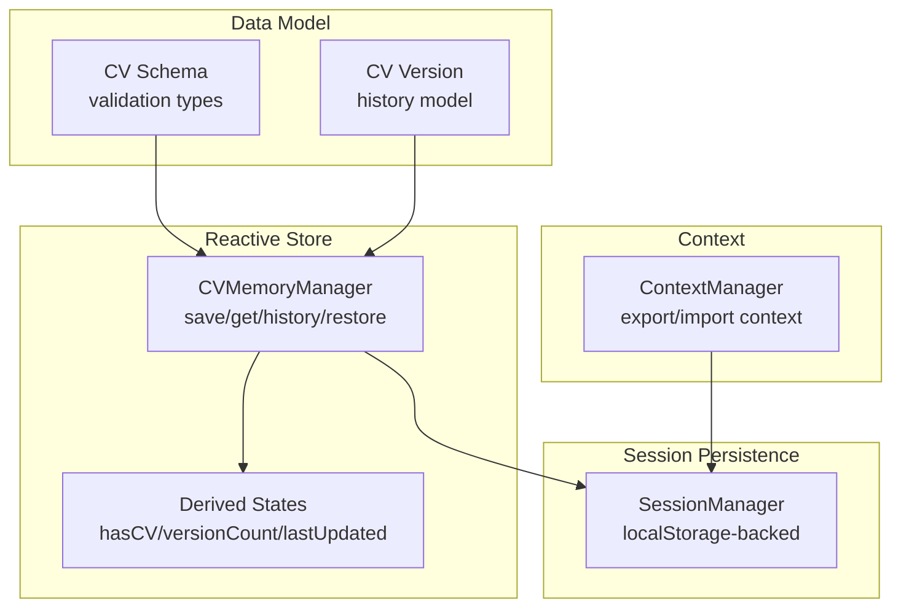
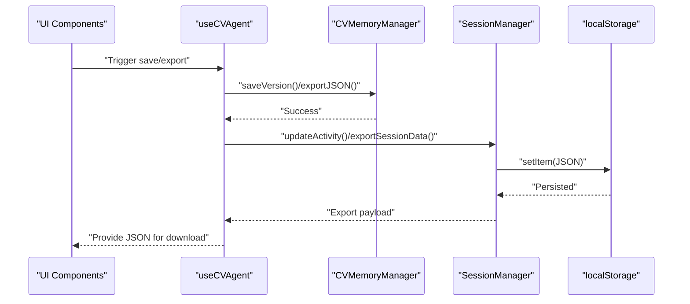
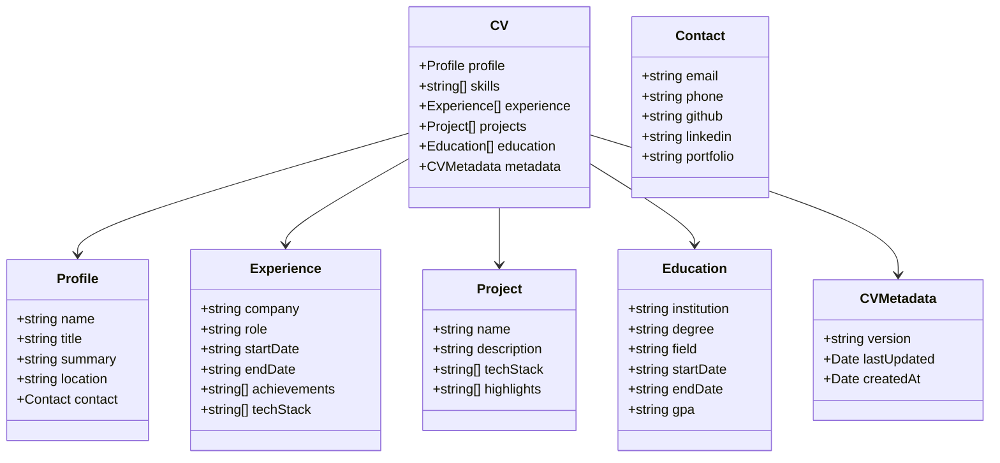
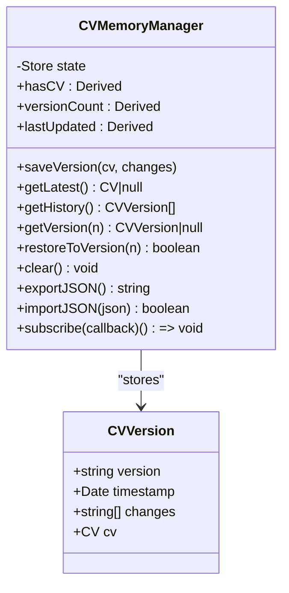
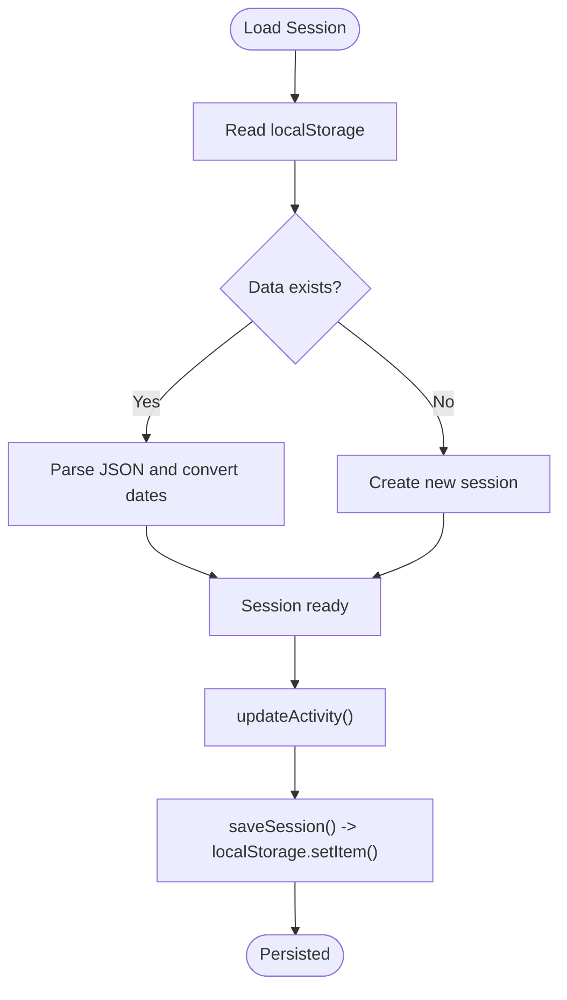
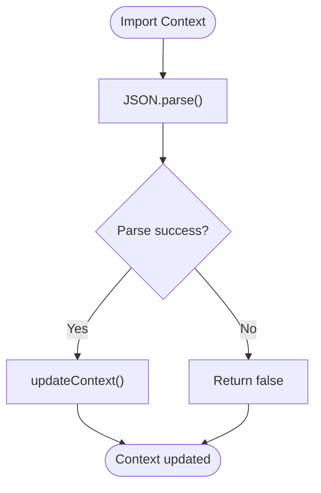
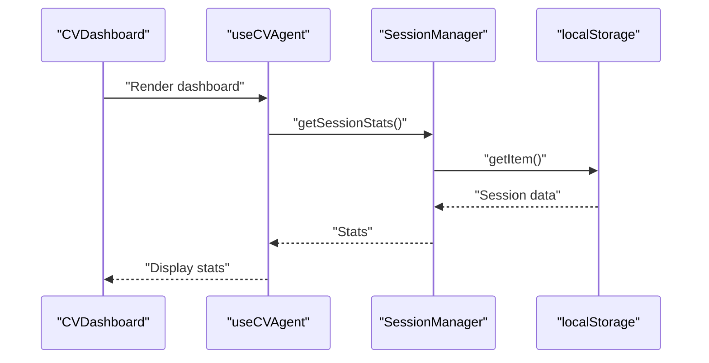
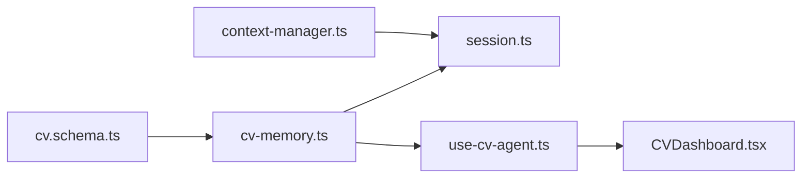

# Data Persistence

<cite>
**Referenced Files in This Document**
- [cv.schema.ts](file://src/agent/schemas/cv.schema.ts)
- [cv-memory.ts](file://src/agent/memory/cv-memory.ts)
- [session.ts](file://src/agent/core/session.ts)
- [context-manager.ts](file://src/agent/memory/context-manager.ts)
- [use-cv-agent.ts](file://src/hooks/use-cv-agent.ts)
- [CVDashboard.tsx](file://src/components/agent/CVDashboard.tsx)
- [skill-agent.test.tsx](file://src/agent/__tests__/skill-agent.test.tsx)
</cite>

## Table of Contents
1. [Introduction](#introduction)
2. [Project Structure](#project-structure)
3. [Core Components](#core-components)
4. [Architecture Overview](#architecture-overview)
5. [Detailed Component Analysis](#detailed-component-analysis)
6. [Dependency Analysis](#dependency-analysis)
7. [Performance Considerations](#performance-considerations)
8. [Troubleshooting Guide](#troubleshooting-guide)
9. [Conclusion](#conclusion)

## Introduction
This document describes data persistence strategies for the CV Portfolio Builder with a focus on offline-first storage, versioning, serialization/deserialization, backup and restore, integrity checks, and optional synchronization patterns. The system integrates localStorage for offline persistence and provides robust mechanisms for exporting/importing CV data, managing session state, and maintaining version history. Security considerations for sensitive CV data are addressed through careful handling of serialized payloads and guidance for secure storage.

## Project Structure
The CV data persistence layer centers around three primary areas:
- CV schema and versioning model
- In-memory reactive store with version history and export/import
- Session manager with localStorage-backed persistence

**Diagram sources**
- [cv.schema.ts:1-79](file://src/agent/schemas/cv.schema.ts#L1-L79)
- [cv-memory.ts:19-148](file://src/agent/memory/cv-memory.ts#L19-L148)
- [session.ts:7-203](file://src/agent/core/session.ts#L7-L203)
- [context-manager.ts:1-141](file://src/agent/memory/context-manager.ts#L1-L141)

**Section sources**
- [cv.schema.ts:1-79](file://src/agent/schemas/cv.schema.ts#L1-L79)
- [cv-memory.ts:19-148](file://src/agent/memory/cv-memory.ts#L19-L148)
- [session.ts:7-203](file://src/agent/core/session.ts#L7-L203)
- [context-manager.ts:1-141](file://src/agent/memory/context-manager.ts#L1-L141)

## Core Components
- CV schema and types define the shape of CV data and metadata, enabling strict validation and consistent serialization.
- CVMemoryManager maintains the current CV, version history, and exposes operations for saving, retrieving, restoring, clearing, and exporting/importing.
- SessionManager persists session state to localStorage with robust error handling and recovery.
- ContextManager manages user profile context and supports export/import of context data.

Key responsibilities:
- Serialization/deserialization: JSON-based export/import for CV and context.
- Migration patterns: Version numbering scheme and restoration to prior versions.
- Backup and restore: Export to JSON and import from JSON with validation.
- Integrity checks: Try/catch around localStorage operations and JSON parsing.
- Optional synchronization: Session data export enables manual sync to external systems.

**Section sources**
- [cv.schema.ts:50-79](file://src/agent/schemas/cv.schema.ts#L50-L79)
- [cv-memory.ts:55-138](file://src/agent/memory/cv-memory.ts#L55-L138)
- [session.ts:75-125](file://src/agent/core/session.ts#L75-L125)
- [context-manager.ts:118-136](file://src/agent/memory/context-manager.ts#L118-L136)

## Architecture Overview
The persistence architecture combines in-memory reactive stores with localStorage-backed session persistence. CV data is versioned and exportable, while session state is persisted across browser sessions.

**Diagram sources**
- [cv-memory.ts:55-138](file://src/agent/memory/cv-memory.ts#L55-L138)
- [session.ts:57-170](file://src/agent/core/session.ts#L57-L170)

## Detailed Component Analysis

### CV Schema and Types
Defines the CV data model, including nested sections (profile, experience, projects, education), arrays, and metadata. Validation ensures data integrity during import/export and versioning.

**Diagram sources**
- [cv.schema.ts:13-61](file://src/agent/schemas/cv.schema.ts#L13-L61)

**Section sources**
- [cv.schema.ts:13-61](file://src/agent/schemas/cv.schema.ts#L13-L61)

### CV Memory Manager
Manages CV versions, history, and reactive derived states. Provides save, get, restore, clear, export, and import operations.

**Diagram sources**
- [cv-memory.ts:19-148](file://src/agent/memory/cv-memory.ts#L19-L148)
- [cv.schema.ts:72-79](file://src/agent/schemas/cv.schema.ts#L72-L79)

**Section sources**
- [cv-memory.ts:19-148](file://src/agent/memory/cv-memory.ts#L19-L148)
- [cv.schema.ts:72-79](file://src/agent/schemas/cv.schema.ts#L72-L79)

### Session Manager
Handles session lifecycle and persistence to localStorage. Converts Date objects to ISO strings for serialization and back to Date upon load.

**Diagram sources**
- [session.ts:95-125](file://src/agent/core/session.ts#L95-L125)
- [session.ts:75-90](file://src/agent/core/session.ts#L75-L90)

**Section sources**
- [session.ts:7-203](file://src/agent/core/session.ts#L7-L203)

### Context Manager
Manages user profile context and supports export/import of context data as JSON.

**Diagram sources**
- [context-manager.ts:127-136](file://src/agent/memory/context-manager.ts#L127-L136)

**Section sources**
- [context-manager.ts:1-141](file://src/agent/memory/context-manager.ts#L1-L141)

### Hooks and UI Integration
The hooks integrate persistence operations with UI components, exposing reactive CV data and session stats.

**Diagram sources**
- [use-cv-agent.ts:154-181](file://src/hooks/use-cv-agent.ts#L154-L181)
- [session.ts:127-151](file://src/agent/core/session.ts#L127-L151)
- [CVDashboard.tsx:152-174](file://src/components/agent/CVDashboard.tsx#L152-L174)

**Section sources**
- [use-cv-agent.ts:154-181](file://src/hooks/use-cv-agent.ts#L154-L181)
- [CVDashboard.tsx:152-174](file://src/components/agent/CVDashboard.tsx#L152-L174)

## Dependency Analysis
- CVMemoryManager depends on CV schema types and @tanstack/store for reactive state.
- SessionManager depends on CV store for exporting combined session/CV/context data.
- ContextManager depends on CV store for context updates and provides isolated export/import.

**Diagram sources**
- [cv.schema.ts:1-79](file://src/agent/schemas/cv.schema.ts#L1-L79)
- [cv-memory.ts:1-290](file://src/agent/memory/cv-memory.ts#L1-L290)
- [session.ts:1-204](file://src/agent/core/session.ts#L1-L204)
- [context-manager.ts:1-141](file://src/agent/memory/context-manager.ts#L1-L141)
- [use-cv-agent.ts:1-182](file://src/hooks/use-cv-agent.ts#L1-L182)
- [CVDashboard.tsx:152-174](file://src/components/agent/CVDashboard.tsx#L152-L174)

**Section sources**
- [cv-memory.ts:19-148](file://src/agent/memory/cv-memory.ts#L19-L148)
- [session.ts:7-203](file://src/agent/core/session.ts#L7-L203)
- [context-manager.ts:1-141](file://src/agent/memory/context-manager.ts#L1-L141)
- [use-cv-agent.ts:1-182](file://src/hooks/use-cv-agent.ts#L1-L182)
- [CVDashboard.tsx:152-174](file://src/components/agent/CVDashboard.tsx#L152-L174)

## Performance Considerations
- Large datasets: Prefer incremental updates and batch operations to minimize re-renders and excessive localStorage writes.
- Serialization overhead: Export/import operations serialize large JSON payloads; cache exports when repeatedly used.
- Reactive subscriptions: Limit subscription scope to necessary components to reduce unnecessary updates.
- Version history growth: Periodically prune old versions to control memory and localStorage footprint.
- Date serialization: Converting Date to ISO strings avoids platform-specific serialization differences.

[No sources needed since this section provides general guidance]

## Troubleshooting Guide
Common issues and resolutions:
- localStorage errors: Operations wrap writes/reads in try/catch; failures are logged and fallbacks (new session creation) are applied.
- JSON parse errors: Import operations catch exceptions and return false; validate JSON before importing.
- Version restoration: Attempting to restore a non-existent version returns false; check versionCount before restoring.
- Export/import tests: Unit tests validate export/import behavior and version restoration.

**Section sources**
- [session.ts:75-125](file://src/agent/core/session.ts#L75-L125)
- [cv-memory.ts:130-138](file://src/agent/memory/cv-memory.ts#L130-L138)
- [skill-agent.test.tsx:574-622](file://src/agent/__tests__/skill-agent.test.tsx#L574-L622)

## Conclusion
The CV Portfolio Builder employs a clean separation of concerns for data persistence:
- Strict typing and validation ensure data integrity.
- Versioned history and export/import enable robust backup and restore.
- localStorage-backed session persistence provides offline continuity with integrity safeguards.
- Optional synchronization is supported via export of combined session/CV/context data.

These patterns deliver reliability, maintainability, and extensibility for CV data across browser sessions and environments.