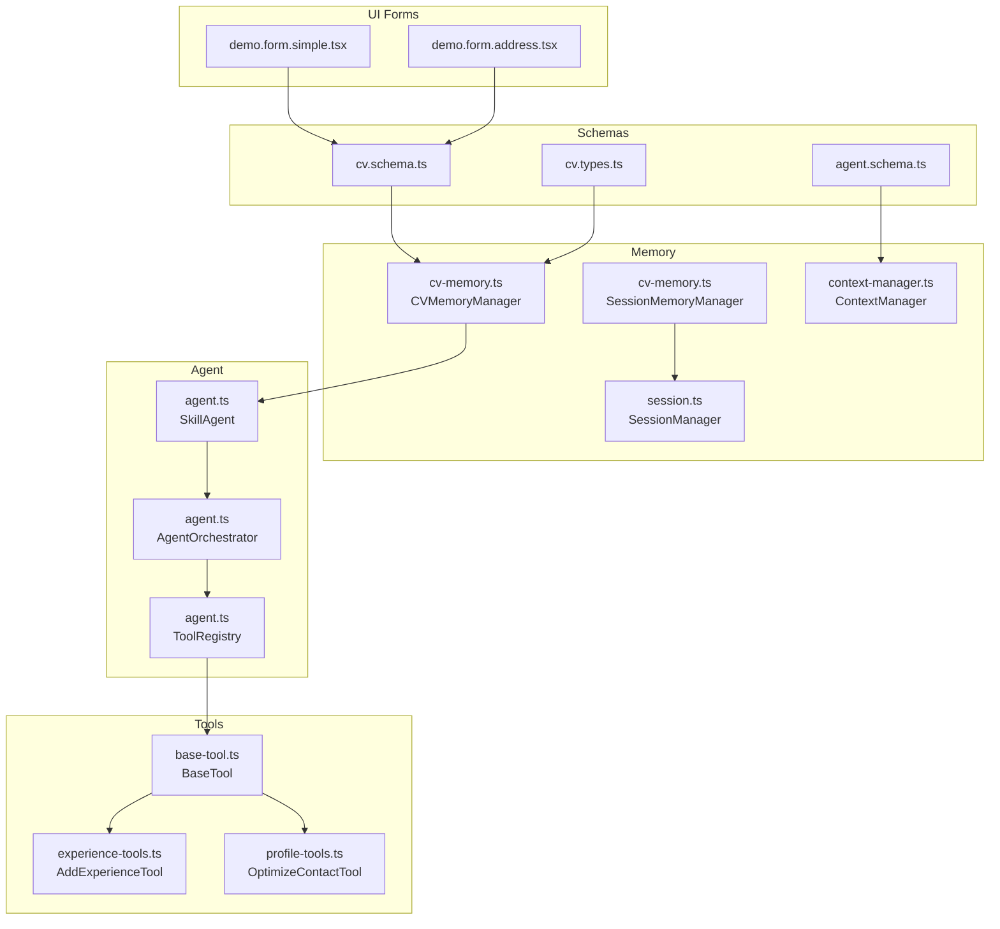
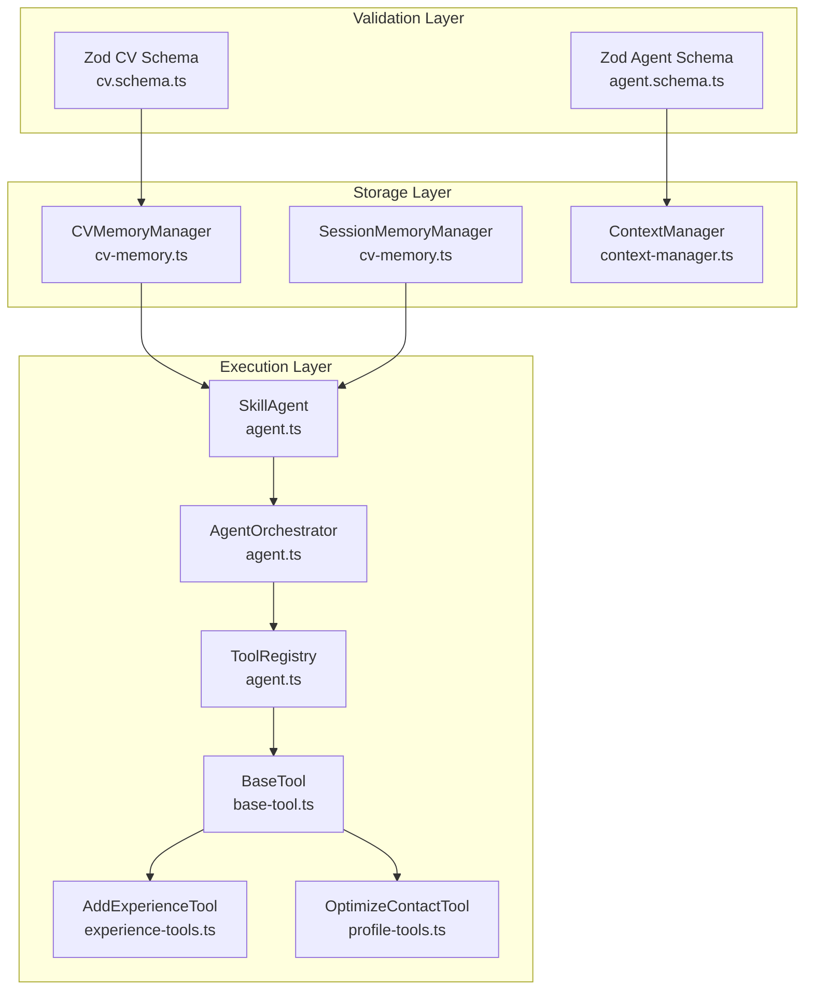
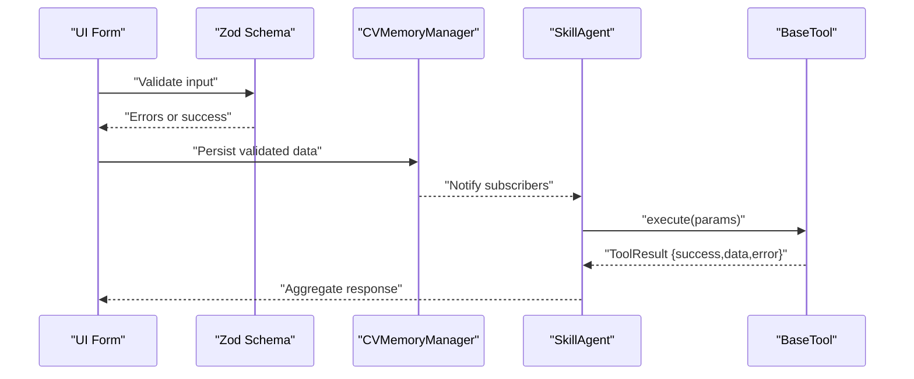
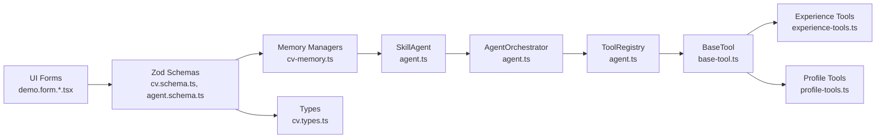

# Data Validation

<cite>
**Referenced Files in This Document**
- [agent.schema.ts](file://src/agent/schemas/agent.schema.ts)
- [cv.schema.ts](file://src/agent/schemas/cv.schema.ts)
- [cv.types.ts](file://src/templates/types/cv.types.ts)
- [cv-memory.ts](file://src/agent/memory/cv-memory.ts)
- [context-manager.ts](file://src/agent/memory/context-manager.ts)
- [session.ts](file://src/agent/core/session.ts)
- [agent.ts](file://src/agent/core/agent.ts)
- [base-tool.ts](file://src/agent/tools/base-tool.ts)
- [experience-tools.ts](file://src/agent/tools/experience-tools.ts)
- [profile-tools.ts](file://src/agent/tools/profile-tools.ts)
- [demo.form.simple.tsx](file://src/routes/demo.form.simple.tsx)
- [demo.form.address.tsx](file://src/routes/demo.form.address.tsx)
- [env.ts](file://src/env.ts)
- [SKILL_AGENT_ARCHITECTURE.md](file://SKILL_AGENT_ARCHITECTURE.md)
</cite>

## Table of Contents
1. [Introduction](#introduction)
2. [Project Structure](#project-structure)
3. [Core Components](#core-components)
4. [Architecture Overview](#architecture-overview)
5. [Detailed Component Analysis](#detailed-component-analysis)
6. [Dependency Analysis](#dependency-analysis)
7. [Performance Considerations](#performance-considerations)
8. [Troubleshooting Guide](#troubleshooting-guide)
9. [Conclusion](#conclusion)
10. [Appendices](#appendices)

## Introduction
This document explains the data validation systems used in CV data management and agent contexts. It covers Zod schema validation patterns for CV entities and agent contexts, validation rules, error handling, and validation workflows. It also documents runtime validation, compile-time type checking, validation middleware, custom validators, async validation, validation error reporting, performance considerations, optimization strategies, and testing approaches used across the application.

## Project Structure
The validation system spans several layers:
- Schemas define strict data contracts for CVs and agent contexts.
- Memory managers persist validated data and expose derived states.
- Tools encapsulate validation and execution logic.
- Agent orchestration coordinates tool execution and logs actions.
- UI forms demonstrate client-side validation patterns.

**Diagram sources**
- [agent.schema.ts:1-62](file://src/agent/schemas/agent.schema.ts#L1-L62)
- [cv.schema.ts:1-79](file://src/agent/schemas/cv.schema.ts#L1-L79)
- [cv.types.ts:1-16](file://src/templates/types/cv.types.ts#L1-L16)
- [cv-memory.ts:1-290](file://src/agent/memory/cv-memory.ts#L1-L290)
- [context-manager.ts:1-141](file://src/agent/memory/context-manager.ts#L1-L141)
- [session.ts:1-204](file://src/agent/core/session.ts#L1-L204)
- [agent.ts:1-414](file://src/agent/core/agent.ts#L1-L414)
- [base-tool.ts:1-72](file://src/agent/tools/base-tool.ts#L1-L72)
- [experience-tools.ts:1-194](file://src/agent/tools/experience-tools.ts#L1-L194)
- [profile-tools.ts:1-142](file://src/agent/tools/profile-tools.ts#L1-L142)
- [demo.form.simple.tsx:1-50](file://src/routes/demo.form.simple.tsx#L1-L50)
- [demo.form.address.tsx:1-136](file://src/routes/demo.form.address.tsx#L1-L136)

**Section sources**
- [agent.schema.ts:1-62](file://src/agent/schemas/agent.schema.ts#L1-L62)
- [cv.schema.ts:1-79](file://src/agent/schemas/cv.schema.ts#L1-L79)
- [cv.types.ts:1-16](file://src/templates/types/cv.types.ts#L1-L16)
- [cv-memory.ts:1-290](file://src/agent/memory/cv-memory.ts#L1-L290)
- [context-manager.ts:1-141](file://src/agent/memory/context-manager.ts#L1-L141)
- [session.ts:1-204](file://src/agent/core/session.ts#L1-L204)
- [agent.ts:1-414](file://src/agent/core/agent.ts#L1-L414)
- [base-tool.ts:1-72](file://src/agent/tools/base-tool.ts#L1-L72)
- [experience-tools.ts:1-194](file://src/agent/tools/experience-tools.ts#L1-L194)
- [profile-tools.ts:1-142](file://src/agent/tools/profile-tools.ts#L1-L142)
- [demo.form.simple.tsx:1-50](file://src/routes/demo.form.simple.tsx#L1-L50)
- [demo.form.address.tsx:1-136](file://src/routes/demo.form.address.tsx#L1-L136)

## Core Components
- Zod schemas define strict contracts for CV entities and agent contexts, enabling compile-time type inference and runtime validation.
- Memory managers persist validated data and expose derived states for reactive updates.
- Tools implement validation via a pluggable validate method and standardized execution results.
- Agent orchestrator coordinates tool execution, logs actions, and aggregates results.
- UI forms demonstrate client-side validation patterns using Zod and custom validators.

Key validation artifacts:
- CV entity schemas: [cv.schema.ts:1-79](file://src/agent/schemas/cv.schema.ts#L1-L79)
- Agent context and action schemas: [agent.schema.ts:1-62](file://src/agent/schemas/agent.schema.ts#L1-L62)
- CV types re-export: [cv.types.ts:1-16](file://src/templates/types/cv.types.ts#L1-L16)
- Memory managers: [cv-memory.ts:1-290](file://src/agent/memory/cv-memory.ts#L1-L290)
- Context manager: [context-manager.ts:1-141](file://src/agent/memory/context-manager.ts#L1-L141)
- Session manager: [session.ts:1-204](file://src/agent/core/session.ts#L1-L204)
- Agent orchestration: [agent.ts:1-414](file://src/agent/core/agent.ts#L1-L414)
- Base tool interface and validation: [base-tool.ts:1-72](file://src/agent/tools/base-tool.ts#L1-L72)
- Example tools with custom validation: [experience-tools.ts:1-194](file://src/agent/tools/experience-tools.ts#L1-L194), [profile-tools.ts:1-142](file://src/agent/tools/profile-tools.ts#L1-L142)
- UI validation examples: [demo.form.simple.tsx:1-50](file://src/routes/demo.form.simple.tsx#L1-L50), [demo.form.address.tsx:1-136](file://src/routes/demo.form.address.tsx#L1-L136)

**Section sources**
- [cv.schema.ts:1-79](file://src/agent/schemas/cv.schema.ts#L1-L79)
- [agent.schema.ts:1-62](file://src/agent/schemas/agent.schema.ts#L1-L62)
- [cv.types.ts:1-16](file://src/templates/types/cv.types.ts#L1-L16)
- [cv-memory.ts:1-290](file://src/agent/memory/cv-memory.ts#L1-L290)
- [context-manager.ts:1-141](file://src/agent/memory/context-manager.ts#L1-L141)
- [session.ts:1-204](file://src/agent/core/session.ts#L1-L204)
- [agent.ts:1-414](file://src/agent/core/agent.ts#L1-L414)
- [base-tool.ts:1-72](file://src/agent/tools/base-tool.ts#L1-L72)
- [experience-tools.ts:1-194](file://src/agent/tools/experience-tools.ts#L1-L194)
- [profile-tools.ts:1-142](file://src/agent/tools/profile-tools.ts#L1-L142)
- [demo.form.simple.tsx:1-50](file://src/routes/demo.form.simple.tsx#L1-L50)
- [demo.form.address.tsx:1-136](file://src/routes/demo.form.address.tsx#L1-L136)

## Architecture Overview
The validation architecture integrates Zod schemas, memory managers, tools, and agent orchestration. It ensures data integrity from ingestion to persistence and execution.

**Diagram sources**
- [cv.schema.ts:1-79](file://src/agent/schemas/cv.schema.ts#L1-L79)
- [agent.schema.ts:1-62](file://src/agent/schemas/agent.schema.ts#L1-L62)
- [cv-memory.ts:1-290](file://src/agent/memory/cv-memory.ts#L1-L290)
- [context-manager.ts:1-141](file://src/agent/memory/context-manager.ts#L1-L141)
- [agent.ts:1-414](file://src/agent/core/agent.ts#L1-L414)
- [base-tool.ts:1-72](file://src/agent/tools/base-tool.ts#L1-L72)
- [experience-tools.ts:1-194](file://src/agent/tools/experience-tools.ts#L1-L194)
- [profile-tools.ts:1-142](file://src/agent/tools/profile-tools.ts#L1-L142)

## Detailed Component Analysis

### Zod Schemas for CV Entities and Agent Contexts
- CV schemas enforce required fields, constraints, and defaults for contact, profile, experience, project, and education entities.
- Agent context and action schemas define structured context, tool metadata, and session state with optional and default fields.

Validation patterns:
- Required fields with custom messages for clarity.
- Enum constraints for controlled vocabulary.
- Arrays with defaults and minimum length requirements.
- Nested object composition for complex entities.

Example references:
- CV contact: [cv.schema.ts:4-10](file://src/agent/schemas/cv.schema.ts#L4-L10)
- Profile: [cv.schema.ts:13-19](file://src/agent/schemas/cv.schema.ts#L13-L19)
- Experience: [cv.schema.ts:22-29](file://src/agent/schemas/cv.schema.ts#L22-L29)
- Project: [cv.schema.ts:32-37](file://src/agent/schemas/cv.schema.ts#L32-L37)
- Education: [cv.schema.ts:40-47](file://src/agent/schemas/cv.schema.ts#L40-L47)
- CV composition: [cv.schema.ts:50-61](file://src/agent/schemas/cv.schema.ts#L50-L61)
- Agent context: [agent.schema.ts:4-12](file://src/agent/schemas/agent.schema.ts#L4-L12)
- Agent action: [agent.schema.ts:32-40](file://src/agent/schemas/agent.schema.ts#L32-L40)
- Session state: [agent.schema.ts:43-51](file://src/agent/schemas/agent.schema.ts#L43-L51)

**Section sources**
- [cv.schema.ts:1-79](file://src/agent/schemas/cv.schema.ts#L1-L79)
- [agent.schema.ts:1-62](file://src/agent/schemas/agent.schema.ts#L1-L62)

### Compile-Time Type Checking and Type Exports
- Zod’s inferred types provide strong compile-time guarantees for CV and agent entities.
- Types are exported and re-exported for consistent usage across templates and components.

References:
- CV inferred types: [cv.schema.ts:64-69](file://src/agent/schemas/cv.schema.ts#L64-L69)
- CVWithMeta extension: [cv.types.ts:12-15](file://src/templates/types/cv.types.ts#L12-L15)

**Section sources**
- [cv.schema.ts:64-69](file://src/agent/schemas/cv.schema.ts#L64-L69)
- [cv.types.ts:1-16](file://src/templates/types/cv.types.ts#L1-L16)

### Runtime Validation and Validation Middleware
- Memory managers import and export data with JSON parsing and validation.
- Session manager persists and restores session state with date normalization.
- Tool registry and orchestrator coordinate tool execution and logging.

References:
- CV import/export with JSON parsing: [cv-memory.ts:130-138](file://src/agent/memory/cv-memory.ts#L130-L138)
- Session persistence and restoration: [session.ts:75-112](file://src/agent/core/session.ts#L75-L112)
- Tool execution and logging: [agent.ts:78-127](file://src/agent/core/agent.ts#L78-L127)

**Section sources**
- [cv-memory.ts:130-138](file://src/agent/memory/cv-memory.ts#L130-L138)
- [session.ts:75-112](file://src/agent/core/session.ts#L75-L112)
- [agent.ts:78-127](file://src/agent/core/agent.ts#L78-L127)

### Custom Validators and Async Validation
- BaseTool defines a validate hook that can be overridden for parameter validation before execution.
- Example tools implement custom validation:
  - AddExperienceTool validates required fields.
  - OptimizeContactTool validates email format.

References:
- BaseTool validate signature: [base-tool.ts:23-25](file://src/agent/tools/base-tool.ts#L23-L25)
- AddExperienceTool.validate: [experience-tools.ts:34-36](file://src/agent/tools/experience-tools.ts#L34-L36)
- OptimizeContactTool.validate: [profile-tools.ts:96-99](file://src/agent/tools/profile-tools.ts#L96-L99)

**Section sources**
- [base-tool.ts:1-72](file://src/agent/tools/base-tool.ts#L1-L72)
- [experience-tools.ts:1-194](file://src/agent/tools/experience-tools.ts#L1-L194)
- [profile-tools.ts:1-142](file://src/agent/tools/profile-tools.ts#L1-L142)

### Validation Error Handling and Reporting
- Tools return structured results with success flags, data, and error messages.
- Agent orchestrator wraps tool execution with error handling and logs failures.
- UI forms provide user-facing validation feedback during blur and submission.

References:
- ToolResult interface: [base-tool.ts:54-60](file://src/agent/tools/base-tool.ts#L54-L60)
- Tool execution with error handling: [base-tool.ts:30-48](file://src/agent/tools/base-tool.ts#L30-L48)
- Agent tool execution error handling: [agent.ts:115-126](file://src/agent/core/agent.ts#L115-L126)
- Form validation with Zod schema: [demo.form.simple.tsx:8-11](file://src/routes/demo.form.simple.tsx#L8-L11)
- Form validation with custom validators: [demo.form.address.tsx:64-74](file://src/routes/demo.form.address.tsx#L64-L74)

**Section sources**
- [base-tool.ts:54-60](file://src/agent/tools/base-tool.ts#L54-L60)
- [base-tool.ts:30-48](file://src/agent/tools/base-tool.ts#L30-L48)
- [agent.ts:115-126](file://src/agent/core/agent.ts#L115-L126)
- [demo.form.simple.tsx:8-11](file://src/routes/demo.form.simple.tsx#L8-L11)
- [demo.form.address.tsx:64-74](file://src/routes/demo.form.address.tsx#L64-L74)

### Validation Workflows
- CV creation and updates are validated against CV schemas before persistence.
- Agent context updates are validated against agent context schemas.
- Tool execution follows a validation-first workflow with logging and error propagation.

**Diagram sources**
- [cv.schema.ts:1-79](file://src/agent/schemas/cv.schema.ts#L1-L79)
- [cv-memory.ts:143-147](file://src/agent/memory/cv-memory.ts#L143-L147)
- [agent.ts:286-297](file://src/agent/core/agent.ts#L286-L297)
- [base-tool.ts:30-48](file://src/agent/tools/base-tool.ts#L30-L48)

## Dependency Analysis
The validation system exhibits low coupling and high cohesion:
- Schemas are independent and reusable across modules.
- Memory managers depend on schemas for type safety and validation.
- Tools depend on BaseTool for consistent validation and execution.
- Agent orchestrator depends on tool registry and memory managers.

**Diagram sources**
- [cv.schema.ts:1-79](file://src/agent/schemas/cv.schema.ts#L1-L79)
- [agent.schema.ts:1-62](file://src/agent/schemas/agent.schema.ts#L1-L62)
- [cv.types.ts:1-16](file://src/templates/types/cv.types.ts#L1-L16)
- [cv-memory.ts:1-290](file://src/agent/memory/cv-memory.ts#L1-L290)
- [agent.ts:1-414](file://src/agent/core/agent.ts#L1-L414)
- [base-tool.ts:1-72](file://src/agent/tools/base-tool.ts#L1-L72)
- [experience-tools.ts:1-194](file://src/agent/tools/experience-tools.ts#L1-L194)
- [profile-tools.ts:1-142](file://src/agent/tools/profile-tools.ts#L1-L142)
- [demo.form.simple.tsx:1-50](file://src/routes/demo.form.simple.tsx#L1-L50)
- [demo.form.address.tsx:1-136](file://src/routes/demo.form.address.tsx#L1-L136)

**Section sources**
- [cv.schema.ts:1-79](file://src/agent/schemas/cv.schema.ts#L1-L79)
- [agent.schema.ts:1-62](file://src/agent/schemas/agent.schema.ts#L1-L62)
- [cv.types.ts:1-16](file://src/templates/types/cv.types.ts#L1-L16)
- [cv-memory.ts:1-290](file://src/agent/memory/cv-memory.ts#L1-L290)
- [agent.ts:1-414](file://src/agent/core/agent.ts#L1-L414)
- [base-tool.ts:1-72](file://src/agent/tools/base-tool.ts#L1-L72)
- [experience-tools.ts:1-194](file://src/agent/tools/experience-tools.ts#L1-L194)
- [profile-tools.ts:1-142](file://src/agent/tools/profile-tools.ts#L1-L142)
- [demo.form.simple.tsx:1-50](file://src/routes/demo.form.simple.tsx#L1-L50)
- [demo.form.address.tsx:1-136](file://src/routes/demo.form.address.tsx#L1-L136)

## Performance Considerations
- Zod validation is fast and designed for runtime checks; keep schemas minimal and avoid overly complex refinements.
- Use defaults in schemas to reduce downstream branching and null checks.
- Persist validated data efficiently using memory managers’ derived states to avoid redundant recomputation.
- Avoid synchronous heavy computations in validate methods; prefer lightweight checks.
- Cache tool results and LLM responses where appropriate to minimize repeated validations.

[No sources needed since this section provides general guidance]

## Troubleshooting Guide
Common validation issues and resolutions:
- Invalid CV JSON import: Memory manager catches parse errors and returns false. Ensure JSON conforms to CV schema.
  - Reference: [cv-memory.ts:130-138](file://src/agent/memory/cv-memory.ts#L130-L138)
- Session load failures: Session manager handles malformed data by falling back to a new session.
  - Reference: [session.ts:95-112](file://src/agent/core/session.ts#L95-L112)
- Tool validation failures: Tools return structured errors; check validate overrides and parameter shapes.
  - References: [base-tool.ts:30-48](file://src/agent/tools/base-tool.ts#L30-L48), [experience-tools.ts:34-36](file://src/agent/tools/experience-tools.ts#L34-L36), [profile-tools.ts:96-99](file://src/agent/tools/profile-tools.ts#L96-L99)
- Environment variable validation: Use t3-env with Zod for robust environment validation.
  - Reference: [env.ts:1-39](file://src/env.ts#L1-L39)

**Section sources**
- [cv-memory.ts:130-138](file://src/agent/memory/cv-memory.ts#L130-L138)
- [session.ts:95-112](file://src/agent/core/session.ts#L95-L112)
- [base-tool.ts:30-48](file://src/agent/tools/base-tool.ts#L30-L48)
- [experience-tools.ts:34-36](file://src/agent/tools/experience-tools.ts#L34-L36)
- [profile-tools.ts:96-99](file://src/agent/tools/profile-tools.ts#L96-L99)
- [env.ts:1-39](file://src/env.ts#L1-L39)

## Conclusion
The CV data validation system leverages Zod schemas for compile-time type safety and runtime validation, integrated with memory managers, tools, and agent orchestration. It supports custom validators, structured error reporting, and efficient workflows. The architecture emphasizes clarity, maintainability, and performance while providing robust validation across the application stack.

[No sources needed since this section summarizes without analyzing specific files]

## Appendices

### Validation Testing Approaches
- Unit tests validate memory import/export and derived states.
  - Example: CV import with invalid JSON returns false.
    - Reference: [cv-memory.ts:130-138](file://src/agent/memory/cv-memory.ts#L130-L138)
- Agent orchestration tests validate tool execution and logging.
  - Reference: [agent.ts:115-127](file://src/agent/core/agent.ts#L115-L127)
- UI form validation tests demonstrate Zod schema and custom validators.
  - References: [demo.form.simple.tsx:8-11](file://src/routes/demo.form.simple.tsx#L8-L11), [demo.form.address.tsx:64-74](file://src/routes/demo.form.address.tsx#L64-L74)

**Section sources**
- [cv-memory.ts:130-138](file://src/agent/memory/cv-memory.ts#L130-L138)
- [agent.ts:115-127](file://src/agent/core/agent.ts#L115-L127)
- [demo.form.simple.tsx:8-11](file://src/routes/demo.form.simple.tsx#L8-L11)
- [demo.form.address.tsx:64-74](file://src/routes/demo.form.address.tsx#L64-L74)

### Validation Patterns Used Throughout the Application
- Required fields with explicit messages for user feedback.
  - Reference: [cv.schema.ts:14-16](file://src/agent/schemas/cv.schema.ts#L14-L16)
- Enum constraints for controlled vocabularies.
  - Reference: [agent.schema.ts:6](file://src/agent/schemas/agent.schema.ts#L6)
- Arrays with defaults and minimum lengths.
  - References: [cv.schema.ts:27](file://src/agent/schemas/cv.schema.ts#L27), [cv.schema.ts:36](file://src/agent/schemas/cv.schema.ts#L36)
- Nested object composition for complex entities.
  - Reference: [cv.schema.ts:51](file://src/agent/schemas/cv.schema.ts#L51)
- Environment variable validation with t3-env and Zod.
  - Reference: [env.ts:1-39](file://src/env.ts#L1-L39)

**Section sources**
- [cv.schema.ts:14-16](file://src/agent/schemas/cv.schema.ts#L14-L16)
- [agent.schema.ts:6](file://src/agent/schemas/agent.schema.ts#L6)
- [cv.schema.ts:27](file://src/agent/schemas/cv.schema.ts#L27)
- [cv.schema.ts:36](file://src/agent/schemas/cv.schema.ts#L36)
- [cv.schema.ts:51](file://src/agent/schemas/cv.schema.ts#L51)
- [env.ts:1-39](file://src/env.ts#L1-L39)