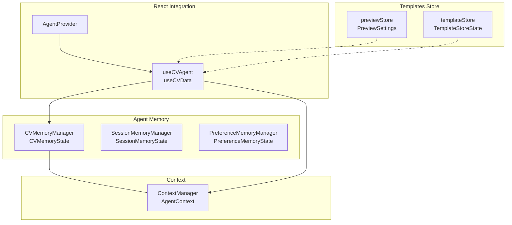
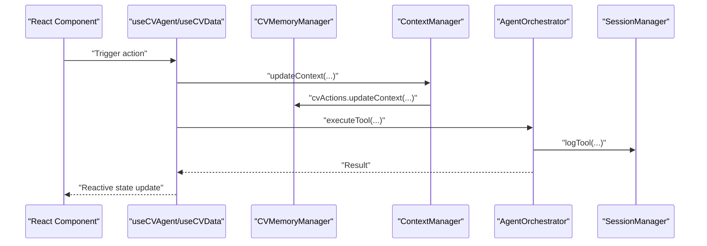
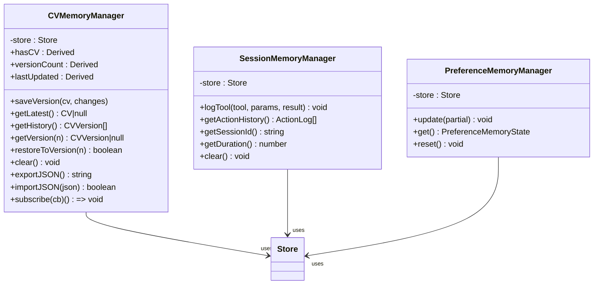
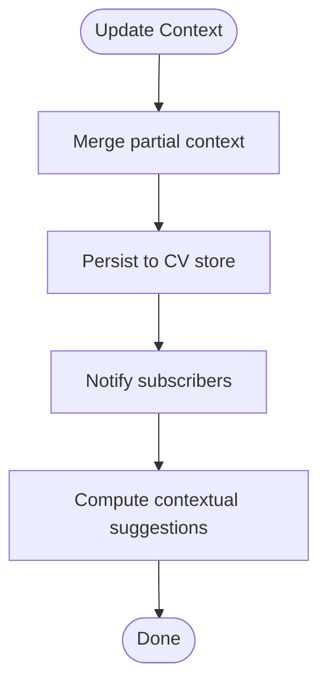
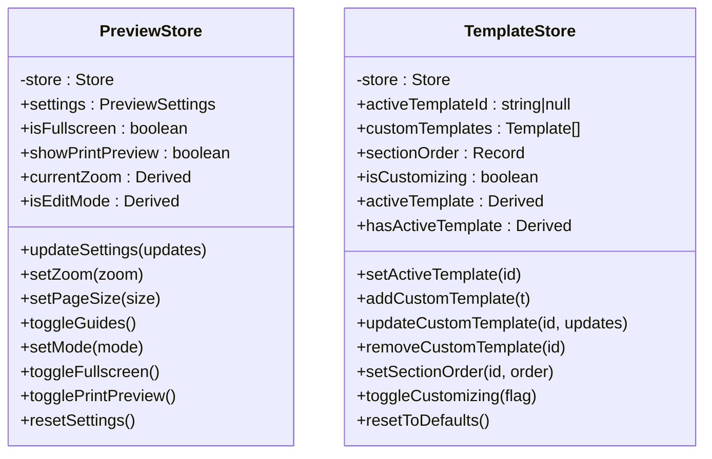
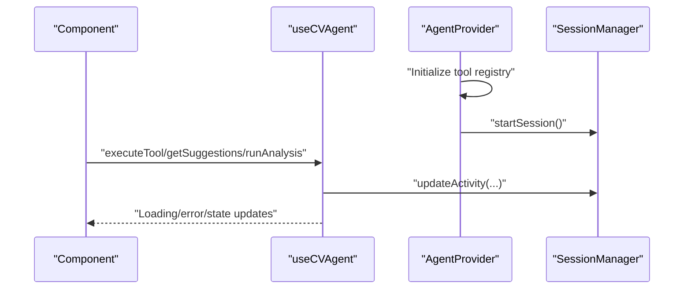
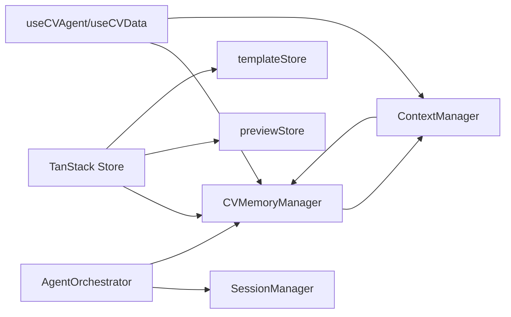

# State Management

<cite>
**Referenced Files in This Document**
- [cv-memory.ts](file://src/agent/memory/cv-memory.ts)
- [context-manager.ts](file://src/agent/memory/context-manager.ts)
- [cv.schema.ts](file://src/agent/schemas/cv.schema.ts)
- [agent.schema.ts](file://src/agent/schemas/agent.schema.ts)
- [use-cv-agent.ts](file://src/hooks/use-cv-agent.ts)
- [AgentProvider.tsx](file://src/components/AgentProvider.tsx)
- [session.ts](file://src/agent/core/session.ts)
- [agent.ts](file://src/agent/core/agent.ts)
- [preview.store.ts](file://src/templates/store/preview.store.ts)
- [template.store.ts](file://src/templates/store/template.store.ts)
- [demo-store.ts](file://src/lib/demo-store.ts)
- [demo.store.tsx](file://src/routes/demo.store.tsx)
- [cv.types.ts](file://src/templates/types/cv.types.ts)
</cite>

## Table of Contents
1. [Introduction](#introduction)
2. [Project Structure](#project-structure)
3. [Core Components](#core-components)
4. [Architecture Overview](#architecture-overview)
5. [Detailed Component Analysis](#detailed-component-analysis)
6. [Dependency Analysis](#dependency-analysis)
7. [Performance Considerations](#performance-considerations)
8. [Troubleshooting Guide](#troubleshooting-guide)
9. [Conclusion](#conclusion)

## Introduction
This document explains the reactive state management system built on TanStack Store and how CV data flows through the application. It covers the CV memory system (including reactive updates, persistence, and synchronization), the context manager for job targets and professional context tracking, and the lifecycle of state initialization, updates, and cleanup. It also documents subscriptions, computed values, side effects, performance optimizations, and debugging strategies.

## Project Structure
The state management spans several modules:
- Agent memory: CV memory, session memory, and preferences
- Context management: singleton context manager for job targeting and professional context
- Templates store: preview and template customization stores
- Hooks and providers: React integration via TanStack Store bindings
- Schemas: TypeScript types and Zod validation for CV and agent context

**Diagram sources**
- [cv-memory.ts:20-291](file://src/agent/memory/cv-memory.ts#L20-L291)
- [context-manager.ts:7-141](file://src/agent/memory/context-manager.ts#L7-L141)
- [preview.store.ts:24-100](file://src/templates/store/preview.store.ts#L24-L100)
- [template.store.ts:20-103](file://src/templates/store/template.store.ts#L20-L103)
- [use-cv-agent.ts:13-185](file://src/hooks/use-cv-agent.ts#L13-L185)
- [AgentProvider.tsx:12-29](file://src/components/AgentProvider.tsx#L12-L29)

**Section sources**
- [cv-memory.ts:20-291](file://src/agent/memory/cv-memory.ts#L20-L291)
- [context-manager.ts:7-141](file://src/agent/memory/context-manager.ts#L7-L141)
- [preview.store.ts:24-100](file://src/templates/store/preview.store.ts#L24-L100)
- [template.store.ts:20-103](file://src/templates/store/template.store.ts#L20-L103)
- [use-cv-agent.ts:13-185](file://src/hooks/use-cv-agent.ts#L13-L185)
- [AgentProvider.tsx:12-29](file://src/components/AgentProvider.tsx#L12-L29)

## Core Components
- CVMemoryManager: Centralized reactive store for CV data, versioning, and history. Provides derived values for reactive reads and actions for saving, restoring, importing, exporting, and clearing.
- SessionMemoryManager: Tracks tool execution logs and session metadata.
- PreferenceMemoryManager: Stores user preferences for tone, emphasis, and formatting.
- ContextManager: Singleton managing agent context (job target, domain, experience level, application goals) and contextual suggestions.
- Template stores: previewStore and templateStore manage UI editing and template customization state with derived values and actions.
- React hooks: useCVAgent and useCVData integrate TanStack Store with React via useStore, exposing reactive state and convenience actions.

**Section sources**
- [cv-memory.ts:20-291](file://src/agent/memory/cv-memory.ts#L20-L291)
- [context-manager.ts:7-141](file://src/agent/memory/context-manager.ts#L7-L141)
- [preview.store.ts:24-100](file://src/templates/store/preview.store.ts#L24-L100)
- [template.store.ts:20-103](file://src/templates/store/template.store.ts#L20-L103)
- [use-cv-agent.ts:13-185](file://src/hooks/use-cv-agent.ts#L13-L185)

## Architecture Overview
The system uses TanStack Store for reactive state and Derived for computed values. Components subscribe to stores via React hooks, while agent orchestration coordinates tool execution and persists outcomes.

**Diagram sources**
- [use-cv-agent.ts:13-185](file://src/hooks/use-cv-agent.ts#L13-L185)
- [context-manager.ts:27-29](file://src/agent/memory/context-manager.ts#L27-L29)
- [cv-memory.ts:67-73](file://src/agent/memory/cv-memory.ts#L67-L73)
- [agent.ts:78-127](file://src/agent/core/agent.ts#L78-L127)
- [session.ts:57-70](file://src/agent/core/session.ts#L57-L70)

## Detailed Component Analysis

### CV Memory System
- State shape: current CV, version history, last saved timestamp.
- Derived values: hasCV, versionCount, lastUpdated.
- Actions: saveVersion, getLatest, getHistory, getVersion, restoreToVersion, clear, exportJSON, importJSON, subscribe.
- Persistence and synchronization: CV versions are saved reactively; import/export operate on the latest snapshot; restoreToVersion updates current state and lastSaved timestamp.

**Diagram sources**
- [cv-memory.ts:20-291](file://src/agent/memory/cv-memory.ts#L20-L291)

**Section sources**
- [cv-memory.ts:20-149](file://src/agent/memory/cv-memory.ts#L20-L149)
- [cv.schema.ts:72-79](file://src/agent/schemas/cv.schema.ts#L72-L79)

### Context Manager for Job Targets and Professional Context
- Singleton pattern ensures global access to context.
- Methods: getContext, updateContext, setJobTarget, setDomain, setExperienceLevel, addApplicationGoal, removeApplicationGoal, clearApplicationGoals, getContextualSuggestions, isContextComplete, exportContext, importContext.
- Integrates with CV memory via cvActions.updateContext.

**Diagram sources**
- [context-manager.ts:27-77](file://src/agent/memory/context-manager.ts#L27-L77)
- [cv-memory.ts:67-73](file://src/agent/memory/cv-memory.ts#L67-L73)

**Section sources**
- [context-manager.ts:7-141](file://src/agent/memory/context-manager.ts#L7-L141)
- [agent.schema.ts:4-12](file://src/agent/schemas/agent.schema.ts#L4-L12)

### Template Stores: Preview and Template Customization
- previewStore: manages zoom, page size, guides visibility, mode, fullscreen, print preview, and exposes derived values for currentZoom and isEditMode.
- templateStore: manages active template selection, custom templates, section ordering, customization mode, and exposes derived values for activeTemplate and hasActiveTemplate.

**Diagram sources**
- [preview.store.ts:24-100](file://src/templates/store/preview.store.ts#L24-L100)
- [template.store.ts:20-103](file://src/templates/store/template.store.ts#L20-L103)

**Section sources**
- [preview.store.ts:24-100](file://src/templates/store/preview.store.ts#L24-L100)
- [template.store.ts:20-103](file://src/templates/store/template.store.ts#L20-L103)

### React Integration and Hooks
- useCVAgent: orchestrates tool execution, collects suggestions and analysis, updates session activity, and exposes state export and error handling.
- useCVData: subscribes to reactive CV state, context, completeness score, categorized skills, and last modified timestamp.
- AgentProvider: initializes tool registry globally and starts the session on mount.

**Diagram sources**
- [use-cv-agent.ts:13-104](file://src/hooks/use-cv-agent.ts#L13-L104)
- [AgentProvider.tsx:12-29](file://src/components/AgentProvider.tsx#L12-L29)
- [session.ts:33-70](file://src/agent/core/session.ts#L33-L70)

**Section sources**
- [use-cv-agent.ts:13-185](file://src/hooks/use-cv-agent.ts#L13-L185)
- [AgentProvider.tsx:12-29](file://src/components/AgentProvider.tsx#L12-L29)

### CV Schema and Types
- Defines typed CV structure, nested sections (profile, experience, projects, education), metadata, and CV versioning.
- Re-exports CV-related types for template engine compatibility.

**Section sources**
- [cv.schema.ts:49-79](file://src/agent/schemas/cv.schema.ts#L49-L79)
- [cv.types.ts:11-16](file://src/templates/types/cv.types.ts#L11-L16)

### Demo Store and Route
- Demonstrates basic TanStack Store usage with a Derived fullName and subscription via useStore.
- Route integrates the demo store into a page.

**Section sources**
- [demo-store.ts:3-14](file://src/lib/demo-store.ts#L3-L14)
- [demo.store.tsx:32-35](file://src/routes/demo.store.tsx#L32-L35)

## Dependency Analysis
- CVMemoryManager depends on TanStack Store and exposes Derived values for reactive reads.
- ContextManager depends on CV memory actions to persist context updates.
- Agent orchestrator coordinates tool execution and logs to session memory.
- Hooks depend on stores and managers for reactive UI updates.
- Template stores are independent but integrated via React components.

**Diagram sources**
- [cv-memory.ts:20-291](file://src/agent/memory/cv-memory.ts#L20-L291)
- [context-manager.ts:27-29](file://src/agent/memory/context-manager.ts#L27-L29)
- [agent.ts:78-127](file://src/agent/core/agent.ts#L78-L127)
- [session.ts:57-70](file://src/agent/core/session.ts#L57-L70)
- [use-cv-agent.ts:13-185](file://src/hooks/use-cv-agent.ts#L13-L185)
- [preview.store.ts:24-100](file://src/templates/store/preview.store.ts#L24-L100)
- [template.store.ts:20-103](file://src/templates/store/template.store.ts#L20-L103)

**Section sources**
- [cv-memory.ts:20-291](file://src/agent/memory/cv-memory.ts#L20-L291)
- [context-manager.ts:27-29](file://src/agent/memory/context-manager.ts#L27-L29)
- [agent.ts:78-127](file://src/agent/core/agent.ts#L78-L127)
- [session.ts:57-70](file://src/agent/core/session.ts#L57-L70)
- [use-cv-agent.ts:13-185](file://src/hooks/use-cv-agent.ts#L13-L185)
- [preview.store.ts:24-100](file://src/templates/store/preview.store.ts#L24-L100)
- [template.store.ts:20-103](file://src/templates/store/template.store.ts#L20-L103)

## Performance Considerations
- Prefer Derived for computed values to avoid recomputation when unrelated state changes.
- Use targeted selectors in useStore to minimize re-renders.
- Batch state updates when possible to reduce intermediate renders.
- Limit localStorage writes to essential moments (e.g., session activity updates).
- Use structural sharing in TanStack Store to maintain referential equality and optimize React updates.
- Debounce or throttle frequent updates (e.g., live suggestions) to reduce unnecessary computations.

## Troubleshooting Guide
- Subscription debugging: Verify that subscribe callbacks receive the expected state slices and that mounts occur after store creation.
- Derived computation: Ensure dependencies are correctly declared so Derived recalculates only when relevant state changes.
- Context completeness: Use isContextComplete to gate actions requiring complete context.
- Session persistence: Confirm localStorage availability and handle exceptions during save/load gracefully.
- Tool execution logs: Inspect action logs for failures and durations to diagnose bottlenecks.
- State export/import: Validate JSON serialization/deserialization and handle errors when parsing invalid data.

**Section sources**
- [cv-memory.ts:144-148](file://src/agent/memory/cv-memory.ts#L144-L148)
- [context-manager.ts:112-115](file://src/agent/memory/context-manager.ts#L112-L115)
- [session.ts:75-90](file://src/agent/core/session.ts#L75-L90)
- [session.ts:95-112](file://src/agent/core/session.ts#L95-L112)

## Conclusion
The application leverages TanStack Store for a clean, reactive state layer. CV memory tracks versions and synchronizes with context and session managers. The context manager centralizes professional context and suggestions. Template stores encapsulate UI editing state with derived values. Hooks integrate state into React components, and agent orchestration coordinates tool execution with persistent session logs. Following the outlined patterns and best practices ensures predictable, efficient, and debuggable state management.