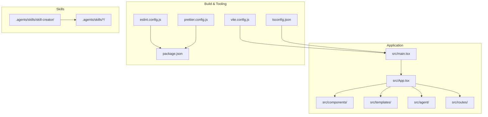
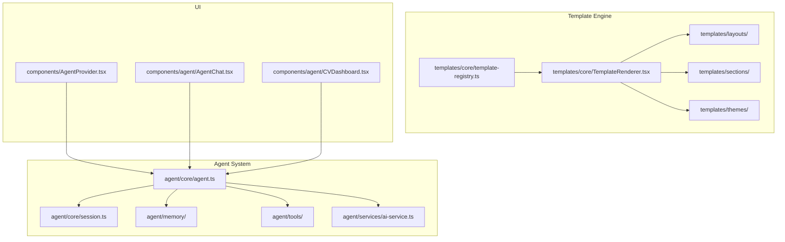
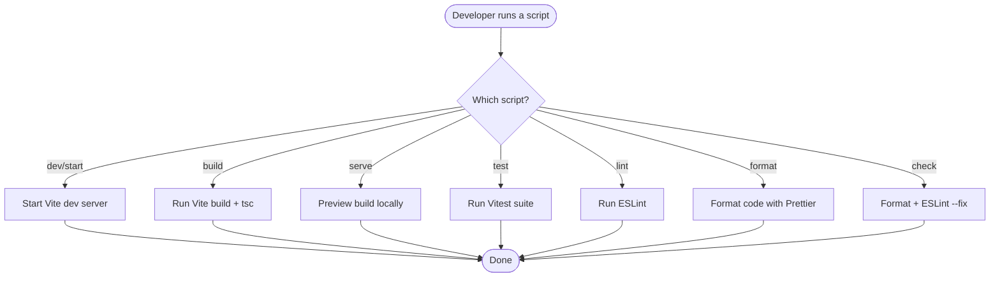
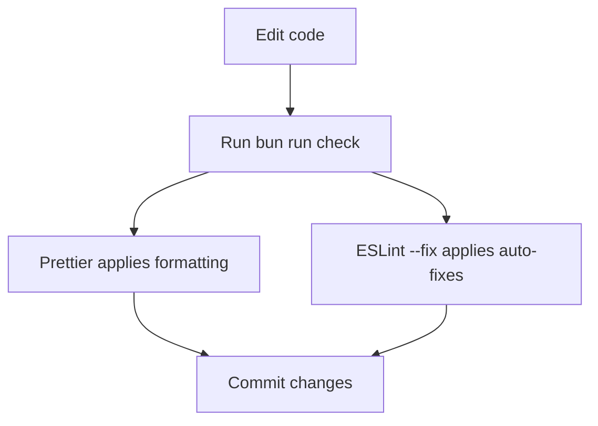
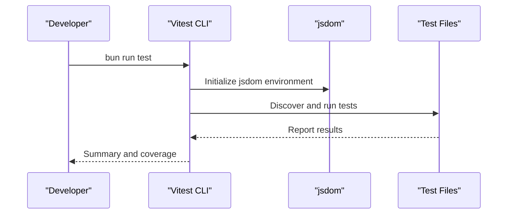
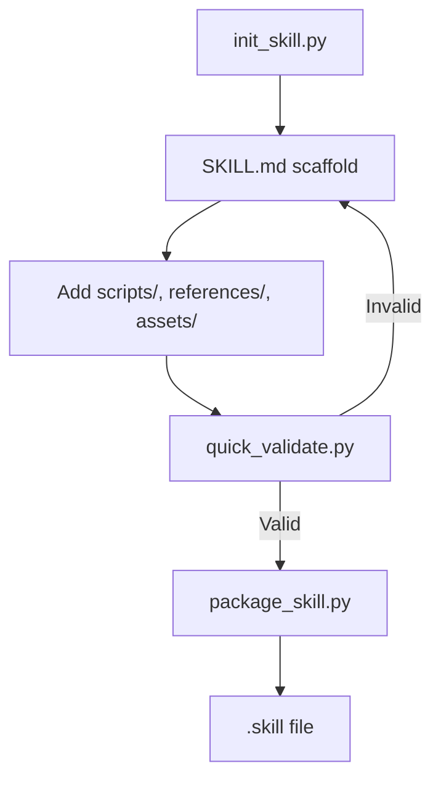
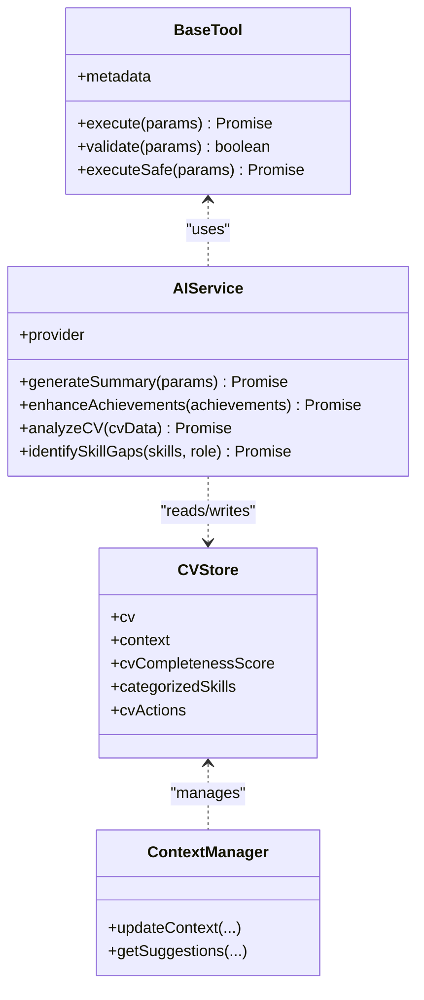
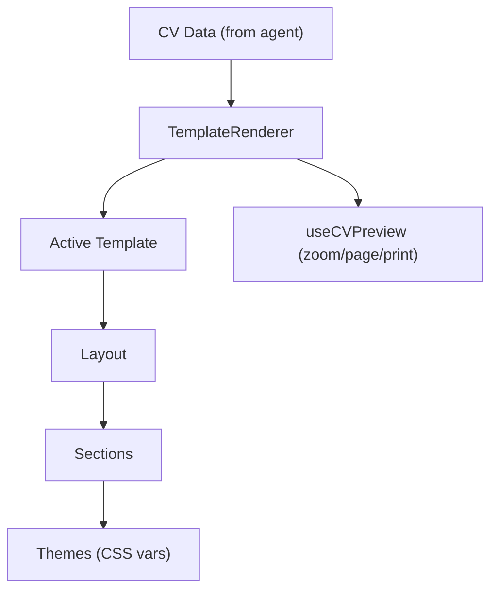
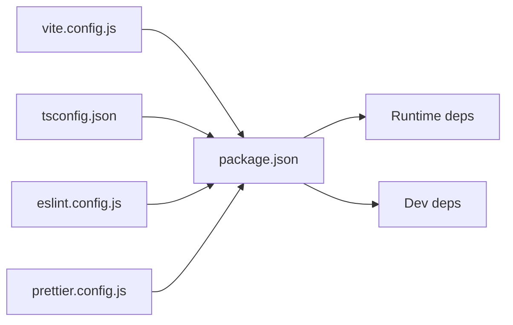

# Contributing & Development

<cite>
**Referenced Files in This Document**
- [package.json](file://package.json)
- [README.md](file://README.md)
- [eslint.config.js](file://eslint.config.js)
- [prettier.config.js](file://prettier.config.js)
- [vite.config.js](file://vite.config.js)
- [tsconfig.json](file://tsconfig.json)
- [SKILL_AGENT_QUICKSTART.md](file://SKILL_AGENT_QUICKSTART.md)
- [SKILL_AGENT_README.md](file://SKILL_AGENT_README.md)
- [RESUME_TEMPLATE_ENGINE_SUMMARY.md](file://RESUME_TEMPLATE_ENGINE_SUMMARY.md)
- [RESUME_TEMPLATE_QUICKSTART.md](file://RESUME_TEMPLATE_QUICKSTART.md)
- [.agents/skills/skill-creator/SKILL.md](file://.agents/skills/skill-creator/SKILL.md)
- [.agents/skills/skill-creator/scripts/init_skill.py](file://.agents/skills/skill-creator/scripts/init_skill.py)
- [.agents/skills/skill-creator/scripts/package_skill.py](file://.agents/skills/skill-creator/scripts/package_skill.py)
- [.agents/skills/skill-creator/scripts/quick_validate.py](file://.agents/skills/skill-creator/scripts/quick_validate.py)
- [.agents/skills/skill-creator/scripts/test_package_skill.py](file://.agents/skills/skill-creator/scripts/test_package_skill.py)
- [.agents/skills/skill-creator/scripts/test_quick_validate.py](file://.agents/skills/skill-creator/scripts/test_quick_validate.py)
</cite>

## Table of Contents
1. [Introduction](#introduction)
2. [Project Structure](#project-structure)
3. [Core Components](#core-components)
4. [Architecture Overview](#architecture-overview)
5. [Detailed Component Analysis](#detailed-component-analysis)
6. [Dependency Analysis](#dependency-analysis)
7. [Performance Considerations](#performance-considerations)
8. [Troubleshooting Guide](#troubleshooting-guide)
9. [Conclusion](#conclusion)
10. [Appendices](#appendices)

## Introduction
This document provides comprehensive contributing and development guidance for the CV Portfolio Builder project. It covers environment setup, dependency management, build processes, code standards (ESLint and Prettier), testing strategy (Vitest and Testing Library), the AI skill development workflow using the skill creator system, contribution workflow, and practical debugging and performance tips. It is designed to be accessible to contributors with varying levels of experience.

## Project Structure
The project is a React 19 application built with Vite, Tailwind CSS, and Bun. It integrates:
- A CV and portfolio builder with a live preview and multiple templates
- An AI-driven agent system for CV analysis, suggestions, and optimization
- A modular skill system for AI tools and workflows
- A template engine for rendering CVs with themes and layouts

**Diagram sources**
- [vite.config.js:1-28](file://vite.config.js#L1-L28)
- [tsconfig.json:1-29](file://tsconfig.json#L1-L29)
- [package.json:1-60](file://package.json#L1-L60)

**Section sources**
- [README.md:1-543](file://README.md#L1-L543)
- [package.json:1-60](file://package.json#L1-L60)
- [vite.config.js:1-28](file://vite.config.js#L1-L28)
- [tsconfig.json:1-29](file://tsconfig.json#L1-L29)

## Core Components
- Development environment: Bun, Vite, React 19, TypeScript, Tailwind CSS
- Code quality: ESLint with TanStack config, Prettier
- Testing: Vitest with jsdom, Testing Library
- Routing and state: TanStack Router and TanStack Store
- Agent system: MCP-inspired architecture with tools, memory, context, and AI service layer
- Template engine: Layouts, sections, themes, and a registry for rendering CVs

**Section sources**
- [README.md:501-543](file://README.md#L501-L543)
- [eslint.config.js:1-6](file://eslint.config.js#L1-L6)
- [prettier.config.js:1-11](file://prettier.config.js#L1-L11)
- [vite.config.js:1-28](file://vite.config.js#L1-L28)
- [tsconfig.json:1-29](file://tsconfig.json#L1-L29)

## Architecture Overview
The system is composed of:
- UI and routing: React components and TanStack Router
- Agent orchestration: Tool registry, session management, and state persistence
- Template rendering: Layouts, sections, themes, and a central registry
- AI services: Pluggable provider abstraction for content generation
- Skills: Modular, self-contained packages with standardized structure

**Diagram sources**
- [SKILL_AGENT_README.md:39-73](file://SKILL_AGENT_README.md#L39-L73)
- [RESUME_TEMPLATE_ENGINE_SUMMARY.md:87-121](file://RESUME_TEMPLATE_ENGINE_SUMMARY.md#L87-L121)

**Section sources**
- [SKILL_AGENT_README.md:9-74](file://SKILL_AGENT_README.md#L9-L74)
- [RESUME_TEMPLATE_ENGINE_SUMMARY.md:37-61](file://RESUME_TEMPLATE_ENGINE_SUMMARY.md#L37-L61)

## Detailed Component Analysis

### Development Setup and Build
- Install dependencies with Bun and run the dev server
- Build for production using Vite and TypeScript
- Serve preview builds locally
- Scripts are defined in package.json for dev, build, serve, test, lint, format, and check

**Diagram sources**
- [package.json:5-14](file://package.json#L5-L14)
- [vite.config.js:9-27](file://vite.config.js#L9-L27)

**Section sources**
- [README.md:5-26](file://README.md#L5-L26)
- [package.json:5-14](file://package.json#L5-L14)
- [vite.config.js:9-27](file://vite.config.js#L9-L27)

### Code Standards: ESLint and Prettier
- ESLint is configured using TanStack’s shared config
- Prettier is configured with semicolons disabled, single quotes, and trailing commas for all
- Use the check script to format and fix lint issues in one step

**Diagram sources**
- [eslint.config.js:1-6](file://eslint.config.js#L1-L6)
- [prettier.config.js:1-11](file://prettier.config.js#L1-L11)
- [package.json:11-13](file://package.json#L11-L13)

**Section sources**
- [README.md:32-40](file://README.md#L32-L40)
- [eslint.config.js:1-6](file://eslint.config.js#L1-L6)
- [prettier.config.js:1-11](file://prettier.config.js#L1-L11)
- [package.json:11-13](file://package.json#L11-L13)

### Testing Strategy: Vitest and Testing Library
- Vitest runs unit and integration tests in a jsdom environment
- Use the test script to execute the suite
- The Vite config sets globals and environment for tests

**Diagram sources**
- [package.json](file://package.json#L10)
- [vite.config.js:11-14](file://vite.config.js#L11-L14)

**Section sources**
- [README.md:20-26](file://README.md#L20-L26)
- [vite.config.js:11-14](file://vite.config.js#L11-L14)
- [package.json](file://package.json#L10)

### AI Skill Development Process: Skill Creator System
The skill creator system provides a standardized way to author, validate, and package AI skills:
- Structure: SKILL.md with YAML frontmatter and Markdown body; optional scripts/, references/, assets/
- Creation workflow: init_skill.py scaffolds a new skill directory
- Validation: quick_validate.py checks frontmatter and naming rules
- Packaging: package_skill.py zips the skill into a .skill file with security safeguards
- Tests: regression tests validate security and parsing behavior

**Diagram sources**
- [.agents/skills/skill-creator/scripts/init_skill.py:255-318](file://.agents/skills/skill-creator/scripts/init_skill.py#L255-L318)
- [.agents/skills/skill-creator/scripts/quick_validate.py:67-149](file://.agents/skills/skill-creator/scripts/quick_validate.py#L67-L149)
- [.agents/skills/skill-creator/scripts/package_skill.py:28-112](file://.agents/skills/skill-creator/scripts/package_skill.py#L28-L112)

**Section sources**
- [.agents/skills/skill-creator/SKILL.md:1-373](file://.agents/skills/skill-creator/SKILL.md#L1-L373)
- [.agents/skills/skill-creator/scripts/init_skill.py:1-379](file://.agents/skills/skill-creator/scripts/init_skill.py#L1-L379)
- [.agents/skills/skill-creator/scripts/quick_validate.py:1-160](file://.agents/skills/skill-creator/scripts/quick_validate.py#L1-L160)
- [.agents/skills/skill-creator/scripts/package_skill.py:1-140](file://.agents/skills/skill-creator/scripts/package_skill.py#L1-L140)
- [.agents/skills/skill-creator/scripts/test_package_skill.py:1-161](file://.agents/skills/skill-creator/scripts/test_package_skill.py#L1-L161)
- [.agents/skills/skill-creator/scripts/test_quick_validate.py:1-73](file://.agents/skills/skill-creator/scripts/test_quick_validate.py#L1-L73)

### Agent System: Tools, Memory, Context, AI Services
The agent system follows an MCP-inspired design:
- Tools: 15 specialized tools grouped into categories (profile, experience, project, skills, analysis)
- Memory: TanStack Store for reactive state and derived values (completeness score, categorized skills)
- Context: User profile and goals (job target, domain, experience level)
- AI Services: Pluggable provider abstraction for content generation with prompt templates

**Diagram sources**
- [SKILL_AGENT_README.md:125-213](file://SKILL_AGENT_README.md#L125-L213)

**Section sources**
- [SKILL_AGENT_README.md:77-213](file://SKILL_AGENT_README.md#L77-L213)
- [SKILL_AGENT_QUICKSTART.md:1-356](file://SKILL_AGENT_QUICKSTART.md#L1-L356)

### Template Engine: Layouts, Sections, Themes, Registry
The template engine renders CVs with:
- Layouts: SingleColumnLayout and TwoColumnLayout
- Sections: Profile, Experience, Project, Skills, Education
- Themes: Four pre-built themes with CSS variables
- Registry: Centralized template registration and selection
- Hooks: useTemplateEngine and useCVPreview for preview controls

**Diagram sources**
- [RESUME_TEMPLATE_ENGINE_SUMMARY.md:37-61](file://RESUME_TEMPLATE_ENGINE_SUMMARY.md#L37-L61)
- [RESUME_TEMPLATE_QUICKSTART.md:1-481](file://RESUME_TEMPLATE_QUICKSTART.md#L1-L481)

**Section sources**
- [RESUME_TEMPLATE_ENGINE_SUMMARY.md:87-121](file://RESUME_TEMPLATE_ENGINE_SUMMARY.md#L87-L121)
- [RESUME_TEMPLATE_QUICKSTART.md:1-481](file://RESUME_TEMPLATE_QUICKSTART.md#L1-L481)

## Dependency Analysis
- Runtime dependencies include React 19, TanStack Router, TanStack Query, Radix UI, Tailwind CSS, and others
- Dev dependencies include Vite, TypeScript, Vitest, jsdom, Prettier, and TanStack ESLint config
- Vite config enables React plugin, Tailwind, and Module Federation; aliases for @ and @components
- TypeScript config enforces strictness and bundler mode

**Diagram sources**
- [package.json:15-58](file://package.json#L15-L58)
- [vite.config.js:1-28](file://vite.config.js#L1-L28)
- [tsconfig.json:1-29](file://tsconfig.json#L1-L29)
- [eslint.config.js:1-6](file://eslint.config.js#L1-L6)
- [prettier.config.js:1-11](file://prettier.config.js#L1-L11)

**Section sources**
- [package.json:15-58](file://package.json#L15-L58)
- [vite.config.js:1-28](file://vite.config.js#L1-L28)
- [tsconfig.json:1-29](file://tsconfig.json#L1-L29)

## Performance Considerations
- Use React.memo on section components to prevent unnecessary re-renders
- Subscribe to specific parts of the store to minimize re-renders
- Use derived states for computed values (e.g., completeness score)
- Defer heavy operations and leverage TanStack Store’s reactivity
- Keep SKILL.md concise and split detailed references into separate files

[No sources needed since this section provides general guidance]

## Troubleshooting Guide
- Development server not starting: ensure Bun is installed and run the dev script
- Build errors: verify TypeScript configuration and Vite plugins
- Tests failing: confirm jsdom environment and test scripts
- Formatting/linting issues: run the check script to apply fixes
- Agent not responding: verify AgentProvider wrapping and localStorage availability
- Template not rendering: ensure template ID matches and sections are imported
- Skill packaging failures: check frontmatter validity and resource structure

**Section sources**
- [README.md:5-26](file://README.md#L5-L26)
- [vite.config.js:11-14](file://vite.config.js#L11-L14)
- [SKILL_AGENT_QUICKSTART.md:313-331](file://SKILL_AGENT_QUICKSTART.md#L313-L331)
- [RESUME_TEMPLATE_QUICKSTART.md:449-468](file://RESUME_TEMPLATE_QUICKSTART.md#L449-L468)
- [.agents/skills/skill-creator/scripts/quick_validate.py:67-149](file://.agents/skills/skill-creator/scripts/quick_validate.py#L67-L149)

## Conclusion
This guide consolidates the development workflow, code standards, testing strategy, AI skill authoring, and operational best practices for the CV Portfolio Builder. By following the outlined processes, contributors can confidently add features, extend the template system, develop AI tools, debug issues, and maintain high-quality code.

## Appendices

### Contribution Workflow
- Fork and branch from the default branch
- Follow code standards (ESLint + Prettier)
- Add or update tests; run the test suite
- Document changes and update relevant READMEs
- Submit a pull request with a clear description and screenshots if UI-related
- Address review feedback promptly

[No sources needed since this section summarizes general practices]

### Adding New Features
- For UI: place components under src/components and reuse shadcn/ui patterns
- For routing: add routes in src/routes or migrate to file-based routing
- For state: integrate with TanStack Store and expose hooks via src/hooks
- For templates: add sections to templates/sections and register in the template registry
- For agent tools: extend base-tool.ts and register in agent.ts

**Section sources**
- [README.md:64-123](file://README.md#L64-L123)
- [RESUME_TEMPLATE_ENGINE_SUMMARY.md:127-177](file://RESUME_TEMPLATE_ENGINE_SUMMARY.md#L127-L177)
- [SKILL_AGENT_README.md:455-489](file://SKILL_AGENT_README.md#L455-L489)

### Extending the Template System
- Create new sections under templates/sections and export from index.ts
- Define a template configuration with layout, sections, and theme
- Register the template with template-registry.ts
- Use useTemplateEngine and useCVPreview hooks for integration

**Section sources**
- [RESUME_TEMPLATE_ENGINE_SUMMARY.md:164-206](file://RESUME_TEMPLATE_ENGINE_SUMMARY.md#L164-L206)
- [RESUME_TEMPLATE_QUICKSTART.md:204-251](file://RESUME_TEMPLATE_QUICKSTART.md#L204-L251)

### Developing AI Tools
- Implement tools by extending BaseTool with metadata and execute
- Use AIService for content generation and prompt templates
- Persist state with TanStack Store and export/import via session management
- Wrap tool execution with safe wrappers to handle errors gracefully

**Section sources**
- [SKILL_AGENT_README.md:125-213](file://SKILL_AGENT_README.md#L125-L213)
- [SKILL_AGENT_QUICKSTART.md:298-352](file://SKILL_AGENT_QUICKSTART.md#L298-L352)

### Debugging Techniques
- Use React and TanStack Router devtools for debugging
- Inspect localStorage for agent session data
- Leverage Testing Library utilities for component testing
- Validate skills with quick_validate.py before packaging

**Section sources**
- [README.md:124-164](file://README.md#L124-L164)
- [SKILL_AGENT_QUICKSTART.md:313-331](file://SKILL_AGENT_QUICKSTART.md#L313-L331)
- [.agents/skills/skill-creator/scripts/quick_validate.py:67-149](file://.agents/skills/skill-creator/scripts/quick_validate.py#L67-L149)

### Release Procedures
- Ensure all tests pass and code is formatted and linted
- Update documentation and changelogs as needed
- Tag releases and publish artifacts according to project conventions

[No sources needed since this section provides general guidance]