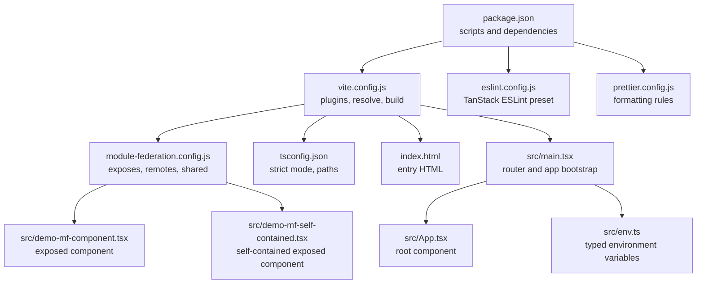
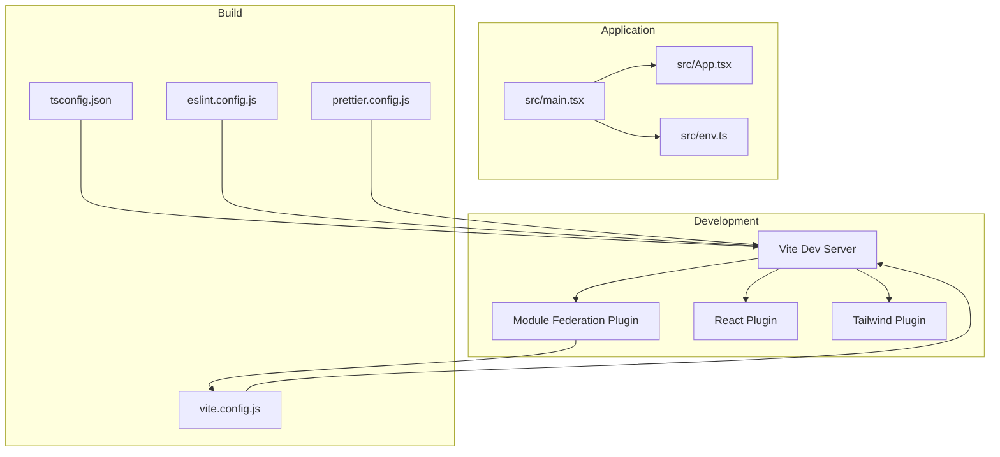
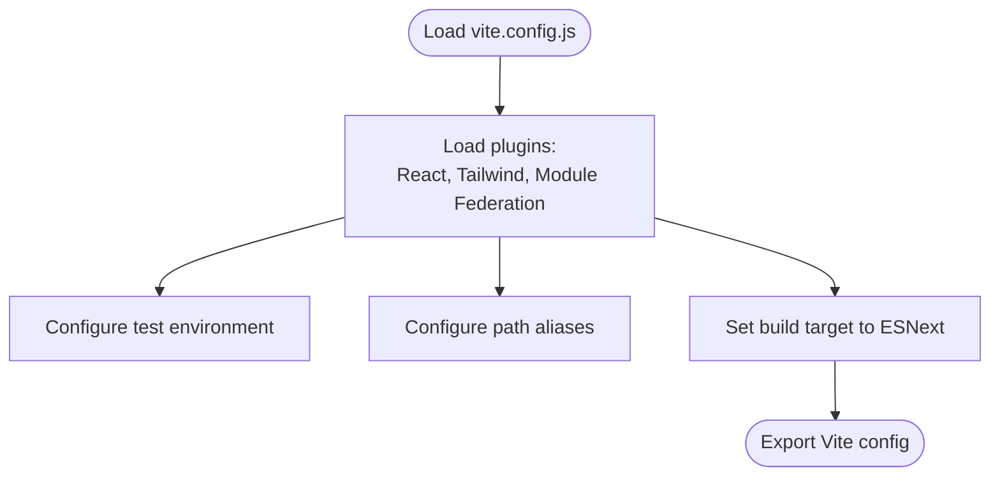
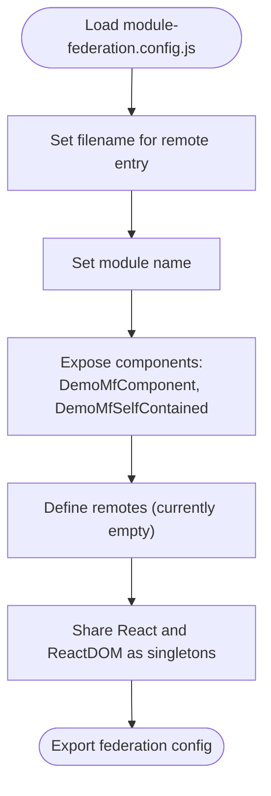
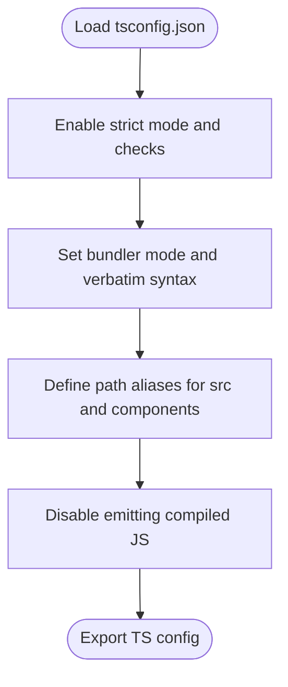
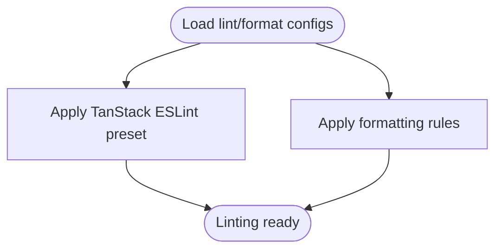
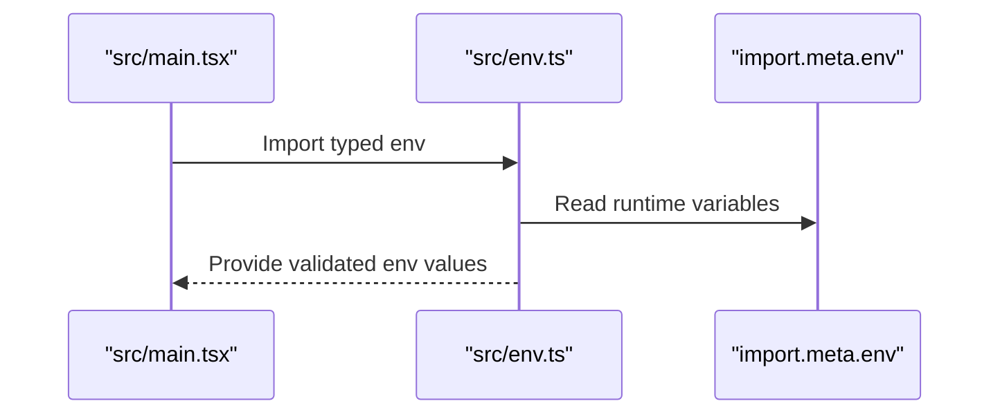
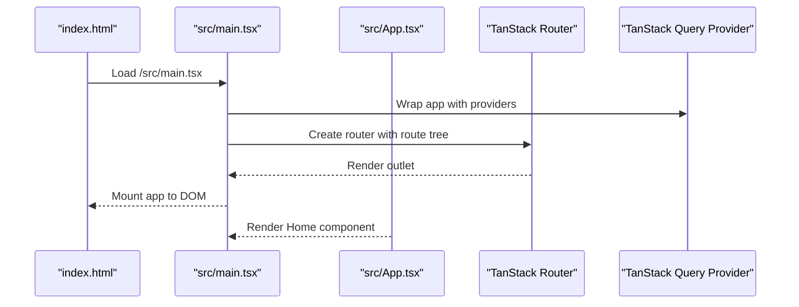
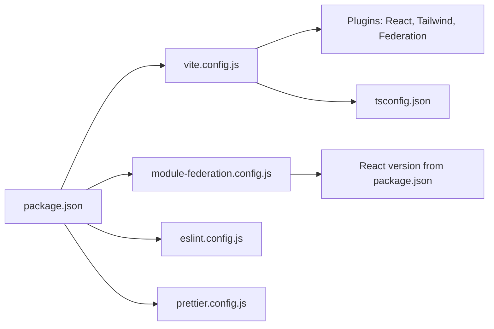

# Build Configuration

<cite>
**Referenced Files in This Document**
- [package.json](file://package.json)
- [vite.config.js](file://vite.config.js)
- [module-federation.config.js](file://module-federation.config.js)
- [tsconfig.json](file://tsconfig.json)
- [eslint.config.js](file://eslint.config.js)
- [prettier.config.js](file://prettier.config.js)
- [index.html](file://index.html)
- [src/main.tsx](file://src/main.tsx)
- [src/App.tsx](file://src/App.tsx)
- [src/env.ts](file://src/env.ts)
- [src/demo-mf-component.tsx](file://src/demo-mf-component.tsx)
- [src/demo-mf-self-contained.tsx](file://src/demo-mf-self-contained.tsx)
</cite>

## Table of Contents
1. [Introduction](#introduction)
2. [Project Structure](#project-structure)
3. [Core Components](#core-components)
4. [Architecture Overview](#architecture-overview)
5. [Detailed Component Analysis](#detailed-component-analysis)
6. [Dependency Analysis](#dependency-analysis)
7. [Performance Considerations](#performance-considerations)
8. [Troubleshooting Guide](#troubleshooting-guide)
9. [Conclusion](#conclusion)

## Introduction
This document explains the build configuration and development setup for the project. It covers Vite configuration, Module Federation setup, development server settings, build optimizations, TypeScript strict mode and path aliases, ESLint and Prettier configuration, micro-frontend communication via Module Federation, the build pipeline, environment variables, and troubleshooting guidance for common build issues.

## Project Structure
The project is a Vite-based React application with optional Module Federation capabilities and a modern TypeScript setup. Key configuration files and their roles:
- Vite configuration defines plugins, test environment, path aliases, and build targets.
- Module Federation configuration exposes components for remote consumption and shares React dependencies.
- TypeScript configuration enables strict mode and path aliases aligned with Vite’s resolve.alias.
- ESLint and Prettier provide code quality and formatting standards.
- Environment variables are validated using a typed environment helper.

**Diagram sources**
- [package.json:1-60](file://package.json#L1-L60)
- [vite.config.js:1-28](file://vite.config.js#L1-L28)
- [module-federation.config.js:1-32](file://module-federation.config.js#L1-L32)
- [tsconfig.json:1-29](file://tsconfig.json#L1-L29)
- [eslint.config.js:1-6](file://eslint.config.js#L1-L6)
- [prettier.config.js:1-11](file://prettier.config.js#L1-L11)
- [index.html:1-18](file://index.html#L1-L18)
- [src/main.tsx:1-89](file://src/main.tsx#L1-L89)
- [src/App.tsx:1-8](file://src/App.tsx#L1-L8)
- [src/env.ts:1-40](file://src/env.ts#L1-L40)
- [src/demo-mf-component.tsx:1-4](file://src/demo-mf-component.tsx#L1-L4)
- [src/demo-mf-self-contained.tsx:1-11](file://src/demo-mf-self-contained.tsx#L1-L11)

**Section sources**
- [package.json:1-60](file://package.json#L1-L60)
- [vite.config.js:1-28](file://vite.config.js#L1-L28)
- [module-federation.config.js:1-32](file://module-federation.config.js#L1-L32)
- [tsconfig.json:1-29](file://tsconfig.json#L1-L29)
- [eslint.config.js:1-6](file://eslint.config.js#L1-L6)
- [prettier.config.js:1-11](file://prettier.config.js#L1-L11)
- [index.html:1-18](file://index.html#L1-L18)
- [src/main.tsx:1-89](file://src/main.tsx#L1-L89)
- [src/App.tsx:1-8](file://src/App.tsx#L1-L8)
- [src/env.ts:1-40](file://src/env.ts#L1-L40)
- [src/demo-mf-component.tsx:1-4](file://src/demo-mf-component.tsx#L1-L4)
- [src/demo-mf-self-contained.tsx:1-11](file://src/demo-mf-self-contained.tsx#L1-L11)

## Core Components
- Vite configuration
  - Plugins: React Fast Refresh, Tailwind CSS integration, and Module Federation.
  - Test environment configured for DOM testing.
  - Path aliases for concise imports.
  - Build target set to ESNext for modern JavaScript features.
- Module Federation configuration
  - Exposes two components for remote consumption.
  - Shares React and ReactDOM as singletons with required versions.
  - Defines a remote entry filename and default share scope.
- TypeScript configuration
  - Strict mode enabled with comprehensive checks.
  - Path aliases mapped to the src directory and components subdirectory.
  - Bundler mode with verbatim module syntax and no emit.
- ESLint and Prettier
  - ESLint extends a TanStack-provided configuration.
  - Prettier configured with semicolon-less, single-quote, and trailing comma rules.
- Environment variables
  - Typed environment variables using a core validator with Zod.
  - Client variables prefixed with VITE_ enforced at type and runtime.

**Section sources**
- [vite.config.js:1-28](file://vite.config.js#L1-L28)
- [module-federation.config.js:1-32](file://module-federation.config.js#L1-L32)
- [tsconfig.json:1-29](file://tsconfig.json#L1-L29)
- [eslint.config.js:1-6](file://eslint.config.js#L1-L6)
- [prettier.config.js:1-11](file://prettier.config.js#L1-L11)
- [src/env.ts:1-40](file://src/env.ts#L1-L40)

## Architecture Overview
The build system integrates Vite, React, Tailwind CSS, and Module Federation. The development server supports hot reloading and remote component exposure. The production build targets modern browsers and emits optimized assets. Environment variables are validated and injected at build time.

**Diagram sources**
- [vite.config.js:1-28](file://vite.config.js#L1-L28)
- [module-federation.config.js:1-32](file://module-federation.config.js#L1-L32)
- [tsconfig.json:1-29](file://tsconfig.json#L1-L29)
- [eslint.config.js:1-6](file://eslint.config.js#L1-L6)
- [prettier.config.js:1-11](file://prettier.config.js#L1-L11)
- [src/main.tsx:1-89](file://src/main.tsx#L1-L89)
- [src/App.tsx:1-8](file://src/App.tsx#L1-L8)
- [src/env.ts:1-40](file://src/env.ts#L1-L40)

## Detailed Component Analysis

### Vite Configuration
Key behaviors:
- Plugins: React Fast Refresh, Tailwind CSS integration, and Module Federation using the external configuration file.
- Test configuration: Enables global mocks and jsdom environment for unit tests.
- Path aliases: Aliases for src and components enable shorter import paths.
- Build target: ESNext ensures modern JS features like top-level await are supported during development and build.

**Diagram sources**
- [vite.config.js:1-28](file://vite.config.js#L1-L28)

**Section sources**
- [vite.config.js:1-28](file://vite.config.js#L1-L28)

### Module Federation Configuration
Purpose and behavior:
- Exposes two components for consumption by remote hosts.
- Declares React and ReactDOM as shared singletons with required versions from package dependencies.
- Sets a remote entry filename and default share scope.
- Supports module-type entries and a global entry name for remotes.

**Diagram sources**
- [module-federation.config.js:1-32](file://module-federation.config.js#L1-L32)

**Section sources**
- [module-federation.config.js:1-32](file://module-federation.config.js#L1-L32)
- [src/demo-mf-component.tsx:1-4](file://src/demo-mf-component.tsx#L1-L4)
- [src/demo-mf-self-contained.tsx:1-11](file://src/demo-mf-self-contained.tsx#L1-L11)

### TypeScript Configuration
Highlights:
- Strict mode enabled with comprehensive checks (unused locals, unused parameters, fallthrough switches, unchecked side-effect imports).
- Bundler mode with verbatim module syntax and no emit to prevent extra compilation steps.
- Path aliases aligned with Vite’s resolve.alias for seamless IDE support and build-time resolution.

**Diagram sources**
- [tsconfig.json:1-29](file://tsconfig.json#L1-L29)

**Section sources**
- [tsconfig.json:1-29](file://tsconfig.json#L1-L29)

### ESLint and Prettier Configuration
- ESLint: Extends a TanStack ESLint preset for React and TypeScript best practices.
- Prettier: Enforces formatting rules consistently across the codebase.

**Diagram sources**
- [eslint.config.js:1-6](file://eslint.config.js#L1-L6)
- [prettier.config.js:1-11](file://prettier.config.js#L1-L11)

**Section sources**
- [eslint.config.js:1-6](file://eslint.config.js#L1-L6)
- [prettier.config.js:1-11](file://prettier.config.js#L1-L11)

### Environment Variables
- Typed environment variables using a core validator with Zod.
- Server-side variables and client-side variables prefixed with VITE_.
- Runtime environment bound to import.meta.env for Vite.

**Diagram sources**
- [src/main.tsx:1-89](file://src/main.tsx#L1-L89)
- [src/env.ts:1-40](file://src/env.ts#L1-L40)

**Section sources**
- [src/env.ts:1-40](file://src/env.ts#L1-L40)

### Build Pipeline and Entry Point
- Entry HTML loads the main script pointing to the TypeScript entry file.
- The main entry bootstraps routing, providers, and renders the app under Strict Mode.
- Scripts in package.json orchestrate dev, build, serve, test, lint, and format tasks.

**Diagram sources**
- [index.html:1-18](file://index.html#L1-L18)
- [src/main.tsx:1-89](file://src/main.tsx#L1-L89)
- [src/App.tsx:1-8](file://src/App.tsx#L1-L8)

**Section sources**
- [index.html:1-18](file://index.html#L1-L18)
- [src/main.tsx:1-89](file://src/main.tsx#L1-L89)
- [src/App.tsx:1-8](file://src/App.tsx#L1-L8)
- [package.json:5-14](file://package.json#L5-L14)

## Dependency Analysis
- Vite depends on plugins for React, Tailwind, and Module Federation.
- Module Federation configuration depends on package.json for React version pinning.
- TypeScript configuration aligns with Vite’s resolve.alias and bundler mode.
- ESLint and Prettier are integrated via npm scripts.

**Diagram sources**
- [package.json:1-60](file://package.json#L1-L60)
- [vite.config.js:1-28](file://vite.config.js#L1-L28)
- [module-federation.config.js:1-32](file://module-federation.config.js#L1-L32)
- [tsconfig.json:1-29](file://tsconfig.json#L1-L29)
- [eslint.config.js:1-6](file://eslint.config.js#L1-L6)
- [prettier.config.js:1-11](file://prettier.config.js#L1-L11)

**Section sources**
- [package.json:1-60](file://package.json#L1-L60)
- [vite.config.js:1-28](file://vite.config.js#L1-L28)
- [module-federation.config.js:1-32](file://module-federation.config.js#L1-L32)
- [tsconfig.json:1-29](file://tsconfig.json#L1-L29)
- [eslint.config.js:1-6](file://eslint.config.js#L1-L6)
- [prettier.config.js:1-11](file://prettier.config.js#L1-L11)

## Performance Considerations
- Target modern browsers by setting ESNext for both Vite and esbuild to leverage top-level await and other modern features.
- Keep shared dependencies minimal and pinned to a single version to reduce bundle duplication.
- Use path aliases to avoid deep relative imports and improve caching.
- Run lint and format checks in CI to maintain code quality and reduce build-time diffs.
- Prefer lazy loading and route-based code splitting via the router to optimize initial load.

## Troubleshooting Guide
Common issues and resolutions:
- Module Federation expose mismatches
  - Ensure the exposed component paths match the actual file locations and export names.
  - Verify that the remote entry filename matches the expected remote configuration.
  - Confirm that shared dependencies (React and ReactDOM) are declared as singletons and versions align with package.json.
- Path alias resolution errors
  - Align tsconfig.json path aliases with vite.config.js resolve.alias.
  - Restart the dev server after changing alias configurations.
- TypeScript strict mode failures
  - Address unused locals/parameters and fallthrough switch warnings.
  - Enable noUncheckedSideEffectImports to catch potential runtime issues.
- ESLint/Prettier conflicts
  - Run the combined check script to auto-fix formatting and lint issues.
  - Ensure editor integrations use the project’s ESLint and Prettier configs.
- Environment variable runtime errors
  - Prefix client variables with VITE_ as enforced by the typed env helper.
  - Use emptyStringAsUndefined to avoid type mismatches for empty environment values.

**Section sources**
- [module-federation.config.js:1-32](file://module-federation.config.js#L1-L32)
- [vite.config.js:15-20](file://vite.config.js#L15-L20)
- [tsconfig.json:17-26](file://tsconfig.json#L17-L26)
- [eslint.config.js:1-6](file://eslint.config.js#L1-L6)
- [prettier.config.js:1-11](file://prettier.config.js#L1-L11)
- [src/env.ts:13-39](file://src/env.ts#L13-L39)

## Conclusion
The project’s build configuration leverages Vite, React, Tailwind CSS, and Module Federation to deliver a modern, maintainable, and scalable frontend setup. TypeScript strict mode, ESLint, and Prettier ensure code quality, while typed environment variables provide safe runtime configuration. The Module Federation setup exposes components for remote consumption with shared React dependencies. Following the troubleshooting guidance helps resolve common build issues quickly.