# Build Configuration

<cite>
**Referenced Files in This Document**
- [package.json](file://package.json)
- [vite.config.js](file://vite.config.js)
- [module-federation.config.js](file://module-federation.config.js)
- [tsconfig.json](file://tsconfig.json)
- [eslint.config.js](file://eslint.config.js)
- [prettier.config.js](file://prettier.config.js)
- [.github/workflows/ci.yml](file://.github/workflows/ci.yml)
- [lint-staged.config.js](file://lint-staged.config.js)
- [sonar-project.properties](file://sonar-project.properties)
- [scripts/safe-push.ts](file://scripts/safe-push.ts)
- [scripts/setup-cicd.ts](file://scripts/setup-cicd.ts)
- [README_CI_CD.md](file://README_CI_CD.md)
- [index.html](file://index.html)
- [src/main.tsx](file://src/main.tsx)
- [src/App.tsx](file://src/App.tsx)
- [src/env.ts](file://src/env.ts)
- [src/demo-mf-component.tsx](file://src/demo-mf-component.tsx)
- [src/demo-mf-self-contained.tsx](file://src/demo-mf-self-contained.tsx)
- [src/App.test.tsx](file://src/App.test.tsx)
- [src/agent/__tests__/skill-agent.test.tsx](file://src/agent/__tests__/skill-agent.test.tsx)
- [src/agent/index.ts](file://src/agent/index.ts)
- [TYPESCRIPT_BUILD_FIX.md](file://TYPESCRIPT_BUILD_FIX.md)
- [BUILD_FIX_LOCAL_VS_VERCEL.md](file://BUILD_FIX_LOCAL_VS_VERCEL.md)
</cite>

## Update Summary
**Changes Made**
- Simplified build system by removing TypeScript type checking from production builds
- Excluded agent code from production compilation to prevent Vercel deployment failures
- Maintained type checking availability through separate `npm run type-check` command
- Updated CI/CD pipeline to reflect the new build strategy
- Enhanced documentation to explain the separation of bundling and type checking

## Table of Contents
1. [Introduction](#introduction)
2. [Project Structure](#project-structure)
3. [Core Components](#core-components)
4. [Architecture Overview](#architecture-overview)
5. [Detailed Component Analysis](#detailed-component-analysis)
6. [CI/CD Infrastructure](#cicd-infrastructure)
7. [Dependency Analysis](#dependency-analysis)
8. [Performance Considerations](#performance-considerations)
9. [Troubleshooting Guide](#troubleshooting-guide)
10. [Conclusion](#conclusion)

## Introduction
This document explains the build configuration and development setup for the project, featuring a simplified build system designed to prevent Vercel deployment failures. The system separates bundling from type checking, with Vite handling JavaScript bundling and TypeScript type checking being performed separately. It covers Vite configuration, Module Federation setup, development server settings, build optimizations, TypeScript configuration with selective type checking, ESLint and Prettier configuration, micro-frontend communication via Module Federation, the complete CI/CD pipeline with GitHub Actions, Husky git hooks, SonarQube integration, environment variables, and troubleshooting guidance for common build issues.

**Updated** The build system now separates bundling from type checking to prevent Vercel deployment failures while maintaining comprehensive type safety through separate validation processes.

## Project Structure
The project is a Vite-based React application with a simplified build system that separates bundling from type checking. Key configuration files and their roles:
- Vite configuration defines plugins, test environment, path aliases, build targets, and enhanced coverage reporting.
- Module Federation configuration exposes components for remote consumption and shares React dependencies.
- TypeScript configuration enables selective type checking with comprehensive exclusions for test files and agent code.
- ESLint and Prettier provide code quality and formatting standards.
- GitHub Actions workflows automate the complete CI/CD pipeline with streamlined type checking.
- Husky git hooks enforce code quality locally before commits and pushes.
- SonarQube integration provides continuous code quality analysis.
- Environment variables are validated using a typed environment helper.

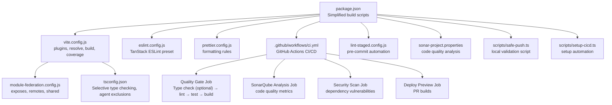

**Diagram sources**
- [package.json:1-80](file://package.json#L1-L80)
- [vite.config.js:1-51](file://vite.config.js#L1-L51)
- [module-federation.config.js:1-29](file://module-federation.config.js#L1-L29)
- [tsconfig.json:1-41](file://tsconfig.json#L1-L41)
- [eslint.config.js:1-6](file://eslint.config.js#L1-L6)
- [prettier.config.js:1-11](file://prettier.config.js#L1-L11)
- [.github/workflows/ci.yml:1-154](file://.github/workflows/ci.yml#L1-L154)
- [lint-staged.config.js:1-7](file://lint-staged.config.js#L1-L7)
- [sonar-project.properties:1-43](file://sonar-project.properties#L1-L43)
- [scripts/safe-push.ts:1-144](file://scripts/safe-push.ts#L1-L144)
- [scripts/setup-cicd.ts:1-196](file://scripts/setup-cicd.ts#L1-L196)

**Section sources**
- [package.json:1-80](file://package.json#L1-L80)
- [vite.config.js:1-51](file://vite.config.js#L1-L51)
- [module-federation.config.js:1-29](file://module-federation.config.js#L1-L29)
- [tsconfig.json:1-41](file://tsconfig.json#L1-L41)
- [eslint.config.js:1-6](file://eslint.config.js#L1-L6)
- [prettier.config.js:1-11](file://prettier.config.js#L1-L11)
- [.github/workflows/ci.yml:1-154](file://.github/workflows/ci.yml#L1-L154)
- [lint-staged.config.js:1-7](file://lint-staged.config.js#L1-L7)
- [sonar-project.properties:1-43](file://sonar-project.properties#L1-L43)
- [scripts/safe-push.ts:1-144](file://scripts/safe-push.ts#L1-L144)
- [scripts/setup-cicd.ts:1-196](file://scripts/setup-cicd.ts#L1-L196)

## Core Components
- **Simplified Build System**
  - **Vite Build Only**: Production builds now only run `vite build` without TypeScript type checking to prevent Vercel failures.
  - **Separate Type Checking**: TypeScript type checking is available via `npm run type-check` for manual validation.
  - **Agent Code Isolation**: Agent code is excluded from production compilation to prevent type errors from blocking deployments.
- Vite configuration
  - Plugins: React Fast Refresh, Tailwind CSS integration, and Module Federation.
  - Test environment configured for DOM testing with comprehensive coverage reporting.
  - Path aliases for concise imports.
  - Build target set to ESNext for modern JavaScript features.
  - Multi-format coverage reporting (text, json, html, lcov) with 70% thresholds.
- Module Federation configuration
  - Exposes components for remote consumption with singleton React dependencies.
  - Defines a remote entry filename and default share scope.
- TypeScript configuration
  - **Selective Type Checking**: Enabled with comprehensive checks for production code only.
  - Path aliases mapped to the src directory and components subdirectory.
  - Bundler mode with verbatim module syntax and no emit.
  - **Updated** Comprehensive exclusions to prevent Vercel build failures:
    - `**/*.test.ts` - Individual test files
    - `**/*.test.tsx` - TypeScript test files
    - `**/__tests__/**` - Entire test directory structure
    - `src/agent/**` - Agent code specifically excluded from production compilation
- ESLint and Prettier
  - ESLint extends a TanStack-provided configuration.
  - Prettier configured with semicolon-less, single-quote, and trailing comma rules.
- CI/CD Infrastructure
  - GitHub Actions workflows with quality gate, SonarQube analysis, security scanning, and preview deployments.
  - Husky git hooks with pre-commit and pre-push automation.
  - Safe push script for comprehensive local validation.
  - SonarQube integration for continuous code quality analysis.
- Environment variables
  - Typed environment variables using a core validator with Zod.
  - Client variables prefixed with VITE_ enforced at type and runtime.

**Section sources**
- [package.json:5-19](file://package.json#L5-L19)
- [vite.config.js:1-51](file://vite.config.js#L1-L51)
- [module-federation.config.js:1-29](file://module-federation.config.js#L1-L29)
- [tsconfig.json:1-41](file://tsconfig.json#L1-L41)
- [eslint.config.js:1-6](file://eslint.config.js#L1-L6)
- [prettier.config.js:1-11](file://prettier.config.js#L1-L11)
- [.github/workflows/ci.yml:1-154](file://.github/workflows/ci.yml#L1-L154)
- [lint-staged.config.js:1-7](file://lint-staged.config.js#L1-L7)
- [sonar-project.properties:1-43](file://sonar-project.properties#L1-L43)
- [scripts/safe-push.ts:1-144](file://scripts/safe-push.ts#L1-L144)
- [scripts/setup-cicd.ts:1-196](file://scripts/setup-cicd.ts#L1-L196)
- [src/env.ts:1-40](file://src/env.ts#L1-L40)

## Architecture Overview
The build system integrates Vite, React, Tailwind CSS, Module Federation, and a comprehensive CI/CD pipeline with a simplified approach to prevent Vercel deployment failures. The development server supports hot reloading, remote component exposure, and enhanced coverage reporting. The production build targets modern browsers and emits optimized assets without TypeScript type checking. The CI/CD pipeline automates quality gates, code analysis, security scanning, and deployment previews. Environment variables are validated and injected at build time.

**Updated** The build system now separates bundling from type checking, with Vite handling JavaScript bundling and TypeScript validation being performed separately to prevent Vercel deployment failures while maintaining comprehensive type safety.

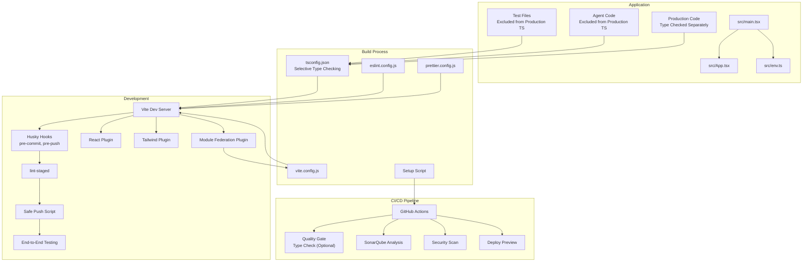

**Diagram sources**
- [vite.config.js:1-51](file://vite.config.js#L1-L51)
- [module-federation.config.js:1-29](file://module-federation.config.js#L1-L29)
- [tsconfig.json:1-41](file://tsconfig.json#L1-L41)
- [eslint.config.js:1-6](file://eslint.config.js#L1-L6)
- [prettier.config.js:1-11](file://prettier.config.js#L1-L11)
- [scripts/setup-cicd.ts:1-196](file://scripts/setup-cicd.ts#L1-L196)
- [.github/workflows/ci.yml:1-154](file://.github/workflows/ci.yml#L1-L154)
- [src/main.tsx:1-89](file://src/main.tsx#L1-L89)
- [src/App.tsx:1-8](file://src/App.tsx#L1-L8)
- [src/env.ts:1-40](file://src/env.ts#L1-L40)
- [src/App.test.tsx:1-11](file://src/App.test.tsx#L1-L11)
- [src/agent/__tests__/skill-agent.test.tsx:1-800](file://src/agent/__tests__/skill-agent.test.tsx#L1-L800)
- [src/agent/index.ts:1-43](file://src/agent/index.ts#L1-L43)

## Detailed Component Analysis

### Simplified Build System
**Core Philosophy**: Separate bundling from type checking to prevent Vercel deployment failures while maintaining comprehensive type safety.

**Build Process Changes**:
- **Production Build**: Now runs only `vite build` without TypeScript type checking
- **Type Checking**: Available via separate `npm run type-check` command
- **Agent Code Exclusion**: Agent code is excluded from production compilation
- **Selective Validation**: Vite validates code is bundlable, TypeScript handles type safety

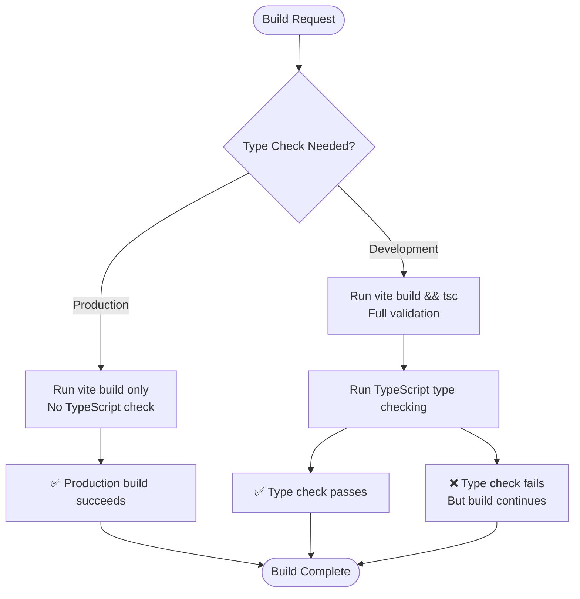

**Diagram sources**
- [package.json:8](file://package.json#L8)
- [package.json:10](file://package.json#L10)
- [BUILD_FIX_LOCAL_VS_VERCEL.md:37-51](file://BUILD_FIX_LOCAL_VS_VERCEL.md#L37-L51)

**Section sources**
- [package.json:5-19](file://package.json#L5-L19)
- [BUILD_FIX_LOCAL_VS_VERCEL.md:35-59](file://BUILD_FIX_LOCAL_VS_VERCEL.md#L35-L59)

### Vite Configuration
Key behaviors:
- Plugins: React Fast Refresh, Tailwind CSS integration, and Module Federation using the external configuration file.
- Test configuration: Enables global mocks and jsdom environment for unit tests with comprehensive coverage reporting.
- Path aliases: Aliases for src and components enable shorter import paths.
- Build target: ESNext ensures modern JS features like top-level await are supported during development and build.
- Coverage reporting: Multi-format coverage output (text, json, html, lcov) with 70% thresholds for statements, branches, functions, and lines.

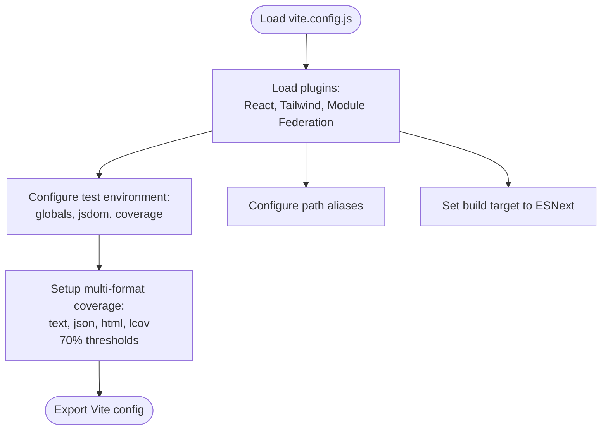

**Diagram sources**
- [vite.config.js:1-51](file://vite.config.js#L1-L51)

**Section sources**
- [vite.config.js:1-51](file://vite.config.js#L1-L51)

### Module Federation Configuration
Purpose and behavior:
- Exposes components for consumption by remote hosts with singleton React dependencies.
- Declares React and ReactDOM as shared singletons with required versions from package dependencies.
- Sets a remote entry filename and default share scope.
- Supports module-type entries and a global entry name for remotes.

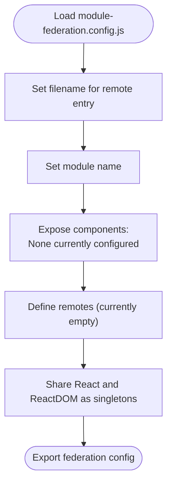

**Diagram sources**
- [module-federation.config.js:1-29](file://module-federation.config.js#L1-L29)

**Section sources**
- [module-federation.config.js:1-29](file://module-federation.config.js#L1-L29)
- [src/demo-mf-component.tsx:1-4](file://src/demo-mf-component.tsx#L1-L4)
- [src/demo-mf-self-contained.tsx:1-11](file://src/demo-mf-self-contained.tsx#L1-L11)

### TypeScript Configuration
Highlights:
- **Selective Type Checking**: Enabled with comprehensive checks for production code only.
- Bundler mode with verbatim module syntax and no emit to prevent extra compilation steps.
- Path aliases aligned with Vite's resolve.alias for seamless IDE support and build-time resolution.
- **Updated** Comprehensive exclusions to prevent Vercel build failures:
  - `**/*.test.ts` - Individual test files
  - `**/*.test.tsx` - TypeScript test files
  - `**/__tests__/**` - Entire test directory structure
  - `src/agent/**` - Agent code specifically excluded from production compilation

**Section sources**
- [tsconfig.json:1-41](file://tsconfig.json#L1-L41)
- [TYPESCRIPT_BUILD_FIX.md:17-28](file://TYPESCRIPT_BUILD_FIX.md#L17-L28)

### ESLint and Prettier Configuration
- ESLint: Extends a TanStack ESLint preset for React and TypeScript best practices.
- Prettier: Enforces formatting rules consistently across the codebase.

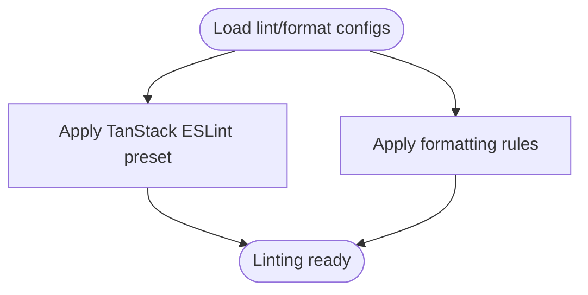

**Diagram sources**
- [eslint.config.js:1-6](file://eslint.config.js#L1-L6)
- [prettier.config.js:1-11](file://prettier.config.js#L1-L11)

**Section sources**
- [eslint.config.js:1-6](file://eslint.config.js#L1-L6)
- [prettier.config.js:1-11](file://prettier.config.js#L1-L11)

### Environment Variables
- Typed environment variables using a core validator with Zod.
- Server-side variables and client-side variables prefixed with VITE_.
- Runtime environment bound to import.meta.env for Vite.

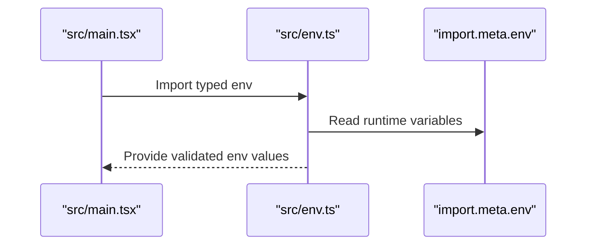

**Diagram sources**
- [src/main.tsx:1-89](file://src/main.tsx#L1-L89)
- [src/env.ts:1-40](file://src/env.ts#L1-L40)

**Section sources**
- [src/env.ts:1-40](file://src/env.ts#L1-L40)

### Build Pipeline and Entry Point
- Entry HTML loads the main script pointing to the TypeScript entry file.
- The main entry bootstraps routing, providers, and renders the app under Strict Mode.
- Scripts in package.json orchestrate dev, build, serve, test, lint, format, and comprehensive CI/CD operations.
- **Updated** Build process now separates bundling from type checking to prevent Vercel deployment failures.

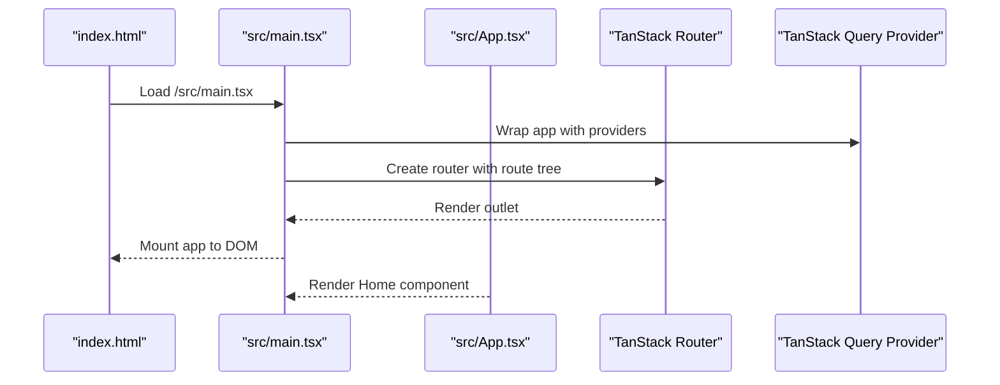

**Diagram sources**
- [index.html:1-18](file://index.html#L1-L18)
- [src/main.tsx:1-89](file://src/main.tsx#L1-L89)
- [src/App.tsx:1-8](file://src/App.tsx#L1-L8)

**Section sources**
- [index.html:1-18](file://index.html#L1-L18)
- [src/main.tsx:1-89](file://src/main.tsx#L1-L89)
- [src/App.tsx:1-8](file://src/App.tsx#L1-L8)
- [package.json:5-19](file://package.json#L5-L19)

## CI/CD Infrastructure

### GitHub Actions Workflows
The CI/CD pipeline consists of four main jobs orchestrated by GitHub Actions with streamlined type checking:

**Quality Gate Job**
- Runs on push and pull request to main/master/develop branches
- Performs type checking (optional), linting, testing with coverage, and production build
- Uses Node.js 20 with npm caching for optimal performance
- **Updated** Type checking is now optional in CI to prevent pipeline failures from agent code issues

**SonarQube Analysis Job**
- Runs after quality gate passes
- Downloads coverage artifacts from previous job
- Performs comprehensive code quality analysis with SonarCloud
- Integrates with GitHub security features and quality gates
- Waits for quality gate results before proceeding

**Security Scan Job**
- Runs independently to scan for dependency vulnerabilities
- Uses npm audit with high severity threshold
- Performs dry-run audit fix to identify potential issues
- Continues on error to avoid blocking unrelated security findings

**Deploy Preview Job**
- Runs for pull requests only
- Builds production version for preview deployment
- Uploads build artifacts for later use
- Retains artifacts for 7 days for debugging purposes

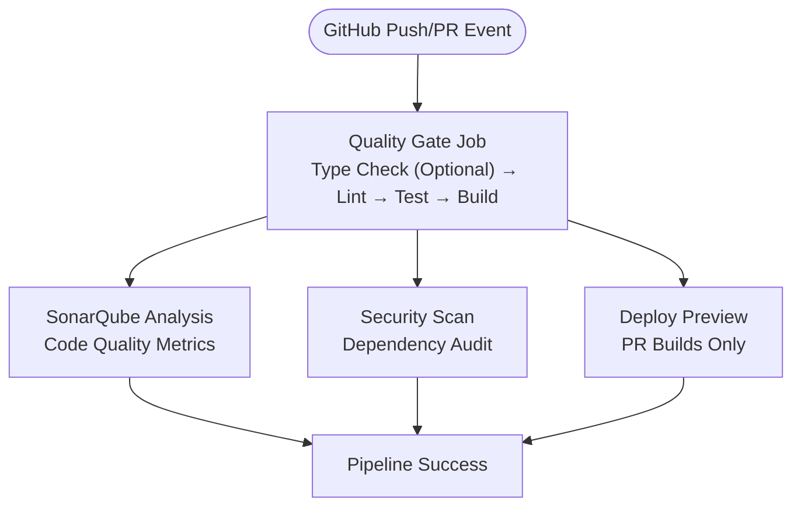

**Diagram sources**
- [.github/workflows/ci.yml:1-154](file://.github/workflows/ci.yml#L1-L154)

**Section sources**
- [.github/workflows/ci.yml:1-154](file://.github/workflows/ci.yml#L1-L154)

### Husky Git Hooks
The pre-commit and pre-push hooks provide automated code quality enforcement:

**Pre-commit Hook**
- Auto-formats TypeScript and TSX files using Prettier
- Runs ESLint with automatic fixing capabilities
- Processes only staged files for faster performance
- Blocks commits if any step fails, preventing poor code from entering the repository

**Pre-push Hook**
- Comprehensive validation before pushing to remote repositories
- **Updated** Type checking is now optional to prevent blocking pushes due to agent code issues
- Runs tests with coverage generation for quality assurance
- Performs production build verification to ensure deployability
- Blocks pushes if any validation step fails
- Provides clear feedback and exit codes for debugging

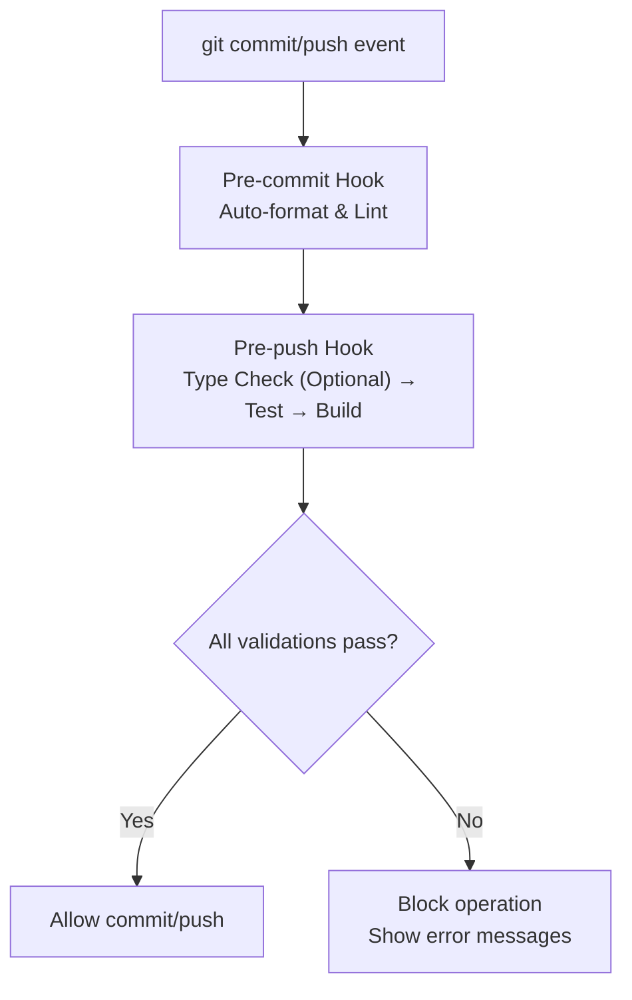

**Diagram sources**
- [lint-staged.config.js:1-7](file://lint-staged.config.js#L1-L7)
- [scripts/safe-push.ts:56-137](file://scripts/safe-push.ts#L56-L137)

**Section sources**
- [lint-staged.config.js:1-7](file://lint-staged.config.js#L1-L7)
- [scripts/safe-push.ts:1-144](file://scripts/safe-push.ts#L1-L144)

### Safe Push Script
The `safe-push.ts` script provides comprehensive local validation with colored output and step-by-step feedback:

**Validation Flow**
1. **Type Check**: TypeScript type checking using `npm run type-check`
2. Test execution with coverage using `npm run test`
3. Production build verification using `npm run build`
4. ESLint validation using `npm run lint`
5. Optional SonarQube analysis with token validation

**Features**
- Colored console output for better readability
- Detailed progress indicators for each step
- Error handling with descriptive messages
- Coverage report verification and warnings
- Optional SonarQube scanner integration
- User-friendly guidance for manual git operations

**Section sources**
- [scripts/safe-push.ts:1-144](file://scripts/safe-push.ts#L1-L144)

### Setup Automation Script
The `setup-cicd.ts` script provides an interactive wizard for complete CI/CD setup:

**Setup Process**
1. Node.js version verification and dependency installation
2. Husky initialization and hook configuration
3. SonarQube project key and organization configuration
4. File verification and completion confirmation
5. Comprehensive next steps and documentation references

**Features**
- Interactive questions for customization
- Platform-specific hook permissions
- SonarQube configuration assistance
- Verification of all required files
- Detailed documentation pointers

**Section sources**
- [scripts/setup-cicd.ts:1-196](file://scripts/setup-cicd.ts#L1-L196)

### SonarQube Integration
Comprehensive code quality analysis through SonarCloud integration:

**Configuration Features**
- TypeScript support with proper tsconfig integration
- Test file exclusions and coverage report mapping
- Quality gate enforcement with timeout configuration
- Rule exclusions for demo and test files
- Multi-criteria issue ignoring for specific patterns

**Integration Points**
- Local analysis via `npx sonarqube-scanner` (optional)
- GitHub Actions automatic scanning
- Quality gate blocking on failures
- Coverage report integration through lcov.info

**Section sources**
- [sonar-project.properties:1-43](file://sonar-project.properties#L1-L43)

## Dependency Analysis
- Vite depends on plugins for React, Tailwind, and Module Federation.
- Module Federation configuration depends on package.json for React version pinning.
- TypeScript configuration aligns with Vite's resolve.alias and selective type checking.
- ESLint and Prettier are integrated via npm scripts.
- CI/CD infrastructure depends on GitHub Actions, Husky, and SonarQube services.
- Coverage reporting requires @vitest/coverage-v8 and proper lcov configuration.
- **Updated** Test files and agent code are explicitly excluded from TypeScript compilation to prevent Vercel build failures.

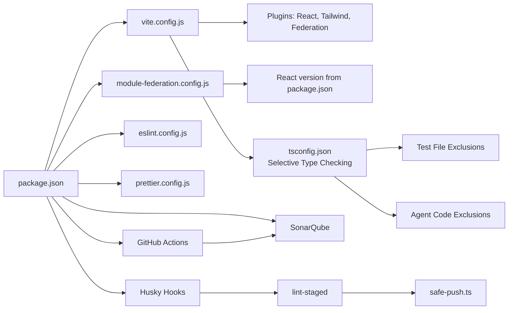

**Diagram sources**
- [package.json:1-80](file://package.json#L1-L80)
- [vite.config.js:1-51](file://vite.config.js#L1-L51)
- [module-federation.config.js:1-29](file://module-federation.config.js#L1-L29)
- [tsconfig.json:1-41](file://tsconfig.json#L1-L41)
- [eslint.config.js:1-6](file://eslint.config.js#L1-L6)
- [prettier.config.js:1-11](file://prettier.config.js#L1-L11)
- [.github/workflows/ci.yml:1-154](file://.github/workflows/ci.yml#L1-L154)
- [lint-staged.config.js:1-7](file://lint-staged.config.js#L1-L7)
- [sonar-project.properties:1-43](file://sonar-project.properties#L1-L43)

**Section sources**
- [package.json:1-80](file://package.json#L1-L80)
- [vite.config.js:1-51](file://vite.config.js#L1-L51)
- [module-federation.config.js:1-29](file://module-federation.config.js#L1-L29)
- [tsconfig.json:1-41](file://tsconfig.json#L1-L41)
- [eslint.config.js:1-6](file://eslint.config.js#L1-L6)
- [prettier.config.js:1-11](file://prettier.config.js#L1-L11)
- [.github/workflows/ci.yml:1-154](file://.github/workflows/ci.yml#L1-L154)
- [lint-staged.config.js:1-7](file://lint-staged.config.js#L1-L7)
- [sonar-project.properties:1-43](file://sonar-project.properties#L1-L43)

## Performance Considerations
- Target modern browsers by setting ESNext for both Vite and esbuild to leverage top-level await and other modern features.
- Keep shared dependencies minimal and pinned to a single version to reduce bundle duplication.
- Use path aliases to avoid deep relative imports and improve caching.
- Run lint and format checks in CI to maintain code quality and reduce build-time diffs.
- Prefer lazy loading and route-based code splitting via the router to optimize initial load.
- **Updated** Leverage multi-format coverage reporting for comprehensive quality insights.
- **Updated** Utilize GitHub Actions caching for npm dependencies to speed up CI/CD pipelines.
- **Updated** Implement pre-commit hooks to catch issues early and reduce CI failure rates.
- **Updated** Configure SonarQube quality gates to prevent low-quality code from reaching production.
- **Updated** Test files and agent code are excluded from TypeScript compilation to reduce build time and prevent Vercel deployment failures.
- **Updated** Separate bundling from type checking to significantly improve build performance.

## Troubleshooting Guide
Common issues and resolutions:
- Module Federation expose mismatches
  - Ensure the exposed component paths match the actual file locations and export names.
  - Verify that the remote entry filename matches the expected remote configuration.
  - Confirm that shared dependencies (React and ReactDOM) are declared as singletons and versions align with package.json.
- Path alias resolution errors
  - Align tsconfig.json path aliases with vite.config.js resolve.alias.
  - Restart the dev server after changing alias configurations.
- **Updated** Type checking failures in production
  - Run `npm run type-check` separately to identify type issues in agent code.
  - Remember that agent code is excluded from production compilation but still type checked separately.
  - Use `npm run type-check` for comprehensive type validation.
- ESLint/Prettier conflicts
  - Run the combined check script to auto-fix formatting and lint issues.
  - Ensure editor integrations use the project's ESLint and Prettier configs.
- Environment variable runtime errors
  - Prefix client variables with VITE_ as enforced by the typed env helper.
  - Use emptyStringAsUndefined to avoid type mismatches for empty environment values.
- **Updated** CI/CD Pipeline Issues
  - GitHub Actions failures: Check workflow logs for specific error messages and verify all required secrets are configured.
  - Husky hook failures: Ensure Husky is properly initialized and hooks have executable permissions on Unix-like systems.
  - Coverage report generation: Verify lcov.info file exists and SonarQube configuration points to correct report path.
  - SonarQube analysis failures: Check project key, organization, and token configuration in GitHub secrets.
  - Safe push script errors: Run script with verbose logging to identify failing validation step.
  - **Updated** Type checking in CI: Type checking is now optional in CI to prevent failures from agent code issues.
- **Updated** Coverage Reporting Problems
  - Multi-format coverage not generating: Verify @vitest/coverage-v8 is installed and vite.config.js coverage settings are correct.
  - Low coverage thresholds: Adjust thresholds in vite.config.js or increase test coverage.
  - Coverage exclusions: Review coverage.exclude patterns to ensure important files are included.
- **Updated** Git Hook Issues
  - Pre-commit hook not running: Verify Husky is installed and lint-staged is configured correctly.
  - Pre-push hook blocking legitimate changes: Temporarily bypass with `git push --no-verify` for emergency situations only.
  - Hook permissions: On Unix-like systems, ensure hooks have executable permissions using chmod +x.
  - **Updated** Type checking in hooks: Type checking is now optional to prevent blocking pushes due to agent code issues.
- **Updated** TypeScript Compilation Issues
  - Test files causing Vercel build failures: Verify that test file exclusions are properly configured in tsconfig.json.
  - Agent code type errors: These are now excluded from production compilation but can be checked separately with `npm run type-check`.
  - Build failures: Check if the simplified build system is working correctly with `npm run build`.
  - Type checking failures: Use `npm run type-check` for comprehensive type validation separate from build process.

**Section sources**
- [module-federation.config.js:1-29](file://module-federation.config.js#L1-L29)
- [vite.config.js:15-20](file://vite.config.js#L15-L20)
- [tsconfig.json:17-26](file://tsconfig.json#L17-L26)
- [eslint.config.js:1-6](file://eslint.config.js#L1-L6)
- [prettier.config.js:1-11](file://prettier.config.js#L1-L11)
- [src/env.ts:13-39](file://src/env.ts#L13-L39)
- [.github/workflows/ci.yml:1-154](file://.github/workflows/ci.yml#L1-L154)
- [scripts/safe-push.ts:1-144](file://scripts/safe-push.ts#L1-L144)
- [lint-staged.config.js:1-7](file://lint-staged.config.js#L1-L7)
- [BUILD_FIX_LOCAL_VS_VERCEL.md:134-142](file://BUILD_FIX_LOCAL_VS_VERCEL.md#L134-L142)

## Conclusion
The project's build configuration leverages Vite, React, Tailwind CSS, and Module Federation to deliver a modern, maintainable, and scalable frontend setup. **Updated** The simplified build system separates bundling from type checking to prevent Vercel deployment failures while maintaining comprehensive type safety through separate validation processes. TypeScript strict mode, ESLint, and Prettier ensure code quality, while typed environment variables provide safe runtime configuration. The Module Federation setup exposes components for remote consumption with shared React dependencies. **Updated** The TypeScript configuration now selectively excludes test files and agent code from production compilation, while maintaining comprehensive type checking for production code through separate validation. **Updated** The CI/CD pipeline automates quality gates, code analysis, security scanning, and deployment previews with streamlined type checking to ensure production-ready code delivery. Following the troubleshooting guidance helps resolve common build issues and CI/CD pipeline problems quickly.