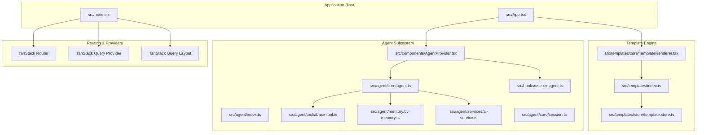
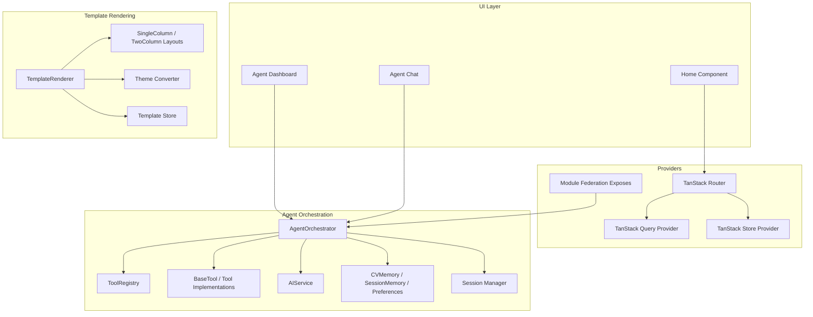
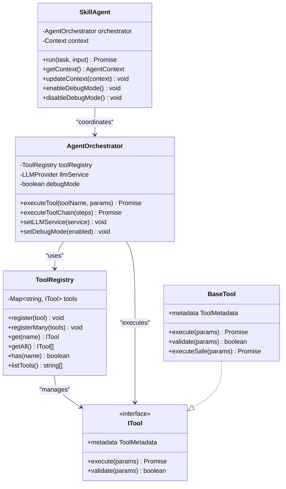
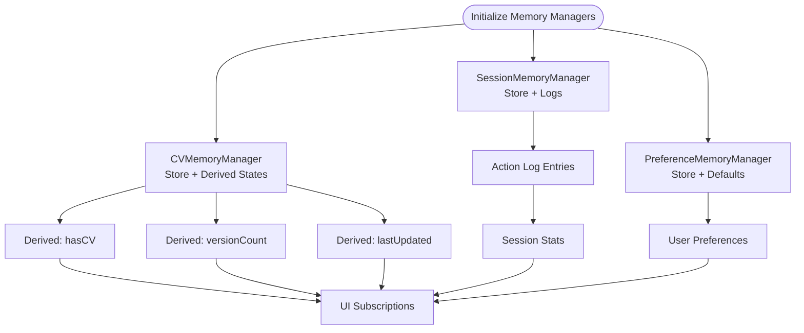
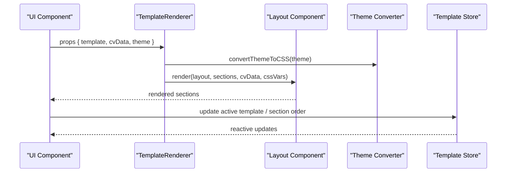
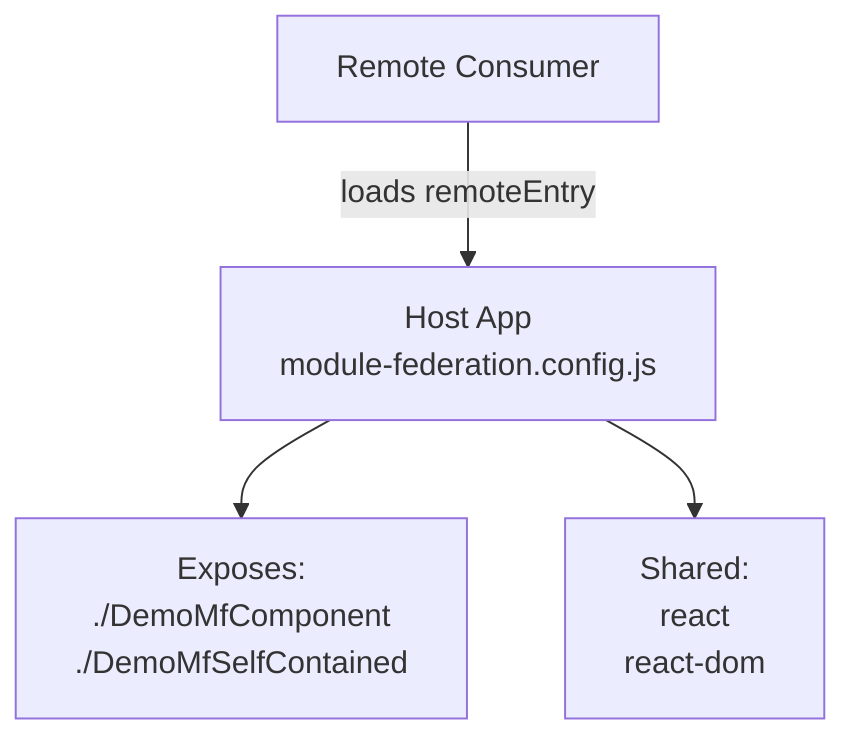
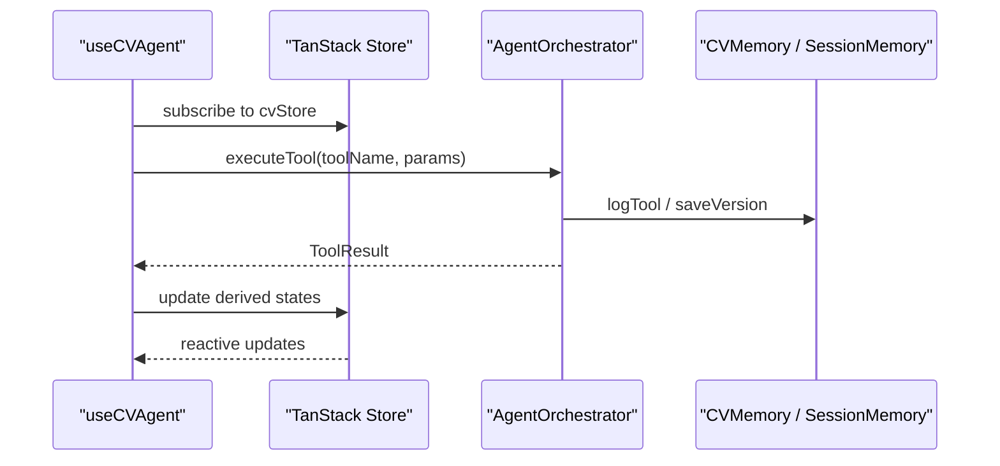
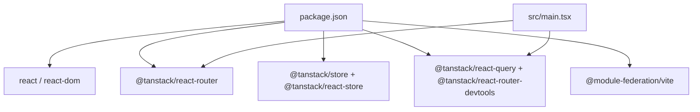

# Core Architecture

<cite>
**Referenced Files in This Document**
- [README.md](file://README.md)
- [package.json](file://package.json)
- [module-federation.config.js](file://module-federation.config.js)
- [src/main.tsx](file://src/main.tsx)
- [src/App.tsx](file://src/App.tsx)
- [src/agent/index.ts](file://src/agent/index.ts)
- [src/agent/core/agent.ts](file://src/agent/core/agent.ts)
- [src/agent/tools/base-tool.ts](file://src/agent/tools/base-tool.ts)
- [src/agent/memory/cv-memory.ts](file://src/agent/memory/cv-memory.ts)
- [src/agent/services/ai-service.ts](file://src/agent/services/ai-service.ts)
- [src/agent/core/session.ts](file://src/agent/core/session.ts)
- [src/components/AgentProvider.tsx](file://src/components/AgentProvider.tsx)
- [src/hooks/use-cv-agent.ts](file://src/hooks/use-cv-agent.ts)
- [src/templates/index.ts](file://src/templates/index.ts)
- [src/templates/core/TemplateRenderer.tsx](file://src/templates/core/TemplateRenderer.tsx)
- [src/templates/store/template.store.ts](file://src/templates/store/template.store.ts)
- [src/integrations/tanstack-query/root-provider.tsx](file://src/integrations/tanstack-query/root-provider.tsx)
- [src/integrations/tanstack-query/layout.tsx](file://src/integrations/tanstack-query/layout.tsx)
</cite>

## Table of Contents
1. [Introduction](#introduction)
2. [Project Structure](#project-structure)
3. [Core Components](#core-components)
4. [Architecture Overview](#architecture-overview)
5. [Detailed Component Analysis](#detailed-component-analysis)
6. [Dependency Analysis](#dependency-analysis)
7. [Performance Considerations](#performance-considerations)
8. [Troubleshooting Guide](#troubleshooting-guide)
9. [Conclusion](#conclusion)
10. [Appendices](#appendices)

## Introduction
This document describes the core system design of the CV Portfolio Builder, focusing on the integration of React 19, the TanStack ecosystem, and an AI agent system. The platform is organized as a modular application composed of:
- An AI agent subsystem with a tool registry and orchestrator
- A memory and session management layer
- A template engine for rendering CVs with themes and layouts
- UI components and providers leveraging TanStack Router, TanStack Store, and TanStack Query
- A micro-frontend boundary using Module Federation

The system emphasizes reactive state management, a tool-centric agent architecture inspired by MCP (Model Context Protocol) concepts, and clean separation of concerns across subsystems.

## Project Structure
The project follows a feature-based, layered organization:
- src/main.tsx sets up TanStack Router, integrates TanStack Query providers, and mounts the root application.
- src/agent contains the AI agent system, tools, memory, and services.
- src/templates contains the template engine, layouts, sections, themes, and stores.
- src/components provides UI components and higher-order providers.
- src/hooks exposes hooks for agent and session access.
- src/integrations/tanstack-query integrates TanStack Query providers and layout.
- module-federation.config.js defines Module Federation boundaries and shared dependencies.

**Diagram sources**
- [src/main.tsx:1-89](file://src/main.tsx#L1-L89)
- [src/App.tsx:1-8](file://src/App.tsx#L1-L8)
- [src/agent/index.ts:1-24](file://src/agent/index.ts#L1-L24)
- [src/agent/core/agent.ts:1-414](file://src/agent/core/agent.ts#L1-L414)
- [src/agent/tools/base-tool.ts:1-72](file://src/agent/tools/base-tool.ts#L1-L72)
- [src/agent/memory/cv-memory.ts:1-291](file://src/agent/memory/cv-memory.ts#L1-L291)
- [src/agent/services/ai-service.ts:1-174](file://src/agent/services/ai-service.ts#L1-L174)
- [src/agent/core/session.ts](file://src/agent/core/session.ts)
- [src/components/AgentProvider.tsx:1-30](file://src/components/AgentProvider.tsx#L1-L30)
- [src/hooks/use-cv-agent.ts:1-185](file://src/hooks/use-cv-agent.ts#L1-L185)
- [src/templates/index.ts:1-44](file://src/templates/index.ts#L1-L44)
- [src/templates/core/TemplateRenderer.tsx:1-74](file://src/templates/core/TemplateRenderer.tsx#L1-L74)
- [src/templates/store/template.store.ts:1-103](file://src/templates/store/template.store.ts#L1-L103)

**Section sources**
- [README.md:500-543](file://README.md#L500-L543)
- [package.json:15-44](file://package.json#L15-L44)
- [src/main.tsx:29-83](file://src/main.tsx#L29-L83)

## Core Components
- Agent subsystem: Provides a ToolRegistry, AgentOrchestrator, SkillAgent, and AI service abstraction. Tools implement a common interface and can be validated and executed safely. Memory managers track CV versions, session logs, and user preferences. A session manager tracks activity and statistics.
- Template engine: Renders CVs using layouts and themes, with a registry and stores for active templates and customization state.
- UI and providers: TanStack Router for routing, TanStack Store for reactive state, TanStack Query for data fetching, and Module Federation for micro-frontend boundaries.

**Section sources**
- [src/agent/core/agent.ts:11-168](file://src/agent/core/agent.ts#L11-L168)
- [src/agent/tools/base-tool.ts:6-49](file://src/agent/tools/base-tool.ts#L6-L49)
- [src/agent/memory/cv-memory.ts:20-149](file://src/agent/memory/cv-memory.ts#L20-L149)
- [src/agent/services/ai-service.ts:77-126](file://src/agent/services/ai-service.ts#L77-L126)
- [src/templates/core/TemplateRenderer.tsx:13-53](file://src/templates/core/TemplateRenderer.tsx#L13-L53)
- [src/templates/store/template.store.ts:19-98](file://src/templates/store/template.store.ts#L19-L98)

## Architecture Overview
The system architecture combines:
- Reactive state management via TanStack Store for agent memory and template customization
- Routing and navigation via TanStack Router
- Data fetching and caching via TanStack Query
- Micro-frontend boundaries via Module Federation
- An MCP-inspired tool architecture for the agent subsystem

**Diagram sources**
- [src/main.tsx:29-83](file://src/main.tsx#L29-L83)
- [src/agent/core/agent.ts:60-168](file://src/agent/core/agent.ts#L60-L168)
- [src/agent/tools/base-tool.ts:15-49](file://src/agent/tools/base-tool.ts#L15-L49)
- [src/agent/services/ai-service.ts:77-126](file://src/agent/services/ai-service.ts#L77-L126)
- [src/agent/memory/cv-memory.ts:20-149](file://src/agent/memory/cv-memory.ts#L20-L149)
- [src/agent/core/session.ts](file://src/agent/core/session.ts)
- [src/templates/core/TemplateRenderer.tsx:13-53](file://src/templates/core/TemplateRenderer.tsx#L13-L53)
- [src/templates/store/template.store.ts:19-98](file://src/templates/store/template.store.ts#L19-L98)
- [module-federation.config.js:13-31](file://module-federation.config.js#L13-L31)

## Detailed Component Analysis

### Agent System: Tool Registry and Orchestrator
The agent system centers on a ToolRegistry and AgentOrchestrator pattern. Tools implement a common interface with optional validation and safe execution wrappers. The orchestrator executes tools, logs sessions, and coordinates agent tasks.

**Diagram sources**
- [src/agent/core/agent.ts:11-168](file://src/agent/core/agent.ts#L11-L168)
- [src/agent/tools/base-tool.ts:6-49](file://src/agent/tools/base-tool.ts#L6-L49)

**Section sources**
- [src/agent/core/agent.ts:60-376](file://src/agent/core/agent.ts#L60-L376)
- [src/agent/tools/base-tool.ts:15-49](file://src/agent/tools/base-tool.ts#L15-L49)

### Memory and Session Management
Memory and session management are implemented with TanStack Store-derived state for reactive updates. CVMemory tracks versions and history, SessionMemory logs tool executions, and PreferenceMemory stores user preferences.

**Diagram sources**
- [src/agent/memory/cv-memory.ts:20-149](file://src/agent/memory/cv-memory.ts#L20-L149)
- [src/agent/memory/cv-memory.ts:165-228](file://src/agent/memory/cv-memory.ts#L165-L228)
- [src/agent/memory/cv-memory.ts:251-285](file://src/agent/memory/cv-memory.ts#L251-L285)

**Section sources**
- [src/agent/memory/cv-memory.ts:20-291](file://src/agent/memory/cv-memory.ts#L20-L291)

### Template Engine: Rendering and Stores
The template engine renders CVs using layouts and themes, converting theme configurations into CSS variables. Template state is managed reactively with TanStack Store and derived states.

**Diagram sources**
- [src/templates/core/TemplateRenderer.tsx:13-53](file://src/templates/core/TemplateRenderer.tsx#L13-L53)
- [src/templates/store/template.store.ts:19-98](file://src/templates/store/template.store.ts#L19-L98)

**Section sources**
- [src/templates/core/TemplateRenderer.tsx:13-74](file://src/templates/core/TemplateRenderer.tsx#L13-L74)
- [src/templates/store/template.store.ts:19-103](file://src/templates/store/template.store.ts#L19-L103)

### Micro-Frontend Architecture with Module Federation
Module Federation exposes components from the host application, enabling integration with remote consumers while sharing React and React DOM as singletons.

**Diagram sources**
- [module-federation.config.js:13-31](file://module-federation.config.js#L13-L31)

**Section sources**
- [module-federation.config.js:1-32](file://module-federation.config.js#L1-L32)

### Reactive State Management Patterns
Reactive state is implemented using TanStack Store with derived states for computed values. Hooks integrate with the agent and session managers to expose reactive data and actions to UI components.

**Diagram sources**
- [src/hooks/use-cv-agent.ts:13-104](file://src/hooks/use-cv-agent.ts#L13-L104)
- [src/agent/core/agent.ts:78-127](file://src/agent/core/agent.ts#L78-L127)
- [src/agent/memory/cv-memory.ts:56-73](file://src/agent/memory/cv-memory.ts#L56-L73)

**Section sources**
- [src/hooks/use-cv-agent.ts:13-185](file://src/hooks/use-cv-agent.ts#L13-L185)
- [src/agent/memory/cv-memory.ts:20-149](file://src/agent/memory/cv-memory.ts#L20-L149)

## Dependency Analysis
The application depends on React 19, TanStack Router, TanStack Store, TanStack Query, and Module Federation. Dependencies are declared in package.json and integrated in main.tsx.

**Diagram sources**
- [package.json:15-44](file://package.json#L15-L44)
- [src/main.tsx:3-10](file://src/main.tsx#L3-L10)

**Section sources**
- [package.json:15-44](file://package.json#L15-L44)
- [src/main.tsx:3-10](file://src/main.tsx#L3-L10)

## Performance Considerations
- Use TanStack Store’s derived states judiciously to avoid unnecessary recomputation.
- Memoize expensive computations in the template renderer and tool execution paths.
- Prefer incremental updates to stores and minimize global subscriptions.
- Leverage TanStack Query’s caching and background refetching for data-heavy features.
- Keep Module Federation boundaries cohesive to reduce bundle fragmentation.

## Troubleshooting Guide
Common areas to inspect:
- Agent tool execution failures: Check ToolRegistry availability and ToolResult outcomes.
- Memory state inconsistencies: Verify CVMemory versioning and SessionMemory logs.
- Template rendering issues: Confirm theme conversion and layout selection logic.
- Provider initialization: Ensure TanStack Query provider wraps RouterProvider and AgentProvider initializes ToolRegistry and session.

**Section sources**
- [src/agent/core/agent.ts:82-127](file://src/agent/core/agent.ts#L82-L127)
- [src/agent/memory/cv-memory.ts:181-201](file://src/agent/memory/cv-memory.ts#L181-L201)
- [src/templates/core/TemplateRenderer.tsx:58-73](file://src/templates/core/TemplateRenderer.tsx#L58-L73)
- [src/components/AgentProvider.tsx:12-26](file://src/components/AgentProvider.tsx#L12-L26)

## Conclusion
The CV Portfolio Builder employs a clean, modular architecture that blends React 19 with the TanStack ecosystem and an MCP-inspired agent system. Reactive state, a robust tool registry, and a flexible template engine enable rapid iteration and extensibility. Module Federation provides a foundation for micro-frontend integration, while TanStack Router and Query deliver a modern UX and data layer.

## Appendices
- Integration points:
  - Agent orchestrator integrates with ToolRegistry, memory managers, and AI service.
  - Template renderer consumes theme and layout configurations from stores.
  - UI hooks bridge reactive state to components for agent and session access.

**Section sources**
- [src/agent/core/agent.ts:402-413](file://src/agent/core/agent.ts#L402-L413)
- [src/templates/index.ts:15-44](file://src/templates/index.ts#L15-L44)
- [src/hooks/use-cv-agent.ts:128-152](file://src/hooks/use-cv-agent.ts#L128-L152)