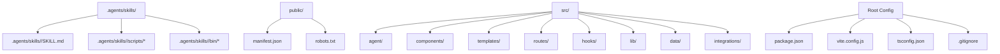
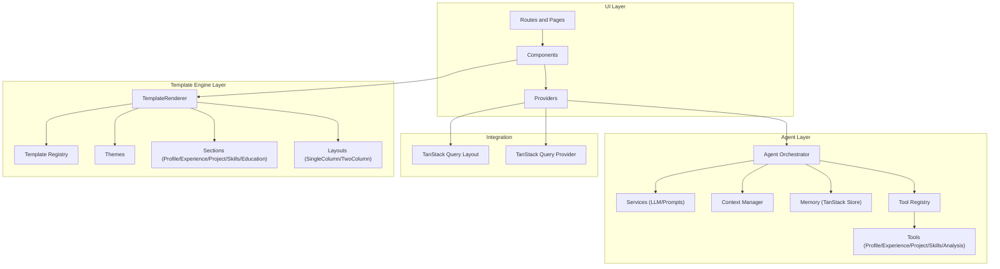
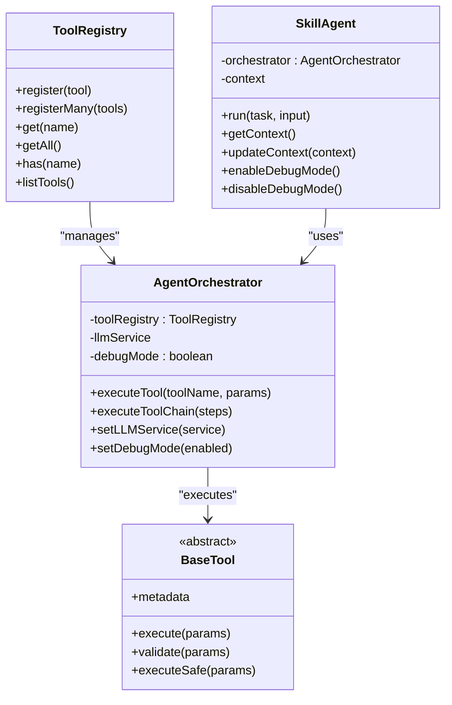
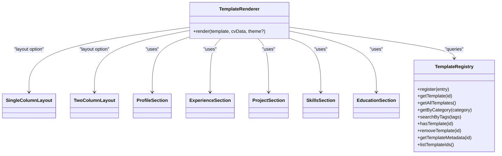
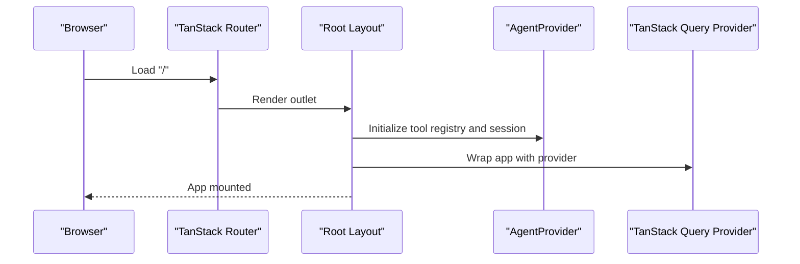
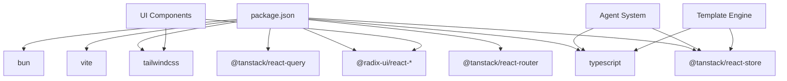

# Directory Structure

<cite>
**Referenced Files in This Document**
- [README.md](file://README.md)
- [package.json](file://package.json)
- [RESUME_TEMPLATE_ENGINE_SUMMARY.md](file://RESUME_TEMPLATE_ENGINE_SUMMARY.md)
- [SKILL_AGENT_README.md](file://SKILL_AGENT_README.md)
- [SKILL_AGENT_QUICKSTART.md](file://SKILL_AGENT_QUICKSTART.md)
- [src/main.tsx](file://src/main.tsx)
- [src/App.tsx](file://src/App.tsx)
- [src/components/index.tsx](file://src/components/index.tsx)
- [src/templates/index.ts](file://src/templates/index.ts)
- [src/agent/index.ts](file://src/agent/index.ts)
- [src/templates/core/TemplateRenderer.tsx](file://src/templates/core/TemplateRenderer.tsx)
- [src/templates/core/template-registry.ts](file://src/templates/core/template-registry.ts)
- [src/agent/core/agent.ts](file://src/agent/core/agent.ts)
- [src/agent/tools/base-tool.ts](file://src/agent/tools/base-tool.ts)
- [src/components/AgentProvider.tsx](file://src/components/AgentProvider.tsx)
</cite>

## Table of Contents
1. [Introduction](#introduction)
2. [Project Structure](#project-structure)
3. [Core Components](#core-components)
4. [Architecture Overview](#architecture-overview)
5. [Detailed Component Analysis](#detailed-component-analysis)
6. [Dependency Analysis](#dependency-analysis)
7. [Performance Considerations](#performance-considerations)
8. [Troubleshooting Guide](#troubleshooting-guide)
9. [Conclusion](#conclusion)

## Introduction
This document explains the project’s directory structure and modular architecture. The system is organized into distinct areas:
- Agent skills and orchestration under .agents/skills/
- Source code under src/
- Static assets under public/
- Configuration files at the repository root

It focuses on how agent skills integrate with the template engine, how components are structured, and how to extend the system consistently.

## Project Structure
The repository is organized as a React + Vite application with a clear separation of concerns:
- .agents/skills/: reusable agent “skills” grouped by capability
- public/: static assets such as manifests and robots.txt
- src/: modular source code with agent system, UI components, templates, and routing

**Diagram sources**
- [src/main.tsx:1-89](file://src/main.tsx#L1-L89)
- [package.json:1-60](file://package.json#L1-L60)

**Section sources**
- [README.md:501-543](file://README.md#L501-L543)
- [src/main.tsx:1-89](file://src/main.tsx#L1-L89)
- [package.json:1-60](file://package.json#L1-L60)

## Core Components
This section describes the major subsystems and their roles in the overall architecture.

- Agent system (skills, tools, memory, services)
  - Provides intelligent CV and portfolio management via a tool-based MCP-inspired design
  - Exposes a registry of tools, memory stores, and a session manager
  - Integrates with UI components and hooks for React apps

- Template engine (rendering, layouts, sections, themes)
  - Renders CV data into multiple professional templates
  - Supports single-column and two-column layouts
  - Provides a registry for templates and a theme system

- UI and routing
  - React components and TanStack Router-based routing
  - Provider components for agent state and TanStack Query integration

- Static assets
  - Public folder for manifest and robots.txt

**Section sources**
- [SKILL_AGENT_README.md:1-547](file://SKILL_AGENT_README.md#L1-L547)
- [RESUME_TEMPLATE_ENGINE_SUMMARY.md:1-354](file://RESUME_TEMPLATE_ENGINE_SUMMARY.md#L1-L354)
- [src/agent/index.ts:1-43](file://src/agent/index.ts#L1-L43)
- [src/templates/index.ts:1-44](file://src/templates/index.ts#L1-L44)

## Architecture Overview
The system follows a layered, modular design:
- UI layer: React components and TanStack Router
- Agent layer: tools, memory, context, and orchestrator
- Template engine layer: layouts, sections, themes, and renderer
- Integration layer: TanStack Query provider and layout

**Diagram sources**
- [src/main.tsx:1-89](file://src/main.tsx#L1-L89)
- [src/agent/core/agent.ts:1-414](file://src/agent/core/agent.ts#L1-L414)
- [src/agent/tools/base-tool.ts:1-72](file://src/agent/tools/base-tool.ts#L1-L72)
- [src/templates/core/TemplateRenderer.tsx:1-74](file://src/templates/core/TemplateRenderer.tsx#L1-L74)
- [src/templates/core/template-registry.ts:1-92](file://src/templates/core/template-registry.ts#L1-L92)
- [src/components/AgentProvider.tsx:1-30](file://src/components/AgentProvider.tsx#L1-L30)

## Detailed Component Analysis

### Agent System Architecture
The agent system is designed around a tool-based MCP-inspired architecture with clear separation of concerns:
- ToolRegistry: central registry for tools
- AgentOrchestrator: executes tools, logs actions, manages debug mode
- SkillAgent: high-level interface for tasks like CV analysis and optimization
- BaseTool: abstract base class for tools with safe execution and validation hooks
- Memory and Context: TanStack Store-backed state and context manager
- Services: LLM provider abstraction and prompt templates

**Diagram sources**
- [src/agent/core/agent.ts:1-414](file://src/agent/core/agent.ts#L1-L414)
- [src/agent/tools/base-tool.ts:1-72](file://src/agent/tools/base-tool.ts#L1-L72)

**Section sources**
- [SKILL_AGENT_README.md:9-75](file://SKILL_AGENT_README.md#L9-L75)
- [src/agent/core/agent.ts:1-414](file://src/agent/core/agent.ts#L1-L414)
- [src/agent/tools/base-tool.ts:1-72](file://src/agent/tools/base-tool.ts#L1-L72)

### Template Engine Architecture
The template engine renders CV data into multiple templates with layouts, sections, and themes:
- TemplateRenderer: selects layout and applies theme via CSS variables
- Layouts: SingleColumnLayout and TwoColumnLayout
- Sections: Profile, Experience, Project, Skills, Education
- Themes: Pre-built themes with runtime switching
- TemplateRegistry: central registry for templates with categories and tags

**Diagram sources**
- [src/templates/core/TemplateRenderer.tsx:1-74](file://src/templates/core/TemplateRenderer.tsx#L1-L74)
- [src/templates/core/template-registry.ts:1-92](file://src/templates/core/template-registry.ts#L1-L92)

**Section sources**
- [RESUME_TEMPLATE_ENGINE_SUMMARY.md:37-120](file://RESUME_TEMPLATE_ENGINE_SUMMARY.md#L37-L120)
- [src/templates/core/TemplateRenderer.tsx:1-74](file://src/templates/core/TemplateRenderer.tsx#L1-L74)
- [src/templates/core/template-registry.ts:1-92](file://src/templates/core/template-registry.ts#L1-L92)

### Routing and Providers
The application uses TanStack Router for routing and integrates TanStack Query and the AgentProvider for state management:
- Routes are defined in main.tsx with a root layout and outlet
- TanStack Query provider and layout are integrated at the root
- AgentProvider initializes the tool registry and session on mount

**Diagram sources**
- [src/main.tsx:1-89](file://src/main.tsx#L1-L89)
- [src/components/AgentProvider.tsx:1-30](file://src/components/AgentProvider.tsx#L1-L30)

**Section sources**
- [src/main.tsx:1-89](file://src/main.tsx#L1-L89)
- [src/components/AgentProvider.tsx:1-30](file://src/components/AgentProvider.tsx#L1-L30)

## Dependency Analysis
The project uses a modern React stack with Vite and Bun. Key dependencies include TanStack Router, TanStack Query, Radix UI, Tailwind CSS, and TypeScript. The agent system relies on TanStack Store for reactive state, and the template engine uses TanStack Store for template and preview state.

**Diagram sources**
- [package.json:1-60](file://package.json#L1-L60)

**Section sources**
- [package.json:1-60](file://package.json#L1-L60)

## Performance Considerations
- React.memo on template section components reduces unnecessary re-renders
- TanStack Store-derived states minimize recomputation
- CSS variable-based theming enables runtime switching without re-rendering
- Lazy loading of tools and selective store subscriptions improve responsiveness
- Debouncing and batching for rapid updates

[No sources needed since this section provides general guidance]

## Troubleshooting Guide
Common issues and resolutions:
- Tools not executing: ensure AgentProvider wraps the application to initialize the tool registry and session
- Data not persisting: verify browser localStorage availability and permissions
- Chat not responding: refresh the page to reset session state
- Low completeness score: add more experiences, projects, and skills to improve CV completeness

**Section sources**
- [SKILL_AGENT_QUICKSTART.md:313-331](file://SKILL_AGENT_QUICKSTART.md#L313-L331)

## Conclusion
The project’s directory structure cleanly separates concerns across agent skills, UI components, and the template engine. The agent system follows a robust MCP-inspired design with a tool registry, orchestrator, and memory/context managers. The template engine offers a flexible, themeable rendering system with a central registry. Together, these components provide a scalable foundation for building intelligent CV and portfolio experiences.