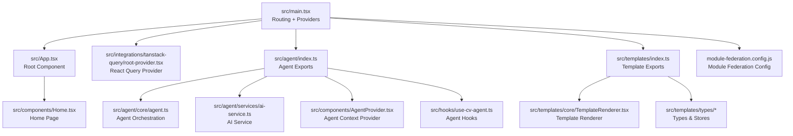
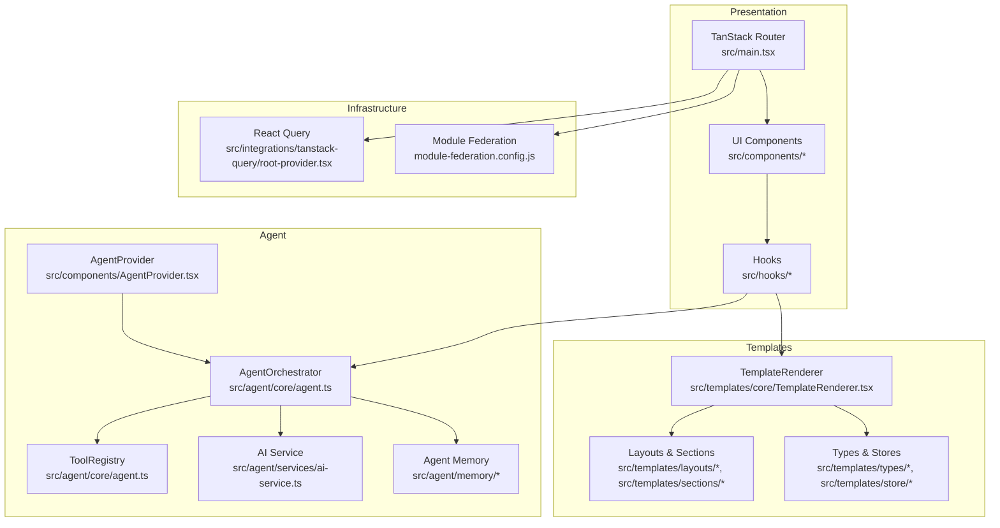
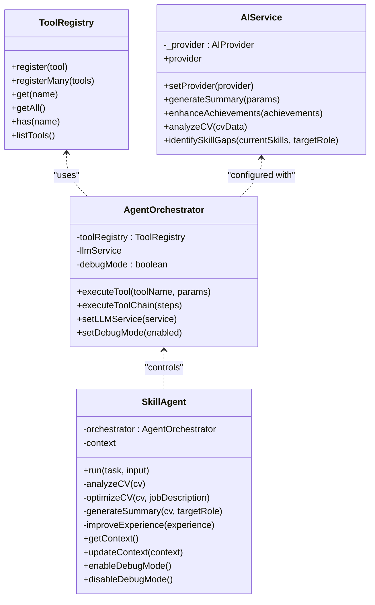
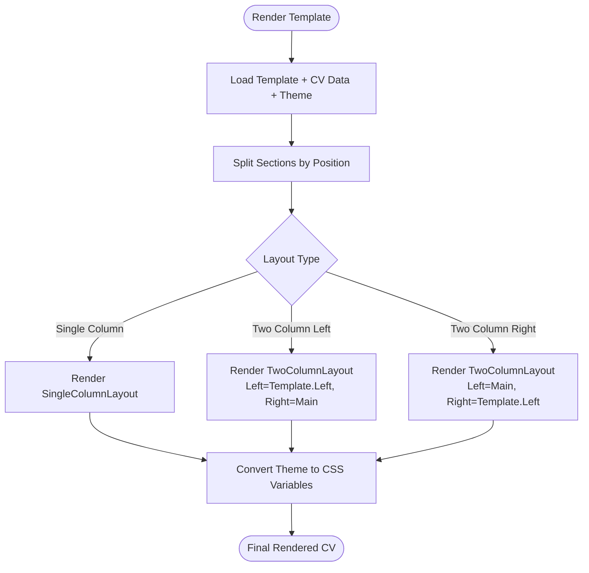
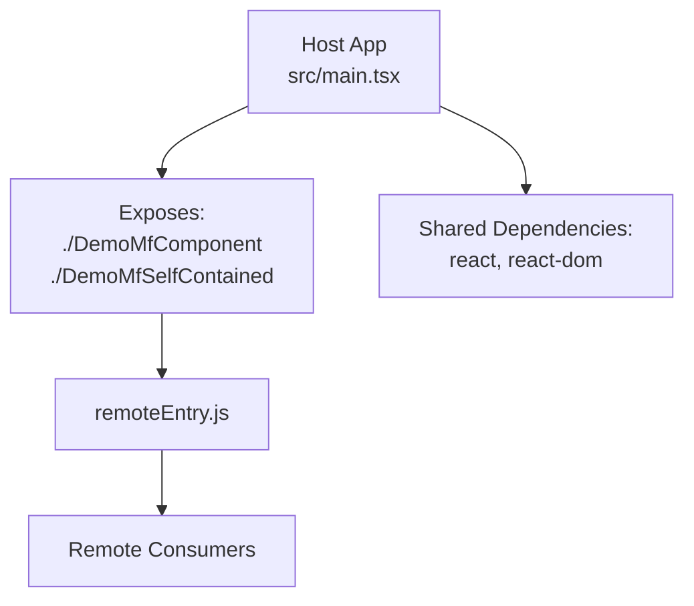
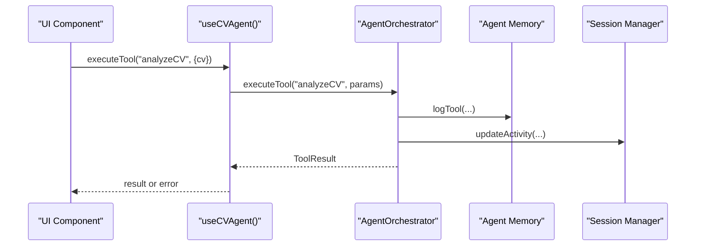
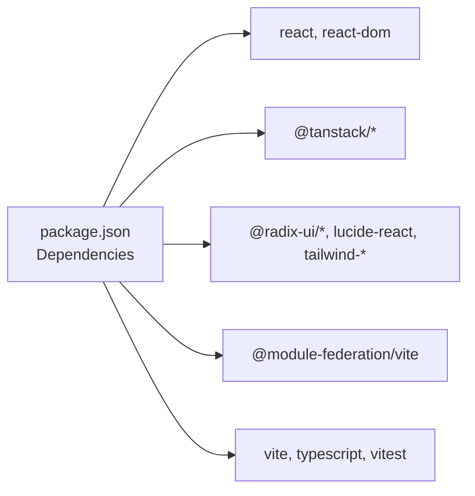

# System Overview

<cite>
**Referenced Files in This Document**
- [README.md](file://README.md)
- [package.json](file://package.json)
- [src/main.tsx](file://src/main.tsx)
- [src/App.tsx](file://src/App.tsx)
- [module-federation.config.js](file://module-federation.config.js)
- [src/agent/index.ts](file://src/agent/index.ts)
- [src/agent/core/agent.ts](file://src/agent/core/agent.ts)
- [src/agent/services/ai-service.ts](file://src/agent/services/ai-service.ts)
- [src/components/AgentProvider.tsx](file://src/components/AgentProvider.tsx)
- [src/hooks/use-cv-agent.ts](file://src/hooks/use-cv-agent.ts)
- [src/templates/index.ts](file://src/templates/index.ts)
- [src/templates/core/TemplateRenderer.tsx](file://src/templates/core/TemplateRenderer.tsx)
- [src/templates/types/cv.types.ts](file://src/templates/types/cv.types.ts)
- [src/templates/types/template.types.ts](file://src/templates/types/template.types.ts)
- [src/integrations/tanstack-query/root-provider.tsx](file://src/integrations/tanstack-query/root-provider.tsx)
- [src/components/Home.tsx](file://src/components/Home.tsx)
</cite>

## Table of Contents
1. [Introduction](#introduction)
2. [Project Structure](#project-structure)
3. [Core Components](#core-components)
4. [Architecture Overview](#architecture-overview)
5. [Detailed Component Analysis](#detailed-component-analysis)
6. [Dependency Analysis](#dependency-analysis)
7. [Performance Considerations](#performance-considerations)
8. [Troubleshooting Guide](#troubleshooting-guide)
9. [Conclusion](#conclusion)

## Introduction
This document presents a system overview of the CV Portfolio Builder, a modern React 19 application that combines TanStack’s ecosystem (routing, query, store) with an AI agent framework and a flexible template rendering engine. The platform enables users to build, preview, and export CVs and portfolios using customizable templates. It leverages Module Federation for micro-frontend extensibility and integrates AI-driven insights for CV analysis and optimization.

Key value propositions:
- Reactive, developer-friendly UI powered by React 19 and TanStack Router.
- AI agent orchestration for CV analysis, optimization, and suggestions.
- Modular template engine supporting multiple layouts and themes.
- Micro-frontend architecture enabling safe composition and reuse across subsystems.

## Project Structure
The project follows a feature-based and layer-based organization:
- src/main.tsx defines routing and providers.
- src/App.tsx renders the root page.
- src/agent contains the AI agent system, tools, memory, and services.
- src/templates encapsulates the template engine, layouts, sections, themes, and stores.
- src/hooks and src/components expose reusable UI and agent integration hooks.
- module-federation.config.js configures Module Federation for micro-frontend extensibility.

**Diagram sources**
- [src/main.tsx:1-89](file://src/main.tsx#L1-L89)
- [src/App.tsx:1-8](file://src/App.tsx#L1-L8)
- [src/components/Home.tsx:1-49](file://src/components/Home.tsx#L1-L49)
- [src/integrations/tanstack-query/root-provider.tsx:1-14](file://src/integrations/tanstack-query/root-provider.tsx#L1-L14)
- [src/agent/index.ts:1-43](file://src/agent/index.ts#L1-L43)
- [src/agent/core/agent.ts:1-414](file://src/agent/core/agent.ts#L1-L414)
- [src/agent/services/ai-service.ts:1-174](file://src/agent/services/ai-service.ts#L1-L174)
- [src/components/AgentProvider.tsx:1-30](file://src/components/AgentProvider.tsx#L1-L30)
- [src/hooks/use-cv-agent.ts:1-185](file://src/hooks/use-cv-agent.ts#L1-L185)
- [src/templates/index.ts:1-44](file://src/templates/index.ts#L1-L44)
- [src/templates/core/TemplateRenderer.tsx:1-74](file://src/templates/core/TemplateRenderer.tsx#L1-L74)
- [src/templates/types/cv.types.ts:1-16](file://src/templates/types/cv.types.ts#L1-L16)
- [src/templates/types/template.types.ts:1-77](file://src/templates/types/template.types.ts#L1-L77)
- [module-federation.config.js:1-32](file://module-federation.config.js#L1-L32)

**Section sources**
- [README.md:500-543](file://README.md#L500-L543)
- [src/main.tsx:1-89](file://src/main.tsx#L1-L89)
- [src/App.tsx:1-8](file://src/App.tsx#L1-L8)
- [src/components/Home.tsx:1-49](file://src/components/Home.tsx#L1-L49)
- [module-federation.config.js:1-32](file://module-federation.config.js#L1-L32)

## Core Components
- Routing and Navigation: TanStack Router manages code-based routes and integrates with devtools and layout wrappers.
- State and Data: TanStack Query provides caching and devtools; TanStack Store offers lightweight reactive state for agent-related stores.
- UI Layer: Shadcn/Radix-based primitives and custom components for forms and interactive elements.
- AI Agent System: A pluggable tool registry, orchestrator, and memory-backed context for CV tasks.
- Template Engine: Declarative templates with layouts, sections, themes, and preview/export controls.
- Micro-Frontend: Module Federation exposes components and self-contained modules for external consumption.

**Section sources**
- [README.md:64-123](file://README.md#L64-L123)
- [README.md:310-422](file://README.md#L310-L422)
- [README.md:424-492](file://README.md#L424-L492)
- [package.json:15-44](file://package.json#L15-L44)
- [src/integrations/tanstack-query/root-provider.tsx:1-14](file://src/integrations/tanstack-query/root-provider.tsx#L1-L14)

## Architecture Overview
The system is layered:
- Presentation Layer: React 19 components, TanStack Router for navigation, and UI primitives.
- Agent Layer: AI orchestration, tool registry, memory, and context management.
- Template Layer: Declarative rendering pipeline for CVs and portfolios.
- Infrastructure Layer: TanStack Query for data fetching, TanStack Store for local state, and Module Federation for micro-frontend extensibility.

**Diagram sources**
- [src/main.tsx:1-89](file://src/main.tsx#L1-L89)
- [src/agent/core/agent.ts:1-414](file://src/agent/core/agent.ts#L1-L414)
- [src/agent/services/ai-service.ts:1-174](file://src/agent/services/ai-service.ts#L1-L174)
- [src/components/AgentProvider.tsx:1-30](file://src/components/AgentProvider.tsx#L1-L30)
- [src/templates/core/TemplateRenderer.tsx:1-74](file://src/templates/core/TemplateRenderer.tsx#L1-L74)
- [src/templates/types/template.types.ts:1-77](file://src/templates/types/template.types.ts#L1-L77)
- [src/integrations/tanstack-query/root-provider.tsx:1-14](file://src/integrations/tanstack-query/root-provider.tsx#L1-L14)
- [module-federation.config.js:1-32](file://module-federation.config.js#L1-L32)

## Detailed Component Analysis

### AI Agent System
The agent system centers on a tool-registry pattern, an orchestrator for task execution, and memory/context managers. It exposes a clean API for CV analysis, optimization, and suggestions, backed by an AI service abstraction.

**Diagram sources**
- [src/agent/core/agent.ts:11-168](file://src/agent/core/agent.ts#L11-L168)
- [src/agent/core/agent.ts:173-376](file://src/agent/core/agent.ts#L173-L376)
- [src/agent/services/ai-service.ts:77-126](file://src/agent/services/ai-service.ts#L77-L126)

Key behaviors:
- Tool registration and execution with logging and memory updates.
- Task-driven orchestration for CV analysis and optimization.
- AI service abstraction enabling provider swaps and mock implementations.

**Section sources**
- [src/agent/index.ts:1-43](file://src/agent/index.ts#L1-L43)
- [src/agent/core/agent.ts:1-414](file://src/agent/core/agent.ts#L1-L414)
- [src/agent/services/ai-service.ts:1-174](file://src/agent/services/ai-service.ts#L1-L174)
- [src/components/AgentProvider.tsx:1-30](file://src/components/AgentProvider.tsx#L1-L30)
- [src/hooks/use-cv-agent.ts:1-185](file://src/hooks/use-cv-agent.ts#L1-L185)

### Template Rendering Engine
The template engine converts a declarative template definition into a rendered CV using layouts and sections. Themes are translated into CSS variables for consistent styling.

**Diagram sources**
- [src/templates/core/TemplateRenderer.tsx:13-55](file://src/templates/core/TemplateRenderer.tsx#L13-L55)
- [src/templates/types/template.types.ts:43-53](file://src/templates/types/template.types.ts#L43-L53)

**Section sources**
- [src/templates/index.ts:1-44](file://src/templates/index.ts#L1-L44)
- [src/templates/core/TemplateRenderer.tsx:1-74](file://src/templates/core/TemplateRenderer.tsx#L1-L74)
- [src/templates/types/cv.types.ts:1-16](file://src/templates/types/cv.types.ts#L1-L16)
- [src/templates/types/template.types.ts:1-77](file://src/templates/types/template.types.ts#L1-L77)

### Micro-Frontend with Module Federation
Module Federation exposes components and self-contained modules, sharing React and ReactDOM as singletons to avoid duplication across federated boundaries.

**Diagram sources**
- [module-federation.config.js:13-31](file://module-federation.config.js#L13-L31)
- [src/main.tsx:16-53](file://src/main.tsx#L16-L53)

**Section sources**
- [module-federation.config.js:1-32](file://module-federation.config.js#L1-L32)
- [package.json:17](file://package.json#L17)

### Reactive State and Agent Hooks
Agent hooks integrate TanStack Store and the agent orchestrator to provide reactive access to CV data, tool availability, and session statistics.

**Diagram sources**
- [src/hooks/use-cv-agent.ts:20-49](file://src/hooks/use-cv-agent.ts#L20-L49)
- [src/agent/core/agent.ts:78-127](file://src/agent/core/agent.ts#L78-L127)
- [src/components/AgentProvider.tsx:12-26](file://src/components/AgentProvider.tsx#L12-L26)

**Section sources**
- [src/hooks/use-cv-agent.ts:1-185](file://src/hooks/use-cv-agent.ts#L1-L185)
- [src/agent/core/agent.ts:1-414](file://src/agent/core/agent.ts#L1-L414)
- [src/components/AgentProvider.tsx:1-30](file://src/components/AgentProvider.tsx#L1-L30)

## Dependency Analysis
High-level dependencies:
- Runtime: React 19, TanStack Router, TanStack Query, TanStack Store, Radix UI, Tailwind CSS.
- Build-time: Vite, Module Federation, TypeScript.
- AI integration: Pluggable AI provider interface with a mock implementation.

**Diagram sources**
- [package.json:15-58](file://package.json#L15-L58)

**Section sources**
- [package.json:15-58](file://package.json#L15-L58)
- [README.md:515-524](file://README.md#L515-L524)

## Performance Considerations
- Memoization: TemplateRenderer uses React.memo to prevent unnecessary re-renders.
- Structural Sharing: TanStack Router defaults enable efficient route transitions.
- Singleton Providers: Module Federation shares React to minimize bundle size and memory footprint.
- Devtools: Router and Query devtools aid debugging but should be disabled in production builds.

[No sources needed since this section provides general guidance]

## Troubleshooting Guide
Common areas to inspect:
- Routing and Providers: Ensure RouterProvider is wrapped with QueryClientProvider and devtools are conditionally included.
- Agent Initialization: Verify AgentProvider initializes the tool registry and session manager.
- Template Rendering: Confirm theme conversion to CSS variables and section positioning align with the chosen layout.
- Module Federation: Validate exposed modules and shared dependencies match consumer expectations.

**Section sources**
- [src/main.tsx:29-83](file://src/main.tsx#L29-L83)
- [src/components/AgentProvider.tsx:12-26](file://src/components/AgentProvider.tsx#L12-L26)
- [src/templates/core/TemplateRenderer.tsx:13-55](file://src/templates/core/TemplateRenderer.tsx#L13-L55)
- [module-federation.config.js:13-31](file://module-federation.config.js#L13-L31)

## Conclusion
The CV Portfolio Builder integrates React 19, TanStack’s ecosystem, and an AI agent framework to deliver a responsive, extensible, and intelligent CV creation experience. Its modular design—agent orchestration, template rendering, and micro-frontend architecture—enables scalable feature development and safe composition across teams and environments. The combination of reactive state, AI-driven insights, and customizable templates provides tangible value for both stakeholders and developers.