# Technology Stack

<cite>
**Referenced Files in This Document**
- [package.json](file://package.json)
- [vite.config.js](file://vite.config.js)
- [tsconfig.json](file://tsconfig.json)
- [src/main.tsx](file://src/main.tsx)
- [src/integrations/tanstack-query/root-provider.tsx](file://src/integrations/tanstack-query/root-provider.tsx)
- [src/integrations/tanstack-query/layout.tsx](file://src/integrations/tanstack-query/layout.tsx)
- [src/routes/demo.form.address.tsx](file://src/routes/demo.form.address.tsx)
- [src/routes/demo.store.tsx](file://src/routes/demo.store.tsx)
- [src/routes/demo.table.tsx](file://src/routes/demo.table.tsx)
- [src/styles.css](file://src/styles.css)
- [components.json](file://components.json)
- [eslint.config.js](file://eslint.config.js)
- [prettier.config.js](file://prettier.config.js)
- [module-federation.config.js](file://module-federation.config.js)
</cite>

## Table of Contents
1. [Introduction](#introduction)
2. [Project Structure](#project-structure)
3. [Core Components](#core-components)
4. [Architecture Overview](#architecture-overview)
5. [Detailed Component Analysis](#detailed-component-analysis)
6. [Dependency Analysis](#dependency-analysis)
7. [Performance Considerations](#performance-considerations)
8. [Troubleshooting Guide](#troubleshooting-guide)
9. [Conclusion](#conclusion)
10. [Appendices](#appendices)

## Introduction
This document describes the technology stack powering CV Portfolio Builder. The project combines React 19 with modern hooks, TypeScript for type safety, the TanStack ecosystem (Router, Query, Store, Form, Table), Vite for build tooling, and Tailwind CSS for styling. It explains the rationale behind each technology, version compatibility, performance characteristics, integration patterns, development tools, testing framework, and deployment pipeline. Setup instructions and environment requirements are included for developers.

## Project Structure
The project is organized around a modern frontend architecture:
- Application bootstrap and routing via TanStack Router
- TanStack Query for server state management and caching
- TanStack Form for form state and validation
- TanStack Store for local state management
- TanStack Table for advanced client-side data grids
- Vite for fast builds and dev server
- Tailwind CSS for utility-first styling
- Module Federation for microfrontend extensibility

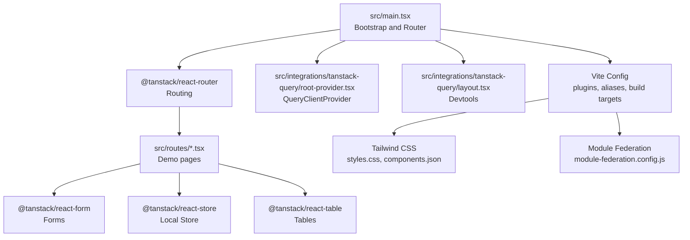

**Diagram sources**
- [src/main.tsx:1-89](file://src/main.tsx#L1-L89)
- [src/integrations/tanstack-query/root-provider.tsx:1-14](file://src/integrations/tanstack-query/root-provider.tsx#L1-L14)
- [src/integrations/tanstack-query/layout.tsx:1-6](file://src/integrations/tanstack-query/layout.tsx#L1-L6)
- [vite.config.js:1-28](file://vite.config.js#L1-L28)
- [src/styles.css:1-138](file://src/styles.css#L1-L138)
- [module-federation.config.js:1-32](file://module-federation.config.js#L1-L32)

**Section sources**
- [src/main.tsx:1-89](file://src/main.tsx#L1-L89)
- [vite.config.js:1-28](file://vite.config.js#L1-L28)
- [src/styles.css:1-138](file://src/styles.css#L1-L138)
- [module-federation.config.js:1-32](file://module-federation.config.js#L1-L32)

## Core Components
- React 19 with modern hooks: Application runtime and component model
- TypeScript: Type-safe development and improved DX
- TanStack Router: Declarative routing with route-based code splitting and devtools
- TanStack Query: Client-side caching, invalidation, and devtools
- TanStack Form: Field-level validation, submission, and subscription patterns
- TanStack Store: Lightweight local state with fine-grained subscriptions
- TanStack Table: Performant, extensible table with virtualization-ready APIs
- Vite: Fast dev server and optimized production builds
- Tailwind CSS: Utility-first styling with theme customization
- Module Federation: Microfrontend exposure and shared dependencies

**Section sources**
- [package.json:15-58](file://package.json#L15-L58)
- [src/main.tsx:1-89](file://src/main.tsx#L1-L89)
- [src/integrations/tanstack-query/root-provider.tsx:1-14](file://src/integrations/tanstack-query/root-provider.tsx#L1-L14)
- [src/routes/demo.form.address.tsx:1-200](file://src/routes/demo.form.address.tsx#L1-L200)
- [src/routes/demo.store.tsx:1-62](file://src/routes/demo.store.tsx#L1-L62)
- [src/routes/demo.table.tsx:1-341](file://src/routes/demo.table.tsx#L1-L341)
- [vite.config.js:1-28](file://vite.config.js#L1-L28)
- [src/styles.css:1-138](file://src/styles.css#L1-L138)
- [module-federation.config.js:1-32](file://module-federation.config.js#L1-L32)

## Architecture Overview
The application initializes TanStack Router and mounts a root layout that includes a header, outlet for routed content, TanStack Router devtools, and a TanStack Query layout addition for devtools. Each route composes TanStack components to demonstrate forms, stores, tables, and query usage. Vite integrates React plugin, Tailwind CSS plugin, and Module Federation plugin. TypeScript compiles JSX with bundler resolution and strictness enabled.

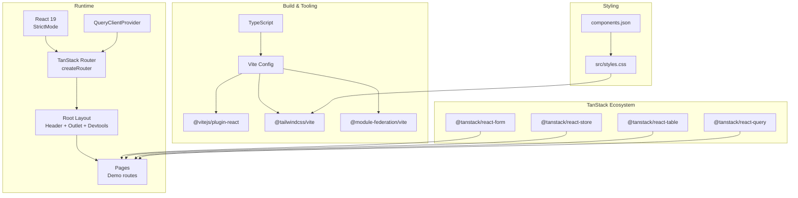

**Diagram sources**
- [src/main.tsx:1-89](file://src/main.tsx#L1-L89)
- [src/integrations/tanstack-query/root-provider.tsx:1-14](file://src/integrations/tanstack-query/root-provider.tsx#L1-L14)
- [src/integrations/tanstack-query/layout.tsx:1-6](file://src/integrations/tanstack-query/layout.tsx#L1-L6)
- [vite.config.js:1-28](file://vite.config.js#L1-L28)
- [src/styles.css:1-138](file://src/styles.css#L1-L138)
- [components.json:1-22](file://components.json#L1-L22)
- [package.json:15-58](file://package.json#L15-L58)

## Detailed Component Analysis

### React 19 and TanStack Router
- Bootstrapping: The app creates root and index routes, mounts a layout with a header and devtools, and registers the router in the module declaration.
- Context injection: The router context includes the TanStack Query client context so route handlers can access query utilities.
- Routing patterns: Routes are dynamically composed and registered under the root route tree.

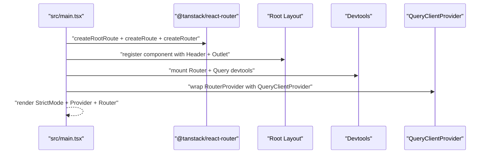

**Diagram sources**
- [src/main.tsx:1-89](file://src/main.tsx#L1-L89)
- [src/integrations/tanstack-query/root-provider.tsx:1-14](file://src/integrations/tanstack-query/root-provider.tsx#L1-L14)
- [src/integrations/tanstack-query/layout.tsx:1-6](file://src/integrations/tanstack-query/layout.tsx#L1-L6)

**Section sources**
- [src/main.tsx:1-89](file://src/main.tsx#L1-L89)

### TanStack Query Integration
- Client setup: A QueryClient is created and exposed via a context getter; the provider wraps the router.
- Devtools: Mounted in the TanStack Query layout addition with a fixed position.
- Context sharing: The router’s context merges the query client context so route handlers can subscribe to queries.

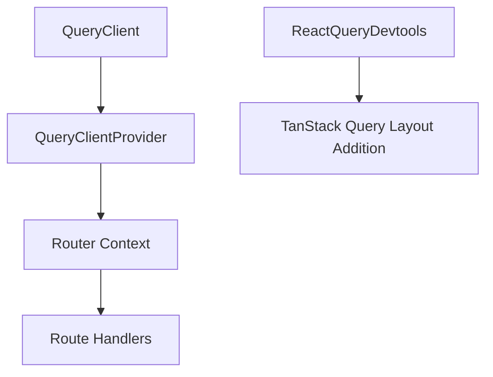

**Diagram sources**
- [src/integrations/tanstack-query/root-provider.tsx:1-14](file://src/integrations/tanstack-query/root-provider.tsx#L1-L14)
- [src/integrations/tanstack-query/layout.tsx:1-6](file://src/integrations/tanstack-query/layout.tsx#L1-L6)
- [src/main.tsx:56-71](file://src/main.tsx#L56-L71)

**Section sources**
- [src/integrations/tanstack-query/root-provider.tsx:1-14](file://src/integrations/tanstack-query/root-provider.tsx#L1-L14)
- [src/integrations/tanstack-query/layout.tsx:1-6](file://src/integrations/tanstack-query/layout.tsx#L1-L6)
- [src/main.tsx:56-71](file://src/main.tsx#L56-L71)

### TanStack Form Demo
- Composition: Demonstrates nested field groups, field-level validation, and submit handling.
- Validation: Uses blur-time validators with structured error reporting.
- Submission: Handles form submission and displays success feedback.

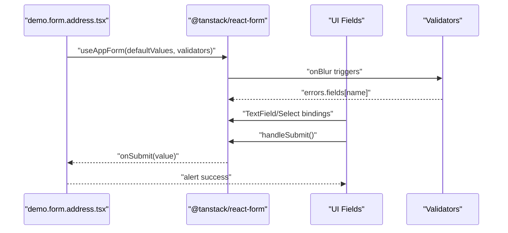

**Diagram sources**
- [src/routes/demo.form.address.tsx:1-200](file://src/routes/demo.form.address.tsx#L1-L200)

**Section sources**
- [src/routes/demo.form.address.tsx:1-200](file://src/routes/demo.form.address.tsx#L1-L200)

### TanStack Store Demo
- Local state: Demonstrates a simple store with firstName/lastName and a derived fullName selector.
- Subscriptions: Components subscribe to store slices for reactivity.
- Updates: setState updates are performed via functional updates.

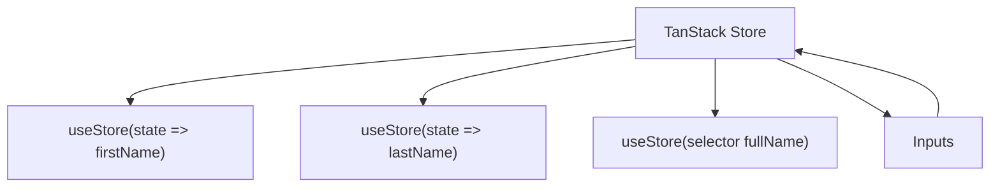

**Diagram sources**
- [src/routes/demo.store.tsx:1-62](file://src/routes/demo.store.tsx#L1-L62)

**Section sources**
- [src/routes/demo.store.tsx:1-62](file://src/routes/demo.store.tsx#L1-L62)

### TanStack Table Demo
- Table setup: Creates columns, filters, sorting, pagination, and fuzzy filter/sort functions.
- Performance: Uses memoized columns and debug flags for development.
- UX: Includes global filter, per-column filters, pagination controls, and a force rerender option.

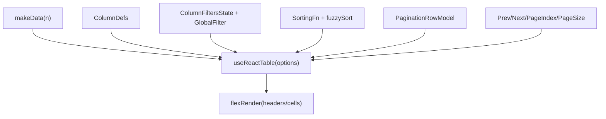

**Diagram sources**
- [src/routes/demo.table.tsx:1-341](file://src/routes/demo.table.tsx#L1-L341)

**Section sources**
- [src/routes/demo.table.tsx:1-341](file://src/routes/demo.table.tsx#L1-L341)

### Vite Build and Tooling
- Plugins: React plugin, Tailwind CSS plugin, and Module Federation plugin.
- Test environment: jsdom with globals enabled.
- Aliases: Path aliases for @ and @components.
- Build target: ESNext for modern features and top-level await.

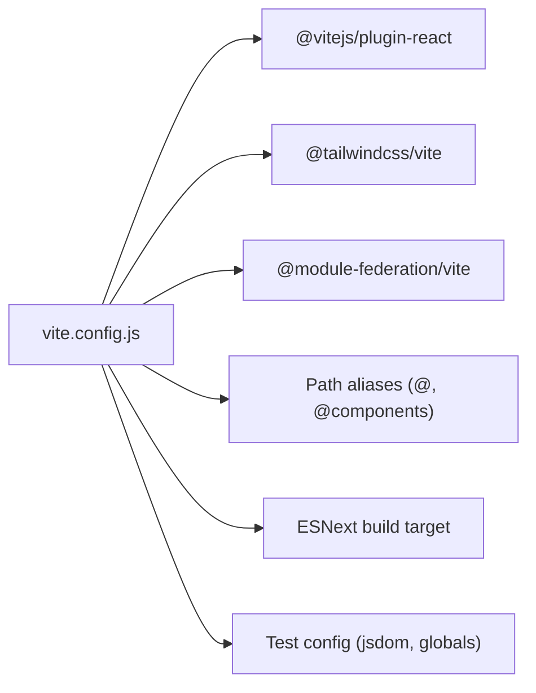

**Diagram sources**
- [vite.config.js:1-28](file://vite.config.js#L1-L28)

**Section sources**
- [vite.config.js:1-28](file://vite.config.js#L1-L28)

### Tailwind CSS and Styling
- CSS setup: Tailwind directives, animations plugin, dark mode variant, and theme tokens.
- Theme: CSS variables mapped to oklch color tokens for light/dark modes.
- Components: shadcn/ui configuration via components.json with TSX and Tailwind v4.

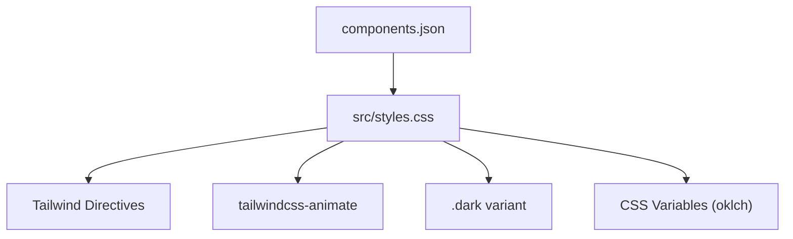

**Diagram sources**
- [src/styles.css:1-138](file://src/styles.css#L1-L138)
- [components.json:1-22](file://components.json#L1-L22)

**Section sources**
- [src/styles.css:1-138](file://src/styles.css#L1-L138)
- [components.json:1-22](file://components.json#L1-L22)

### Module Federation
- Exposed modules: Demo components for microfrontend scenarios.
- Shared dependencies: React and ReactDOM singletons with required versions aligned to package.json.
- Remote configuration: Empty remotes in this project; designed for future remote consumption.

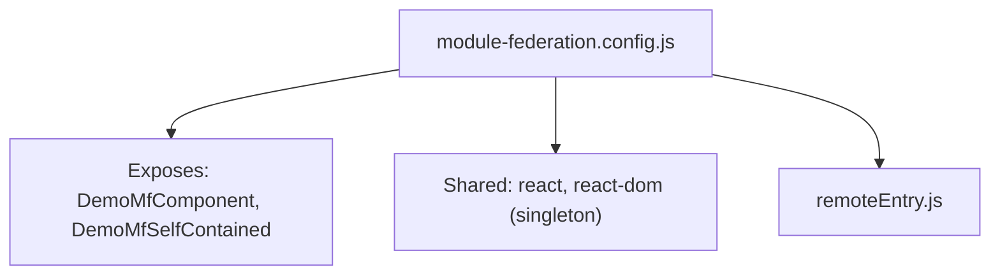

**Diagram sources**
- [module-federation.config.js:1-32](file://module-federation.config.js#L1-L32)

**Section sources**
- [module-federation.config.js:1-32](file://module-federation.config.js#L1-L32)

## Dependency Analysis
- Version alignment: React 19 and React DOM 19 are aligned; TanStack packages are pinned to compatible versions.
- Build tooling: Vite 6 with React plugin and Tailwind CSS plugin; TypeScript 5 with bundler resolution.
- Testing: Vitest 3 with jsdom environment; Testing Library integrations present.
- Formatting and linting: Prettier 3 and ESLint with TanStack configs.

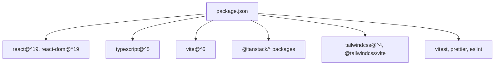

**Diagram sources**
- [package.json:15-58](file://package.json#L15-L58)

**Section sources**
- [package.json:15-58](file://package.json#L15-L58)

## Performance Considerations
- Modern JS target: ESNext build target enables top-level await and modern engine features.
- TanStack Table: Efficient rendering with getCoreRowModel and pagination; consider virtualization for very large datasets.
- TanStack Query: Structured sharing and default preload settings reduce redundant requests.
- TanStack Form: Subscribe only to necessary fields to minimize re-renders.
- Vite: Fast HMR and optimized production builds; keep plugins minimal for dev speed.
- Tailwind: Purge unused styles in production; avoid excessive nesting in components.

## Troubleshooting Guide
- TypeScript strictness: Enable strict mode and fix unused locals/parameters to catch issues early.
- Vite test environment: Ensure jsdom is configured for DOM APIs in tests.
- TanStack Query devtools: Verify devtools are mounted and network tab shows cache behavior.
- TanStack Form validation: Validate field names and error shapes align with form bindings.
- Tailwind utilities: Confirm CSS is imported and Tailwind directives are processed by the Vite plugin.

**Section sources**
- [tsconfig.json:3-26](file://tsconfig.json#L3-L26)
- [vite.config.js:11-14](file://vite.config.js#L11-L14)
- [src/integrations/tanstack-query/layout.tsx:1-6](file://src/integrations/tanstack-query/layout.tsx#L1-L6)
- [src/routes/demo.form.address.tsx:21-38](file://src/routes/demo.form.address.tsx#L21-L38)
- [src/styles.css:1-138](file://src/styles.css#L1-L138)

## Conclusion
CV Portfolio Builder leverages a cohesive modern stack: React 19 with TanStack Router for routing, TanStack Query for caching, TanStack Form/Table/Store for state and UX, Vite for tooling, and Tailwind CSS for styling. The integration patterns emphasize composability, type safety, and developer productivity. The project is prepared for microfrontend extensibility via Module Federation and includes robust tooling for formatting, linting, and testing.

## Appendices

### Setup Instructions
- Install dependencies: Use Bun or npm to install from package.json.
- Development: Run the dev script to start the Vite server.
- Build: Produce optimized assets with the build script.
- Test: Execute unit tests with the test script.
- Lint and format: Use lint and format scripts; check script runs both.

Environment requirements:
- Node.js LTS recommended; Bun supported as noted in dependencies.
- Modern browser for development; ESNext build target implies recent engine support.

**Section sources**
- [package.json:5-14](file://package.json#L5-L14)

### Version Compatibility
- React 19 and React DOM 19: Aligned for hooks and concurrent features.
- TanStack packages: Versions pinned to working combinations with React 19.
- TypeScript 5: JSX transform and bundler resolution configured.
- Vite 6: Latest features and plugin ecosystem.
- Tailwind CSS 4: New plugin syntax and theme tokens.

**Section sources**
- [package.json:38-43](file://package.json#L38-L43)
- [package.json:25-33](file://package.json#L25-L33)
- [package.json:54-55](file://package.json#L54-L55)
- [package.json:41-42](file://package.json#L41-L42)

### Integration Patterns
- Router + Query: Merge contexts so route handlers can use both routing and caching.
- Form + Table: Compose field-level validation with client-side filtering/sorting.
- Store + Router: Keep local UI state separate from server state; subscribe only where needed.
- Tailwind + shadcn/ui: Use components.json aliases and TSX for consistent component library integration.

**Section sources**
- [src/main.tsx:56-71](file://src/main.tsx#L56-L71)
- [src/routes/demo.form.address.tsx:1-200](file://src/routes/demo.form.address.tsx#L1-L200)
- [src/routes/demo.table.tsx:1-341](file://src/routes/demo.table.tsx#L1-L341)
- [components.json:13-21](file://components.json#L13-L21)

### Development Tools
- Formatting: Prettier 3 with semicolons off, single quotes, trailing commas.
- Linting: ESLint with TanStack configs for consistent patterns.
- Testing: Vitest 3 with jsdom; Testing Library packages present.

**Section sources**
- [prettier.config.js:1-11](file://prettier.config.js#L1-L11)
- [eslint.config.js:1-6](file://eslint.config.js#L1-L6)
- [package.json:48-57](file://package.json#L48-L57)

### Deployment Pipeline
- Build artifacts: Vite produces optimized static assets; TypeScript emits are run post-build.
- Preview: Use the serve script to preview built assets locally.
- Microfrontend: Module Federation exposes components for consumption by other hosts.

Note: Specific CI/CD steps are not defined in the repository; adopt standard Vite/Tailwind/TypeScript build and preview commands in your pipeline.

**Section sources**
- [package.json:8-10](file://package.json#L8-L10)
- [vite.config.js:21-26](file://vite.config.js#L21-L26)
- [module-federation.config.js:13-20](file://module-federation.config.js#L13-L20)