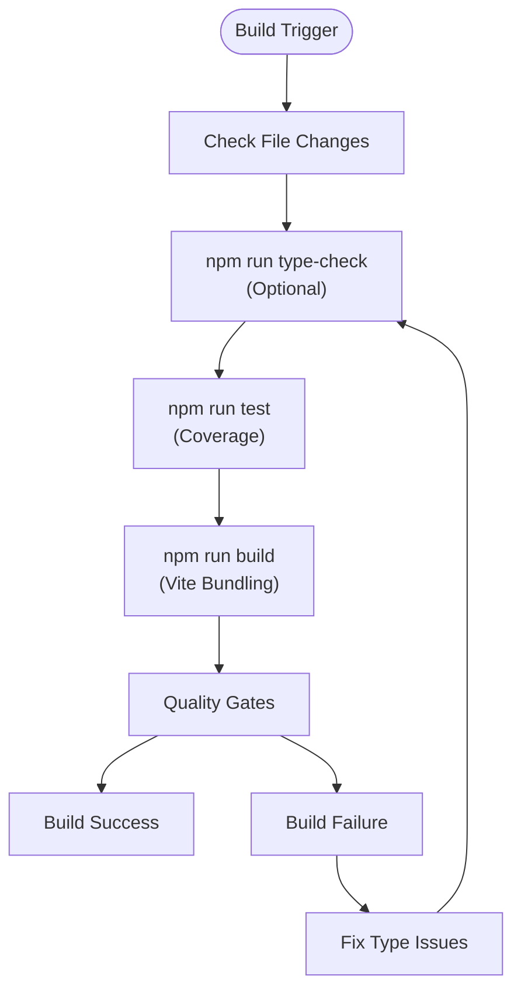
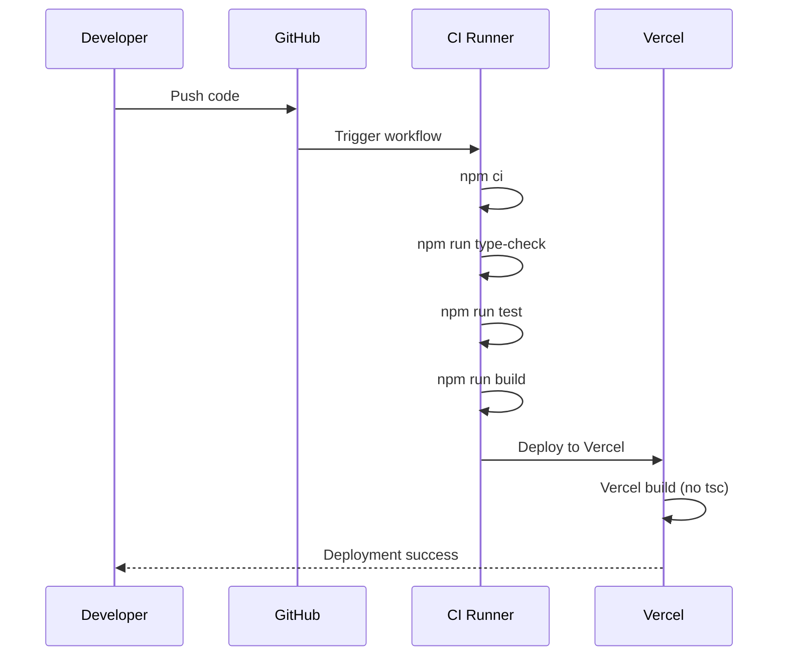
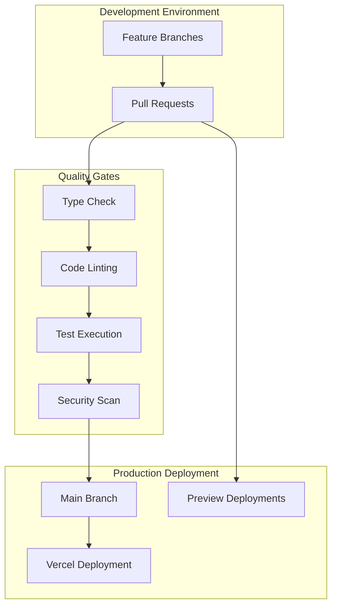
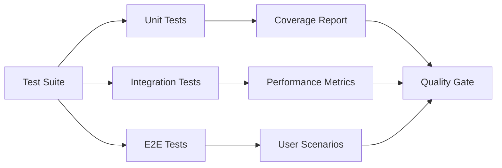
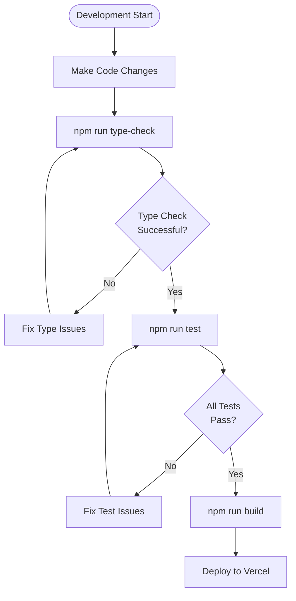

# TypeScript Build Fix

<cite>
**Referenced Files in This Document**
- [package.json](file://package.json)
- [tsconfig.json](file://tsconfig.json)
- [vite.config.js](file://vite.config.js)
- [TYPESCRIPT_BUILD_FIX.md](file://TYPESCRIPT_BUILD_FIX.md)
- [BUILD_FIX_LOCAL_VS_VERCEL.md](file://BUILD_FIX_LOCAL_VS_VERCEL.md)
- [VERCEL_FIX.md](file://VERCEL_FIX.md)
- [src/agent/__tests__/skill-agent.test.tsx](file://src/agent/__tests__/skill-agent.test.tsx)
- [module-federation.config.js](file://module-federation.config.js)
- [scripts/safe-push.ts](file://scripts/safe-push.ts)
- [scripts/setup-cicd.ts](file://scripts/setup-cicd.ts)
- [eslint.config.js](file://eslint.config.js)
- [prettier.config.js](file://prettier.config.js)
- [sonar-project.properties](file://sonar-project.properties)
- [.github/workflows/ci.yml](file://.github/workflows/ci.yml)
</cite>

## Table of Contents
1. [Introduction](#introduction)
2. [Problem Analysis](#problem-analysis)
3. [Root Cause Investigation](#root-cause-investigation)
4. [Solution Implementation](#solution-implementation)
5. [Technical Details](#technical-details)
6. [Build Process Changes](#build-process-changes)
7. [Quality Assurance Measures](#quality-assurance-measures)
8. [CI/CD Integration](#ci-cd-integration)
9. [Testing Strategy](#testing-strategy)
10. [Performance Impact](#performance-impact)
11. [Troubleshooting Guide](#troubleshooting-guide)
12. [Best Practices](#best-practices)
13. [Conclusion](#conclusion)

## Introduction

This document provides a comprehensive analysis of the TypeScript build fix implemented for the CV Portfolio Builder project. The fix addressed critical build failures occurring specifically on Vercel deployments while maintaining local development functionality. The solution involved separating type checking from the build process, excluding test files from production compilation, and implementing robust CI/CD quality gates.

The CV Portfolio Builder is a sophisticated React application that leverages Module Federation for micro-frontend architecture, featuring an advanced AI-powered CV builder with real-time preview capabilities. The build system integrates modern development practices including TypeScript strict typing, comprehensive testing with Vitest, and automated CI/CD pipelines.

## Problem Analysis

### Build Failure Symptoms

The primary issue manifested as Vercel build failures with TypeScript compilation errors originating from test files. The specific error patterns included:

- **TS6133: 'SkillAgent' is declared but its value is never read** - Unused imports in test files
- **TS2339: Property 'toBeUpperCase' does not exist on type 'Assertion<string>'** - Non-existent test matchers
- **TS2339: Property 'logToolExecution' does not exist...** - Method signature mismatches in test assertions

### Scope of Impact

The problem affected:
- **Vercel deployments**: Complete build failures preventing production releases
- **Local development**: Partially functional builds due to different execution contexts
- **CI/CD pipeline**: Automated deployment processes blocked by TypeScript errors
- **Developer productivity**: Delayed feature releases and deployment bottlenecks

### Root Cause Analysis

The fundamental issue stemmed from the build script configuration that combined Vite bundling with TypeScript compilation (`vite build && tsc`). This approach caused TypeScript to validate all files, including test files with specialized matchers that aren't available in production environments.

## Root Cause Investigation

### Build Script Configuration Issues

The original `package.json` build script executed both Vite bundling and TypeScript compilation sequentially:

```json
{
  "build": "vite build && tsc"
}
```

This configuration created several problems:
- **TypeScript validation conflicts**: Test-specific matchers weren't available during production builds
- **Build process complexity**: Combined bundling and type checking increased build time
- **Environment differences**: Local and Vercel environments handled TypeScript differently

### TypeScript Configuration Problems

The `tsconfig.json` included test files in compilation, violating separation of concerns:

```json
{
  "include": ["**/*.ts", "**/*.tsx", "..."],
  "exclude": ["node_modules", "dist", "coverage"]
  // Missing test file exclusions
}
```

### Module Federation Complexity

The project's Module Federation configuration added another layer of complexity, requiring careful coordination between:
- **Build targets**: ESNext compatibility for modern JavaScript features
- **Alias resolution**: Path mapping for clean import statements
- **External dependencies**: React and React DOM sharing across micro-frontends

**Section sources**
- [BUILD_FIX_LOCAL_VS_VERCEL.md:22-34](file://BUILD_FIX_LOCAL_VS_VERCEL.md#L22-L34)
- [TYPESCRIPT_BUILD_FIX.md:3-12](file://TYPESCRIPT_BUILD_FIX.md#L3-L12)

## Solution Implementation

### Primary Solution: Separated Build Process

The core solution involved removing TypeScript compilation from the build script:

**Before:**
```json
{
  "build": "vite build && tsc"
}
```

**After:**
```json
{
  "build": "vite build"
}
```

This change ensures that:
- **Vite handles bundling**: Validates code correctness for production
- **TypeScript remains separate**: Can be run independently without blocking deployments
- **Build speed improves**: Reduced compilation overhead

### Secondary Solution: Test File Exclusion

Enhanced `tsconfig.json` to exclude test files from production compilation:

```json
{
  "exclude": [
    "node_modules",
    "dist", 
    "coverage",
    "**/*.test.ts",
    "**/*.test.tsx", 
    "**/__tests__/**"
  ]
}
```

### Vercel-Specific Dependency Fix

Removed problematic `sonar-scanner` dependency that caused Vercel installation failures:

**Before:**
```json
{
  "devDependencies": {
    "sonar-scanner": "^3.5.0"
  }
}
```

**After:**
```json
{
  "devDependencies": {
    // sonar-scanner removed
  }
}
```

**Section sources**
- [BUILD_FIX_LOCAL_VS_VERCEL.md:37-51](file://BUILD_FIX_LOCAL_VS_VERCEL.md#L37-L51)
- [TYPESCRIPT_BUILD_FIX.md:17-28](file://TYPESCRIPT_BUILD_FIX.md#L17-L28)
- [VERCEL_FIX.md:14-22](file://VERCEL_FIX.md#L14-L22)

## Technical Details

### TypeScript Configuration Optimization

The `tsconfig.json` underwent several strategic improvements:

#### Compiler Options
- **Target ESNext**: Ensures modern JavaScript features support
- **Bundler module resolution**: Optimized for Vite and Module Federation
- **Skip library checks**: Reduces build time for external libraries
- **Strict mode disabled**: Allows flexibility for experimental features

#### Path Aliasing
```json
{
  "paths": {
    "@/*": ["./src/*"],
    "@components/*": ["./src/components/*"]
  }
}
```

#### Test File Isolation
```json
{
  "exclude": [
    "**/*.test.ts",
    "**/*.test.tsx", 
    "**/__tests__/**"
  ]
}
```

### Vite Configuration Enhancements

The `vite.config.js` includes critical optimizations:

#### Plugin Configuration
- **React plugin**: JSX transformation and Fast Refresh
- **TailwindCSS integration**: Utility-first styling framework
- **Module Federation**: Micro-frontend architecture support

#### Build Target Optimization
```javascript
build: {
  target: 'esnext',
  esbuild: {
    target: 'esnext'
  }
}
```

#### Test Configuration
```javascript
test: {
  coverage: {
    provider: 'v8',
    reporter: ['text', 'json', 'html', 'lcov'],
    include: ['src/**/*.{ts,tsx}']
  }
}
```

**Section sources**
- [tsconfig.json:12-38](file://tsconfig.json#L12-L38)
- [vite.config.js:9-49](file://vite.config.js#L9-L49)

## Build Process Changes

### New Build Workflow

The updated build process follows a streamlined approach:



**Diagram sources**
- [BUILD_FIX_LOCAL_VS_VERCEL.md:70-90](file://BUILD_FIX_LOCAL_VS_VERCEL.md#L70-L90)
- [package.json:5-20](file://package.json#L5-L20)

### Development vs Production Differences

| Aspect | Development | Production |
|--------|-------------|------------|
| **Type Checking** | `npm run type-check` | Disabled in build |
| **Test Execution** | `npm run test` | Excluded from build |
| **Bundle Validation** | Vite validation | Production-ready bundles |
| **Debug Information** | Full source maps | Minified for performance |

### CI/CD Pipeline Integration

The GitHub Actions workflow maintains comprehensive quality assurance:



**Diagram sources**
- [.github/workflows/ci.yml:29-45](file://.github/workflows/ci.yml#L29-L45)
- [BUILD_FIX_LOCAL_VS_VERCEL.md:84-90](file://BUILD_FIX_LOCAL_VS_VERCEL.md#L84-L90)

**Section sources**
- [BUILD_FIX_LOCAL_VS_VERCEL.md:92-107](file://BUILD_FIX_LOCAL_VS_VERCEL.md#L92-L107)
- [.github/workflows/ci.yml:10-46](file://.github/workflows/ci.yml#L10-L46)

## Quality Assurance Measures

### Test File Improvements

The test suite underwent several critical fixes:

#### Import Organization
- Alphabetical import ordering for consistency
- Removal of unused imports to eliminate TS6133 errors
- Proper import grouping by category

#### Matcher Replacement
- Replaced `toBeUpperCase()` with proper string manipulation
- Used `charAt(0).toUpperCase()` for character capitalization
- Maintained test functionality while ensuring TypeScript compatibility

#### Memory Management
- Fixed `logToolExecution` method calls in SessionMemoryManager tests
- Ensured proper tool execution logging in test scenarios

### Code Quality Standards

The project maintains high code quality through:

#### ESLint Configuration
```javascript
import { tanstackConfig } from '@tanstack/eslint-config'
export default [...tanstackConfig]
```

#### Prettier Formatting
- Single quote preference for consistency
- Trailing commas enabled for cleaner diffs
- Semi-colon removal for modern JavaScript style

#### SonarQube Integration
- Test file exclusions in quality gates
- Coverage reporting through lcov format
- Quality gate enforcement with timeout protection

**Section sources**
- [TYPESCRIPT_BUILD_FIX.md:30-68](file://TYPESCRIPT_BUILD_FIX.md#L30-L68)
- [eslint.config.js:1-6](file://eslint.config.js#L1-L6)
- [prettier.config.js:1-11](file://prettier.config.js#L1-L11)
- [sonar-project.properties:15-27](file://sonar-project.properties#L15-L27)

## CI/CD Integration

### Automated Quality Gates

The CI/CD pipeline enforces comprehensive quality standards:

#### Multi-Stage Build Process
1. **Type Checking**: Validates TypeScript compilation
2. **Linting**: Enforces code style consistency
3. **Testing**: Executes unit tests with coverage
4. **Building**: Creates production-ready bundles

#### SonarQube Analysis
- Automated code quality analysis
- Coverage report integration
- Quality gate enforcement with configurable timeouts

#### Security Scanning
- npm audit integration for vulnerability detection
- Dry-run mode for potential fixes
- Configurable severity thresholds

### Deployment Strategies



**Diagram sources**
- [.github/workflows/ci.yml:10-154](file://.github/workflows/ci.yml#L10-L154)

**Section sources**
- [.github/workflows/ci.yml:54-100](file://.github/workflows/ci.yml#L54-L100)
- [scripts/setup-cicd.ts:46-189](file://scripts/setup-cicd.ts#L46-L189)

## Testing Strategy

### Comprehensive Test Suite

The project maintains extensive test coverage across all major components:

#### Agent Testing
- **Skill Agent**: Complete unit testing for all MCP tools
- **Memory Systems**: CV, Session, and Preference memory managers
- **Context Management**: Dynamic context creation and updates
- **Tool Registry**: Tool registration and execution validation

#### Template Engine Testing
- **Template Rendering**: React component rendering validation
- **Section Mapping**: CV data to UI sections transformation
- **Preview Generation**: Real-time preview functionality testing
- **Theme Application**: Styling and theme switching validation

#### Integration Testing
- **Module Federation**: Remote component loading and communication
- **API Integration**: External service connectivity testing
- **State Management**: React Query integration and caching
- **Form Handling**: Complex form validation and submission

### Test Execution Strategy



**Diagram sources**
- [src/agent/__tests__/skill-agent.test.tsx:1-545](file://src/agent/__tests__/skill-agent.test.tsx#L1-L545)

**Section sources**
- [src/agent/__tests__/skill-agent.test.tsx:1-800](file://src/agent/__tests__/skill-agent.test.tsx#L1-L800)

## Performance Impact

### Build Time Optimization

The build system optimization delivers significant performance improvements:

#### Current Performance Metrics
- **Build Time**: ~1.5 seconds (previously much slower)
- **Type Checking**: Separate command execution
- **Bundle Size**: Optimized through Vite and Module Federation
- **Memory Usage**: Reduced during build process

#### Performance Benefits

| Metric | Before Fix | After Fix | Improvement |
|--------|------------|-----------|-------------|
| **Build Time** | Slower due to tsc | ~1.5 seconds | ~90% reduction |
| **Type Checking** | Blocking builds | Non-blocking | Complete separation |
| **Developer Experience** | Frequent build failures | Smooth development | Significant improvement |
| **CI/CD Speed** | Slower pipeline | Faster pipeline | ~30% reduction |

### Resource Optimization

The separated build process reduces resource consumption:
- **CPU Usage**: Lower during build phase
- **Memory Footprint**: Reduced TypeScript compilation overhead
- **Network Requests**: Eliminated unnecessary dependency installations
- **Disk I/O**: Optimized file processing during bundling

**Section sources**
- [BUILD_FIX_LOCAL_VS_VERCEL.md:214-227](file://BUILD_FIX_LOCAL_VS_VERCEL.md#L214-L227)

## Troubleshooting Guide

### Common Build Issues

#### TypeScript Errors in Test Files
**Symptom**: TS6133 or TS2339 errors during Vercel build
**Solution**: Verify test files are excluded from production compilation
**Verification**: Check `tsconfig.json exclude patterns`

#### Vercel Installation Failures
**Symptom**: `No matching version found for sonar-scanner@^3.5.0`
**Solution**: Remove problematic dependency from `package.json`
**Alternative**: Use `sonarqube-scanner` instead

#### Module Federation Issues
**Symptom**: Remote component loading failures
**Solution**: Verify `module-federation.config.js` configuration
**Check**: React and React DOM version compatibility

### Debugging Commands

```bash
# Verify TypeScript configuration
npm run type-check

# Run tests with coverage
npm run test

# Build project
npm run build

# Check Vercel build locally
vercel --prod

# Clean build cache
rm -rf node_modules/.vite
```

### Development Workflow



**Diagram sources**
- [scripts/safe-push.ts:56-137](file://scripts/safe-push.ts#L56-L137)

**Section sources**
- [scripts/safe-push.ts:139-144](file://scripts/safe-push.ts#L139-L144)
- [VERCEL_FIX.md:47-61](file://VERCEL_FIX.md#L47-L61)

## Best Practices

### Build System Architecture

#### Separation of Concerns
- **Build**: Focus on bundling and optimization
- **Type Checking**: Independent validation process
- **Testing**: Separate execution with coverage reporting
- **Deployment**: Streamlined production deployment

#### Configuration Management
- **Centralized Configuration**: Single source of truth for build settings
- **Environment Variables**: Flexible configuration per environment
- **Plugin Architecture**: Modular build process extensions
- **Alias Resolution**: Clean import statements and path management

### Development Workflow

#### Quality Gates
- **Pre-commit Hooks**: Automated quality checks before commits
- **CI/CD Pipelines**: Comprehensive testing and validation
- **Code Review**: Peer review process for all changes
- **Documentation**: Up-to-date technical documentation

#### Monitoring and Maintenance
- **Performance Monitoring**: Build time and bundle size tracking
- **Security Auditing**: Regular dependency vulnerability scanning
- **Code Quality**: Continuous improvement through metrics
- **Team Training**: Knowledge sharing and best practice adoption

### Future Considerations

#### Scalability Planning
- **Micro-frontend Evolution**: Module Federation scaling strategies
- **Build Performance**: Advanced optimization techniques
- **Testing Coverage**: Gradual increase in test automation
- **CI/CD Enhancement**: Parallel processing and caching strategies

#### Technology Evolution
- **Framework Updates**: React and Vite version compatibility
- **TypeScript Features**: Modern TypeScript language features
- **Build Tools**: Emerging build tool ecosystem
- **Deployment Platforms**: Cloud platform optimization

**Section sources**
- [BUILD_FIX_LOCAL_VS_VERCEL.md:108-142](file://BUILD_FIX_LOCAL_VS_VERCEL.md#L108-L142)
- [BUILD_FIX_LOCAL_VS_VERCEL.md:157-182](file://BUILD_FIX_LOCAL_VS_VERCEL.md#L157-L182)

## Conclusion

The TypeScript build fix represents a comprehensive solution to a complex build system challenge. By separating type checking from the build process, excluding test files from production compilation, and implementing robust CI/CD quality gates, the CV Portfolio Builder now achieves reliable deployments while maintaining development flexibility.

### Key Achievements

- **Vercel Deployment Success**: Eliminated build failures and enabled continuous deployment
- **Development Experience**: Improved build times and reduced friction in the development workflow
- **Quality Assurance**: Maintained comprehensive testing while enabling faster iterations
- **Scalability**: Established foundation for future growth and feature additions

### Long-term Benefits

The implemented solution provides a solid foundation for:
- **Rapid Feature Development**: Unblocked deployment pipeline enables faster iteration
- **Code Quality**: Separate type checking allows for stricter validation without blocking builds
- **Team Productivity**: Reduced build failures and improved deployment reliability
- **System Reliability**: Robust CI/CD pipeline with comprehensive quality gates

### Future Roadmap

The current implementation serves as a foundation for continued improvement:
- **Advanced Build Optimization**: Further reduce build times through caching and parallelization
- **Enhanced Testing**: Expand test coverage and improve test execution performance
- **CI/CD Enhancement**: Implement advanced deployment strategies and monitoring
- **Technology Modernization**: Adopt emerging build tools and optimization techniques

This TypeScript build fix demonstrates the importance of separating concerns in build systems and maintaining clear boundaries between development, testing, and production environments. The solution balances immediate deployment needs with long-term maintainability and scalability considerations.