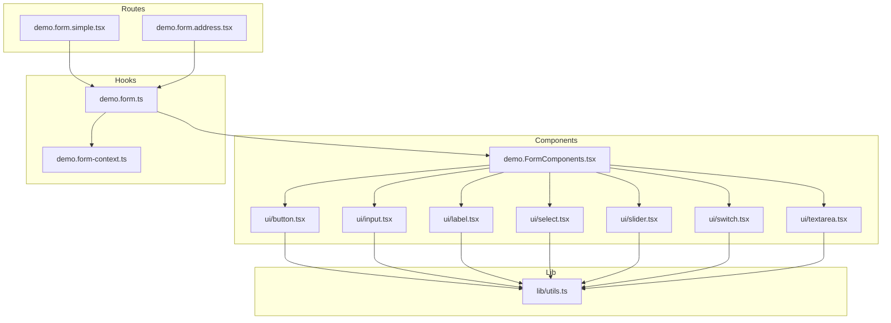
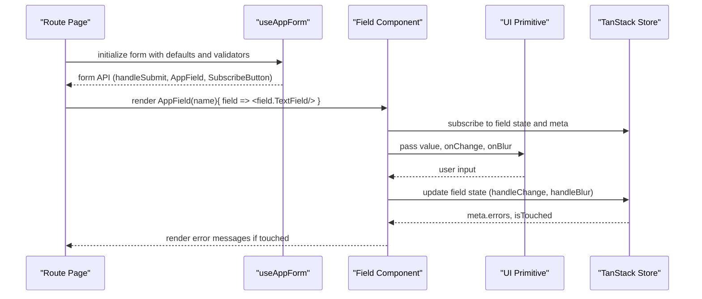
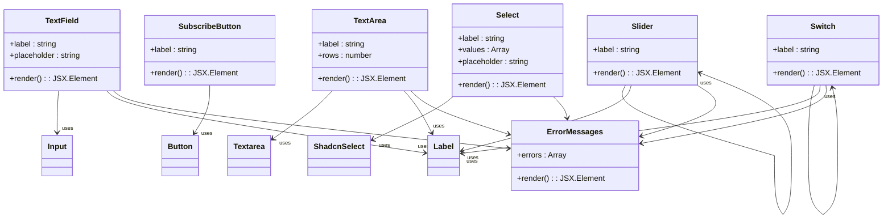
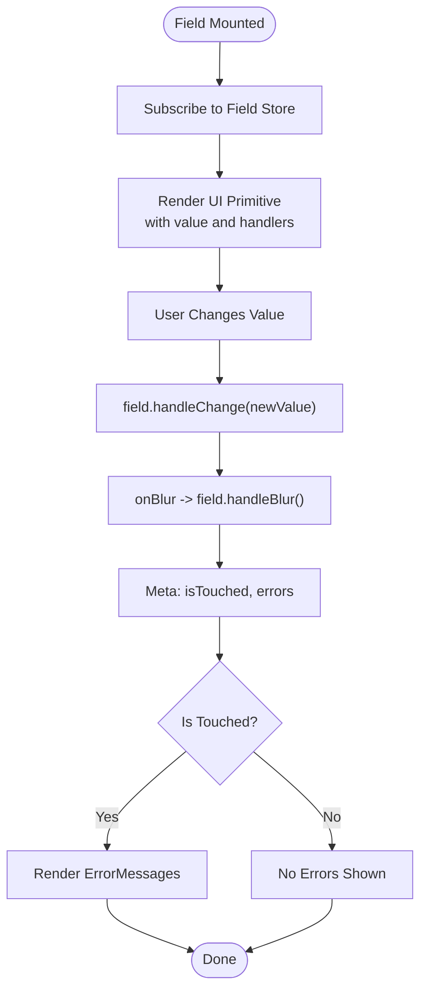
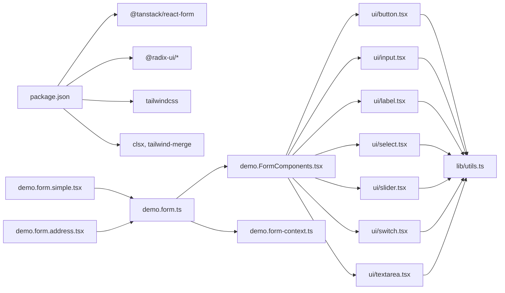

# Component Examples & Patterns

<cite>
**Referenced Files in This Document**
- [demo.FormComponents.tsx](file://src/components/demo.FormComponents.tsx)
- [button.tsx](file://src/components/ui/button.tsx)
- [input.tsx](file://src/components/ui/input.tsx)
- [label.tsx](file://src/components/ui/label.tsx)
- [select.tsx](file://src/components/ui/select.tsx)
- [slider.tsx](file://src/components/ui/slider.tsx)
- [switch.tsx](file://src/components/ui/switch.tsx)
- [textarea.tsx](file://src/components/ui/textarea.tsx)
- [demo.form-context.ts](file://src/hooks/demo.form-context.ts)
- [demo.form.ts](file://src/hooks/demo.form.ts)
- [demo.form.simple.tsx](file://src/routes/demo.form.simple.tsx)
- [demo.form.address.tsx](file://src/routes/demo.form.address.tsx)
- [utils.ts](file://src/lib/utils.ts)
- [components.json](file://components.json)
- [package.json](file://package.json)
</cite>

## Table of Contents
1. [Introduction](#introduction)
2. [Project Structure](#project-structure)
3. [Core Components](#core-components)
4. [Architecture Overview](#architecture-overview)
5. [Detailed Component Analysis](#detailed-component-analysis)
6. [Dependency Analysis](#dependency-analysis)
7. [Performance Considerations](#performance-considerations)
8. [Troubleshooting Guide](#troubleshooting-guide)
9. [Conclusion](#conclusion)
10. [Appendices](#appendices)

## Introduction
This document explains the component examples and UI patterns demonstrated in the CV Portfolio Builder, focusing on the form component suite showcased in demo.FormComponents.tsx. It documents how form inputs and controls are composed, styled with Tailwind CSS via shared utilities, validated, and integrated into form systems. The guide covers each UI component (button, input, label, select, slider, switch, textarea), their props, variants, composition patterns, accessibility, responsive design, state management integration, and best practices for building reusable, accessible, and maintainable form components.

## Project Structure
The form component examples are organized under the components and hooks directories, with UI primitives under components/ui and form orchestration under hooks. Routes demonstrate real-world usage with validation and submission.

**Diagram sources**
- [demo.FormComponents.tsx:1-159](file://src/components/demo.FormComponents.tsx#L1-L159)
- [button.tsx:1-58](file://src/components/ui/button.tsx#L1-L58)
- [input.tsx:1-22](file://src/components/ui/input.tsx#L1-L22)
- [label.tsx:1-22](file://src/components/ui/label.tsx#L1-L22)
- [select.tsx:1-169](file://src/components/ui/select.tsx#L1-L169)
- [slider.tsx:1-59](file://src/components/ui/slider.tsx#L1-L59)
- [switch.tsx:1-27](file://src/components/ui/switch.tsx#L1-L27)
- [textarea.tsx:1-19](file://src/components/ui/textarea.tsx#L1-L19)
- [demo.form-context.ts:1-5](file://src/hooks/demo.form-context.ts#L1-L5)
- [demo.form.ts:1-18](file://src/hooks/demo.form.ts#L1-L18)
- [demo.form.simple.tsx:1-69](file://src/routes/demo.form.simple.tsx#L1-L69)
- [demo.form.address.tsx:1-200](file://src/routes/demo.form.address.tsx#L1-L200)
- [utils.ts:1-8](file://src/lib/utils.ts#L1-L8)

**Section sources**
- [demo.FormComponents.tsx:1-159](file://src/components/demo.FormComponents.tsx#L1-L159)
- [demo.form-context.ts:1-5](file://src/hooks/demo.form-context.ts#L1-L5)
- [demo.form.ts:1-18](file://src/hooks/demo.form.ts#L1-L18)
- [demo.form.simple.tsx:1-69](file://src/routes/demo.form.simple.tsx#L1-L69)
- [demo.form.address.tsx:1-200](file://src/routes/demo.form.address.tsx#L1-L200)
- [utils.ts:1-8](file://src/lib/utils.ts#L1-L8)
- [components.json:1-22](file://components.json#L1-L22)
- [package.json:1-60](file://package.json#L1-L60)

## Core Components
This section documents each UI component used in the form examples, including props, variants, styling, accessibility, and usage patterns.

- Button
  - Purpose: Renders interactive buttons with consistent styling and variants.
  - Variants: default, destructive, outline, secondary, ghost, link.
  - Sizes: default, sm, lg, icon.
  - Props: variant, size, asChild, className, plus standard button attributes.
  - Accessibility: Inherits native button semantics; supports focus-visible ring and aria-invalid states.
  - Composition pattern: Wraps a slot element when asChild is true; integrates with form Subscribe components.
  - Example usage: Submit button in form examples.

- Input
  - Purpose: Standard single-line text input with consistent focus and invalid states.
  - Props: type, className, plus standard input attributes.
  - Accessibility: Focus-visible ring, aria-invalid integration, placeholder styling.
  - Styling: Uses shared cn utility for merging Tailwind classes.

- Label
  - Purpose: Associates text with form controls for improved accessibility.
  - Props: className, plus standard label attributes.
  - Accessibility: Uses Radix UI label primitive; supports disabled states and peer-disabled styles.

- Select
  - Purpose: Dropdown selection with trigger, content, item, and indicator components.
  - Props: Accepts all Radix Select primitives; exposes SelectTrigger with size variants.
  - Accessibility: Keyboard navigation, portal rendering, scroll buttons, and item indicators.
  - Styling: Trigger and content use shared cn utility; supports popper positioning.

- Slider
  - Purpose: Range slider for numeric values with track, range, and thumb visuals.
  - Props: min, max, defaultValue, value; supports vertical orientation via data attributes.
  - Accessibility: Radix UI slider; focus-visible ring and disabled states.

- Switch
  - Purpose: Toggle control with checked/unchecked states.
  - Props: className, plus standard switch attributes.
  - Accessibility: Radix UI switch; focus-visible ring and transitions for checked state.

- Textarea
  - Purpose: Multi-line text input with consistent focus and invalid states.
  - Props: className, plus standard textarea attributes.
  - Accessibility: Focus-visible ring, aria-invalid integration.

**Section sources**
- [button.tsx:1-58](file://src/components/ui/button.tsx#L1-L58)
- [input.tsx:1-22](file://src/components/ui/input.tsx#L1-L22)
- [label.tsx:1-22](file://src/components/ui/label.tsx#L1-L22)
- [select.tsx:1-169](file://src/components/ui/select.tsx#L1-L169)
- [slider.tsx:1-59](file://src/components/ui/slider.tsx#L1-L59)
- [switch.tsx:1-27](file://src/components/ui/switch.tsx#L1-L27)
- [textarea.tsx:1-19](file://src/components/ui/textarea.tsx#L1-L19)

## Architecture Overview
The form components are orchestrated by a custom hook that registers field and form components with TanStack React Form. Field components are thin wrappers around UI primitives that bind to form state, handle blur/change events, and render validation messages. The route pages define schemas and submit handlers, demonstrating composition patterns and validation strategies.

**Diagram sources**
- [demo.form.ts:1-18](file://src/hooks/demo.form.ts#L1-L18)
- [demo.form.simple.tsx:1-69](file://src/routes/demo.form.simple.tsx#L1-L69)
- [demo.form.address.tsx:1-200](file://src/routes/demo.form.address.tsx#L1-L200)
- [demo.FormComponents.tsx:1-159](file://src/components/demo.FormComponents.tsx#L1-L159)

**Section sources**
- [demo.form.ts:1-18](file://src/hooks/demo.form.ts#L1-L18)
- [demo.form.simple.tsx:1-69](file://src/routes/demo.form.simple.tsx#L1-L69)
- [demo.form.address.tsx:1-200](file://src/routes/demo.form.address.tsx#L1-L200)
- [demo.FormComponents.tsx:1-159](file://src/components/demo.FormComponents.tsx#L1-L159)

## Detailed Component Analysis

### Form Components Library
The demo.FormComponents.tsx exports reusable field components that wrap UI primitives and integrate with TanStack React Form. Each component:
- Retrieves the field context for the current form field.
- Subscribes to store state to access value, meta, and errors.
- Handles blur and change events to update form state.
- Conditionally renders validation messages after user interaction.

Key components:
- SubscribeButton: Renders a submit button bound to form submission state.
- TextField: Single-line input with label and error messaging.
- TextArea: Multi-line input with label and error messaging.
- Select: Dropdown with dynamic options and placeholder.
- Slider: Numeric slider with label and error messaging.
- Switch: Toggle with label and error messaging.

**Diagram sources**
- [demo.FormComponents.tsx:1-159](file://src/components/demo.FormComponents.tsx#L1-L159)
- [button.tsx:1-58](file://src/components/ui/button.tsx#L1-L58)
- [input.tsx:1-22](file://src/components/ui/input.tsx#L1-L22)
- [textarea.tsx:1-19](file://src/components/ui/textarea.tsx#L1-L19)
- [select.tsx:1-169](file://src/components/ui/select.tsx#L1-L169)
- [slider.tsx:1-59](file://src/components/ui/slider.tsx#L1-L59)
- [switch.tsx:1-27](file://src/components/ui/switch.tsx#L1-L27)
- [label.tsx:1-22](file://src/components/ui/label.tsx#L1-L22)

**Section sources**
- [demo.FormComponents.tsx:1-159](file://src/components/demo.FormComponents.tsx#L1-L159)

### Button Component
- Variants and sizes are defined via class variance authority and applied consistently across the UI.
- Supports asChild to render alternative host elements while preserving styling.
- Integrates with form Subscribe components to reflect submission state and disable behavior.

**Section sources**
- [button.tsx:1-58](file://src/components/ui/button.tsx#L1-L58)
- [demo.FormComponents.tsx:13-24](file://src/components/demo.FormComponents.tsx#L13-L24)

### Input Component
- Provides consistent focus-visible ring and aria-invalid styling.
- Accepts standard input props and merges classes via the shared cn utility.

**Section sources**
- [input.tsx:1-22](file://src/components/ui/input.tsx#L1-L22)
- [utils.ts:1-8](file://src/lib/utils.ts#L1-L8)

### Label Component
- Associates labels with form controls for accessibility.
- Supports disabled states and peer-disabled styles for downstream inputs.

**Section sources**
- [label.tsx:1-22](file://src/components/ui/label.tsx#L1-L22)

### Select Component
- Exposes Select, SelectTrigger, SelectValue, SelectContent, SelectGroup, SelectLabel, SelectItem, SelectSeparator, SelectScrollUpButton, SelectScrollDownButton.
- Trigger supports size variants; content uses portal rendering and scroll buttons.
- Integrates with form field updates via onValueChange.

**Section sources**
- [select.tsx:1-169](file://src/components/ui/select.tsx#L1-L169)
- [demo.FormComponents.tsx:82-118](file://src/components/demo.FormComponents.tsx#L82-L118)

### Slider Component
- Supports single and multi-value sliders via Radix UI.
- Visualizes track and range; applies focus-visible ring and disabled states.

**Section sources**
- [slider.tsx:1-59](file://src/components/ui/slider.tsx#L1-L59)
- [demo.FormComponents.tsx:120-138](file://src/components/demo.FormComponents.tsx#L120-L138)

### Switch Component
- Toggle control with smooth transitions between checked and unchecked states.
- Focus-visible ring and aria-invalid integration.

**Section sources**
- [switch.tsx:1-27](file://src/components/ui/switch.tsx#L1-L27)
- [demo.FormComponents.tsx:140-158](file://src/components/demo.FormComponents.tsx#L140-L158)

### Textarea Component
- Consistent focus-visible ring and aria-invalid styling.
- Accepts standard textarea props and merges classes via the shared cn utility.

**Section sources**
- [textarea.tsx:1-19](file://src/components/ui/textarea.tsx#L1-L19)
- [utils.ts:1-8](file://src/lib/utils.ts#L1-L8)

### Form Integration and Validation Patterns
- Field components subscribe to form state and render errors when fields are touched.
- Route pages define Zod schemas and per-field validators to enforce validation on blur.
- Complex nested fields (e.g., address) are supported with dot notation in field names.

**Diagram sources**
- [demo.FormComponents.tsx:26-59](file://src/components/demo.FormComponents.tsx#L26-L59)
- [demo.form.simple.tsx:8-27](file://src/routes/demo.form.simple.tsx#L8-L27)
- [demo.form.address.tsx:21-39](file://src/routes/demo.form.address.tsx#L21-L39)

**Section sources**
- [demo.FormComponents.tsx:26-59](file://src/components/demo.FormComponents.tsx#L26-L59)
- [demo.form.simple.tsx:8-27](file://src/routes/demo.form.simple.tsx#L8-L27)
- [demo.form.address.tsx:21-39](file://src/routes/demo.form.address.tsx#L21-L39)

### Practical Usage Examples
- Simple form: Demonstrates TextField and TextArea with basic Zod validation on blur and a submit handler.
- Address form: Demonstrates nested fields, per-field validators, grid layout for responsive grouping, and Select usage.

**Section sources**
- [demo.form.simple.tsx:1-69](file://src/routes/demo.form.simple.tsx#L1-L69)
- [demo.form.address.tsx:1-200](file://src/routes/demo.form.address.tsx#L1-L200)

### Styling and Tailwind CSS
- Shared cn utility merges classes and normalizes Tailwind conflicts.
- Components apply focus-visible rings, aria-invalid states, and dark mode variants.
- Select and Slider use data attributes to vary sizes and orientations.

**Section sources**
- [utils.ts:1-8](file://src/lib/utils.ts#L1-L8)
- [button.tsx:8-34](file://src/components/ui/button.tsx#L8-L34)
- [input.tsx:10-18](file://src/components/ui/input.tsx#L10-L18)
- [textarea.tsx:9-15](file://src/components/ui/textarea.tsx#L9-L15)
- [select.tsx:29-43](file://src/components/ui/select.tsx#L29-L43)
- [slider.tsx:28-33](file://src/components/ui/slider.tsx#L28-L33)

### Accessibility
- Labels associate with inputs via htmlFor/id.
- Radix UI primitives provide keyboard navigation, ARIA roles, and focus management.
- Focus-visible rings and aria-invalid states improve feedback for keyboard and assistive technology users.

**Section sources**
- [label.tsx:8-19](file://src/components/ui/label.tsx#L8-L19)
- [demo.FormComponents.tsx:41-59](file://src/components/demo.FormComponents.tsx#L41-L59)
- [select.tsx:1-169](file://src/components/ui/select.tsx#L1-L169)
- [slider.tsx:1-59](file://src/components/ui/slider.tsx#L1-L59)
- [switch.tsx:1-27](file://src/components/ui/switch.tsx#L1-L27)

### Responsive Design Patterns
- Grid layouts (e.g., md:grid-cols-3) adapt field groups to screen sizes.
- Input widths default to full width; Select triggers use flexible sizing.
- Content containers use max-width and padding to scale across devices.

**Section sources**
- [demo.form.address.tsx:93-136](file://src/routes/demo.form.address.tsx#L93-L136)

### State Management Integration
- Field components rely on TanStack React Form’s fieldContext and store subscriptions.
- Blur and change handlers update field state; validation runs on blur.
- Submit button reflects isSubmitting state to prevent duplicate submissions.

**Section sources**
- [demo.form-context.ts:1-5](file://src/hooks/demo.form-context.ts#L1-L5)
- [demo.form.ts:1-18](file://src/hooks/demo.form.ts#L1-L18)
- [demo.FormComponents.tsx:13-24](file://src/components/demo.FormComponents.tsx#L13-L24)

### Best Practices for Component Development
- Encapsulate UI primitives behind thin field components to centralize form binding and validation messaging.
- Use shared cn utility for consistent styling and to avoid Tailwind conflicts.
- Leverage Radix UI for robust accessibility and cross-browser compatibility.
- Keep validation logic close to the form page for clarity; use per-field validators for granular feedback.
- Prefer composition over duplication: reuse SubscribeButton and error messaging across field types.

**Section sources**
- [demo.FormComponents.tsx:1-159](file://src/components/demo.FormComponents.tsx#L1-L159)
- [demo.form.ts:1-18](file://src/hooks/demo.form.ts#L1-L18)
- [utils.ts:1-8](file://src/lib/utils.ts#L1-L8)

## Dependency Analysis
The form components depend on Radix UI primitives and TanStack React Form. Styling relies on Tailwind CSS and the shared cn utility. The demo routes depend on the form hook to register field and form components.

**Diagram sources**
- [package.json:15-43](file://package.json#L15-L43)
- [demo.form.ts:1-18](file://src/hooks/demo.form.ts#L1-L18)
- [demo.FormComponents.tsx:1-159](file://src/components/demo.FormComponents.tsx#L1-L159)
- [button.tsx:1-58](file://src/components/ui/button.tsx#L1-L58)
- [input.tsx:1-22](file://src/components/ui/input.tsx#L1-L22)
- [label.tsx:1-22](file://src/components/ui/label.tsx#L1-L22)
- [select.tsx:1-169](file://src/components/ui/select.tsx#L1-L169)
- [slider.tsx:1-59](file://src/components/ui/slider.tsx#L1-L59)
- [switch.tsx:1-27](file://src/components/ui/switch.tsx#L1-L27)
- [textarea.tsx:1-19](file://src/components/ui/textarea.tsx#L1-L19)
- [demo.form.simple.tsx:1-69](file://src/routes/demo.form.simple.tsx#L1-L69)
- [demo.form.address.tsx:1-200](file://src/routes/demo.form.address.tsx#L1-L200)
- [utils.ts:1-8](file://src/lib/utils.ts#L1-L8)

**Section sources**
- [package.json:15-43](file://package.json#L15-L43)
- [demo.form.ts:1-18](file://src/hooks/demo.form.ts#L1-L18)
- [demo.FormComponents.tsx:1-159](file://src/components/demo.FormComponents.tsx#L1-L159)

## Performance Considerations
- Memoization: Slider computes values once based on min/max/default values to avoid unnecessary re-renders.
- Conditional rendering: Error messages only render when fields are touched, reducing DOM work.
- Minimal subscriptions: Field components subscribe only to the state they need (value, meta.errors).
- Utility merging: Using twMerge with clsx prevents redundant classes and reduces CSS payload.

**Section sources**
- [slider.tsx:16-19](file://src/components/ui/slider.tsx#L16-L19)
- [demo.FormComponents.tsx:26-59](file://src/components/demo.FormComponents.tsx#L26-L59)
- [utils.ts:5-7](file://src/lib/utils.ts#L5-L7)

## Troubleshooting Guide
- Validation not triggering: Ensure onBlur validators are defined in the form initialization and that fields call handleBlur on blur.
- Errors not visible: Verify that fields check meta.isTouched before rendering ErrorMessages.
- Styling conflicts: Confirm that cn utility is used consistently and Tailwind CSS is configured properly.
- Select dropdown misalignment: Check SelectContent position and portal rendering; ensure trigger size matches content expectations.
- Disabled states: Confirm disabled props are passed to primitives and that focus rings are suppressed appropriately.

**Section sources**
- [demo.form.simple.tsx:19-27](file://src/routes/demo.form.simple.tsx#L19-L27)
- [demo.form.address.tsx:62-77](file://src/routes/demo.form.address.tsx#L62-L77)
- [demo.FormComponents.tsx:26-59](file://src/components/demo.FormComponents.tsx#L26-L59)
- [select.tsx:50-78](file://src/components/ui/select.tsx#L50-L78)
- [utils.ts:5-7](file://src/lib/utils.ts#L5-L7)

## Conclusion
The CV Portfolio Builder demonstrates a cohesive pattern for building accessible, responsive, and maintainable form components. By composing UI primitives behind thin field components, integrating with TanStack React Form, and leveraging shared styling utilities, the system achieves consistency, clarity, and extensibility. The examples showcase practical validation strategies, responsive layouts, and best practices for state management and accessibility.

## Appendices
- Configuration: Tailwind CSS is configured via components.json with aliases pointing to local components and utilities.
- Dependencies: The project depends on Radix UI primitives, TanStack React Form, Tailwind CSS, and related utilities.

**Section sources**
- [components.json:1-22](file://components.json#L1-L22)
- [package.json:15-43](file://package.json#L15-L43)