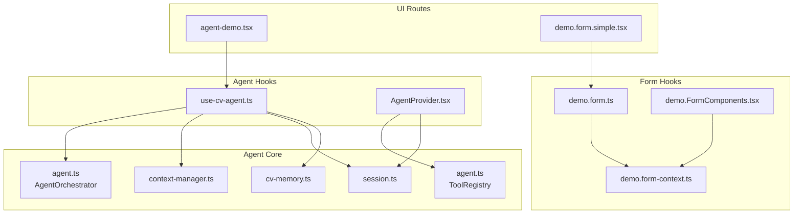
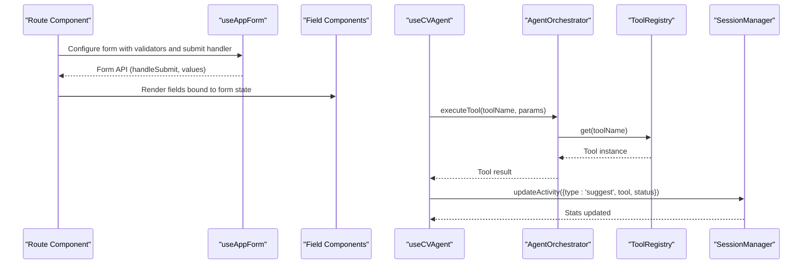
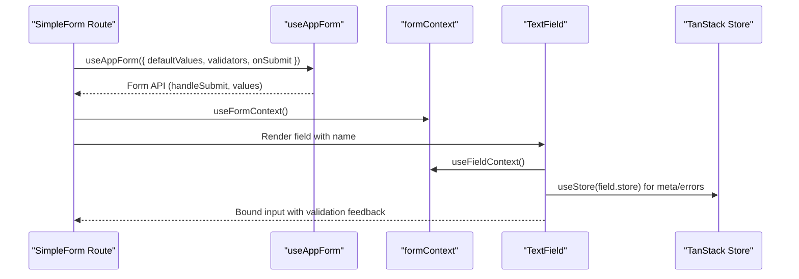
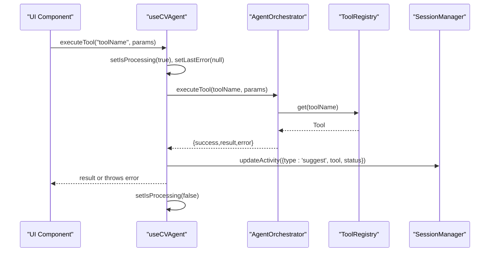
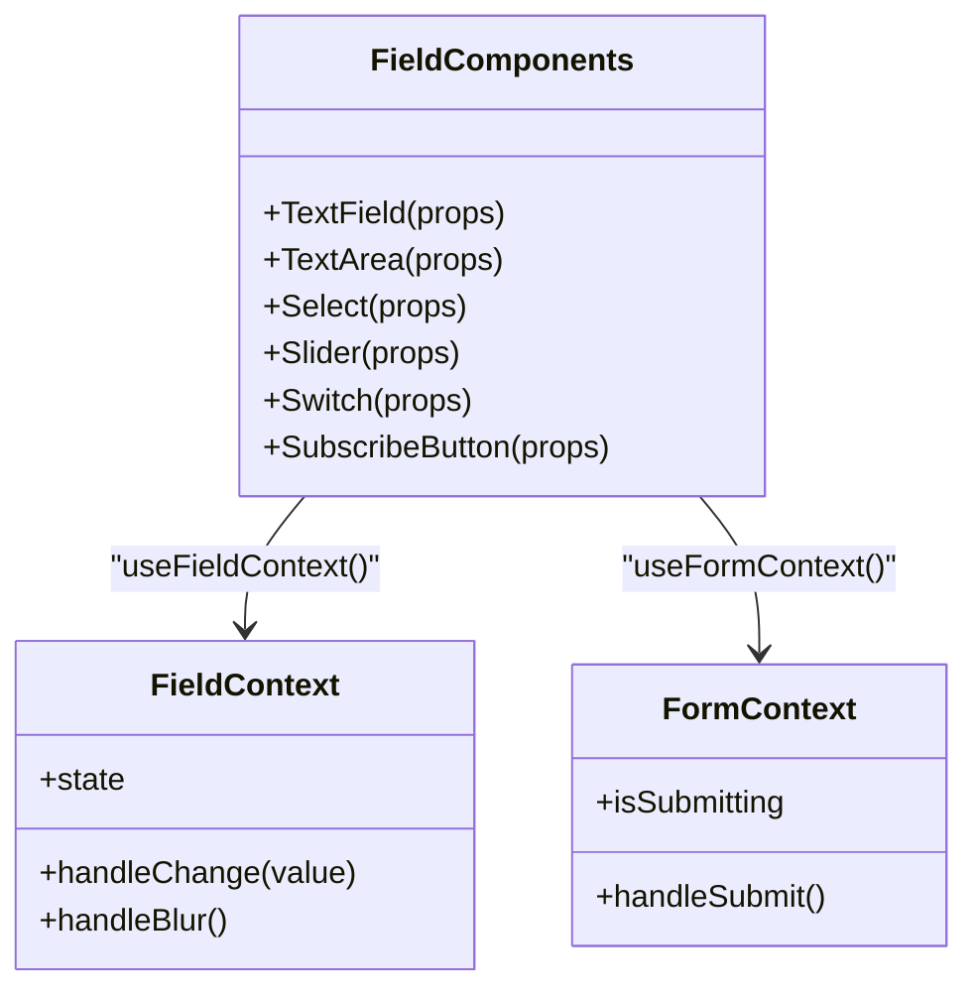
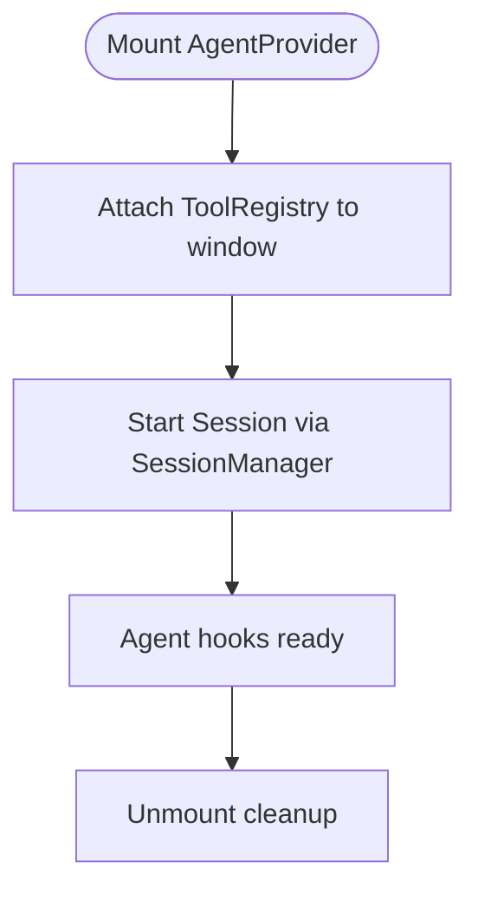
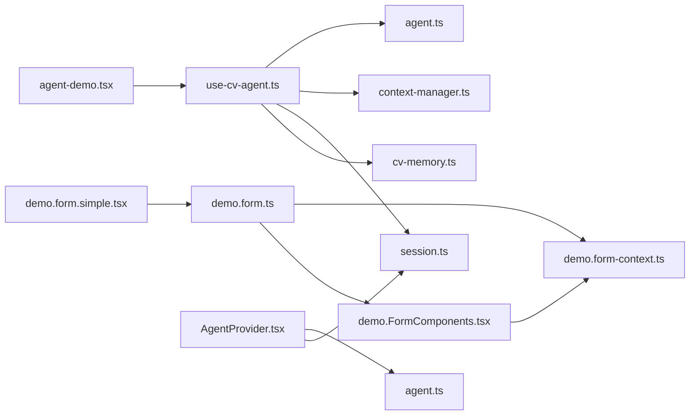

# Custom Hooks & Context Management

<cite>
**Referenced Files in This Document**
- [demo.form.ts](file://src/hooks/demo.form.ts)
- [demo.form-context.ts](file://src/hooks/demo.form-context.ts)
- [use-cv-agent.ts](file://src/hooks/use-cv-agent.ts)
- [demo.FormComponents.tsx](file://src/components/demo.FormComponents.tsx)
- [demo.form.simple.tsx](file://src/routes/demo.form.simple.tsx)
- [agent.ts](file://src/agent/core/agent.ts)
- [session.ts](file://src/agent/core/session.ts)
- [context-manager.ts](file://src/agent/memory/context-manager.ts)
- [cv-memory.ts](file://src/agent/memory/cv-memory.ts)
- [base-tool.ts](file://src/agent/tools/base-tool.ts)
- [AgentProvider.tsx](file://src/components/AgentProvider.tsx)
- [agent-demo.tsx](file://src/routes/agent-demo.tsx)
- [cv.schema.ts](file://src/agent/schemas/cv.schema.ts)
</cite>

## Table of Contents
1. [Introduction](#introduction)
2. [Project Structure](#project-structure)
3. [Core Components](#core-components)
4. [Architecture Overview](#architecture-overview)
5. [Detailed Component Analysis](#detailed-component-analysis)
6. [Dependency Analysis](#dependency-analysis)
7. [Performance Considerations](#performance-considerations)
8. [Troubleshooting Guide](#troubleshooting-guide)
9. [Conclusion](#conclusion)
10. [Appendices](#appendices)

## Introduction
This document explains the custom hooks system used in the CV Portfolio Builder, focusing on:
- Form handling hooks: demo.form.ts for complex form state management and demo.form-context.ts for context-aware form operations
- AI agent integration hooks: use-cv-agent.ts for orchestrating agent tasks, reactive CV data access, tool discovery, and session management
- Hook patterns, prop interfaces, and return value structures
- Practical usage examples, composition patterns, and integration with React 19 features
- Performance optimizations, memoization strategies, and best practices for building custom hooks

## Project Structure
The hooks system spans three primary areas:
- Form hooks: TanStack React Form integration via a typed form hook factory and reusable field components
- Agent hooks: React hooks that expose agent orchestration, reactive state, tool registry, and session utilities
- Supporting infrastructure: Agent orchestrator, session manager, context manager, and memory stores

**Diagram sources**
- [demo.form.ts:1-18](file://src/hooks/demo.form.ts#L1-L18)
- [demo.form-context.ts:1-5](file://src/hooks/demo.form-context.ts#L1-L5)
- [demo.FormComponents.tsx:1-159](file://src/components/demo.FormComponents.tsx#L1-L159)
- [use-cv-agent.ts:1-185](file://src/hooks/use-cv-agent.ts#L1-L185)
- [AgentProvider.tsx:1-30](file://src/components/AgentProvider.tsx#L1-L30)
- [agent.ts:1-414](file://src/agent/core/agent.ts#L1-L414)
- [session.ts:1-204](file://src/agent/core/session.ts#L1-L204)
- [context-manager.ts:1-141](file://src/agent/memory/context-manager.ts#L1-L141)
- [cv-memory.ts:1-291](file://src/agent/memory/cv-memory.ts#L1-L291)
- [agent-demo.tsx:1-138](file://src/routes/agent-demo.tsx#L1-L138)
- [demo.form.simple.tsx:1-69](file://src/routes/demo.form.simple.tsx#L1-L69)

**Section sources**
- [demo.form.ts:1-18](file://src/hooks/demo.form.ts#L1-L18)
- [demo.form-context.ts:1-5](file://src/hooks/demo.form-context.ts#L1-L5)
- [demo.FormComponents.tsx:1-159](file://src/components/demo.FormComponents.tsx#L1-L159)
- [use-cv-agent.ts:1-185](file://src/hooks/use-cv-agent.ts#L1-L185)
- [AgentProvider.tsx:1-30](file://src/components/AgentProvider.tsx#L1-L30)
- [agent.ts:1-414](file://src/agent/core/agent.ts#L1-L414)
- [session.ts:1-204](file://src/agent/core/session.ts#L1-L204)
- [context-manager.ts:1-141](file://src/agent/memory/context-manager.ts#L1-L141)
- [cv-memory.ts:1-291](file://src/agent/memory/cv-memory.ts#L1-L291)
- [agent-demo.tsx:1-138](file://src/routes/agent-demo.tsx#L1-L138)
- [demo.form.simple.tsx:1-69](file://src/routes/demo.form.simple.tsx#L1-L69)

## Core Components
- Form hooks
  - demo.form.ts: Creates a typed form hook with field and form components configured, exposing useAppForm
  - demo.form-context.ts: Exposes fieldContext and formContext for building reusable field components
  - demo.FormComponents.tsx: Reusable field components (TextField, TextArea, Select, Slider, Switch, SubscribeButton) that consume fieldContext and react to form state
- Agent hooks
  - use-cv-agent.ts: Provides executeTool, getSuggestions, runAnalysis, updateContext, exportState, plus reactive CV data and session utilities
  - AgentProvider.tsx: Initializes the global tool registry and starts a session for agent hooks to access

**Section sources**
- [demo.form.ts:1-18](file://src/hooks/demo.form.ts#L1-L18)
- [demo.form-context.ts:1-5](file://src/hooks/demo.form-context.ts#L1-L5)
- [demo.FormComponents.tsx:1-159](file://src/components/demo.FormComponents.tsx#L1-L159)
- [use-cv-agent.ts:1-185](file://src/hooks/use-cv-agent.ts#L1-L185)
- [AgentProvider.tsx:1-30](file://src/components/AgentProvider.tsx#L1-L30)

## Architecture Overview
The hooks integrate with a layered agent architecture:
- UI routes use form hooks to render forms and agent hooks to drive agent actions
- Agent hooks coordinate with AgentOrchestrator, ToolRegistry, ContextManager, SessionManager, and TanStack Store-backed memory

**Diagram sources**
- [demo.form.simple.tsx:1-69](file://src/routes/demo.form.simple.tsx#L1-L69)
- [demo.form.ts:1-18](file://src/hooks/demo.form.ts#L1-L18)
- [demo.FormComponents.tsx:1-159](file://src/components/demo.FormComponents.tsx#L1-L159)
- [use-cv-agent.ts:1-185](file://src/hooks/use-cv-agent.ts#L1-L185)
- [agent.ts:78-127](file://src/agent/core/agent.ts#L78-L127)
- [session.ts:57-70](file://src/agent/core/session.ts#L57-L70)

## Detailed Component Analysis

### Form Hooks: demo.form.ts and demo.form-context.ts
- Purpose
  - Provide a strongly-typed form hook factory integrated with TanStack React Form
  - Encapsulate field and form contexts for consistent, reusable field components
- Implementation highlights
  - demo.form.ts composes createFormHook with:
    - fieldComponents: TextField, Select, TextArea
    - formComponents: SubscribeButton
    - fieldContext and formContext from demo.form-context.ts
  - demo.form-context.ts exposes fieldContext, useFieldContext, formContext, and useFormContext
- Field components
  - demo.FormComponents.tsx consumes useFieldContext and useStore to bind UI controls to form fields, handle blur/change events, and display validation errors
- Usage pattern
  - Routes call useAppForm with defaultValues, validators, and onSubmit
  - JSX renders form.AppField and form.AppForm wrappers around field components and Submit button

**Diagram sources**
- [demo.form.simple.tsx:13-56](file://src/routes/demo.form.simple.tsx#L13-L56)
- [demo.form.ts:6-17](file://src/hooks/demo.form.ts#L6-L17)
- [demo.form-context.ts:3-4](file://src/hooks/demo.form-context.ts#L3-L4)
- [demo.FormComponents.tsx:41-58](file://src/components/demo.FormComponents.tsx#L41-L58)

**Section sources**
- [demo.form.ts:1-18](file://src/hooks/demo.form.ts#L1-L18)
- [demo.form-context.ts:1-5](file://src/hooks/demo.form-context.ts#L1-L5)
- [demo.FormComponents.tsx:1-159](file://src/components/demo.FormComponents.tsx#L1-L159)
- [demo.form.simple.tsx:1-69](file://src/routes/demo.form.simple.tsx#L1-L69)

### Agent Hooks: use-cv-agent.ts
- Purpose
  - Provide a cohesive API surface for agent-driven CV operations
  - Expose reactive CV data, tool availability, and session stats
- Key exports
  - useCVAgent: execution helpers, state flags, and export utilities
  - useCVData: reactive accessors for CV, context, completeness, skills, lastModified
  - useAgentTools: tool discovery and categorization
  - useSession: session stats, clearing, exporting, and activity status
- Execution flow
  - executeTool wraps AgentOrchestrator.executeTool with:
    - Loading state management
    - Error propagation and lastError updates
    - Session activity logging
  - getSuggestions and runAnalysis manage processing state and return structured results
  - updateContext delegates to ContextManager
  - exportState delegates to AgentOrchestrator
- Reactive data
  - useCVData reads from cvStore and derived stores for completeness and categorized skills
  - useAgentTools builds categories from a global tool registry exposed by AgentProvider
  - useSession periodically refreshes stats and exposes clear/export utilities

**Diagram sources**
- [use-cv-agent.ts:20-49](file://src/hooks/use-cv-agent.ts#L20-L49)
- [agent.ts:78-127](file://src/agent/core/agent.ts#L78-L127)
- [session.ts:57-70](file://src/agent/core/session.ts#L57-L70)

**Section sources**
- [use-cv-agent.ts:1-185](file://src/hooks/use-cv-agent.ts#L1-L185)
- [AgentProvider.tsx:1-30](file://src/components/AgentProvider.tsx#L1-L30)
- [agent.ts:1-414](file://src/agent/core/agent.ts#L1-L414)
- [session.ts:1-204](file://src/agent/core/session.ts#L1-L204)
- [context-manager.ts:1-141](file://src/agent/memory/context-manager.ts#L1-L141)
- [cv-memory.ts:1-291](file://src/agent/memory/cv-memory.ts#L1-L291)

### Context-Aware Field Components
- Purpose
  - Provide reusable, context-aware field components that automatically bind to form fields and reflect validation state
- Implementation
  - Each field component uses useFieldContext to access the current field’s state and handlers
  - Uses useStore to subscribe to field meta (errors, touched) and display validation messages
  - Integrates with UI primitives (Input, Textarea, Select, Slider, Switch) and labels

**Diagram sources**
- [demo.FormComponents.tsx:1-159](file://src/components/demo.FormComponents.tsx#L1-L159)
- [demo.form-context.ts:3-4](file://src/hooks/demo.form-context.ts#L3-L4)

**Section sources**
- [demo.FormComponents.tsx:1-159](file://src/components/demo.FormComponents.tsx#L1-L159)
- [demo.form-context.ts:1-5](file://src/hooks/demo.form-context.ts#L1-L5)

### Agent Provider and Tool Registry
- Purpose
  - Initialize the global tool registry and session lifecycle for agent hooks
- Behavior
  - On mount, attaches ToolRegistry to window for hooks to discover tools
  - Starts a session via SessionManager
  - Cleans up on unmount

**Diagram sources**
- [AgentProvider.tsx:12-26](file://src/components/AgentProvider.tsx#L12-L26)
- [session.ts:33-52](file://src/agent/core/session.ts#L33-L52)

**Section sources**
- [AgentProvider.tsx:1-30](file://src/components/AgentProvider.tsx#L1-L30)
- [session.ts:1-204](file://src/agent/core/session.ts#L1-L204)

## Dependency Analysis
- Form hooks depend on:
  - TanStack React Form factories and contexts
  - Field components that depend on fieldContext and formContext
- Agent hooks depend on:
  - AgentOrchestrator for tool execution
  - ToolRegistry for tool discovery
  - ContextManager for user context
  - SessionManager for session stats and persistence
  - TanStack Store-backed cvStore for reactive CV data
- UI routes depend on:
  - Form hooks for rendering forms
  - Agent hooks for agent-driven features

**Diagram sources**
- [demo.form.ts:1-18](file://src/hooks/demo.form.ts#L1-L18)
- [demo.form-context.ts:1-5](file://src/hooks/demo.form-context.ts#L1-L5)
- [demo.FormComponents.tsx:1-159](file://src/components/demo.FormComponents.tsx#L1-L159)
- [use-cv-agent.ts:1-185](file://src/hooks/use-cv-agent.ts#L1-L185)
- [agent.ts:1-414](file://src/agent/core/agent.ts#L1-L414)
- [session.ts:1-204](file://src/agent/core/session.ts#L1-L204)
- [context-manager.ts:1-141](file://src/agent/memory/context-manager.ts#L1-L141)
- [cv-memory.ts:1-291](file://src/agent/memory/cv-memory.ts#L1-L291)
- [AgentProvider.tsx:1-30](file://src/components/AgentProvider.tsx#L1-L30)
- [agent-demo.tsx:1-138](file://src/routes/agent-demo.tsx#L1-L138)
- [demo.form.simple.tsx:1-69](file://src/routes/demo.form.simple.tsx#L1-L69)

**Section sources**
- [demo.form.ts:1-18](file://src/hooks/demo.form.ts#L1-L18)
- [demo.form-context.ts:1-5](file://src/hooks/demo.form-context.ts#L1-L5)
- [demo.FormComponents.tsx:1-159](file://src/components/demo.FormComponents.tsx#L1-L159)
- [use-cv-agent.ts:1-185](file://src/hooks/use-cv-agent.ts#L1-L185)
- [agent.ts:1-414](file://src/agent/core/agent.ts#L1-L414)
- [session.ts:1-204](file://src/agent/core/session.ts#L1-L204)
- [context-manager.ts:1-141](file://src/agent/memory/context-manager.ts#L1-L141)
- [cv-memory.ts:1-291](file://src/agent/memory/cv-memory.ts#L1-L291)
- [AgentProvider.tsx:1-30](file://src/components/AgentProvider.tsx#L1-L30)
- [agent-demo.tsx:1-138](file://src/routes/agent-demo.tsx#L1-L138)
- [demo.form.simple.tsx:1-69](file://src/routes/demo.form.simple.tsx#L1-L69)

## Performance Considerations
- Memoization and callbacks
  - useCVAgent: executeTool, getSuggestions, runAnalysis, updateContext, and exportState are wrapped in useCallback to prevent unnecessary re-renders
  - useAgentTools: toolsByCategory uses useMemo to avoid rebuilding categories on every render
  - useSession: periodic stats updates use a cleanup effect to clear intervals
- Store subscriptions
  - useCVData uses targeted selectors to subscribe only to relevant slices of cvStore, minimizing re-renders
- Validation and error handling
  - Form components subscribe only to field meta (errors, touched) to keep renders lightweight
- Recommendations
  - Keep hook dependencies minimal and stable
  - Prefer useMemo/useCallback for derived computations and event handlers
  - Use targeted store selectors to avoid full-state subscriptions
  - Debounce or throttle frequent updates (e.g., live suggestions) to reduce workload

[No sources needed since this section provides general guidance]

## Troubleshooting Guide
- Form validation not triggering
  - Ensure validators are configured on the form and fields are rendered inside form.AppField wrappers
  - Verify field components call field.handleChange and field.handleBlur
- Tool execution fails silently
  - Check lastError returned by useCVAgent and inspect thrown errors
  - Confirm ToolRegistry is initialized by AgentProvider and tools are registered
- Context not updating
  - Use updateContext from useCVAgent or ContextManager directly
  - Ensure context updates are persisted via session/activity logs
- Session stats not refreshing
  - Confirm AgentProvider started the session and the interval effect is mounted
  - Verify localStorage availability for session persistence

**Section sources**
- [demo.form.simple.tsx:13-27](file://src/routes/demo.form.simple.tsx#L13-L27)
- [demo.FormComponents.tsx:41-58](file://src/components/demo.FormComponents.tsx#L41-L58)
- [use-cv-agent.ts:20-49](file://src/hooks/use-cv-agent.ts#L20-L49)
- [AgentProvider.tsx:12-26](file://src/components/AgentProvider.tsx#L12-L26)
- [session.ts:57-70](file://src/agent/core/session.ts#L57-L70)

## Conclusion
The custom hooks system combines TanStack React Form for robust form handling with a powerful agent orchestration layer for intelligent CV management. By encapsulating context, state, and tool execution behind well-defined hooks, the system achieves:
- Strong typing and reusable field components
- Reactive, efficient state access
- Clear separation of concerns between UI, form logic, and agent orchestration
Adhering to the patterns documented here ensures maintainability, performance, and extensibility as the system evolves.

[No sources needed since this section summarizes without analyzing specific files]

## Appendices

### Hook Patterns and Best Practices
- Keep hooks focused on a single responsibility (e.g., form state, agent orchestration, reactive data)
- Use useCallback and useMemo to stabilize references and reduce re-renders
- Prefer targeted store selectors to minimize subscription overhead
- Centralize initialization (e.g., AgentProvider) to ensure globals are available to hooks
- Document prop interfaces and return value shapes for clarity and type safety

[No sources needed since this section provides general guidance]

### Practical Usage Examples
- Form usage
  - Configure useAppForm with defaultValues, validators, and onSubmit
  - Render fields via form.AppField and submit via form.AppForm wrappers
- Agent usage
  - Call executeTool with tool name and parameters; handle lastError and isProcessing
  - Use useCVData to access reactive CV state and completeness metrics
  - Use useAgentTools to discover and categorize available tools
  - Use useSession to monitor session stats and export session data

**Section sources**
- [demo.form.simple.tsx:13-56](file://src/routes/demo.form.simple.tsx#L13-L56)
- [use-cv-agent.ts:95-103](file://src/hooks/use-cv-agent.ts#L95-L103)
- [agent-demo.tsx:17-41](file://src/routes/agent-demo.tsx#L17-L41)