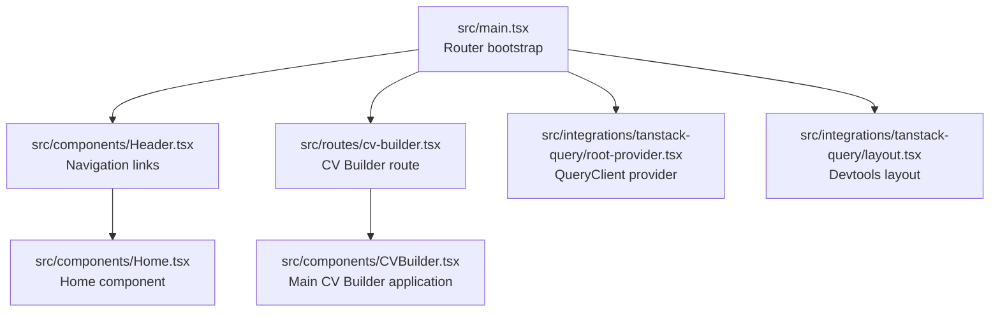
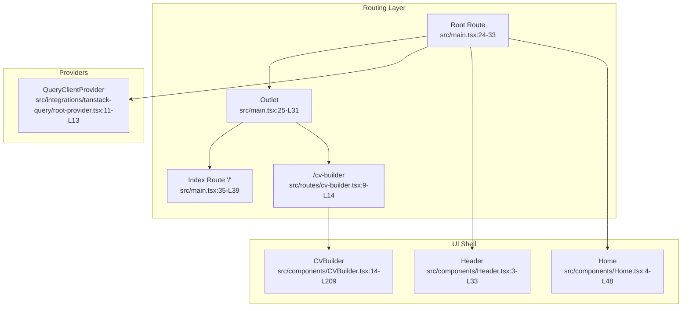
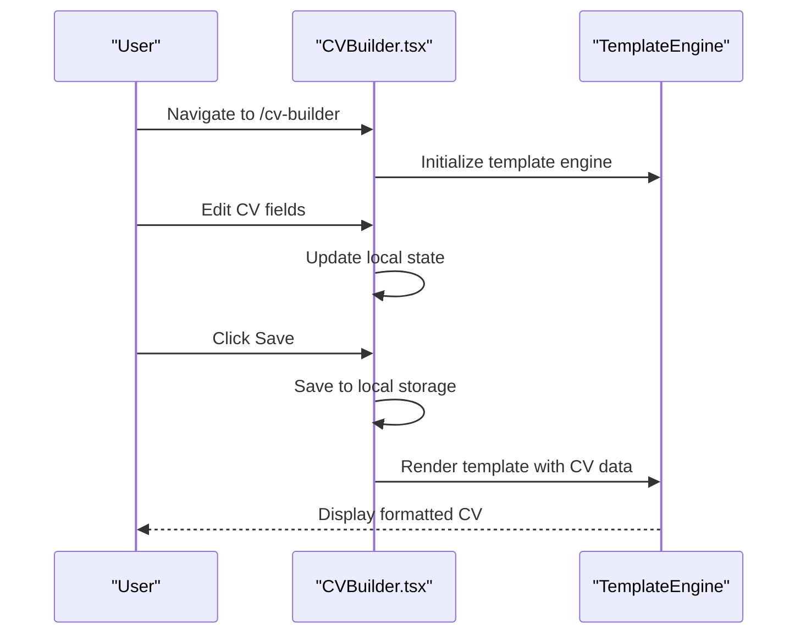
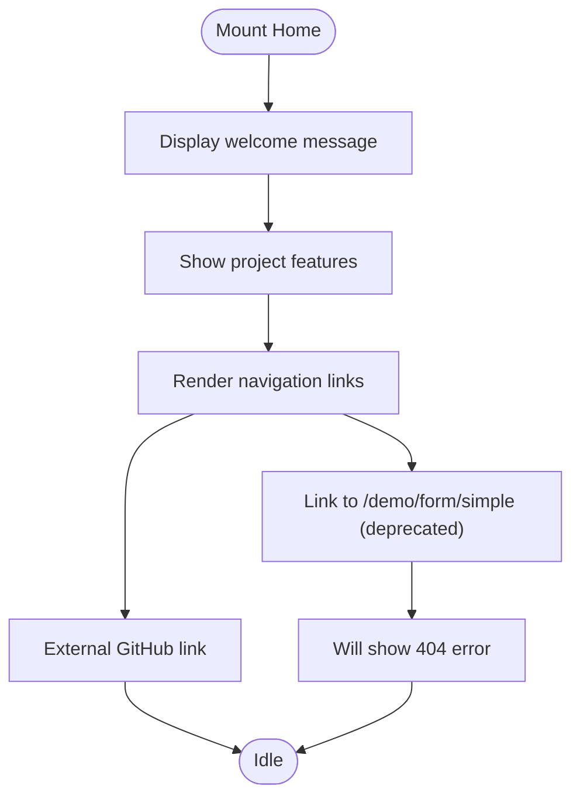
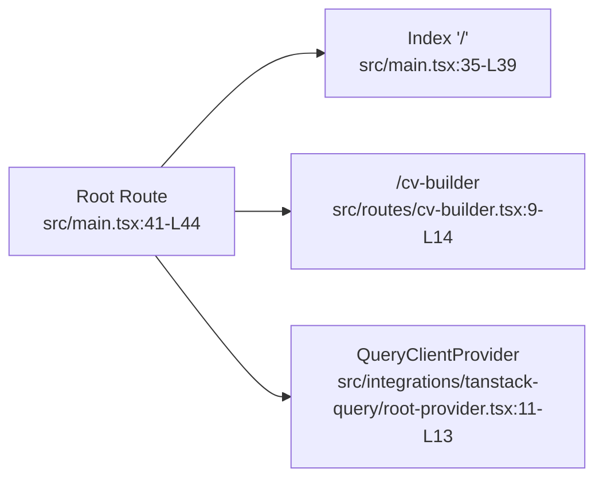

# Demo Routes & Navigation

<cite>
**Referenced Files in This Document**
- [src/main.tsx](file://src/main.tsx)
- [src/App.tsx](file://src/App.tsx)
- [src/components/Header.tsx](file://src/components/Header.tsx)
- [src/components/Home.tsx](file://src/components/Home.tsx)
- [src/components/CVBuilder.tsx](file://src/components/CVBuilder.tsx)
- [src/routes/cv-builder.tsx](file://src/routes/cv-builder.tsx)
- [src/integrations/tanstack-query/root-provider.tsx](file://src/integrations/tanstack-query/root-provider.tsx)
- [src/integrations/tanstack-query/layout.tsx](file://src/integrations/tanstack-query/layout.tsx)
</cite>

## Update Summary
**Changes Made**
- Removed all references to demo routes as they have been completely removed from the codebase
- Updated routing architecture to reflect the simplified production-only structure
- Revised component analysis to focus exclusively on CV Builder application
- Removed all demo-related dependencies and providers from routing configuration
- Consolidated documentation to align with the current single-route CV Builder system

## Table of Contents
1. [Introduction](#introduction)
2. [Project Structure](#project-structure)
3. [Core Components](#core-components)
4. [Architecture Overview](#architecture-overview)
5. [Detailed Component Analysis](#detailed-component-analysis)
6. [Dependency Analysis](#dependency-analysis)
7. [Performance Considerations](#performance-considerations)
8. [Troubleshooting Guide](#troubleshooting-guide)
9. [Conclusion](#conclusion)
10. [Appendices](#appendices)

## Introduction
This document explains the current routing system for the CV Portfolio Builder application. The system has been streamlined to focus exclusively on production-ready functionality, eliminating the previous demo routes and components. The routing architecture is built with TanStack Router, featuring component composition patterns and navigation flows centered around the CV Builder application.

**Updated** The demo system has been completely removed from the codebase as part of a cleanup effort to focus development on core CV Builder functionality.

## Project Structure
The routing system is now simplified to a single CV Builder route with basic navigation. The main application integrates TanStack Router with TanStack Query providers and a shared header for navigation.

**Diagram sources**
- [src/main.tsx:41-44](file://src/main.tsx#L41-L44)
- [src/components/Header.tsx:1-34](file://src/components/Header.tsx#L1-L34)
- [src/routes/cv-builder.tsx:1-15](file://src/routes/cv-builder.tsx#L1-L15)
- [src/integrations/tanstack-query/root-provider.tsx:1-14](file://src/integrations/tanstack-query/root-provider.tsx#L1-L14)
- [src/integrations/tanstack-query/layout.tsx:1-6](file://src/integrations/tanstack-query/layout.tsx#L1-L6)
- [src/components/Home.tsx:1-49](file://src/components/Home.tsx#L1-L49)
- [src/components/CVBuilder.tsx:1-200](file://src/components/CVBuilder.tsx#L1-L200)

**Section sources**
- [src/main.tsx:41-44](file://src/main.tsx#L41-L44)
- [src/components/Header.tsx:1-34](file://src/components/Header.tsx#L1-L34)

## Core Components
- Routing and navigation: TanStack Router defines routes and mounts them under a root route with a shared outlet and devtools. The header provides navigational links to the CV Builder application.
- CV Builder application: Complete resume/portfolio creation workflow with AI assistant integration and template rendering capabilities.
- TanStack Query integration: Provides a QueryClient provider and devtools layout for data fetching and caching.

**Updated** The routing system now consists of only two routes: the home page and the CV Builder application, with all demo functionality removed.

**Section sources**
- [src/main.tsx:41-44](file://src/main.tsx#L41-L44)
- [src/components/Header.tsx:1-34](file://src/components/Header.tsx#L1-L34)
- [src/routes/cv-builder.tsx:9-14](file://src/routes/cv-builder.tsx#L9-L14)
- [src/components/CVBuilder.tsx:14-209](file://src/components/CVBuilder.tsx#L14-L209)

## Architecture Overview
The routing system is structured around a simplified single-page application with:
- A root route that renders a shared header and outlet
- A single child route for the CV Builder application
- Providers for TanStack Query
- A home component for the landing page

**Diagram sources**
- [src/main.tsx:24-33](file://src/main.tsx#L24-L33)
- [src/routes/cv-builder.tsx:9-14](file://src/routes/cv-builder.tsx#L9-L14)
- [src/integrations/tanstack-query/root-provider.tsx:11-13](file://src/integrations/tanstack-query/root-provider.tsx#L11-L13)
- [src/components/Header.tsx:3-33](file://src/components/Header.tsx#L3-L33)
- [src/components/Home.tsx:4-48](file://src/components/Home.tsx#L4-L48)
- [src/components/CVBuilder.tsx:14-209](file://src/components/CVBuilder.tsx#L14-L209)

## Detailed Component Analysis

### CV Builder Application
The CV Builder route provides a complete resume/portfolio creation workflow with AI assistant integration and template rendering capabilities.

**Diagram sources**
- [src/routes/cv-builder.tsx:9-14](file://src/routes/cv-builder.tsx#L9-L14)
- [src/components/CVBuilder.tsx:14-209](file://src/components/CVBuilder.tsx#L14-L209)

**Section sources**
- [src/routes/cv-builder.tsx:9-14](file://src/routes/cv-builder.tsx#L9-L14)
- [src/components/CVBuilder.tsx:14-209](file://src/components/CVBuilder.tsx#L14-L209)

### Home Component
The home component serves as the landing page with navigation links and contribution instructions.

**Diagram sources**
- [src/components/Home.tsx:4-48](file://src/components/Home.tsx#L4-L48)

**Section sources**
- [src/components/Home.tsx:4-48](file://src/components/Home.tsx#L4-L48)

## Dependency Analysis
The routing tree is constructed in the application entry point and includes only the CV Builder route. Providers are attached at the root to make QueryClient available to all routes.

**Updated** The routing tree now contains only two routes: the index route and the CV Builder route, with all demo routes removed.

**Diagram sources**
- [src/main.tsx:41-44](file://src/main.tsx#L41-L44)
- [src/routes/cv-builder.tsx:9-14](file://src/routes/cv-builder.tsx#L9-L14)
- [src/integrations/tanstack-query/root-provider.tsx:11-13](file://src/integrations/tanstack-query/root-provider.tsx#L11-L13)

**Section sources**
- [src/main.tsx:41-44](file://src/main.tsx#L41-L44)

## Performance Considerations
- TanStack Router
  - Structural sharing is enabled by default to reduce unnecessary re-renders.
  - Preloading is configured to trigger on intent, balancing responsiveness and resource usage.
- TanStack Query
  - Configure staleTime and cacheTime appropriately to balance freshness and performance.
  - Use placeholder initialData to improve perceived performance during hydration.

**Updated** Performance considerations now apply to the simplified routing system with reduced bundle size and faster builds.

## Troubleshooting Guide
- Navigation to demo routes fails
  - All demo routes (`/demo/form/simple`, `/demo/form/address`, `/demo/store`, `/demo/table`, `/demo/tanstack-query`) have been removed from the codebase.
  - These routes will show 404 errors as they no longer exist.
- CV Builder not working
  - Ensure the CV Builder route is properly configured and the component imports are correct.
  - Verify that all required dependencies for the CV Builder are installed.
- TanStack Query not rendering data
  - Confirm QueryClientProvider is present at the root.
  - Verify queryKey uniqueness and queryFn correctness.

**Updated** Troubleshooting guidance now focuses on the current production routes and components.

**Section sources**
- [src/components/Header.tsx:12-29](file://src/components/Header.tsx#L12-L29)
- [src/routes/cv-builder.tsx:9-14](file://src/routes/cv-builder.tsx#L9-L14)
- [src/integrations/tanstack-query/root-provider.tsx:11-13](file://src/integrations/tanstack-query/root-provider.tsx#L11-L13)

## Conclusion
The routing system has been successfully streamlined to focus exclusively on production-ready CV Builder functionality. The removal of demo routes has resulted in a cleaner codebase, better performance, and easier maintenance. The current architecture supports a clear separation between the home page and the main CV Builder application, with proper integration of TanStack Query for data management.

**Updated** The conclusion reflects the successful completion of the demo removal process and the establishment of a focused, production-ready routing system.

## Appendices

### How to Add New Routes (Production Context)
Since the demo system has been removed, any new routes should focus on enhancing the CV Builder application or related functionality:

- Add a new route
  - Create a new route module exporting a function that accepts the root route and returns a configured route.
  - Import the route module in the application entry point and add it to the route tree.
- Compose components
  - Build reusable UI components and hooks similar to the existing CV Builder components.
  - Wrap components with appropriate providers when external services are required.
- Integrate TanStack Query
  - Wrap the router with the QueryClientProvider at the root.
  - Use useQuery in route components to fetch and render data.

**Updated** Extension guidance now applies to the current production-focused routing system.

**Section sources**
- [src/main.tsx:41-44](file://src/main.tsx#L41-L44)
- [src/integrations/tanstack-query/root-provider.tsx:5-13](file://src/integrations/tanstack-query/root-provider.tsx#L5-L13)