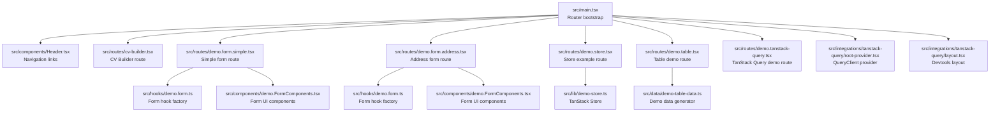
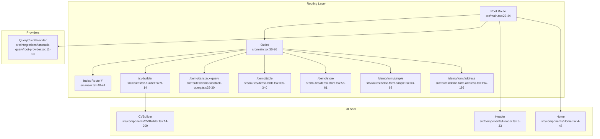
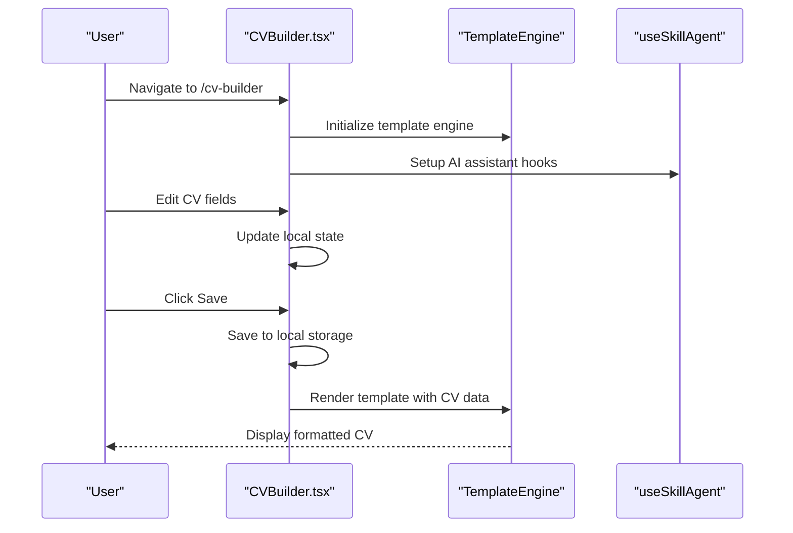
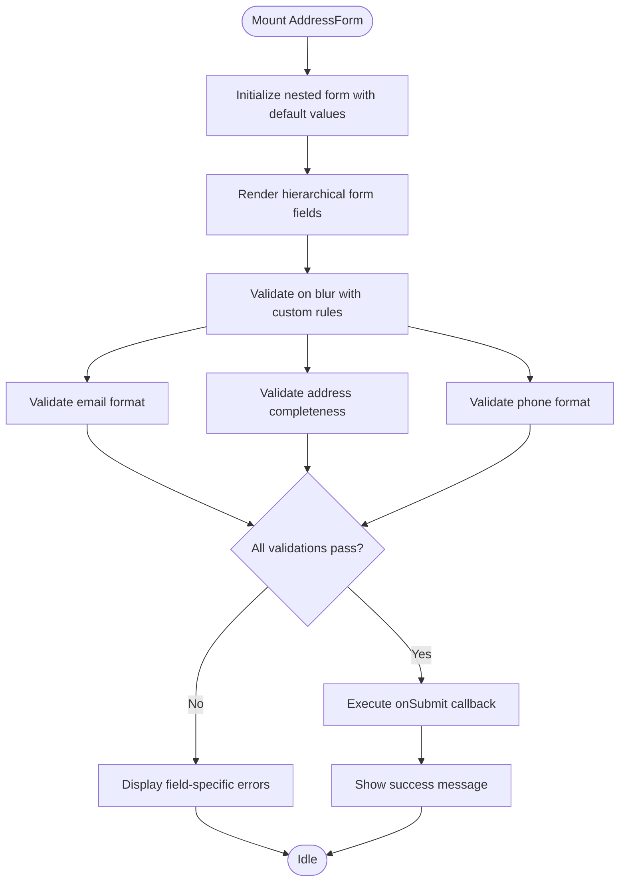
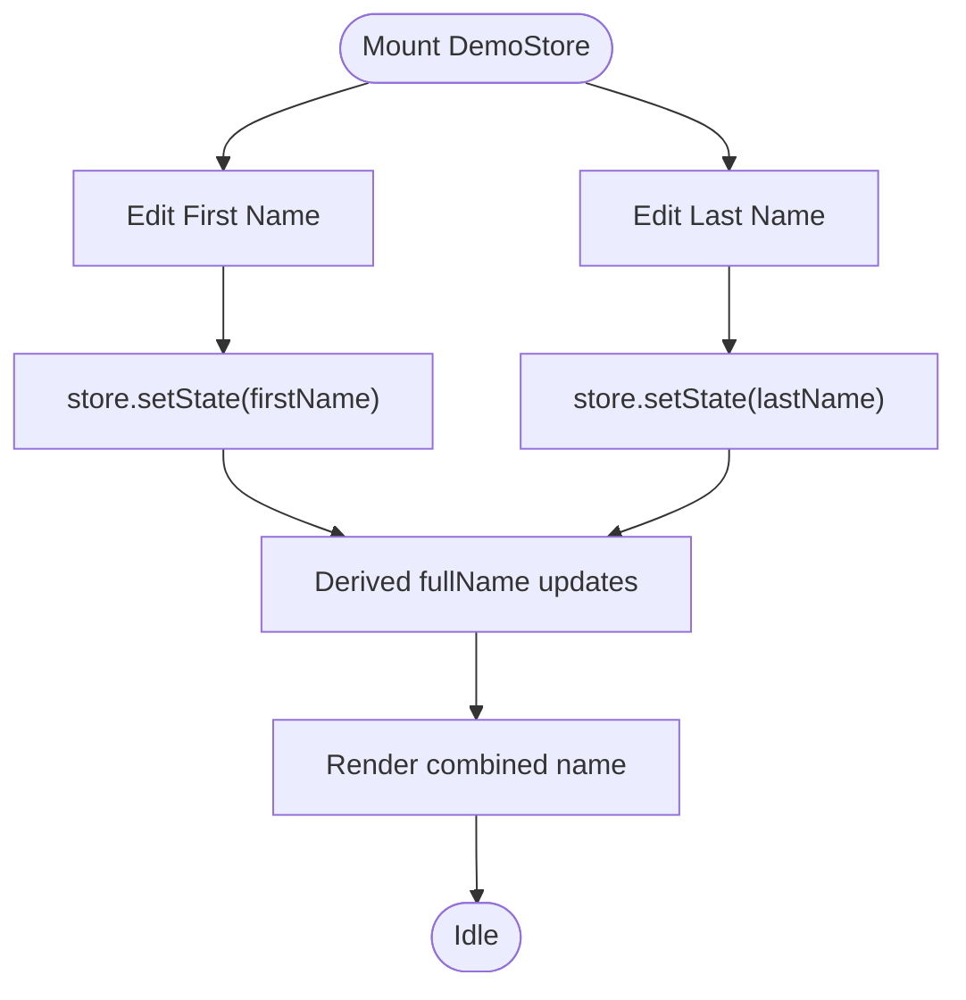
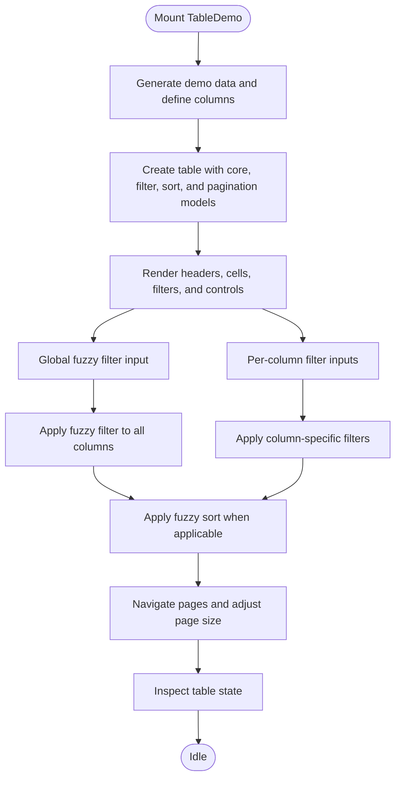
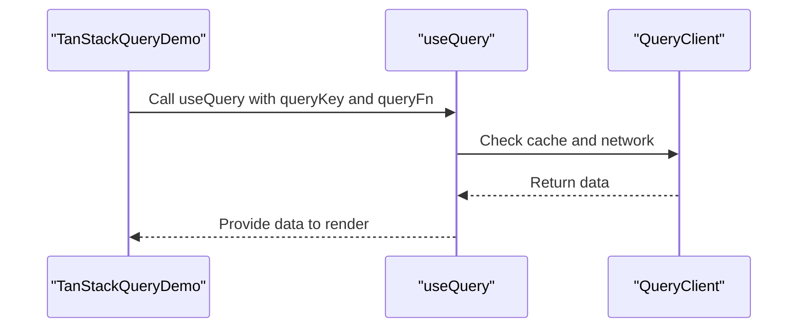
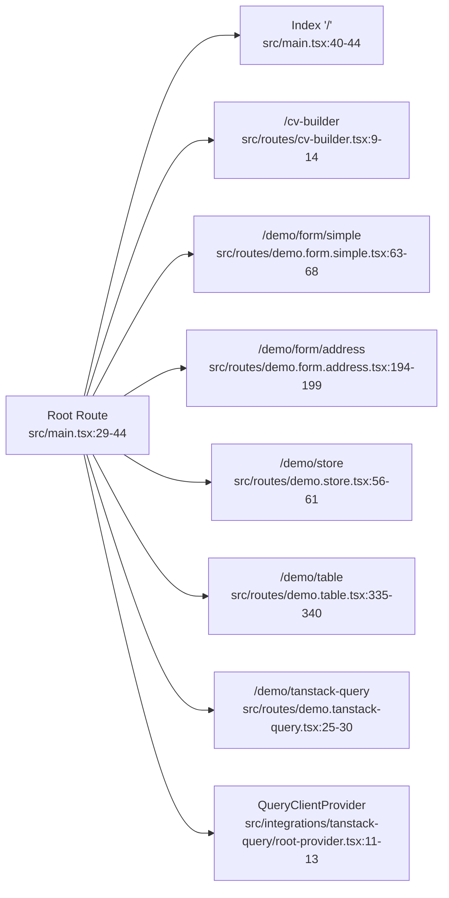

# Demo Routes & Navigation

<cite>
**Referenced Files in This Document**
- [src/main.tsx](file://src/main.tsx)
- [src/App.tsx](file://src/App.tsx)
- [src/components/Header.tsx](file://src/components/Header.tsx)
- [src/components/CVBuilder.tsx](file://src/components/CVBuilder.tsx)
- [src/components/Home.tsx](file://src/components/Home.tsx)
- [src/routes/cv-builder.tsx](file://src/routes/cv-builder.tsx)
- [src/routes/demo.form.simple.tsx](file://src/routes/demo.form.simple.tsx)
- [src/routes/demo.form.address.tsx](file://src/routes/demo.form.address.tsx)
- [src/routes/demo.store.tsx](file://src/routes/demo.store.tsx)
- [src/routes/demo.table.tsx](file://src/routes/demo.table.tsx)
- [src/routes/demo.tanstack-query.tsx](file://src/routes/demo.tanstack-query.tsx)
- [src/hooks/demo.form.ts](file://src/hooks/demo.form.ts)
- [src/components/demo.FormComponents.tsx](file://src/components/demo.FormComponents.tsx)
- [src/lib/demo-store.ts](file://src/lib/demo-store.ts)
- [src/integrations/tanstack-query/root-provider.tsx](file://src/integrations/tanstack-query/root-provider.tsx)
- [src/integrations/tanstack-query/layout.tsx](file://src/integrations/tanstack-query/layout.tsx)
- [src/data/demo-table-data.ts](file://src/data/demo-table-data.ts)
</cite>

## Update Summary
**Changes Made**
- Removed all references to the experimental AI agent demo route (agent-demo.tsx)
- Updated routing architecture to focus on production-ready CV Builder application
- Revised component analysis to exclude agent dashboard and chat interface
- Updated navigation structure to reflect current demo routes only
- Removed agent-related dependencies and providers from routing configuration

## Table of Contents
1. [Introduction](#introduction)
2. [Project Structure](#project-structure)
3. [Core Components](#core-components)
4. [Architecture Overview](#architecture-overview)
5. [Detailed Component Analysis](#detailed-component-analysis)
6. [Dependency Analysis](#dependency-analysis)
7. [Performance Considerations](#performance-considerations)
8. [Troubleshooting Guide](#troubleshooting-guide)
9. [Conclusion](#conclusion)
10. [Appendices](#appendices)

## Introduction
This document explains the Demo Routes system that showcases CV Portfolio Builder functionality. The system focuses on production-ready components and demonstrates:
- Form examples: UI component testing with typed forms and validation
- Store management examples: Reactive state management with TanStack Store
- Table operations: Advanced client-side filtering, sorting, pagination, and fuzzy search
- TanStack Query integration: Data fetching and caching with devtools
- CV Builder application: Complete resume/portfolio creation workflow

The routing architecture is built with TanStack Router, featuring component composition patterns and navigation flows. Each demo route serves as a focused example of specific functionality, demonstrating best practices for form handling, state management, data visualization, and integration patterns.

## Project Structure
The demo routes are defined under the routes directory and mounted into the TanStack Router tree in the application entry point. The main application integrates TanStack Router with TanStack Query providers and a shared header for navigation.

**Diagram sources**
- [src/main.tsx:29-65](file://src/main.tsx#L29-L65)
- [src/components/Header.tsx:1-34](file://src/components/Header.tsx#L1-L34)
- [src/routes/cv-builder.tsx:1-15](file://src/routes/cv-builder.tsx#L1-L15)
- [src/routes/demo.form.simple.tsx:1-69](file://src/routes/demo.form.simple.tsx#L1-L69)
- [src/routes/demo.form.address.tsx:1-200](file://src/routes/demo.form.address.tsx#L1-L200)
- [src/routes/demo.store.tsx:1-62](file://src/routes/demo.store.tsx#L1-L62)
- [src/routes/demo.table.tsx:1-341](file://src/routes/demo.table.tsx#L1-L341)
- [src/routes/demo.tanstack-query.tsx:1-31](file://src/routes/demo.tanstack-query.tsx#L1-L31)
- [src/integrations/tanstack-query/root-provider.tsx:1-14](file://src/integrations/tanstack-query/root-provider.tsx#L1-L14)
- [src/integrations/tanstack-query/layout.tsx:1-6](file://src/integrations/tanstack-query/layout.tsx#L1-L6)
- [src/hooks/demo.form.ts:1-18](file://src/hooks/demo.form.ts#L1-L18)
- [src/components/demo.FormComponents.tsx:1-159](file://src/components/demo.FormComponents.tsx#L1-L159)
- [src/lib/demo-store.ts:1-14](file://src/lib/demo-store.ts#L1-L14)
- [src/data/demo-table-data.ts:1-47](file://src/data/demo-table-data.ts#L1-L47)

**Section sources**
- [src/main.tsx:29-65](file://src/main.tsx#L29-L65)
- [src/components/Header.tsx:1-34](file://src/components/Header.tsx#L1-L34)

## Core Components
- Routing and navigation: TanStack Router defines routes and mounts them under a root route with a shared outlet and devtools. The header provides navigational links to demo pages.
- Form examples: Demonstrates typed form creation, validation, and submission via a form hook factory and reusable UI components. Includes both simple and complex nested form scenarios.
- Store management: Uses TanStack Store for reactive state with derived values and direct updates.
- Table operations: Implements advanced table features including client-side filtering, fuzzy search, sorting, pagination, and debounced inputs.
- TanStack Query integration: Provides a QueryClient provider and devtools layout for data fetching and caching.
- CV Builder application: Complete resume/portfolio creation workflow with AI assistant integration and template rendering.

**Section sources**
- [src/main.tsx:29-65](file://src/main.tsx#L29-L65)
- [src/components/Header.tsx:1-34](file://src/components/Header.tsx#L1-L34)
- [src/routes/cv-builder.tsx:9-14](file://src/routes/cv-builder.tsx#L9-L14)
- [src/routes/demo.form.simple.tsx:13-68](file://src/routes/demo.form.simple.tsx#L13-L68)
- [src/routes/demo.form.address.tsx:7-199](file://src/routes/demo.form.address.tsx#L7-L199)
- [src/routes/demo.store.tsx:37-61](file://src/routes/demo.store.tsx#L37-L61)
- [src/routes/demo.table.tsx:66-340](file://src/routes/demo.table.tsx#L66-L340)
- [src/routes/demo.tanstack-query.tsx:6-30](file://src/routes/demo.tanstack-query.tsx#L6-L30)

## Architecture Overview
The demo system is structured around a single-page application with:
- A root route that renders a shared header and outlet
- Child routes for each demo area including CV Builder
- Providers for TanStack Query
- Reusable UI components and hooks

**Diagram sources**
- [src/main.tsx:29-65](file://src/main.tsx#L29-L65)
- [src/routes/cv-builder.tsx:9-14](file://src/routes/cv-builder.tsx#L9-L14)
- [src/routes/demo.tanstack-query.tsx:25-30](file://src/routes/demo.tanstack-query.tsx#L25-L30)
- [src/routes/demo.table.tsx:335-340](file://src/routes/demo.table.tsx#L335-L340)
- [src/routes/demo.store.tsx:56-61](file://src/routes/demo.store.tsx#L56-L61)
- [src/routes/demo.form.simple.tsx:63-68](file://src/routes/demo.form.simple.tsx#L63-L68)
- [src/routes/demo.form.address.tsx:194-199](file://src/routes/demo.form.address.tsx#L194-L199)
- [src/integrations/tanstack-query/root-provider.tsx:11-13](file://src/integrations/tanstack-query/root-provider.tsx#L11-L13)
- [src/components/Header.tsx:3-33](file://src/components/Header.tsx#L3-L33)
- [src/components/Home.tsx:4-48](file://src/components/Home.tsx#L4-L48)
- [src/components/CVBuilder.tsx:14-209](file://src/components/CVBuilder.tsx#L14-L209)

## Detailed Component Analysis

### CV Builder Application
The CV Builder route provides a complete resume/portfolio creation workflow with AI assistant integration and template rendering capabilities.

**Diagram sources**
- [src/routes/cv-builder.tsx:9-14](file://src/routes/cv-builder.tsx#L9-L14)
- [src/components/CVBuilder.tsx:14-209](file://src/components/CVBuilder.tsx#L14-L209)

**Section sources**
- [src/routes/cv-builder.tsx:9-14](file://src/routes/cv-builder.tsx#L9-L14)
- [src/components/CVBuilder.tsx:14-209](file://src/components/CVBuilder.tsx#L14-L209)

### Form Examples Route
The simple form route demonstrates typed validation, controlled field updates, and submission handling using a form hook factory and reusable UI components.

**Diagram sources**
- [src/routes/demo.form.simple.tsx:13-68](file://src/routes/demo.form.simple.tsx#L13-L68)
- [src/hooks/demo.form.ts:6-17](file://src/hooks/demo.form.ts#L6-L17)
- [src/components/demo.FormComponents.tsx:41-79](file://src/components/demo.FormComponents.tsx#L41-L79)

**Section sources**
- [src/routes/demo.form.simple.tsx:13-68](file://src/routes/demo.form.simple.tsx#L13-L68)
- [src/hooks/demo.form.ts:6-17](file://src/hooks/demo.form.ts#L6-L17)
- [src/components/demo.FormComponents.tsx:13-159](file://src/components/demo.FormComponents.tsx#L13-L159)

### Address Form Route
The address form demonstrates complex nested form handling with conditional validation and multi-field coordination.

**Diagram sources**
- [src/routes/demo.form.address.tsx:7-199](file://src/routes/demo.form.address.tsx#L7-L199)
- [src/hooks/demo.form.ts:6-17](file://src/hooks/demo.form.ts#L6-L17)
- [src/components/demo.FormComponents.tsx:82-118](file://src/components/demo.FormComponents.tsx#L82-L118)

**Section sources**
- [src/routes/demo.form.address.tsx:7-199](file://src/routes/demo.form.address.tsx#L7-L199)
- [src/hooks/demo.form.ts:6-17](file://src/hooks/demo.form.ts#L6-L17)
- [src/components/demo.FormComponents.tsx:82-118](file://src/components/demo.FormComponents.tsx#L82-L118)

### Store Management Example
The store route demonstrates reactive state updates and derived values using TanStack Store.

**Diagram sources**
- [src/routes/demo.store.tsx:37-61](file://src/routes/demo.store.tsx#L37-L61)
- [src/lib/demo-store.ts:3-14](file://src/lib/demo-store.ts#L3-L14)

**Section sources**
- [src/routes/demo.store.tsx:8-61](file://src/routes/demo.store.tsx#L8-L61)
- [src/lib/demo-store.ts:3-14](file://src/lib/demo-store.ts#L3-L14)

### Table Operations
The table demo showcases advanced client-side features: fuzzy filtering, custom sorting, pagination, debounced inputs, and state inspection.

**Diagram sources**
- [src/routes/demo.table.tsx:66-340](file://src/routes/demo.table.tsx#L66-L340)
- [src/data/demo-table-data.ts:34-46](file://src/data/demo-table-data.ts#L34-L46)

**Section sources**
- [src/routes/demo.table.tsx:29-340](file://src/routes/demo.table.tsx#L29-L340)
- [src/data/demo-table-data.ts:3-46](file://src/data/demo-table-data.ts#L3-L46)

### TanStack Query Integration
The TanStack Query demo route fetches data using a React Query hook and renders a simple list.

**Diagram sources**
- [src/routes/demo.tanstack-query.tsx:6-23](file://src/routes/demo.tanstack-query.tsx#L6-L23)
- [src/integrations/tanstack-query/root-provider.tsx:3-9](file://src/integrations/tanstack-query/root-provider.tsx#L3-L9)

**Section sources**
- [src/routes/demo.tanstack-query.tsx:6-30](file://src/routes/demo.tanstack-query.tsx#L6-L30)
- [src/integrations/tanstack-query/root-provider.tsx:5-13](file://src/integrations/tanstack-query/root-provider.tsx#L5-L13)
- [src/integrations/tanstack-query/layout.tsx:3-5](file://src/integrations/tanstack-query/layout.tsx#L3-L5)

## Dependency Analysis
The routing tree is constructed in the application entry point and includes all demo routes. Providers are attached at the root to make QueryClient available to all routes.

**Diagram sources**
- [src/main.tsx:46-54](file://src/main.tsx#L46-L54)
- [src/routes/cv-builder.tsx:9-14](file://src/routes/cv-builder.tsx#L9-L14)
- [src/routes/demo.form.simple.tsx:63-68](file://src/routes/demo.form.simple.tsx#L63-L68)
- [src/routes/demo.form.address.tsx:194-199](file://src/routes/demo.form.address.tsx#L194-L199)
- [src/routes/demo.store.tsx:56-61](file://src/routes/demo.store.tsx#L56-L61)
- [src/routes/demo.table.tsx:335-340](file://src/routes/demo.table.tsx#L335-L340)
- [src/routes/demo.tanstack-query.tsx:25-30](file://src/routes/demo.tanstack-query.tsx#L25-L30)
- [src/integrations/tanstack-query/root-provider.tsx:11-13](file://src/integrations/tanstack-query/root-provider.tsx#L11-L13)

**Section sources**
- [src/main.tsx:46-65](file://src/main.tsx#L46-L65)

## Performance Considerations
- TanStack Router
  - Structural sharing is enabled by default to reduce unnecessary re-renders.
  - Preloading is configured to trigger on intent, balancing responsiveness and resource usage.
- TanStack Store
  - Derived values compute derived state efficiently; avoid excessive recomputation by keeping selectors minimal.
- TanStack Table
  - Debounced inputs prevent frequent re-filtering; consider virtualization for very large datasets.
  - Pagination reduces rendering overhead for large datasets.
- TanStack Query
  - Configure staleTime and cacheTime appropriately to balance freshness and performance.
  - Use placeholder initialData to improve perceived performance during hydration.

## Troubleshooting Guide
- Form validation not triggering
  - Confirm validators are defined and bound to the form hook factory.
  - Ensure field wrappers are used to propagate meta state and errors.
- Store updates not reflected
  - Verify state updates use setState with correct paths and that derived values depend on the right stores.
- Table filters not applied
  - Check that custom fuzzy filter and sort functions are registered and used in column definitions.
  - Ensure debounced inputs are debouncing appropriately to avoid rapid re-renders.
- TanStack Query not rendering data
  - Confirm QueryClientProvider is present at the root.
  - Verify queryKey uniqueness and queryFn correctness.
- CV Builder not displaying templates
  - Ensure TemplateEngine is properly initialized and templates are loaded.
  - Verify CV data structure matches template expectations.

**Section sources**
- [src/hooks/demo.form.ts:6-17](file://src/hooks/demo.form.ts#L6-L17)
- [src/components/demo.FormComponents.tsx:26-39](file://src/components/demo.FormComponents.tsx#L26-L39)
- [src/lib/demo-store.ts:3-14](file://src/lib/demo-store.ts#L3-L14)
- [src/routes/demo.table.tsx:29-64](file://src/routes/demo.table.tsx#L29-L64)
- [src/routes/demo.tanstack-query.tsx:6-23](file://src/routes/demo.tanstack-query.tsx#L6-L23)
- [src/integrations/tanstack-query/root-provider.tsx:11-13](file://src/integrations/tanstack-query/root-provider.tsx#L11-L13)
- [src/components/CVBuilder.tsx:14-209](file://src/components/CVBuilder.tsx#L14-L209)

## Conclusion
The Demo Routes system demonstrates a cohesive pattern for building interactive, component-driven demos with TanStack Router, TanStack Store, TanStack Table, and TanStack Query. The architecture supports clear separation of concerns, reusable components, and scalable navigation. The system now focuses exclusively on production-ready functionality while maintaining extensibility for future enhancements.

## Appendices

### How to Extend the Demo System
- Add a new route
  - Create a new route module exporting a function that accepts the root route and returns a configured route.
  - Import the route module in the application entry point and add it to the route tree.
- Compose components
  - Build reusable UI components and hooks similar to the existing form components.
  - Wrap components with appropriate providers when external services are required.
- Integrate TanStack Query
  - Wrap the router with the QueryClientProvider at the root.
  - Use useQuery in route components to fetch and render data.
- Lazy loading strategies
  - Use dynamic imports for route components to defer loading until navigation.
  - Combine with route-based preloading to balance performance and UX.

**Section sources**
- [src/main.tsx:46-65](file://src/main.tsx#L46-L65)
- [src/integrations/tanstack-query/root-provider.tsx:5-13](file://src/integrations/tanstack-query/root-provider.tsx#L5-L13)