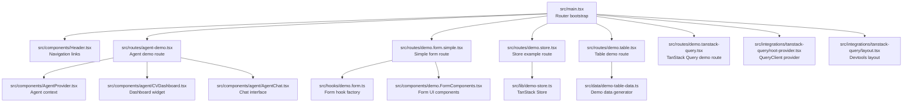
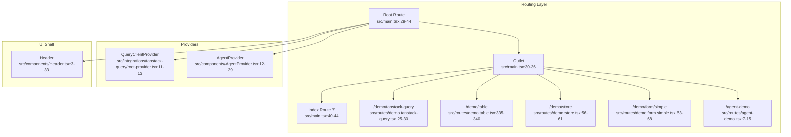
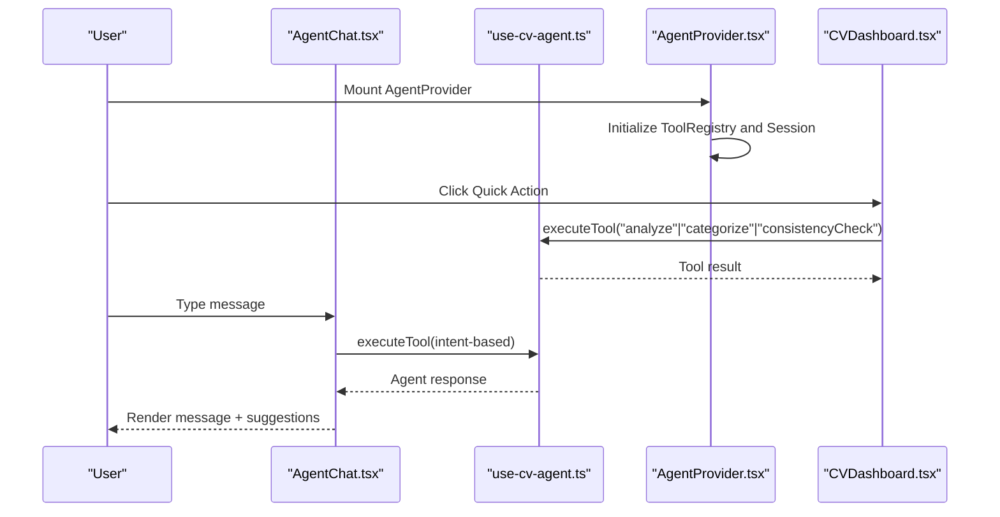
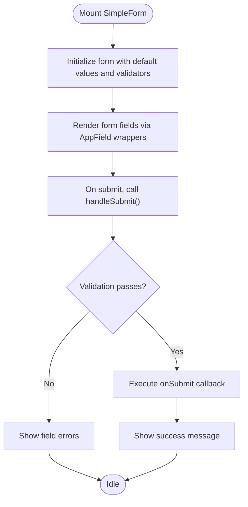
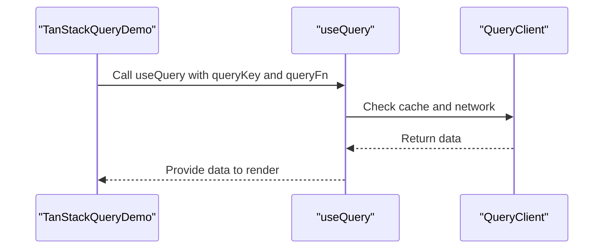
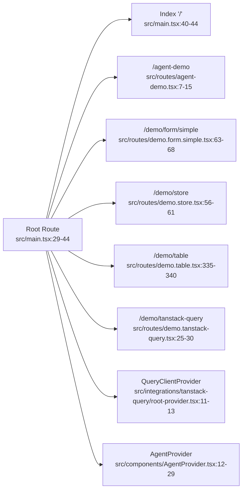

# Demo Routes & Navigation

<cite>
**Referenced Files in This Document**
- [src/main.tsx](file://src/main.tsx)
- [src/App.tsx](file://src/App.tsx)
- [src/components/Header.tsx](file://src/components/Header.tsx)
- [src/routes/agent-demo.tsx](file://src/routes/agent-demo.tsx)
- [src/routes/demo.form.simple.tsx](file://src/routes/demo.form.simple.tsx)
- [src/routes/demo.store.tsx](file://src/routes/demo.store.tsx)
- [src/routes/demo.table.tsx](file://src/routes/demo.table.tsx)
- [src/routes/demo.tanstack-query.tsx](file://src/routes/demo.tanstack-query.tsx)
- [src/components/agent/AgentChat.tsx](file://src/components/agent/AgentChat.tsx)
- [src/components/agent/CVDashboard.tsx](file://src/components/agent/CVDashboard.tsx)
- [src/components/AgentProvider.tsx](file://src/components/AgentProvider.tsx)
- [src/hooks/use-cv-agent.ts](file://src/hooks/use-cv-agent.ts)
- [src/components/demo.FormComponents.tsx](file://src/components/demo.FormComponents.tsx)
- [src/hooks/demo.form.ts](file://src/hooks/demo.form.ts)
- [src/lib/demo-store.ts](file://src/lib/demo-store.ts)
- [src/integrations/tanstack-query/root-provider.tsx](file://src/integrations/tanstack-query/root-provider.tsx)
- [src/integrations/tanstack-query/layout.tsx](file://src/integrations/tanstack-query/layout.tsx)
- [src/data/demo-table-data.ts](file://src/data/demo-table-data.ts)
</cite>

## Table of Contents
1. [Introduction](#introduction)
2. [Project Structure](#project-structure)
3. [Core Components](#core-components)
4. [Architecture Overview](#architecture-overview)
5. [Detailed Component Analysis](#detailed-component-analysis)
6. [Dependency Analysis](#dependency-analysis)
7. [Performance Considerations](#performance-considerations)
8. [Troubleshooting Guide](#troubleshooting-guide)
9. [Conclusion](#conclusion)
10. [Appendices](#appendices)

## Introduction
This document explains the Demo Routes system that showcases CV Portfolio Builder functionality. It covers the routing architecture built with TanStack Router, component composition patterns, and navigation flows. It documents each demo route, including:
- Agent demo: AI agent demonstration with a dashboard and chat interface
- Form examples: UI component testing with typed forms and validation
- Store management examples: Reactive state management with TanStack Store
- Table operations: Advanced client-side filtering, sorting, pagination, and fuzzy search
- TanStack Query integration: Data fetching and caching with devtools

It also provides practical guidance on extending the demo system with new routes and components, route configuration, lazy loading strategies, and integration with the main application.

## Project Structure
The demo routes are defined under the routes directory and mounted into the TanStack Router tree in the application entry point. The main application integrates TanStack Router with TanStack Query providers and a shared header for navigation.

**Diagram sources**
- [src/main.tsx:29-65](file://src/main.tsx#L29-L65)
- [src/components/Header.tsx:1-34](file://src/components/Header.tsx#L1-L34)
- [src/routes/agent-demo.tsx:1-138](file://src/routes/agent-demo.tsx#L1-L138)
- [src/routes/demo.form.simple.tsx:1-69](file://src/routes/demo.form.simple.tsx#L1-L69)
- [src/routes/demo.store.tsx:1-62](file://src/routes/demo.store.tsx#L1-L62)
- [src/routes/demo.table.tsx:1-341](file://src/routes/demo.table.tsx#L1-L341)
- [src/routes/demo.tanstack-query.tsx:1-31](file://src/routes/demo.tanstack-query.tsx#L1-L31)
- [src/integrations/tanstack-query/root-provider.tsx:1-14](file://src/integrations/tanstack-query/root-provider.tsx#L1-L14)
- [src/integrations/tanstack-query/layout.tsx:1-6](file://src/integrations/tanstack-query/layout.tsx#L1-L6)
- [src/components/AgentProvider.tsx:1-30](file://src/components/AgentProvider.tsx#L1-L30)
- [src/components/agent/CVDashboard.tsx:1-175](file://src/components/agent/CVDashboard.tsx#L1-L175)
- [src/components/agent/AgentChat.tsx:1-239](file://src/components/agent/AgentChat.tsx#L1-L239)
- [src/hooks/demo.form.ts:1-18](file://src/hooks/demo.form.ts#L1-L18)
- [src/components/demo.FormComponents.tsx:1-159](file://src/components/demo.FormComponents.tsx#L1-L159)
- [src/lib/demo-store.ts:1-14](file://src/lib/demo-store.ts#L1-L14)
- [src/data/demo-table-data.ts:1-47](file://src/data/demo-table-data.ts#L1-L47)

**Section sources**
- [src/main.tsx:29-65](file://src/main.tsx#L29-L65)
- [src/components/Header.tsx:1-34](file://src/components/Header.tsx#L1-L34)

## Core Components
- Routing and navigation: TanStack Router defines routes and mounts them under a root route with a shared outlet and devtools. The header provides navigational links to demo pages.
- Agent demo: Composed of a dashboard widget and a chat interface, both powered by agent hooks and a shared AgentProvider.
- Form examples: Demonstrates typed form creation, validation, and submission via a form hook factory and reusable UI components.
- Store management: Uses TanStack Store for reactive state with derived values and direct updates.
- Table operations: Implements advanced table features including client-side filtering, fuzzy search, sorting, pagination, and debounced inputs.
- TanStack Query integration: Provides a QueryClient provider and devtools layout for data fetching and caching.

**Section sources**
- [src/main.tsx:29-65](file://src/main.tsx#L29-L65)
- [src/components/Header.tsx:1-34](file://src/components/Header.tsx#L1-L34)
- [src/routes/agent-demo.tsx:17-137](file://src/routes/agent-demo.tsx#L17-L137)
- [src/routes/demo.form.simple.tsx:13-68](file://src/routes/demo.form.simple.tsx#L13-L68)
- [src/routes/demo.store.tsx:37-61](file://src/routes/demo.store.tsx#L37-L61)
- [src/routes/demo.table.tsx:66-340](file://src/routes/demo.table.tsx#L66-L340)
- [src/routes/demo.tanstack-query.tsx:6-30](file://src/routes/demo.tanstack-query.tsx#L6-L30)

## Architecture Overview
The demo system is structured around a single-page application with:
- A root route that renders a shared header and outlet
- Child routes for each demo area
- Providers for agent state and TanStack Query
- Reusable UI components and hooks

**Diagram sources**
- [src/main.tsx:29-65](file://src/main.tsx#L29-L65)
- [src/routes/demo.tanstack-query.tsx:25-30](file://src/routes/demo.tanstack-query.tsx#L25-L30)
- [src/routes/demo.table.tsx:335-340](file://src/routes/demo.table.tsx#L335-L340)
- [src/routes/demo.store.tsx:56-61](file://src/routes/demo.store.tsx#L56-L61)
- [src/routes/demo.form.simple.tsx:63-68](file://src/routes/demo.form.simple.tsx#L63-L68)
- [src/routes/agent-demo.tsx:7-15](file://src/routes/agent-demo.tsx#L7-L15)
- [src/integrations/tanstack-query/root-provider.tsx:11-13](file://src/integrations/tanstack-query/root-provider.tsx#L11-L13)
- [src/components/AgentProvider.tsx:12-29](file://src/components/AgentProvider.tsx#L12-L29)
- [src/components/Header.tsx:3-33](file://src/components/Header.tsx#L3-L33)

## Detailed Component Analysis

### Agent Demo Route
The agent demo route composes a dashboard and chat interface inside an AgentProvider. The dashboard displays CV metrics and quick actions; the chat handles user messages, intent recognition, and tool execution via agent hooks.

**Diagram sources**
- [src/components/AgentProvider.tsx:12-29](file://src/components/AgentProvider.tsx#L12-L29)
- [src/hooks/use-cv-agent.ts:20-104](file://src/hooks/use-cv-agent.ts#L20-L104)
- [src/components/agent/AgentChat.tsx:32-122](file://src/components/agent/AgentChat.tsx#L32-L122)
- [src/components/agent/CVDashboard.tsx:11-23](file://src/components/agent/CVDashboard.tsx#L11-L23)

**Section sources**
- [src/routes/agent-demo.tsx:17-137](file://src/routes/agent-demo.tsx#L17-L137)
- [src/components/AgentProvider.tsx:12-29](file://src/components/AgentProvider.tsx#L12-L29)
- [src/components/agent/AgentChat.tsx:16-238](file://src/components/agent/AgentChat.tsx#L16-L238)
- [src/components/agent/CVDashboard.tsx:7-174](file://src/components/agent/CVDashboard.tsx#L7-L174)
- [src/hooks/use-cv-agent.ts:13-184](file://src/hooks/use-cv-agent.ts#L13-L184)

### Form Examples Route
The simple form route demonstrates typed validation, controlled field updates, and submission handling using a form hook factory and reusable UI components.

**Diagram sources**
- [src/routes/demo.form.simple.tsx:13-68](file://src/routes/demo.form.simple.tsx#L13-L68)
- [src/hooks/demo.form.ts:6-17](file://src/hooks/demo.form.ts#L6-L17)
- [src/components/demo.FormComponents.tsx:41-79](file://src/components/demo.FormComponents.tsx#L41-L79)

**Section sources**
- [src/routes/demo.form.simple.tsx:13-68](file://src/routes/demo.form.simple.tsx#L13-L68)
- [src/hooks/demo.form.ts:6-17](file://src/hooks/demo.form.ts#L6-L17)
- [src/components/demo.FormComponents.tsx:13-159](file://src/components/demo.FormComponents.tsx#L13-L159)

### Store Management Example
The store route demonstrates reactive state updates and derived values using TanStack Store.

**Diagram sources**
- [src/routes/demo.store.tsx:37-61](file://src/routes/demo.store.tsx#L37-L61)
- [src/lib/demo-store.ts:3-14](file://src/lib/demo-store.ts#L3-L14)

**Section sources**
- [src/routes/demo.store.tsx:8-61](file://src/routes/demo.store.tsx#L8-L61)
- [src/lib/demo-store.ts:3-14](file://src/lib/demo-store.ts#L3-L14)

### Table Operations
The table demo showcases advanced client-side features: fuzzy filtering, custom sorting, pagination, debounced inputs, and state inspection.

**Diagram sources**
- [src/routes/demo.table.tsx:66-340](file://src/routes/demo.table.tsx#L66-L340)
- [src/data/demo-table-data.ts:34-46](file://src/data/demo-table-data.ts#L34-L46)

**Section sources**
- [src/routes/demo.table.tsx:29-340](file://src/routes/demo.table.tsx#L29-L340)
- [src/data/demo-table-data.ts:3-46](file://src/data/demo-table-data.ts#L3-L46)

### TanStack Query Integration
The TanStack Query demo route fetches data using a React Query hook and renders a simple list.

**Diagram sources**
- [src/routes/demo.tanstack-query.tsx:6-23](file://src/routes/demo.tanstack-query.tsx#L6-L23)
- [src/integrations/tanstack-query/root-provider.tsx:3-9](file://src/integrations/tanstack-query/root-provider.tsx#L3-L9)

**Section sources**
- [src/routes/demo.tanstack-query.tsx:6-30](file://src/routes/demo.tanstack-query.tsx#L6-L30)
- [src/integrations/tanstack-query/root-provider.tsx:5-13](file://src/integrations/tanstack-query/root-provider.tsx#L5-L13)
- [src/integrations/tanstack-query/layout.tsx:3-5](file://src/integrations/tanstack-query/layout.tsx#L3-L5)

## Dependency Analysis
The routing tree is constructed in the application entry point and includes all demo routes. Providers are attached at the root to make QueryClient and agent context available to all routes.

**Diagram sources**
- [src/main.tsx:46-54](file://src/main.tsx#L46-L54)
- [src/routes/agent-demo.tsx:7-15](file://src/routes/agent-demo.tsx#L7-L15)
- [src/routes/demo.form.simple.tsx:63-68](file://src/routes/demo.form.simple.tsx#L63-L68)
- [src/routes/demo.store.tsx:56-61](file://src/routes/demo.store.tsx#L56-L61)
- [src/routes/demo.table.tsx:335-340](file://src/routes/demo.table.tsx#L335-L340)
- [src/routes/demo.tanstack-query.tsx:25-30](file://src/routes/demo.tanstack-query.tsx#L25-L30)
- [src/integrations/tanstack-query/root-provider.tsx:11-13](file://src/integrations/tanstack-query/root-provider.tsx#L11-L13)
- [src/components/AgentProvider.tsx:12-29](file://src/components/AgentProvider.tsx#L12-L29)

**Section sources**
- [src/main.tsx:46-65](file://src/main.tsx#L46-L65)

## Performance Considerations
- TanStack Router
  - Structural sharing is enabled by default to reduce unnecessary re-renders.
  - Preloading is configured to trigger on intent, balancing responsiveness and resource usage.
- TanStack Store
  - Derived values compute derived state efficiently; avoid excessive recomputation by keeping selectors minimal.
- TanStack Table
  - Debounced inputs prevent frequent re-filtering; consider virtualization for very large datasets.
  - Pagination reduces rendering overhead for large datasets.
- TanStack Query
  - Configure staleTime and cacheTime appropriately to balance freshness and performance.
  - Use placeholder initialData to improve perceived performance during hydration.

[No sources needed since this section provides general guidance]

## Troubleshooting Guide
- Agent demo not working
  - Ensure AgentProvider is mounted at the route level so hooks can access the tool registry and session.
  - Verify agent hooks are used within the AgentProvider boundary.
- Form validation not triggering
  - Confirm validators are defined and bound to the form hook factory.
  - Ensure field wrappers are used to propagate meta state and errors.
- Store updates not reflected
  - Verify state updates use setState with correct paths and that derived values depend on the right stores.
- Table filters not applied
  - Check that custom fuzzy filter and sort functions are registered and used in column definitions.
  - Ensure debounced inputs are debouncing appropriately to avoid rapid re-renders.
- TanStack Query not rendering data
  - Confirm QueryClientProvider is present at the root.
  - Verify queryKey uniqueness and queryFn correctness.

**Section sources**
- [src/components/AgentProvider.tsx:12-29](file://src/components/AgentProvider.tsx#L12-L29)
- [src/hooks/use-cv-agent.ts:13-184](file://src/hooks/use-cv-agent.ts#L13-L184)
- [src/hooks/demo.form.ts:6-17](file://src/hooks/demo.form.ts#L6-L17)
- [src/components/demo.FormComponents.tsx:26-39](file://src/components/demo.FormComponents.tsx#L26-L39)
- [src/lib/demo-store.ts:3-14](file://src/lib/demo-store.ts#L3-L14)
- [src/routes/demo.table.tsx:29-64](file://src/routes/demo.table.tsx#L29-L64)
- [src/routes/demo.tanstack-query.tsx:6-23](file://src/routes/demo.tanstack-query.tsx#L6-L23)
- [src/integrations/tanstack-query/root-provider.tsx:11-13](file://src/integrations/tanstack-query/root-provider.tsx#L11-L13)

## Conclusion
The Demo Routes system demonstrates a cohesive pattern for building interactive, component-driven demos with TanStack Router, TanStack Store, TanStack Table, and TanStack Query. The architecture supports clear separation of concerns, reusable components, and scalable navigation. Extending the system involves adding new routes, composing components, and integrating providers as needed.

[No sources needed since this section summarizes without analyzing specific files]

## Appendices

### How to Extend the Demo System
- Add a new route
  - Create a new route module exporting a function that accepts the root route and returns a configured route.
  - Import the route module in the application entry point and add it to the route tree.
- Compose components
  - Build reusable UI components and hooks similar to the existing form components and agent widgets.
  - Wrap components with appropriate providers when state or external services are required.
- Integrate TanStack Query
  - Wrap the router with the QueryClientProvider at the root.
  - Use useQuery in route components to fetch and render data.
- Lazy loading strategies
  - Use dynamic imports for route components to defer loading until navigation.
  - Combine with route-based preloading to balance performance and UX.

**Section sources**
- [src/main.tsx:46-65](file://src/main.tsx#L46-L65)
- [src/integrations/tanstack-query/root-provider.tsx:5-13](file://src/integrations/tanstack-query/root-provider.tsx#L5-L13)