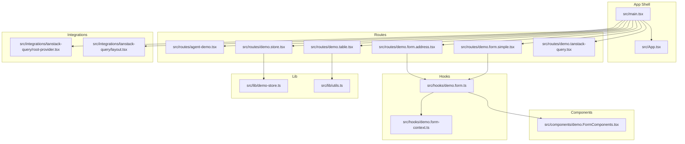
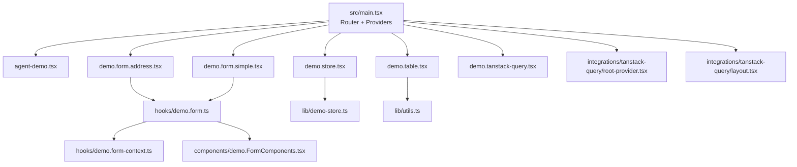
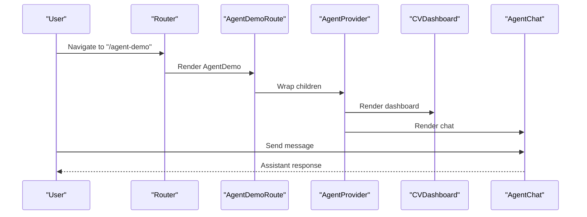
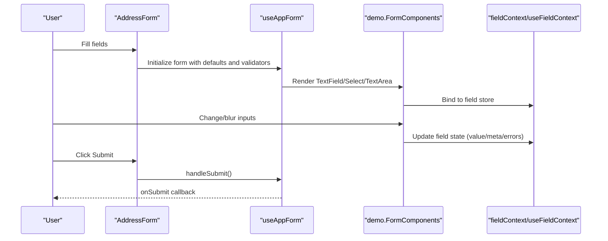
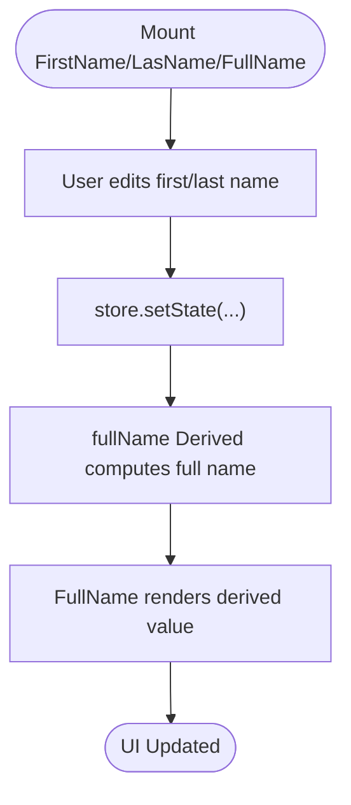
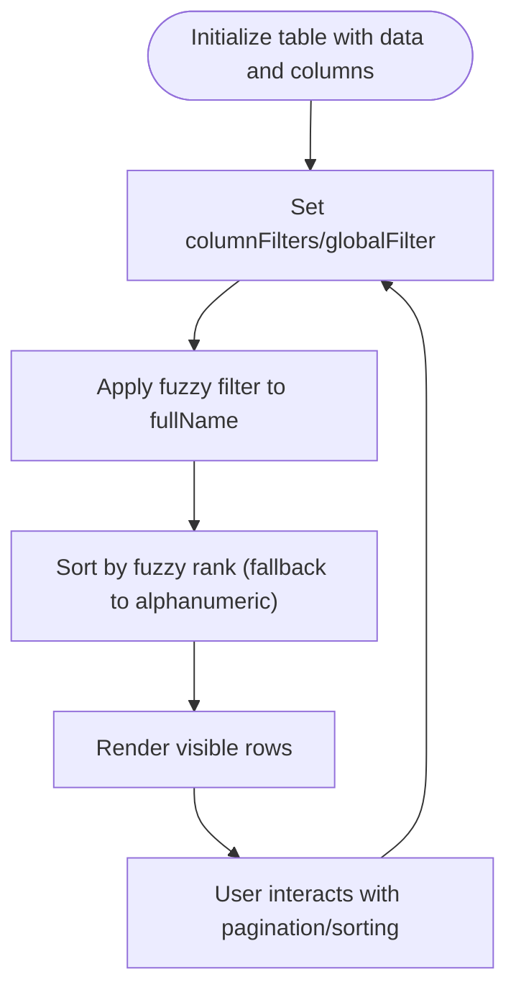
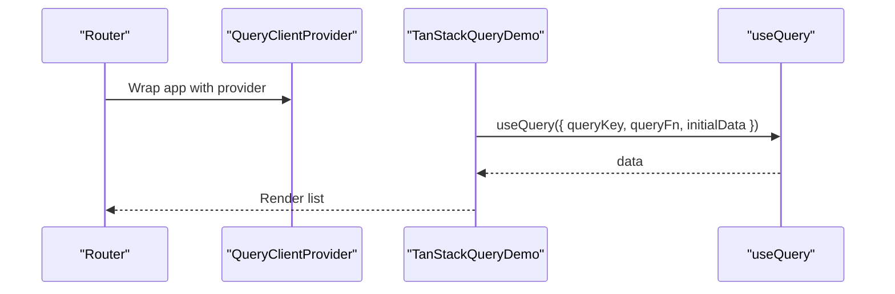
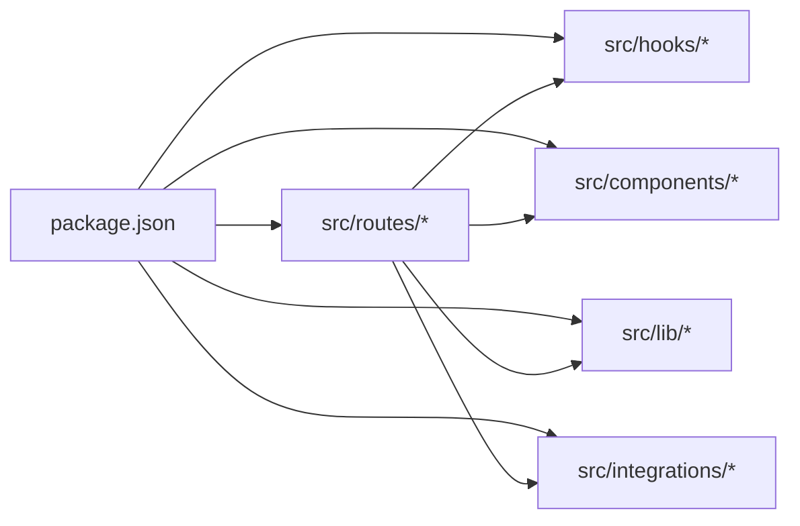

# Developer Tools & Examples

<cite>
**Referenced Files in This Document**
- [README.md](file://README.md)
- [package.json](file://package.json)
- [src/main.tsx](file://src/main.tsx)
- [src/App.tsx](file://src/App.tsx)
- [src/routes/agent-demo.tsx](file://src/routes/agent-demo.tsx)
- [src/routes/demo.form.address.tsx](file://src/routes/demo.form.address.tsx)
- [src/routes/demo.form.simple.tsx](file://src/routes/demo.form.simple.tsx)
- [src/routes/demo.store.tsx](file://src/routes/demo.store.tsx)
- [src/routes/demo.table.tsx](file://src/routes/demo.table.tsx)
- [src/routes/demo.tanstack-query.tsx](file://src/routes/demo.tanstack-query.tsx)
- [src/hooks/demo.form.ts](file://src/hooks/demo.form.ts)
- [src/hooks/demo.form-context.ts](file://src/hooks/demo.form-context.ts)
- [src/components/demo.FormComponents.tsx](file://src/components/demo.FormComponents.tsx)
- [src/lib/demo-store.ts](file://src/lib/demo-store.ts)
- [src/lib/utils.ts](file://src/lib/utils.ts)
- [src/integrations/tanstack-query/root-provider.tsx](file://src/integrations/tanstack-query/root-provider.tsx)
- [src/integrations/tanstack-query/layout.tsx](file://src/integrations/tanstack-query/layout.tsx)
</cite>

## Table of Contents
1. [Introduction](#introduction)
2. [Project Structure](#project-structure)
3. [Core Components](#core-components)
4. [Architecture Overview](#architecture-overview)
5. [Detailed Component Analysis](#detailed-component-analysis)
6. [Dependency Analysis](#dependency-analysis)
7. [Performance Considerations](#performance-considerations)
8. [Troubleshooting Guide](#troubleshooting-guide)
9. [Conclusion](#conclusion)
10. [Appendices](#appendices)

## Introduction
This document explains the Developer Tools and Example Systems that showcase CV Portfolio Builder capabilities. It covers:
- Demo routes for agent demonstrations, forms, state management, TanStack Table, and TanStack Query
- Custom form hooks and contexts for building reusable form components
- Utility libraries and helper functions
- Integrations with TanStack ecosystem components
- Practical usage patterns, state management approaches, and development workflows
- Guidance for extending the demo system and adding new examples
- Testing strategies and development best practices

## Project Structure
The demo system is organized around a small set of example routes and supporting utilities:
- Routes under src/routes define the demo pages
- Hooks under src/hooks encapsulate form logic and contexts
- Components under src/components provide reusable UI elements for demos
- Utilities under src/lib offer shared helpers
- Integrations under src/integrations show how to wire TanStack Query providers into the app

**Diagram sources**
- [src/main.tsx:1-89](file://src/main.tsx#L1-L89)
- [src/routes/agent-demo.tsx:1-138](file://src/routes/agent-demo.tsx#L1-L138)
- [src/routes/demo.form.address.tsx:1-200](file://src/routes/demo.form.address.tsx#L1-L200)
- [src/routes/demo.form.simple.tsx:1-69](file://src/routes/demo.form.simple.tsx#L1-L69)
- [src/routes/demo.store.tsx:1-62](file://src/routes/demo.store.tsx#L1-L62)
- [src/routes/demo.table.tsx:1-341](file://src/routes/demo.table.tsx#L1-L341)
- [src/routes/demo.tanstack-query.tsx:1-31](file://src/routes/demo.tanstack-query.tsx#L1-L31)
- [src/hooks/demo.form.ts:1-18](file://src/hooks/demo.form.ts#L1-L18)
- [src/hooks/demo.form-context.ts:1-5](file://src/hooks/demo.form-context.ts#L1-L5)
- [src/components/demo.FormComponents.tsx:1-159](file://src/components/demo.FormComponents.tsx#L1-L159)
- [src/lib/demo-store.ts:1-14](file://src/lib/demo-store.ts#L1-L14)
- [src/lib/utils.ts:1-8](file://src/lib/utils.ts#L1-L8)
- [src/integrations/tanstack-query/root-provider.tsx:1-14](file://src/integrations/tanstack-query/root-provider.tsx#L1-L14)
- [src/integrations/tanstack-query/layout.tsx](file://src/integrations/tanstack-query/layout.tsx)

**Section sources**
- [src/main.tsx:1-89](file://src/main.tsx#L1-L89)
- [README.md:493-543](file://README.md#L493-L543)

## Core Components
This section highlights the primary demo components and their roles.

- Agent Demo Route
  - Provides a dashboard and chat interface for an MCP-based skill agent managing CV and portfolio data
  - Demonstrates tool categories, memory, context, and AI service integration
  - See [src/routes/agent-demo.tsx:1-138](file://src/routes/agent-demo.tsx#L1-L138)

- Form Demo Routes
  - Address Form: nested object editing with field-level validation and submit handling
  - Simple Form: Zod schema validation with minimal fields
  - Both use a custom form hook and form components
  - See [src/routes/demo.form.address.tsx:1-200](file://src/routes/demo.form.address.tsx#L1-L200) and [src/routes/demo.form.simple.tsx:1-69](file://src/routes/demo.form.simple.tsx#L1-L69)

- State Management Demo
  - TanStack Store example with a derived full name from first/last name
  - See [src/routes/demo.store.tsx:1-62](file://src/routes/demo.store.tsx#L1-L62) and [src/lib/demo-store.ts:1-14](file://src/lib/demo-store.ts#L1-L14)

- Table Demo
  - TanStack Table with fuzzy filter and sort, pagination, and debounced inputs
  - See [src/routes/demo.table.tsx:1-341](file://src/routes/demo.table.tsx#L1-L341)

- TanStack Query Demo
  - Basic useQuery usage with a mock endpoint
  - See [src/routes/demo.tanstack-query.tsx:1-31](file://src/routes/demo.tanstack-query.tsx#L1-L31)

- Custom Form Hook and Context
  - A reusable form hook factory with field and form contexts
  - See [src/hooks/demo.form.ts:1-18](file://src/hooks/demo.form.ts#L1-L18) and [src/hooks/demo.form-context.ts:1-5](file://src/hooks/demo.form-context.ts#L1-L5)

- Form Components
  - Reusable field components (TextField, TextArea, Select, Slider, Switch) and a Submit button
  - See [src/components/demo.FormComponents.tsx:1-159](file://src/components/demo.FormComponents.tsx#L1-L159)

- Utilities
  - Tailwind merging helper
  - See [src/lib/utils.ts:1-8](file://src/lib/utils.ts#L1-L8)

- TanStack Query Integration
  - Provider and context injection into the router
  - See [src/integrations/tanstack-query/root-provider.tsx:1-14](file://src/integrations/tanstack-query/root-provider.tsx#L1-L14) and [src/main.tsx:56-65](file://src/main.tsx#L56-L65)

**Section sources**
- [src/routes/agent-demo.tsx:1-138](file://src/routes/agent-demo.tsx#L1-L138)
- [src/routes/demo.form.address.tsx:1-200](file://src/routes/demo.form.address.tsx#L1-L200)
- [src/routes/demo.form.simple.tsx:1-69](file://src/routes/demo.form.simple.tsx#L1-L69)
- [src/routes/demo.store.tsx:1-62](file://src/routes/demo.store.tsx#L1-L62)
- [src/routes/demo.table.tsx:1-341](file://src/routes/demo.table.tsx#L1-L341)
- [src/routes/demo.tanstack-query.tsx:1-31](file://src/routes/demo.tanstack-query.tsx#L1-L31)
- [src/hooks/demo.form.ts:1-18](file://src/hooks/demo.form.ts#L1-L18)
- [src/hooks/demo.form-context.ts:1-5](file://src/hooks/demo.form-context.ts#L1-L5)
- [src/components/demo.FormComponents.tsx:1-159](file://src/components/demo.FormComponents.tsx#L1-L159)
- [src/lib/demo-store.ts:1-14](file://src/lib/demo-store.ts#L1-L14)
- [src/lib/utils.ts:1-8](file://src/lib/utils.ts#L1-L8)
- [src/integrations/tanstack-query/root-provider.tsx:1-14](file://src/integrations/tanstack-query/root-provider.tsx#L1-L14)
- [src/main.tsx:56-65](file://src/main.tsx#L56-L65)

## Architecture Overview
The demo system composes multiple TanStack ecosystems:
- TanStack Router for routing and layout
- TanStack Form for declarative form handling with custom components
- TanStack Store for lightweight reactive state
- TanStack Table for advanced client-side data grids
- TanStack Query for data fetching and caching

**Diagram sources**
- [src/main.tsx:1-89](file://src/main.tsx#L1-L89)
- [src/routes/agent-demo.tsx:1-138](file://src/routes/agent-demo.tsx#L1-L138)
- [src/routes/demo.form.address.tsx:1-200](file://src/routes/demo.form.address.tsx#L1-L200)
- [src/routes/demo.form.simple.tsx:1-69](file://src/routes/demo.form.simple.tsx#L1-L69)
- [src/routes/demo.store.tsx:1-62](file://src/routes/demo.store.tsx#L1-L62)
- [src/routes/demo.table.tsx:1-341](file://src/routes/demo.table.tsx#L1-L341)
- [src/routes/demo.tanstack-query.tsx:1-31](file://src/routes/demo.tanstack-query.tsx#L1-L31)
- [src/hooks/demo.form.ts:1-18](file://src/hooks/demo.form.ts#L1-L18)
- [src/hooks/demo.form-context.ts:1-5](file://src/hooks/demo.form-context.ts#L1-L5)
- [src/components/demo.FormComponents.tsx:1-159](file://src/components/demo.FormComponents.tsx#L1-L159)
- [src/lib/demo-store.ts:1-14](file://src/lib/demo-store.ts#L1-L14)
- [src/lib/utils.ts:1-8](file://src/lib/utils.ts#L1-L8)
- [src/integrations/tanstack-query/root-provider.tsx:1-14](file://src/integrations/tanstack-query/root-provider.tsx#L1-L14)
- [src/integrations/tanstack-query/layout.tsx](file://src/integrations/tanstack-query/layout.tsx)

## Detailed Component Analysis

### Agent Demo Route
The agent demo route sets up a two-column layout with a dashboard and a chat interface. It documents available tools, memory, context, and AI service integration.

**Diagram sources**
- [src/routes/agent-demo.tsx:17-137](file://src/routes/agent-demo.tsx#L17-L137)

**Section sources**
- [src/routes/agent-demo.tsx:1-138](file://src/routes/agent-demo.tsx#L1-L138)

### Form Handling with Custom Hooks and Components
The form system uses a custom form hook factory to bind field components and contexts. Field components integrate with TanStack Form’s field store to manage value, touch, and errors.

**Diagram sources**
- [src/routes/demo.form.address.tsx:7-39](file://src/routes/demo.form.address.tsx#L7-L39)
- [src/hooks/demo.form.ts:6-17](file://src/hooks/demo.form.ts#L6-L17)
- [src/hooks/demo.form-context.ts:3-4](file://src/hooks/demo.form-context.ts#L3-L4)
- [src/components/demo.FormComponents.tsx:41-59](file://src/components/demo.FormComponents.tsx#L41-L59)

**Section sources**
- [src/routes/demo.form.address.tsx:1-200](file://src/routes/demo.form.address.tsx#L1-L200)
- [src/routes/demo.form.simple.tsx:1-69](file://src/routes/demo.form.simple.tsx#L1-L69)
- [src/hooks/demo.form.ts:1-18](file://src/hooks/demo.form.ts#L1-L18)
- [src/hooks/demo.form-context.ts:1-5](file://src/hooks/demo.form-context.ts#L1-L5)
- [src/components/demo.FormComponents.tsx:1-159](file://src/components/demo.FormComponents.tsx#L1-L159)

### State Management with TanStack Store
The store demo shows a simple store with a derived value. Components subscribe to store slices for reactive updates.

**Diagram sources**
- [src/routes/demo.store.tsx:8-35](file://src/routes/demo.store.tsx#L8-L35)
- [src/lib/demo-store.ts:3-14](file://src/lib/demo-store.ts#L3-L14)

**Section sources**
- [src/routes/demo.store.tsx:1-62](file://src/routes/demo.store.tsx#L1-L62)
- [src/lib/demo-store.ts:1-14](file://src/lib/demo-store.ts#L1-L14)

### TanStack Table with Fuzzy Filter and Sort
The table demo demonstrates:
- Custom fuzzy filter and sort functions
- Global and per-column filters
- Pagination controls
- Debounced input for responsive filtering

**Diagram sources**
- [src/routes/demo.table.tsx:38-64](file://src/routes/demo.table.tsx#L38-L64)
- [src/routes/demo.table.tsx:106-126](file://src/routes/demo.table.tsx#L106-L126)
- [src/routes/demo.table.tsx:293-333](file://src/routes/demo.table.tsx#L293-L333)

**Section sources**
- [src/routes/demo.table.tsx:1-341](file://src/routes/demo.table.tsx#L1-L341)

### TanStack Query Integration
The demo route uses useQuery to fetch data and render a list. The provider is injected at the root via router context and provider wrapper.

**Diagram sources**
- [src/routes/demo.tanstack-query.tsx:6-23](file://src/routes/demo.tanstack-query.tsx#L6-L23)
- [src/integrations/tanstack-query/root-provider.tsx:11-13](file://src/integrations/tanstack-query/root-provider.tsx#L11-L13)
- [src/main.tsx:78-80](file://src/main.tsx#L78-L80)

**Section sources**
- [src/routes/demo.tanstack-query.tsx:1-31](file://src/routes/demo.tanstack-query.tsx#L1-L31)
- [src/integrations/tanstack-query/root-provider.tsx:1-14](file://src/integrations/tanstack-query/root-provider.tsx#L1-L14)
- [src/main.tsx:56-65](file://src/main.tsx#L56-L65)

## Dependency Analysis
The demo system relies on TanStack ecosystem packages and shared utilities.

**Diagram sources**
- [package.json:15-43](file://package.json#L15-L43)

**Section sources**
- [package.json:15-43](file://package.json#L15-L43)

## Performance Considerations
- TanStack Table
  - Prefer virtualization for very large datasets
  - Keep filter/sort computations efficient; the fuzzy filter uses ranking utilities
  - Use debounced inputs to avoid excessive re-renders during typing
- TanStack Store
  - Use derived stores for computed values to minimize recomputations
  - Keep state flat and granular to reduce unnecessary re-renders
- TanStack Query
  - Configure stale times and cache behavior appropriately
  - Use structural sharing and preloading to improve UX
- Forms
  - Validate on blur to reduce submission overhead
  - Use field-level contexts to scope subscriptions

## Troubleshooting Guide
- Form Validation Not Triggering
  - Ensure validators are attached to the correct field names and events
  - Verify field components are bound to the field context
  - Check that submit handlers call the form’s submit handler
  - References:
    - [src/routes/demo.form.address.tsx:21-39](file://src/routes/demo.form.address.tsx#L21-L39)
    - [src/routes/demo.form.simple.tsx:19-27](file://src/routes/demo.form.simple.tsx#L19-L27)
    - [src/components/demo.FormComponents.tsx:41-59](file://src/components/demo.FormComponents.tsx#L41-L59)

- Table Filtering/Sorting Issues
  - Confirm custom filter/sort functions are registered and applied
  - Ensure global filter uses the same fuzzy function as configured
  - References:
    - [src/routes/demo.table.tsx:38-64](file://src/routes/demo.table.tsx#L38-L64)
    - [src/routes/demo.table.tsx:106-126](file://src/routes/demo.table.tsx#L106-L126)

- TanStack Query Not Working
  - Verify provider is rendered and context is passed to the router
  - Check that query keys are unique and query functions resolve
  - References:
    - [src/integrations/tanstack-query/root-provider.tsx:11-13](file://src/integrations/tanstack-query/root-provider.tsx#L11-L13)
    - [src/main.tsx:78-80](file://src/main.tsx#L78-L80)
    - [src/main.tsx:56-65](file://src/main.tsx#L56-L65)

- Store Updates Not Reflecting
  - Ensure derived stores are mounted
  - Confirm subscription selectors target the right state slices
  - References:
    - [src/lib/demo-store.ts:13](file://src/lib/demo-store.ts#L13)
    - [src/routes/demo.store.tsx:33](file://src/routes/demo.store.tsx#L33)

## Conclusion
The Developer Tools and Example Systems provide a comprehensive, modular foundation for building forms, managing state, rendering tables, and integrating TanStack Query. The custom form hook and components enable consistent, reusable patterns. The agent demo illustrates a cohesive architecture combining tools, memory, context, and AI services. These examples serve as a blueprint for extending the system with new demos and features.

## Appendices

### How to Extend the Demo System
- Add a New Demo Route
  - Create a new route file under src/routes and export a function that creates a route with a path and component
  - Reference existing patterns:
    - [src/routes/demo.form.address.tsx:194-200](file://src/routes/demo.form.address.tsx#L194-L200)
    - [src/routes/demo.store.tsx:56-62](file://src/routes/demo.store.tsx#L56-L62)
- Integrate TanStack Query
  - Provide a QueryClient via the integration provider and include it in router context
  - Reference:
    - [src/integrations/tanstack-query/root-provider.tsx:1-14](file://src/integrations/tanstack-query/root-provider.tsx#L1-L14)
    - [src/main.tsx:56-65](file://src/main.tsx#L56-L65)
- Build Custom Form Components
  - Use the form hook factory and field contexts to create reusable components
  - Reference:
    - [src/hooks/demo.form.ts:6-17](file://src/hooks/demo.form.ts#L6-L17)
    - [src/components/demo.FormComponents.tsx:13-24](file://src/components/demo.FormComponents.tsx#L13-L24)

### Testing Strategies and Best Practices
- Use Vitest for unit and integration tests
- Test form validation by simulating user interactions and asserting error messages
- For TanStack Table, snapshot test visible rows after applying filters/sorts
- For TanStack Query, mock query functions and assert rendered data
- For TanStack Store, test derived values by updating base state and verifying computed results
- Follow ESLint and Prettier configurations for code quality and consistency
- References:
  - [README.md:20-27](file://README.md#L20-L27)
  - [README.md:32-40](file://README.md#L32-L40)
  - [package.json:5,10-14](file://package.json#L5,L10-L14)