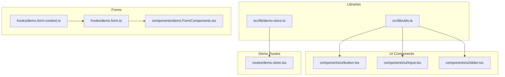
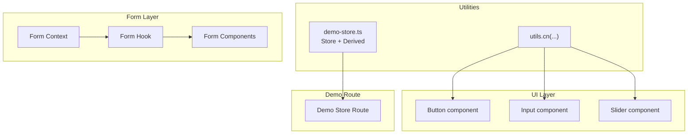
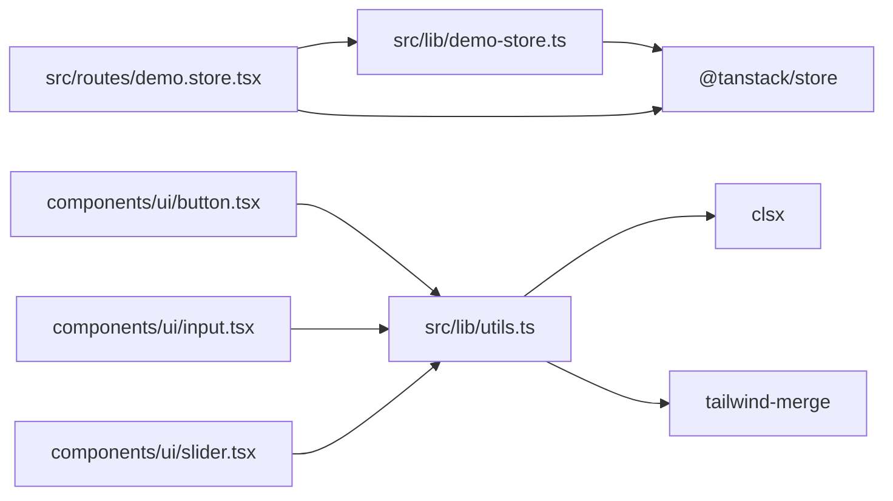

# Utility Libraries & Helper Functions

<cite>
**Referenced Files in This Document**
- [utils.ts](file://src/lib/utils.ts)
- [demo-store.ts](file://src/lib/demo-store.ts)
- [demo.store.tsx](file://src/routes/demo.store.tsx)
- [demo.FormComponents.tsx](file://src/components/demo.FormComponents.tsx)
- [demo.form.ts](file://src/hooks/demo.form.ts)
- [demo.form-context.ts](file://src/hooks/demo.form-context.ts)
- [package.json](file://package.json)
- [README.md](file://README.md)
</cite>

## Table of Contents
1. [Introduction](#introduction)
2. [Project Structure](#project-structure)
3. [Core Components](#core-components)
4. [Architecture Overview](#architecture-overview)
5. [Detailed Component Analysis](#detailed-component-analysis)
6. [Dependency Analysis](#dependency-analysis)
7. [Performance Considerations](#performance-considerations)
8. [Troubleshooting Guide](#troubleshooting-guide)
9. [Conclusion](#conclusion)
10. [Appendices](#appendices)

## Introduction
This document explains the utility libraries and helper functions that support CV Portfolio Builder development. It focuses on:
- The shared utility library for class merging and Tailwind CSS integration
- The demonstration state management pattern using TanStack Store
- Practical usage patterns, integration points, and performance considerations
- Best practices for extending the utility library with new functions

The goal is to make these utilities accessible to developers of varying experience levels while preserving code correctness and maintainability.

## Project Structure
The utility-focused files reside under the src/lib directory and are integrated across UI components, forms, and demonstration routes.

**Diagram sources**
- [utils.ts:1-8](file://src/lib/utils.ts#L1-L8)
- [demo-store.ts:1-14](file://src/lib/demo-store.ts#L1-L14)
- [demo.store.tsx:1-62](file://src/routes/demo.store.tsx#L1-L62)
- [demo.form-context.ts:1-5](file://src/hooks/demo.form-context.ts#L1-L5)
- [demo.form.ts:1-18](file://src/hooks/demo.form.ts#L1-L18)
- [demo.FormComponents.tsx:1-159](file://src/components/demo.FormComponents.tsx#L1-L159)

**Section sources**
- [utils.ts:1-8](file://src/lib/utils.ts#L1-L8)
- [demo-store.ts:1-14](file://src/lib/demo-store.ts#L1-L14)
- [demo.store.tsx:1-62](file://src/routes/demo.store.tsx#L1-L62)
- [demo.form-context.ts:1-5](file://src/hooks/demo.form-context.ts#L1-L5)
- [demo.form.ts:1-18](file://src/hooks/demo.form.ts#L1-L18)
- [demo.FormComponents.tsx:1-159](file://src/components/demo.FormComponents.tsx#L1-L159)

## Core Components
This section documents the primary utility libraries and their roles.

- utils.ts: Provides a single utility function for merging and deduplicating Tailwind CSS classes.
- demo-store.ts: Demonstrates a minimal TanStack Store setup with a derived value for computed state.

**Section sources**
- [utils.ts:1-8](file://src/lib/utils.ts#L1-L8)
- [demo-store.ts:1-14](file://src/lib/demo-store.ts#L1-L14)

## Architecture Overview
The utilities integrate with UI components and form systems to provide consistent styling and state management patterns.

**Diagram sources**
- [utils.ts:1-8](file://src/lib/utils.ts#L1-L8)
- [demo-store.ts:1-14](file://src/lib/demo-store.ts#L1-L14)
- [demo.store.tsx:1-62](file://src/routes/demo.store.tsx#L1-L62)
- [demo.form-context.ts:1-5](file://src/hooks/demo.form-context.ts#L1-L5)
- [demo.form.ts:1-18](file://src/hooks/demo.form.ts#L1-L18)
- [demo.FormComponents.tsx:1-159](file://src/components/demo.FormComponents.tsx#L1-L159)

## Detailed Component Analysis

### utils.ts: Tailwind Class Merging Utility
Purpose:
- Merge and deduplicate Tailwind CSS classes while respecting precedence rules.

Function signature:
- Name: cn
- Parameters: variadic list of class inputs compatible with clsx
- Return type: merged and deduplicated class string
- Dependencies: clsx, tailwind-merge

Usage context:
- Applied in UI components to compose dynamic class names consistently.

Integration pattern:
- Components import cn from the shared utility and pass computed or conditional class lists.

Practical examples:
- Button component composes variants and sizes with optional overrides.
- Input, Slider, and other form controls merge base styles with contextual modifiers.

Performance considerations:
- Minimal overhead; function executes during render but is optimized by the underlying libraries.
- Prefer passing only necessary class inputs to avoid unnecessary concatenation.

Extensibility:
- New utility functions should remain pure and side-effect free.
- Keep signatures simple and leverage existing type definitions for consistency.

**Section sources**
- [utils.ts:1-8](file://src/lib/utils.ts#L1-L8)
- [package.json:36-43](file://package.json#L36-L43)

### demo-store.ts: Demonstration State Management Pattern
Purpose:
- Demonstrate a minimal TanStack Store setup with derived state.

Key elements:
- A root Store holding primitive fields (first name, last name).
- A Derived store computing a full name from the root store.
- Automatic mounting of the derived store to keep it reactive.

Function signatures and behavior:
- store: instance of Store with initial state
- fullName: instance of Derived computing a derived string from store state
- Mounting: derived store is mounted to react to state changes

Integration pattern:
- Components subscribe to store updates via a React Store hook.
- Derived values are accessed as if they were part of the store’s state.

Practical examples:
- Demo route renders inputs for first and last name and displays the derived full name.
- Updates to either input trigger a recomputation of the full name.

Performance considerations:
- Derived stores are efficient; they only recompute when dependencies change.
- Mounting/unmounting derived stores helps manage lifecycle and memory.

Extensibility:
- Add more derived values by creating additional Derived instances with appropriate dependencies.
- Encapsulate related state slices into separate stores for scalability.

**Section sources**
- [demo-store.ts:1-14](file://src/lib/demo-store.ts#L1-L14)
- [demo.store.tsx:1-62](file://src/routes/demo.store.tsx#L1-L62)

### Form Utilities and Patterns
While not a dedicated utility file, the form system demonstrates reusable patterns that complement the utility library.

Key elements:
- Form context creation for field and form-level state.
- A form hook that registers field components and form components.
- Reusable form components (TextField, TextArea, Select, Slider, Switch) that integrate with field stores.

Integration pattern:
- Field components subscribe to their field store for validation and error messages.
- Form components use subscription to control submission state.

Practical examples:
- Components render labels, inputs, and error messages based on field state.
- Form hook centralizes registration and context wiring.

Performance considerations:
- Subscriptions are scoped to individual fields, minimizing re-renders.
- Avoid unnecessary subscriptions by keeping selectors focused.

Extensibility:
- Add new field types by registering them in the form hook and exporting corresponding components.
- Extend validation and metadata handling through field store state.

**Section sources**
- [demo.form-context.ts:1-5](file://src/hooks/demo.form-context.ts#L1-L5)
- [demo.form.ts:1-18](file://src/hooks/demo.form.ts#L1-L18)
- [demo.FormComponents.tsx:1-159](file://src/components/demo.FormComponents.tsx#L1-L159)

## Dependency Analysis
The utility libraries depend on external packages for class merging and state management.

**Diagram sources**
- [utils.ts:1-8](file://src/lib/utils.ts#L1-L8)
- [demo-store.ts:1-14](file://src/lib/demo-store.ts#L1-L14)
- [demo.store.tsx:1-62](file://src/routes/demo.store.tsx#L1-L62)
- [package.json:36-43](file://package.json#L36-L43)

**Section sources**
- [package.json:36-43](file://package.json#L36-L43)
- [utils.ts:1-8](file://src/lib/utils.ts#L1-L8)
- [demo-store.ts:1-14](file://src/lib/demo-store.ts#L1-L14)

## Performance Considerations
- Class merging:
  - Keep class lists concise; avoid excessive concatenation in hot paths.
  - Prefer conditional class objects or arrays to reduce string operations.
- State management:
  - Use derived stores judiciously; mount only when needed and unmount when appropriate.
  - Ensure dependencies are minimal to prevent unnecessary recomputations.
- Forms:
  - Scope subscriptions to the smallest relevant state slice.
  - Debounce expensive validations to improve responsiveness.

## Troubleshooting Guide
Common issues and resolutions:
- Incorrect Tailwind classes:
  - Verify that cn receives valid class inputs and that precedence is as expected.
  - Confirm that tailwind-merge is installed and functioning.
- Derived store not updating:
  - Ensure the derived store is mounted and depends on the correct stores.
  - Check that state updates occur via the store’s setState mechanism.
- Form field errors not visible:
  - Confirm that field components subscribe to the correct store state.
  - Verify that error messages are rendered conditionally based on field metadata.

**Section sources**
- [utils.ts:1-8](file://src/lib/utils.ts#L1-L8)
- [demo-store.ts:1-14](file://src/lib/demo-store.ts#L1-L14)
- [demo.store.tsx:1-62](file://src/routes/demo.store.tsx#L1-L62)
- [demo.FormComponents.tsx:1-159](file://src/components/demo.FormComponents.tsx#L1-L159)

## Conclusion
The utility libraries provide lightweight, reusable building blocks for styling and state management:
- utils.ts offers a reliable way to merge Tailwind classes across UI components.
- demo-store.ts illustrates a clean, minimal pattern for derived state using TanStack Store.
Together with the form utilities, they establish consistent, maintainable patterns for building the CV Portfolio Builder.

## Appendices

### Function Reference: utils.cn
- Purpose: Merge and deduplicate Tailwind CSS classes.
- Signature: cn(...inputs: ClassValue[]): string
- Usage: Pass class names or conditional expressions; returns a single class string.
- Example usage locations:
  - Button component composition
  - Input component composition
  - Slider component composition

**Section sources**
- [utils.ts:1-8](file://src/lib/utils.ts#L1-L8)

### Function Reference: TanStack Store (demo-store.ts)
- Purpose: Demonstrate state management with derived values.
- Store: new Store(initialState)
- Derived: new Derived({ fn, deps })
- Mounting: derivedStore.mount()

**Section sources**
- [demo-store.ts:1-14](file://src/lib/demo-store.ts#L1-L14)

### Integration Examples
- UI components:
  - Apply cn to compose base, variant, and size classes.
- Demo route:
  - Subscribe to store and derived values to reflect real-time updates.
- Form components:
  - Use field stores to manage validation and error rendering.

**Section sources**
- [demo.store.tsx:1-62](file://src/routes/demo.store.tsx#L1-L62)
- [demo.FormComponents.tsx:1-159](file://src/components/demo.FormComponents.tsx#L1-L159)
- [demo.form.ts:1-18](file://src/hooks/demo.form.ts#L1-L18)
- [demo.form-context.ts:1-5](file://src/hooks/demo.form-context.ts#L1-L5)