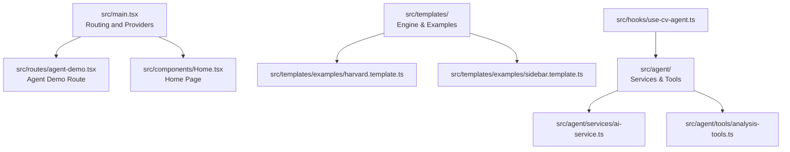
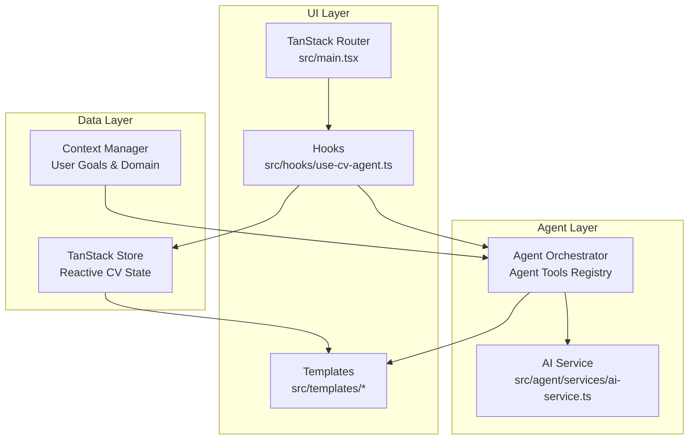
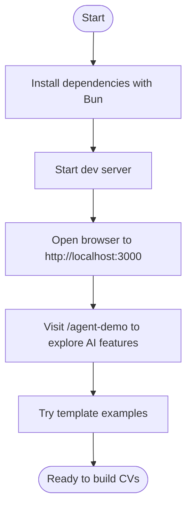
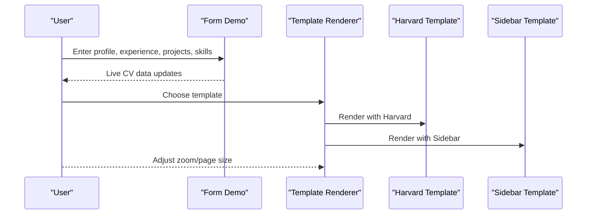
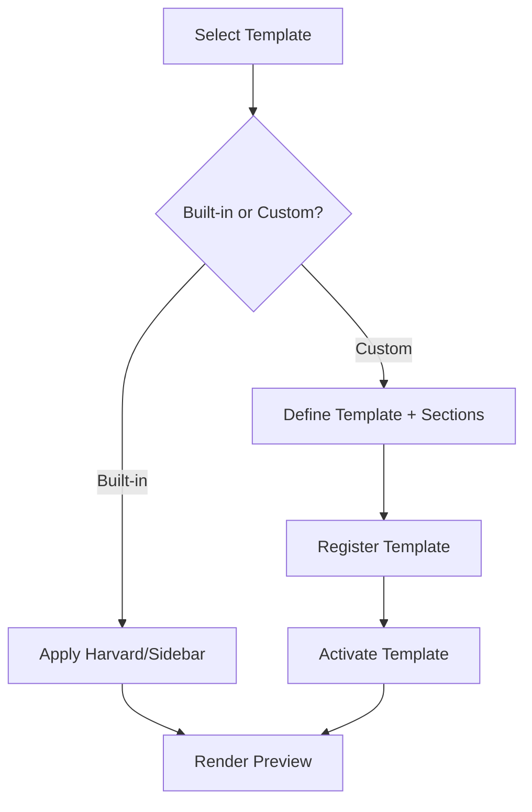
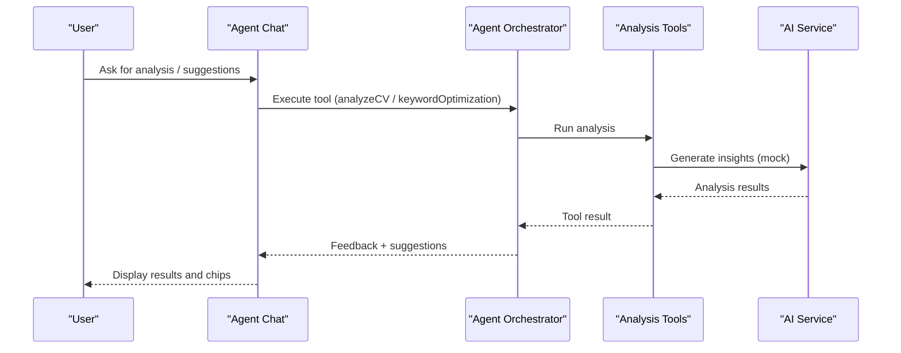
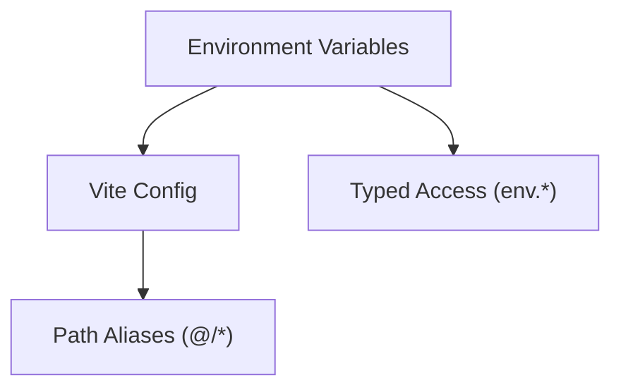
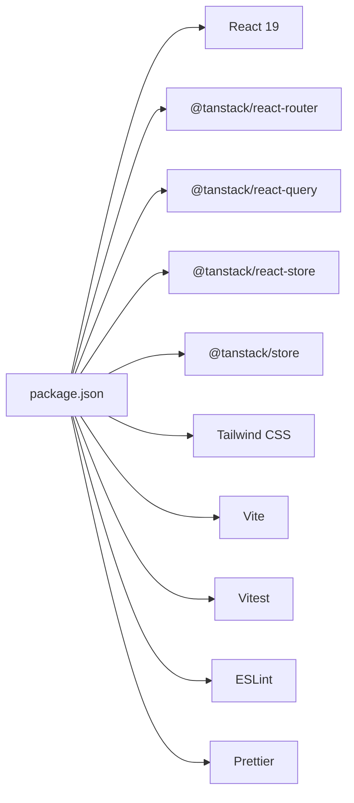

# Getting Started

<cite>
**Referenced Files in This Document**
- [README.md](file://README.md)
- [package.json](file://package.json)
- [vite.config.js](file://vite.config.js)
- [tsconfig.json](file://tsconfig.json)
- [src/main.tsx](file://src/main.tsx)
- [src/env.ts](file://src/env.ts)
- [src/components/Home.tsx](file://src/components/Home.tsx)
- [src/routes/agent-demo.tsx](file://src/routes/agent-demo.tsx)
- [RESUME_TEMPLATE_QUICKSTART.md](file://RESUME_TEMPLATE_QUICKSTART.md)
- [SKILL_AGENT_QUICKSTART.md](file://SKILL_AGENT_QUICKSTART.md)
- [src/agent/services/ai-service.ts](file://src/agent/services/ai-service.ts)
- [src/agent/tools/analysis-tools.ts](file://src/agent/tools/analysis-tools.ts)
- [src/hooks/use-cv-agent.ts](file://src/hooks/use-cv-agent.ts)
- [src/templates/examples/harvard.template.ts](file://src/templates/examples/harvard.template.ts)
- [src/templates/examples/sidebar.template.ts](file://src/templates/examples/sidebar.template.ts)
</cite>

## Table of Contents
1. [Introduction](#introduction)
2. [Project Structure](#project-structure)
3. [Core Components](#core-components)
4. [Architecture Overview](#architecture-overview)
5. [Detailed Component Analysis](#detailed-component-analysis)
6. [Dependency Analysis](#dependency-analysis)
7. [Performance Considerations](#performance-considerations)
8. [Troubleshooting Guide](#troubleshooting-guide)
9. [Conclusion](#conclusion)
10. [Appendices](#appendices)

## Introduction
This guide helps you quickly set up and use the CV Portfolio Builder, a modern web application for creating and customizing CVs and portfolios. It features:
- Live CV builder with real-time preview
- Multiple customizable templates (academic and modern)
- AI-powered analysis and suggestions
- Portfolio project sections
- Export to HTML/PDF and shareable links
- Local data persistence

The project is built with React 19, Vite, Bun, Tailwind CSS, and integrates TanStack Router, TanStack Query, and TanStack Store for routing, data fetching/state, and UI components.

## Project Structure
High-level structure and responsibilities:
- src/main.tsx: Application entry and routing setup
- src/components/: Shared UI components
- src/templates/: Template engine, sections, themes, and rendering
- src/agent/: AI agent, tools, memory, and orchestration
- src/hooks/: React hooks for CV agent and data access
- vite.config.js: Vite build and dev server configuration
- package.json: Scripts, dependencies, and devDependencies

**Diagram sources**
- [src/main.tsx:1-89](file://src/main.tsx#L1-L89)
- [src/routes/agent-demo.tsx:1-138](file://src/routes/agent-demo.tsx#L1-L138)
- [src/components/Home.tsx:1-49](file://src/components/Home.tsx#L1-L49)
- [src/templates/examples/harvard.template.ts:1-52](file://src/templates/examples/harvard.template.ts#L1-L52)
- [src/templates/examples/sidebar.template.ts:1-55](file://src/templates/examples/sidebar.template.ts#L1-L55)
- [src/agent/services/ai-service.ts:1-174](file://src/agent/services/ai-service.ts#L1-L174)
- [src/agent/tools/analysis-tools.ts:1-291](file://src/agent/tools/analysis-tools.ts#L1-L291)
- [src/hooks/use-cv-agent.ts:1-185](file://src/hooks/use-cv-agent.ts#L1-L185)

**Section sources**
- [README.md:501-543](file://README.md#L501-L543)
- [src/main.tsx:1-89](file://src/main.tsx#L1-L89)
- [vite.config.js:1-28](file://vite.config.js#L1-L28)

## Core Components
- Template Engine: Provides reusable templates and rendering pipeline for CVs
- AI Agent: Offers analysis, suggestions, and AI-driven enhancements
- Hooks: Reactive access to CV data, agent tools, and session stats
- Routing: TanStack Router-based code-first routing with optional file-based migration

Key capabilities:
- Preview and export CVs with customizable templates
- AI-powered analysis and keyword optimization
- Interactive dashboard and chat interface for guided editing

**Section sources**
- [RESUME_TEMPLATE_QUICKSTART.md:1-481](file://RESUME_TEMPLATE_QUICKSTART.md#L1-L481)
- [SKILL_AGENT_QUICKSTART.md:1-356](file://SKILL_AGENT_QUICKSTART.md#L1-L356)
- [src/agent/services/ai-service.ts:1-174](file://src/agent/services/ai-service.ts#L1-L174)
- [src/agent/tools/analysis-tools.ts:1-291](file://src/agent/tools/analysis-tools.ts#L1-L291)
- [src/hooks/use-cv-agent.ts:1-185](file://src/hooks/use-cv-agent.ts#L1-L185)

## Architecture Overview
The application combines a front-end template engine with an AI agent orchestrator. The routing layer exposes demo pages, including the agent demo with dashboard and chat.

**Diagram sources**
- [src/main.tsx:1-89](file://src/main.tsx#L1-L89)
- [src/hooks/use-cv-agent.ts:1-185](file://src/hooks/use-cv-agent.ts#L1-L185)
- [src/agent/services/ai-service.ts:1-174](file://src/agent/services/ai-service.ts#L1-L174)
- [src/agent/tools/analysis-tools.ts:1-291](file://src/agent/tools/analysis-tools.ts#L1-L291)

## Detailed Component Analysis

### Development Workflow
Follow these steps to install and run the project locally:
1. Install dependencies using Bun
2. Start the development server
3. Open the application in your browser
4. Explore the agent demo and template examples

**Section sources**
- [README.md:5-10](file://README.md#L5-L10)
- [package.json:5-14](file://package.json#L5-L14)
- [src/main.tsx:73-83](file://src/main.tsx#L73-L83)

### Quick Start: Create a Basic CV
Steps to create and preview a CV:
1. Navigate to the form demo to enter your profile, experience, projects, and skills
2. Switch between templates (Harvard or Sidebar) to preview different layouts
3. Adjust zoom, page size, and fullscreen mode for print-friendly viewing

**Section sources**
- [RESUME_TEMPLATE_QUICKSTART.md:20-127](file://RESUME_TEMPLATE_QUICKSTART.md#L20-L127)
- [src/templates/examples/harvard.template.ts:1-52](file://src/templates/examples/harvard.template.ts#L1-L52)
- [src/templates/examples/sidebar.template.ts:1-55](file://src/templates/examples/sidebar.template.ts#L1-L55)

### Quick Start: Customize Templates
You can:
- Use pre-built templates and themes
- Create custom templates with specific layouts and section ordering
- Register custom templates and manage categories/tags

**Section sources**
- [RESUME_TEMPLATE_QUICKSTART.md:131-287](file://RESUME_TEMPLATE_QUICKSTART.md#L131-L287)

### AI-Powered Analysis and Suggestions
The agent provides:
- CV completeness scoring
- Full analysis with strengths/weaknesses/recommendations
- Keyword optimization for ATS
- Consistency checks between skills, projects, and experience
- Interactive chat with suggestion chips

**Diagram sources**
- [src/routes/agent-demo.tsx:17-137](file://src/routes/agent-demo.tsx#L17-L137)
- [src/agent/tools/analysis-tools.ts:13-141](file://src/agent/tools/analysis-tools.ts#L13-L141)
- [src/agent/services/ai-service.ts:77-126](file://src/agent/services/ai-service.ts#L77-L126)

**Section sources**
- [SKILL_AGENT_QUICKSTART.md:1-356](file://SKILL_AGENT_QUICKSTART.md#L1-L356)
- [src/agent/tools/analysis-tools.ts:1-291](file://src/agent/tools/analysis-tools.ts#L1-L291)
- [src/agent/services/ai-service.ts:1-174](file://src/agent/services/ai-service.ts#L1-L174)

### Environment Variables and Configuration
- Environment variables are typed and validated using T3Env
- Client variables must start with VITE_
- The project uses Vite with React, Tailwind CSS, and Module Federation

**Section sources**
- [src/env.ts:1-40](file://src/env.ts#L1-L40)
- [vite.config.js:15-20](file://vite.config.js#L15-L20)
- [tsconfig.json:23-26](file://tsconfig.json#L23-L26)

## Dependency Analysis
Key runtime and development dependencies:
- Runtime: React 19, TanStack Router, TanStack Query, TanStack Store, Radix UI, Tailwind CSS
- Build: Vite, TypeScript, Bun, Module Federation
- Dev tools: ESLint, Prettier, Vitest

**Diagram sources**
- [package.json:15-58](file://package.json#L15-L58)

**Section sources**
- [package.json:1-60](file://package.json#L1-L60)
- [README.md:515-524](file://README.md#L515-L524)

## Performance Considerations
- Use memoized section components to avoid unnecessary re-renders
- Subscribe to specific parts of the CV state to minimize updates
- Test print modes and optimize templates for print
- Consider lazy-loading heavy templates and debouncing rapid UI changes

**Section sources**
- [RESUME_TEMPLATE_QUICKSTART.md:421-446](file://RESUME_TEMPLATE_QUICKSTART.md#L421-L446)

## Troubleshooting Guide
Common setup and runtime issues:
- Tools not executing: Ensure the AgentProvider wraps your app
- Data not persisting: Check browser localStorage availability
- Chat not responding: Refresh the page to reset state
- Low completeness score: Add more experiences, projects, and skills
- Template not rendering: Verify template ID, CV data presence, and section imports
- Styles not applying: Confirm CSS variables, Tailwind config, and theme structure

**Section sources**
- [SKILL_AGENT_QUICKSTART.md:313-331](file://SKILL_AGENT_QUICKSTART.md#L313-L331)
- [RESUME_TEMPLATE_QUICKSTART.md:449-468](file://RESUME_TEMPLATE_QUICKSTART.md#L449-L468)

## Conclusion
You now have the essentials to install, run, and extend the CV Portfolio Builder. Start with the agent demo to explore AI-powered suggestions, switch templates to fit your style, and use the template engine to build a polished CV or portfolio. For deeper customization, refer to the template and agent quick start guides.

## Appendices

### Installation Requirements
- Bun: Package manager and runtime
- Node.js: Not required at runtime; Bun handles builds and scripts
- Package manager: Bun commands are used for install, dev, build, and test

**Section sources**
- [README.md:5-10](file://README.md#L5-L10)
- [package.json:5-14](file://package.json#L5-L14)

### First Run Checklist
- Install dependencies: bun install
- Start dev server: bun run dev
- Visit: http://localhost:3000
- Explore: /agent-demo for AI features
- Try: Template examples and controls

**Section sources**
- [README.md:5-10](file://README.md#L5-L10)
- [src/main.tsx:73-83](file://src/main.tsx#L73-L83)
- [src/components/Home.tsx:16-29](file://src/components/Home.tsx#L16-L29)